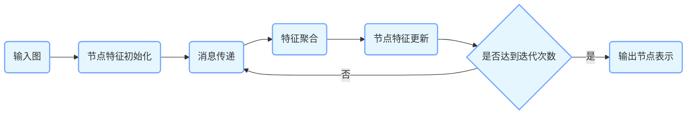

# 图神经网络在时变知识图谱推理中的进展

> 关键词：图神经网络、时变知识图谱、知识图谱推理、深度学习、人工智能

> 摘要：本文聚焦于图神经网络在时变知识图谱推理中的进展。首先介绍了时变知识图谱推理的背景和相关概念，包括其目的、范围、预期读者等。接着详细阐述了核心概念，如知识图谱、图神经网络等的原理和架构，并给出相应的文本示意图和 Mermaid 流程图。深入探讨了用于时变知识图谱推理的核心算法原理，通过 Python 代码进行具体说明。同时，介绍了相关的数学模型和公式，并举例说明其应用。通过项目实战展示了如何在实际中运用这些技术，包括开发环境搭建、源代码实现和代码解读。分析了时变知识图谱推理的实际应用场景，推荐了相关的学习资源、开发工具框架以及论文著作。最后总结了未来的发展趋势与挑战，并提供了常见问题的解答和扩展阅读的参考资料，旨在为该领域的研究和实践提供全面而深入的指导。

## 1. 背景介绍 
### 1.1 目的和范围
时变知识图谱推理是知识图谱领域的一个重要研究方向。知识图谱作为一种结构化的语义网络，用于表示实体之间的关系，在信息检索、问答系统、智能推荐等多个领域有着广泛的应用。然而，现实世界中的知识是动态变化的，随着时间的推移，实体之间的关系可能会发生改变，新的实体和关系也可能会不断涌现。因此，时变知识图谱应运而生，它能够捕捉知识随时间的变化。

本文的目的是全面探讨图神经网络在时变知识图谱推理中的进展。具体范围包括介绍时变知识图谱推理的相关概念、核心算法原理、数学模型，通过实际案例展示其应用，分析其实际应用场景，推荐相关的学习资源和开发工具，以及探讨未来的发展趋势和挑战。

### 1.2 预期读者
本文的预期读者包括从事人工智能、机器学习、知识图谱等领域研究的科研人员，希望深入了解图神经网络在时变知识图谱推理中应用的研究生和本科生，以及对该领域有兴趣并希望将其应用于实际项目的企业开发者。

### 1.3 文档结构概述
本文将按照以下结构进行组织：
1. **背景介绍**：阐述时变知识图谱推理的目的、范围、预期读者和文档结构概述，并给出相关术语的定义和解释。
2. **核心概念与联系**：介绍知识图谱、图神经网络等核心概念的原理和架构，给出文本示意图和 Mermaid 流程图。
3. **核心算法原理 & 具体操作步骤**：详细讲解用于时变知识图谱推理的核心算法原理，并使用 Python 代码进行具体说明。
4. **数学模型和公式 & 详细讲解 & 举例说明**：介绍相关的数学模型和公式，并通过具体例子说明其应用。
5. **项目实战：代码实际案例和详细解释说明**：展示如何搭建开发环境，实现源代码，并对代码进行解读和分析。
6. **实际应用场景**：分析时变知识图谱推理在不同领域的实际应用场景。
7. **工具和资源推荐**：推荐相关的学习资源、开发工具框架和论文著作。
8. **总结：未来发展趋势与挑战**：总结图神经网络在时变知识图谱推理中的未来发展趋势和面临的挑战。
9. **附录：常见问题与解答**：解答读者在学习和实践过程中可能遇到的常见问题。
10. **扩展阅读 & 参考资料**：提供相关的扩展阅读材料和参考资料。

### 1.4 术语表
#### 1.4.1 核心术语定义
- **知识图谱（Knowledge Graph）**：一种以图的形式表示知识的结构化数据模型，由实体（节点）和关系（边）组成，用于描述现实世界中的各种事物及其之间的关系。
- **时变知识图谱（Temporal Knowledge Graph）**：在知识图谱的基础上，增加了时间维度，能够记录实体之间关系随时间的变化。
- **图神经网络（Graph Neural Network，GNN）**：一类专门处理图结构数据的神经网络，通过消息传递机制在图的节点和边上进行信息传播和聚合，从而学习节点和图的表示。
- **知识图谱推理（Knowledge Graph Reasoning）**：根据知识图谱中已有的信息，推断出新的事实或关系的过程。

#### 1.4.2 相关概念解释
- **实体（Entity）**：知识图谱中的节点，表示现实世界中的具体事物，如人、地点、组织等。
- **关系（Relation）**：知识图谱中的边，表示实体之间的联系，如“出生于”、“工作于”等。
- **时间戳（Timestamp）**：时变知识图谱中用于记录关系发生时间的标识。
- **消息传递机制（Message Passing Mechanism）**：图神经网络中用于在节点之间传递信息的机制，通过邻居节点的特征信息更新当前节点的特征表示。

#### 1.4.3 缩略词列表
- **GNN**：Graph Neural Network（图神经网络）
- **TKG**：Temporal Knowledge Graph（时变知识图谱）

## 2. 核心概念与联系 

### 知识图谱
知识图谱是一种语义网络，它以图的形式表示知识。在知识图谱中，实体用节点表示，关系用边表示。例如，在一个关于人物的知识图谱中，“张三”和“李四”可以是两个实体，用节点表示，而“朋友”关系可以用连接这两个节点的边表示。知识图谱的主要目的是通过结构化的方式组织和表示知识，以便于计算机进行处理和推理。

下面是知识图谱的文本示意图：
```plaintext
实体1 (节点1) --[关系1]--> 实体2 (节点2)
实体2 (节点2) --[关系2]--> 实体3 (节点3)
...
```

### 时变知识图谱
时变知识图谱是在知识图谱的基础上引入了时间维度。它不仅记录了实体之间的关系，还记录了这些关系发生的时间。例如，在一个时变知识图谱中，“张三”和“李四”在 2020 年是朋友关系，而在 2021 年变成了同事关系。时变知识图谱能够更好地反映现实世界中知识的动态变化。

时变知识图谱的文本示意图如下：
```plaintext
实体1 (节点1) --[关系1, 时间戳1]--> 实体2 (节点2)
实体2 (节点2) --[关系2, 时间戳2]--> 实体3 (节点3)
...
```

### 图神经网络
图神经网络是一类专门处理图结构数据的神经网络。它通过消息传递机制在图的节点和边上进行信息传播和聚合，从而学习节点和图的表示。图神经网络的基本思想是每个节点通过与其邻居节点的交互来更新自己的特征表示。

图神经网络的 Mermaid 流程图如下：


### 图神经网络与知识图谱推理的联系
图神经网络可以用于知识图谱推理，特别是在时变知识图谱推理中具有很大的优势。通过图神经网络，我们可以学习到实体和关系的表示，从而利用这些表示进行推理。例如，我们可以根据已知的实体和关系，预测在某个时间点两个实体之间是否存在某种关系。

## 3. 核心算法原理 & 具体操作步骤 

### 核心算法原理
在时变知识图谱推理中，常用的图神经网络算法包括基于时间感知的图卷积网络（Temporal Graph Convolutional Network，TGCN）等。TGCN 的核心思想是在图卷积网络的基础上引入时间信息，通过时间卷积来捕捉关系随时间的变化。

下面是 TGCN 的核心步骤：
1. **节点特征初始化**：为每个节点分配一个初始特征向量。
2. **消息传递**：每个节点根据其邻居节点的特征和关系信息，生成消息。
3. **时间卷积**：对每个节点的消息进行时间卷积，以捕捉时间信息。
4. **特征聚合**：将经过时间卷积后的消息聚合到当前节点。
5. **节点特征更新**：根据聚合后的消息更新当前节点的特征。

### 具体操作步骤（Python 代码实现）
以下是一个简单的基于 PyTorch 实现的 TGCN 代码示例：

```python
import torch
import torch.nn as nn
import torch.nn.functional as F

class TGCN(nn.Module):
    def __init__(self, in_features, out_features, time_steps):
        super(TGCN, self).__init__()
        self.in_features = in_features
        self.out_features = out_features
        self.time_steps = time_steps
        self.conv1d = nn.Conv1d(in_channels=in_features, out_channels=out_features, kernel_size=time_steps)

    def forward(self, x, adj):
        # x: [batch_size, num_nodes, in_features, time_steps]
        # adj: [batch_size, num_nodes, num_nodes]
        batch_size, num_nodes, _, _ = x.size()
        # 消息传递
        messages = []
        for i in range(num_nodes):
            neighbor_features = torch.matmul(adj[:, i, :].unsqueeze(-1), x)
            messages.append(neighbor_features)
        messages = torch.stack(messages, dim=1)
        # 时间卷积
        messages = messages.permute(0, 1, 3, 2).contiguous()
        messages = messages.view(-1, self.in_features, self.time_steps)
        convolved_messages = self.conv1d(messages)
        convolved_messages = convolved_messages.view(batch_size, num_nodes, self.out_features)
        # 节点特征更新
        x = F.relu(convolved_messages)
        return x
```

### 代码解释
1. **初始化**：在 `__init__` 方法中，我们定义了输入特征的维度 `in_features`、输出特征的维度 `out_features` 和时间步数 `time_steps`，并初始化了一个一维卷积层 `conv1d`。
2. **前向传播**：在 `forward` 方法中，我们首先进行消息传递，通过邻接矩阵 `adj` 计算每个节点的邻居特征。然后对消息进行时间卷积，最后使用 ReLU 激活函数更新节点的特征。

## 4. 数学模型和公式 & 详细讲解 & 举例说明 

### 图卷积网络的基本公式
图卷积网络（GCN）的基本公式如下：
$$
H^{(l+1)} = \sigma(\tilde{D}^{-\frac{1}{2}}\tilde{A}\tilde{D}^{-\frac{1}{2}}H^{(l)}W^{(l)})
$$
其中：
- $H^{(l)}$ 是第 $l$ 层的节点特征矩阵，形状为 $[N, F^{(l)}]$，$N$ 是节点数量，$F^{(l)}$ 是第 $l$ 层的特征维度。
- $\tilde{A} = A + I$ 是邻接矩阵 $A$ 加上自环后的矩阵，$I$ 是单位矩阵。
- $\tilde{D}$ 是 $\tilde{A}$ 的度矩阵，即 $\tilde{D}_{ii} = \sum_{j}\tilde{A}_{ij}$。
- $W^{(l)}$ 是第 $l$ 层的可学习权重矩阵，形状为 $[F^{(l)}, F^{(l+1)}]$。
- $\sigma$ 是激活函数，如 ReLU 函数。

### 时间感知的图卷积网络（TGCN）的公式
在 TGCN 中，我们在 GCN 的基础上引入了时间信息。假设 $x_{i,t}$ 是节点 $i$ 在时间 $t$ 的特征向量，$A_{i,j}$ 是邻接矩阵中节点 $i$ 和节点 $j$ 之间的边的权重，$W$ 是可学习的权重矩阵，$b$ 是偏置项。则 TGCN 的消息传递和特征更新公式如下：

#### 消息传递
$$
m_{i,t} = \sum_{j \in N(i)} A_{i,j} x_{j,t}
$$
其中 $N(i)$ 是节点 $i$ 的邻居节点集合。

#### 时间卷积
$$
\tilde{m}_{i} = \text{Conv1D}(m_{i,1}, m_{i,2}, \cdots, m_{i,T})
$$
其中 $\text{Conv1D}$ 是一维卷积操作，$T$ 是时间步数。

#### 节点特征更新
$$
x_{i,t+1} = \sigma(\tilde{m}_{i}W + b)
$$

### 举例说明
假设我们有一个简单的时变知识图谱，包含 3 个节点和 2 个时间步。节点特征矩阵 $H^{(0)}$ 如下：
$$
H^{(0)} = \begin{bmatrix}
1 & 2 \\
3 & 4 \\
5 & 6
\end{bmatrix}
$$
邻接矩阵 $A$ 如下：
$$
A = \begin{bmatrix}
0 & 1 & 0 \\
1 & 0 & 1 \\
0 & 1 & 0
\end{bmatrix}
$$
可学习的权重矩阵 $W^{(0)}$ 如下：
$$
W^{(0)} = \begin{bmatrix}
0.1 & 0.2 \\
0.3 & 0.4
\end{bmatrix}
$$

首先，我们计算 $\tilde{A} = A + I$：
$$
\tilde{A} = \begin{bmatrix}
1 & 1 & 0 \\
1 & 1 & 1 \\
0 & 1 & 1
\end{bmatrix}
$$
然后计算 $\tilde{D}$：
$$
\tilde{D} = \begin{bmatrix}
2 & 0 & 0 \\
0 & 3 & 0 \\
0 & 0 & 2
\end{bmatrix}
$$
接着计算 $\tilde{D}^{-\frac{1}{2}}$：
$$
\tilde{D}^{-\frac{1}{2}} = \begin{bmatrix}
\frac{1}{\sqrt{2}} & 0 & 0 \\
0 & \frac{1}{\sqrt{3}} & 0 \\
0 & 0 & \frac{1}{\sqrt{2}}
\end{bmatrix}
$$
再计算 $\tilde{D}^{-\frac{1}{2}}\tilde{A}\tilde{D}^{-\frac{1}{2}}$：
$$
\tilde{D}^{-\frac{1}{2}}\tilde{A}\tilde{D}^{-\frac{1}{2}} = \begin{bmatrix}
\frac{1}{2} & \frac{1}{\sqrt{6}} & 0 \\
\frac{1}{\sqrt{6}} & \frac{1}{3} & \frac{1}{\sqrt{6}} \\
0 & \frac{1}{\sqrt{6}} & \frac{1}{2}
\end{bmatrix}
$$
最后计算 $H^{(1)}$：
$$
H^{(1)} = \sigma(\tilde{D}^{-\frac{1}{2}}\tilde{A}\tilde{D}^{-\frac{1}{2}}H^{(0)}W^{(0)})
$$

通过以上步骤，我们可以得到更新后的节点特征矩阵 $H^{(1)}$。

## 5. 项目实战：代码实际案例和详细解释说明 

### 5.1  开发环境搭建
#### 安装 Python
首先，确保你已经安装了 Python 3.6 或更高版本。你可以从 Python 官方网站（https://www.python.org/downloads/）下载并安装 Python。

#### 安装 PyTorch
使用以下命令安装 PyTorch：
```sh
pip install torch torchvision
```
具体的安装命令可能会因你的操作系统和 CUDA 版本而有所不同。请参考 PyTorch 官方网站（https://pytorch.org/get-started/locally/）获取详细的安装指南。

#### 安装其他依赖库
还需要安装一些其他的依赖库，如 `numpy`、`scikit-learn` 等：
```sh
pip install numpy scikit-learn
```

### 5.2  源代码详细实现和代码解读
以下是一个完整的时变知识图谱推理项目的代码示例：

```python
import torch
import torch.nn as nn
import torch.nn.functional as F
import numpy as np
from sklearn.model_selection import train_test_split

# 定义 TGCN 模型
class TGCN(nn.Module):
    def __init__(self, in_features, out_features, time_steps):
        super(TGCN, self).__init__()
        self.in_features = in_features
        self.out_features = out_features
        self.time_steps = time_steps
        self.conv1d = nn.Conv1d(in_channels=in_features, out_channels=out_features, kernel_size=time_steps)

    def forward(self, x, adj):
        # x: [batch_size, num_nodes, in_features, time_steps]
        # adj: [batch_size, num_nodes, num_nodes]
        batch_size, num_nodes, _, _ = x.size()
        # 消息传递
        messages = []
        for i in range(num_nodes):
            neighbor_features = torch.matmul(adj[:, i, :].unsqueeze(-1), x)
            messages.append(neighbor_features)
        messages = torch.stack(messages, dim=1)
        # 时间卷积
        messages = messages.permute(0, 1, 3, 2).contiguous()
        messages = messages.view(-1, self.in_features, self.time_steps)
        convolved_messages = self.conv1d(messages)
        convolved_messages = convolved_messages.view(batch_size, num_nodes, self.out_features)
        # 节点特征更新
        x = F.relu(convolved_messages)
        return x

# 生成示例数据
def generate_data(num_nodes, in_features, time_steps, num_samples):
    x = np.random.randn(num_samples, num_nodes, in_features, time_steps)
    adj = np.random.randint(0, 2, size=(num_samples, num_nodes, num_nodes))
    y = np.random.randint(0, 2, size=(num_samples, num_nodes))
    return x, adj, y

# 训练模型
def train_model(model, x_train, adj_train, y_train, num_epochs, learning_rate):
    criterion = nn.CrossEntropyLoss()
    optimizer = torch.optim.Adam(model.parameters(), lr=learning_rate)

    for epoch in range(num_epochs):
        inputs = torch.FloatTensor(x_train)
        adj = torch.FloatTensor(adj_train)
        labels = torch.LongTensor(y_train)

        optimizer.zero_grad()
        outputs = model(inputs, adj)
        outputs = outputs.view(-1, outputs.size(-1))
        labels = labels.view(-1)
        loss = criterion(outputs, labels)
        loss.backward()
        optimizer.step()

        if (epoch + 1) % 10 == 0:
            print(f'Epoch [{epoch+1}/{num_epochs}], Loss: {loss.item():.4f}')

# 主函数
if __name__ == '__main__':
    num_nodes = 10
    in_features = 5
    time_steps = 3
    num_samples = 100
    out_features = 2

    x, adj, y = generate_data(num_nodes, in_features, time_steps, num_samples)
    x_train, x_test, adj_train, adj_test, y_train, y_test = train_test_split(x, adj, y, test_size=0.2, random_state=42)

    model = TGCN(in_features, out_features, time_steps)
    train_model(model, x_train, adj_train, y_train, num_epochs=100, learning_rate=0.001)
```

### 5.3  代码解读与分析
#### 数据生成
`generate_data` 函数用于生成示例数据，包括节点特征矩阵 `x`、邻接矩阵 `adj` 和标签 `y`。

#### 模型定义
`TGCN` 类定义了时间感知的图卷积网络模型，包括消息传递、时间卷积和节点特征更新等步骤。

#### 训练模型
`train_model` 函数用于训练模型，使用交叉熵损失函数和 Adam 优化器。在每个 epoch 中，我们将输入数据转换为 PyTorch 张量，前向传播计算输出，计算损失，反向传播更新模型参数。

#### 主函数
在主函数中，我们首先生成数据，然后将数据划分为训练集和测试集。接着初始化模型并调用 `train_model` 函数进行训练。

## 6. 实际应用场景 
### 金融领域
在金融领域，时变知识图谱推理可以用于风险评估和预测。例如，通过构建包含企业、金融机构、市场等实体的时变知识图谱，可以分析企业之间的关联关系、市场动态等信息。利用图神经网络进行推理，可以预测企业的信用风险、市场趋势等，帮助金融机构做出更明智的决策。

### 医疗领域
在医疗领域，时变知识图谱推理可以用于疾病诊断和治疗方案推荐。通过构建包含患者、疾病、药物等实体的时变知识图谱，可以记录患者的病史、病情变化等信息。利用图神经网络进行推理，可以根据患者的当前状况和历史信息，预测疾病的发展趋势，推荐合适的治疗方案。

### 社交网络领域
在社交网络领域，时变知识图谱推理可以用于用户行为预测和推荐系统。通过构建包含用户、兴趣、社交关系等实体的时变知识图谱，可以记录用户的行为和兴趣变化。利用图神经网络进行推理，可以预测用户的未来行为，如是否会关注某个话题、是否会购买某个产品等，从而为用户提供个性化的推荐。

### 交通领域
在交通领域，时变知识图谱推理可以用于交通流量预测和交通规划。通过构建包含道路、车辆、交通设施等实体的时变知识图谱，可以记录交通流量的变化、交通事故等信息。利用图神经网络进行推理，可以预测未来的交通流量，为交通规划和管理提供决策支持。

## 7. 工具和资源推荐
### 7.1 学习资源推荐
#### 7.1.1 书籍推荐
- 《深度学习》（Deep Learning）：由 Ian Goodfellow、Yoshua Bengio 和 Aaron Courville 所著，是深度学习领域的经典教材，涵盖了神经网络、卷积神经网络、循环神经网络等多个方面的内容。
- 《图神经网络：基础、前沿与应用》：系统介绍了图神经网络的基本原理、算法和应用，适合对图神经网络感兴趣的读者。

#### 7.1.2 在线课程
- Coursera 上的“深度学习专项课程”（Deep Learning Specialization）：由 Andrew Ng 教授授课，包括神经网络和深度学习、改善深层神经网络、结构化机器学习项目、卷积神经网络、序列模型等多个课程。
- edX 上的“图神经网络：算法与应用”（Graph Neural Networks: Algorithms and Applications）：详细介绍了图神经网络的算法和应用。

#### 7.1.3 技术博客和网站
- Medium 上的 Towards Data Science：有许多关于人工智能、机器学习和深度学习的技术文章，包括图神经网络和知识图谱的相关内容。
- arXiv.org：是一个预印本平台，提供了大量最新的学术研究论文，包括图神经网络在时变知识图谱推理方面的研究成果。

### 7.2 开发工具框架推荐
#### 7.2.1 IDE和编辑器
- PyCharm：是一款专门为 Python 开发设计的集成开发环境，具有代码编辑、调试、版本控制等功能。
- Jupyter Notebook：是一个交互式的开发环境，适合进行数据分析、模型训练和代码演示。

#### 7.2.2 调试和性能分析工具
- PyTorch Profiler：是 PyTorch 提供的性能分析工具，可以帮助开发者分析模型的运行时间、内存使用等情况。
- TensorBoard：是 TensorFlow 提供的可视化工具，也可以与 PyTorch 结合使用，用于可视化模型的训练过程和性能指标。

#### 7.2.3 相关框架和库
- PyTorch Geometric：是一个基于 PyTorch 的图神经网络库，提供了丰富的图神经网络模型和工具，方便开发者进行图神经网络的开发和实验。
- DGL（Deep Graph Library）：是一个用于图神经网络的深度学习框架，支持多种深度学习框架，如 PyTorch、TensorFlow 等。

### 7.3 相关论文著作推荐
#### 7.3.1 经典论文
- “Semi-Supervised Classification with Graph Convolutional Networks”：介绍了图卷积网络（GCN）的基本原理和算法，是图神经网络领域的经典论文。
- “Temporal Graph Networks for Deep Learning on Dynamic Graphs”：提出了时间图神经网络（TGN）的概念，用于处理动态图数据。

#### 7.3.2 最新研究成果
- 可以通过 arXiv.org、ACM Digital Library、IEEE Xplore 等学术数据库搜索最新的关于图神经网络在时变知识图谱推理方面的研究论文。

#### 7.3.3 应用案例分析
- 一些顶级学术会议，如 KDD（Knowledge Discovery and Data Mining）、ICML（International Conference on Machine Learning）等，会有关于图神经网络在不同领域应用的案例分析论文，可以从中学习到实际应用中的经验和技巧。

## 8. 总结：未来发展趋势与挑战
### 未来发展趋势
#### 更复杂的模型结构
未来的图神经网络模型可能会采用更复杂的结构，以更好地捕捉时变知识图谱中的复杂信息。例如，引入注意力机制、记忆网络等，提高模型的表达能力和推理能力。

#### 多模态融合
将图神经网络与其他模态的数据（如图像、文本、语音等）进行融合，能够更全面地表示和推理时变知识图谱。例如，在医疗领域，可以将患者的病历文本、影像数据与知识图谱相结合，提高疾病诊断的准确性。

#### 可解释性增强
随着图神经网络在关键领域的应用越来越广泛，模型的可解释性变得越来越重要。未来的研究将致力于提高图神经网络在时变知识图谱推理中的可解释性，使模型的决策过程更加透明和可理解。

#### 大规模应用
随着计算能力的不断提升和数据量的不断增加，图神经网络在时变知识图谱推理中的大规模应用将成为可能。例如，在工业互联网、智慧城市等领域，构建大规模的时变知识图谱并进行推理，为决策提供支持。

### 挑战
#### 数据质量和标注
时变知识图谱的数据质量和标注是一个挑战。由于现实世界中的数据往往存在噪声、不完整等问题，需要进行数据清洗和预处理。同时，为了训练模型，需要大量的标注数据，这需要耗费大量的人力和时间。

#### 计算资源需求
图神经网络的训练和推理通常需要大量的计算资源，特别是在处理大规模时变知识图谱时。如何有效地利用计算资源，提高模型的训练和推理效率，是一个亟待解决的问题。

#### 模型的可扩展性
随着时变知识图谱的规模不断增大，模型的可扩展性成为一个挑战。如何设计能够处理大规模图数据的模型结构和算法，是未来研究的一个重要方向。

#### 隐私和安全
在时变知识图谱推理中，涉及到大量的敏感数据，如用户的个人信息、企业的商业机密等。如何保证数据的隐私和安全，防止数据泄露和滥用，是一个需要关注的问题。

## 9. 附录：常见问题与解答
### 问题 1：图神经网络和传统神经网络有什么区别？
图神经网络是专门处理图结构数据的神经网络，而传统神经网络通常处理的是欧几里得空间的数据（如图像、文本等）。图神经网络通过消息传递机制在图的节点和边上进行信息传播和聚合，能够捕捉图数据中的结构信息和关系信息，而传统神经网络则没有这种机制。

### 问题 2：时变知识图谱和普通知识图谱有什么区别？
时变知识图谱在普通知识图谱的基础上引入了时间维度，能够记录实体之间关系随时间的变化。而普通知识图谱只记录了实体之间的静态关系，不考虑时间因素。

### 问题 3：如何评估图神经网络在时变知识图谱推理中的性能？
可以使用准确率、召回率、F1 值等指标来评估图神经网络在时变知识图谱推理中的性能。同时，还可以使用一些特定的评估指标，如平均倒数排名（Mean Reciprocal Rank，MRR）、命中率（Hit@k）等，来评估模型在知识图谱推理任务中的表现。

### 问题 4：图神经网络在时变知识图谱推理中的训练时间通常需要多久？
训练时间取决于多个因素，如图的规模、模型的复杂度、计算资源等。在处理小规模图数据时，训练时间可能较短；而在处理大规模图数据时，训练时间可能会很长，甚至需要使用分布式计算来加速训练过程。

### 问题 5：如何选择合适的图神经网络模型用于时变知识图谱推理？
选择合适的图神经网络模型需要考虑多个因素，如图的类型（有向图、无向图等）、数据的特点（是否有时间信息等）、任务的需求（分类、预测等）等。可以通过实验比较不同模型的性能，选择最适合的模型。

## 10. 扩展阅读 & 参考资料
### 扩展阅读
- “Graph Representation Learning”：这本书详细介绍了图表示学习的方法和技术，包括图神经网络的原理和应用。
- “Knowledge Graphs: Methodology, Tools and Selected Applications”：全面介绍了知识图谱的构建方法、工具和应用案例。

### 参考资料
- Goodfellow, I., Bengio, Y., & Courville, A. (2016). Deep Learning. MIT Press.
- Kipf, T. N., & Welling, M. (2016). Semi-Supervised Classification with Graph Convolutional Networks. arXiv preprint arXiv:1609.02907.
- Rossi, E., Chamberlain, B., & Frasca, F. (2020). Temporal Graph Networks for Deep Learning on Dynamic Graphs. arXiv preprint arXiv:2006.10637.

作者：AI天才研究院/AI Genius Institute & 禅与计算机程序设计艺术 /Zen And The Art of Computer Programming