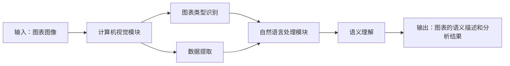

# 图表理解技术：增强AI Agent的数据分析能力

> 关键词：图表理解技术、AI Agent、数据分析能力、计算机视觉、自然语言处理

> 摘要：本文围绕图表理解技术展开，旨在探讨如何通过该技术增强AI Agent的数据分析能力。首先介绍了图表理解技术的背景，包括其目的、预期读者、文档结构和相关术语。接着阐述了核心概念与联系，给出了原理和架构的文本示意图与Mermaid流程图。详细讲解了核心算法原理和具体操作步骤，并结合Python源代码进行说明。还分析了数学模型和公式，通过举例加深理解。在项目实战部分，展示了代码实际案例并进行详细解释。随后探讨了实际应用场景，推荐了学习资源、开发工具框架和相关论文著作。最后总结了未来发展趋势与挑战，提供了常见问题解答和扩展阅读参考资料，为相关领域的研究和实践提供了全面且深入的指导。

## 1. 背景介绍 
### 1.1 目的和范围
在当今数字化时代，数据以各种形式呈现，图表作为一种直观、高效的数据可视化方式，被广泛应用于各个领域。然而，AI Agent在处理图表数据时面临诸多挑战，如难以准确识别图表类型、理解图表中的数据含义和关系等。本文章的目的在于深入探讨图表理解技术，详细介绍如何运用该技术增强AI Agent的数据分析能力，使AI Agent能够像人类一样准确理解图表所传达的信息。文章的范围涵盖了图表理解技术的核心概念、算法原理、数学模型、项目实战、实际应用场景以及相关工具和资源推荐等方面。

### 1.2 预期读者
本文预期读者包括计算机科学、人工智能、数据分析等领域的研究人员、开发者和从业者。对于正在学习图表理解技术和AI Agent相关知识的学生和初学者，本文也提供了系统且详细的学习资料，帮助他们深入理解该领域的核心内容。

### 1.3 文档结构概述
本文将按照以下结构进行阐述：首先介绍背景信息，包括目的、预期读者和文档结构等。接着讲解核心概念与联系，通过文本示意图和Mermaid流程图展示图表理解技术的原理和架构。然后详细分析核心算法原理和具体操作步骤，并结合Python源代码进行说明。之后介绍数学模型和公式，通过实际例子加深读者的理解。在项目实战部分，将展示代码实际案例并进行详细解释。随后探讨实际应用场景，推荐相关的学习资源、开发工具框架和论文著作。最后总结未来发展趋势与挑战，提供常见问题解答和扩展阅读参考资料。

### 1.4 术语表
#### 1.4.1 核心术语定义
- **图表理解技术**：指让计算机能够识别、分析和解释图表（如柱状图、折线图、饼图等）中所包含信息的技术，包括图表类型识别、数据提取、语义理解等方面。
- **AI Agent**：是一种能够感知环境、自主决策并采取行动以实现特定目标的智能实体，在本文中主要指具备图表理解和数据分析能力的智能程序。
- **数据分析能力**：指对数据进行收集、清理、转换、分析和解释，以发现有价值信息和知识的能力。

#### 1.4.2 相关概念解释
- **计算机视觉**：是一门研究如何使机器“看”的科学，通过图像处理、模式识别等技术，让计算机能够理解和解释图像和视频中的内容，在图表理解中用于图表的识别和数据提取。
- **自然语言处理**：是研究人与计算机之间用自然语言进行有效通信的各种理论和方法，在图表理解中用于将图表中的数据信息转化为自然语言描述，以便更好地进行语义理解。

#### 1.4.3 缩略词列表
- **CNN**：卷积神经网络（Convolutional Neural Network），是一种常用于图像识别和处理的深度学习模型。
- **RNN**：循环神经网络（Recurrent Neural Network），是一种能够处理序列数据的神经网络，常用于自然语言处理任务。
- **NLP**：自然语言处理（Natural Language Processing）。

## 2. 核心概念与联系 

### 核心概念原理
图表理解技术的核心原理是将计算机视觉和自然语言处理技术相结合，对图表进行识别、分析和解释。具体来说，它包括以下几个步骤：
1. **图表类型识别**：通过计算机视觉技术，对输入的图表图像进行分析，判断其属于哪种类型的图表，如柱状图、折线图、饼图等。
2. **数据提取**：从图表中提取出具体的数据信息，例如柱状图中柱子的高度、折线图中各点的坐标等。
3. **语义理解**：利用自然语言处理技术，将提取的数据信息转化为自然语言描述，理解图表所传达的语义信息，例如比较不同数据之间的大小关系、趋势变化等。

### 架构的文本示意图
```plaintext
输入：图表图像
|
|-- 计算机视觉模块
|   |-- 图表类型识别
|   |-- 数据提取
|
|-- 自然语言处理模块
|   |-- 语义理解
|
输出：图表的语义描述和分析结果
```

### Mermaid流程图


## 3. 核心算法原理 & 具体操作步骤 

### 核心算法原理
#### 图表类型识别
在图表类型识别中，我们可以使用卷积神经网络（CNN）。CNN是一种专门用于处理具有网格结构数据（如图像）的深度学习模型，它通过卷积层、池化层和全连接层等结构，自动提取图像的特征，并进行分类。以下是一个简单的Python代码示例，使用Keras库构建一个简单的CNN模型进行图表类型识别：

```python
import tensorflow as tf
from tensorflow.keras import layers, models

# 构建CNN模型
model = models.Sequential()
model.add(layers.Conv2D(32, (3, 3), activation='relu', input_shape=(150, 150, 3)))
model.add(layers.MaxPooling2D((2, 2)))
model.add(layers.Conv2D(64, (3, 3), activation='relu'))
model.add(layers.MaxPooling2D((2, 2)))
model.add(layers.Conv2D(128, (3, 3), activation='relu'))
model.add(layers.MaxPooling2D((2, 2)))
model.add(layers.Flatten())
model.add(layers.Dense(128, activation='relu'))
model.add(layers.Dense(3, activation='softmax'))  # 假设识别三种图表类型

# 编译模型
model.compile(optimizer='adam',
              loss='categorical_crossentropy',
              metrics=['accuracy'])

# 打印模型结构
model.summary()
```

#### 数据提取
对于数据提取，我们可以使用图像处理技术，如边缘检测、轮廓检测等。以下是一个简单的Python代码示例，使用OpenCV库进行边缘检测：

```python
import cv2
import numpy as np

# 读取图表图像
image = cv2.imread('chart.jpg', 0)

# 进行边缘检测
edges = cv2.Canny(image, 50, 150)

# 显示结果
cv2.imshow('Edges', edges)
cv2.waitKey(0)
cv2.destroyAllWindows()
```

#### 语义理解
在语义理解中，我们可以使用循环神经网络（RNN）或其变体（如LSTM、GRU）。以下是一个简单的Python代码示例，使用Keras库构建一个简单的LSTM模型进行语义理解：

```python
from tensorflow.keras.preprocessing.text import Tokenizer
from tensorflow.keras.preprocessing.sequence import pad_sequences
from tensorflow.keras.models import Sequential
from tensorflow.keras.layers import Embedding, LSTM, Dense

# 示例数据
texts = ['The value of A is greater than B', 'The trend of C is increasing']
labels = [1, 0]

# 分词
tokenizer = Tokenizer(num_words=1000)
tokenizer.fit_on_texts(texts)
sequences = tokenizer.texts_to_sequences(texts)

# 填充序列
max_length = 20
padded_sequences = pad_sequences(sequences, maxlen=max_length)

# 构建LSTM模型
model = Sequential()
model.add(Embedding(1000, 128, input_length=max_length))
model.add(LSTM(128))
model.add(Dense(1, activation='sigmoid'))

# 编译模型
model.compile(optimizer='adam',
              loss='binary_crossentropy',
              metrics=['accuracy'])

# 训练模型
model.fit(padded_sequences, np.array(labels), epochs=10, batch_size=1)
```

### 具体操作步骤
1. **数据准备**：收集和整理图表图像数据，并进行标注，包括图表类型和数据信息。同时，准备语义理解所需的文本数据。
2. **模型训练**：使用准备好的数据对CNN模型进行训练，用于图表类型识别；使用图像处理技术进行数据提取；对RNN或LSTM模型进行训练，用于语义理解。
3. **模型评估**：使用测试数据对训练好的模型进行评估，检查模型的准确率和性能。
4. **部署和应用**：将训练好的模型部署到实际应用中，让AI Agent能够实时处理图表数据。

## 4. 数学模型和公式 & 详细讲解 & 举例说明 

### 卷积神经网络（CNN）
#### 数学模型和公式
在CNN中，卷积层是核心组成部分。卷积操作可以用以下公式表示：

$$y_{i,j}^l = \sum_{m=0}^{M-1} \sum_{n=0}^{N-1} x_{i+m,j+n}^{l-1} \cdot w_{m,n}^l + b^l$$

其中，$y_{i,j}^l$ 是第 $l$ 层卷积层在位置 $(i,j)$ 的输出，$x_{i+m,j+n}^{l-1}$ 是第 $l-1$ 层输入在位置 $(i+m,j+n)$ 的值，$w_{m,n}^l$ 是第 $l$ 层卷积核在位置 $(m,n)$ 的权重，$b^l$ 是第 $l$ 层的偏置，$M$ 和 $N$ 是卷积核的大小。

#### 详细讲解
卷积操作的本质是通过卷积核在输入图像上滑动，对每个位置进行加权求和，从而提取图像的特征。卷积核的权重是通过训练学习得到的，不同的卷积核可以提取不同类型的特征，如边缘、纹理等。

#### 举例说明
假设我们有一个 $3\times3$ 的卷积核：

$$
\begin{bmatrix}
1 & 0 & -1 \\
2 & 0 & -2 \\
1 & 0 & -1
\end{bmatrix}
$$

输入图像是一个 $5\times5$ 的矩阵：

$$
\begin{bmatrix}
1 & 2 & 3 & 4 & 5 \\
6 & 7 & 8 & 9 & 10 \\
11 & 12 & 13 & 14 & 15 \\
16 & 17 & 18 & 19 & 20 \\
21 & 22 & 23 & 24 & 25
\end{bmatrix}
$$

当卷积核在输入图像上滑动时，我们可以计算出卷积层的输出。例如，当卷积核的中心位于输入图像的左上角时，卷积操作的结果为：

$$
\begin{align*}
&1\times1 + 0\times2 + (-1)\times3 + 2\times6 + 0\times7 + (-2)\times8 + 1\times11 + 0\times12 + (-1)\times13 \\
=& 1 + 0 - 3 + 12 + 0 - 16 + 11 + 0 - 13 \\
=& -8
\end{align*}
$$

### 循环神经网络（RNN）
#### 数学模型和公式
RNN的核心是循环单元，其数学公式可以表示为：

$$h_t = \tanh(W_{hh}h_{t-1} + W_{xh}x_t + b_h)$$

$$y_t = W_{hy}h_t + b_y$$

其中，$h_t$ 是时刻 $t$ 的隐藏状态，$x_t$ 是时刻 $t$ 的输入，$W_{hh}$ 是隐藏状态到隐藏状态的权重矩阵，$W_{xh}$ 是输入到隐藏状态的权重矩阵，$W_{hy}$ 是隐藏状态到输出的权重矩阵，$b_h$ 和 $b_y$ 分别是隐藏状态和输出的偏置。

#### 详细讲解
RNN通过循环单元在时间序列上传递隐藏状态，从而能够处理序列数据。在每个时刻，循环单元根据当前输入和上一时刻的隐藏状态更新当前的隐藏状态，并输出相应的结果。

#### 举例说明
假设我们有一个简单的RNN，其输入是一个长度为 3 的序列 $[x_1, x_2, x_3]$，隐藏状态的维度为 2，输出的维度为 1。初始隐藏状态 $h_0$ 为 $[0, 0]$。

在时刻 $t = 1$，输入 $x_1$，我们可以计算出隐藏状态 $h_1$ 和输出 $y_1$：

$$h_1 = \tanh(W_{hh}h_0 + W_{xh}x_1 + b_h)$$

$$y_1 = W_{hy}h_1 + b_y$$

在时刻 $t = 2$，输入 $x_2$，我们可以计算出隐藏状态 $h_2$ 和输出 $y_2$：

$$h_2 = \tanh(W_{hh}h_1 + W_{xh}x_2 + b_h)$$

$$y_2 = W_{hy}h_2 + b_y$$

以此类推，直到处理完整个序列。

## 5. 项目实战：代码实际案例和详细解释说明 

### 5.1  开发环境搭建
#### 安装Python
首先，确保你已经安装了Python 3.x版本。你可以从Python官方网站（https://www.python.org/downloads/）下载并安装适合你操作系统的Python版本。

#### 安装必要的库
在命令行中使用以下命令安装所需的库：

```bash
pip install tensorflow opencv-python keras numpy
```

### 5.2  源代码详细实现和代码解读
#### 图表类型识别
```python
import tensorflow as tf
from tensorflow.keras import layers, models
from tensorflow.keras.preprocessing.image import ImageDataGenerator

# 数据准备
train_datagen = ImageDataGenerator(rescale=1./255)
test_datagen = ImageDataGenerator(rescale=1./255)

train_generator = train_datagen.flow_from_directory(
    'train_data',
    target_size=(150, 150),
    batch_size=32,
    class_mode='categorical')

test_generator = test_datagen.flow_from_directory(
    'test_data',
    target_size=(150, 150),
    batch_size=32,
    class_mode='categorical')

# 构建CNN模型
model = models.Sequential()
model.add(layers.Conv2D(32, (3, 3), activation='relu', input_shape=(150, 150, 3)))
model.add(layers.MaxPooling2D((2, 2)))
model.add(layers.Conv2D(64, (3, 3), activation='relu'))
model.add(layers.MaxPooling2D((2, 2)))
model.add(layers.Conv2D(128, (3, 3), activation='relu'))
model.add(layers.MaxPooling2D((2, 2)))
model.add(layers.Flatten())
model.add(layers.Dense(128, activation='relu'))
model.add(layers.Dense(3, activation='softmax'))  # 假设识别三种图表类型

# 编译模型
model.compile(optimizer='adam',
              loss='categorical_crossentropy',
              metrics=['accuracy'])

# 训练模型
model.fit(
    train_generator,
    steps_per_epoch=train_generator.samples // train_generator.batch_size,
    epochs=10,
    validation_data=test_generator,
    validation_steps=test_generator.samples // test_generator.batch_size)

# 保存模型
model.save('chart_type_model.h5')
```

**代码解读**：
- 数据准备部分，使用 `ImageDataGenerator` 对图像数据进行预处理，包括归一化处理。
- 构建CNN模型，使用卷积层、池化层和全连接层，最后使用 `softmax` 激活函数进行多分类。
- 编译模型时，使用 `adam` 优化器和 `categorical_crossentropy` 损失函数。
- 训练模型并保存。

#### 数据提取
```python
import cv2
import numpy as np

# 读取图表图像
image = cv2.imread('chart.jpg', 0)

# 进行边缘检测
edges = cv2.Canny(image, 50, 150)

# 查找轮廓
contours, _ = cv2.findContours(edges, cv2.RETR_EXTERNAL, cv2.CHAIN_APPROX_SIMPLE)

# 绘制轮廓
cv2.drawContours(image, contours, -1, (0, 255, 0), 2)

# 显示结果
cv2.imshow('Contours', image)
cv2.waitKey(0)
cv2.destroyAllWindows()
```

**代码解读**：
- 读取图表图像并转换为灰度图像。
- 使用 `Canny` 边缘检测算法检测图像的边缘。
- 使用 `findContours` 函数查找图像中的轮廓。
- 使用 `drawContours` 函数绘制轮廓。
- 显示结果。

#### 语义理解
```python
from tensorflow.keras.preprocessing.text import Tokenizer
from tensorflow.keras.preprocessing.sequence import pad_sequences
from tensorflow.keras.models import Sequential
from tensorflow.keras.layers import Embedding, LSTM, Dense
import numpy as np

# 示例数据
texts = ['The value of A is greater than B', 'The trend of C is increasing']
labels = [1, 0]

# 分词
tokenizer = Tokenizer(num_words=1000)
tokenizer.fit_on_texts(texts)
sequences = tokenizer.texts_to_sequences(texts)

# 填充序列
max_length = 20
padded_sequences = pad_sequences(sequences, maxlen=max_length)

# 构建LSTM模型
model = Sequential()
model.add(Embedding(1000, 128, input_length=max_length))
model.add(LSTM(128))
model.add(Dense(1, activation='sigmoid'))

# 编译模型
model.compile(optimizer='adam',
              loss='binary_crossentropy',
              metrics=['accuracy'])

# 训练模型
model.fit(padded_sequences, np.array(labels), epochs=10, batch_size=1)

# 预测
test_text = ['The value of D is less than E']
test_sequence = tokenizer.texts_to_sequences(test_text)
test_padded_sequence = pad_sequences(test_sequence, maxlen=max_length)
prediction = model.predict(test_padded_sequence)
print('Prediction:', prediction)
```

**代码解读**：
- 准备示例文本数据和标签。
- 使用 `Tokenizer` 对文本进行分词，并将文本转换为序列。
- 使用 `pad_sequences` 对序列进行填充，使其长度一致。
- 构建LSTM模型，使用 `Embedding` 层将序列转换为向量表示，然后使用LSTM层处理序列数据，最后使用 `sigmoid` 激活函数进行二分类。
- 编译模型并训练。
- 对新的文本进行预测。

### 5.3  代码解读与分析
通过上述代码，我们实现了一个简单的图表理解系统，包括图表类型识别、数据提取和语义理解。在图表类型识别中，我们使用CNN模型对图表图像进行分类；在数据提取中，我们使用图像处理技术提取图表中的数据信息；在语义理解中，我们使用LSTM模型对文本数据进行分类。通过这些步骤，我们可以让AI Agent更好地理解图表所传达的信息，增强其数据分析能力。

## 6. 实际应用场景 
### 金融领域
在金融领域，图表理解技术可以帮助AI Agent分析股票走势图、财务报表中的图表等。例如，通过识别股票走势图的类型（如折线图、柱状图等），提取股票价格、成交量等数据信息，并分析价格趋势和成交量变化，为投资者提供决策支持。

### 医疗领域
在医疗领域，图表理解技术可以用于分析医学图像中的图表，如心电图、脑电图等。通过准确识别图表类型，提取关键数据信息，如心率、脑电波频率等，并进行语义理解，帮助医生快速诊断疾病。

### 教育领域
在教育领域，图表理解技术可以应用于在线学习平台，帮助学生更好地理解教材中的图表内容。例如，当学生遇到图表时，AI Agent可以识别图表类型，提取数据信息，并将其转化为易于理解的自然语言描述，辅助学生学习。

### 商业智能领域
在商业智能领域，图表理解技术可以帮助企业分析市场数据、销售数据等。通过对各种类型的图表进行理解和分析，AI Agent可以发现数据中的潜在规律和趋势，为企业的决策提供有力支持。

## 7. 工具和资源推荐
### 7.1 学习资源推荐
#### 7.1.1 书籍推荐
- 《深度学习》（Deep Learning）：由Ian Goodfellow、Yoshua Bengio和Aaron Courville所著，是深度学习领域的经典教材，详细介绍了深度学习的基本原理、算法和应用。
- 《Python计算机视觉编程》（Programming Computer Vision with Python）：介绍了如何使用Python进行计算机视觉编程，包括图像处理、特征提取、目标检测等内容，对于学习图表理解技术中的计算机视觉部分有很大帮助。
- 《自然语言处理入门》（Natural Language Processing with Python）：通过Python代码示例介绍了自然语言处理的基本概念、技术和方法，适合初学者入门。

#### 7.1.2 在线课程
- Coursera上的“深度学习专项课程”（Deep Learning Specialization）：由Andrew Ng教授授课，涵盖了深度学习的各个方面，包括神经网络、卷积神经网络、循环神经网络等，是学习深度学习的优质课程。
- edX上的“计算机视觉基础”（Foundations of Computer Vision）：介绍了计算机视觉的基本原理和算法，包括图像滤波、特征提取、目标检测等内容。
- Udemy上的“自然语言处理实战”（Natural Language Processing in Python）：通过实际案例介绍了自然语言处理的各种技术和方法，如文本分类、情感分析等。

#### 7.1.3 技术博客和网站
- Medium：上面有很多关于深度学习、计算机视觉和自然语言处理的技术博客文章，作者来自世界各地的技术专家和研究者，可以从中获取最新的技术动态和研究成果。
- arXiv：是一个预印本平台，提供了大量的学术论文，涵盖了人工智能、计算机科学等领域，可以及时了解最新的研究进展。
- TensorFlow官方博客：提供了关于TensorFlow框架的最新消息、技术文章和案例分享，对于学习和使用TensorFlow进行深度学习开发有很大帮助。

### 7.2 开发工具框架推荐
#### 7.2.1 IDE和编辑器
- PyCharm：是一款专门为Python开发设计的集成开发环境（IDE），提供了丰富的功能，如代码编辑、调试、代码分析等，适合开发Python项目。
- Jupyter Notebook：是一个交互式的开发环境，支持Python、R等多种编程语言，适合进行数据分析、机器学习等实验和开发。
- Visual Studio Code：是一款轻量级的代码编辑器，支持多种编程语言和插件扩展，具有丰富的功能和良好的用户体验。

#### 7.2.2 调试和性能分析工具
- TensorBoard：是TensorFlow提供的一个可视化工具，可以帮助开发者可视化模型的训练过程、损失函数变化、网络结构等，方便进行调试和性能分析。
- Py-Spy：是一个Python性能分析工具，可以实时监测Python程序的CPU使用率、函数调用次数等信息，帮助开发者找出性能瓶颈。
- OpenCV的调试工具：OpenCV提供了一些调试工具，如 `cv2.imshow` 函数可以用于显示图像，方便开发者进行图像处理调试。

#### 7.2.3 相关框架和库
- TensorFlow：是一个开源的深度学习框架，提供了丰富的工具和接口，支持各种深度学习模型的开发和训练，如卷积神经网络、循环神经网络等。
- PyTorch：是另一个流行的深度学习框架，具有动态图的特点，易于使用和调试，广泛应用于学术界和工业界。
- OpenCV：是一个开源的计算机视觉库，提供了丰富的图像处理和计算机视觉算法，如边缘检测、特征提取、目标检测等。
- NLTK：是一个自然语言处理工具包，提供了丰富的语料库和工具，如分词、词性标注、命名实体识别等，方便进行自然语言处理开发。

### 7.3 相关论文著作推荐
#### 7.3.1 经典论文
- “Gradient-Based Learning Applied to Document Recognition”：由Yann LeCun等人发表，介绍了卷积神经网络（CNN）在手写数字识别中的应用，是CNN领域的经典论文。
- “Long Short-Term Memory”：由Sepp Hochreiter和Jürgen Schmidhuber发表，提出了长短期记忆网络（LSTM），解决了传统循环神经网络（RNN）的梯度消失问题。
- “Attention Is All You Need”：由Ashish Vaswani等人发表，提出了Transformer模型，在自然语言处理领域取得了巨大的成功。

#### 7.3.2 最新研究成果
- 关注顶级学术会议，如NeurIPS（神经信息处理系统大会）、CVPR（计算机视觉与模式识别会议）、ACL（计算语言学协会年会）等，这些会议上会发表很多关于深度学习、计算机视觉和自然语言处理的最新研究成果。
- 关注知名学术期刊，如Journal of Artificial Intelligence Research（JAIR）、IEEE Transactions on Pattern Analysis and Machine Intelligence（TPAMI）等，这些期刊会发表高质量的学术论文。

#### 7.3.3 应用案例分析
- 可以在ACM Digital Library、IEEE Xplore等学术数据库中搜索关于图表理解技术在各个领域的应用案例分析，了解实际应用中的挑战和解决方案。

## 8. 总结：未来发展趋势与挑战
### 未来发展趋势
#### 多模态融合
未来的图表理解技术将更加注重多模态融合，将图表图像、文本、语音等多种模态的信息结合起来，以更全面、准确地理解图表所传达的信息。例如，在分析金融图表时，结合相关的新闻文本和专家评论，提供更深入的分析和预测。

#### 智能化和自动化
随着人工智能技术的不断发展，图表理解技术将更加智能化和自动化。AI Agent将能够自动识别图表类型、提取数据信息、进行语义理解，并生成详细的分析报告，减少人工干预，提高工作效率。

#### 应用场景拓展
图表理解技术将在更多的领域得到应用，如物联网、智能交通、智能家居等。例如，在物联网领域，通过理解传感器数据生成的图表，实现对设备状态的实时监测和故障预警。

### 挑战
#### 复杂图表处理
目前的图表理解技术在处理复杂图表（如包含多种数据类型、复杂布局的图表）时仍存在一定的困难。未来需要进一步研究和开发更有效的算法和模型，提高对复杂图表的处理能力。

#### 语义理解准确性
在语义理解方面，虽然已经取得了一定的进展，但仍存在准确性不高的问题。尤其是在处理具有歧义性的文本和复杂的语义关系时，需要进一步提高模型的理解能力。

#### 数据隐私和安全
在图表理解技术的应用过程中，涉及到大量的数据处理和分析，数据隐私和安全问题成为一个重要的挑战。需要采取有效的措施，保护用户的数据隐私和安全。

## 9. 附录：常见问题与解答
### 问题1：图表类型识别的准确率如何提高？
解答：可以通过增加训练数据的数量和多样性、调整CNN模型的结构和参数、使用数据增强技术等方法来提高图表类型识别的准确率。

### 问题2：数据提取时如何处理噪声和干扰？
解答：可以使用图像处理技术，如滤波、去噪等方法来处理噪声和干扰。同时，结合机器学习算法，如聚类分析、异常检测等，来识别和去除干扰数据。

### 问题3：语义理解模型的训练数据如何获取？
解答：可以通过收集和整理相关领域的文本数据，如新闻文章、学术论文、产品说明书等，进行标注和预处理后作为训练数据。也可以使用公开的语料库，如Wikipedia、IMDB等。

### 问题4：如何评估图表理解系统的性能？
解答：可以使用准确率、召回率、F1值等指标来评估图表类型识别和语义理解的性能。对于数据提取，可以使用误差率、覆盖率等指标来评估提取结果的准确性和完整性。

## 10. 扩展阅读 & 参考资料
### 扩展阅读
- 《人工智能：一种现代的方法》（Artificial Intelligence: A Modern Approach）：全面介绍了人工智能的各个领域，包括搜索算法、知识表示、机器学习、自然语言处理等，是人工智能领域的经典教材。
- 《机器学习》（Machine Learning）：由Tom M. Mitchell所著，详细介绍了机器学习的基本概念、算法和应用，适合深入学习机器学习的读者。
- 《计算机视觉：算法与应用》（Computer Vision: Algorithms and Applications）：介绍了计算机视觉的各种算法和应用，包括图像滤波、特征提取、目标检测、图像分割等内容，对于学习图表理解技术中的计算机视觉部分有很大帮助。

### 参考资料
- TensorFlow官方文档：https://www.tensorflow.org/api_docs
- PyTorch官方文档：https://pytorch.org/docs/stable/index.html
- OpenCV官方文档：https://docs.opencv.org/
- NLTK官方文档：https://www.nltk.org/

作者：AI天才研究院/AI Genius Institute & 禅与计算机程序设计艺术 /Zen And The Art of Computer Programming