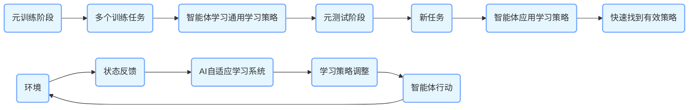

# 基于元强化学习的AI自适应学习系统

> 关键词：元强化学习、AI自适应学习系统、强化学习、智能体、学习策略

> 摘要：本文深入探讨了基于元强化学习的AI自适应学习系统。首先介绍了相关背景，包括目的范围、预期读者等内容。接着详细阐述了核心概念与联系，包括元强化学习和AI自适应学习系统的原理及架构。通过Python代码说明了核心算法原理和具体操作步骤，并给出了相应的数学模型和公式。在项目实战部分，展示了代码实际案例并进行详细解释。同时探讨了该系统的实际应用场景，推荐了相关的工具和资源。最后对未来发展趋势与挑战进行总结，还包含了常见问题解答和扩展阅读参考资料。

## 1. 背景介绍 
### 1.1 目的和范围
随着人工智能技术的不断发展，传统的机器学习方法在面对复杂多变的环境时，往往需要大量的数据和人工调整参数才能达到较好的效果。而基于元强化学习的AI自适应学习系统旨在让智能体能够在不同的任务和环境中快速学习和适应，减少对大量先验知识和人工干预的依赖。本文章的范围将涵盖元强化学习和AI自适应学习系统的基本概念、核心算法、数学模型、项目实战以及实际应用场景等方面，为读者全面深入地了解这一领域提供参考。

### 1.2 预期读者
本文预期读者包括人工智能领域的研究人员、开发者、学生以及对元强化学习和自适应学习系统感兴趣的技术爱好者。对于初学者，文章将从基础概念开始逐步引导，帮助他们建立起对该领域的初步认识；对于有一定经验的专业人士，文章将深入探讨核心算法和实际应用，为他们的研究和开发工作提供新的思路和方法。

### 1.3 文档结构概述
本文将按照以下结构进行组织：首先介绍背景信息，包括目的范围、预期读者和文档结构概述等；接着阐述核心概念与联系，展示其原理和架构；然后详细讲解核心算法原理和具体操作步骤，并给出相应的数学模型和公式；在项目实战部分，通过实际案例展示系统的开发过程和代码实现；之后探讨该系统的实际应用场景；再推荐相关的工具和资源；最后对未来发展趋势与挑战进行总结，同时提供常见问题解答和扩展阅读参考资料。

### 1.4 术语表
#### 1.4.1 核心术语定义
- **元强化学习（Meta-Reinforcement Learning）**：元强化学习是强化学习的一个扩展，它不仅关注智能体在单个任务中的学习，更注重智能体在多个任务之间的学习和迁移能力。通过学习如何学习，智能体能够在新的任务中更快地找到有效的策略。
- **AI自适应学习系统（AI Adaptive Learning System）**：是一种能够根据环境变化和任务需求自动调整学习策略的人工智能系统。该系统利用元强化学习等技术，使智能体能够在不同的场景中快速适应并优化自身的行为。
- **智能体（Agent）**：在强化学习和元强化学习中，智能体是能够感知环境状态并采取行动的实体。它通过与环境进行交互，不断学习和改进自己的行为策略。
- **策略（Policy）**：策略是智能体在给定状态下选择行动的规则。在强化学习中，策略通常用一个函数来表示，该函数将状态映射到行动的概率分布。

#### 1.4.2 相关概念解释
- **强化学习（Reinforcement Learning）**：强化学习是一种机器学习范式，智能体通过与环境进行交互，根据环境反馈的奖励信号来学习最优策略。在每一个时间步，智能体观察环境状态，选择一个行动，环境根据该行动更新状态并返回一个奖励信号，智能体的目标是最大化长期累积奖励。
- **学习迁移（Learning Transfer）**：学习迁移是指智能体将在一个任务中学到的知识和技能应用到另一个相关任务中的能力。在元强化学习中，学习迁移是实现快速适应新任务的关键。

#### 1.4.3 缩略词列表
- **MDP（Markov Decision Process）**：马尔可夫决策过程，是强化学习中常用的数学模型，用于描述智能体与环境的交互过程。
- **Q - learning**：一种无模型的强化学习算法，通过学习状态 - 行动对的价值函数Q来找到最优策略。

## 2. 核心概念与联系 

### 核心概念原理
#### 元强化学习原理
元强化学习的核心思想是学习如何学习。传统的强化学习算法通常针对特定的任务进行训练，需要大量的样本和时间来收敛到较好的策略。而元强化学习则通过在多个相关任务上进行训练，让智能体学会如何快速适应新的任务。具体来说，元强化学习将学习过程分为元训练和元测试两个阶段。在元训练阶段，智能体在多个任务上进行训练，学习到一种通用的学习策略；在元测试阶段，智能体将这种学习策略应用到新的任务中，快速找到有效的策略。

#### AI自适应学习系统原理
AI自适应学习系统的目标是使智能体能够在不同的环境和任务中自动调整学习策略。该系统利用元强化学习技术，通过对环境状态和任务特征的感知，动态地选择合适的学习方法和参数。当环境发生变化或遇到新的任务时，系统能够快速调整智能体的行为，以适应新的情况。

### 架构示意图


该架构图展示了元强化学习和AI自适应学习系统的核心流程。在元训练阶段，智能体在多个训练任务上学习通用学习策略；在元测试阶段，将该策略应用到新任务中。同时，AI自适应学习系统根据环境的状态反馈，动态调整智能体的学习策略，形成一个闭环的学习过程。

## 3. 核心算法原理 & 具体操作步骤 

### 核心算法原理
在元强化学习中，一种常用的算法是基于模型无关的元学习（Model - Agnostic Meta - Learning，MAML）。MAML的核心思想是找到一组初始化参数，使得在经过少量的梯度更新后，智能体能够在新的任务上快速收敛到较好的策略。

### Python代码实现
```python
import torch
import torch.nn as nn
import torch.optim as optim

# 定义一个简单的神经网络作为智能体的策略网络
class PolicyNetwork(nn.Module):
    def __init__(self, input_dim, output_dim):
        super(PolicyNetwork, self).__init__()
        self.fc1 = nn.Linear(input_dim, 64)
        self.fc2 = nn.Linear(64, output_dim)

    def forward(self, x):
        x = torch.relu(self.fc1(x))
        x = self.fc2(x)
        return x

# 元训练函数
def meta_train(policy_network, meta_optimizer, tasks, num_inner_steps, inner_lr):
    meta_loss = 0
    for task in tasks:
        # 复制当前的策略网络参数
        fast_weights = list(policy_network.parameters())

        # 内循环更新
        for _ in range(num_inner_steps):
            states, actions, rewards = task.sample_data()
            logits = policy_network(torch.tensor(states, dtype=torch.float32))
            loss = nn.CrossEntropyLoss()(logits, torch.tensor(actions, dtype=torch.long))
            gradients = torch.autograd.grad(loss, fast_weights)
            fast_weights = [w - inner_lr * g for w, g in zip(fast_weights, gradients)]

        # 计算元损失
        states, actions, rewards = task.sample_data()
        logits = policy_network(torch.tensor(states, dtype=torch.float32))
        meta_loss += nn.CrossEntropyLoss()(logits, torch.tensor(actions, dtype=torch.long))

    # 元优化步骤
    meta_optimizer.zero_grad()
    meta_loss.backward()
    meta_optimizer.step()
    return meta_loss.item()

# 示例任务类
class Task:
    def __init__(self, input_dim, output_dim):
        self.input_dim = input_dim
        self.output_dim = output_dim

    def sample_data(self):
        # 简单示例，随机生成数据
        states = torch.randn(10, self.input_dim)
        actions = torch.randint(0, self.output_dim, (10,))
        rewards = torch.randn(10)
        return states, actions, rewards

# 初始化参数
input_dim = 10
output_dim = 5
policy_network = PolicyNetwork(input_dim, output_dim)
meta_optimizer = optim.Adam(policy_network.parameters(), lr=0.001)
tasks = [Task(input_dim, output_dim) for _ in range(5)]
num_inner_steps = 3
inner_lr = 0.01

# 元训练过程
for epoch in range(100):
    meta_loss = meta_train(policy_network, meta_optimizer, tasks, num_inner_steps, inner_lr)
    if epoch % 10 == 0:
        print(f'Epoch {epoch}, Meta Loss: {meta_loss}')
```

### 具体操作步骤
1. **定义策略网络**：使用`PolicyNetwork`类定义一个简单的神经网络作为智能体的策略网络。
2. **元训练函数**：`meta_train`函数实现了MAML的元训练过程。在每个任务上进行内循环更新，更新后的参数用于计算元损失，最后进行元优化步骤。
3. **示例任务类**：`Task`类用于生成示例数据，在实际应用中，任务数据需要根据具体的环境和任务进行生成。
4. **初始化参数**：设置输入维度、输出维度、策略网络、元优化器、任务列表、内循环步数和内循环学习率等参数。
5. **元训练过程**：通过多次迭代调用`meta_train`函数进行元训练，并打印元损失。

## 4. 数学模型和公式 & 详细讲解 & 举例说明 

### 马尔可夫决策过程（MDP）
马尔可夫决策过程是强化学习中常用的数学模型，它可以用一个五元组 $\langle S, A, P, R, \gamma \rangle$ 来表示，其中：
- $S$ 是有限的状态集合。
- $A$ 是有限的行动集合。
- $P: S \times A \times S \to [0, 1]$ 是状态转移概率函数，表示在状态 $s \in S$ 下采取行动 $a \in A$ 后转移到状态 $s' \in S$ 的概率，即 $P(s'|s, a)$。
- $R: S \times A \to \mathbb{R}$ 是奖励函数，表示在状态 $s$ 下采取行动 $a$ 所获得的即时奖励 $R(s, a)$。
- $\gamma \in [0, 1]$ 是折扣因子，用于衡量未来奖励的重要性。

### 价值函数
在MDP中，有两种常用的价值函数：状态价值函数 $V^{\pi}(s)$ 和状态 - 行动价值函数 $Q^{\pi}(s, a)$。

#### 状态价值函数
状态价值函数 $V^{\pi}(s)$ 表示在策略 $\pi$ 下，从状态 $s$ 开始的期望累积折扣奖励，其定义为：
$$V^{\pi}(s) = \mathbb{E}_{\pi}\left[\sum_{t = 0}^{\infty}\gamma^{t}R(s_{t}, a_{t})|s_{0} = s\right]$$

#### 状态 - 行动价值函数
状态 - 行动价值函数 $Q^{\pi}(s, a)$ 表示在策略 $\pi$ 下，从状态 $s$ 采取行动 $a$ 后，后续的期望累积折扣奖励，其定义为：
$$Q^{\pi}(s, a) = \mathbb{E}_{\pi}\left[\sum_{t = 0}^{\infty}\gamma^{t}R(s_{t}, a_{t})|s_{0} = s, a_{0} = a\right]$$

### 贝尔曼方程
价值函数满足贝尔曼方程，这是强化学习中的一个重要方程。

#### 状态价值函数的贝尔曼方程
$$V^{\pi}(s) = \sum_{a \in A}\pi(a|s)\left[R(s, a)+\gamma\sum_{s' \in S}P(s'|s, a)V^{\pi}(s')\right]$$

#### 状态 - 行动价值函数的贝尔曼方程
$$Q^{\pi}(s, a) = R(s, a)+\gamma\sum_{s' \in S}P(s'|s, a)\sum_{a' \in A}\pi(a'|s')Q^{\pi}(s', a')$$

### 举例说明
假设有一个简单的网格世界环境，智能体可以在一个 $3 \times 3$ 的网格中移动。状态集合 $S$ 包含网格中的所有位置，行动集合 $A = \{上, 下, 左, 右\}$。奖励函数 $R$ 定义为：当智能体到达目标位置时获得奖励 $+1$，否则获得奖励 $0$。折扣因子 $\gamma = 0.9$。

假设当前策略 $\pi$ 是随机选择行动，即 $\pi(a|s)=\frac{1}{4}$ 对于所有的 $a \in A$ 和 $s \in S$。我们可以使用贝尔曼方程来计算状态价值函数 $V^{\pi}(s)$ 和状态 - 行动价值函数 $Q^{\pi}(s, a)$。

例如，对于某个状态 $s$，我们可以根据贝尔曼方程计算 $V^{\pi}(s)$：
1. 首先，对于每个行动 $a \in A$，计算 $R(s, a)+\gamma\sum_{s' \in S}P(s'|s, a)V^{\pi}(s')$。
2. 然后，将这些值按照策略 $\pi$ 进行加权求和，得到 $V^{\pi}(s)$。

通过迭代计算贝尔曼方程，我们可以逐渐收敛到最优的价值函数和策略。

## 5. 项目实战：代码实际案例和详细解释说明 

### 5.1  开发环境搭建
#### 操作系统
可以选择常见的操作系统，如Windows、Linux（如Ubuntu）或macOS。

#### 编程语言和库
- **Python**：选择Python 3.x版本，它是人工智能领域常用的编程语言。
- **PyTorch**：用于构建和训练神经网络，提供了丰富的深度学习工具和函数。可以使用以下命令安装：
```sh
pip install torch torchvision
```
- **NumPy**：用于数值计算和数组操作，安装命令为：
```sh
pip install numpy
```

#### 开发工具
可以选择使用集成开发环境（IDE），如PyCharm或Visual Studio Code，它们提供了代码编辑、调试等功能。

### 5.2  源代码详细实现和代码解读
```python
import torch
import torch.nn as nn
import torch.optim as optim
import numpy as np

# 定义一个简单的环境类
class SimpleEnvironment:
    def __init__(self):
        self.state = np.array([0.0])
        self.goal = np.array([1.0])
        self.max_steps = 10

    def reset(self):
        self.state = np.array([0.0])
        return self.state

    def step(self, action):
        # 简单的状态转移规则
        self.state += action
        reward = -np.linalg.norm(self.state - self.goal)
        done = np.linalg.norm(self.state - self.goal) < 0.1 or self.max_steps == 0
        self.max_steps -= 1
        return self.state, reward, done

# 定义策略网络
class PolicyNetwork(nn.Module):
    def __init__(self):
        super(PolicyNetwork, self).__init__()
        self.fc1 = nn.Linear(1, 16)
        self.fc2 = nn.Linear(16, 1)

    def forward(self, x):
        x = torch.relu(self.fc1(x))
        x = self.fc2(x)
        return x

# 训练函数
def train(policy_network, optimizer, env, num_episodes):
    for episode in range(num_episodes):
        state = env.reset()
        total_reward = 0
        done = False
        while not done:
            state_tensor = torch.tensor(state, dtype=torch.float32).unsqueeze(0)
            action = policy_network(state_tensor).detach().numpy()[0]
            next_state, reward, done = env.step(action)
            total_reward += reward
            state = next_state

        # 计算损失
        loss = -total_reward
        optimizer.zero_grad()
        loss.backward()
        optimizer.step()

        if episode % 10 == 0:
            print(f'Episode {episode}, Total Reward: {total_reward}')

# 主程序
if __name__ == "__main__":
    env = SimpleEnvironment()
    policy_network = PolicyNetwork()
    optimizer = optim.Adam(policy_network.parameters(), lr=0.001)
    num_episodes = 100
    train(policy_network, optimizer, env, num_episodes)
```

### 代码解读与分析
#### 环境类 `SimpleEnvironment`
- `__init__` 方法：初始化环境的状态、目标和最大步数。
- `reset` 方法：重置环境的状态，并返回初始状态。
- `step` 方法：根据智能体的行动更新环境状态，计算奖励和判断是否结束，并返回新的状态、奖励和结束标志。

#### 策略网络 `PolicyNetwork`
- `__init__` 方法：定义神经网络的结构，包含一个输入层、一个隐藏层和一个输出层。
- `forward` 方法：实现神经网络的前向传播，将输入状态映射到行动。

#### 训练函数 `train`
- 对于每个训练回合，重置环境状态，智能体根据策略网络选择行动，与环境进行交互，累积奖励。
- 计算回合的总奖励，并将其作为损失进行反向传播和参数更新。
- 每10个回合打印一次总奖励。

#### 主程序
- 创建环境实例、策略网络实例和优化器。
- 调用训练函数进行训练。

通过这个简单的项目实战，我们可以看到如何使用PyTorch构建一个基于强化学习的智能体，并在一个简单的环境中进行训练。

## 6. 实际应用场景 
### 机器人控制
在机器人控制领域，基于元强化学习的AI自适应学习系统可以使机器人快速适应不同的任务和环境。例如，在工业生产中，机器人需要完成不同的装配任务，每个任务的工件形状、尺寸和装配顺序可能都不同。通过元强化学习，机器人可以在学习多个装配任务的过程中，掌握通用的学习策略，当遇到新的装配任务时，能够快速调整自己的动作和策略，提高生产效率和质量。

### 游戏AI
在游戏领域，AI自适应学习系统可以让游戏AI更好地应对不同类型的对手和游戏场景。例如，在策略游戏中，对手的策略和游戏地图的布局可能会不断变化。元强化学习可以使游戏AI在学习多个游戏场景和对手策略的基础上，快速适应新的游戏情况，制定出更有效的游戏策略，提高游戏的趣味性和挑战性。

### 自动驾驶
在自动驾驶领域，车辆需要在不同的道路条件、交通规则和天气环境下行驶。基于元强化学习的AI自适应学习系统可以让自动驾驶车辆在学习多个驾驶场景的过程中，学会如何快速适应新的驾驶环境。例如，当车辆从城市道路行驶到乡村道路时，能够迅速调整自己的速度、跟车距离和驾驶策略，确保行驶安全。

### 金融投资
在金融投资领域，市场环境和资产价格波动复杂多变。元强化学习可以帮助投资者构建自适应的投资策略。通过学习多个市场场景和资产价格走势，投资智能体可以快速适应新的市场变化，调整投资组合，降低风险并提高收益。

## 7. 工具和资源推荐
### 7.1 学习资源推荐
#### 7.1.1 书籍推荐
- 《Reinforcement Learning: An Introduction》（《强化学习：原理与Python实现》）：这本书是强化学习领域的经典教材，全面介绍了强化学习的基本概念、算法和应用，对于理解元强化学习的基础非常有帮助。
- 《Deep Learning》（《深度学习》）：深度学习是元强化学习的重要基础，这本书详细介绍了深度学习的理论和实践，包括神经网络、卷积神经网络、循环神经网络等内容。

#### 7.1.2 在线课程
- Coursera上的“Reinforcement Learning Specialization”：该课程由著名学者Richard S. Sutton和Andrew G. Barto授课，系统地介绍了强化学习的各个方面，包括元强化学习的相关内容。
- edX上的“Introduction to Artificial Intelligence”：这门课程涵盖了人工智能的基础知识，包括强化学习和元学习的相关内容，适合初学者入门。

#### 7.1.3 技术博客和网站
- OpenAI博客：OpenAI是人工智能领域的领先研究机构，其博客上经常发布关于强化学习、元强化学习等方面的最新研究成果和技术文章。
- Medium上的AI相关博客：Medium上有很多人工智能领域的博主，他们会分享自己的研究经验和技术见解，对于了解元强化学习的最新动态很有帮助。

### 7.2 开发工具框架推荐
#### 7.2.1 IDE和编辑器
- PyCharm：是一款专门为Python开发设计的集成开发环境，提供了丰富的代码编辑、调试和项目管理功能，非常适合开发基于Python的元强化学习项目。
- Visual Studio Code：是一款轻量级的代码编辑器，支持多种编程语言和插件扩展，具有良好的代码编辑体验和调试功能。

#### 7.2.2 调试和性能分析工具
- TensorBoard：是TensorFlow提供的可视化工具，可以用于可视化训练过程中的损失曲线、梯度变化等信息，帮助开发者更好地理解模型的训练过程和性能。
- Py-Spy：是一个Python性能分析工具，可以用于分析Python代码的性能瓶颈，找出耗时较长的代码段，提高代码的运行效率。

#### 7.2.3 相关框架和库
- PyTorch：是一个开源的深度学习框架，提供了丰富的神经网络层和优化算法，非常适合构建和训练基于元强化学习的模型。
- Stable Baselines：是一个基于OpenAI Gym的强化学习库，提供了多种强化学习算法的实现，包括DQN、A2C、PPO等，可以方便地用于开发和测试元强化学习算法。

### 7.3 相关论文著作推荐
#### 7.3.1 经典论文
- “Model - Agnostic Meta - Learning for Fast Adaptation of Deep Networks”：这篇论文提出了MAML算法，是元强化学习领域的经典论文，为后续的研究奠定了基础。
- “Learning to Reinforcement Learn”：该论文探讨了如何通过元学习来学习强化学习的策略，提出了一种新的元强化学习方法。

#### 7.3.2 最新研究成果
- 关注顶级人工智能会议，如NeurIPS、ICML、AAAI等，这些会议上会发布很多关于元强化学习的最新研究成果。
- arXiv预印本平台上也有很多关于元强化学习的最新论文，可以及时了解该领域的研究动态。

#### 7.3.3 应用案例分析
- 一些科技公司的技术博客和研究报告中会分享元强化学习在实际应用中的案例分析，如谷歌、微软等公司的相关文章，可以从中学习到如何将元强化学习应用到实际项目中。

## 8. 总结：未来发展趋势与挑战
### 未来发展趋势
#### 多模态学习
未来的基于元强化学习的AI自适应学习系统将更加注重多模态学习，即结合图像、语音、文本等多种模态的信息进行学习。通过多模态学习，智能体可以更全面地感知环境，提高学习和决策的能力。例如，在自动驾驶领域，车辆可以同时利用摄像头的图像信息、雷达的距离信息和语音导航信息，更好地适应复杂的交通环境。

#### 与其他技术的融合
元强化学习将与其他人工智能技术，如深度学习、计算机视觉、自然语言处理等进行更深入的融合。通过融合不同的技术，可以发挥各自的优势，构建更加智能和强大的自适应学习系统。例如，将元强化学习与计算机视觉技术相结合，可以使智能体在图像识别和处理任务中快速适应不同的场景和目标。

#### 大规模应用
随着计算能力的不断提升和算法的不断优化，基于元强化学习的AI自适应学习系统将在更多的领域得到大规模应用。除了现有的机器人控制、游戏AI、自动驾驶和金融投资等领域，还将拓展到医疗、教育、能源等更多领域，为社会带来更大的价值。

### 挑战
#### 计算资源需求
元强化学习通常需要大量的计算资源来进行训练，特别是在处理复杂的任务和大规模的数据时。如何在有限的计算资源下提高训练效率，是一个亟待解决的问题。

#### 可解释性
元强化学习模型的决策过程往往比较复杂，缺乏可解释性。在一些对安全性和可靠性要求较高的领域，如医疗和自动驾驶，模型的可解释性是非常重要的。如何提高元强化学习模型的可解释性，是当前研究的一个热点和难点。

#### 数据质量和隐私
元强化学习需要大量的高质量数据来进行训练，数据的质量和隐私问题是一个重要的挑战。如何收集、处理和保护数据，确保数据的安全性和隐私性，同时提高数据的质量，是需要解决的问题。

## 9. 附录：常见问题与解答
### 问题1：元强化学习和传统强化学习有什么区别？
传统强化学习通常针对特定的任务进行训练，需要大量的样本和时间来收敛到较好的策略。而元强化学习更注重智能体在多个任务之间的学习和迁移能力，通过学习如何学习，智能体能够在新的任务中更快地找到有效的策略。

### 问题2：MAML算法的核心思想是什么？
MAML算法的核心思想是找到一组初始化参数，使得在经过少量的梯度更新后，智能体能够在新的任务上快速收敛到较好的策略。通过在多个任务上进行训练，MAML学习到一种通用的学习策略，提高了智能体在新任务上的适应能力。

### 问题3：基于元强化学习的AI自适应学习系统在实际应用中有哪些挑战？
在实际应用中，该系统面临着计算资源需求大、模型可解释性差、数据质量和隐私等挑战。需要进一步研究和开发高效的算法和技术，以解决这些问题。

### 问题4：如何评估基于元强化学习的AI自适应学习系统的性能？
可以使用多种指标来评估系统的性能，如在新任务上的收敛速度、最终的任务完成率、长期累积奖励等。同时，还可以进行对比实验，与传统的强化学习方法进行比较，以评估系统的优势和改进效果。

## 10. 扩展阅读 & 参考资料
- Sutton, R. S., & Barto, A. G. (2018). Reinforcement Learning: An Introduction. MIT press.
- Goodfellow, I., Bengio, Y., & Courville, A. (2016). Deep Learning. MIT press.
- Finn, C., Abbeel, P., & Levine, S. (2017). Model - Agnostic Meta - Learning for Fast Adaptation of Deep Networks. Proceedings of the 34th International Conference on Machine Learning - Volume 70.
- Duan, Y., Schulman, J., Chen, X., Bartlett, P. L., Sutskever, I., & Abbeel, P. (2016). Learning to Reinforcement Learn. arXiv preprint arXiv:1611.05763.

作者：AI天才研究院/AI Genius Institute & 禅与计算机程序设计艺术 /Zen And The Art of Computer Programming