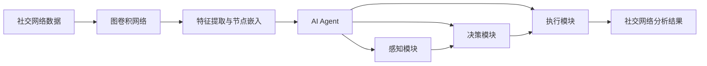

# 基于图卷积网络的AI Agent社交网络分析

> 关键词：图卷积网络、AI Agent、社交网络分析、图神经网络、节点嵌入

> 摘要：本文聚焦于基于图卷积网络的AI Agent社交网络分析。首先介绍相关背景知识，包括目的、预期读者、文档结构等内容。接着阐述图卷积网络和AI Agent的核心概念及其联系，详细讲解核心算法原理，给出Python代码示例，并对数学模型和公式进行深入剖析。通过项目实战展示代码实现与解读，探讨其实际应用场景。同时推荐相关的学习资源、开发工具框架和论文著作。最后总结未来发展趋势与挑战，还设有附录解答常见问题，并提供扩展阅读与参考资料，旨在为读者全面呈现基于图卷积网络的AI Agent社交网络分析的技术全貌。

## 1. 背景介绍 
### 1.1 目的和范围
社交网络已经成为人们生活中不可或缺的一部分，其中蕴含着大量有价值的信息。分析社交网络有助于理解用户行为、信息传播模式、社区结构等。传统的社交网络分析方法在处理复杂的网络结构和丰富的节点与边信息时存在一定的局限性。图卷积网络（Graph Convolutional Networks，GCN）作为一种强大的图神经网络技术，能够有效地处理图结构数据。而AI Agent是具有自主决策和行为能力的智能实体，将其与图卷积网络结合用于社交网络分析，可以实现更智能、更深入的网络理解和预测。

本文的范围涵盖了图卷积网络和AI Agent的基本概念、核心算法原理、数学模型，通过项目实战展示如何应用这些技术进行社交网络分析，探讨其在不同场景下的应用，并提供相关的学习资源和工具推荐。

### 1.2 预期读者
本文预期读者包括计算机科学、人工智能、数据科学等相关专业的学生、研究人员，以及对社交网络分析和图神经网络技术感兴趣的开发者和从业者。读者需要具备一定的编程基础（如Python）和机器学习的基本概念。

### 1.3 文档结构概述
本文首先介绍背景知识，包括目的、读者群体和文档结构等。接着深入讲解图卷积网络和AI Agent的核心概念及其联系，给出相应的原理和架构示意图。然后详细阐述核心算法原理，使用Python代码进行说明，并介绍相关的数学模型和公式。通过项目实战展示如何将这些技术应用于社交网络分析，包括开发环境搭建、源代码实现和代码解读。探讨实际应用场景，推荐相关的学习资源、开发工具框架和论文著作。最后总结未来发展趋势与挑战，解答常见问题，并提供扩展阅读与参考资料。

### 1.4 术语表
#### 1.4.1 核心术语定义
- **图卷积网络（Graph Convolutional Networks，GCN）**：一种专门用于处理图结构数据的神经网络，通过对节点及其邻居的特征进行聚合和变换来学习节点的表示。
- **AI Agent**：具有自主决策和行为能力的智能实体，能够感知环境、做出决策并执行相应的动作。
- **社交网络**：由节点（如用户）和边（如关系）组成的图结构，用于表示个体之间的社会关系。
- **节点嵌入（Node Embedding）**：将图中的节点映射到低维向量空间的过程，使得节点的向量表示能够反映其在图中的结构和特征信息。

#### 1.4.2 相关概念解释
- **图（Graph）**：由节点（Vertex）和边（Edge）组成的数据结构，用于表示对象之间的关系。在社交网络中，节点可以表示用户，边可以表示用户之间的朋友关系、关注关系等。
- **卷积（Convolution）**：在传统图像处理中，卷积是一种通过滑动窗口对图像进行特征提取的操作。在图卷积网络中，卷积是对节点及其邻居的特征进行聚合和变换的操作。
- **神经网络（Neural Network）**：一种模仿人类神经系统的计算模型，由多个神经元组成，通过不断调整神经元之间的连接权重来学习数据的特征和模式。

#### 1.4.3 缩略词列表
- **GCN**：Graph Convolutional Networks（图卷积网络）
- **AI**：Artificial Intelligence（人工智能）

## 2. 核心概念与联系 

### 图卷积网络原理
图卷积网络是一种专门处理图结构数据的神经网络。传统的卷积神经网络（CNN）主要用于处理规则的网格结构数据（如图像），而图卷积网络则可以处理不规则的图结构数据。

图卷积网络的核心思想是通过聚合节点及其邻居的特征来更新节点的表示。具体来说，对于图中的每个节点 $v$，其在第 $l$ 层的特征表示 $h_v^l$ 可以通过以下公式更新：

$$h_v^{l+1} = \sigma\left(\sum_{u\in N(v)}\frac{1}{\sqrt{d_vd_u}}W^lh_u^l + b^l\right)$$

其中，$N(v)$ 是节点 $v$ 的邻居集合，$d_v$ 和 $d_u$ 分别是节点 $v$ 和其邻居 $u$ 的度，$W^l$ 是第 $l$ 层的可学习权重矩阵，$b^l$ 是偏置项，$\sigma$ 是激活函数（如ReLU）。

### AI Agent概念
AI Agent是具有自主决策和行为能力的智能实体。它可以感知环境，根据自身的目标和规则做出决策，并执行相应的动作。在社交网络分析中，AI Agent可以用于模拟用户的行为、预测信息传播等。

AI Agent通常由以下几个部分组成：
- **感知模块**：用于感知环境中的信息，如节点的特征、边的关系等。
- **决策模块**：根据感知到的信息和自身的目标，做出决策。
- **执行模块**：执行决策模块做出的决策，如更新节点的状态、传播信息等。

### 两者联系
图卷积网络可以为AI Agent提供强大的特征提取和表示学习能力。通过图卷积网络，AI Agent可以更好地理解社交网络的结构和节点的特征，从而做出更准确的决策。例如，在信息传播预测任务中，图卷积网络可以学习到节点的重要性和传播路径，AI Agent可以根据这些信息决定何时传播信息以及传播给哪些节点。

### 文本示意图
图卷积网络和AI Agent在社交网络分析中的关系可以用以下文本示意图表示：

社交网络数据（节点特征、边关系） -> 图卷积网络（特征提取、节点嵌入） -> AI Agent（感知、决策、执行） -> 社交网络分析结果（如社区发现、信息传播预测）

### Mermaid流程图


## 3. 核心算法原理 & 具体操作步骤 

### 图卷积网络算法原理
图卷积网络的核心是消息传递机制，即节点通过与邻居交换信息来更新自己的特征表示。下面是一个简单的图卷积层的Python实现：

```python
import torch
import torch.nn as nn
import torch.nn.functional as F

class GraphConvolution(nn.Module):
    def __init__(self, in_features, out_features):
        super(GraphConvolution, self).__init__()
        self.weight = nn.Parameter(torch.FloatTensor(in_features, out_features))
        self.bias = nn.Parameter(torch.FloatTensor(out_features))
        self.reset_parameters()

    def reset_parameters(self):
        nn.init.xavier_uniform_(self.weight)
        nn.init.zeros_(self.bias)

    def forward(self, input, adj):
        support = torch.mm(input, self.weight)
        output = torch.spmm(adj, support)
        return output + self.bias
```

### 具体操作步骤
1. **数据预处理**：将社交网络数据转换为图结构，包括节点特征矩阵 $X$ 和邻接矩阵 $A$。
2. **定义图卷积网络模型**：可以使用多个图卷积层构建一个深度图卷积网络。
```python
class GCN(nn.Module):
    def __init__(self, nfeat, nhid, nclass):
        super(GCN, self).__init__()
        self.gc1 = GraphConvolution(nfeat, nhid)
        self.gc2 = GraphConvolution(nhid, nclass)

    def forward(self, x, adj):
        x = F.relu(self.gc1(x, adj))
        x = self.gc2(x, adj)
        return F.log_softmax(x, dim=1)
```
3. **训练模型**：定义损失函数和优化器，使用训练数据进行模型训练。
```python
# 假设已经有了节点特征矩阵x，邻接矩阵adj，标签y
model = GCN(nfeat=x.shape[1], nhid=16, nclass=y.max().item() + 1)
criterion = nn.NLLLoss()
optimizer = torch.optim.Adam(model.parameters(), lr=0.01)

for epoch in range(200):
    optimizer.zero_grad()
    output = model(x, adj)
    loss = criterion(output, y)
    loss.backward()
    optimizer.step()
```
4. **使用训练好的模型进行预测**：将测试数据输入到训练好的模型中，得到预测结果。
```python
with torch.no_grad():
    test_output = model(test_x, test_adj)
    _, predicted = torch.max(test_output, 1)
```

## 4. 数学模型和公式 & 详细讲解 & 举例说明 

### 图卷积网络的数学模型
图卷积网络的数学模型可以表示为一个多层的非线性变换过程。假设图 $G=(V, E)$ 有 $N$ 个节点，节点特征矩阵为 $X\in\mathbb{R}^{N\times D}$，其中 $D$ 是节点特征的维度。邻接矩阵为 $A\in\mathbb{R}^{N\times N}$，表示节点之间的连接关系。

第 $l$ 层图卷积层的输出可以表示为：

$$H^{(l+1)} = \sigma\left(\tilde{D}^{-\frac{1}{2}}\tilde{A}\tilde{D}^{-\frac{1}{2}}H^{(l)}W^{(l)}\right)$$

其中，$\tilde{A} = A + I$ 是加上自环的邻接矩阵，$I$ 是单位矩阵，$\tilde{D}$ 是 $\tilde{A}$ 的度矩阵，$H^{(l)}\in\mathbb{R}^{N\times F^{(l)}}$ 是第 $l$ 层的节点特征矩阵，$W^{(l)}\in\mathbb{R}^{F^{(l)}\times F^{(l+1)}}$ 是第 $l$ 层的可学习权重矩阵，$\sigma$ 是激活函数。

### 详细讲解
- **邻接矩阵的处理**：加上自环是为了让节点在更新特征时考虑自身的信息。$\tilde{D}^{-\frac{1}{2}}\tilde{A}\tilde{D}^{-\frac{1}{2}}$ 是对邻接矩阵进行归一化处理，目的是平衡不同节点的度对特征传播的影响。
- **权重矩阵**：$W^{(l)}$ 是可学习的参数，通过训练来调整，使得模型能够学习到不同特征之间的重要性。
- **激活函数**：$\sigma$ 引入非线性，增加模型的表达能力。

### 举例说明
假设我们有一个简单的图，有 3 个节点，节点特征矩阵 $X$ 为：

$$X = \begin{bmatrix}
1 & 2 \\
3 & 4 \\
5 & 6
\end{bmatrix}$$

邻接矩阵 $A$ 为：

$$A = \begin{bmatrix}
0 & 1 & 1 \\
1 & 0 & 1 \\
1 & 1 & 0
\end{bmatrix}$$

加上自环后 $\tilde{A}$ 为：

$$\tilde{A} = \begin{bmatrix}
1 & 1 & 1 \\
1 & 1 & 1 \\
1 & 1 & 1
\end{bmatrix}$$

度矩阵 $\tilde{D}$ 为：

$$\tilde{D} = \begin{bmatrix}
3 & 0 & 0 \\
0 & 3 & 0 \\
0 & 0 & 3
\end{bmatrix}$$

$\tilde{D}^{-\frac{1}{2}}\tilde{A}\tilde{D}^{-\frac{1}{2}}$ 为：

$$\tilde{D}^{-\frac{1}{2}}\tilde{A}\tilde{D}^{-\frac{1}{2}} = \begin{bmatrix}
\frac{1}{3} & \frac{1}{3} & \frac{1}{3} \\
\frac{1}{3} & \frac{1}{3} & \frac{1}{3} \\
\frac{1}{3} & \frac{1}{3} & \frac{1}{3}
\end{bmatrix}$$

假设 $W^{(0)}$ 为：

$$W^{(0)} = \begin{bmatrix}
0.1 & 0.2 \\
0.3 & 0.4
\end{bmatrix}$$

则第一层图卷积层的输出 $H^{(1)}$ 为：

$$H^{(1)} = \sigma\left(\tilde{D}^{-\frac{1}{2}}\tilde{A}\tilde{D}^{-\frac{1}{2}}XW^{(0)}\right)$$

先计算 $\tilde{D}^{-\frac{1}{2}}\tilde{A}\tilde{D}^{-\frac{1}{2}}X$：

$$\tilde{D}^{-\frac{1}{2}}\tilde{A}\tilde{D}^{-\frac{1}{2}}X = \begin{bmatrix}
3 & 4 \\
3 & 4 \\
3 & 4
\end{bmatrix}$$

再计算 $\tilde{D}^{-\frac{1}{2}}\tilde{A}\tilde{D}^{-\frac{1}{2}}XW^{(0)}$：

$$\tilde{D}^{-\frac{1}{2}}\tilde{A}\tilde{D}^{-\frac{1}{2}}XW^{(0)} = \begin{bmatrix}
1.5 & 2.2 \\
1.5 & 2.2 \\
1.5 & 2.2
\end{bmatrix}$$

假设 $\sigma$ 为ReLU函数，则 $H^{(1)}$ 为：

$$H^{(1)} = \begin{bmatrix}
1.5 & 2.2 \\
1.5 & 2.2 \\
1.5 & 2.2
\end{bmatrix}$$

## 5. 项目实战：代码实际案例和详细解释说明 

### 5.1  开发环境搭建
1. **安装Python**：推荐使用Python 3.7及以上版本。
2. **安装必要的库**：使用pip安装以下库：
```bash
pip install torch torchvision
pip install networkx
pip install scikit-learn
```
3. **选择开发工具**：可以使用PyCharm、Jupyter Notebook等开发工具。

### 5.2  源代码详细实现和代码解读
以下是一个完整的基于图卷积网络的社交网络节点分类项目的代码示例：

```python
import torch
import torch.nn as nn
import torch.nn.functional as F
import networkx as nx
import numpy as np
from sklearn.model_selection import train_test_split

# 定义图卷积层
class GraphConvolution(nn.Module):
    def __init__(self, in_features, out_features):
        super(GraphConvolution, self).__init__()
        self.weight = nn.Parameter(torch.FloatTensor(in_features, out_features))
        self.bias = nn.Parameter(torch.FloatTensor(out_features))
        self.reset_parameters()

    def reset_parameters(self):
        nn.init.xavier_uniform_(self.weight)
        nn.init.zeros_(self.bias)

    def forward(self, input, adj):
        support = torch.mm(input, self.weight)
        output = torch.spmm(adj, support)
        return output + self.bias

# 定义图卷积网络模型
class GCN(nn.Module):
    def __init__(self, nfeat, nhid, nclass):
        super(GCN, self).__init__()
        self.gc1 = GraphConvolution(nfeat, nhid)
        self.gc2 = GraphConvolution(nhid, nclass)

    def forward(self, x, adj):
        x = F.relu(self.gc1(x, adj))
        x = self.gc2(x, adj)
        return F.log_softmax(x, dim=1)

# 生成一个简单的社交网络图
G = nx.karate_club_graph()
adj = nx.adjacency_matrix(G).tocsr()
features = np.eye(G.number_of_nodes())  # 节点特征为单位矩阵
labels = np.array([0 if data['club'] == 'Mr. Hi' else 1 for _, data in G.nodes(data=True)])

# 数据预处理
adj = torch.FloatTensor(np.array(adj.todense()))
features = torch.FloatTensor(features)
labels = torch.LongTensor(labels)

# 划分训练集和测试集
train_indices, test_indices = train_test_split(range(G.number_of_nodes()), test_size=0.2, random_state=42)
train_indices = torch.LongTensor(train_indices)
test_indices = torch.LongTensor(test_indices)

# 初始化模型、损失函数和优化器
model = GCN(nfeat=features.shape[1], nhid=16, nclass=2)
criterion = nn.NLLLoss()
optimizer = torch.optim.Adam(model.parameters(), lr=0.01)

# 训练模型
for epoch in range(200):
    optimizer.zero_grad()
    output = model(features, adj)
    loss = criterion(output[train_indices], labels[train_indices])
