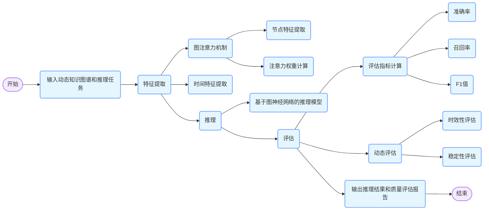

# 基于图注意力机制的动态知识推理质量评估

> 关键词：图注意力机制、动态知识推理、质量评估、知识图谱、人工智能

> 摘要：本文聚焦于基于图注意力机制的动态知识推理质量评估。首先介绍了相关背景，包括研究目的、预期读者等。详细阐述了图注意力机制、动态知识推理等核心概念及其联系，并给出了相应的文本示意图和Mermaid流程图。深入讲解了核心算法原理，用Python代码进行了详细示例。探讨了相关数学模型和公式，并举例说明。通过项目实战，展示了代码的实际实现和解读。分析了该技术在不同场景的实际应用。推荐了学习资源、开发工具框架和相关论文著作。最后总结了未来发展趋势与挑战，并提供了常见问题解答和扩展阅读参考资料，旨在为相关领域的研究和实践提供全面而深入的指导。

## 1. 背景介绍 
### 1.1 目的和范围
随着人工智能技术的不断发展，知识推理在智能系统中扮演着越来越重要的角色。动态知识推理能够处理不断变化的知识，更符合现实世界的需求。然而，如何评估动态知识推理的质量是一个亟待解决的问题。本文旨在探讨基于图注意力机制的动态知识推理质量评估方法，研究范围涵盖核心概念的理解、算法原理的分析、实际应用场景的探讨等方面，为提高动态知识推理的可靠性和有效性提供理论和实践支持。

### 1.2 预期读者
本文预期读者包括人工智能领域的研究人员、学生，对知识图谱和知识推理感兴趣的开发者，以及从事智能系统设计和开发的工程师。希望读者能够通过本文深入了解基于图注意力机制的动态知识推理质量评估技术，为相关研究和实践提供有益的参考。

### 1.3 文档结构概述
本文将按照以下结构进行阐述：首先介绍核心概念与联系，帮助读者建立起相关的知识体系；接着详细讲解核心算法原理和具体操作步骤，并给出Python代码示例；然后介绍相关的数学模型和公式，并举例说明；通过项目实战展示代码的实际应用和解读；分析该技术在不同场景的实际应用；推荐学习资源、开发工具框架和相关论文著作；最后总结未来发展趋势与挑战，提供常见问题解答和扩展阅读参考资料。

### 1.4 术语表
#### 1.4.1 核心术语定义
- **图注意力机制（Graph Attention Mechanism）**：一种在图结构数据上的注意力机制，能够自适应地为图中的节点分配不同的注意力权重，从而更好地捕捉节点之间的关系。
- **动态知识推理（Dynamic Knowledge Reasoning）**：在知识不断变化的环境中进行推理的过程，能够根据新知识的加入和旧知识的更新调整推理结果。
- **知识图谱（Knowledge Graph）**：一种以图结构表示知识的方式，由节点和边组成，节点表示实体，边表示实体之间的关系。
- **质量评估（Quality Assessment）**：对动态知识推理结果的准确性、可靠性、完整性等方面进行评价的过程。

#### 1.4.2 相关概念解释
- **注意力机制（Attention Mechanism）**：一种模仿人类注意力的机制，能够在处理大量信息时，聚焦于重要的部分，提高处理效率和准确性。
- **推理（Reasoning）**：从已知知识中推导出新知识的过程，是智能系统的重要功能之一。
- **动态性（Dynamics）**：指知识的不断变化和更新，包括新实体的出现、实体关系的变化等。

#### 1.4.3 缩略词列表
- **GAT**：Graph Attention Network（图注意力网络）
- **KG**：Knowledge Graph（知识图谱）

## 2. 核心概念与联系 

### 核心概念原理

#### 图注意力机制
图注意力机制的核心思想是为图中的每个节点分配不同的注意力权重，以反映其与相邻节点的相关性。在图注意力网络（GAT）中，对于节点 $i$ 和其邻居节点 $j$，注意力系数 $e_{ij}$ 可以通过以下公式计算：
$$e_{ij} = \text{LeakyReLU}(\mathbf{a}^T[\mathbf{W}h_i || \mathbf{W}h_j])$$
其中，$\mathbf{W}$ 是可学习的权重矩阵，$\mathbf{a}$ 是注意力向量，$h_i$ 和 $h_j$ 分别是节点 $i$ 和 $j$ 的特征向量，$||$ 表示拼接操作。然后，通过softmax函数对注意力系数进行归一化，得到注意力权重 $\alpha_{ij}$：
$$\alpha_{ij} = \frac{\exp(e_{ij})}{\sum_{k \in \mathcal{N}(i)} \exp(e_{ik})}$$
其中，$\mathcal{N}(i)$ 是节点 $i$ 的邻居节点集合。最后，节点 $i$ 的更新特征 $h_i'$ 可以通过以下公式计算：
$$h_i' = \sigma\left(\sum_{j \in \mathcal{N}(i)} \alpha_{ij} \mathbf{W}h_j\right)$$
其中，$\sigma$ 是激活函数。

#### 动态知识推理
动态知识推理是在知识图谱不断变化的情况下进行推理的过程。当新知识加入或旧知识更新时，推理系统需要能够快速调整推理结果。动态知识推理可以基于规则、机器学习或深度学习等方法实现。例如，在基于深度学习的方法中，可以使用图神经网络来处理知识图谱的结构信息，结合时间序列分析来处理知识的动态变化。

#### 知识推理质量评估
知识推理质量评估是对推理结果的准确性、可靠性、完整性等方面进行评价的过程。常用的评估指标包括准确率、召回率、F1值等。在动态知识推理中，还需要考虑推理结果的时效性和稳定性。例如，当知识图谱发生变化时，推理结果能够快速更新，并且在一定时间内保持稳定。

### 架构的文本示意图
```plaintext
动态知识推理质量评估系统
|-- 输入层
|   |-- 动态知识图谱
|   |-- 推理任务
|-- 特征提取层
|   |-- 图注意力机制
|   |   |-- 节点特征提取
|   |   |-- 注意力权重计算
|   |-- 时间特征提取
|-- 推理层
|   |-- 基于图神经网络的推理模型
|-- 评估层
|   |-- 评估指标计算
|   |   |-- 准确率
|   |   |-- 召回率
|   |   |-- F1值
|   |-- 动态评估
|       |-- 时效性评估
|       |-- 稳定性评估
|-- 输出层
|   |-- 推理结果
|   |-- 质量评估报告
```

### Mermaid流程图


## 3. 核心算法原理 & 具体操作步骤 

### 核心算法原理
基于图注意力机制的动态知识推理质量评估主要包括以下几个步骤：
1. **图注意力特征提取**：使用图注意力网络（GAT）提取知识图谱中节点的特征，同时计算节点之间的注意力权重。
2. **动态知识推理**：基于提取的特征，使用图神经网络进行知识推理，得到推理结果。
3. **质量评估**：根据推理结果和真实标签，计算评估指标，如准确率、召回率、F1值等，同时进行动态评估，如时效性和稳定性评估。

### 具体操作步骤
#### 步骤1：数据准备
首先，需要准备动态知识图谱数据和推理任务。知识图谱数据可以表示为一个图 $G=(V, E)$，其中 $V$ 是节点集合，$E$ 是边集合。每个节点和边可以有相应的特征。推理任务可以表示为一个查询，例如查询两个节点之间是否存在某种关系。

#### 步骤2：图注意力特征提取
使用Python和PyTorch实现图注意力网络（GAT）进行特征提取。以下是一个简单的示例代码：
```python
import torch
import torch.nn as nn
import torch.nn.functional as F

class GraphAttentionLayer(nn.Module):
    def __init__(self, in_features, out_features, dropout, alpha, concat=True):
        super(GraphAttentionLayer, self).__init__()
        self.dropout = dropout
        self.in_features = in_features
        self.out_features = out_features
        self.alpha = alpha
        self.concat = concat

        self.W = nn.Parameter(torch.empty(size=(in_features, out_features)))
        nn.init.xavier_uniform_(self.W.data, gain=1.414)
        self.a = nn.Parameter(torch.empty(size=(2*out_features, 1)))
        nn.init.xavier_uniform_(self.a.data, gain=1.414)

        self.leakyrelu = nn.LeakyReLU(self.alpha)

    def forward(self, h, adj):
        Wh = torch.mm(h, self.W) # h.shape: (N, in_features), Wh.shape: (N, out_features)
        e = self._prepare_attentional_mechanism_input(Wh)

        zero_vec = -9e15*torch.ones_like(e)
        attention = torch.where(adj > 0, e, zero_vec)
        attention = F.softmax(attention, dim=1)
        attention = F.dropout(attention, self.dropout, training=self.training)
        h_prime = torch.matmul(attention, Wh)

        if self.concat:
            return F.elu(h_prime)
        else:
            return h_prime

    def _prepare_attentional_mechanism_input(self, Wh):
        N = Wh.size()[0] # number of nodes

        Wh_repeated_in_chunks = Wh.repeat_interleave(N, dim=0)
        Wh_repeated_alternating = Wh.repeat(N, 1)

        all_combinations_matrix = torch.cat([Wh_repeated_in_chunks, Wh_repeated_alternating], dim=1)
        # all_combinations_matrix.shape == (N * N, 2 * out_features)

        e = torch.matmul(all_combinations_matrix, self.a)
        # e.shape == (N * N, 1)
        return e.view(N, N)

    def __repr__(self):
        return self.__class__.__name__ + ' (' + str(self.in_features) + ' -> ' + str(self.out_features) + ')'


class GAT(nn.Module):
    def __init__(self, nfeat, nhid, nclass, dropout, alpha, nheads):
        super(GAT, self).__init__()
        self.dropout = dropout

        self.attentions = [GraphAttentionLayer(nfeat, nhid, dropout=dropout, alpha=alpha, concat=True) for _ in range(nheads)]
        for i, attention in enumerate(self.attentions):
            self.add_module('attention_{}'.format(i), attention)

        self.out_att = GraphAttentionLayer(nhid * nheads, nclass, dropout=dropout, alpha=alpha, concat=False)

    def forward(self, x, adj):
        x = F.dropout(x, self.dropout, training=self.training)
        x = torch.cat([att(x, adj) for att in self.attentions], dim=1)
        x = F.dropout(x, self.dropout, training=self.training)
        x = F.elu(self.out_att(x, adj))
        return F.log_softmax(x, dim=1)
```

#### 步骤3：动态知识推理
在提取图注意力特征后，可以使用图神经网络进行知识推理。以下是一个简单的示例代码：
```python
# 假设已经有了图注意力特征 x 和邻接矩阵 adj
model = GAT(nfeat=x.shape[1], nhid=8, nclass=2, dropout=0.6, alpha=0.2, nheads=8)
optimizer = torch.optim.Adam(model.parameters(), lr=0.005, weight_decay=5e-4)

# 训练模型
for epoch in range(200):
    model.train()
    optimizer.zero_grad()
    output = model(x, adj)
    loss_train = F.nll_loss(output, labels)
    loss_train.backward()
    optimizer.step()

# 进行推理
model.eval()
with torch.no_grad():
    prediction = model(x, adj)
```

#### 步骤4：质量评估
根据推理结果和真实标签，计算评估指标。以下是一个简单的示例代码：
```python
from sklearn.metrics import accuracy_score, recall_score, f1_score

# 假设已经有了推理结果 prediction 和真实标签 labels
predicted_labels = torch.argmax(prediction, dim=1).cpu().numpy()
true_labels = labels.cpu().numpy()

accuracy = accuracy_score(true_labels, predicted_labels)
recall = recall_score(true_labels, predicted_labels)
f1 = f1_score(true_labels, predicted_labels)

print(f"Accuracy: {accuracy}")
print(f"Recall: {recall}")
print(f"F1-score: {f1}")
```

## 4. 数学模型和公式 & 详细讲解 & 举例说明 

### 图注意力机制相关公式
#### 注意力系数计算
注意力系数 $e_{ij}$ 用于衡量节点 $i$ 对邻居节点 $j$ 的关注程度，计算公式为：
$$e_{ij} = \text{LeakyReLU}(\mathbf{a}^T[\mathbf{W}h_i || \mathbf{W}h_j])$$
详细讲解：
- $\mathbf{W}$ 是可学习的权重矩阵，用于将节点的原始特征 $h_i$ 和 $h_j$ 映射到一个新的特征空间。
- $\mathbf{a}$ 是注意力向量，用于计算注意力系数。
- $[\mathbf{W}h_i || \mathbf{W}h_j]$ 表示将 $\mathbf{W}h_i$ 和 $\mathbf{W}h_j$ 进行拼接操作。
- $\text{LeakyReLU}$ 是激活函数，用于引入非线性。

举例说明：
假设节点 $i$ 和 $j$ 的原始特征向量 $h_i$ 和 $h_j$ 都是长度为 3 的向量，$\mathbf{W}$ 是一个 $3\times 4$ 的矩阵，$\mathbf{a}$ 是一个长度为 8 的向量。则 $\mathbf{W}h_i$ 和 $\mathbf{W}h_j$ 都是长度为 4 的向量，拼接后得到一个长度为 8 的向量。将该向量与 $\mathbf{a}$ 进行点积运算，再通过 $\text{LeakyReLU}$ 激活函数，得到注意力系数 $e_{ij}$。

#### 注意力权重计算
注意力权重 $\alpha_{ij}$ 是对注意力系数 $e_{ij}$ 进行归一化后的结果，计算公式为：
$$\alpha_{ij} = \frac{\exp(e_{ij})}{\sum_{k \in \mathcal{N}(i)} \exp(e_{ik})}$$
详细讲解：
- $\exp$ 是指数函数，用于将注意力系数转换为非负实数。
- $\sum_{k \in \mathcal{N}(i)} \exp(e_{ik})$ 是对节点 $i$ 的所有邻居节点的注意力系数进行求和，用于归一化。

举例说明：
假设节点 $i$ 有 3 个邻居节点 $j_1$、$j_2$、$j_3$，对应的注意力系数分别为 $e_{ij_1}=0.1$、$e_{ij_2}=0.2$、$e_{ij_3}=0.3$。则：
$$\alpha_{ij_1} = \frac{\exp(0.1)}{\exp(0.1) + \exp(0.2) + \exp(0.3)}$$
$$\alpha_{ij_2} = \frac{\exp(0.2)}{\exp(0.1) + \exp(0.2) + \exp(0.3)}$$
$$\alpha_{ij_3} = \frac{\exp(0.3)}{\exp(0.1) + \exp(0.2) + \exp(0.3)}$$

#### 节点特征更新
节点 $i$ 的更新特征 $h_i'$ 是通过对邻居节点的特征进行加权求和得到的，计算公式为：
$$h_i' = \sigma\left(\sum_{j \in \mathcal{N}(i)} \alpha_{ij} \mathbf{W}h_j\right)$$
详细讲解：
- $\sigma$ 是激活函数，常用的激活函数有 $\text{ReLU}$、$\text{ELU}$ 等。
- $\sum_{j \in \mathcal{N}(i)} \alpha_{ij} \mathbf{W}h_j$ 是对节点 $i$ 的所有邻居节点的特征进行加权求和。

举例说明：
假设节点 $i$ 有 2 个邻居节点 $j_1$ 和 $j_2$，对应的注意力权重分别为 $\alpha_{ij_1}=0.4$、$\alpha_{ij_2}=0.6$，$\mathbf{W}h_{j_1}$ 和 $\mathbf{W}h_{j_2}$ 都是长度为 4 的向量。则节点 $i$ 的更新特征 $h_i'$ 为：
$$h_i' = \sigma(0.4\times\mathbf{W}h_{j_1} + 0.6\times\mathbf{W}h_{j_2})$$

### 质量评估指标公式
#### 准确率
准确率（Accuracy）是指预测正确的样本数占总样本数的比例，计算公式为：
$$\text{Accuracy} = \frac{\text{TP} + \text{TN}}{\text{TP} + \text{TN} + \text{FP} + \text{FN}}$$
其中，$\text{TP}$ 表示真正例（True Positive），即预测为正例且实际为正例的样本数；$\text{TN}$ 表示真反例（True Negative），即预测为反例且实际为反例的样本数；$\text{FP}$ 表示假正例（False Positive），即预测为正例但实际为反例的样本数；$\text{FN}$ 表示假反例（False Negative），即预测为反例但实际为正例的样本数。

#### 召回率
召回率（Recall）是指预测正确的正例数占实际正例数的比例，计算公式为：
$$\text{Recall} = \frac{\text{TP}}{\text{TP} + \text{FN}}$$

#### F1值
F1值（F1-score）是准确率和召回率的调和平均数，计算公式为：
$$\text{F1} = \frac{2\times\text{Accuracy}\times\text{Recall}}{\text{Accuracy} + \text{Recall}}$$

举例说明：
假设总样本数为 100，其中实际正例数为 60，实际反例数为 40。预测结果中，$\text{TP}=50$，$\text{TN}=30$，$\text{FP}=10$，$\text{FN}=10$。则：
$$\text{Accuracy} = \frac{50 + 30}{50 + 30 + 10 + 10} = 0.8$$
$$\text{Recall} = \frac{50}{50 + 10} = 0.833$$
$$\text{F1} = \frac{2\times0.8\times0.833}{0.8 + 0.833} = 0.816$$

## 5. 项目实战：代码实际案例和详细解释说明 

### 5.1  开发环境搭建
#### 安装Python
首先，需要安装Python 3.x 版本。可以从Python官方网站（https://www.python.org/downloads/） 下载并安装。

#### 安装必要的库
使用pip安装以下必要的库：
```sh
pip install torch torchvision
pip install scikit-learn
```

### 5.2  源代码详细实现和代码解读
以下是一个完整的基于图注意力机制的动态知识推理质量评估的代码示例：
```python
import torch
import torch.nn as nn
import torch.nn.functional as F
from sklearn.metrics import accuracy_score, recall_score, f1_score

# 定义图注意力层
class GraphAttentionLayer(nn.Module):
    def __init__(self, in_features, out_features, dropout, alpha, concat=True):
        super(GraphAttentionLayer, self).__init__()
        self.dropout = dropout
        self.in_features = in_features
        self.out_features = out_features
        self.alpha = alpha
        self.concat = concat

        self.W = nn.Parameter(torch.empty(size=(in_features, out_features)))
        nn.init.xavier_uniform_(self.W.data, gain=1.414)
        self.a = nn.Parameter(torch.empty(size=(2*out_features, 1)))
        nn.init.xavier_uniform_(self.a.data, gain=1.414)

        self.leakyrelu = nn.LeakyReLU(self.alpha)

    def forward(self, h, adj):
        Wh = torch.mm(h, self.W)  # h.shape: (N, in_features), Wh.shape: (N, out_features)
        e = self._prepare_attentional_mechanism_input(Wh)

        zero_vec = -9e15 * torch.ones_like(e)
        attention = torch.where(adj > 0, e, zero_vec)
        attention = F.softmax(attention, dim=1)
        attention = F.dropout(attention, self.dropout, training=self.training)
        h_prime = torch.matmul(attention, Wh)

        if self.concat:
            return F.elu(h_prime)
        else:
            return h_prime

    def _prepare_attentional_mechanism_input(self, Wh):
        N = Wh.size()[0]  # number of nodes

        Wh_repeated_in_chunks = Wh.repeat_interleave(N, dim=0)
        Wh_repeated_alternating = Wh.repeat(N, 1)

        all_combinations_matrix = torch.cat([Wh_repeated_in_chunks, Wh_repeated_alternating], dim=1)
        # all_combinations_matrix.shape == (N * N, 2 * out_features)

        e = torch.matmul(all_combinations_matrix, self.a)
        # e.shape == (N * N, 1)
        return e.view(N, N)

    def __repr__(self):
        return self.__class__.__name__ + ' (' + str(self.in_features) + ' -> ' + str(self.out_features) + ')'


# 定义图注意力网络
class GAT(nn.Module):
    def __init__(self, nfeat, nhid, nclass, dropout, alpha, nheads):
        super(GAT, self).__init__()
        self.dropout = dropout

        self.attentions = [GraphAttentionLayer(nfeat, nhid, dropout=dropout, alpha=alpha, concat=True) for _ in range(nheads)]
        for i, attention in enumerate(self.attentions):
            self.add_module('attention_{}'.format(i), attention)

        self.out_att = GraphAttentionLayer(nhid * nheads, nclass, dropout=dropout, alpha=alpha, concat=False)

    def forward(self, x, adj):
        x = F.dropout(x, self.dropout, training=self.training)
        x = torch.cat([att(x, adj) for att in self.attentions], dim=1)
        x = F.dropout(x, self.dropout, training=self.training)
        x = F.elu(self.out_att(x, adj))
        return F.log_softmax(x, dim=1)


# 生成示例数据
N = 10  # 节点数
in_features = 5  # 输入特征维度
out_features = 2  # 输出特征维度
x = torch.randn(N, in_features)  # 节点特征
adj = torch.randint(0, 2, (N, N))  # 邻接矩阵
labels = torch.randint(0, out_features, (N,))  # 标签

# 初始化模型
model = GAT(nfeat=in_features, nhid=8, nclass=out_features, dropout=0.6, alpha=0.2, nheads=8)
optimizer = torch.optim.Adam(model.parameters(), lr=0.005, weight_decay=5e-4)

# 训练模型
for epoch in range(200):
    model.train()
    optimizer.zero_grad()
    output = model(x, adj)
    loss_train = F.nll_loss(output, labels)
    loss_train.backward()
    optimizer.step()

# 进行推理
model.eval()
with torch.no_grad():
    prediction = model(x, adj)

# 计算评估指标
predicted_labels = torch.argmax(prediction, dim=1).cpu().numpy()
true_labels = labels.cpu().numpy()

accuracy = accuracy_score(true_labels, predicted_labels)
recall = recall_score(true_labels, predicted_labels)
f1 = f1_score(true_labels, predicted_labels)

print(f"Accuracy: {accuracy}")
print(f"Recall: {recall}")
print(f"F1-score: {f1}")
```

### 5.3  代码解读与分析
#### 图注意力层（GraphAttentionLayer）
- `__init__` 方法：初始化图注意力层的参数，包括可学习的权重矩阵 $\mathbf{W}$ 和注意力向量 $\mathbf{a}$。
- `forward` 方法：计算注意力系数和注意力权重，对邻居节点的特征进行加权求和，得到节点的更新特征。
- `_prepare_attentional_mechanism_input` 方法：辅助方法，用于准备注意力机制的输入。

#### 图注意力网络（GAT）
- `__init__` 方法：初始化图注意力网络的参数，包括多个图注意力层和输出层。
- `forward` 方法：前向传播，将输入特征通过多个图注意力层进行处理，最后通过输出层得到预测结果。

#### 训练和推理过程
- 生成示例数据，包括节点特征、邻接矩阵和标签。
- 初始化模型和优化器。
- 进行200个epoch的训练，使用负对数似然损失函数（NLLLoss）进行优化。
- 在推理阶段，关闭梯度计算，得到预测结果。
- 计算评估指标，如准确率、召回率和F1值。

## 6. 实际应用场景 
### 智能问答系统
在智能问答系统中，动态知识推理质量评估可以帮助系统更好地处理用户的问题。当用户提出问题时，系统需要从知识图谱中进行推理，找出最相关的答案。通过图注意力机制，可以更好地捕捉知识图谱中实体之间的关系，提高推理的准确性。同时，质量评估可以确保推理结果的可靠性，及时发现推理过程中可能出现的错误。

### 推荐系统
在推荐系统中，动态知识推理质量评估可以用于根据用户的历史行为和偏好，推理出用户可能感兴趣的物品。知识图谱可以表示物品之间的关系，如类别关系、关联关系等。通过图注意力机制，可以对用户和物品的特征进行加权处理，提高推荐的准确性。质量评估可以评估推荐结果的质量，如推荐的物品是否符合用户的兴趣，是否具有多样性等。

### 医疗诊断系统
在医疗诊断系统中，动态知识推理质量评估可以帮助医生更准确地诊断疾病。知识图谱可以包含医学知识，如疾病的症状、诊断方法、治疗方案等。通过图注意力机制，可以对患者的症状和病史进行分析，推理出可能的疾病。质量评估可以评估诊断结果的准确性和可靠性，为医生提供参考。

### 金融风险评估系统
在金融风险评估系统中，动态知识推理质量评估可以用于评估企业或个人的信用风险。知识图谱可以包含企业和个人的财务信息、信用记录、市场信息等。通过图注意力机制，可以对这些信息进行综合分析，推理出潜在的风险。质量评估可以评估风险评估结果的准确性和稳定性，为金融机构提供决策支持。

## 7. 工具和资源推荐
### 7.1 学习资源推荐
#### 7.1.1 书籍推荐
- 《深度学习》（Deep Learning）：由Ian Goodfellow、Yoshua Bengio和Aaron Courville所著，是深度学习领域的经典教材，涵盖了神经网络、卷积神经网络、循环神经网络等内容。
- 《图神经网络：基础、前沿与应用》：全面介绍了图神经网络的基本概念、算法和应用，对于理解图注意力机制和动态知识推理有很大帮助。
- 《知识图谱：方法、实践与应用》：详细介绍了知识图谱的构建、推理和应用，为动态知识推理提供了理论和实践基础。

#### 7.1.2 在线课程
- Coursera上的“深度学习专项课程”（Deep Learning Specialization）：由Andrew Ng教授授课，涵盖了深度学习的各个方面，包括神经网络、卷积神经网络、循环神经网络等。
- edX上的“图神经网络”（Graph Neural Networks）：介绍了图神经网络的基本概念、算法和应用，对于学习图注意力机制很有帮助。
- 中国大学MOOC上的“知识图谱”课程：详细介绍了知识图谱的构建、推理和应用，为动态知识推理提供了理论和实践基础。

#### 7.1.3 技术博客和网站
- Medium：有很多关于深度学习、图神经网络和知识图谱的技术博客文章，可以及时了解最新的研究成果和应用案例。
- arXiv：是一个预印本服务器，提供了大量的学术论文，包括图注意力机制、动态知识推理等方面的研究。
- AI科技评论：专注于人工智能领域的技术报道和分析，提供了很多有价值的技术文章和案例分析。

### 7.2 开发工具框架推荐
#### 7.2.1 IDE和编辑器
- PyCharm：是一款专门为Python开发设计的集成开发环境（IDE），提供了代码编辑、调试、版本控制等功能，方便开发基于Python的深度学习模型。
- Jupyter Notebook：是一个交互式的开发环境，支持Python、R等多种编程语言，适合进行数据探索、模型训练和可视化。
- Visual Studio Code：是一款轻量级的代码编辑器，支持多种编程语言和插件，对于快速开发和调试代码非常方便。

#### 7.2.2 调试和性能分析工具
- PyTorch Profiler：是PyTorch自带的性能分析工具，可以帮助开发者分析模型的运行时间、内存使用等情况，找出性能瓶颈。
- TensorBoard：是TensorFlow提供的可视化工具，也可以与PyTorch结合使用，用于可视化模型的训练过程、损失曲线、准确率等指标。
- NVIDIA Nsight Systems：是一款用于GPU性能分析的工具，可以帮助开发者分析GPU的使用情况，优化模型的性能。

#### 7.2.3 相关框架和库
- PyTorch：是一个开源的深度学习框架，提供了丰富的神经网络层和优化算法，支持GPU加速，适合开发基于图注意力机制的动态知识推理模型。
- DGL（Deep Graph Library）：是一个专门用于图神经网络的深度学习框架，提供了高效的图数据处理和图神经网络模型的实现，简化了图神经网络的开发过程。
- NetworkX：是一个用于创建、操作和研究复杂网络的Python库，提供了丰富的图算法和数据结构，方便进行知识图谱的构建和分析。

### 7.3 相关论文著作推荐
#### 7.3.1 经典论文
- “Graph Attention Networks”：提出了图注意力网络（GAT）的概念，为图结构数据的处理提供了一种新的方法。
- “Knowledge Graph Embedding: A Survey of Approaches and Applications”：对知识图谱嵌入的方法和应用进行了全面的综述，为知识推理提供了理论基础。
- “Dynamic Knowledge Graph Completion with Temporal Attention”：研究了动态知识图谱的补全问题，提出了基于时间注意力机制的方法。

#### 7.3.2 最新研究成果
- 关注arXiv上的最新论文，特别是关于图注意力机制、动态知识推理和知识图谱质量评估的研究。
- 参加相关的学术会议，如NeurIPS、ICML、AAAI等，了解最新的研究成果和趋势。

#### 7.3.3 应用案例分析
- 分析实际应用中的案例，如智能问答系统、推荐系统、医疗诊断系统等，了解基于图注意力机制的动态知识推理质量评估在实际场景中的应用效果和挑战。

## 8. 总结：未来发展趋势与挑战
### 未来发展趋势
#### 融合多模态信息
未来的动态知识推理质量评估可能会融合多模态信息，如文本、图像、音频等。通过综合利用多种信息源，可以更全面地表示知识，提高推理的准确性和可靠性。

#### 强化学习与知识推理的结合
强化学习可以用于优化知识推理的过程，通过与环境的交互，不断调整推理策略，提高推理的效率和质量。未来的研究可能会探索强化学习与图注意力机制、动态知识推理的结合，实现更智能的推理系统。

#### 可解释性的增强
随着人工智能技术的广泛应用，可解释性成为了一个重要的研究方向。未来的动态知识推理质量评估需要提高模型的可解释性，让用户能够理解推理的过程和结果，增强用户对系统的信任。

### 挑战
#### 数据的动态性和不确定性
动态知识图谱中的数据是不断变化的，同时还存在不确定性。如何处理数据的动态性和不确定性，提高推理的稳定性和可靠性，是一个亟待解决的问题。

#### 计算资源的需求
基于图注意力机制的动态知识推理模型通常需要大量的计算资源，特别是在处理大规模知识图谱时。如何优化模型的结构和算法，减少计算资源的需求，是一个挑战。

#### 评估指标的局限性
现有的评估指标主要关注推理结果的准确性和召回率等方面，对于推理的时效性、稳定性等方面的评估还不够完善。如何设计更全面、合理的评估指标，是未来研究的一个方向。

## 9. 附录：常见问题与解答
### 问题1：图注意力机制和传统的图神经网络有什么区别？
图注意力机制通过为图中的节点分配不同的注意力权重，能够自适应地捕捉节点之间的关系，而传统的图神经网络通常使用固定的权重来处理节点之间的连接。因此，图注意力机制在处理复杂的图结构数据时具有更好的性能。

### 问题2：动态知识推理和静态知识推理有什么区别？
动态知识推理能够处理知识的不断变化，当新知识加入或旧知识更新时，推理系统能够快速调整推理结果。而静态知识推理是基于固定的知识图谱进行推理，无法适应知识的动态变化。

### 问题3：如何提高基于图注意力机制的动态知识推理质量评估的准确性？
可以从以下几个方面提高准确性：
- 选择合适的图注意力网络架构和参数，进行充分的模型训练和调优。
- 增加训练数据的规模和多样性，提高模型的泛化能力。
- 结合多种评估指标，综合评估推理结果的质量。
- 考虑知识的动态性和不确定性，采用合适的方法处理数据的变化。

### 问题4：图注意力机制在处理大规模知识图谱时会遇到什么问题？
在处理大规模知识图谱时，图注意力机制可能会遇到计算资源需求大、训练时间长等问题。此外，由于大规模知识图谱的节点和边数量众多，可能会导致注意力计算的复杂度增加，影响模型的性能。可以采用图采样、分层注意力等方法来缓解这些问题。

## 10. 扩展阅读 & 参考资料
### 扩展阅读
- 阅读更多关于深度学习、图神经网络和知识图谱的相关书籍和论文，深入了解相关技术的原理和应用。
- 参与相关的开源项目，实践和应用基于图注意力机制的动态知识推理质量评估技术。

### 参考资料
- Goodfellow, I., Bengio, Y., & Courville, A. (2016). Deep Learning. MIT Press.
- Veličković, P., Cucurull, G., Casanova, A., Romero, A., Lio, P., & Bengio, Y. (2017). Graph Attention Networks. arXiv preprint arXiv:1710.10903.
- Nickel, M., Murphy, K., Tresp, V., & Gabrilovich, E. (2015). A Review of Relational Machine Learning for Knowledge Graphs. Proceedings of the IEEE, 104(1), 11-33.

作者：AI天才研究院/AI Genius Institute & 禅与计算机程序设计艺术 /Zen And The Art of Computer Programming