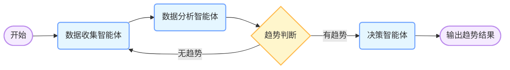

# 基于多智能体的自动化产业升级趋势识别

> 关键词：多智能体、自动化产业、升级趋势识别、智能系统、产业发展

> 摘要：本文聚焦于基于多智能体的自动化产业升级趋势识别这一前沿领域。随着科技的不断进步，自动化产业正面临着深刻的变革，多智能体系统因其独特的优势为产业升级趋势的识别提供了新的思路和方法。文章将详细阐述多智能体的核心概念与架构，深入剖析其用于趋势识别的核心算法原理及具体操作步骤，通过数学模型和公式对其进行理论支撑，并结合项目实战给出实际案例和详细解释。同时，探讨其实际应用场景，推荐相关的工具和资源，最后对未来发展趋势与挑战进行总结，旨在为相关领域的研究和实践提供全面且深入的参考。

## 1. 背景介绍 
### 1.1 目的和范围
在当今快速发展的科技时代，自动化产业作为推动经济增长和社会进步的重要力量，正经历着前所未有的变革。产业升级是自动化产业持续发展的必然选择，而准确识别升级趋势则是制定科学合理的发展战略和决策的关键前提。本研究的目的在于探索利用多智能体系统来实现自动化产业升级趋势的有效识别，为产业的发展提供精准的方向指引。

研究范围涵盖了多智能体系统的基本原理、相关算法、数学模型，以及其在自动化产业不同环节中的应用。同时，还包括对实际应用案例的分析和总结，以及对未来发展趋势的预测和探讨。

### 1.2 预期读者
本文预期读者主要包括从事自动化产业研究和实践的科研人员、工程师、企业管理者，以及对多智能体系统和产业升级趋势识别感兴趣的学者和爱好者。对于科研人员，本文可以为他们的研究提供新的思路和方法；对于工程师和企业管理者，能够帮助他们更好地理解和应用多智能体系统进行产业升级趋势的识别，从而制定更有效的发展策略；对于学者和爱好者，则可以作为了解该领域的入门资料和深入研究的参考。

### 1.3 文档结构概述
本文将按照以下结构展开：首先介绍背景信息，包括目的、预期读者和文档结构概述等；接着阐述多智能体的核心概念与联系，包括原理和架构的文本示意图及 Mermaid 流程图；然后详细讲解核心算法原理及具体操作步骤，并结合 Python 源代码进行说明；再给出数学模型和公式，并进行详细讲解和举例说明；之后通过项目实战展示代码实际案例和详细解释；接着探讨实际应用场景；再推荐相关的工具和资源；最后总结未来发展趋势与挑战，并给出常见问题与解答以及扩展阅读和参考资料。

### 1.4 术语表
#### 1.4.1 核心术语定义
- **多智能体系统（Multi - Agent System, MAS）**：由多个智能体组成的系统，每个智能体具有一定的自主性、智能性和交互能力，能够通过与其他智能体的协作来完成复杂的任务。
- **智能体（Agent）**：具有感知、决策和行动能力的实体，能够根据自身的状态和环境信息做出决策并采取相应的行动。
- **自动化产业**：利用自动化技术进行生产、管理和服务的产业，包括工业自动化、农业自动化、服务业自动化等多个领域。
- **产业升级趋势识别**：通过对产业相关数据的分析和处理，识别出产业在技术、市场、管理等方面的发展趋势，为产业升级提供依据。

#### 1.4.2 相关概念解释
- **自主性**：智能体能够独立地感知环境、做出决策和采取行动，不受外界的直接控制。
- **智能性**：智能体具有一定的学习、推理和适应能力，能够根据环境的变化调整自己的行为。
- **交互能力**：智能体能够与其他智能体或环境进行信息交换和协作，以实现共同的目标。

#### 1.4.3 缩略词列表
- **MAS**：Multi - Agent System（多智能体系统）
- **AI**：Artificial Intelligence（人工智能）
- **ML**：Machine Learning（机器学习）

## 2. 核心概念与联系 

### 核心概念原理
多智能体系统的核心原理在于多个智能体之间的协作与交互。每个智能体都有自己的目标和任务，它们通过感知环境获取信息，并根据这些信息进行决策和行动。智能体之间可以通过通信机制进行信息共享和协调，从而实现复杂的任务。

在自动化产业升级趋势识别中，不同的智能体可以负责不同的任务，例如数据收集智能体负责收集产业相关的数据，数据分析智能体负责对数据进行分析和处理，决策智能体则根据分析结果做出决策和预测。通过多个智能体的协作，可以更全面、准确地识别产业升级趋势。

### 架构的文本示意图
多智能体系统的架构通常包括智能体层、通信层和协调层。

智能体层由多个不同功能的智能体组成，如数据收集智能体、数据分析智能体、决策智能体等。每个智能体都有自己的内部结构和功能模块，包括感知模块、决策模块和行动模块。

通信层负责智能体之间的信息传递和共享。它提供了一种通信机制，使得智能体能够发送和接收信息，实现信息的流通和交互。

协调层则负责对智能体的行为进行协调和管理。它根据系统的目标和任务，对智能体的行动进行调度和控制，确保智能体之间的协作能够有效地完成任务。

### Mermaid 流程图


## 3. 核心算法原理 & 具体操作步骤 

### 核心算法原理
在基于多智能体的自动化产业升级趋势识别中，常用的算法包括机器学习算法和智能体协作算法。

机器学习算法可以用于对产业相关数据进行分析和处理，例如使用分类算法对产业发展阶段进行分类，使用回归算法对产业指标进行预测等。智能体协作算法则用于协调多个智能体的行为，确保它们能够有效地协作完成任务。

以下是一个使用 Python 实现的简单的多智能体协作算法示例，用于模拟数据收集智能体和数据分析智能体的协作过程。

```python
import random

# 定义数据收集智能体类
class DataCollectionAgent:
    def __init__(self):
        self.data = []

    def collect_data(self):
        # 模拟收集数据
        data_point = random.randint(1, 100)
        self.data.append(data_point)
        return data_point

# 定义数据分析智能体类
class DataAnalysisAgent:
    def __init__(self):
        self.trend = None

    def analyze_data(self, data):
        # 简单的趋势分析，假设数据增长则为上升趋势
        if len(data) > 1 and data[-1] > data[-2]:
            self.trend = "上升趋势"
        else:
            self.trend = "无明显趋势"
        return self.trend

# 主程序
if __name__ == "__main__":
    data_collector = DataCollectionAgent()
    data_analyzer = DataAnalysisAgent()

    collected_data = []
    for _ in range(5):
        new_data = data_collector.collect_data()
        collected_data.append(new_data)
        trend = data_analyzer.analyze_data(collected_data)
        print(f"收集到的数据: {new_data}, 当前趋势: {trend}")
```

### 具体操作步骤
1. **数据收集阶段**：数据收集智能体通过各种方式收集自动化产业相关的数据，如市场数据、技术数据、生产数据等。
2. **数据传输阶段**：数据收集智能体将收集到的数据传输给数据分析智能体。
3. **数据分析阶段**：数据分析智能体对接收到的数据进行分析和处理，使用机器学习算法或其他分析方法识别产业升级趋势。
4. **决策阶段**：决策智能体根据数据分析结果做出决策和预测，为产业升级提供建议和指导。
5. **反馈阶段**：将决策结果反馈给相关部门和人员，以便他们采取相应的措施。

## 4. 数学模型和公式 & 详细讲解 & 举例说明 

### 数学模型
在基于多智能体的自动化产业升级趋势识别中，可以使用时间序列模型来对产业指标进行预测。时间序列模型是一种基于历史数据来预测未来值的统计模型，常用的时间序列模型包括 ARIMA（Autoregressive Integrated Moving Average）模型。

ARIMA 模型的一般形式为：

$$
\phi(B)(1 - B)^dY_t = \theta(B)\epsilon_t
$$

其中，$Y_t$ 是时间序列数据，$B$ 是滞后算子，$d$ 是差分阶数，$\phi(B)$ 是自回归多项式，$\theta(B)$ 是移动平均多项式，$\epsilon_t$ 是白噪声序列。

### 详细讲解
- **自回归部分（AR）**：自回归部分表示当前值与过去值之间的关系，通过自回归多项式 $\phi(B)$ 来描述。
- **差分部分（I）**：差分部分用于消除时间序列的非平稳性，通过差分阶数 $d$ 来控制。
- **移动平均部分（MA）**：移动平均部分表示当前值与过去误差项之间的关系，通过移动平均多项式 $\theta(B)$ 来描述。

### 举例说明
假设我们要预测自动化产业的市场规模，我们可以收集过去几年的市场规模数据作为时间序列数据。然后，我们可以使用 ARIMA 模型对这些数据进行建模和预测。

以下是一个使用 Python 的 `statsmodels` 库实现 ARIMA 模型的示例代码：

```python
import pandas as pd
from statsmodels.tsa.arima.model import ARIMA

# 生成示例数据
data = [100, 120, 130, 150, 160, 180, 200, 220, 230, 250]
index = pd.date_range(start='2020-01-01', periods=len(data), freq='M')
series = pd.Series(data, index=index)

# 拟合 ARIMA 模型
model = ARIMA(series, order=(1, 1, 1))
model_fit = model.fit()

# 进行预测
forecast_steps = 3
forecast = model_fit.get_forecast(steps=forecast_steps)
forecast_mean = forecast.predicted_mean

print("预测结果:")
print(forecast_mean)
```

在这个示例中，我们首先生成了一个简单的时间序列数据，然后使用 ARIMA 模型对其进行拟合和预测。最后，我们输出了未来 3 个时间步的预测结果。

## 5. 项目实战：代码实际案例和详细解释说明 

### 5.1  开发环境搭建
- **操作系统**：推荐使用 Linux 或 Windows 操作系统。
- **编程语言**：Python 3.x
- **开发工具**：可以使用 PyCharm、Jupyter Notebook 等开发工具。
- **相关库**：需要安装 `numpy`、`pandas`、`statsmodels`、`sklearn` 等相关库。可以使用以下命令进行安装：
```sh
pip install numpy pandas statsmodels scikit-learn
```

### 5.2  源代码详细实现和代码解读
以下是一个完整的基于多智能体的自动化产业升级趋势识别项目的示例代码：

```python
import random
import pandas as pd
from statsmodels.tsa.arima.model import ARIMA

# 定义数据收集智能体类
class DataCollectionAgent:
    def __init__(self, data_size=10):
        self.data_size = data_size
        self.data = []

    def collect_data(self):
        # 模拟收集数据
        for _ in range(self.data_size):
            data_point = random.randint(1, 100)
            self.data.append(data_point)
        return self.data

# 定义数据分析智能体类
class DataAnalysisAgent:
    def __init__(self, p=1, d=1, q=1):
        self.p = p
        self.d = d
        self.q = q
        self.trend = None

    def analyze_data(self, data):
        index = pd.date_range(start='2020-01-01', periods=len(data), freq='M')
        series = pd.Series(data, index=index)

        # 拟合 ARIMA 模型
        model = ARIMA(series, order=(self.p, self.d, self.q))
        model_fit = model.fit()

        # 进行预测
        forecast_steps = 3
        forecast = model_fit.get_forecast(steps=forecast_steps)
        forecast_mean = forecast.predicted_mean

        # 判断趋势
        if forecast_mean[-1] > series[-1]:
            self.trend = "上升趋势"
        else:
            self.trend = "无明显上升趋势"

        return self.trend, forecast_mean

# 主程序
if __name__ == "__main__":
    data_collector = DataCollectionAgent()
    data_analyzer = DataAnalysisAgent()

    collected_data = data_collector.collect_data()
    trend, forecast = data_analyzer.analyze_data(collected_data)

    print("收集到的数据:")
    print(collected_data)
    print(f"预测的趋势: {trend}")
    print("预测结果:")
    print(forecast)
```

### 5.3  代码解读与分析
- **数据收集智能体（`DataCollectionAgent`）**：该类负责模拟收集自动化产业相关的数据。`collect_data` 方法使用 `random` 模块生成随机数据，并将其存储在 `self.data` 列表中。
- **数据分析智能体（`DataAnalysisAgent`）**：该类负责对收集到的数据进行分析和处理。`analyze_data` 方法首先将数据转换为 `pandas` 的 `Series` 对象，然后使用 ARIMA 模型进行拟合和预测。最后，根据预测结果判断产业升级趋势。
- **主程序**：创建数据收集智能体和数据分析智能体对象，调用数据收集方法收集数据，然后调用数据分析方法进行分析和预测，并输出结果。

## 6. 实际应用场景 
### 工业自动化
在工业自动化领域，基于多智能体的自动化产业升级趋势识别可以用于预测生产线的性能变化、设备的故障发生概率等。通过收集生产线的运行数据、设备的状态数据等，使用多智能体系统进行分析和处理，可以及时发现潜在的问题和趋势，提前采取措施进行调整和优化，提高生产效率和质量。

### 农业自动化
在农业自动化方面，多智能体系统可以用于识别农作物的生长趋势、土壤肥力变化等。通过收集土壤湿度、温度、光照等环境数据，以及农作物的生长指标数据，使用多智能体系统进行分析和预测，可以为农业生产提供科学的决策依据，实现精准农业。

### 服务业自动化
在服务业自动化领域，如金融服务、物流服务等，多智能体系统可以用于识别市场需求变化、客户行为趋势等。通过收集市场数据、客户交易数据等，使用多智能体系统进行分析和预测，可以帮助企业及时调整服务策略，提高服务质量和竞争力。

## 7. 工具和资源推荐
### 7.1 学习资源推荐
#### 7.1.1 书籍推荐
- 《多智能体系统》：全面介绍了多智能体系统的基本概念、理论和方法，是学习多智能体系统的经典教材。
- 《机器学习》：详细讲解了机器学习的各种算法和模型，对于理解基于机器学习的数据分析和趋势识别方法非常有帮助。
- 《时间序列分析及其应用》：深入探讨了时间序列分析的理论和方法，对于使用时间序列模型进行趋势预测有很大的指导作用。

#### 7.1.2 在线课程
- Coursera 上的 “Multi - Agent Systems” 课程：由知名高校的教授授课，系统地介绍了多智能体系统的相关知识。
- edX 上的 “Machine Learning” 课程：提供了丰富的机器学习学习资源和实践项目。
- 中国大学 MOOC 上的 “时间序列分析” 课程：适合国内学习者深入学习时间序列分析的理论和方法。

#### 7.1.3 技术博客和网站
- Towards Data Science：一个专注于数据科学和机器学习的技术博客，提供了大量的高质量文章和案例分析。
- arXiv：一个开放的学术预印本平台，包含了很多关于多智能体系统、机器学习等领域的最新研究成果。
- AI 研习社：国内的一个人工智能技术社区，有很多关于多智能体系统和产业升级趋势识别的技术分享和讨论。

### 7.2 开发工具框架推荐
#### 7.2.1 IDE和编辑器
- PyCharm：一款功能强大的 Python 集成开发环境，提供了丰富的代码编辑、调试和分析功能。
- Jupyter Notebook：一个交互式的编程环境，适合进行数据分析和模型实验。
- Visual Studio Code：一款轻量级的代码编辑器，支持多种编程语言和插件扩展。

#### 7.2.2 调试和性能分析工具
- PDB：Python 自带的调试工具，可以帮助开发者进行代码调试和问题排查。
- cProfile：Python 的性能分析工具，可以分析代码的