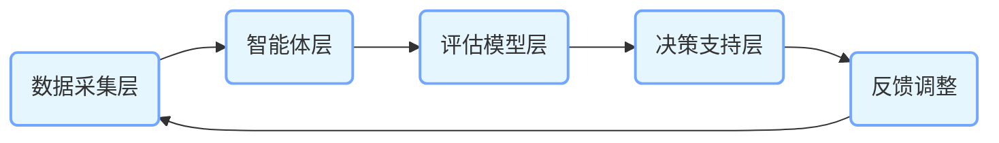

# 基于多智能体的自动化公司可持续发展评估

> 关键词：多智能体系统、自动化公司、可持续发展评估、智能决策、数据驱动

> 摘要：本文聚焦于基于多智能体的自动化公司可持续发展评估这一主题。首先介绍了研究的背景、目的、预期读者和文档结构，对相关术语进行了清晰定义。详细阐述了多智能体系统和可持续发展评估的核心概念及它们之间的联系，给出了原理和架构的文本示意图与 Mermaid 流程图。深入讲解了核心算法原理，并用 Python 代码进行具体说明，同时给出了数学模型和公式并举例。通过项目实战，从开发环境搭建、源代码实现与解读等方面展示了如何进行实际操作。探讨了该评估方法在不同场景下的实际应用，推荐了相关的学习资源、开发工具框架和论文著作。最后总结了未来发展趋势与挑战，解答了常见问题，并提供了扩展阅读和参考资料，旨在为自动化公司的可持续发展评估提供全面且深入的技术指导。

## 1. 背景介绍 
### 1.1 目的和范围
在当今竞争激烈且注重可持续发展的商业环境中，自动化公司面临着不断评估自身可持续发展能力的需求。本研究的目的在于开发一种基于多智能体的自动化公司可持续发展评估方法，以更全面、准确、智能地评估公司的可持续发展状况。范围涵盖了自动化公司在经济、环境和社会三个维度的可持续发展指标评估，利用多智能体系统的分布式计算和智能决策能力，实现对大量复杂数据的高效处理和分析。

### 1.2 预期读者
本文预期读者包括自动化公司的管理人员、技术研发人员、可持续发展领域的研究人员以及对多智能体系统和可持续发展评估感兴趣的学者和爱好者。管理人员可以从中了解如何利用先进技术评估公司的可持续发展状况，为决策提供依据；技术研发人员可以获取相关的算法原理和代码实现细节，用于开发实际的评估系统；研究人员可以在现有研究基础上进行深入探讨和创新；爱好者则可以通过本文对该领域有一个初步的了解。

### 1.3 文档结构概述
本文将按照以下结构进行阐述：首先介绍核心概念与联系，明确多智能体系统和可持续发展评估的基本原理和架构；接着详细讲解核心算法原理和具体操作步骤，并用 Python 代码进行说明；然后给出数学模型和公式，并举例说明其应用；通过项目实战展示代码的实际案例和详细解释；探讨该评估方法的实际应用场景；推荐相关的工具和资源；最后总结未来发展趋势与挑战，解答常见问题，并提供扩展阅读和参考资料。

### 1.4 术语表
#### 1.4.1 核心术语定义
- **多智能体系统（Multi - Agent System，MAS）**：由多个智能体组成的系统，每个智能体具有一定的自主性、智能性和交互能力，能够通过与其他智能体和环境进行交互来实现系统的整体目标。
- **自动化公司**：指广泛应用自动化技术进行生产、管理和运营的企业，其业务流程在一定程度上实现了自动化控制和决策。
- **可持续发展评估**：对公司在经济、环境和社会三个维度的长期发展能力进行综合评价的过程，旨在衡量公司在实现自身发展的同时，对环境和社会的影响是否具有可持续性。

#### 1.4.2 相关概念解释
- **智能体**：具有感知、决策和行动能力的实体，能够根据自身的知识和环境信息做出合理的决策，并采取相应的行动。在多智能体系统中，智能体可以是软件程序、硬件设备或人类。
- **分布式计算**：将一个大型计算任务分解为多个子任务，分布在不同的计算节点上进行并行处理，以提高计算效率和系统的可靠性。
- **可持续发展指标**：用于衡量公司可持续发展状况的一系列量化指标，包括经济指标（如利润率、资产负债率等）、环境指标（如能源消耗、污染物排放等）和社会指标（如员工满意度、社会责任履行情况等）。

#### 1.4.3 缩略词列表
- **MAS**：Multi - Agent System（多智能体系统）
- **SDG**：Sustainable Development Goals（可持续发展目标）

## 2. 核心概念与联系 

### 核心概念原理
#### 多智能体系统原理
多智能体系统基于分布式人工智能的思想，通过多个智能体之间的协作和交互来完成复杂的任务。每个智能体具有自己的目标、知识和能力，能够感知环境信息，并根据这些信息做出决策和采取行动。智能体之间可以通过消息传递、协商等方式进行通信和协作，以实现系统的整体目标。例如，在一个交通管理的多智能体系统中，每个交通信号灯可以看作一个智能体，它们根据周围的交通流量信息调整信号灯的时间，以优化交通流畅性。

#### 可持续发展评估原理
可持续发展评估是一个综合评价过程，需要考虑公司在经济、环境和社会三个维度的表现。通过收集和分析相关的指标数据，建立评估模型，对公司的可持续发展状况进行量化评估。评估结果可以为公司的决策提供依据，帮助公司制定可持续发展战略，提高竞争力。例如，通过评估公司的能源消耗和污染物排放情况，公司可以采取相应的措施来降低环境影响，实现可持续发展。

### 架构的文本示意图
多智能体的自动化公司可持续发展评估系统架构主要包括以下几个部分：
- **数据采集层**：负责收集自动化公司在经济、环境和社会三个维度的相关数据，包括财务报表、能源消耗记录、员工满意度调查等。
- **智能体层**：由多个智能体组成，每个智能体负责处理特定类型的数据或执行特定的任务。例如，经济智能体负责处理财务数据，环境智能体负责处理环境数据，社会智能体负责处理社会数据。智能体之间通过通信机制进行信息交换和协作。
- **评估模型层**：根据智能体处理后的数据，建立可持续发展评估模型，对公司的可持续发展状况进行量化评估。评估模型可以采用多种方法，如层次分析法、模糊综合评价法等。
- **决策支持层**：根据评估结果，为公司的决策提供支持。例如，建议公司采取哪些措施来提高可持续发展水平，如何优化资源配置等。

### Mermaid 流程图


该流程图展示了基于多智能体的自动化公司可持续发展评估系统的工作流程。首先，数据采集层收集相关数据，然后将数据传输到智能体层进行处理。智能体层处理后的数据输入到评估模型层进行评估，评估结果传输到决策支持层为公司决策提供支持。最后，决策支持层的反馈信息用于调整数据采集和处理过程，形成一个闭环系统。

## 3. 核心算法原理 & 具体操作步骤 

### 核心算法原理
本系统采用的核心算法是基于多智能体的协同计算和模糊综合评价法。多智能体的协同计算可以充分发挥每个智能体的优势，提高数据处理和分析的效率。模糊综合评价法可以处理评估过程中的不确定性和模糊性，更准确地评估公司的可持续发展状况。

#### 多智能体协同计算原理
每个智能体根据自己的任务和知识，对采集到的数据进行初步处理和分析。然后，智能体之间通过通信机制进行信息交换和协作，共同完成复杂的计算任务。例如，经济智能体和环境智能体可以共享数据，分析经济发展与环境影响之间的关系。

#### 模糊综合评价法原理
模糊综合评价法是一种基于模糊数学的综合评价方法，它通过确定评价指标的权重和隶属度函数，对评价对象进行综合评价。具体步骤如下：
1. 确定评价指标集 $U = \{u_1, u_2, \cdots, u_n\}$，其中 $u_i$ 表示第 $i$ 个评价指标。
2. 确定评语集 $V = \{v_1, v_2, \cdots, v_m\}$，其中 $v_j$ 表示第 $j$ 个评语等级。
3. 确定评价指标的权重向量 $W = \{w_1, w_2, \cdots, w_n\}$，其中 $w_i$ 表示第 $i$ 个评价指标的权重，且 $\sum_{i = 1}^{n} w_i = 1$。
4. 确定隶属度矩阵 $R = (r_{ij})_{n \times m}$，其中 $r_{ij}$ 表示第 $i$ 个评价指标对第 $j$ 个评语等级的隶属度。
5. 计算综合评价结果 $B = W \cdot R$，其中 $B = \{b_1, b_2, \cdots, b_m\}$，$b_j$ 表示评价对象对第 $j$ 个评语等级的综合隶属度。

### 具体操作步骤
#### 数据采集
通过自动化系统、传感器、调查问卷等方式收集自动化公司在经济、环境和社会三个维度的相关数据。

#### 智能体数据处理
每个智能体对采集到的数据进行清洗、预处理和特征提取。例如，经济智能体对财务数据进行分析，计算利润率、资产负债率等指标；环境智能体对能源消耗数据进行处理，计算能源利用率等指标。

#### 智能体协作
智能体之间通过消息传递机制进行信息交换和协作。例如，经济智能体和环境智能体可以共享数据，分析经济发展与环境影响之间的关系。

#### 模糊综合评价
根据智能体处理后的数据，确定评价指标集、评语集、权重向量和隶属度矩阵，然后进行模糊综合评价，得到公司的可持续发展评估结果。

### Python 源代码详细阐述
```python
import numpy as np

# 定义评价指标集
U = ['经济指标1', '经济指标2', '环境指标1', '环境指标2', '社会指标1', '社会指标2']

# 定义评语集
V = ['优秀', '良好', '中等', '较差', '差']

# 定义评价指标的权重向量
W = np.array([0.2, 0.2, 0.2, 0.2, 0.1, 0.1])

# 定义隶属度矩阵
R = np.array([
    [0.1, 0.3, 0.4, 0.1, 0.1],
    [0.2, 0.3, 0.3, 0.1, 0.1],
    [0.1, 0.2, 0.4, 0.2, 0.1],
    [0.1, 0.2, 0.3, 0.3, 0.1],
    [0.2, 0.3, 0.3, 0.1, 0.1],
    [0.1, 0.2, 0.3, 0.3, 0.1]
])

# 计算综合评价结果
B = np.dot(W, R)

# 输出结果
print("综合评价结果:", B)
```
在上述代码中，首先定义了评价指标集 $U$、评语集 $V$、权重向量 $W$ 和隶属度矩阵 $R$。然后，使用 `np.dot` 函数计算综合评价结果 $B$。最后，输出综合评价结果。

## 4. 数学模型和公式 & 详细讲解 & 举例说明 

### 数学模型和公式
#### 模糊综合评价模型
如前文所述，模糊综合评价模型的核心公式为：
$$B = W \cdot R$$
其中，$B$ 是综合评价结果向量，$W$ 是评价指标的权重向量，$R$ 是隶属度矩阵。

#### 权重计算方法
权重的计算可以采用多种方法，如层次分析法（AHP）。层次分析法的基本步骤如下：
1. 建立层次结构模型，将评价问题分解为目标层、准则层和方案层。
2. 构造判断矩阵 $A = (a_{ij})_{n \times n}$，其中 $a_{ij}$ 表示第 $i$ 个指标相对于第 $j$ 个指标的重要性程度，且 $a_{ij} > 0$，$a_{ji} = \frac{1}{a_{ij}}$。
3. 计算判断矩阵的最大特征根 $\lambda_{max}$ 和对应的特征向量 $W$。
4. 进行一致性检验，计算一致性指标 $CI = \frac{\lambda_{max} - n}{n - 1}$，其中 $n$ 是判断矩阵的阶数。然后，查找平均随机一致性指标 $RI$，计算一致性比率 $CR = \frac{CI}{RI}$。当 $CR < 0.1$ 时，认为判断矩阵具有满意的一致性。

### 详细讲解
#### 模糊综合评价模型讲解
模糊综合评价模型通过将评价指标的权重和隶属度矩阵相乘，得到综合评价结果向量。综合评价结果向量中的每个元素表示评价对象对相应评语等级的综合隶属度。通过比较综合隶属度的大小，可以确定评价对象的最终评价等级。

#### 权重计算方法讲解
层次分析法通过构造判断矩阵，将评价指标的相对重要性进行量化。判断矩阵的元素 $a_{ij}$ 可以根据专家经验或实际数据进行确定。通过计算判断矩阵的最大特征根和对应的特征向量，可以得到评价指标的权重向量。一致性检验是为了确保判断矩阵的合理性和可靠性。

### 举例说明
假设我们要对一个自动化公司的可持续发展状况进行评估，采用上述模糊综合评价模型和层次分析法。

#### 确定评价指标集和评语集
评价指标集 $U = \{u_1, u_2, u_3, u_4\}$，其中 $u_1$ 表示利润率，$u_2$ 表示能源利用率，$u_3$ 表示员工满意度，$u_4$ 表示社会责任履行情况。评语集 $V = \{v_1, v_2, v_3, v_4\}$，其中 $v_1$ 表示优秀，$v_2$ 表示良好，$v_3$ 表示中等，$v_4$ 表示较差。

#### 构造判断矩阵
假设通过专家评估，得到判断矩阵 $A$ 如下：
$$A = \begin{bmatrix}
1 & 3 & 5 & 2 \\
\frac{1}{3} & 1 & 3 & \frac{1}{2} \\
\frac{1}{5} & \frac{1}{3} & 1 & \frac{1}{4} \\
\frac{1}{2} & 2 & 4 & 1
\end{bmatrix}$$

#### 计算权重向量
使用 Python 代码计算权重向量：
```python
import numpy as np

A = np.array([
    [1, 3, 5, 2],
    [1/3, 1, 3, 1/2],
    [1/5, 1/3, 1, 1/4],
    [1/2, 2, 4, 1]
])

# 计算特征值和特征向量
eigenvalues, eigenvectors = np.linalg.eig(A)

# 找到最大特征值及其对应的特征向量
max_eigenvalue_index = np.argmax(eigenvalues)
max_eigenvalue = eigenvalues[max_eigenvalue_index].real
W = eigenvectors[:, max_eigenvalue_index].real

# 归一化权重向量
W = W / np.sum(W)

print("权重向量:", W)
```

#### 计算一致性指标和一致性比率
```python
n = A.shape[0]
CI = (max_eigenvalue - n) / (n - 1)
RI = 0.9  # 当 n = 4 时，RI 的值
CR = CI / RI

print("一致性指标 CI:", CI)
print("一致性比率 CR:", CR)
```
如果 $CR < 0.1$，则认为判断矩阵具有满意的一致性，权重向量可以使用。

#### 确定隶属度矩阵
假设通过数据收集和分析，得到隶属度矩阵 $R$ 如下：
$$R = \begin{bmatrix}
0.2 & 0.3 & 0.4 & 0.1 \\
0.1 & 0.3 & 0.4 & 0.2 \\
0.3 & 0.4 & 0.2 & 0.1 \\
0.2 & 0.3 & 0.3 & 0.2
\end{bmatrix}$$

#### 计算综合评价结果
```python
B = np.dot(W, R)
print("综合评价结果:", B)
```
根据综合评价结果向量 $B$ 中的元素大小，可以确定该自动化公司的可持续发展评价等级。

## 5. 项目实战：代码实际案例和详细解释说明 

### 5.1  开发环境搭建
#### 操作系统
本项目可以在 Windows、Linux 或 macOS 操作系统上进行开发。建议使用最新版本的操作系统以确保兼容性和稳定性。

#### Python 环境
安装 Python 3.7 或更高版本。可以从 Python 官方网站（https://www.python.org/downloads/）下载并安装。

#### 第三方库
安装以下第三方库：
- `numpy`：用于数值计算和矩阵运算。
- `pandas`：用于数据处理和分析。
- `matplotlib`：用于数据可视化。

可以使用以下命令进行安装：
```sh
pip install numpy pandas matplotlib
```

### 5.2  源代码详细实现和代码解读
```python
import numpy as np
import pandas as pd
import matplotlib.pyplot as plt

# 定义评价指标集
U = ['利润率', '能源利用率', '员工满意度', '社会责任履行情况']

# 定义评语集
V = ['优秀', '良好', '中等', '较差']

# 构造判断矩阵
A = np.array([
    [1, 3, 5, 2],
    [1/3, 1, 3, 1/2],
    [1/5, 1/3, 1, 1/4],
    [1/2, 2, 4, 1]
])

# 计算特征值和特征向量
eigenvalues, eigenvectors = np.linalg.eig(A)

# 找到最大特征值及其对应的特征向量
max_eigenvalue_index = np.argmax(eigenvalues)
max_eigenvalue = eigenvalues[max_eigenvalue_index].real
W = eigenvectors[:, max_eigenvalue_index].real

# 归一化权重向量
W = W / np.sum(W)

# 计算一致性指标和一致性比率
n = A.shape[0]
CI = (max_eigenvalue - n) / (n - 1)
RI = 0.9  # 当 n = 4 时，RI 的值
CR = CI / RI

if CR < 0.1:
    print("判断矩阵具有满意的一致性，权重向量可以使用。")
    print("权重向量:", W)
else:
    print("判断矩阵一致性较差，请重新调整判断矩阵。")

# 模拟隶属度矩阵
R = np.random.rand(len(U), len(V))
R = R / R.sum(axis=1, keepdims=True)  # 归一化隶属度矩阵

# 计算综合评价结果
B = np.dot(W, R)

# 输出综合评价结果
print("综合评价结果:", B)

# 数据可视化
plt.bar(V, B)
plt.xlabel('评语等级')
plt.ylabel('综合隶属度')
plt.title('自动化公司可持续发展评估结果')
plt.show()
```

### 5.3  代码解读与分析
#### 导入必要的库
```python
import numpy as np
import pandas as pd
import matplotlib.pyplot as plt
```
导入 `numpy` 用于数值计算和矩阵运算，`pandas` 用于数据处理和分析，`matplotlib` 用于数据可视化。

#### 定义评价指标集和评语集
```python
U = ['利润率', '能源利用率', '员工满意度', '社会责任履行情况']
V = ['优秀', '良好', '中等', '较差']
```
定义评价指标集和评语集，用于后续的评估。

#### 构造判断矩阵并计算权重向量
```python
A = np.array([
    [1, 3, 5, 2],
    [1/3, 1, 3, 1/2],
    [1/5, 1/3, 1, 1/4],
    [1/2, 2, 4, 1]
])

eigenvalues, eigenvectors = np.linalg.eig(A)
max_eigenvalue_index = np.argmax(eigenvalues)
max_eigenvalue = eigenvalues[max_eigenvalue_index].real
W = eigenvectors[:, max_eigenvalue_index].real
W = W / np.sum(W)
```
构造判断矩阵 $A$，使用 `np.linalg.eig` 函数计算特征值和特征向量，找到最大特征值及其对应的特征向量，归一化得到权重向量 $W$。

#### 计算一致性指标和一致性比率
```python
n = A.shape[0]
CI = (max_eigenvalue - n) / (n - 1)
RI = 0.9  # 当 n = 4 时，RI 的值
CR = CI / RI

if CR < 0.1:
    print("判断矩阵具有满意的一致性，权重向量可以使用。")
    print("权重向量:", W)
else:
    print("判断矩阵一致性较差，请重新调整判断矩阵。")
```
计算一致性指标 $CI$ 和一致性比率 $CR$，根据 $CR$ 的值判断判断矩阵的一致性。

#### 模拟隶属度矩阵并计算综合评价结果
```python
R = np.random.rand(len(U), len(V))
R = R / R.sum(axis=1, keepdims=True)
B = np.dot(W, R)
```
模拟隶属度矩阵 $R$，归一化后使用 `np.dot` 函数计算综合评价结果 $B$。

#### 数据可视化
```python
plt.bar(V, B)
plt.xlabel('评语等级')
plt.ylabel('综合隶属度')
plt.title('自动化公司可持续发展评估结果')
plt.show()
```
使用 `matplotlib` 库绘制柱状图，直观展示综合评价结果。

## 6. 实际应用场景 
### 公司战略规划
自动化公司可以利用基于多智能体的可持续发展评估结果，制定长期的战略规划。例如，如果评估结果显示公司在环境维度的表现较差，公司可以制定相应的环保战略，加大在节能减排、绿色技术研发等方面的投入，以提高公司的可持续发展能力。

### 投资决策
投资者可以将公司的可持续发展评估结果作为投资决策的重要参考。具有较高可持续发展水平的公司通常具有更好的长期发展潜力和抗风险能力，投资者更愿意对其进行投资。例如，一些绿色投资基金专门投资于在环境、社会和治理方面表现良好的公司。

### 供应链管理
自动化公司可以对其供应链上的合作伙伴进行可持续发展评估，选择那些具有较高可持续发展水平的供应商和合作伙伴。这样可以提高整个供应链的可持续性，降低供应链风险。例如，汽车制造企业可以要求其零部件供应商满足一定的环保和社会责任标准。

### 政府监管
政府可以利用基于多智能体的可持续发展评估系统，对自动化公司进行监管和评估。对于可持续发展表现优秀的公司，可以给予政策支持和奖励；对于表现较差的公司，可以采取相应的监管措施，促使其改进。例如，政府可以对节能减排达标企业给予税收优惠，对污染严重企业进行处罚。

## 7. 工具和资源推荐
### 7.1 学习资源推荐
#### 7.1.1 书籍推荐
- 《多智能体系统：原理与编程》：本书详细介绍了多智能体系统的基本原理、算法和编程实现，是学习多智能体系统的经典教材。
- 《可持续发展评估方法与应用》：该书系统阐述了可持续发展评估的各种方法和应用案例，对于深入理解可持续发展评估具有重要的参考价值。
- 《Python 数据分析实战》：帮助读者掌握 Python 在数据分析领域的应用，包括数据处理、分析和可视化等方面的知识。

#### 7.1.2 在线课程
- Coursera 上的“多智能体系统”课程：由知名高校的教授授课，内容涵盖多智能体系统的理论、算法和应用。
- edX 上的“可持续发展科学”课程：介绍了可持续发展的基本概念、理论和方法，以及如何在实际中应用。
- 中国大学 MOOC 上的“Python 语言程序设计”课程：适合初学者学习 Python 编程，为后续的项目开发打下基础。

#### 7.1.3 技术博客和网站
- 多智能体系统相关博客：如 Agent - Based Modeling and Simulation（ABMS）博客，提供了多智能体系统的最新研究成果和应用案例。
- 可持续发展领域网站：如联合国可持续发展目标网站（https://sdgs.un.org/），提供了关于可持续发展的权威信息和数据。
- Python 官方文档和博客：Python 官方网站（https://www.python.org/）提供了 Python 语言的详细文档和最新消息，有助于深入学习 Python 编程。

### 7.2 开发工具框架推荐
#### 7.2.1 IDE和编辑器
- PyCharm：一款专业的 Python 集成开发环境，具有代码编辑、调试、版本控制等功能，适合开发大型 Python 项目。
- Visual Studio Code：一款轻量级的代码编辑器，支持多种编程语言，具有丰富的插件扩展功能，可以用于 Python 代码的开发和调试。

#### 7.2.2 调试和性能分析工具
- pdb：Python 自带的调试器，可以帮助开发者定位代码中的错误和问题。
- cProfile：Python 标准库中的性能分析工具，可以分析代码的执行时间和性能瓶颈。

#### 7.2.3 相关框架和库
- Mesa：一个用于构建基于代理的模型的 Python 框架，提供了多智能体系统的开发工具和接口。
- Scikit - learn：一个强大的机器学习库，提供了多种机器学习算法和工具，可用于可持续发展评估中的数据建模和分析。

### 7.3 相关论文著作推荐
#### 7.3.1 经典论文
- “Multi - Agent Systems: A Modern Approach to Distributed Artificial Intelligence”：该论文介绍了多智能体系统的基本概念、理论和方法，是多智能体系统领域的经典之作。
- “Sustainable Development Assessment: A Review of Concepts, Methods and Tools”：对可持续发展评估的概念、方法和工具进行了全面的综述，为后续的研究提供了重要的参考。

#### 7.3.2 最新研究成果
- 关注国际顶级学术期刊，如《Artificial Intelligence》《Journal of Cleaner Production》等，这些期刊发表了多智能体系统和可持续发展评估领域的最新研究成果。

#### 7.3.3 应用案例分析
- 一些知名企业的可持续发展报告和案例研究，如西门子、ABB 等自动化公司的可持续发展报告，提供了实际应用中的经验和教训。

## 8. 总结：未来发展趋势与挑战
### 未来发展趋势
#### 智能化程度不断提高
随着人工智能技术的不断发展，多智能体系统的智能化程度将不断提高。智能体将具有更强的学习能力和自适应能力，能够更好地应对复杂多变的环境。例如，智能体可以通过深度学习算法自动学习可持续发展评估的规则和模式，提高评估的准确性和效率。

#### 与其他技术融合发展
基于多智能体的可持续发展评估系统将与物联网、大数据、区块链等技术深度融合。物联网技术可以实现对自动化公司各种数据的实时采集和传输；大数据技术可以对海量的数据进行存储和分析；区块链技术可以保证数据的安全性和可信度。通过技术融合，将进一步提高评估系统的性能和应用价值。

#### 应用领域不断拓展
除了自动化公司，基于多智能体的可持续发展评估方法将在更多领域得到应用，如能源行业、制造业、服务业等。不同行业可以根据自身的特点和需求，定制适合自己的评估指标和模型，实现可持续发展的目标。

### 挑战
#### 数据质量和安全性
数据是可持续发展评估的基础，数据的质量和安全性直接影响评估结果的准确性和可靠性。在实际应用中，可能存在数据缺失、错误、不一致等问题，同时数据的安全存储和传输也是一个重要的挑战。需要建立完善的数据管理机制，加强数据质量控制和安全保障。

#### 智能体协作和协调
多智能体系统中，智能体之间的协作和协调是一个关键问题。不同智能体可能具有不同的目标和利益，如何实现智能体之间的有效协作和协调，避免冲突和矛盾，是一个需要解决的难题。需要研究和开发更加有效的智能体协作算法和机制。

#### 评估指标和模型的合理性
可持续发展评估指标和模型的合理性直接影响评估结果的科学性和公正性。不同行业、不同企业的可持续发展特点和需求可能存在差异，如何制定具有通用性和针对性的评估指标和模型，是一个需要深入研究的问题。需要结合行业特点和企业实际情况，不断优化评估指标和模型。

## 9. 附录：常见问题与解答
### 问题 1：多智能体系统中的智能体是如何通信的？
解答：智能体之间可以通过消息传递机制进行通信。消息传递可以是基于网络的，如 TCP/IP 协议，也可以是基于共享内存的。智能体可以发送和接收各种类型的消息，包括数据、请求、指令等。消息传递的方式可以是同步的，也可以是异步的。

### 问题 2：如何确定评价指标的权重？
解答：评价指标的权重可以采用多种方法进行确定，如层次分析法（AHP）、德尔菲法等。层次分析法通过构造判断矩阵，将评价指标的相对重要性进行量化，计算出权重向量。德尔菲法通过专家咨询和反馈，逐步确定评价指标的权重。

### 问题 3：模糊综合评价法中的隶属度矩阵是如何确定的？
解答：隶属度矩阵的确定可以采用多种方法，如专家评估法、统计分析法等。专家评估法是邀请相关领域的专家对评价指标进行评估，确定其对评语等级的隶属度。统计分析法是通过对大量的历史数据进行统计分析，确定隶属度矩阵。

### 问题 4：基于多智能体的可持续发展评估系统的可扩展性如何？
解答：基于多智能体的可持续发展评估系统具有较好的可扩展性。可以通过增加智能体的数量和功能，扩展系统的处理能力和应用范围。同时，系统的模块化设计也使得可以方便地对系统进行升级和改进。

## 10. 扩展阅读 & 参考资料
### 扩展阅读
- 《复杂系统科学与多智能体系统》：深入介绍了复杂系统科学的基本概念和方法，以及多智能体系统在复杂系统中的应用。
- 《可持续发展经济学》：从经济学的角度探讨了可持续发展的理论和实践，为可持续发展评估提供了理论支持。

### 参考资料
- 联合国可持续发展目标报告（https://sdgs.un.org/reports）
- 《多智能体系统基础》教材
- 相关学术期刊上发表的研究论文

作者：AI天才研究院/AI Genius Institute & 禅与计算机程序设计艺术 /Zen And The Art of Computer Programming