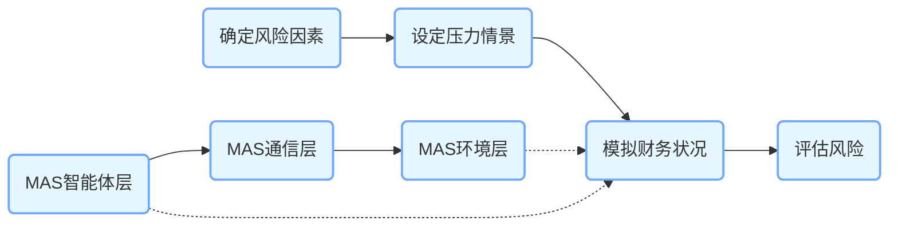

# 基于多智能体的自动化公司财务压力测试系统

> 关键词：多智能体系统、自动化、公司财务压力测试、金融风险管理、人工智能

> 摘要：本文旨在深入探讨基于多智能体的自动化公司财务压力测试系统。通过引入多智能体系统，可模拟复杂的金融市场环境和公司财务状况的动态变化，实现财务压力测试的自动化。文章详细介绍了该系统的核心概念、算法原理、数学模型，结合实际案例展示了系统的开发与应用，分析了其在金融风险管理中的实际应用场景，同时推荐了相关的学习资源、开发工具和论文著作。最后对系统的未来发展趋势与挑战进行了总结，并提供了常见问题解答和扩展阅读参考资料。

## 1. 背景介绍 
### 1.1 目的和范围
公司财务压力测试是评估公司在面临各种不利情况下财务状况稳定性的重要手段。传统的财务压力测试方法往往依赖于静态模型和假设，难以准确反映复杂多变的金融市场环境和公司内部动态。本系统的目的是构建一个基于多智能体的自动化财务压力测试系统，通过模拟不同智能体之间的交互和决策过程，更真实地反映市场动态和公司财务状况的变化，提高压力测试的准确性和有效性。

本系统的范围涵盖了公司财务的多个方面，包括资产负债表、利润表、现金流量表等。同时，考虑了市场风险、信用风险、流动性风险等多种风险因素，能够对不同行业、不同规模的公司进行财务压力测试。

### 1.2 预期读者
本文的预期读者包括金融行业的风险管理专家、财务分析师、投资经理，以及对人工智能和金融科技感兴趣的研究人员和开发者。对于金融从业者来说，本系统可以为他们提供更准确的财务风险评估工具；对于研究人员和开发者来说，本文可以为他们在多智能体系统和金融风险管理领域的研究和开发提供参考。

### 1.3 文档结构概述
本文将按照以下结构进行组织：
- 核心概念与联系：介绍多智能体系统和公司财务压力测试的核心概念，以及它们之间的联系。
- 核心算法原理 & 具体操作步骤：详细阐述系统所使用的核心算法原理，并给出具体的操作步骤。
- 数学模型和公式 & 详细讲解 & 举例说明：建立系统的数学模型，给出相关公式，并通过具体例子进行说明。
- 项目实战：代码实际案例和详细解释说明：通过实际的代码案例，展示系统的开发过程，并对代码进行详细解释。
- 实际应用场景：分析系统在金融风险管理中的实际应用场景。
- 工具和资源推荐：推荐相关的学习资源、开发工具和论文著作。
- 总结：未来发展趋势与挑战：对系统的未来发展趋势进行展望，并分析可能面临的挑战。
- 附录：常见问题与解答：提供常见问题的解答。
- 扩展阅读 & 参考资料：提供相关的扩展阅读资料和参考书目。

### 1.4 术语表
#### 1.4.1 核心术语定义
- **多智能体系统（Multi-Agent System, MAS）**：由多个智能体组成的系统，每个智能体具有自主决策能力，能够与其他智能体进行交互，共同完成系统的目标。
- **公司财务压力测试（Corporate Financial Stress Testing）**：评估公司在面临各种不利情况下财务状况稳定性的过程。
- **智能体（Agent）**：具有自主决策能力和行为能力的实体，能够感知环境并根据环境变化做出相应的决策。
- **风险因素（Risk Factor）**：可能导致公司财务状况恶化的各种因素，如市场波动、信用违约等。

#### 1.4.2 相关概念解释
- **市场风险（Market Risk）**：由于市场价格波动而导致公司资产价值下降的风险。
- **信用风险（Credit Risk）**：由于交易对手违约而导致公司遭受损失的风险。
- **流动性风险（Liquidity Risk）**：公司无法及时获得足够资金以满足其资金需求的风险。

#### 1.4.3 缩略词列表
- MAS：Multi-Agent System，多智能体系统
- CFS：Corporate Financial Stress，公司财务压力

## 2. 核心概念与联系 

### 多智能体系统原理
多智能体系统是由多个智能体组成的分布式系统。每个智能体具有一定的感知能力、决策能力和行动能力，能够根据自身的目标和环境信息做出决策，并与其他智能体进行交互。智能体之间的交互可以是合作、竞争或协商等多种形式。

多智能体系统的架构通常包括以下几个部分：
- **智能体层**：包含多个智能体，每个智能体负责特定的任务或功能。
- **通信层**：负责智能体之间的信息传递和交互。
- **环境层**：提供智能体所处的环境信息，包括市场数据、公司财务数据等。

### 公司财务压力测试原理
公司财务压力测试是通过模拟各种不利情况，评估公司在这些情况下的财务状况。常见的不利情况包括市场衰退、利率上升、信用违约等。财务压力测试的主要步骤包括：
- **确定风险因素**：识别可能对公司财务状况产生影响的风险因素。
- **设定压力情景**：根据风险因素设定不同的压力情景，如轻度、中度和重度压力情景。
- **模拟财务状况**：在每个压力情景下，模拟公司的财务状况，包括资产负债表、利润表和现金流量表等。
- **评估风险**：根据模拟结果评估公司在不同压力情景下的风险承受能力。

### 两者的联系
多智能体系统可以为公司财务压力测试提供更真实的模拟环境。通过将市场参与者、公司管理层等抽象为智能体，模拟它们之间的交互和决策过程，可以更准确地反映市场动态和公司财务状况的变化。例如，市场参与者智能体可以根据市场情况调整自己的投资策略，公司管理层智能体可以根据公司财务状况做出决策，如调整生产规模、融资等。这些智能体之间的交互可以影响市场价格和公司的财务状况，从而更真实地模拟财务压力测试的情景。

### 文本示意图
```plaintext
多智能体系统
├── 智能体层
│   ├── 市场参与者智能体
│   ├── 公司管理层智能体
│   └── 监管机构智能体
├── 通信层
│   └── 消息传递机制
└── 环境层
    ├── 市场数据
    ├── 公司财务数据
    └── 宏观经济数据

公司财务压力测试
├── 确定风险因素
├── 设定压力情景
├── 模拟财务状况
└── 评估风险

联系：多智能体系统模拟环境为财务压力测试提供更真实情景
```

### Mermaid 流程图


## 3. 核心算法原理 & 具体操作步骤 

### 核心算法原理
本系统采用基于规则的决策算法和蒙特卡罗模拟算法。

#### 基于规则的决策算法
每个智能体根据预先设定的规则进行决策。例如，市场参与者智能体根据市场价格和自身的投资策略决定是否买入或卖出资产；公司管理层智能体根据公司的财务状况决定是否进行融资或调整生产规模。规则的设定可以基于历史数据和专家经验。

#### 蒙特卡罗模拟算法
蒙特卡罗模拟算法用于模拟市场数据和公司财务数据的随机变化。通过多次随机抽样，生成不同的市场情景和公司财务状况，从而评估公司在不同情景下的风险承受能力。

### 具体操作步骤
#### 步骤 1：初始化系统
- 定义智能体的类型和数量，包括市场参与者智能体、公司管理层智能体和监管机构智能体。
- 初始化智能体的属性和状态，如市场参与者的初始资金、公司的初始资产负债表等。
- 加载市场数据和公司财务数据，作为系统的初始环境信息。

#### 步骤 2：设定压力情景
- 确定风险因素，如市场利率、汇率、信用违约率等。
- 根据风险因素设定不同的压力情景，如轻度、中度和重度压力情景。

#### 步骤 3：智能体决策
- 每个智能体根据自身的规则和环境信息进行决策。
- 市场参与者智能体根据市场价格和投资策略进行交易。
- 公司管理层智能体根据公司财务状况进行融资、投资和生产决策。

#### 步骤 4：更新环境信息
- 根据智能体的决策结果，更新市场数据和公司财务数据。
- 例如，市场参与者的交易行为会影响市场价格，公司的融资和投资决策会影响公司的资产负债表。

#### 步骤 5：蒙特卡罗模拟
- 使用蒙特卡罗模拟算法生成不同的市场情景和公司财务状况。
- 重复步骤 3 和步骤 4 多次，得到不同情景下的模拟结果。

#### 步骤 6：评估风险
- 根据模拟结果评估公司在不同压力情景下的风险承受能力。
- 计算风险指标，如违约概率、损失期望等。

### Python 源代码实现
```python
import random

# 定义市场参与者智能体类
class MarketParticipantAgent:
    def __init__(self, initial_funds):
        self.funds = initial_funds
        self.assets = []

    def make_decision(self, market_price):
        # 简单的决策规则：如果价格低于 100 则买入
        if market_price < 100:
            if self.funds > market_price:
                self.assets.append(market_price)
                self.funds -= market_price
        # 如果价格高于 200 则卖出
        elif market_price > 200 and len(self.assets) > 0:
            self.funds += market_price
            self.assets.pop()

# 定义公司管理层智能体类
class CompanyManagementAgent:
    def __init__(self, initial_assets, initial_liabilities):
        self.assets = initial_assets
        self.liabilities = initial_liabilities

    def make_decision(self):
        # 简单的决策规则：如果资产负债率高于 0.8 则融资
        if self.liabilities / self.assets > 0.8:
            self.assets += 100
            self.liabilities += 100

# 初始化系统
market_participants = [MarketParticipantAgent(1000) for _ in range(10)]
company_management = CompanyManagementAgent(1000, 500)

# 设定压力情景
pressure_scenarios = [80, 150, 220]

# 蒙特卡罗模拟
num_simulations = 100
for scenario in pressure_scenarios:
    total_loss = 0
    for _ in range(num_simulations):
        # 模拟市场价格
        market_price = scenario + random.uniform(-10, 10)

        # 智能体决策
        for participant in market_participants:
            participant.make_decision(market_price)
        company_management.make_decision()

        # 评估风险（简单示例：计算公司资产负债率）
        debt_ratio = company_management.liabilities / company_management.assets
        if debt_ratio > 1:
            total_loss += 1

    # 输出结果
    print(f"压力情景: {scenario}, 违约概率: {total_loss / num_simulations}")
```

### 代码解释
- `MarketParticipantAgent` 类表示市场参与者智能体，具有初始资金和资产列表。`make_decision` 方法根据市场价格和自身资金情况决定是否买入或卖出资产。
- `CompanyManagementAgent` 类表示公司管理层智能体，具有初始资产和负债。`make_decision` 方法根据公司的资产负债率决定是否进行融资。
- 在主程序中，初始化了市场参与者智能体和公司管理层智能体，设定了压力情景。通过蒙特卡罗模拟，多次模拟市场价格，让智能体进行决策，并评估公司的风险。

## 4. 数学模型和公式 & 详细讲解 & 举例说明 

### 数学模型
本系统的数学模型主要包括市场价格模型、公司财务模型和风险评估模型。

#### 市场价格模型
市场价格的变化可以用随机过程来描述，如几何布朗运动。几何布朗运动的数学公式为：
$$dS_t = \mu S_t dt + \sigma S_t dW_t$$
其中，$S_t$ 表示市场价格在时间 $t$ 的值，$\mu$ 表示市场价格的漂移率，$\sigma$ 表示市场价格的波动率，$dW_t$ 表示标准布朗运动的增量。

#### 公司财务模型
公司的资产负债表可以用以下公式表示：
$$A_t = A_{t-1} + I_t - E_t + F_t$$
$$L_t = L_{t-1} + D_t - R_t$$
其中，$A_t$ 和 $L_t$ 分别表示公司在时间 $t$ 的资产和负债，$I_t$ 和 $E_t$ 分别表示公司在时间 $t$ 的收入和支出，$F_t$ 表示公司在时间 $t$ 的融资额，$D_t$ 和 $R_t$ 分别表示公司在时间 $t$ 的新增债务和偿还债务。

#### 风险评估模型
常用的风险评估指标包括违约概率（Probability of Default, PD）和损失期望（Expected Loss, EL）。违约概率可以通过历史数据和统计模型进行估计，损失期望的计算公式为：
$$EL = PD \times LGD \times EAD$$
其中，$LGD$ 表示违约损失率，$EAD$ 表示违约暴露。

### 详细讲解
#### 市场价格模型
几何布朗运动是一种常见的随机过程，用于描述金融资产价格的变化。漂移率 $\mu$ 表示市场价格的平均增长率，波动率 $\sigma$ 表示市场价格的波动程度。标准布朗运动的增量 $dW_t$ 是一个随机变量，服从均值为 0，方差为 $dt$ 的正态分布。

#### 公司财务模型
公司的资产负债表反映了公司在某一时刻的财务状况。资产的变化取决于收入、支出和融资情况，负债的变化取决于新增债务和偿还债务情况。

#### 风险评估模型
违约概率是指公司在一定时间内违约的可能性，违约损失率是指公司违约时债权人可能遭受的损失比例，违约暴露是指公司违约时债权人的暴露金额。损失期望综合考虑了违约概率、违约损失率和违约暴露，是评估公司信用风险的重要指标。

### 举例说明
假设市场价格的初始值为 $S_0 = 100$，漂移率 $\mu = 0.05$，波动率 $\sigma = 0.2$，时间间隔 $dt = 1$。则在一个时间步后，市场价格的变化可以通过以下公式计算：
$$S_1 = S_0 + \mu S_0 dt + \sigma S_0 \sqrt{dt} \epsilon$$
其中，$\epsilon$ 是一个服从标准正态分布的随机变量。假设 $\epsilon = 0.5$，则：
$$S_1 = 100 + 0.05 \times 100 \times 1 + 0.2 \times 100 \times \sqrt{1} \times 0.5 = 115$$

假设公司的初始资产为 $A_0 = 1000$，初始负债为 $L_0 = 500$，收入 $I_1 = 200$，支出 $E_1 = 150$，融资额 $F_1 = 100$，新增债务 $D_1 = 50$，偿还债务 $R_1 = 20$。则在一个时间步后，公司的资产和负债分别为：
$$A_1 = A_0 + I_1 - E_1 + F_1 = 1000 + 200 - 150 + 100 = 1150$$
$$L_1 = L_0 + D_1 - R_1 = 500 + 50 - 20 = 530$$

假设违约概率 $PD = 0.1$，违约损失率 $LGD = 0.5$，违约暴露 $EAD = 530$，则损失期望为：
$$EL = PD \times LGD \times EAD = 0.1 \times 0.5 \times 530 = 26.5$$

## 5. 项目实战：代码实际案例和详细解释说明 

### 5.1  开发环境搭建
#### 安装 Python
本项目使用 Python 进行开发，建议使用 Python 3.7 及以上版本。可以从 Python 官方网站（https://www.python.org/downloads/）下载并安装 Python。

#### 安装必要的库
本项目需要使用 `numpy` 和 `matplotlib` 库，用于数值计算和数据可视化。可以使用以下命令进行安装：
```sh
pip install numpy matplotlib
```

### 5.2  源代码详细实现和代码解读
```python
import numpy as np
import matplotlib.pyplot as plt

# 定义市场参与者智能体类
class MarketParticipantAgent:
    def __init__(self, initial_funds, risk_aversion):
        self.funds = initial_funds
        self.assets = []
        self.risk_aversion = risk_aversion

    def make_decision(self, market_price, market_volatility):
        # 基于风险厌恶度的决策规则
        if market_volatility < self.risk_aversion:
            if self.funds > market_price:
                self.assets.append(market_price)
                self.funds -= market_price
        elif len(self.assets) > 0:
            self.funds += market_price
            self.assets.pop()

# 定义公司管理层智能体类
class CompanyManagementAgent:
    def __init__(self, initial_assets, initial_liabilities, profit_margin):
        self.assets = initial_assets
        self.liabilities = initial_liabilities
        self.profit_margin = profit_margin

    def make_decision(self, market_demand):
        # 根据市场需求和利润率进行生产决策
        production = market_demand * self.profit_margin
        if production > self.assets:
            # 融资
            financing = production - self.assets
            self.assets += financing
            self.liabilities += financing
        self.assets += production

# 模拟市场价格变化
def simulate_market_price(initial_price, drift, volatility, num_steps):
    prices = [initial_price]
    for _ in range(num_steps - 1):
        price = prices[-1] * np.exp((drift - 0.5 * volatility**2) + volatility * np.random.normal())
        prices.append(price)
    return prices

# 模拟市场需求变化
def simulate_market_demand(initial_demand, growth_rate, volatility, num_steps):
    demands = [initial_demand]
    for _ in range(num_steps - 1):
        demand = demands[-1] * np.exp((growth_rate - 0.5 * volatility**2) + volatility * np.random.normal())
        demands.append(demand)
    return demands

# 初始化系统
market_participants = [MarketParticipantAgent(1000, 0.2) for _ in range(10)]
company_management = CompanyManagementAgent(1000, 500, 0.1)

# 模拟参数
initial_price = 100
drift = 0.05
volatility = 0.2
initial_demand = 100
growth_rate = 0.03
num_steps = 100

# 模拟市场价格和需求
market_prices = simulate_market_price(initial_price, drift, volatility, num_steps)
market_demands = simulate_market_demand(initial_demand, growth_rate, volatility, num_steps)

# 存储公司资产和负债的变化
company_assets = [company_management.assets]
company_liabilities = [company_management.liabilities]

# 进行模拟
for i in range(num_steps - 1):
    market_price = market_prices[i]
    market_demand = market_demands[i]
    market_volatility = volatility

    # 智能体决策
    for participant in market_participants:
        participant.make_decision(market_price, market_volatility)
    company_management.make_decision(market_demand)

    # 记录公司资产和负债的变化
    company_assets.append(company_management.assets)
    company_liabilities.append(company_management.liabilities)

# 绘制公司资产和负债的变化曲线
plt.plot(company_assets, label='Assets')
plt.plot(company_liabilities, label='Liabilities')
plt.xlabel('Time Steps')
plt.ylabel('Value')
plt.title('Company Assets and Liabilities Over Time')
plt.legend()
plt.show()
```

### 5.3  代码解读与分析
#### 智能体类
- `MarketParticipantAgent` 类表示市场参与者智能体，具有初始资金、资产列表和风险厌恶度。`make_decision` 方法根据市场价格和市场波动率进行决策，如果市场波动率低于风险厌恶度且有足够资金，则买入资产；否则卖出资产。
- `CompanyManagementAgent` 类表示公司管理层智能体，具有初始资产、负债和利润率。`make_decision` 方法根据市场需求和利润率进行生产决策，如果生产所需资金超过资产，则进行融资。

#### 模拟函数
- `simulate_market_price` 函数使用几何布朗运动模拟市场价格的变化。
- `simulate_market_demand` 函数使用几何布朗运动模拟市场需求的变化。

#### 主程序
- 初始化市场参与者智能体和公司管理层智能体。
- 设定模拟参数，包括初始价格、漂移率、波动率、初始需求和增长率。
- 模拟市场价格和需求的变化。
- 在每个时间步，让智能体进行决策，并记录公司资产和负债的变化。
- 最后，使用 `matplotlib` 库绘制公司资产和负债的变化曲线。

通过这个实际案例，我们可以看到如何使用多智能体系统模拟公司财务状况的变化，并进行可视化分析。

## 6. 实际应用场景 
### 金融机构风险管理
金融机构可以使用基于多智能体的自动化公司财务压力测试系统来评估其客户的信用风险。通过模拟不同的市场情景和公司决策过程，金融机构可以更准确地评估客户在面临不利情况时的还款能力，从而制定更合理的信贷政策。

### 公司内部风险管理
公司自身可以使用该系统进行内部财务压力测试，评估公司在不同市场环境下的财务稳定性。公司管理层可以根据测试结果制定相应的风险管理策略，如调整资产负债结构、优化投资组合等。

### 监管机构监管
监管机构可以使用该系统对金融市场和金融机构进行监管。通过模拟不同的市场情景和金融机构的行为，监管机构可以评估金融市场的稳定性和金融机构的风险承受能力，及时发现潜在的风险隐患，并采取相应的监管措施。

### 投资决策
投资者可以使用该系统评估投资标的的风险。通过模拟投资标的所在公司的财务状况和市场环境，投资者可以更准确地评估投资标的的风险收益特征，从而做出更明智的投资决策。

## 7. 工具和资源推荐
### 7.1 学习资源推荐
#### 7.1.1 书籍推荐
- 《多智能体系统：原理与编程》：本书系统地介绍了多智能体系统的基本原理、设计方法和编程技术，是学习多智能体系统的经典教材。
- 《金融风险管理》：全面介绍了金融风险管理的理论和方法，包括市场风险、信用风险、流动性风险等方面的内容，对理解公司财务压力测试有很大帮助。
- 《Python 数据分析实战》：详细介绍了使用 Python 进行数据分析的方法和技巧，包括数据处理、可视化等方面的内容，对本系统的开发有一定的参考价值。

#### 7.1.2 在线课程
- Coursera 上的“Multi-Agent Systems”课程：由知名高校教授授课，系统地介绍了多智能体系统的理论和应用。
- edX 上的“Financial Risk Management”课程：提供了金融风险管理的全面知识，包括压力测试的方法和技术。
- 慕课网上的“Python 数据分析从入门到精通”课程：适合初学者学习 Python 数据分析，对本系统的开发有一定的帮助。

#### 7.1.3 技术博客和网站
- AI 科技评论：提供了人工智能领域的最新技术和研究成果，包括多智能体系统的相关内容。
- 金融界网站：提供了丰富的金融市场数据和分析报告，对理解金融市场和公司财务状况有很大帮助。
- GitHub：可以在上面找到很多开源的多智能体系统和金融风险管理相关的项目，学习他人的代码和经验。

### 7.2 开发工具框架推荐
#### 7.2.1 IDE和编辑器
- PyCharm：是一款专门为 Python 开发设计的集成开发环境，具有强大的代码编辑、调试和项目管理功能。
- Jupyter Notebook：是一个交互式的开发环境，适合进行数据分析和实验，方便展示代码和结果。

#### 7.2.2 调试和性能分析工具
- PDB：Python 自带的调试工具，可以帮助开发者定位代码中的问题。
- cProfile：Python 标准库中的性能分析工具，可以分析代码的执行时间和函数调用情况。

#### 7.2.3 相关框架和库
- Mesa：是一个用于构建多智能体系统的 Python 框架，提供了丰富的智能体模型和模拟工具。
- Pandas：是一个用于数据处理和分析的 Python 库，提供了高效的数据结构和数据操作方法。
- NumPy：是一个用于科学计算的 Python 库，提供了高效的数组操作和数学函数。

### 7.3 相关论文著作推荐
#### 7.3.1 经典论文
- “Multi-Agent Systems: A Modern Approach to Distributed Artificial Intelligence”：这篇论文系统地介绍了多智能体系统的基本概念、理论和方法，是多智能体系统领域的经典论文。
- “Financial Stress Testing: A Survey”：对金融压力测试的方法和技术进行了全面的综述，对理解公司财务压力测试有很大帮助。

#### 7.3.2 最新研究成果
- 可以关注顶级学术期刊如《Journal of Financial Economics》、《Management Science》等上发表的关于多智能体系统和金融风险管理的最新研究成果。

#### 7.3.3 应用案例分析
- 可以参考一些金融机构和企业发布的关于财务压力测试的应用案例报告，了解实际应用中的经验和教训。

## 8. 总结：未来发展趋势与挑战
### 未来发展趋势
#### 与人工智能技术的深度融合
未来，基于多智能体的自动化公司财务压力测试系统将与人工智能技术如机器学习、深度学习等深度融合。通过机器学习算法，可以对大量的历史数据进行分析和挖掘，优化智能体的决策规则和模型参数，提高系统的准确性和预测能力。深度学习算法可以用于处理非结构化数据，如新闻文本、社交媒体数据等，为财务压力测试提供更全面的信息。

#### 云计算和大数据的应用
随着云计算和大数据技术的发展，系统可以利用云计算平台的强大计算能力和大数据存储能力，处理更大量的数据和进行更复杂的模拟。同时，大数据技术可以帮助系统收集和整合更多的市场数据、公司财务数据和宏观经济数据，提高系统的模拟精度和可靠性。

#### 跨行业应用拓展
除了金融行业，基于多智能体的自动化公司财务压力测试系统还可以拓展到其他行业，如制造业、能源行业等。在这些行业中，系统可以用于评估企业在面临市场波动、政策变化等不利情况下的财务稳定性，为企业的风险管理和决策提供支持。

### 挑战
#### 数据质量和可用性
系统的准确性和可靠性依赖于高质量的数据。然而，实际应用中，数据可能存在缺失、错误和不一致等问题，影响系统的性能。此外，一些关键数据可能难以获取，如市场参与者的真实决策信息等，也给系统的开发和应用带来了挑战。

#### 模型复杂度和计算资源
多智能体系统的模型复杂度较高，需要大量的计算资源来进行模拟。随着智能体数量和模拟场景的增加，计算复杂度会呈指数级增长，对计算资源的需求也会大幅增加。如何在有限的计算资源下提高系统的计算效率，是一个亟待解决的问题。

#### 智能体行为建模
智能体的行为建模是多智能体系统的核心问题之一。如何准确地描述智能体的决策过程和行为规律，是一个具有挑战性的任务。智能体的行为受到多种因素的影响，如市场环境、个人偏好、心理因素等，很难用简单的模型进行描述。

## 9. 附录：常见问题与解答
### 问题 1：多智能体系统和传统的财务压力测试模型有什么区别？
传统的财务压力测试模型通常基于静态假设和固定的参数，难以反映市场的动态变化和公司决策的灵活性。而多智能体系统通过模拟多个智能体之间的交互和决策过程，可以更真实地反映市场动态和公司财务状况的变化，提高压力测试的准确性和有效性。

### 问题 2：如何确定智能体的决策规则？
智能体的决策规则可以基于历史数据和专家经验进行设定。通过分析历史数据，可以发现市场参与者和公司管理层在不同情况下的决策模式和规律，从而制定相应的决策规则。同时，专家经验也可以为决策规则的设定提供参考。

### 问题 3：系统的模拟结果是否可靠？
系统的模拟结果的可靠性取决于多个因素，如数据质量、模型准确性和模拟参数的合理性等。为了提高模拟结果的可靠性，需要保证数据的质量，优化模型的结构和参数，进行多次模拟并对结果进行统计分析。

### 问题 4：系统的开发难度大吗？
系统的开发难度相对较大，需要具备多方面的知识和技能，如多智能体系统理论、金融风险管理知识、Python 编程等。同时，系统的模型复杂度较高，需要进行大量的调试和优化工作。但是，通过参考相关的学习资源和开源项目，可以降低开发难度。

## 10. 扩展阅读 & 参考资料
### 扩展阅读
- 《复杂适应系统：社会生活计算模型引论》：介绍了复杂适应系统的基本概念和方法，对理解多智能体系统有很大帮助。
- 《金融科技：重塑金融未来》：探讨了金融科技的发展趋势和应用场景，对了解基于多智能体的自动化公司财务压力测试系统在金融科技领域的应用有一定的启发。

### 参考资料
- 《多智能体系统原理与应用》
- 《金融风险管理手册》
- 相关学术期刊和会议论文

作者：AI天才研究院/AI Genius Institute & 禅与计算机程序设计艺术 /Zen And The Art of Computer Programming