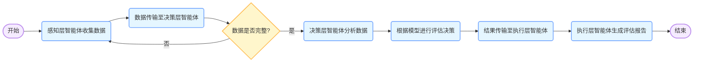

# 基于多智能体的自动化公司质量评估

> 关键词：多智能体系统、自动化质量评估、公司质量、智能体协作、评估模型

> 摘要：本文围绕基于多智能体的自动化公司质量评估展开深入探讨。详细介绍了多智能体系统在公司质量评估中的应用原理、核心算法以及数学模型。通过实际案例展示了如何搭建开发环境、实现源代码并进行代码解读。同时分析了该技术在不同实际场景中的应用，推荐了相关的学习资源、开发工具和论文著作。最后对其未来发展趋势与挑战进行了总结，并给出常见问题解答和扩展阅读参考资料，旨在为相关领域的研究和实践提供全面而深入的指导。

## 1. 背景介绍 
### 1.1 目的和范围
公司质量评估对于企业的发展和市场竞争至关重要。传统的公司质量评估方法往往依赖于人工收集和分析数据，存在效率低、主观性强等问题。本研究的目的是利用多智能体系统实现自动化的公司质量评估，提高评估的效率和准确性。范围涵盖了从多智能体系统的原理、算法，到实际应用案例的分析，以及相关工具和资源的推荐。

### 1.2 预期读者
本文预期读者包括从事人工智能、质量管理、企业评估等领域的研究人员、工程师，以及对多智能体系统在公司质量评估方面应用感兴趣的企业管理人员和技术爱好者。

### 1.3 文档结构概述
本文首先介绍多智能体系统和公司质量评估的相关背景知识，包括术语定义和概念解释。接着阐述核心概念及其联系，通过文本示意图和Mermaid流程图展示其架构。然后详细讲解核心算法原理和具体操作步骤，结合Python源代码进行说明。之后给出数学模型和公式，并举例说明。通过实际项目案例展示代码实现和分析。探讨该技术在不同场景中的实际应用。推荐相关的学习资源、开发工具和论文著作。最后总结未来发展趋势与挑战，提供常见问题解答和扩展阅读参考资料。

### 1.4 术语表
#### 1.4.1 核心术语定义
- **多智能体系统（Multi - Agent System, MAS）**：由多个智能体组成的系统，智能体之间可以相互通信、协作，以完成共同的任务。
- **智能体（Agent）**：具有自主性、反应性、社会性和主动性的实体，能够感知环境并根据自身的目标和规则进行决策和行动。
- **公司质量评估**：对公司的各个方面，如产品质量、管理水平、市场竞争力等进行综合评价的过程。

#### 1.4.2 相关概念解释
- **自主性**：智能体能够在没有外界直接干预的情况下，独立地完成任务。
- **反应性**：智能体能够对环境的变化做出及时的反应。
- **社会性**：智能体能够与其他智能体进行通信和协作。
- **主动性**：智能体能够主动地发起行动，以实现自身的目标。

#### 1.4.3 缩略词列表
- MAS：Multi - Agent System（多智能体系统）

## 2. 核心概念与联系 

### 核心概念原理
多智能体系统在公司质量评估中的应用基于智能体的特性和协作机制。每个智能体可以负责不同方面的评估任务，如财务智能体负责评估公司的财务状况，市场智能体负责评估公司的市场竞争力等。智能体之间通过通信和协作，共享信息，共同完成公司质量的综合评估。

### 架构的文本示意图
整个系统架构可以分为三个层次：感知层、决策层和执行层。感知层的智能体负责收集公司的各种数据，如财务数据、市场数据、产品数据等。决策层的智能体对收集到的数据进行分析和处理，根据预设的规则和模型进行评估决策。执行层的智能体根据决策结果生成评估报告并进行反馈。

### Mermaid 流程图


## 3. 核心算法原理 & 具体操作步骤 

### 核心算法原理
在基于多智能体的自动化公司质量评估中，常用的算法包括数据融合算法、评估模型算法等。这里以简单的数据融合算法和加权平均评估模型为例进行说明。

数据融合算法的目的是将不同智能体收集到的数据进行整合，去除冗余和冲突信息，得到更准确和全面的数据。加权平均评估模型则是根据不同评估指标的重要性，对各个指标的评估结果进行加权平均，得到最终的公司质量评估得分。

### 具体操作步骤
1. **数据收集**：各个感知层智能体收集公司的相关数据，如财务报表、市场份额数据、产品质量检测报告等。
2. **数据预处理**：对收集到的数据进行清洗、归一化等预处理操作，以提高数据的质量和可用性。
3. **数据融合**：使用数据融合算法将不同智能体的数据进行整合。
4. **指标评估**：决策层智能体根据预设的评估指标和规则，对整合后的数据进行评估，得到各个指标的评估得分。
5. **综合评估**：使用加权平均评估模型，根据各个指标的权重，对各个指标的评估得分进行加权平均，得到最终的公司质量评估得分。
6. **报告生成**：执行层智能体根据最终的评估得分生成评估报告，并进行反馈。

### Python源代码详细阐述
```python
import numpy as np

# 模拟感知层智能体收集的数据
def collect_data():
    # 假设收集到三个指标的数据
    data1 = np.random.rand(10)  # 财务指标数据
    data2 = np.random.rand(10)  # 市场指标数据
    data3 = np.random.rand(10)  # 产品质量指标数据
    return [data1, data2, data3]

# 数据预处理：归一化
def preprocess_data(data):
    processed_data = []
    for d in data:
        min_val = np.min(d)
        max_val = np.max(d)
        normalized_d = (d - min_val) / (max_val - min_val)
        processed_data.append(normalized_d)
    return processed_data

# 数据融合：简单平均融合
def data_fusion(data):
    fused_data = np.mean(np.array(data), axis=0)
    return fused_data

# 指标评估：假设每个数据点对应一个评估得分
def evaluate_indicators(data):
    scores = []
    for d in data:
        score = np.mean(d)
        scores.append(score)
    return scores

# 综合评估：加权平均
def comprehensive_evaluation(scores, weights):
    final_score = np.dot(scores, weights)
    return final_score

# 主函数
def main():
    # 收集数据
    raw_data = collect_data()
    # 数据预处理
    processed_data = preprocess_data(raw_data)
    # 数据融合
    fused_data = data_fusion(processed_data)
    # 指标评估
    indicator_scores = evaluate_indicators(processed_data)
    # 指标权重
    weights = np.array([0.3, 0.4, 0.3])
    # 综合评估
    final_score = comprehensive_evaluation(indicator_scores, weights)
    print("最终公司质量评估得分:", final_score)

if __name__ == "__main__":
    main()
```

## 4. 数学模型和公式 & 详细讲解 & 举例说明 

### 数据融合数学模型
数据融合的简单平均模型可以表示为：
$$
\bar{x} = \frac{1}{n} \sum_{i=1}^{n} x_i
$$
其中，$\bar{x}$ 是融合后的数据，$x_i$ 是第 $i$ 个智能体收集到的数据，$n$ 是智能体的数量。

### 加权平均评估模型
加权平均评估模型可以表示为：
$$
S = \sum_{i=1}^{m} w_i s_i
$$
其中，$S$ 是最终的公司质量评估得分，$w_i$ 是第 $i$ 个评估指标的权重，$s_i$ 是第 $i$ 个评估指标的评估得分，$m$ 是评估指标的数量。

### 详细讲解
数据融合的简单平均模型通过对不同智能体收集到的数据取平均值，得到一个综合的数据。这种方法简单易行，但没有考虑不同数据的重要性差异。加权平均评估模型则根据各个评估指标的重要性，对各个指标的评估得分进行加权求和，得到最终的评估得分。权重的确定需要根据具体的评估需求和专家经验来确定。

### 举例说明
假设我们有三个评估指标：财务指标、市场指标和产品质量指标，对应的权重分别为 $w_1 = 0.3$，$w_2 = 0.4$，$w_3 = 0.3$。经过指标评估后，三个指标的评估得分分别为 $s_1 = 0.8$，$s_2 = 0.7$，$s_3 = 0.9$。则最终的公司质量评估得分 $S$ 为：
$$
S = 0.3 \times 0.8 + 0.4 \times 0.7 + 0.3 \times 0.9 = 0.77
$$

## 5. 项目实战：代码实际案例和详细解释说明 

### 5.1  开发环境搭建
1. **安装Python**：建议安装Python 3.7及以上版本，可以从Python官方网站（https://www.python.org/downloads/）下载安装包进行安装。
2. **安装必要的库**：本项目需要使用 `numpy` 库，可以使用以下命令进行安装：
```sh
pip install numpy
```

### 5.2  源代码详细实现和代码解读
```python
import numpy as np

# 模拟感知层智能体收集的数据
def collect_data():
    # 假设收集到三个指标的数据
    data1 = np.random.rand(10)  # 财务指标数据
    data2 = np.random.rand(10)  # 市场指标数据
    data3 = np.random.rand(10)  # 产品质量指标数据
    return [data1, data2, data3]

# 代码解读：该函数模拟了感知层智能体收集数据的过程，使用 numpy 的 random.rand 函数生成随机数据作为示例。

# 数据预处理：归一化
def preprocess_data(data):
    processed_data = []
    for d in data:
        min_val = np.min(d)
        max_val = np.max(d)
        normalized_d = (d - min_val) / (max_val - min_val)
        processed_data.append(normalized_d)
    return processed_data

# 代码解读：该函数对收集到的数据进行归一化处理，将数据缩放到 [0, 1] 区间，以消除不同数据之间的量纲差异。

# 数据融合：简单平均融合
def data_fusion(data):
    fused_data = np.mean(np.array(data), axis=0)
    return fused_data

# 代码解读：该函数使用 numpy 的 mean 函数对不同智能体的数据进行简单平均融合，得到一个综合的数据。

# 指标评估：假设每个数据点对应一个评估得分
def evaluate_indicators(data):
    scores = []
    for d in data:
        score = np.mean(d)
        scores.append(score)
    return scores

# 代码解读：该函数对每个指标的数据求平均值，作为该指标的评估得分。

# 综合评估：加权平均
def comprehensive_evaluation(scores, weights):
    final_score = np.dot(scores, weights)
    return final_score

# 代码解读：该函数使用 numpy 的 dot 函数对指标得分和权重进行点积运算，得到最终的公司质量评估得分。

# 主函数
def main():
    # 收集数据
    raw_data = collect_data()
    # 数据预处理
    processed_data = preprocess_data(raw_data)
    # 数据融合
    fused_data = data_fusion(processed_data)
    # 指标评估
    indicator_scores = evaluate_indicators(processed_data)
    # 指标权重
    weights = np.array([0.3, 0.4, 0.3])
    # 综合评估
    final_score = comprehensive_evaluation(indicator_scores, weights)
    print("最终公司质量评估得分:", final_score)

if __name__ == "__main__":
    main()
```

### 5.3  代码解读与分析
整个代码实现了基于多智能体的自动化公司质量评估的基本流程。首先，通过 `collect_data` 函数模拟感知层智能体收集数据。然后，使用 `preprocess_data` 函数对数据进行预处理，提高数据的质量。接着，使用 `data_fusion` 函数对数据进行融合，得到综合数据。再通过 `evaluate_indicators` 函数对各个指标进行评估，得到指标得分。最后，使用 `comprehensive_evaluation` 函数对指标得分进行加权平均，得到最终的公司质量评估得分。

代码的优点是简单易懂，实现了基本的评估流程。缺点是使用了随机数据作为示例，实际应用中需要从真实数据源收集数据。同时，数据融合和评估模型比较简单，可以根据实际需求进行改进。

## 6. 实际应用场景 
### 投资决策
投资者在选择投资对象时，可以使用基于多智能体的自动化公司质量评估系统对不同公司进行评估。通过综合考虑公司的财务状况、市场竞争力、产品质量等多个方面的因素，投资者可以更准确地评估公司的价值和风险，从而做出更明智的投资决策。

### 供应商评估
企业在选择供应商时，需要对供应商的质量进行评估。基于多智能体的自动化公司质量评估系统可以帮助企业快速、准确地评估供应商的各个方面，如生产能力、产品质量、交货期等，从而选择最合适的供应商，降低采购风险。

### 行业排名
行业协会或研究机构可以使用该系统对行业内的公司进行质量评估，并根据评估结果进行排名。这有助于促进企业之间的竞争，提高整个行业的质量水平。同时，排名结果也可以为消费者提供参考，帮助他们选择更优质的产品和服务。

## 7. 工具和资源推荐
### 7.1 学习资源推荐
#### 7.1.1 书籍推荐
- 《多智能体系统：原理与编程》：全面介绍了多智能体系统的基本原理、算法和编程实现，适合初学者和有一定基础的读者。
- 《质量管理体系：要求》（ISO 9001）：是质量管理领域的经典标准，详细介绍了质量管理体系的要求和实施方法，对于理解公司质量评估有很大帮助。

#### 7.1.2 在线课程
- Coursera上的“多智能体系统”课程：由知名高校的教授授课，内容涵盖多智能体系统的理论和实践，通过视频讲解、作业和讨论等方式帮助学员学习。
- edX上的“质量管理与控制”课程：介绍了质量管理的基本概念、工具和方法，以及如何应用这些知识进行公司质量评估。

#### 7.1.3 技术博客和网站
- AI社区（https://www.ai-community.com）：提供了大量关于人工智能、多智能体系统的技术文章和案例分析，是学习和交流的好去处。
- 质量管理论坛（https://www.quality-forum.com）：专注于质量管理领域的讨论和分享，有很多关于公司质量评估的经验和见解。

### 7.2 开发工具框架推荐
#### 7.2.1 IDE和编辑器
- PyCharm：是一款专门为Python开发设计的集成开发环境，具有代码编辑、调试、版本控制等功能，非常适合开发基于Python的多智能体系统。
- Visual Studio Code：是一款轻量级的代码编辑器，支持多种编程语言和插件扩展，通过安装Python插件可以方便地进行Python开发。

#### 7.2.2 调试和性能分析工具
- Py-Spy：可以对Python程序进行性能分析，找出程序中的性能瓶颈，帮助优化代码。
- PDB：是Python自带的调试器，可以在代码中设置断点，逐步执行代码，方便调试和排查问题。

#### 7.2.3 相关框架和库
- Mesa：是一个用于构建基于智能体的模型的Python框架，提供了丰富的工具和接口，方便开发多智能体系统。
- NetworkX：是一个用于创建、操作和研究复杂网络的Python库，可以用于模拟智能体之间的通信和协作关系。

### 7.3 相关论文著作推荐
#### 7.3.1 经典论文
- “Multi - Agent Systems: A Modern Approach to Distributed Artificial Intelligence”：该论文介绍了多智能体系统的基本概念、体系结构和算法，是多智能体系统领域的经典之作。
- “Quality Management in the 21st Century: A Paradigm Shift”：探讨了质量管理在21世纪的发展趋势和变革，对于理解公司质量评估的背景和意义有很大帮助。

#### 7.3.2 最新研究成果
- 近年来，有很多关于多智能体系统在质量管理中的应用的研究成果发表在国际知名期刊和会议上，如《Artificial Intelligence》、《IEEE Transactions on Systems, Man, and Cybernetics》等。可以通过学术数据库（如IEEE Xplore、ACM Digital Library等）搜索相关论文。

#### 7.3.3 应用案例分析
- 一些大型企业和研究机构会发布基于多智能体系统的公司质量评估的应用案例，这些案例可以帮助我们了解该技术在实际中的应用情况和效果。可以通过企业官网、行业报告等渠道获取相关案例。

## 8. 总结：未来发展趋势与挑战
### 未来发展趋势
- **智能化程度提高**：随着人工智能技术的不断发展，多智能体系统的智能化程度将不断提高。智能体将具备更强的学习能力和推理能力，能够自动调整评估策略和模型，以适应不同的评估需求。
- **与其他技术融合**：多智能体系统将与大数据、云计算、物联网等技术深度融合。通过整合这些技术的优势，可以实现更高效、更准确的公司质量评估。例如，利用物联网技术可以实时收集公司的生产数据和运营数据，为评估提供更丰富的信息。
- **应用领域拓展**：基于多智能体的自动化公司质量评估技术将在更多领域得到应用，如医疗、教育、金融等。不同领域的公司质量评估需求具有不同的特点，这将促使该技术不断创新和完善。

### 挑战
- **智能体协作问题**：在多智能体系统中，智能体之间的协作是实现有效评估的关键。然而，由于智能体的自主性和差异性，可能会出现协作冲突和信息不一致等问题。如何设计有效的协作机制和通信协议，确保智能体之间的高效协作，是一个亟待解决的问题。
- **数据质量和安全问题**：公司质量评估依赖于大量的数据，数据的质量和安全直接影响评估结果的准确性和可靠性。如何保证数据的真实性、完整性和及时性，以及如何保护数据的安全和隐私，是需要面对的挑战。
- **模型的可解释性问题**：一些复杂的评估模型可能具有较高的准确性，但缺乏可解释性。在实际应用中，用户往往需要了解评估结果的依据和原理。如何提高模型的可解释性，使评估结果更易于理解和接受，是一个重要的研究方向。

## 9. 附录：常见问题与解答
### 问题1：多智能体系统与传统评估方法相比有哪些优势？
解答：多智能体系统具有以下优势：一是可以实现自动化评估，提高评估效率；二是多个智能体可以从不同角度进行评估，提高评估的全面性和准确性；三是智能体之间可以协作和通信，共享信息，增强评估的灵活性和适应性。

### 问题2：如何确定评估指标的权重？
解答：确定评估指标的权重可以采用多种方法，如专家打分法、层次分析法、熵权法等。专家打分法是通过邀请领域专家根据经验和知识对各个指标的重要性进行打分，然后取平均值作为权重。层次分析法是将评估问题分解为多个层次，通过比较各层次元素之间的相对重要性，确定指标的权重。熵权法是根据指标数据的信息熵来确定权重，信息熵越小，指标的权重越大。

### 问题3：多智能体系统的开发难度大吗？
解答：多智能体系统的开发难度取决于系统的复杂程度和功能需求。对于简单的多智能体系统，使用现有的框架和库可以相对容易地实现。但对于复杂的系统，需要考虑智能体的设计、协作机制、通信协议等多个方面的问题，开发难度会相应增加。同时，还需要具备一定的人工智能和编程知识。

## 10. 扩展阅读 & 参考资料
### 扩展阅读
- 《人工智能：一种现代方法》：全面介绍了人工智能的基本概念、算法和应用，对于深入理解多智能体系统和公司质量评估有很大帮助。
- 《数据挖掘：概念与技术》：介绍了数据挖掘的基本方法和技术，如数据预处理、分类、聚类等，这些技术可以应用于公司质量评估中的数据处理和分析。

### 参考资料
- 相关的学术论文和研究报告，如《Multi - Agent Systems: A Survey》、《Quality Assessment of Companies Using Artificial Intelligence Techniques》等。
- 行业标准和规范，如ISO 9001、ISO 14001等，这些标准对于公司质量评估提供了重要的参考依据。

作者：AI天才研究院/AI Genius Institute & 禅与计算机程序设计艺术 /Zen And The Art of Computer Programming