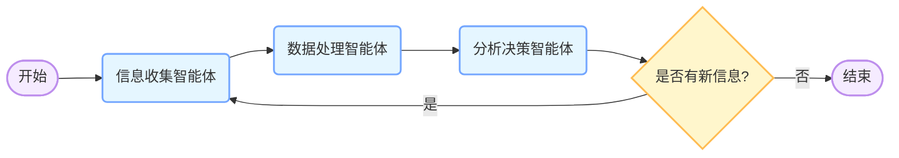

# 基于多智能体的自动化投资者关系分析系统

> 关键词：多智能体系统、自动化、投资者关系分析、信息处理、决策支持

> 摘要：本文聚焦于基于多智能体的自动化投资者关系分析系统，旨在为投资者和企业提供高效、准确的信息分析与决策支持。首先介绍了该系统提出的背景、目的和适用范围，明确预期读者和文档结构。接着阐述核心概念，包括多智能体系统原理、投资者关系分析要点及二者联系，并给出相应的文本示意图和 Mermaid 流程图。详细讲解核心算法原理，通过 Python 代码展示具体操作步骤。深入探讨数学模型和公式，辅以实际例子加深理解。进行项目实战，从开发环境搭建、源代码实现到代码解读与分析，全面展示系统构建过程。列举实际应用场景，为系统的实用性提供依据。推荐学习资源、开发工具框架和相关论文著作，助力读者深入研究。最后总结未来发展趋势与挑战，解答常见问题，并提供扩展阅读和参考资料。

## 1. 背景介绍 
### 1.1 目的和范围
在当今复杂多变的金融市场中，投资者需要及时、准确地获取企业的相关信息，以便做出合理的投资决策。同时，企业也需要有效地管理与投资者之间的关系，提升企业形象和市场价值。基于多智能体的自动化投资者关系分析系统的目的在于利用多智能体技术，自动化地收集、处理和分析与投资者关系相关的各种信息，为投资者和企业提供全面、深入的分析结果和决策建议。

本系统的范围涵盖了投资者关系分析的多个方面，包括企业财务信息分析、市场舆情监测、投资者行为分析等。通过对这些信息的综合分析，系统可以帮助投资者评估企业的投资价值，为企业提供改善投资者关系的策略。

### 1.2 预期读者
本文的预期读者包括金融领域的投资者、企业的投资者关系管理人员、金融分析师、研究多智能体系统和人工智能在金融领域应用的科研人员，以及对金融科技感兴趣的技术爱好者。

### 1.3 文档结构概述
本文将按照以下结构进行阐述：首先介绍系统的背景和相关概念，包括多智能体系统和投资者关系分析的核心概念及其联系；接着详细讲解系统所采用的核心算法原理和具体操作步骤，并用 Python 代码进行说明；然后介绍系统所涉及的数学模型和公式，并举例说明其应用；通过项目实战，展示系统的开发过程，包括开发环境搭建、源代码实现和代码解读；列举系统在实际中的应用场景；推荐相关的学习资源、开发工具框架和论文著作；最后总结系统的未来发展趋势与挑战，解答常见问题，并提供扩展阅读和参考资料。

### 1.4 术语表
#### 1.4.1 核心术语定义
- **多智能体系统（Multi-Agent System, MAS）**：由多个智能体组成的系统，每个智能体具有自主决策能力，能够感知环境并与其他智能体进行交互，以实现系统的整体目标。
- **投资者关系（Investor Relations, IR）**：企业为了促进与投资者之间的良好沟通和互动，通过各种方式向投资者提供企业信息，以影响投资者的决策和行为的一系列活动。
- **自动化投资者关系分析系统**：利用信息技术和算法，自动收集、处理和分析与投资者关系相关的信息，为投资者和企业提供决策支持的系统。

#### 1.4.2 相关概念解释
- **智能体（Agent）**：具有感知、决策和行动能力的实体，能够根据自身的目标和环境信息自主地做出决策和执行相应的动作。
- **信息融合**：将来自不同数据源的信息进行整合和处理，以获得更全面、准确的信息。
- **舆情分析**：对公众在互联网上表达的与企业相关的意见、态度和情绪进行分析和评估。

#### 1.4.3 缩略词列表
- MAS：Multi-Agent System（多智能体系统）
- IR：Investor Relations（投资者关系）
- NLP：Natural Language Processing（自然语言处理）
- ML：Machine Learning（机器学习）

## 2. 核心概念与联系 
### 核心概念原理
#### 多智能体系统原理
多智能体系统由多个智能体组成，每个智能体具有一定的自主性和智能性。智能体可以感知周围环境的信息，并根据自身的目标和规则进行决策和行动。智能体之间可以通过通信机制进行信息交换和协作，以实现系统的整体目标。

多智能体系统的优势在于其灵活性和适应性。通过智能体之间的协作，可以处理复杂的任务和问题。例如，在投资者关系分析系统中，不同的智能体可以负责不同的任务，如信息收集、数据处理、分析决策等，通过协作共同完成投资者关系分析的任务。

#### 投资者关系分析要点
投资者关系分析主要涉及对企业的财务状况、经营业绩、市场竞争力、行业发展趋势等方面的分析。同时，还需要关注投资者的需求、偏好和行为，以及市场舆情对投资者决策的影响。

投资者关系分析的目的是为投资者提供准确的投资建议，为企业提供改善投资者关系的策略。通过对投资者关系的有效管理，企业可以提高投资者的满意度和忠诚度，提升企业的市场价值。

### 核心概念联系
在基于多智能体的自动化投资者关系分析系统中，多智能体系统为投资者关系分析提供了一种有效的实现方式。多个智能体可以分别负责不同的投资者关系分析任务，如信息收集智能体负责从各种数据源收集与企业和投资者相关的信息，数据处理智能体对收集到的信息进行清洗、转换和存储，分析决策智能体利用机器学习和数据分析技术对处理后的数据进行分析，为投资者和企业提供决策建议。

智能体之间通过协作和通信，实现信息的共享和交互，从而提高投资者关系分析的效率和准确性。例如，信息收集智能体收集到新的信息后，可以及时将其传递给数据处理智能体和分析决策智能体，以便及时更新分析结果。

### 文本示意图
```plaintext
多智能体系统
├── 信息收集智能体
│   ├── 收集企业财务信息
│   ├── 收集市场舆情信息
│   ├── 收集投资者行为信息
├── 数据处理智能体
│   ├── 清洗信息
│   ├── 转换数据格式
│   ├── 存储数据
├── 分析决策智能体
│   ├── 财务分析
│   ├── 舆情分析
│   ├── 投资者行为分析
│   ├── 提供决策建议
```

### Mermaid 流程图


## 3. 核心算法原理 & 具体操作步骤 
### 核心算法原理
在基于多智能体的自动化投资者关系分析系统中，主要涉及以下几种核心算法：

#### 自然语言处理算法
自然语言处理（NLP）算法用于处理和分析文本信息，如市场舆情信息、企业公告等。常用的 NLP 算法包括文本分类、情感分析、命名实体识别等。

例如，在情感分析中，可以使用机器学习算法（如朴素贝叶斯、支持向量机等）或深度学习算法（如循环神经网络、卷积神经网络等）对文本进行训练，以判断文本所表达的情感是积极、消极还是中性。

#### 机器学习算法
机器学习算法用于对数据进行建模和分析，以发现数据中的规律和模式。常用的机器学习算法包括回归分析、分类算法、聚类算法等。

例如，在投资者行为分析中，可以使用聚类算法将投资者分为不同的群体，以便企业针对不同群体制定不同的投资者关系策略。

#### 多智能体协作算法
多智能体协作算法用于协调多个智能体之间的行为和任务分配，以实现系统的整体目标。常用的多智能体协作算法包括合同网协议、拍卖算法等。

例如，在信息收集任务中，可以使用合同网协议来分配不同的信息收集任务给不同的智能体，以提高信息收集的效率。

### 具体操作步骤
#### 信息收集步骤
1. 信息收集智能体根据预设的数据源和规则，从互联网、金融数据库、企业官网等数据源收集与企业和投资者相关的信息。
2. 对收集到的信息进行初步筛选和过滤，去除无效信息和重复信息。

#### 数据处理步骤
1. 数据处理智能体对收集到的信息进行清洗，包括去除噪声、处理缺失值等。
2. 将清洗后的数据转换为统一的数据格式，以便后续分析。
3. 将处理后的数据存储到数据库中。

#### 分析决策步骤
1. 分析决策智能体从数据库中提取所需的数据。
2. 使用自然语言处理算法和机器学习算法对数据进行分析，如进行财务分析、舆情分析、投资者行为分析等。
3. 根据分析结果，为投资者和企业提供决策建议。

### Python 代码示例
以下是一个简单的 Python 代码示例，用于演示如何使用 NLP 算法进行情感分析：

```python
import nltk
from nltk.sentiment import SentimentIntensityAnalyzer

# 下载必要的 NLTK 数据
nltk.download('vader_lexicon')

# 初始化情感分析器
sia = SentimentIntensityAnalyzer()

# 待分析的文本
text = "这家公司的业绩非常出色，未来发展前景广阔。"

# 进行情感分析
sentiment = sia.polarity_scores(text)

# 输出分析结果
if sentiment['compound'] >= 0.05:
    print("积极情感")
elif sentiment['compound'] <= -0.05:
    print("消极情感")
else:
    print("中性情感")
```

## 4. 数学模型和公式 & 详细讲解 & 举例说明 
### 线性回归模型
#### 数学公式
线性回归模型是一种用于建立自变量和因变量之间线性关系的模型。其基本形式为：

$$y = \beta_0 + \beta_1x_1 + \beta_2x_2 + \cdots + \beta_nx_n + \epsilon$$

其中，$y$ 是因变量，$x_1, x_2, \cdots, x_n$ 是自变量，$\beta_0, \beta_1, \cdots, \beta_n$ 是模型的参数，$\epsilon$ 是误差项。

#### 详细讲解
线性回归模型的目标是通过最小化误差项的平方和来估计模型的参数。常用的估计方法是最小二乘法。最小二乘法的目标是找到一组参数 $\beta_0, \beta_1, \cdots, \beta_n$，使得以下损失函数最小：

$$L(\beta) = \sum_{i=1}^{m}(y_i - (\beta_0 + \beta_1x_{i1} + \beta_2x_{i2} + \cdots + \beta_nx_{in}))^2$$

其中，$m$ 是样本数量，$y_i$ 是第 $i$ 个样本的因变量值，$x_{i1}, x_{i2}, \cdots, x_{in}$ 是第 $i$ 个样本的自变量值。

#### 举例说明
假设我们要分析企业的净利润（$y$）与销售收入（$x_1$）和成本（$x_2$）之间的关系。我们收集了 $m$ 个企业的相关数据，然后使用线性回归模型进行分析。

```python
import numpy as np
from sklearn.linear_model import LinearRegression

# 生成示例数据
X = np.array([[100, 80], [200, 150], [300, 200], [400, 300]])
y = np.array([20, 50, 80, 100])

# 创建线性回归模型
model = LinearRegression()

# 拟合模型
model.fit(X, y)

# 输出模型参数
print("截距:", model.intercept_)
print("系数:", model.coef_)

# 预测新数据
new_X = np.array([[500, 400]])
prediction = model.predict(new_X)
print("预测值:", prediction)
```

### 逻辑回归模型
#### 数学公式
逻辑回归模型是一种用于分类问题的模型，它通过逻辑函数将线性回归的结果映射到 $[0, 1]$ 区间。逻辑函数的形式为：

$$\sigma(z) = \frac{1}{1 + e^{-z}}$$

其中，$z = \beta_0 + \beta_1x_1 + \beta_2x_2 + \cdots + \beta_nx_n$。

逻辑回归模型的预测概率为：

$$P(y = 1|x) = \sigma(\beta_0 + \beta_1x_1 + \beta_2x_2 + \cdots + \beta_nx_n)$$

#### 详细讲解
逻辑回归模型的目标是通过最大化似然函数来估计模型的参数。似然函数的形式为：

$$L(\beta) = \prod_{i=1}^{m}P(y_i|x_i)^{y_i}(1 - P(y_i|x_i))^{1 - y_i}$$

为了方便计算，通常使用对数似然函数：

$$\log L(\beta) = \sum_{i=1}^{m}[y_i\log P(y_i|x_i) + (1 - y_i)\log(1 - P(y_i|x_i))]$$

#### 举例说明
假设我们要根据企业的财务指标（$x_1, x_2$）来预测企业是否会违约（$y$）。我们收集了 $m$ 个企业的相关数据，然后使用逻辑回归模型进行分析。

```python
import numpy as np
from sklearn.linear_model import LogisticRegression

# 生成示例数据
X = np.array([[100, 80], [200, 150], [300, 200], [400, 300]])
y = np.array([0, 0, 1, 1])

# 创建逻辑回归模型
model = LogisticRegression()

# 拟合模型
model.fit(X, y)

# 输出模型参数
print("截距:", model.intercept_)
print("系数:", model.coef_)

# 预测新数据
new_X = np.array([[500, 400]])
prediction = model.predict(new_X)
print("预测值:", prediction)
```

## 5. 项目实战：代码实际案例和详细解释说明 
### 5.1  开发环境搭建
#### 操作系统
建议使用 Linux 或 macOS 操作系统，因为它们对 Python 和相关开发工具的支持较好。

#### Python 环境
安装 Python 3.7 及以上版本。可以从 Python 官方网站（https://www.python.org/downloads/）下载并安装。

#### 依赖库安装
使用 pip 安装以下依赖库：
```sh
pip install numpy pandas scikit-learn nltk requests beautifulsoup4
```

#### 数据库安装
安装 MySQL 或 PostgreSQL 数据库，用于存储系统收集和处理的数据。

### 5.2  源代码详细实现和代码解读
#### 信息收集模块
```python
import requests
from bs4 import BeautifulSoup

def collect_news(url):
    try:
        response = requests.get(url)
        soup = BeautifulSoup(response.text, 'html.parser')
        news = []
        # 假设新闻标题在 <h2> 标签中
        for h2 in soup.find_all('h2'):
            news.append(h2.text)
        return news
    except Exception as e:
        print(f"信息收集出错: {e}")
        return []

# 示例调用
url = "https://example.com/news"
news = collect_news(url)
print(news)
```
代码解读：
- `collect_news` 函数用于从指定的 URL 收集新闻信息。
- 使用 `requests` 库发送 HTTP 请求获取网页内容。
- 使用 `BeautifulSoup` 库解析网页内容，提取新闻标题。

#### 数据处理模块
```python
import pandas as pd

def clean_data(data):
    df = pd.DataFrame(data, columns=['news'])
    # 去除缺失值
    df = df.dropna()
    # 去除重复值
    df = df.drop_duplicates()
    return df

# 示例调用
cleaned_news = clean_data(news)
print(cleaned_news)
```
代码解读：
- `clean_data` 函数用于对收集到的新闻信息进行清洗。
- 使用 `pandas` 库将数据转换为 DataFrame 格式。
- 使用 `dropna` 方法去除缺失值，使用 `drop_duplicates` 方法去除重复值。

#### 分析决策模块
```python
from nltk.sentiment import SentimentIntensityAnalyzer
import nltk

nltk.download('vader_lexicon')

def sentiment_analysis(data):
    sia = SentimentIntensityAnalyzer()
    sentiments = []
    for news in data['news']:
        sentiment = sia.polarity_scores(news)
        if sentiment['compound'] >= 0.05:
            sentiments.append('积极')
        elif sentiment['compound'] <= -0.05:
            sentiments.append('消极')
        else:
            sentiments.append('中性')
    data['sentiment'] = sentiments
    return data

# 示例调用
analyzed_news = sentiment_analysis(cleaned_news)
print(analyzed_news)
```
代码解读：
- `sentiment_analysis` 函数用于对清洗后的新闻信息进行情感分析。
- 使用 `nltk` 库的 `SentimentIntensityAnalyzer` 进行情感分析。
- 根据情感得分将新闻分为积极、消极和中性三类，并添加到 DataFrame 中。

### 5.3  代码解读与分析
#### 信息收集模块
信息收集模块的主要功能是从互联网上收集与企业和投资者相关的信息。使用 `requests` 库发送 HTTP 请求获取网页内容，使用 `BeautifulSoup` 库解析网页内容，提取所需的信息。该模块的优点是简单易用，可以方便地从不同的网站收集信息。缺点是对于一些需要登录或有反爬虫机制的网站，可能无法正常收集信息。

#### 数据处理模块
数据处理模块的主要功能是对收集到的信息进行清洗和预处理。使用 `pandas` 库将数据转换为 DataFrame 格式，方便进行数据处理。通过去除缺失值和重复值，可以提高数据的质量，为后续的分析提供准确的数据。

#### 分析决策模块
分析决策模块的主要功能是对处理后的数据进行分析，为投资者和企业提供决策建议。使用 `nltk` 库的 `SentimentIntensityAnalyzer` 进行情感分析，判断新闻的情感倾向。该模块可以帮助投资者了解市场舆情对企业的影响，为投资决策提供参考。

## 6. 实际应用场景 
### 投资者决策支持
投资者可以使用基于多智能体的自动化投资者关系分析系统来获取企业的全面信息，包括财务状况、市场舆情、投资者行为等。通过系统的分析结果，投资者可以更准确地评估企业的投资价值，制定合理的投资策略。例如，投资者可以根据系统提供的财务分析报告和舆情分析结果，判断企业的盈利能力和市场形象，从而决定是否投资该企业。

### 企业投资者关系管理
企业可以利用该系统来管理与投资者之间的关系。系统可以帮助企业及时了解投资者的需求和意见，通过对投资者行为的分析，企业可以制定个性化的投资者关系策略，提高投资者的满意度和忠诚度。例如，企业可以根据系统提供的投资者行为分析结果，针对不同类型的投资者开展不同的沟通活动，如举办投资者交流会、发布个性化的企业公告等。

### 金融监管机构监测
金融监管机构可以使用该系统来监测金融市场的稳定性和企业的合规性。通过对企业的财务信息和市场舆情的分析，监管机构可以及时发现潜在的风险和问题，采取相应的监管措施。例如，监管机构可以根据系统提供的舆情分析结果，及时发现企业的负面舆情，对企业进行调查和监管。

### 金融研究机构研究
金融研究机构可以利用该系统来开展金融市场的研究工作。系统可以提供大量的金融数据和分析结果，为研究机构提供丰富的研究素材。例如，研究机构可以使用系统提供的投资者行为分析数据，研究投资者的决策行为和市场趋势，为金融理论的发展提供实证支持。

## 7. 工具和资源推荐
### 7.1 学习资源推荐
#### 7.1.1 书籍推荐
- 《多智能体系统导论》：全面介绍了多智能体系统的基本概念、理论和方法，是学习多智能体系统的经典教材。
- 《Python 数据分析实战》：详细介绍了使用 Python 进行数据分析的方法和技巧，包括数据处理、数据分析和数据可视化等方面。
- 《自然语言处理入门》：适合初学者学习自然语言处理的基本概念和方法，包括文本分类、情感分析、命名实体识别等。

#### 7.1.2 在线课程
- Coursera 上的“Machine Learning”：由 Andrew Ng 教授授课，是学习机器学习的经典课程，涵盖了机器学习的基本算法和应用。
- edX 上的“Natural Language Processing with Python and NLTK”：介绍了使用 Python 和 NLTK 进行自然语言处理的方法和技巧。
- Udemy 上的“Multi-Agent Systems: Fundamentals and Applications”：详细介绍了多智能体系统的基本原理和应用。

#### 7.1.3 技术博客和网站
- Towards Data Science：提供了大量关于数据分析、机器学习和人工智能的技术文章和案例。
- Medium：有许多技术专家在上面分享自己的技术经验和见解。
- arXiv：可以获取最新的学术研究论文，了解多智能体系统和投资者关系分析领域的最新研究成果。

### 7.2 开发工具框架推荐
#### 7.2.1 IDE和编辑器
- PyCharm：是一款专业的 Python 集成开发环境，提供了丰富的代码编辑、调试和分析功能。
- Jupyter Notebook：适合进行数据分析和机器学习的交互式开发，方便代码的编写和展示。
- Visual Studio Code：是一款轻量级的代码编辑器，支持多种编程语言，并且有丰富的插件扩展。

#### 7.2.2 调试和性能分析工具
- pdb：Python 自带的调试工具，可以帮助开发者定位代码中的问题。
- cProfile：Python 自带的性能分析工具，可以分析代码的运行时间和资源消耗情况。
- Py-Spy：是一个轻量级的 Python 性能分析工具，可以实时监测 Python 程序的性能。

#### 7.2.3 相关框架和库
- NumPy：是 Python 中用于科学计算的基础库，提供了高效的数组操作和数学函数。
- Pandas：是 Python 中用于数据处理和分析的库，提供了丰富的数据结构和数据操作方法。
- Scikit-learn：是 Python 中用于机器学习的库，提供了各种机器学习算法和工具。
- NLTK：是 Python 中用于自然语言处理的库，提供了丰富的自然语言处理工具和数据集。

### 7.3 相关论文著作推荐
#### 7.3.1 经典论文
- “Multi-Agent Systems: A Modern Approach to Distributed Artificial Intelligence”：该论文系统地介绍了多智能体系统的基本概念、理论和方法，是多智能体系统领域的经典论文。
- “Sentiment Analysis: Mining Opinions, Sentiments, and Emotions”：对情感分析的理论和方法进行了全面的综述，是情感分析领域的重要论文。
- “Linear Regression Analysis: Theory and Computing”：详细介绍了线性回归模型的理论和计算方法，是线性回归领域的经典论文。

#### 7.3.2 最新研究成果
- 通过 arXiv 等学术平台可以获取多智能体系统和投资者关系分析领域的最新研究成果。例如，一些研究探讨了如何使用深度学习技术提高投资者关系分析的准确性和效率，以及如何优化多智能体系统的协作算法。

#### 7.3.3 应用案例分析
- 一些金融科技公司和研究机构会发布基于多智能体系统的投资者关系分析系统的应用案例。通过分析这些案例，可以了解系统在实际应用中的效果和问题，为自己的项目提供参考。

## 8. 总结：未来发展趋势与挑战
### 未来发展趋势
#### 智能化程度不断提高
随着人工智能技术的不断发展，基于多智能体的自动化投资者关系分析系统的智能化程度将不断提高。系统将能够自动学习和适应新的市场环境和数据模式，提供更加准确和个性化的决策建议。

#### 与区块链技术结合
区块链技术具有去中心化、不可篡改等特点，可以为投资者关系分析系统提供更加安全和可信的数据存储和共享方式。未来，系统可能会与区块链技术结合，实现数据的安全共享和多方协作。

#### 跨领域融合应用
投资者关系分析涉及金融、管理、计算机科学等多个领域。未来，系统将与更多的领域进行融合应用，如与大数据、物联网等技术结合，获取更加全面和实时的数据，为投资者和企业提供更有价值的服务。

### 挑战
#### 数据质量和安全问题
系统的分析结果依赖于高质量的数据。然而，在实际应用中，数据可能存在不准确、不完整、不一致等问题，影响系统的分析效果。同时，数据安全也是一个重要的问题，需要采取有效的措施保护投资者和企业的敏感信息。

#### 智能体协作和协调问题
多智能体系统中，智能体之间的协作和协调是一个关键问题。如何设计有效的协作算法，使智能体能够高效地完成任务，是需要解决的挑战之一。

#### 法律法规和监管问题
随着金融科技的发展，相关的法律法规和监管政策也需要不断完善。基于多智能体的自动化投资者关系分析系统需要遵守相关的法律法规和监管要求，如何确保系统的合规性是一个重要的挑战。

## 9. 附录：常见问题与解答
### 问题 1：多智能体系统和传统的数据分析系统有什么区别？
解答：多智能体系统由多个具有自主决策能力的智能体组成，智能体之间可以进行协作和通信，能够处理复杂的任务和问题。而传统的数据分析系统通常是基于集中式的架构，缺乏智能体的自主性和协作能力。多智能体系统可以更好地适应动态变化的环境，提高系统的灵活性和适应性。

### 问题 2：系统的分析结果准确吗？
解答：系统的分析结果的准确性受到多种因素的影响，如数据质量、算法选择、模型参数等。为了提高分析结果的准确性，需要保证数据的质量，选择合适的算法和模型，并进行充分的模型训练和验证。同时，系统的分析结果只是一种参考，投资者和企业在做出决策时还需要结合自身的经验和判断。

### 问题 3：如何保证系统的数据安全？
解答：为了保证系统的数据安全，可以采取以下措施：
- 对数据进行加密处理，防止数据在传输和存储过程中被窃取。
- 建立严格的访问控制机制，只有授权的人员才能访问系统的数据。
- 定期对系统进行安全审计和漏洞扫描，及时发现和修复安全漏洞。

### 问题 4：系统可以处理实时数据吗？
解答：系统可以处理实时数据，但需要根据具体的应用场景和需求进行优化。例如，可以使用流式处理技术对实时数据进行处理，提高系统的响应速度。同时，需要考虑数据的存储和处理能力，确保系统能够稳定地处理大量的实时数据。

## 10. 扩展阅读 & 参考资料
### 扩展阅读
- 《人工智能：现代方法》：全面介绍了人工智能的基本概念、理论和方法，包括搜索算法、机器学习、自然语言处理等方面。
- 《金融科技前沿：技术驱动的金融创新》：探讨了金融科技的发展趋势和应用案例，包括区块链、人工智能、大数据等技术在金融领域的应用。
- 《投资者关系管理：理论与实践》：详细介绍了投资者关系管理的理论和方法，包括投资者关系策略制定、信息披露、投资者沟通等方面。

### 参考资料
- 相关学术论文和研究报告，如 IEEE Transactions on Systems, Man, and Cybernetics、ACM Transactions on Intelligent Systems and Technology 等期刊上的论文。
- 金融机构和企业发布的投资者关系报告和市场研究报告。
- 相关的技术文档和开源项目，如 NumPy、Pandas、Scikit-learn 等库的官方文档。

作者：AI天才研究院/AI Genius Institute & 禅与计算机程序设计艺术 /Zen And The Art of Computer Programming