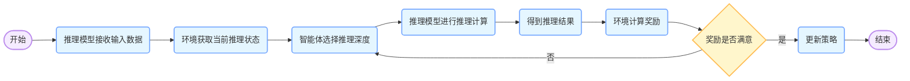

# 基于强化学习的自适应推理深度控制机制

> 关键词：强化学习、自适应推理、深度控制机制、智能决策、深度学习

> 摘要：本文深入探讨了基于强化学习的自适应推理深度控制机制。首先介绍了该机制提出的背景和相关概念，阐述了核心概念的原理及架构，并通过Mermaid流程图进行直观展示。接着详细讲解了核心算法原理，给出Python源代码示例，同时介绍了相关的数学模型和公式，并举例说明。通过项目实战，展示了如何搭建开发环境、实现源代码及对代码进行解读分析。此外，探讨了该机制的实际应用场景，推荐了学习所需的工具和资源，包括书籍、在线课程、开发工具等。最后总结了未来发展趋势与挑战，还提供了常见问题解答和扩展阅读参考资料，旨在为相关领域的研究者和开发者提供全面且深入的技术指导。

## 1. 背景介绍 
### 1.1 目的和范围
在当今的人工智能和机器学习领域，推理过程的效率和准确性至关重要。传统的推理方法往往采用固定的推理深度，无法根据不同的任务场景和数据特征进行动态调整，这可能导致在一些情况下推理效率低下，而在另一些情况下推理结果不准确。基于强化学习的自适应推理深度控制机制的目的就是解决这一问题，通过强化学习算法，使推理系统能够根据实时的环境反馈，自适应地调整推理深度，从而在保证推理准确性的前提下，提高推理效率。

本文章的范围涵盖了从核心概念的介绍、算法原理的讲解、数学模型的推导，到实际项目的开发和应用场景的探讨。同时，还提供了相关的学习资源和工具推荐，旨在为读者提供一个全面了解和应用该机制的指南。

### 1.2 预期读者
本文预期读者包括人工智能、机器学习、深度学习等相关领域的研究者、开发者，以及对强化学习和自适应推理感兴趣的技术爱好者。对于正在从事推理系统优化工作的专业人士，本文可以提供新的思路和方法；对于初学者，本文可以作为一个系统学习基于强化学习的自适应推理深度控制机制的入门资料。

### 1.3 文档结构概述
本文将按照以下结构进行组织：首先介绍相关的核心概念和它们之间的联系，通过文本示意图和Mermaid流程图进行直观展示；接着详细讲解核心算法原理，并给出Python源代码示例；然后介绍相关的数学模型和公式，并举例说明；通过项目实战部分，展示如何搭建开发环境、实现源代码及对代码进行解读分析；探讨该机制的实际应用场景；推荐学习所需的工具和资源；最后总结未来发展趋势与挑战，提供常见问题解答和扩展阅读参考资料。

### 1.4 术语表
#### 1.4.1 核心术语定义
- **强化学习（Reinforcement Learning）**：一种机器学习范式，智能体通过与环境进行交互，根据环境反馈的奖励信号来学习最优的行为策略。
- **自适应推理（Adaptive Inference）**：推理系统能够根据不同的任务需求、数据特征和环境条件，动态调整推理过程的机制。
- **推理深度（Inference Depth）**：在推理过程中，模型进行计算和决策的层次或步骤数量。
- **智能体（Agent）**：在强化学习中，能够感知环境状态、采取行动并接收奖励的实体。
- **环境（Environment）**：智能体所处的外部世界，它为智能体提供状态信息，并根据智能体的行动给出相应的奖励。

#### 1.4.2 相关概念解释
- **状态（State）**：环境在某一时刻的描述，智能体根据状态来决定采取何种行动。在自适应推理中，状态可以包括输入数据的特征、当前推理的进度等信息。
- **行动（Action）**：智能体在某一状态下采取的操作。在自适应推理深度控制机制中，行动通常是调整推理深度的决策。
- **奖励（Reward）**：环境对智能体行动的反馈，用于指导智能体学习最优策略。奖励可以根据推理的准确性、效率等因素来设计。

#### 1.4.3 缩略词列表
- **RL**：Reinforcement Learning（强化学习）
- **DQN**：Deep Q-Network（深度Q网络）

## 2. 核心概念与联系 

### 核心概念原理
基于强化学习的自适应推理深度控制机制主要涉及强化学习和自适应推理两个核心概念。

强化学习的基本原理是智能体在环境中不断进行探索和学习，通过尝试不同的行动并接收环境反馈的奖励，逐渐找到最优的行为策略。在自适应推理深度控制机制中，智能体的目标是根据当前的推理状态，选择合适的推理深度，以最大化长期累积奖励。

自适应推理则强调推理系统能够根据不同的情况动态调整推理过程。传统的推理方法通常采用固定的推理深度，而自适应推理可以根据输入数据的复杂度、任务的要求等因素，灵活地选择推理深度，从而提高推理的效率和准确性。

### 架构的文本示意图
该机制的架构主要包括智能体、环境和推理模型三个部分。智能体负责感知环境状态，根据状态选择合适的行动（即调整推理深度）；环境为智能体提供状态信息和奖励反馈；推理模型根据智能体选择的推理深度进行推理计算。

具体流程如下：
1. 推理模型接收输入数据。
2. 环境将当前的推理状态（如输入数据特征、当前推理进度等）传递给智能体。
3. 智能体根据状态选择合适的推理深度，并将其发送给推理模型。
4. 推理模型根据选择的推理深度进行推理计算，得到推理结果。
5. 环境根据推理结果（如准确性、效率等）计算奖励，并将奖励和新的状态反馈给智能体。
6. 智能体根据奖励更新自己的策略，以便在未来做出更好的决策。

### Mermaid流程图


## 3. 核心算法原理 & 具体操作步骤 

### 核心算法原理
在基于强化学习的自适应推理深度控制机制中，常用的强化学习算法是深度Q网络（DQN）。DQN是一种将深度学习与Q学习相结合的算法，它使用神经网络来近似Q值函数，从而解决传统Q学习在处理高维状态空间时的效率问题。

Q值函数 $Q(s,a)$ 表示在状态 $s$ 下采取行动 $a$ 的预期累积奖励。DQN的目标是学习一个最优的Q值函数 $Q^*(s,a)$，使得智能体在每个状态下都能选择具有最大Q值的行动。

DQN的核心思想是通过经验回放和目标网络来稳定训练过程。经验回放是指将智能体的经验（状态、行动、奖励、下一个状态）存储在经验回放缓冲区中，然后随机从中采样进行训练，这样可以减少数据之间的相关性，提高训练的稳定性。目标网络是一个与主网络结构相同但参数更新较慢的网络，用于计算目标Q值，从而减少训练过程中的波动。

### 具体操作步骤
1. **初始化**：初始化主网络 $Q$、目标网络 $\hat{Q}$ 和经验回放缓冲区 $D$。
2. **环境交互**：智能体与环境进行交互，获取当前状态 $s_t$。
3. **行动选择**：根据当前状态 $s_t$，使用 $\epsilon$-贪心策略选择行动 $a_t$。$\epsilon$-贪心策略是指以概率 $\epsilon$ 随机选择一个行动，以概率 $1 - \epsilon$ 选择具有最大Q值的行动。
4. **执行行动**：智能体执行行动 $a_t$，环境返回下一个状态 $s_{t+1}$ 和奖励 $r_t$。
5. **经验存储**：将经验 $(s_t, a_t, r_t, s_{t+1})$ 存储到经验回放缓冲区 $D$ 中。
6. **经验回放**：从经验回放缓冲区 $D$ 中随机采样一批经验 $(s_i, a_i, r_i, s_{i+1})$。
7. **目标Q值计算**：使用目标网络 $\hat{Q}$ 计算目标Q值 $y_i = r_i + \gamma \max_{a} \hat{Q}(s_{i+1}, a)$，其中 $\gamma$ 是折扣因子。
8. **损失计算**：计算主网络 $Q$ 的损失 $L = \frac{1}{N} \sum_{i=1}^{N} (y_i - Q(s_i, a_i))^2$，其中 $N$ 是采样的经验数量。
9. **参数更新**：使用梯度下降法更新主网络 $Q$ 的参数。
10. **目标网络更新**：定期更新目标网络 $\hat{Q}$ 的参数，使其与主网络 $Q$ 的参数相同。
11. **重复步骤2 - 10**：直到满足终止条件（如达到最大训练步数）。

### Python源代码示例
```python
import numpy as np
import torch
import torch.nn as nn
import torch.optim as optim
import random

# 定义Q网络
class QNetwork(nn.Module):
    def __init__(self, state_size, action_size):
        super(QNetwork, self).__init__()
        self.fc1 = nn.Linear(state_size, 64)
        self.fc2 = nn.Linear(64, 64)
        self.fc3 = nn.Linear(64, action_size)

    def forward(self, x):
        x = torch.relu(self.fc1(x))
        x = torch.relu(self.fc2(x))
        return self.fc3(x)

# 定义经验回放缓冲区
class ReplayBuffer:
    def __init__(self, buffer_size):
        self.buffer = []
        self.buffer_size = buffer_size
        self.index = 0

    def add(self, state, action, reward, next_state):
        if len(self.buffer) < self.buffer_size:
            self.buffer.append(None)
        self.buffer[self.index] = (state, action, reward, next_state)
        self.index = (self.index + 1) % self.buffer_size

    def sample(self, batch_size):
        batch = random.sample(self.buffer, batch_size)
        states, actions, rewards, next_states = zip(*batch)
        return np.array(states), np.array(actions), np.array(rewards), np.array(next_states)

    def __len__(self):
        return len(self.buffer)

# 定义智能体
class Agent:
    def __init__(self, state_size, action_size, buffer_size=10000, batch_size=64, gamma=0.99, lr=0.001, epsilon=1.0, epsilon_decay=0.995, epsilon_min=0.01):
        self.state_size = state_size
        self.action_size = action_size
        self.buffer_size = buffer_size
        self.batch_size = batch_size
        self.gamma = gamma
        self.lr = lr
        self.epsilon = epsilon
        self.epsilon_decay = epsilon_decay
        self.epsilon_min = epsilon_min

        self.q_network = QNetwork(state_size, action_size)
        self.target_network = QNetwork(state_size, action_size)
        self.target_network.load_state_dict(self.q_network.state_dict())
        self.optimizer = optim.Adam(self.q_network.parameters(), lr=lr)
        self.replay_buffer = ReplayBuffer(buffer_size)

    def act(self, state):
        if np.random.rand() <= self.epsilon:
            return random.randrange(self.action_size)
        state = torch.FloatTensor(state).unsqueeze(0)
        q_values = self.q_network(state)
        action = torch.argmax(q_values, dim=1).item()
        return action

    def step(self, state, action, reward, next_state):
        self.replay_buffer.add(state, action, reward, next_state)
        if len(self.replay_buffer) >= self.batch_size:
            self.learn()

    def learn(self):
        states, actions, rewards, next_states = self.replay_buffer.sample(self.batch_size)
        states = torch.FloatTensor(states)
        actions = torch.LongTensor(actions)
        rewards = torch.FloatTensor(rewards)
        next_states = torch.FloatTensor(next_states)

        q_values = self.q_network(states).gather(1, actions.unsqueeze(1)).squeeze(1)
        next_q_values = self.target_network(next_states).max(1)[0]
        target_q_values = rewards + self.gamma * next_q_values

        loss = nn.MSELoss()(q_values, target_q_values)
        self.optimizer.zero_grad()
        loss.backward()
        self.optimizer.step()

        if self.epsilon > self.epsilon_min:
            self.epsilon *= self.epsilon_decay

    def update_target_network(self):
        self.target_network.load_state_dict(self.q_network.state_dict())

# 示例使用
if __name__ == "__main__":
    state_size = 10
    action_size = 5
    agent = Agent(state_size, action_size)

    for episode in range(100):
        state = np.random.rand(state_size)
        for step in range(100):
            action = agent.act(state)
            next_state = np.random.rand(state_size)
            reward = np.random.rand()
            agent.step(state, action, reward, next_state)
            state = next_state
        agent.update_target_network()
```

## 4. 数学模型和公式 & 详细讲解 & 举例说明 

### 数学模型和公式
#### Q值函数
Q值函数 $Q(s,a)$ 表示在状态 $s$ 下采取行动 $a$ 的预期累积奖励，定义为：
$$Q(s,a) = \mathbb{E} \left[ \sum_{t=0}^{\infty} \gamma^t r_{t+1} \mid s_0 = s, a_0 = a \right]$$
其中，$r_{t+1}$ 是在时刻 $t+1$ 获得的奖励，$\gamma$ 是折扣因子，用于权衡当前奖励和未来奖励的重要性。

#### 贝尔曼方程
Q值函数满足贝尔曼方程：
$$Q(s,a) = r + \gamma \mathbb{E}_{s'} \left[ \max_{a'} Q(s',a') \right]$$
其中，$r$ 是在状态 $s$ 下采取行动 $a$ 后获得的即时奖励，$s'$ 是下一个状态。

#### 深度Q网络的损失函数
深度Q网络的损失函数通常采用均方误差（MSE）：
$$L = \frac{1}{N} \sum_{i=1}^{N} (y_i - Q(s_i, a_i))^2$$
其中，$N$ 是采样的经验数量，$y_i = r_i + \gamma \max_{a} \hat{Q}(s_{i+1}, a)$ 是目标Q值，$Q(s_i, a_i)$ 是主网络预测的Q值。

### 详细讲解
Q值函数的定义表示智能体在状态 $s$ 下采取行动 $a$ 后，从当前时刻开始，按照最优策略行动所能获得的预期累积奖励。折扣因子 $\gamma$ 的取值范围是 $[0,1]$，当 $\gamma$ 接近 1 时，智能体更注重未来的奖励；当 $\gamma$ 接近 0 时，智能体更注重当前的奖励。

贝尔曼方程是强化学习中的一个重要方程，它描述了Q值函数的递归关系。通过贝尔曼方程，我们可以将求解最优Q值函数的问题转化为一个迭代求解的过程。

深度Q网络的损失函数用于衡量主网络预测的Q值与目标Q值之间的误差。通过最小化损失函数，我们可以更新主网络的参数，使得主网络能够更好地近似最优Q值函数。

### 举例说明
假设我们有一个简单的推理任务，状态空间 $S$ 包含 3 个状态 $\{s_1, s_2, s_3\}$，行动空间 $A$ 包含 2 个行动 $\{a_1, a_2\}$。折扣因子 $\gamma = 0.9$。

在某一时刻，智能体处于状态 $s_1$，采取行动 $a_1$ 后获得即时奖励 $r = 1$，转移到下一个状态 $s_2$。假设目标网络预测的 $Q(s_2, a_1) = 2$，$Q(s_2, a_2) = 3$，则目标Q值为：
$$y = r + \gamma \max_{a} \hat{Q}(s_2, a) = 1 + 0.9 \times 3 = 3.7$$

假设主网络预测的 $Q(s_1, a_1) = 3$，则损失为：
$$L = (y - Q(s_1, a_1))^2 = (3.7 - 3)^2 = 0.49$$

通过不断地进行经验回放和参数更新，主网络的预测结果会逐渐接近目标Q值，从而学习到最优的行为策略。

## 5. 项目实战：代码实际案例和详细解释说明 

### 5.1  开发环境搭建
#### 操作系统
推荐使用Linux或macOS系统，因为它们对Python和深度学习框架的支持较好。如果使用Windows系统，也可以进行开发，但可能会遇到一些兼容性问题。

#### Python环境
建议使用Python 3.7及以上版本。可以使用Anaconda来管理Python环境，具体步骤如下：
1. 下载并安装Anaconda：从Anaconda官方网站（https://www.anaconda.com/products/individual）下载适合自己操作系统的Anaconda安装包，并按照提示进行安装。
2. 创建虚拟环境：打开终端（Linux或macOS）或Anaconda Prompt（Windows），运行以下命令创建一个新的虚拟环境：
```sh
conda create -n rl-inference python=3.8
```
3. 激活虚拟环境：运行以下命令激活虚拟环境：
```sh
conda activate rl-inference
```

#### 深度学习框架
本项目使用PyTorch作为深度学习框架，可以使用以下命令安装PyTorch：
```sh
conda install pytorch torchvision torchaudio cudatoolkit=11.3 -c pytorch
```
如果没有NVIDIA GPU，可以使用CPU版本的PyTorch：
```sh
conda install pytorch torchvision torchaudio cpuonly -c pytorch
```

### 5.2  源代码详细实现和代码解读
#### 源代码实现
以下是一个完整的基于强化学习的自适应推理深度控制机制的代码示例：
```python
import numpy as np
import torch
import torch.nn as nn
import torch.optim as optim
import random

# 定义推理模型
class InferenceModel:
    def __init__(self, input_size, output_size):
        self.input_size = input_size
        self.output_size = output_size
        self.model = nn.Sequential(
            nn.Linear(input_size, 64),
            nn.ReLU(),
            nn.Linear(64, output_size)
        )

    def inference(self, input_data, depth):
        # 简单模拟不同深度的推理过程
        x = input_data
        for _ in range(depth):
            x = self.model(x)
        return x

# 定义Q网络
class QNetwork(nn.Module):
    def __init__(self, state_size, action_size):
        super(QNetwork, self).__init__()
        self.fc1 = nn.Linear(state_size, 64)
        self.fc2 = nn.Linear(64, 64)
        self.fc3 = nn.Linear(64, action_size)

    def forward(self, x):
        x = torch.relu(self.fc1(x))
        x = torch.relu(self.fc2(x))
        return self.fc3(x)

# 定义经验回放缓冲区
class ReplayBuffer:
    def __init__(self, buffer_size):
        self.buffer = []
        self.buffer_size = buffer_size
        self.index = 0

    def add(self, state, action, reward, next_state):
        if len(self.buffer) < self.buffer_size:
            self.buffer.append(None)
        self.buffer[self.index] = (state, action, reward, next_state)
        self.index = (self.index + 1) % self.buffer_size

    def sample(self, batch_size):
        batch = random.sample(self.buffer, batch_size)
        states, actions, rewards, next_states = zip(*batch)
        return np.array(states), np.array(actions), np.array(rewards), np.array(next_states)

    def __len__(self):
        return len(self.buffer)

# 定义智能体
class Agent:
    def __init__(self, state_size, action_size, buffer_size=10000, batch_size=64, gamma=0.99, lr=0.001, epsilon=1.0, epsilon_decay=0.995, epsilon_min=0.01):
        self.state_size = state_size
        self.action_size = action_size
        self.buffer_size = buffer_size
        self.batch_size = batch_size
        self.gamma = gamma
        self.lr = lr
        self.epsilon = epsilon
        self.epsilon_decay = epsilon_decay
        self.epsilon_min = epsilon_min

        self.q_network = QNetwork(state_size, action_size)
        self.target_network = QNetwork(state_size, action_size)
        self.target_network.load_state_dict(self.q_network.state_dict())
        self.optimizer = optim.Adam(self.q_network.parameters(), lr=lr)
        self.replay_buffer = ReplayBuffer(buffer_size)

    def act(self, state):
        if np.random.rand() <= self.epsilon:
            return random.randrange(self.action_size)
        state = torch.FloatTensor(state).unsqueeze(0)
        q_values = self.q_network(state)
        action = torch.argmax(q_values, dim=1).item()
        return action

    def step(self, state, action, reward, next_state):
        self.replay_buffer.add(state, action, reward, next_state)
        if len(self.replay_buffer) >= self.batch_size:
            self.learn()

    def learn(self):
        states, actions, rewards, next_states = self.replay_buffer.sample(self.batch_size)
        states = torch.FloatTensor(states)
        actions = torch.LongTensor(actions)
        rewards = torch.FloatTensor(rewards)
        next_states = torch.FloatTensor(next_states)

        q_values = self.q_network(states).gather(1, actions.unsqueeze(1)).squeeze(1)
        next_q_values = self.target_network(next_states).max(1)[0]
        target_q_values = rewards + self.gamma * next_q_values

        loss = nn.MSELoss()(q_values, target_q_values)
        self.optimizer.zero_grad()
        loss.backward()
        self.optimizer.step()

        if self.epsilon > self.epsilon_min:
            self.epsilon *= self.epsilon_decay

    def update_target_network(self):
        self.target_network.load_state_dict(self.q_network.state_dict())

# 定义环境
class Environment:
    def __init__(self, input_size, output_size, max_depth):
        self.inference_model = InferenceModel(input_size, output_size)
        self.max_depth = max_depth

    def get_state(self, input_data):
        # 简单模拟状态，这里使用输入数据的均值作为状态
        state = np.array([np.mean(input_data)])
        return state

    def step(self, input_data, action):
        depth = action + 1
        output = self.inference_model.inference(torch.FloatTensor(input_data), depth)
        # 简单模拟奖励，这里使用输出的均值作为奖励
        reward = torch.mean(output).item()
        next_state = self.get_state(input_data)
        return reward, next_state

# 主训练循环
if __name__ == "__main__":
    input_size = 10
    output_size = 1
    max_depth = 5
    state_size = 1
    action_size = max_depth

    env = Environment(input_size, output_size, max_depth)
    agent = Agent(state_size, action_size)

    num_episodes = 100
    for episode in range(num_episodes):
        input_data = np.random.rand(input_size)
        state = env.get_state(input_data)
        total_reward = 0
        for step in range(100):
            action = agent.act(state)
            reward, next_state = env.step(input_data, action)
            agent.step(state, action, reward, next_state)
            state = next_state
            total_reward += reward
        agent.update_target_network()
        print(f"Episode {episode}: Total Reward = {total_reward}")
```

#### 代码解读
1. **推理模型（InferenceModel）**：定义了一个简单的全连接神经网络作为推理模型，通过 `inference` 方法模拟不同深度的推理过程。
2. **Q网络（QNetwork）**：定义了一个三层全连接神经网络作为Q网络，用于近似Q值函数。
3. **经验回放缓冲区（ReplayBuffer）**：用于存储智能体的经验，包括状态、行动、奖励和下一个状态。通过 `add` 方法添加经验，通过 `sample` 方法随机采样一批经验。
4. **智能体（Agent）**：负责与环境进行交互，选择行动并学习最优策略。通过 `act` 方法选择行动，通过 `step` 方法将经验存储到缓冲区并进行学习，通过 `learn` 方法更新Q网络的参数，通过 `update_target_network` 方法更新目标网络的参数。
5. **环境（Environment）**：负责提供状态信息和奖励反馈。通过 `get_state` 方法获取当前状态，通过 `step` 方法执行行动并返回奖励和下一个状态。
6. **主训练循环**：在主训练循环中，智能体与环境进行交互，不断更新自己的策略，直到达到最大训练步数。

### 5.3  代码解读与分析
#### 代码优点
- **模块化设计**：代码采用模块化设计，将推理模型、Q网络、经验回放缓冲区、智能体和环境分别封装成不同的类，提高了代码的可维护性和可扩展性。
- **使用经验回放和目标网络**：通过经验回放和目标网络，提高了训练的稳定性和效率。
- **简单易理解**：代码使用了简单的神经网络和模拟的推理过程，便于初学者理解基于强化学习的自适应推理深度控制机制的基本原理。

#### 代码不足
- **奖励设计简单**：奖励设计过于简单，只考虑了输出的均值，没有考虑推理的准确性和效率等因素。在实际应用中，需要根据具体的任务需求设计更合理的奖励函数。
- **推理模型简单**：推理模型采用了简单的全连接神经网络，没有考虑更复杂的模型结构，如卷积神经网络、循环神经网络等。在实际应用中，需要根据具体的任务选择合适的推理模型。
- **状态表示简单**：状态表示只使用了输入数据的均值，没有考虑更多的信息。在实际应用中，需要根据具体的任务设计更合理的状态表示。

## 6. 实际应用场景 
### 自然语言处理
在自然语言处理任务中，如机器翻译、文本生成等，推理深度的选择对结果的准确性和效率有很大影响。基于强化学习的自适应推理深度控制机制可以根据输入文本的复杂度、任务的要求等因素，动态调整推理深度，从而提高翻译的质量和生成文本的效率。

例如，在机器翻译中，对于简单的句子，可以选择较小的推理深度，以提高翻译速度；对于复杂的句子，可以选择较大的推理深度，以提高翻译的准确性。

### 计算机视觉
在计算机视觉任务中，如图像分类、目标检测等，推理深度的选择也很关键。不同的图像可能具有不同的复杂度，使用固定的推理深度可能会导致在一些图像上推理效率低下，而在另一些图像上推理结果不准确。

基于强化学习的自适应推理深度控制机制可以根据图像的特征，如纹理、颜色、形状等，自适应地调整推理深度，从而提高图像分类和目标检测的性能。

### 智能机器人
在智能机器人领域，机器人需要根据不同的环境和任务需求进行决策和行动。推理深度的选择会影响机器人的决策效率和准确性。

通过基于强化学习的自适应推理深度控制机制，机器人可以根据当前的环境状态和任务目标，动态调整推理深度，从而更好地完成任务。例如，在导航任务中，当环境简单时，机器人可以选择较小的推理深度，快速做出决策；当环境复杂时，机器人可以选择较大的推理深度，以确保决策的准确性。

### 金融风险评估
在金融领域，风险评估是一个重要的任务。不同的金融产品和市场情况具有不同的复杂度，使用固定的推理深度可能无法准确评估风险。

基于强化学习的自适应推理深度控制机制可以根据金融数据的特征和市场变化，动态调整推理深度，从而提高风险评估的准确性和效率。例如，在评估股票风险时，对于波动较小的股票，可以选择较小的推理深度；对于波动较大的股票，可以选择较大的推理深度。

## 7. 工具和资源推荐
### 7.1 学习资源推荐
#### 7.1.1 书籍推荐
- 《Reinforcement Learning: An Introduction》（第二版）：由Richard S. Sutton和Andrew G. Barto所著，是强化学习领域的经典教材，详细介绍了强化学习的基本概念、算法和应用。
- 《Deep Learning》：由Ian Goodfellow、Yoshua Bengio和Aaron Courville所著，是深度学习领域的权威教材，涵盖了深度学习的各个方面，包括神经网络、卷积神经网络、循环神经网络等。
- 《Artificial Intelligence: A Modern Approach》（第四版）：由Stuart Russell和Peter Norvig所著，是人工智能领域的经典教材，全面介绍了人工智能的各个领域，包括搜索算法、知识表示、机器学习、自然语言处理等。

#### 7.1.2 在线课程
- Coursera上的“Reinforcement Learning Specialization”：由DeepMind的David Silver教授授课，系统地介绍了强化学习的理论和实践。
- edX上的“Introduction to Artificial Intelligence”：由麻省理工学院的Patrick Winston教授授课，是人工智能领域的入门课程，涵盖了搜索算法、知识表示、机器学习等内容。
- Udemy上的“Deep Learning A-Z™: Hands-On Artificial Neural Networks”：是一门深度学习的实战课程，通过大量的案例和项目，帮助学员掌握深度学习的基本原理和应用。

#### 7.1.3 技术博客和网站
- OpenAI Blog（https://openai.com/blog/）：OpenAI官方博客，发布了许多关于人工智能和强化学习的最新研究成果和技术文章。
- DeepMind Blog（https://deepmind.com/blog/）：DeepMind官方博客，分享了DeepMind在人工智能领域的研究进展和应用案例。
- Towards Data Science（https://towardsdatascience.com/）：一个专注于数据科学和机器学习的技术博客平台，有许多关于强化学习和自适应推理的优质文章。

### 7.2 开发工具框架推荐
#### 7.2.1 IDE和编辑器
- PyCharm：是一款专门为Python开发设计的集成开发环境（IDE），具有强大的代码编辑、调试和项目管理功能。
- Jupyter Notebook：是一个交互式的开发环境，支持Python、R等多种编程语言，适合进行数据探索、模型训练和结果可视化。
- Visual Studio Code：是一款轻量级的代码编辑器，支持多种编程语言和插件，具有丰富的扩展功能。

#### 7.2.2 调试和性能分析工具
- TensorBoard：是TensorFlow提供的一个可视化工具，用于监控和分析深度学习模型的训练过程和性能。
- PyTorch Profiler：是PyTorch提供的一个性能分析工具，用于分析模型的计算时间和内存使用情况。
- cProfile：是Python标准库中的一个性能分析工具，用于分析Python代码的执行时间和函数调用次数。

#### 7.2.3 相关框架和库
- PyTorch：是一个开源的深度学习框架，具有动态图、易于使用等优点，广泛应用于自然语言处理、计算机视觉等领域。
- TensorFlow：是一个开源的深度学习框架，具有强大的分布式训练和部署能力，被许多大型科技公司广泛使用。
- Stable Baselines3：是一个基于PyTorch的强化学习库，提供了多种强化学习算法的实现，如DQN、A2C、PPO等，方便开发者进行强化学习的实验和应用。

### 7.3 相关论文著作推荐
#### 7.3.1 经典论文
- “Playing Atari with Deep Reinforcement Learning”（Mnih et al., 2013）：首次提出了深度Q网络（DQN）算法，开启了深度强化学习的时代。
- “Human-level control through deep reinforcement learning”（Mnih et al., 2015）：进一步改进了DQN算法，使智能体能够在Atari游戏中达到人类水平的表现。
- “Asynchronous Methods for Deep Reinforcement Learning”（Mnih et al., 2016）：提出了异步优势演员-评论家（A3C）算法，提高了深度强化学习的训练效率。

#### 7.3.2 最新研究成果
- “Proximal Policy Optimization Algorithms”（Schulman et al., 2017）：提出了近端策略优化（PPO）算法，是一种高效的策略梯度算法，在许多强化学习任务中取得了优异的性能。
- “Soft Actor-Critic: Off-Policy Maximum Entropy Deep Reinforcement Learning with a Stochastic Actor”（Haarnoja et al., 2018）：提出了软演员-评论家（SAC）算法，是一种基于最大熵原理的无模型强化学习算法，具有良好的稳定性和样本效率。
- “Mastering the Game of Go without Human Knowledge”（Silver et al., 2017）：介绍了AlphaGo Zero算法，该算法通过自我对弈的方式，在围棋游戏中取得了超越人类的表现。

#### 7.3.3 应用案例分析
- “Deep Reinforcement Learning for Autonomous Driving: A Survey”（Pan et al., 2020）：对深度强化学习在自动驾驶领域的应用进行了全面的综述，介绍了相关的算法和应用案例。
- “Reinforcement Learning in Natural Language Processing: A Survey”（Ruder et al., 2021）：对强化学习在自然语言处理领域的应用进行了综述，分析了强化学习在机器翻译、文本生成等任务中的应用现状和挑战。
- “Applying Deep Reinforcement Learning to Improve Production Scheduling”（Zhang et al., 2022）：介绍了如何使用深度强化学习来优化生产调度问题，提高生产效率和资源利用率。

## 8. 总结：未来发展趋势与挑战
### 未来发展趋势
#### 多模态融合
随着人工智能技术的发展，多模态数据（如图像、文本、语音等）的处理变得越来越重要。基于强化学习的自适应推理深度控制机制可以与多模态融合技术相结合，实现更智能的推理和决策。例如，在智能安防领域，通过融合图像和语音信息，智能体可以根据不同的模态数据自适应地调整推理深度，提高安防监控的准确性和效率。

#### 与其他技术的结合
基于强化学习的自适应推理深度控制机制可以与其他人工智能技术（如迁移学习、元学习等）相结合，进一步提高推理系统的性能和泛化能力。例如，通过迁移学习，智能体可以将在一个任务中学习到的知识迁移到另一个相关任务中，加快学习速度；通过元学习，智能体可以学习如何快速适应新的任务和环境，提高学习效率。

#### 硬件优化
随着硬件技术的不断发展，如GPU、TPU等加速芯片的出现，基于强化学习的自适应推理深度控制机制可以在更高效的硬件平台上运行。未来，硬件厂商可能会针对强化学习和自适应推理进行专门的优化，提高推理系统的性能和效率。

### 挑战
#### 奖励设计难题
奖励设计是强化学习中的一个关键问题，直接影响智能体的学习效果。在基于强化学习的自适应推理深度控制机制中，如何设计合理的奖励函数，以平衡推理的准确性和效率，是一个挑战。奖励函数设计不当可能会导致智能体陷入局部最优解，或者无法收敛到最优策略。

#### 可解释性问题
深度强化学习模型通常是黑盒模型，难以解释其决策过程和推理依据。在一些对可解释性要求较高的应用场景（如医疗诊断、金融风险评估等）中，这可能会限制基于强化学习的自适应推理深度控制机制的应用。如何提高模型的可解释性，是未来需要解决的一个重要问题。

#### 计算资源需求
深度强化学习通常需要大量的计算资源和时间进行训练。在基于强化学习的自适应推理深度控制机制中，智能体需要不断地与环境进行交互和学习，这进一步增加了计算资源的需求。如何在有限的计算资源下，提高训练效率和推理速度，是一个亟待解决的问题。

## 9. 附录：常见问题与解答
### 问题1：什么是强化学习？
强化学习是一种机器学习范式，智能体通过与环境进行交互，根据环境反馈的奖励信号来学习最优的行为策略。在强化学习中，智能体的目标是最大化长期累积奖励。

### 问题2：为什么要使用自适应推理深度控制机制？
传统的推理方法通常采用固定的推理深度，无法根据不同的任务场景和数据特征进行动态调整。自适应推理深度控制机制可以根据实时的环境反馈，自适应地调整推理深度，从而在保证推理准确性的前提下，提高推理效率。

### 问题3：深度Q网络（DQN）的原理是什么？
深度Q网络（DQN）是一种将深度学习与Q学习相结合的算法，它使用神经网络来近似Q值函数。DQN的核心思想是通过经验回放和目标网络来稳定训练过程。经验回放可以减少数据之间的相关性，提高训练的稳定性；目标网络可以减少训练过程中的波动，提高学习的效率。

### 问题4：如何设计合理的奖励函数？
设计合理的奖励函数需要考虑具体的任务需求和目标。一般来说，奖励函数应该能够反映智能体的行为对任务目标的贡献。在基于强化学习的自适应推理深度控制机制中，奖励函数可以考虑推理的准确性、效率等因素。例如，可以将推理的准确率作为奖励的一部分，同时对推理时间进行惩罚，以平衡准确性和效率。

### 问题5：如何提高基于强化学习的自适应推理深度控制机制的性能？
可以从以下几个方面提高基于强化学习的自适应推理深度控制机制的性能：
- **优化奖励设计**：设计更合理的奖励函数，以平衡推理的准确性和效率。
- **选择合适的算法**：根据具体的任务需求选择合适的强化学习算法，如DQN、A2C、PPO等。
- **改进状态表示**：设计更合理的状态表示，以包含更多的有用信息。
- **使用更复杂的推理模型**：根据具体的任务选择合适的推理模型，如卷积神经网络、循环神经网络等。
- **进行超参数调优**：通过实验和调优，选择合适的超参数，如学习率、折扣因子等。

## 10. 扩展阅读 & 参考资料
### 扩展阅读
- 《Handbook of Reinforcement Learning and Control》：该书涵盖了强化学习和控制领域的各个方面，包括理论、算法和应用。
- 《Advanced Deep Learning with Python》：深入介绍了深度学习的高级技术和应用，包括强化学习、生成对抗网络等。
- 《Artificial Intelligence: Foundations of Computational Agents》：介绍了人工智能的基础知识和计算模型，对理解基于强化学习的自适应推理深度控制机制有很大帮助。

### 参考资料
- Sutton, R. S., & Barto, A. G. (2018). Reinforcement Learning: An Introduction (Second Edition). MIT Press.
- Goodfellow, I., Bengio, Y., & Courville, A. (2016). Deep Learning. MIT Press.
- Russell, S. J., & Norvig, P. (2020). Artificial Intelligence: A Modern Approach (Fourth Edition). Pearson.
- Mnih, V., Kavukcuoglu, K., Silver, D., Graves, A., Antonoglou, I., Wierstra, D., & Riedmiller, M. (2013). Playing Atari with Deep Reinforcement Learning. arXiv preprint arXiv:1312.5602.
- Mnih, V., Kavukcuoglu, K., Silver, D., Rusu, A. A., Veness, J., Bellemare, M. G.,... & Hassabis, D. (2015). Human-level control through deep reinforcement learning. Nature, 518(7540), 529-533.
- Mnih, V., Badia, A. P., Mirza, M., Graves, A., Lillicrap, T., Harley, T.,... & Kavukcuoglu, K. (2016). Asynchronous Methods for Deep Reinforcement Learning. In Proceedings of the 33rd International Conference on Machine Learning (ICML).

作者：AI天才研究院/AI Genius Institute & 禅与计算机程序设计艺术 /Zen And The Art of Computer Programming