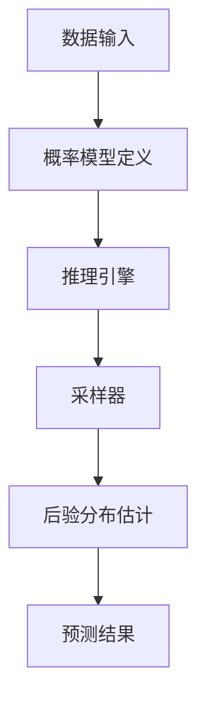

# 基于概率编程的不确定性推理模型设计

> 关键词：概率编程、不确定性推理、概率模型、贝叶斯推断、蒙特卡罗方法

> 摘要：本文围绕基于概率编程的不确定性推理模型展开深入研究。首先介绍了概率编程和不确定性推理的背景知识，明确了研究目的、预期读者和文档结构。接着阐述了核心概念及其联系，包括概率编程和不确定性推理的原理与架构。详细讲解了核心算法原理，通过Python源代码展示具体操作步骤。探讨了相关数学模型和公式，并举例说明。在项目实战部分，给出了开发环境搭建、源代码实现与解读。分析了实际应用场景，推荐了学习资源、开发工具框架和相关论文著作。最后总结了未来发展趋势与挑战，解答常见问题并提供扩展阅读和参考资料，旨在为读者全面呈现基于概率编程的不确定性推理模型的设计与应用。

## 1. 背景介绍 
### 1.1 目的和范围
在现实世界中，许多问题都存在不确定性，如医疗诊断中的疾病判断、金融市场的风险评估等。传统的确定性模型难以准确处理这些不确定性，而基于概率编程的不确定性推理模型能够对不确定性进行量化和推理，为解决这类问题提供了有效的手段。本文的目的是深入探讨基于概率编程的不确定性推理模型的设计原理、算法实现和实际应用，范围涵盖从基本概念的介绍到具体项目实战，以及相关工具和资源的推荐等方面。

### 1.2 预期读者
本文预期读者包括对概率编程、机器学习、人工智能等领域感兴趣的研究人员、开发者，以及希望深入了解不确定性推理技术的学生和从业者。具备一定的编程基础（如Python）和概率论知识将有助于更好地理解本文内容。

### 1.3 文档结构概述
本文首先介绍基于概率编程的不确定性推理模型的背景知识，包括目的、预期读者和文档结构等。接着阐述核心概念及其联系，给出原理和架构的文本示意图与Mermaid流程图。然后详细讲解核心算法原理，并使用Python源代码展示具体操作步骤。之后探讨相关数学模型和公式，通过举例进行说明。在项目实战部分，介绍开发环境搭建、源代码实现与解读。分析实际应用场景，推荐学习资源、开发工具框架和相关论文著作。最后总结未来发展趋势与挑战，解答常见问题并提供扩展阅读和参考资料。

### 1.4 术语表
#### 1.4.1 核心术语定义
- **概率编程**：是一种将概率模型的规范和推理算法的实现集成在一起的编程范式，允许程序员以自然的方式表达概率模型，并自动执行推理任务。
- **不确定性推理**：是指在信息不完整、不准确或存在噪声的情况下，对未知事件或变量的概率分布进行推断的过程。
- **概率模型**：是对随机现象的数学描述，通过定义变量之间的概率关系来表示不确定性。
- **贝叶斯推断**：是一种基于贝叶斯定理的统计推断方法，用于根据新的证据更新对未知参数的先验信念，得到后验概率分布。
- **蒙特卡罗方法**：是一种通过随机抽样来估计数值的计算方法，在概率编程中常用于近似计算复杂的概率分布。

#### 1.4.2 相关概念解释
- **先验分布**：在进行贝叶斯推断之前，对未知参数的概率分布的初始假设。
- **似然函数**：表示在给定参数值的情况下，观察到数据的概率。
- **后验分布**：在考虑了新的证据（数据）后，对未知参数的更新后的概率分布。
- **马尔可夫链蒙特卡罗（MCMC）**：是一类用于从复杂概率分布中抽样的蒙特卡罗方法，通过构建马尔可夫链来生成样本。

#### 1.4.3 缩略词列表
- **MCMC**：马尔可夫链蒙特卡罗（Markov Chain Monte Carlo）
- **HMC**：哈密顿蒙特卡罗（Hamiltonian Monte Carlo）
- **NUTS**：无UTurn采样器（No-U-Turn Sampler）

## 2. 核心概念与联系 
### 概率编程的原理
概率编程的核心思想是将概率模型的定义和推理过程统一在一个编程框架中。程序员可以使用编程语言来描述概率模型，包括变量的先验分布、变量之间的依赖关系等。概率编程系统则会根据这些描述自动执行推理任务，如计算后验分布、进行预测等。

### 不确定性推理的原理
不确定性推理的目的是在存在不确定性的情况下，对未知事件或变量的概率分布进行推断。常见的方法包括贝叶斯推断、最大似然估计等。贝叶斯推断通过结合先验知识和新的证据，更新对未知参数的信念，得到后验概率分布。

### 概率编程与不确定性推理的联系
概率编程为不确定性推理提供了一种灵活、高效的实现方式。通过概率编程，我们可以方便地定义复杂的概率模型，并利用内置的推理算法进行不确定性推理。同时，不确定性推理的理论和方法也为概率编程的发展提供了基础。

### 核心概念原理和架构的文本示意图
概率编程系统通常由以下几个部分组成：
- **模型定义语言**：用于描述概率模型，如变量的先验分布、变量之间的依赖关系等。
- **推理引擎**：根据模型定义和观测数据，执行推理任务，如计算后验分布、进行预测等。
- **采样器**：用于从复杂的概率分布中抽样，常见的采样器包括MCMC采样器、拒绝采样器等。

### Mermaid流程图


## 3. 核心算法原理 & 具体操作步骤 
### 贝叶斯推断原理
贝叶斯推断的核心是贝叶斯定理，其数学表达式为：
$$P(\theta|D)=\frac{P(D|\theta)P(\theta)}{P(D)}$$
其中，$P(\theta|D)$ 是后验分布，表示在观察到数据 $D$ 后，对参数 $\theta$ 的概率分布；$P(D|\theta)$ 是似然函数，表示在给定参数 $\theta$ 的情况下，观察到数据 $D$ 的概率；$P(\theta)$ 是先验分布，表示在观察到数据之前，对参数 $\theta$ 的概率分布；$P(D)$ 是证据，是一个归一化常数。

### 蒙特卡罗方法原理
蒙特卡罗方法是一种通过随机抽样来估计数值的计算方法。在概率编程中，蒙特卡罗方法常用于近似计算复杂的概率分布。具体来说，我们可以从概率分布中抽取大量的样本，然后使用这些样本的统计量来估计概率分布的特征，如均值、方差等。

### Python源代码实现
以下是一个简单的基于概率编程库 `PyMC3` 的示例，用于进行贝叶斯推断：
```python
import pymc3 as pm
import numpy as np
import matplotlib.pyplot as plt

# 生成一些观测数据
np.random.seed(123)
true_mean = 5
true_std = 2
data = np.random.normal(true_mean, true_std, 100)

# 定义概率模型
with pm.Model() as model:
    # 定义先验分布
    mean = pm.Normal('mean', mu=0, sd=10)
    std = pm.HalfNormal('std', sd=10)
    
    # 定义似然函数
    likelihood = pm.Normal('likelihood', mu=mean, sd=std, observed=data)
    
    # 进行采样
    trace = pm.sample(2000, tune=1000, cores=2)

# 绘制后验分布
pm.plot_trace(trace)
plt.show()
```
### 代码解释
1. **数据生成**：使用 `numpy` 生成 100 个服从正态分布的观测数据，真实均值为 5，标准差为 2。
2. **模型定义**：在 `PyMC3` 中，使用 `pm.Model()` 创建一个概率模型。在模型中，定义了均值和标准差的先验分布，以及似然函数。
3. **采样**：使用 `pm.sample()` 函数进行采样，得到后验分布的样本。
4. **结果可视化**：使用 `pm.plot_trace()` 函数绘制后验分布的迹图。

## 4. 数学模型和公式 & 详细讲解 & 举例说明 
### 贝叶斯定理详细讲解
贝叶斯定理是贝叶斯推断的基础，它描述了如何根据新的证据更新对未知参数的先验信念。具体来说，贝叶斯定理将后验分布表示为似然函数和先验分布的乘积，再除以证据。证据是一个归一化常数，确保后验分布的积分等于 1。

### 似然函数和先验分布的选择
似然函数和先验分布的选择取决于具体的问题和领域知识。常见的似然函数包括正态分布、泊松分布等，常见的先验分布包括正态分布、均匀分布等。在选择似然函数和先验分布时，需要考虑数据的特征和模型的假设。

### 举例说明
假设我们有一个硬币，我们想要估计硬币正面朝上的概率 $p$。我们进行了 10 次抛硬币实验，观察到 7 次正面朝上。我们可以使用贝叶斯推断来估计 $p$ 的后验分布。

#### 先验分布
假设我们对 $p$ 的先验信念是均匀分布，即 $P(p)=1$，$0\leq p\leq 1$。

#### 似然函数
似然函数表示在给定 $p$ 的情况下，观察到 7 次正面朝上的概率。根据二项分布的公式，似然函数为：
$$P(D|p)=\binom{10}{7}p^7(1-p)^3$$

#### 后验分布
根据贝叶斯定理，后验分布为：
$$P(p|D)=\frac{P(D|p)P(p)}{P(D)}=\frac{\binom{10}{7}p^7(1-p)^3\times 1}{P(D)}$$
其中，$P(D)$ 是证据，可以通过对后验分布进行积分得到：
$$P(D)=\int_{0}^{1}\binom{10}{7}p^7(1-p)^3dp$$

#### Python代码实现
```python
import numpy as np
import matplotlib.pyplot as plt
from scipy.stats import beta

# 定义先验分布
alpha_prior = 1
beta_prior = 1

# 定义观测数据
n_trials = 10
n_success = 7

# 计算后验分布的参数
alpha_post = alpha_prior + n_success
beta_post = beta_prior + n_trials - n_success

# 绘制先验分布和后验分布
p = np.linspace(0, 1, 100)
prior = beta.pdf(p, alpha_prior, beta_prior)
posterior = beta.pdf(p, alpha_post, beta_post)

plt.plot(p, prior, label='Prior')
plt.plot(p, posterior, label='Posterior')
plt.xlabel('Probability of heads (p)')
plt.ylabel('Probability density')
plt.title('Prior and posterior distributions of p')
plt.legend()
plt.show()
```

## 5. 项目实战：代码实际案例和详细解释说明 
### 5.1  开发环境搭建
#### 安装Python
首先需要安装 Python 环境，建议使用 Python 3.6 及以上版本。可以从 Python 官方网站（https://www.python.org/downloads/） 下载并安装。

#### 安装依赖库
本项目需要使用 `PyMC3`、`numpy`、`matplotlib` 等库。可以使用 `pip` 进行安装：
```sh
pip install pymc3 numpy matplotlib
```

### 5.2  源代码详细实现和代码解读
以下是一个基于 `PyMC3` 的线性回归模型的示例：
```python
import pymc3 as pm
import numpy as np
import matplotlib.pyplot as plt

# 生成一些观测数据
np.random.seed(123)
true_slope = 2
true_intercept = 1
x = np.linspace(0, 10, 100)
y = true_slope * x + true_intercept + np.random.normal(0, 1, 100)

# 定义概率模型
with pm.Model() as model:
    # 定义先验分布
    slope = pm.Normal('slope', mu=0, sd=10)
    intercept = pm.Normal('intercept', mu=0, sd=10)
    sigma = pm.HalfNormal('sigma', sd=10)
    
    # 定义似然函数
    mu = slope * x + intercept
    likelihood = pm.Normal('likelihood', mu=mu, sd=sigma, observed=y)
    
    # 进行采样
    trace = pm.sample(2000, tune=1000, cores=2)

# 绘制后验分布
pm.plot_trace(trace)
plt.show()

# 绘制预测结果
plt.scatter(x, y, label='Data')
for i in range(100):
    slope_sample = trace['slope'][i]
    intercept_sample = trace['intercept'][i]
    y_pred = slope_sample * x + intercept_sample
    plt.plot(x, y_pred, color='r', alpha=0.1)
plt.xlabel('x')
plt.ylabel('y')
plt.title('Linear regression with uncertainty')
plt.legend()
plt.show()
```
### 代码解读
1. **数据生成**：使用 `numpy` 生成 100 个服从线性关系的观测数据，其中包含一些噪声。
2. **模型定义**：在 `PyMC3` 中，使用 `pm.Model()` 创建一个概率模型。在模型中，定义了斜率、截距和噪声标准差的先验分布，以及似然函数。
3. **采样**：使用 `pm.sample()` 函数进行采样，得到后验分布的样本。
4. **结果可视化**：使用 `pm.plot_trace()` 函数绘制后验分布的迹图，使用 `matplotlib` 绘制预测结果。

### 5.3  代码解读与分析
#### 后验分布分析
通过观察后验分布的迹图，我们可以了解模型参数的不确定性。迹图中的每个链应该是平稳的，并且不同链之间应该相互重合，这表明采样过程是有效的。

#### 预测结果分析
通过绘制预测结果，我们可以看到模型的不确定性。不同的样本对应不同的预测线，这些线的分布反映了模型对预测结果的不确定性。

## 6. 实际应用场景 
### 医疗诊断
在医疗诊断中，医生通常需要根据患者的症状、检查结果等信息来判断患者是否患有某种疾病。由于这些信息往往存在不确定性，因此可以使用基于概率编程的不确定性推理模型来进行诊断。例如，通过构建一个概率模型，考虑患者的症状、病史、检查结果等因素，以及这些因素与疾病之间的概率关系，然后使用贝叶斯推断来计算患者患有某种疾病的后验概率。

### 金融风险评估
在金融领域，风险评估是一个重要的问题。由于金融市场的不确定性，传统的确定性模型难以准确评估风险。基于概率编程的不确定性推理模型可以考虑多种因素的不确定性，如市场波动、利率变化等，从而更准确地评估金融风险。例如，通过构建一个概率模型，描述资产价格的变化过程，然后使用蒙特卡罗方法来模拟资产价格的未来走势，从而评估投资组合的风险。

### 自然语言处理
在自然语言处理中，许多任务都存在不确定性，如文本分类、机器翻译等。基于概率编程的不确定性推理模型可以用于处理这些不确定性。例如，在文本分类任务中，可以构建一个概率模型，描述文本特征与类别之间的概率关系，然后使用贝叶斯推断来计算文本属于每个类别的后验概率。

### 机器人导航
在机器人导航中，机器人需要根据传感器数据来判断自己的位置和周围环境。由于传感器数据存在噪声和不确定性，因此可以使用基于概率编程的不确定性推理模型来进行导航。例如，通过构建一个概率模型，描述机器人的运动过程和传感器数据的生成过程，然后使用贝叶斯推断来估计机器人的位置和周围环境的状态。

## 7. 工具和资源推荐
### 7.1 学习资源推荐
#### 7.1.1 书籍推荐
- 《Probabilistic Programming & Bayesian Methods for Hackers》：这本书通过实际的代码示例和案例，介绍了概率编程和贝叶斯方法的基本概念和应用。
- 《Bayesian Data Analysis》：这是一本经典的贝叶斯统计教材，详细介绍了贝叶斯推断的理论和方法。

#### 7.1.2 在线课程
- Coursera 上的 “Probabilistic Graphical Models” 课程：该课程介绍了概率图模型的基本概念和算法，包括贝叶斯网络、马尔可夫随机场等。
- edX 上的 “Probability-The Science of Uncertainty and Data” 课程：该课程介绍了概率论的基本概念和应用，包括随机变量、概率分布、贝叶斯定理等。

#### 7.1.3 技术博客和网站
- PyMC3 官方文档（https://docs.pymc.io/）：提供了 PyMC3 库的详细文档和教程。
- Towards Data Science（https://towardsdatascience.com/）：这是一个数据科学领域的技术博客，经常发布关于概率编程、机器学习等方面的文章。

### 7.2 开发工具框架推荐
#### 7.2.1 IDE和编辑器
- PyCharm：是一个功能强大的 Python IDE，提供了代码编辑、调试、版本控制等功能。
- Jupyter Notebook：是一个交互式的开发环境，适合进行数据探索和模型实验。

#### 7.2.2 调试和性能分析工具
- `pdb`：是 Python 内置的调试工具，可以帮助我们调试代码。
- `cProfile`：是 Python 内置的性能分析工具，可以帮助我们分析代码的性能瓶颈。

#### 7.2.3 相关框架和库
- PyMC3：是一个用于概率编程的 Python 库，提供了丰富的概率分布和推理算法。
- TensorFlow Probability：是一个基于 TensorFlow 的概率编程库，支持深度学习和概率推理的结合。

### 7.3 相关论文著作推荐
#### 7.3.1 经典论文
- “Probabilistic Programming Concepts, Techniques, and Applications”：这篇论文介绍了概率编程的基本概念、技术和应用。
- “Bayesian Inference in Statistical Analysis”：这篇论文是贝叶斯统计领域的经典论文，介绍了贝叶斯推断的基本原理和方法。

#### 7.3.2 最新研究成果
- 可以关注 NeurIPS、ICML、AAAI 等顶级机器学习会议的论文，了解概率编程和不确定性推理领域的最新研究成果。

#### 7.3.3 应用案例分析
- 可以参考 Kaggle 上的相关竞赛和数据集，了解概率编程在实际应用中的案例和解决方案。

## 8. 总结：未来发展趋势与挑战
### 未来发展趋势
- **与深度学习的结合**：概率编程和深度学习的结合将是未来的一个重要发展方向。通过将概率模型和深度学习模型相结合，可以更好地处理不确定性和复杂的数据。
- **自动化推理**：未来的概率编程系统将更加自动化，能够自动选择合适的推理算法和参数，提高推理效率和准确性。
- **跨领域应用**：概率编程将在更多的领域得到应用，如医疗、金融、交通等，为解决实际问题提供更有效的方法。

### 挑战
- **计算效率**：在处理大规模数据和复杂模型时，概率编程的计算效率仍然是一个挑战。需要开发更高效的推理算法和优化技术。
- **模型可解释性**：概率编程模型通常比较复杂，其结果的可解释性是一个重要的问题。需要开发更好的方法来解释模型的结果。
- **数据质量**：概率编程模型的性能高度依赖于数据的质量。在实际应用中，如何获取高质量的数据是一个挑战。

## 9. 附录：常见问题与解答
### 问题1：概率编程和传统编程有什么区别？
概率编程允许程序员以自然的方式表达概率模型，并自动执行推理任务。传统编程主要处理确定性的逻辑和算法，而概率编程则处理不确定性。

### 问题2：如何选择合适的先验分布？
选择合适的先验分布需要考虑具体的问题和领域知识。如果没有先验信息，可以选择无信息先验分布，如均匀分布。如果有先验信息，可以选择合适的有信息先验分布。

### 问题3：概率编程的计算复杂度高吗？
概率编程的计算复杂度通常比较高，尤其是在处理大规模数据和复杂模型时。需要使用高效的推理算法和优化技术来降低计算复杂度。

### 问题4：如何评估概率编程模型的性能？
可以使用交叉验证、预测误差等方法来评估概率编程模型的性能。同时，还可以通过可视化后验分布和预测结果来直观地评估模型的性能。

## 10. 扩展阅读 & 参考资料
### 扩展阅读
- 《The Book of Why: The New Science of Cause and Effect》：这本书介绍了因果推断的基本概念和方法，与概率编程和不确定性推理有一定的关联。
- 《Artificial Intelligence: A Modern Approach》：这是一本经典的人工智能教材，涵盖了概率推理、机器学习等多个领域的知识。

### 参考资料
- PyMC3 官方文档（https://docs.pymc.io/）
- TensorFlow Probability 官方文档（https://www.tensorflow.org/probability）
- 《Probabilistic Programming & Bayesian Methods for Hackers》（https://camdavidsonpilon.github.io/Probabilistic-Programming-and-Bayesian-Methods-for-Hackers/）

作者：AI天才研究院/AI Genius Institute & 禅与计算机程序设计艺术 /Zen And The Art of Computer Programming