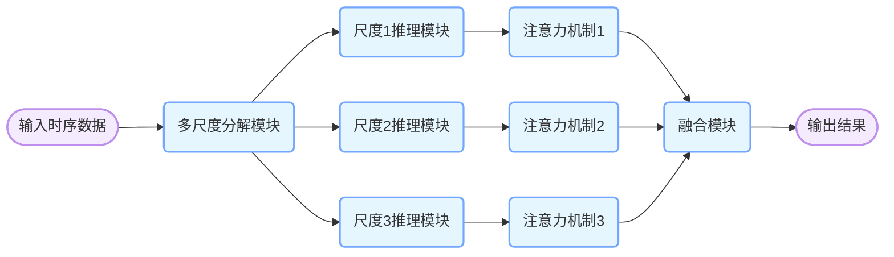

# 基于注意力机制的多尺度时序推理融合技术优化

> 关键词：注意力机制、多尺度时序推理、融合技术、优化、深度学习

> 摘要：本文聚焦于基于注意力机制的多尺度时序推理融合技术优化。首先介绍了该技术的背景，包括其目的、预期读者和文档结构等。详细阐述了核心概念与联系，给出了原理和架构的文本示意图与Mermaid流程图。深入讲解了核心算法原理，并用Python代码进行详细阐述。分析了相关的数学模型和公式，并举例说明。通过项目实战展示了代码的实际案例及详细解释。探讨了该技术的实际应用场景，推荐了学习资源、开发工具框架和相关论文著作。最后总结了未来发展趋势与挑战，并给出常见问题与解答以及扩展阅读和参考资料。旨在为研究和应用该技术的人员提供全面且深入的指导。

## 1. 背景介绍 
### 1.1 目的和范围
在当今信息爆炸的时代，时序数据无处不在，如金融市场的交易数据、传感器采集的环境数据、医疗领域的生理信号数据等。多尺度时序推理融合技术旨在从不同尺度上对时序数据进行分析和处理，挖掘数据中的潜在信息。然而，传统的多尺度时序推理融合方法往往难以有效地捕捉数据中的重要特征，尤其是在处理复杂的时序数据时。注意力机制的引入为解决这一问题提供了新的思路，它可以帮助模型自动地关注时序数据中的关键部分，从而提高推理融合的准确性和效率。

本文的目的是深入研究基于注意力机制的多尺度时序推理融合技术，并对其进行优化。具体范围包括核心概念的阐述、算法原理的分析、数学模型的建立、项目实战的展示以及实际应用场景的探讨等。

### 1.2 预期读者
本文预期读者包括从事人工智能、机器学习、数据挖掘等领域的研究人员和开发者，以及对时序数据分析和处理感兴趣的学生和爱好者。对于有一定编程基础和机器学习知识的读者，本文将帮助他们深入理解基于注意力机制的多尺度时序推理融合技术；对于初学者，本文也将提供一个系统的学习路径和丰富的参考资料。

### 1.3 文档结构概述
本文将按照以下结构进行组织：
- 核心概念与联系：介绍注意力机制、多尺度时序推理和融合技术的基本概念，并阐述它们之间的联系。
- 核心算法原理 & 具体操作步骤：详细讲解基于注意力机制的多尺度时序推理融合算法的原理，并给出具体的操作步骤和Python代码实现。
- 数学模型和公式 & 详细讲解 & 举例说明：建立该技术的数学模型，推导相关公式，并通过具体例子进行说明。
- 项目实战：通过一个实际的项目案例，展示基于注意力机制的多尺度时序推理融合技术的具体应用和实现过程。
- 实际应用场景：探讨该技术在不同领域的实际应用场景。
- 工具和资源推荐：推荐学习该技术所需的书籍、在线课程、技术博客和网站，以及开发工具框架和相关论文著作。
- 总结：未来发展趋势与挑战：总结该技术的发展现状，分析未来的发展趋势和面临的挑战。
- 附录：常见问题与解答：解答读者在学习和应用该技术过程中可能遇到的常见问题。
- 扩展阅读 & 参考资料：提供进一步学习和研究该技术的扩展阅读材料和参考资料。

### 1.4 术语表
#### 1.4.1 核心术语定义
- **注意力机制（Attention Mechanism）**：一种模拟人类注意力的机制，通过计算不同部分的重要性权重，使模型能够自动地关注输入数据中的关键部分。
- **多尺度时序推理（Multi-scale Temporal Reasoning）**：在不同的时间尺度上对时序数据进行分析和推理，以捕捉数据中的不同特征和模式。
- **融合技术（Fusion Technology）**：将来自不同数据源或不同处理阶段的信息进行整合和融合，以提高信息的质量和可用性。
- **时序数据（Temporal Data）**：按照时间顺序排列的数据，如时间序列数据、视频序列数据等。

#### 1.4.2 相关概念解释
- **特征提取（Feature Extraction）**：从原始数据中提取出具有代表性和区分性的特征，以便后续的分析和处理。
- **模型训练（Model Training）**：使用训练数据对模型进行参数调整，使模型能够学习到数据中的规律和模式。
- **模型评估（Model Evaluation）**：使用测试数据对训练好的模型进行评估，以衡量模型的性能和效果。

#### 1.4.3 缩略词列表
- **RNN（Recurrent Neural Network）**：循环神经网络
- **LSTM（Long Short-Term Memory）**：长短期记忆网络
- **GRU（Gated Recurrent Unit）**：门控循环单元
- **CNN（Convolutional Neural Network）**：卷积神经网络

## 2. 核心概念与联系 

### 核心概念原理

#### 注意力机制
注意力机制的核心思想是模拟人类的注意力，通过计算不同部分的重要性权重，使模型能够自动地关注输入数据中的关键部分。在时序数据处理中，注意力机制可以帮助模型在不同的时间步上分配不同的注意力权重，从而更好地捕捉数据中的时序特征。

具体来说，注意力机制通常包括以下几个步骤：
1. **计算注意力分数**：根据输入数据和查询向量，计算每个时间步的注意力分数。注意力分数表示该时间步的重要性程度。
2. **归一化处理**：将注意力分数进行归一化处理，得到注意力权重。注意力权重表示每个时间步在最终输出中的贡献比例。
3. **加权求和**：将输入数据与注意力权重进行加权求和，得到注意力输出。注意力输出是对输入数据的加权表示，其中关键部分得到了更多的关注。

#### 多尺度时序推理
多尺度时序推理是指在不同的时间尺度上对时序数据进行分析和推理。不同的时间尺度可以捕捉到数据中的不同特征和模式，例如短期波动、中期趋势和长期规律等。通过在多个时间尺度上进行推理，可以更全面地理解时序数据的内在结构和变化规律。

常见的多尺度时序推理方法包括：
1. **分层推理**：将时序数据按照不同的时间尺度进行分层，分别在每个层次上进行推理，然后将各个层次的推理结果进行融合。
2. **多分辨率分析**：使用多分辨率分析技术（如小波变换）将时序数据分解为不同尺度的分量，然后对每个分量进行独立的推理和处理。

#### 融合技术
融合技术是指将来自不同数据源或不同处理阶段的信息进行整合和融合，以提高信息的质量和可用性。在基于注意力机制的多尺度时序推理中，融合技术可以用于将不同时间尺度的推理结果进行融合，以及将注意力机制的输出与其他信息进行融合。

常见的融合技术包括：
1. **加权求和**：将不同信息按照一定的权重进行加权求和，得到融合后的结果。
2. **拼接**：将不同信息进行拼接，形成一个更高维度的向量，然后进行后续的处理。

### 架构的文本示意图
基于注意力机制的多尺度时序推理融合技术的架构可以描述如下：

输入的时序数据首先经过多尺度分解模块，将数据分解为不同时间尺度的分量。然后，每个时间尺度的分量分别输入到对应的时序推理模块中进行推理。在推理过程中，注意力机制被应用于每个时间尺度的模块，以帮助模型自动地关注关键部分。最后，将各个时间尺度的推理结果通过融合模块进行融合，得到最终的输出。

### Mermaid流程图


## 3. 核心算法原理 & 具体操作步骤 

### 算法原理
基于注意力机制的多尺度时序推理融合算法的核心思想是在不同的时间尺度上对时序数据进行推理，并使用注意力机制来增强模型对关键部分的关注，最后将不同尺度的推理结果进行融合。

具体来说，算法可以分为以下几个步骤：
1. **多尺度分解**：使用多分辨率分析技术（如小波变换）将输入的时序数据分解为不同时间尺度的分量。
2. **多尺度推理**：对每个时间尺度的分量分别使用循环神经网络（如LSTM、GRU）进行推理，得到每个时间尺度的隐藏状态序列。
3. **注意力机制**：对每个时间尺度的隐藏状态序列应用注意力机制，计算每个时间步的注意力权重，并进行加权求和，得到每个时间尺度的注意力输出。
4. **融合操作**：将各个时间尺度的注意力输出进行融合，得到最终的输出。

### 具体操作步骤

#### 步骤1：多尺度分解
使用小波变换将输入的时序数据分解为不同时间尺度的分量。以下是一个使用Python和`pywt`库进行小波分解的示例代码：
```python
import pywt
import numpy as np

def multi_scale_decomposition(data, wavelet='db4', level=3):
    """
    多尺度分解函数
    :param data: 输入的时序数据
    :param wavelet: 小波基函数
    :param level: 分解的层数
    :return: 不同尺度的分量
    """
    coeffs = pywt.wavedec(data, wavelet, level=level)
    return coeffs
```

#### 步骤2：多尺度推理
对每个时间尺度的分量分别使用LSTM进行推理。以下是一个使用PyTorch实现的LSTM推理模块的示例代码：
```python
import torch
import torch.nn as nn

class LSTMModule(nn.Module):
    def __init__(self, input_size, hidden_size, num_layers):
        super(LSTMModule, self).__init__()
        self.lstm = nn.LSTM(input_size, hidden_size, num_layers, batch_first=True)

    def forward(self, x):
        out, _ = self.lstm(x)
        return out
```

#### 步骤3：注意力机制
对每个时间尺度的隐藏状态序列应用注意力机制。以下是一个使用PyTorch实现的注意力机制模块的示例代码：
```python
class AttentionModule(nn.Module):
    def __init__(self, hidden_size):
        super(AttentionModule, self).__init__()
        self.fc = nn.Linear(hidden_size, 1)
        self.softmax = nn.Softmax(dim=1)

    def forward(self, x):
        scores = self.fc(x)
        weights = self.softmax(scores)
        out = torch.sum(x * weights, dim=1)
        return out
```

#### 步骤4：融合操作
将各个时间尺度的注意力输出进行拼接，然后通过一个全连接层进行融合。以下是一个使用PyTorch实现的融合模块的示例代码：
```python
class FusionModule(nn.Module):
    def __init__(self, input_size, output_size):
        super(FusionModule, self).__init__()
        self.fc = nn.Linear(input_size, output_size)

    def forward(self, x):
        out = self.fc(x)
        return out
```

### 完整算法实现
以下是一个将上述步骤整合在一起的完整算法实现：
```python
import torch
import torch.nn as nn
import pywt
import numpy as np

# 多尺度分解函数
def multi_scale_decomposition(data, wavelet='db4', level=3):
    coeffs = pywt.wavedec(data, wavelet, level=level)
    return coeffs

# LSTM推理模块
class LSTMModule(nn.Module):
    def __init__(self, input_size, hidden_size, num_layers):
        super(LSTMModule, self).__init__()
        self.lstm = nn.LSTM(input_size, hidden_size, num_layers, batch_first=True)

    def forward(self, x):
        out, _ = self.lstm(x)
        return out

# 注意力机制模块
class AttentionModule(nn.Module):
    def __init__(self, hidden_size):
        super(AttentionModule, self).__init__()
        self.fc = nn.Linear(hidden_size, 1)
        self.softmax = nn.Softmax(dim=1)

    def forward(self, x):
        scores = self.fc(x)
        weights = self.softmax(scores)
        out = torch.sum(x * weights, dim=1)
        return out

# 融合模块
class FusionModule(nn.Module):
    def __init__(self, input_size, output_size):
        super(FusionModule, self).__init__()
        self.fc = nn.Linear(input_size, output_size)

    def forward(self, x):
        out = self.fc(x)
        return out

# 基于注意力机制的多尺度时序推理融合模型
class AttentionMultiScaleModel(nn.Module):
    def __init__(self, input_size, hidden_size, num_layers, output_size, wavelet='db4', level=3):
        super(AttentionMultiScaleModel, self).__init__()
        self.wavelet = wavelet
        self.level = level
        self.lstm_modules = nn.ModuleList([LSTMModule(input_size, hidden_size, num_layers) for _ in range(level + 1)])
        self.attention_modules = nn.ModuleList([AttentionModule(hidden_size) for _ in range(level + 1)])
        self.fusion_module = FusionModule((level + 1) * hidden_size, output_size)

    def forward(self, x):
        # 多尺度分解
        coeffs = multi_scale_decomposition(x.detach().cpu().numpy(), self.wavelet, self.level)
        coeffs = [torch.tensor(c, dtype=torch.float32).unsqueeze(0) for c in coeffs]

        # 多尺度推理
        hidden_states = []
        for i in range(self.level + 1):
            hidden = self.lstm_modules[i](coeffs[i])
            hidden_states.append(hidden)

        # 注意力机制
        attention_outputs = []
        for i in range(self.level + 1):
            attention_output = self.attention_modules[i](hidden_states[i])
            attention_outputs.append(attention_output)

        # 融合操作
        fused_output = torch.cat(attention_outputs, dim=1)
        final_output = self.fusion_module(fused_output)

        return final_output
```

## 4. 数学模型和公式 & 详细讲解 & 举例说明 

### 数学模型
基于注意力机制的多尺度时序推理融合技术可以用以下数学模型来描述：

#### 多尺度分解
假设输入的时序数据为 $X = [x_1, x_2, \cdots, x_T]$，其中 $T$ 是时间步数。使用小波变换将 $X$ 分解为不同时间尺度的分量 $C_0, C_1, \cdots, C_L$，其中 $L$ 是分解的层数。

#### 多尺度推理
对于每个时间尺度的分量 $C_l$，使用LSTM进行推理。LSTM的输入为 $C_l$，输出为隐藏状态序列 $H_l = [h_{l1}, h_{l2}, \cdots, h_{lT_l}]$，其中 $T_l$ 是第 $l$ 个尺度的时间步数。

LSTM的更新公式如下：
$$
\begin{align*}
i_t &= \sigma(W_{ii}x_t + W_{hi}h_{t-1} + b_i) \\
f_t &= \sigma(W_{if}x_t + W_{hf}h_{t-1} + b_f) \\
g_t &= \tanh(W_{ig}x_t + W_{hg}h_{t-1} + b_g) \\
o_t &= \sigma(W_{io}x_t + W_{ho}h_{t-1} + b_o) \\
c_t &= f_t \odot c_{t-1} + i_t \odot g_t \\
h_t &= o_t \odot \tanh(c_t)
\end{align*}
$$
其中，$i_t$、$f_t$、$g_t$、$o_t$ 分别是输入门、遗忘门、候选记忆单元和输出门，$c_t$ 是记忆单元，$h_t$ 是隐藏状态，$\sigma$ 是 sigmoid 函数，$\tanh$ 是双曲正切函数，$W$ 是权重矩阵，$b$ 是偏置向量，$\odot$ 是逐元素相乘。

#### 注意力机制
对于每个时间尺度的隐藏状态序列 $H_l$，使用注意力机制计算每个时间步的注意力权重 $\alpha_{lt}$，并进行加权求和，得到注意力输出 $a_l$。

注意力分数的计算公式如下：
$$
e_{lt} = v^T \tanh(W_a h_{lt} + b_a)
$$
其中，$v$ 是注意力向量，$W_a$ 和 $b_a$ 是权重矩阵和偏置向量。

注意力权重的计算公式如下：
$$
\alpha_{lt} = \frac{\exp(e_{lt})}{\sum_{t'=1}^{T_l} \exp(e_{lt'})}
$$

注意力输出的计算公式如下：
$$
a_l = \sum_{t=1}^{T_l} \alpha_{lt} h_{lt}
$$

#### 融合操作
将各个时间尺度的注意力输出 $a_0, a_1, \cdots, a_L$ 进行拼接，得到拼接向量 $A = [a_0; a_1; \cdots; a_L]$。然后通过一个全连接层进行融合，得到最终的输出 $y$。

融合的计算公式如下：
$$
y = W_f A + b_f
$$
其中，$W_f$ 和 $b_f$ 是全连接层的权重矩阵和偏置向量。

### 详细讲解
- **多尺度分解**：小波变换是一种常用的多分辨率分析技术，它可以将时序数据分解为不同尺度的分量。不同尺度的分量对应着不同的频率成分，从而可以捕捉到数据中的不同特征和模式。
- **多尺度推理**：LSTM是一种特殊的循环神经网络，它可以有效地处理长序列数据。在每个时间尺度上使用LSTM进行推理，可以更好地捕捉到该尺度下的时序特征。
- **注意力机制**：注意力机制可以帮助模型自动地关注时序数据中的关键部分。通过计算注意力权重，模型可以对不同时间步的隐藏状态进行加权求和，从而突出关键部分的影响。
- **融合操作**：将不同时间尺度的注意力输出进行融合，可以综合利用各个尺度的信息，提高推理的准确性和可靠性。

### 举例说明
假设输入的时序数据为 $X = [1, 2, 3, 4, 5, 6, 7, 8]$，使用小波变换将其分解为两个尺度的分量 $C_0 = [3, 7]$ 和 $C_1 = [-1, -1, -1, -1]$。

对于 $C_0$，使用LSTM进行推理，得到隐藏状态序列 $H_0 = [h_{01}, h_{02}]$。对于 $C_1$，使用LSTM进行推理，得到隐藏状态序列 $H_1 = [h_{11}, h_{12}, h_{13}, h_{14}]$。

对 $H_0$ 应用注意力机制，计算注意力权重 $\alpha_{01}$ 和 $\alpha_{02}$，并进行加权求和，得到注意力输出 $a_0$。对 $H_1$ 应用注意力机制，计算注意力权重 $\alpha_{11}, \alpha_{12}, \alpha_{13}, \alpha_{14}$，并进行加权求和，得到注意力输出 $a_1$。

将 $a_0$ 和 $a_1$ 进行拼接，得到拼接向量 $A = [a_0; a_1]$。然后通过一个全连接层进行融合，得到最终的输出 $y$。

## 5. 项目实战：代码实际案例和详细解释说明 

### 5.1  开发环境搭建
为了实现基于注意力机制的多尺度时序推理融合技术，我们需要搭建一个合适的开发环境。以下是所需的主要工具和库：
- **Python**：建议使用Python 3.7及以上版本。
- **PyTorch**：一个开源的深度学习框架，用于构建和训练神经网络模型。
- **NumPy**：一个用于科学计算的Python库，提供了高效的数组操作和数学函数。
- **PyWavelets**：一个用于小波变换的Python库，用于实现多尺度分解。

可以使用以下命令来安装所需的库：
```bash
pip install torch numpy pywt
```

### 5.2  源代码详细实现和代码解读
以下是一个完整的项目实战代码示例，包括数据生成、模型定义、训练和测试等步骤：

```python
import torch
import torch.nn as nn
import torch.optim as optim
import numpy as np
import pywt
from torch.utils.data import Dataset, DataLoader

# 多尺度分解函数
def multi_scale_decomposition(data, wavelet='db4', level=3):
    coeffs = pywt.wavedec(data, wavelet, level=level)
    return coeffs

# LSTM推理模块
class LSTMModule(nn.Module):
    def __init__(self, input_size, hidden_size, num_layers):
        super(LSTMModule, self).__init__()
        self.lstm = nn.LSTM(input_size, hidden_size, num_layers, batch_first=True)

    def forward(self, x):
        out, _ = self.lstm(x)
        return out

# 注意力机制模块
class AttentionModule(nn.Module):
    def __init__(self, hidden_size):
        super(AttentionModule, self).__init__()
        self.fc = nn.Linear(hidden_size, 1)
        self.softmax = nn.Softmax(dim=1)

    def forward(self, x):
        scores = self.fc(x)
        weights = self.softmax(scores)
        out = torch.sum(x * weights, dim=1)
        return out

# 融合模块
class FusionModule(nn.Module):
    def __init__(self, input_size, output_size):
        super(FusionModule, self).__init__()
        self.fc = nn.Linear(input_size, output_size)

    def forward(self, x):
        out = self.fc(x)
        return out

# 基于注意力机制的多尺度时序推理融合模型
class AttentionMultiScaleModel(nn.Module):
    def __init__(self, input_size, hidden_size, num_layers, output_size, wavelet='db4', level=3):
        super(AttentionMultiScaleModel, self).__init__()
        self.wavelet = wavelet
        self.level = level
        self.lstm_modules = nn.ModuleList([LSTMModule(input_size, hidden_size, num_layers) for _ in range(level + 1)])
        self.attention_modules = nn.ModuleList([AttentionModule(hidden_size) for _ in range(level + 1)])
        self.fusion_module = FusionModule((level + 1) * hidden_size, output_size)

    def forward(self, x):
        # 多尺度分解
        coeffs = multi_scale_decomposition(x.detach().cpu().numpy(), self.wavelet, self.level)
        coeffs = [torch.tensor(c, dtype=torch.float32).unsqueeze(0) for c in coeffs]

        # 多尺度推理
        hidden_states = []
        for i in range(self.level + 1):
            hidden = self.lstm_modules[i](coeffs[i])
            hidden_states.append(hidden)

        # 注意力机制
        attention_outputs = []
        for i in range(self.level + 1):
            attention_output = self.attention_modules[i](hidden_states[i])
            attention_outputs.append(attention_output)

        # 融合操作
        fused_output = torch.cat(attention_outputs, dim=1)
        final_output = self.fusion_module(fused_output)

        return final_output

# 自定义数据集类
class TimeSeriesDataset(Dataset):
    def __init__(self, data, labels):
        self.data = data
        self.labels = labels

    def __len__(self):
        return len(self.data)

    def __getitem__(self, idx):
        return self.data[idx], self.labels[idx]

# 生成示例数据
def generate_data(num_samples, seq_length):
    data = []
    labels = []
    for _ in range(num_samples):
        seq = np.random.randn(seq_length)
        label = np.sum(seq) > 0
        data.append(seq)
        labels.append(int(label))
    data = np.array(data)
    labels = np.array(labels)
    return data, labels

# 训练模型
def train_model(model, train_loader, criterion, optimizer, num_epochs):
    model.train()
    for epoch in range(num_epochs):
        running_loss = 0.0
        for inputs, labels in train_loader:
            inputs = inputs.float()
            labels = labels.long()

            optimizer.zero_grad()
            outputs = model(inputs)
            loss = criterion(outputs, labels)
            loss.backward()
            optimizer.step()

            running_loss += loss.item()

        print(f'Epoch {epoch + 1}/{num_epochs}, Loss: {running_loss / len(train_loader)}')

# 测试模型
def test_model(model, test_loader):
    model.eval()
    correct = 0
    total = 0
    with torch.no_grad():
        for inputs, labels in test_loader:
            inputs = inputs.float()
            labels = labels.long()

            outputs = model(inputs)
            _, predicted = torch.max(outputs.data, 1)
            total += labels.size(0)
            correct += (predicted == labels).sum().item()

    print(f'Accuracy: {100 * correct / total}%')

# 主函数
if __name__ == '__main__':
    # 生成数据
    num_samples = 1000
    seq_length = 10
    data, labels = generate_data(num_samples, seq_length)

    # 划分训练集和测试集
    train_size = int(0.8 * num_samples)
    train_data = data[:train_size]
    train_labels = labels[:train_size]
    test_data = data[train_size:]
    test_labels = labels[train_size:]

    # 创建数据集和数据加载器
    train_dataset = TimeSeriesDataset(train_data, train_labels)
    train_loader = DataLoader(train_dataset, batch_size=32, shuffle=True)
    test_dataset = TimeSeriesDataset(test_data, test_labels)
    test_loader = DataLoader(test_dataset, batch_size=32, shuffle=False)

    # 定义模型
    input_size = 1
    hidden_size = 16
    num_layers = 1
    output_size = 2
    model = AttentionMultiScaleModel(input_size, hidden_size, num_layers, output_size)

    # 定义损失函数和优化器
    criterion = nn.CrossEntropyLoss()
    optimizer = optim.Adam(model.parameters(), lr=0.001)

    # 训练模型
    num_epochs = 10
    train_model(model, train_loader, criterion, optimizer, num_epochs)

    # 测试模型
    test_model(model, test_loader)
```

### 代码解读与分析
- **数据生成**：使用 `generate_data` 函数生成示例数据，包括时序数据和对应的标签。
- **数据集和数据加载器**：定义了 `TimeSeriesDataset` 类来封装数据和标签，并使用 `DataLoader` 来批量加载数据。
- **模型定义**：定义了 `AttentionMultiScaleModel` 类，包括多尺度分解、多尺度推理、注意力机制和融合操作等模块。
- **训练模型**：使用 `train_model` 函数对模型进行训练，包括前向传播、计算损失、反向传播和参数更新等步骤。
- **测试模型**：使用 `test_model` 函数对训练好的模型进行测试，计算模型的准确率。

通过这个项目实战，我们可以看到基于注意力机制的多尺度时序推理融合技术在实际应用中的具体实现和效果。

## 6. 实际应用场景 
基于注意力机制的多尺度时序推理融合技术在许多领域都有广泛的应用，以下是一些常见的实际应用场景：

### 金融领域
- **股票价格预测**：通过对历史股票价格数据进行多尺度分析和推理，可以捕捉到不同时间尺度上的市场趋势和波动特征。注意力机制可以帮助模型关注到关键的市场信息，如重大事件、政策变化等，从而提高股票价格预测的准确性。
- **风险评估**：在金融风险管理中，需要对各种风险因素进行评估和预测。多尺度时序推理融合技术可以综合考虑不同时间尺度上的风险因素，如短期的市场波动、中期的经济周期和长期的宏观经济趋势等。注意力机制可以帮助模型重点关注对风险影响较大的因素，提高风险评估的可靠性。

### 医疗领域
- **疾病诊断**：在医疗诊断中，常常需要对患者的生理信号数据（如心电图、脑电图等）进行分析和诊断。多尺度时序推理融合技术可以在不同的时间尺度上对生理信号进行特征提取和分析，从而更全面地了解患者的病情。注意力机制可以帮助医生关注到关键的生理信号特征，提高疾病诊断的准确性。
- **健康监测**：对于长期健康监测，如老年人的健康状况监测、慢性病患者的病情跟踪等，多尺度时序推理融合技术可以对不同时间尺度上的健康数据进行分析和处理。注意力机制可以帮助系统关注到异常的健康数据变化，及时发出预警，保障患者的健康安全。

### 工业领域
- **设备故障预测**：在工业生产中，设备的故障预测和维护是非常重要的。通过对设备的运行数据进行多尺度分析和推理，可以提前发现设备的潜在故障。注意力机制可以帮助模型关注到设备运行数据中的异常特征，提高故障预测的准确性，减少设备停机时间和维修成本。
- **生产过程优化**：多尺度时序推理融合技术可以对工业生产过程中的各种数据进行分析和优化。例如，在制造业中，可以对生产线上的温度、压力、流量等数据进行多尺度分析，找出影响生产效率和质量的关键因素。注意力机制可以帮助模型重点关注对生产过程影响较大的因素，从而实现生产过程的优化和改进。

### 交通领域
- **交通流量预测**：在城市交通管理中，准确的交通流量预测可以帮助交通部门合理规划交通资源，缓解交通拥堵。多尺度时序推理融合技术可以对不同时间尺度上的交通流量数据进行分析和预测，如短期的实时交通流量、中期的日交通流量和长期的季节性交通流量等。注意力机制可以帮助模型关注到影响交通流量的关键因素，如天气、特殊事件等，提高交通流量预测的准确性。
- **智能驾驶**：在智能驾驶系统中，需要对车辆周围的环境信息进行实时分析和处理。多尺度时序推理融合技术可以对不同传感器（如摄像头、雷达、激光雷达等）采集的时序数据进行多尺度分析和融合，提高对环境信息的感知和理解能力。注意力机制可以帮助模型关注到关键的环境信息，如行人、车辆、交通标志等，保障智能驾驶的安全性。

## 7. 工具和资源推荐
### 7.1 学习资源推荐
#### 7.1.1 书籍推荐
- 《深度学习》（Deep Learning）：由Ian Goodfellow、Yoshua Bengio和Aaron Courville合著，是深度学习领域的经典教材，涵盖了深度学习的基本概念、算法和应用。
- 《Python深度学习》（Deep Learning with Python）：由Francois Chollet所著，详细介绍了如何使用Python和Keras进行深度学习模型的开发和训练，适合初学者入门。
- 《时间序列分析：预测与控制》（Time Series Analysis: Forecasting and Control）：由George E. P. Box、Gwilym M. Jenkins和Gregory C. Reinsel合著，是时间序列分析领域的权威教材，介绍了时间序列分析的基本方法和技术。

#### 7.1.2 在线课程
- Coursera上的“深度学习专项课程”（Deep Learning Specialization）：由Andrew Ng教授主讲，包括五门课程，全面介绍了深度学习的理论和实践。
- edX上的“强化学习基础”（Fundamentals of Reinforcement Learning）：由Peter Frazier和Emma Brunskill教授主讲，介绍了强化学习的基本概念、算法和应用。
- 网易云课堂上的“Python数据分析与机器学习实战”：由黑马程序员团队主讲，结合实际案例介绍了Python在数据分析和机器学习中的应用。

#### 7.1.3 技术博客和网站
- Medium：一个技术博客平台，上面有很多关于人工智能、机器学习和深度学习的优秀文章。
- Towards Data Science：专注于数据科学和机器学习领域的技术博客，提供了丰富的技术文章和案例分析。
- arXiv：一个预印本数据库，收录了大量的计算机科学、物理学、数学等领域的研究论文，是获取最新研究成果的重要渠道。

### 7.2 开发工具框架推荐
#### 7.2.1 IDE和编辑器
- PyCharm：一款专业的Python集成开发环境，提供了丰富的代码编辑、调试和项目管理功能。
- Jupyter Notebook：一个交互式的编程环境，适合进行数据分析、模型开发和实验验证。
- Visual Studio Code：一款轻量级的代码编辑器，支持多种编程语言和插件扩展，具有强大的代码编辑和调试功能。

#### 7.2.2 调试和性能分析工具
- PyTorch Profiler：PyTorch提供的性能分析工具，可以帮助开发者分析模型的运行时间、内存使用等性能指标。
- TensorBoard：TensorFlow提供的可视化工具，可以帮助开发者可视化模型的训练过程、损失曲线、准确率等信息。
- cProfile：Python标准库中的性能分析工具，可以帮助开发者分析Python代码的运行时间和函数调用情况。

#### 7.2.3 相关框架和库
- PyTorch：一个开源的深度学习框架，提供了丰富的神经网络层、优化器和损失函数，支持GPU加速。
- TensorFlow：另一个广泛使用的深度学习框架，具有强大的分布式训练和部署能力。
- NumPy：一个用于科学计算的Python库，提供了高效的数组操作和数学函数。
- Pandas：一个用于数据处理和分析的Python库，提供了丰富的数据结构和数据处理方法。

### 7.3 相关论文著作推荐
#### 7.3.1 经典论文
- "Attention Is All You Need"：由Ashish Vaswani等人发表，介绍了Transformer模型和注意力机制，是自然语言处理领域的经典论文。
- "Long Short-Term Memory"：由Sepp Hochreiter和Jürgen Schmidhuber发表，提出了长短期记忆网络（LSTM），解决了传统循环神经网络的梯度消失问题。
- "Wavelet Analysis and Its Applications"：由Stéphane Mallat所著，是小波分析领域的经典著作，介绍了小波分析的基本理论和应用。

#### 7.3.2 最新研究成果
- 关注arXiv上关于注意力机制、多尺度时序推理和融合技术的最新研究论文，了解该领域的最新发展动态。
- 参加相关的学术会议，如NeurIPS、ICML、CVPR等，获取最新的研究成果和技术趋势。

#### 7.3.3 应用案例分析
- 阅读相关的技术博客和论文，了解基于注意力机制的多尺度时序推理融合技术在不同领域的应用案例和实践经验。
- 参考开源项目和代码库，学习他人的实现思路和方法，加快自己的项目开发进度。

## 8. 总结：未来发展趋势与挑战
### 未来发展趋势
- **模型架构创新**：未来可能会出现更多基于注意力机制的新型多尺度时序推理融合模型架构，以进一步提高模型的性能和效率。例如，将注意力机制与其他深度学习模型（如卷积神经网络、图神经网络等）相结合，探索更有效的特征提取和推理方法。
- **跨领域应用拓展**：随着技术的不断发展，基于注意力机制的多尺度时序推理融合技术将在更多领域得到应用，如智能家居、智能农业、环境监测等。通过与不同领域的专业知识相结合，可以解决更多复杂的实际问题。
- **实时处理能力提升**：在一些实时性要求较高的应用场景中，如智能驾驶、工业自动化等，需要模型具备更快的推理速度和实时处理能力。未来的研究将致力于提高模型的计算效率，实现实时的多尺度时序推理融合。
- **可解释性增强**：深度学习模型的可解释性一直是一个重要的研究方向。未来的基于注意力机制的多尺度时序推理融合模型将更加注重可解释性，通过可视化和分析注意力权重等方式，帮助用户更好地理解模型的决策过程。

### 挑战
- **数据质量和数量**：多尺度时序推理融合技术需要大量高质量的时序数据来进行训练和优化。然而，在实际应用中，数据的质量和数量往往受到限制，如数据缺失、噪声干扰等问题。如何处理这些数据问题，提高数据的可用性和可靠性，是一个亟待解决的挑战。
- **计算资源需求**：基于注意力机制的多尺度时序推理融合模型通常具有较高的计算复杂度，需要大量的计算资源来进行训练和推理。在资源受限的情况下，如何优化模型的结构和算法，降低计算成本，是一个重要的挑战。
- **模型泛化能力**：不同的应用场景和数据集可能具有不同的特征和分布，模型的泛化能力是一个关键问题。如何设计具有良好泛化能力的模型，使其能够在不同的数据集和应用场景中都能取得较好的性能，是一个需要深入研究的问题。
- **伦理和安全问题**：随着人工智能技术的广泛应用，伦理和安全问题也日益受到关注。基于注意力机制的多尺度时序推理融合技术在一些敏感领域（如医疗、金融等）的应用可能会涉及到隐私保护、数据安全等问题。如何确保模型的应用符合伦理和法律要求，保障用户的权益和安全，是一个重要的挑战。

## 9. 附录：常见问题与解答
### 问题1：注意力机制在多尺度时序推理融合中的作用是什么？
答：注意力机制在多尺度时序推理融合中起到了关键作用。它可以帮助模型自动地关注时序数据中的关键部分，在不同的时间步上分配不同的注意力权重。通过计算注意力权重，模型可以对不同时间步的隐藏状态进行加权求和，从而突出关键部分的影响，提高推理的准确性和效率。在多尺度的情况下，注意力机制可以分别应用于每个时间尺度的推理模块，使模型能够更好地捕捉不同尺度下的关键信息，然后将各个尺度的信息进行有效的融合。

### 问题2：多尺度分解为什么选择小波变换？
答：小波变换是一种常用的多分辨率分析技术，具有以下优点使其适合用于多尺度分解：
- **多尺度特性**：小波变换可以将时序数据分解为不同尺度的分量，每个尺度对应着不同的频率成分。这使得我们可以在不同的时间尺度上对数据进行分析和处理，捕捉到数据中的不同特征和模式。
- **时频局部化**：小波变换具有良好的时频局部化特性，能够在时间和频率两个域上同时提供局部信息。这对于处理非平稳的时序数据非常有用，可以更好地分析数据在不同时间和频率上的变化情况。
- **快速算法**：存在高效的小波变换快速算法，如Mallat算法，能够在较短的时间内完成数据的分解和重构，提高计算效率。

### 问题3：如何选择合适的模型参数，如隐藏层大小、分解层数等？
答：选择合适的模型参数通常需要进行实验和调优。以下是一些建议：
- **隐藏层大小**：隐藏层大小决定了模型的表达能力。一般来说，可以从较小的隐藏层大小开始尝试，如16、32等，然后逐渐增加隐藏层大小，观察模型的性能变化。如果模型的性能随着隐藏层大小的增加而提升，但达到一定程度后不再提升甚至下降，说明此时的隐藏层大小可能是比较合适的。
- **分解层数**：分解层数决定了多尺度分析的粒度。分解层数过多可能会导致模型过于复杂，增加计算成本和过拟合的风险；分解层数过少可能无法充分捕捉到数据中的多尺度特征。可以通过实验不同的分解层数，比较模型在训练集和验证集上的性能，选择性能最优的分解层数。
- **交叉验证**：使用交叉验证技术可以更准确地评估不同参数组合下模型的性能。将数据集划分为多个子集，轮流使用不同的子集作为验证集，计算模型在验证集上的平均性能，选择平均性能最优的参数组合。

### 问题4：模型训练过程中出现过拟合怎么办？
答：过拟合是指模型在训练集上表现良好，但在测试集上表现不佳的现象。以下是一些解决过拟合问题的方法：
- **增加数据量**：收集更多的训练数据可以使模型学习到更丰富的特征和模式，减少过拟合的风险。
- **正则化**：使用正则化方法，如L1和L2正则化，可以限制模型的参数大小，防止模型过于复杂。
- **Dropout**：在模型中添加Dropout层，随机丢弃一部分神经元的输出，减少神经元之间的共适应现象，提高模型的泛化能力。
- **早停策略**：在模型训练过程中，监控模型在验证集上的性能。当验证集上的性能不再提升时，停止训练，避免模型过拟合。
- **简化模型结构**：减少模型的复杂度，如减少隐藏层的数量、缩小隐藏层的大小等，也可以缓解过拟合问题。

### 问题5：该技术在实际应用中如何进行部署？
答：将基于注意力机制的多尺度时序推理融合技术应用到实际项目中，部署过程通常包括以下步骤：
- **模型保存**：在模型训练完成后，将训练好的模型保存为文件，以便后续使用。在PyTorch中，可以使用`torch.save`函数保存模型的参数。
- **环境配置**：确保部署环境中安装了所需的库和依赖项，如PyTorch、NumPy、PyWavelets等。可以使用虚拟环境来管理项目的依赖。
- **数据预处理**：在实际应用中，需要对输入的数据进行预处理，包括数据清洗、归一化、多尺度分解等操作，确保输入数据的格式和质量符合模型的要求。
- **模型加载和推理**：在部署环境中加载保存的模型文件，并使用输入数据进行推理。在PyTorch中，可以使用`torch.load`函数加载模型的参数，然后调用模型的`forward`方法进行推理。
- **集成到应用系统**：将模型的推理结果集成到实际的应用系统中，如Web应用、移动应用等。可以使用API接口将模型封装成服务，方便其他系统调用。

## 10. 扩展阅读 & 参考资料
### 扩展阅读
- "Transformer-XL: Attentive Language Models Beyond a Fixed-Length Context"：介绍了Transformer-XL模型，它扩展了Transformer模型的上下文长度，提高了语言模型的性能。
- "Temporal Convolutional Networks: A Unified Approach to Action Segmentation"：提出了时间卷积网络（TCN），用于处理时序数据的分类和分割问题。
- "Graph Attention Networks"：介绍了图注意力网络（GAT），将注意力机制应用到图神经网络中，提高了图数据的处理能力。

### 参考资料
- PyTorch官方文档：https://pytorch.org/docs/stable/index.html
- NumPy官方文档：https://numpy.org/doc/stable/
- PyWavelets官方文档：https://pywavelets.readthedocs.io/en/latest/
- arXiv预印本数据库：https://arxiv.org/

作者：AI天才研究院/AI Genius Institute & 禅与计算机程序设计艺术