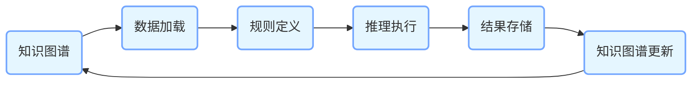

# 基于知识图谱的大规模推理系统优化技术

> 关键词：知识图谱、大规模推理系统、优化技术、图数据库、分布式计算

> 摘要：本文围绕基于知识图谱的大规模推理系统优化技术展开深入探讨。首先介绍了相关背景，包括目的、预期读者等内容。接着阐述知识图谱及大规模推理系统的核心概念与联系，详细讲解核心算法原理和具体操作步骤，并给出数学模型和公式。通过项目实战展示代码实际案例及详细解释。分析了实际应用场景，推荐了相关的工具和资源。最后总结未来发展趋势与挑战，提供常见问题解答和扩展阅读参考资料，旨在为提升基于知识图谱的大规模推理系统性能提供全面的技术指导和深入的思考。

## 1. 背景介绍 
### 1.1 目的和范围
随着信息爆炸时代的到来，知识图谱作为一种强大的知识表示和管理工具，在各个领域得到了广泛应用。大规模推理系统基于知识图谱进行知识推理，挖掘潜在的知识和关系，为智能决策、信息检索等提供支持。然而，面对大规模的知识图谱数据，推理系统面临着性能瓶颈，如推理速度慢、内存消耗大等问题。本文的目的就是研究和探讨基于知识图谱的大规模推理系统的优化技术，以提高系统的性能和效率，扩大其应用范围。

本文的范围涵盖了知识图谱的基本概念、大规模推理系统的工作原理、常见的优化技术和策略，以及通过实际案例展示如何应用这些优化技术来提升系统性能。同时，还会介绍相关的工具和资源，为读者进一步研究和实践提供参考。

### 1.2 预期读者
本文预期读者包括计算机科学、人工智能、数据挖掘等领域的研究人员和学生，他们对知识图谱和推理系统有一定的了解，希望深入学习和掌握基于知识图谱的大规模推理系统优化技术。此外，从事相关领域开发和应用的工程师和技术人员也可以从本文中获取实用的技术和方法，用于解决实际工作中的问题。

### 1.3 文档结构概述
本文将按照以下结构进行组织：
- 核心概念与联系：介绍知识图谱和大规模推理系统的基本概念，以及它们之间的联系，并通过文本示意图和 Mermaid 流程图进行直观展示。
- 核心算法原理 & 具体操作步骤：详细讲解大规模推理系统中常用的核心算法原理，并使用 Python 源代码进行阐述，同时给出具体的操作步骤。
- 数学模型和公式 & 详细讲解 & 举例说明：介绍大规模推理系统的数学模型和相关公式，进行详细讲解，并通过具体例子说明其应用。
- 项目实战：代码实际案例和详细解释说明：通过一个实际的项目案例，展示如何搭建开发环境、实现源代码，并对代码进行解读和分析。
- 实际应用场景：分析基于知识图谱的大规模推理系统在不同领域的实际应用场景。
- 工具和资源推荐：推荐相关的学习资源、开发工具框架和论文著作，帮助读者进一步学习和研究。
- 总结：未来发展趋势与挑战：总结基于知识图谱的大规模推理系统优化技术的未来发展趋势和面临的挑战。
- 附录：常见问题与解答：解答读者在学习和实践过程中可能遇到的常见问题。
- 扩展阅读 & 参考资料：提供相关的扩展阅读资料和参考文献，方便读者深入研究。

### 1.4 术语表
#### 1.4.1 核心术语定义
- **知识图谱**：是一种用图模型来描述知识和记录实体间关系的语义网络，由实体、关系和属性组成。
- **大规模推理系统**：基于知识图谱，通过推理算法挖掘潜在知识和关系的系统，处理大规模的知识图谱数据。
- **推理算法**：用于在知识图谱上进行推理的算法，如基于规则的推理算法、基于机器学习的推理算法等。
- **图数据库**：专门用于存储和管理图数据的数据库，支持高效的图查询和遍历操作。

#### 1.4.2 相关概念解释
- **实体**：知识图谱中的具体对象，如人、地点、事件等。
- **关系**：实体之间的联系，如“是...的父亲”、“位于...地区”等。
- **属性**：实体的特征或性质，如人的年龄、地点的面积等。
- **推理**：从已知的知识和关系中推导出新的知识和关系的过程。

#### 1.4.3 缩略词列表
- **RDF**：Resource Description Framework，资源描述框架，是一种用于表示知识图谱的标准数据模型。
- **OWL**：Web Ontology Language，网络本体语言，用于定义知识图谱中的概念和关系。
- **SPARQL**：SPARQL Protocol and RDF Query Language，用于查询 RDF 数据的查询语言。

## 2. 核心概念与联系 

### 知识图谱的基本概念
知识图谱是一种语义网络，它以图的形式表示知识。知识图谱由节点和边组成，节点表示实体，边表示实体之间的关系。每个实体可以有多个属性，用于描述其特征和性质。例如，在一个人物关系的知识图谱中，节点可以表示具体的人物，边可以表示人物之间的亲属关系、朋友关系等，属性可以表示人物的姓名、年龄、职业等信息。

### 大规模推理系统的工作原理
大规模推理系统基于知识图谱进行推理，其工作原理主要包括以下几个步骤：
1. **数据加载**：将知识图谱数据加载到系统中，存储在图数据库或其他数据结构中。
2. **规则定义**：定义推理规则，这些规则可以是基于逻辑的规则，也可以是基于机器学习的规则。
3. **推理执行**：根据定义的规则，在知识图谱上进行推理，挖掘潜在的知识和关系。
4. **结果存储**：将推理得到的结果存储在数据库中，以便后续查询和使用。

### 知识图谱与大规模推理系统的联系
知识图谱为大规模推理系统提供了数据基础，推理系统通过对知识图谱的分析和处理，挖掘其中的潜在知识和关系。同时，推理系统的推理结果可以反馈到知识图谱中，进一步完善和扩展知识图谱。

### 文本示意图
```plaintext
知识图谱
|-- 实体（节点）
|   |-- 属性
|-- 关系（边）

大规模推理系统
|-- 数据加载
|-- 规则定义
|-- 推理执行
|-- 结果存储

知识图谱 <-- 数据基础 --> 大规模推理系统
大规模推理系统 <-- 推理结果 --> 知识图谱
```

### Mermaid 流程图


## 3. 核心算法原理 & 具体操作步骤 

### 基于规则的推理算法原理
基于规则的推理算法是大规模推理系统中常用的一种算法，它通过定义一系列的规则来进行推理。规则通常由前提和结论两部分组成，当知识图谱中的数据满足前提条件时，就可以推导出结论。例如，定义规则“如果 A 是 B 的父亲，B 是 C 的父亲，那么 A 是 C 的祖父”，当知识图谱中存在“A 是 B 的父亲”和“B 是 C 的父亲”这两个关系时，就可以推导出“A 是 C 的祖父”这个新的关系。

### Python 代码实现
```python
# 定义知识图谱数据
knowledge_graph = {
    ("A", "是...的父亲", "B"),
    ("B", "是...的父亲", "C")
}

# 定义推理规则
rules = [
    (
        [("X", "是...的父亲", "Y"), ("Y", "是...的父亲", "Z")],
        ("X", "是...的祖父", "Z")
    )
]

# 推理函数
def inference(knowledge_graph, rules):
    new_relations = set()
    for rule in rules:
        premises, conclusion = rule
        for combination in get_combinations(knowledge_graph, premises):
            new_relation = substitute_variables(conclusion, combination)
            if new_relation not in knowledge_graph:
                new_relations.add(new_relation)
    return new_relations

# 获取所有可能的组合
def get_combinations(knowledge_graph, premises):
    # 简单实现，实际中需要考虑更复杂的情况
    all_combinations = []
    # 省略具体实现
    return all_combinations

# 替换变量
def substitute_variables(conclusion, combination):
    # 简单实现，实际中需要考虑更复杂的情况
    new_conclusion = conclusion
    # 省略具体实现
    return new_conclusion

# 执行推理
new_relations = inference(knowledge_graph, rules)
print("新的关系:", new_relations)
```

### 具体操作步骤
1. **数据准备**：将知识图谱数据整理成合适的格式，如三元组的集合。
2. **规则定义**：根据实际需求定义推理规则，规则的前提和结论可以包含变量。
3. **推理执行**：调用推理函数，对知识图谱数据进行推理，得到新的关系。
4. **结果处理**：将推理得到的新关系添加到知识图谱中，更新知识图谱。

## 4. 数学模型和公式 & 详细讲解 & 举例说明 

### 逻辑推理的数学模型
逻辑推理可以用一阶逻辑来表示。一阶逻辑是一种形式化的逻辑语言，它包括常量、变量、谓词、函数和逻辑运算符等。在知识图谱中，实体可以用常量表示，关系可以用谓词表示。例如，“A 是 B 的父亲”可以表示为 $Father(A, B)$。

### 推理规则的数学表示
推理规则可以用蕴含式来表示。例如，前面提到的“如果 A 是 B 的父亲，B 是 C 的父亲，那么 A 是 C 的祖父”可以表示为：
$$Father(A, B) \land Father(B, C) \Rightarrow Grandfather(A, C)$$

### 推理过程的数学描述
推理过程可以看作是一个逻辑推导的过程。给定一个知识图谱 $G$ 和一组推理规则 $R$，推理的目标是找到所有满足规则的结论。设 $P$ 是规则的前提，$C$ 是规则的结论，推理过程可以表示为：
$$\forall P \in G, \text{如果} P \text{满足规则} r \in R, \text{则} C \text{成立}$$

### 举例说明
假设有一个知识图谱 $G = \{Father(A, B), Father(B, C)\}$，规则 $R = \{Father(X, Y) \land Father(Y, Z) \Rightarrow Grandfather(X, Z)\}$。根据推理规则，可以推导出 $Grandfather(A, C)$。具体推导过程如下：
1. 前提 $Father(A, B)$ 和 $Father(B, C)$ 满足规则 $Father(X, Y) \land Father(Y, Z) \Rightarrow Grandfather(X, Z)$ 中的前提条件，其中 $X = A$，$Y = B$，$Z = C$。
2. 根据规则的蕴含关系，得出结论 $Grandfather(A, C)$。

## 5. 项目实战：代码实际案例和详细解释说明 

### 5.1  开发环境搭建
#### 安装图数据库
我们选择 Neo4j 作为图数据库，它是一个开源的图数据库，支持高效的图查询和遍历操作。可以从 Neo4j 官方网站下载并安装 Neo4j。

#### 安装 Python 库
使用 Python 进行开发，需要安装以下库：
- `py2neo`：用于与 Neo4j 数据库进行交互。
- `rdflib`：用于处理 RDF 数据。

可以使用以下命令进行安装：
```sh
pip install py2neo rdflib
```

### 5.2  源代码详细实现和代码解读
```python
from py2neo import Graph, Node, Relationship
from rdflib import Graph as RDFGraph

# 连接到 Neo4j 数据库
graph = Graph("bolt://localhost:7687", auth=("neo4j", "password"))

# 加载 RDF 数据到知识图谱
def load_rdf_data(file_path):
    rdf_graph = RDFGraph()
    rdf_graph.parse(file_path, format='xml')
    for s, p, o in rdf_graph:
        subject_node = Node("Entity", uri=str(s))
        object_node = Node("Entity", uri=str(o))
        graph.merge(subject_node, "Entity", "uri")
        graph.merge(object_node, "Entity", "uri")
        relation = Relationship(subject_node, str(p), object_node)
        graph.merge(relation)

# 定义推理规则
rules = [
    (
        [("X", "http://example.org/relations/father", "Y"), ("Y", "http://example.org/relations/father", "Z")],
        ("X", "http://example.org/relations/grandfather", "Z")
    )
]

# 推理函数
def inference():
    new_relations = set()
    for rule in rules:
        premises, conclusion = rule
        query = "MATCH "
        for i, premise in enumerate(premises):
            if i > 0:
                query += ", "
            query += f"({premise[0]}:Entity)-[:`{premise[1]}`]->({premise[2]}:Entity)"
        query += " RETURN "
        for i, premise in enumerate(premises):
            if i > 0:
                query += ", "
            query += premise[0] + ", " + premise[2]
        results = graph.run(query)
        for record in results:
            new_relation = (record[premises[0][0]], conclusion[1], record[premises[-1][2]])
            new_relations.add(new_relation)
    for new_relation in new_relations:
        subject_node = Node("Entity", uri=new_relation[0])
        object_node = Node("Entity", uri=new_relation[2])
        relation = Relationship(subject_node, new_relation[1], object_node)
        graph.merge(relation)

# 加载数据
load_rdf_data("data.rdf")

# 执行推理
inference()
```

### 5.3  代码解读与分析
- **连接到 Neo4j 数据库**：使用 `py2neo` 库连接到 Neo4j 数据库。
- **加载 RDF 数据**：使用 `rdflib` 库解析 RDF 数据，并将其存储到 Neo4j 数据库中。
- **定义推理规则**：定义了一个简单的推理规则，用于推导祖父关系。
- **推理函数**：通过 Cypher 查询语言在 Neo4j 数据库中查找满足规则前提条件的节点和关系，并推导出新的关系，将新的关系存储到数据库中。

## 6. 实际应用场景 

### 智能问答系统
在智能问答系统中，知识图谱可以作为知识库，大规模推理系统可以根据用户的问题进行推理，找到相关的答案。例如，用户询问“谁是 A 的祖父”，推理系统可以根据知识图谱中的父子关系进行推理，找到 A 的祖父。

### 推荐系统
在推荐系统中，知识图谱可以表示用户、物品和它们之间的关系，大规模推理系统可以根据用户的历史行为和偏好进行推理，为用户推荐相关的物品。例如，根据用户的购买历史和物品之间的关联关系，推荐用户可能感兴趣的其他物品。

### 金融风险评估
在金融领域，知识图谱可以表示企业、个人和它们之间的金融关系，大规模推理系统可以根据这些关系进行推理，评估金融风险。例如，通过分析企业之间的股权关系、担保关系等，预测企业的信用风险。

### 医疗诊断
在医疗领域，知识图谱可以表示疾病、症状、药物和它们之间的关系，大规模推理系统可以根据患者的症状进行推理，辅助医生进行诊断和治疗。例如，根据患者的症状和疾病之间的关联关系，推荐可能的疾病和治疗方案。

## 7. 工具和资源推荐
### 7.1 学习资源推荐
#### 7.1.1 书籍推荐
- 《知识图谱：方法、实践与应用》：全面介绍了知识图谱的基本概念、方法和应用，是学习知识图谱的经典书籍。
- 《人工智能：一种现代的方法》：涵盖了人工智能的各个领域，包括知识表示、推理等内容，对理解大规模推理系统有很大帮助。

#### 7.1.2 在线课程
- Coursera 上的“Knowledge Graphs”课程：由知名高校的教授授课，系统地介绍了知识图谱的相关知识和技术。
- edX 上的“Artificial Intelligence”课程：提供了人工智能领域的深入学习资源，包括推理算法等内容。

#### 7.1.3 技术博客和网站
- 知识图谱社区（https://www.knowledgegraph.tech/）：专注于知识图谱领域的技术分享和交流，提供了丰富的技术文章和案例。
- ACM SIGKDD（https://www.kdd.org/）：数据挖掘领域的顶级学术组织，其网站上有很多关于知识图谱和推理系统的研究成果和论文。

### 7.2 开发工具框架推荐
#### 7.2.1 IDE和编辑器
- PyCharm：一款强大的 Python 集成开发环境，提供了代码编辑、调试、版本控制等功能，适合开发基于 Python 的大规模推理系统。
- Visual Studio Code：一款轻量级的代码编辑器，支持多种编程语言和插件，可用于开发和调试推理系统的代码。

#### 7.2.2 调试和性能分析工具
- Neo4j Browser：Neo4j 数据库自带的可视化工具，可用于调试 Cypher 查询和分析图数据的性能。
- cProfile：Python 内置的性能分析工具，可用于分析 Python 代码的性能瓶颈。

#### 7.2.3 相关框架和库
- DGL（Deep Graph Library）：一个用于图神经网络的深度学习框架，可用于实现基于机器学习的推理算法。
- RDFlib：一个用于处理 RDF 数据的 Python 库，可用于加载和处理知识图谱数据。

### 7.3 相关论文著作推荐
#### 7.3.1 经典论文
- “Knowledge Graph Embedding: A Survey of Approaches and Applications”：对知识图谱嵌入技术进行了全面的综述，介绍了各种知识图谱嵌入方法和应用场景。
- “Semantic Web Rule Language (SWRL)”：介绍了语义网规则语言 SWRL，可用于定义知识图谱的推理规则。

#### 7.3.2 最新研究成果
- 关注顶级学术会议（如 AAAI、IJCAI、KDD 等）上关于知识图谱和推理系统的最新研究成果，了解该领域的前沿技术和发展趋势。

#### 7.3.3 应用案例分析
- 研究一些实际应用案例，如 Google 的知识图谱在搜索引擎中的应用、IBM Watson 在医疗领域的应用等，学习如何将知识图谱和推理系统应用到实际场景中。

## 8. 总结：未来发展趋势与挑战

### 未来发展趋势
- **融合多模态数据**：未来的知识图谱和大规模推理系统将融合更多的多模态数据，如图像、音频、视频等，以更全面地表示知识和进行推理。
- **结合深度学习**：深度学习技术在知识图谱推理中的应用将越来越广泛，如基于图神经网络的推理算法将进一步提高推理的准确性和效率。
- **分布式和并行计算**：随着知识图谱数据规模的不断增大，分布式和并行计算技术将成为大规模推理系统的关键技术，以提高系统的处理能力和性能。
- **应用领域拓展**：基于知识图谱的大规模推理系统将在更多领域得到应用，如智能交通、工业互联网、教育等，为这些领域的智能化发展提供支持。

### 面临的挑战
- **数据质量和一致性**：知识图谱的数据来源广泛，数据质量和一致性难以保证，这给推理系统带来了挑战。需要研究有效的数据清洗和融合技术，提高数据质量。
- **推理效率和可扩展性**：大规模知识图谱的推理效率和可扩展性是一个重要的挑战。需要研究更高效的推理算法和分布式计算技术，以满足大规模数据的处理需求。
- **语义理解和表示**：知识图谱中的语义信息非常丰富，如何准确地理解和表示这些语义信息是一个难题。需要研究更先进的语义表示模型和方法，提高推理的准确性。
- **隐私和安全**：知识图谱中包含大量的敏感信息，如个人隐私、商业机密等，如何保证这些信息的隐私和安全是一个重要的问题。需要研究有效的隐私保护和安全机制，防止信息泄露。

## 9. 附录：常见问题与解答

### 问题 1：知识图谱和传统数据库有什么区别？
知识图谱以图的形式表示知识，强调实体之间的关系，能够更自然地表示复杂的知识结构。而传统数据库通常以表格的形式存储数据，更侧重于数据的结构化存储和查询。知识图谱可以更好地支持语义查询和推理，而传统数据库在这方面的能力相对较弱。

### 问题 2：如何选择合适的推理算法？
选择合适的推理算法需要考虑多个因素，如知识图谱的规模、推理的复杂度、性能要求等。基于规则的推理算法适用于规则明确、推理过程相对简单的场景；基于机器学习的推理算法适用于需要处理复杂语义和不确定性的场景。在实际应用中，可以根据具体需求选择合适的推理算法，或者将多种算法结合使用。

### 问题 3：如何评估大规模推理系统的性能？
可以从多个方面评估大规模推理系统的性能，如推理速度、内存消耗、推理准确性等。可以使用一些性能测试工具和基准数据集进行测试，比较不同推理系统的性能指标。同时，还需要考虑系统的可扩展性和稳定性，以确保系统在处理大规模数据时能够保持良好的性能。

### 问题 4：知识图谱的构建过程中需要注意哪些问题？
在知识图谱的构建过程中，需要注意以下问题：
- **数据来源的可靠性**：选择可靠的数据来源，确保数据的质量和准确性。
- **实体和关系的定义**：明确定义实体和关系的含义和范围，避免歧义。
- **数据清洗和融合**：对数据进行清洗和融合，去除噪声和重复数据，提高数据的一致性。
- **语义标注**：对实体和关系进行语义标注，以便更好地进行推理和查询。

## 10. 扩展阅读 & 参考资料

### 扩展阅读
- 《图数据库实战》：深入介绍了图数据库的原理和应用，对理解知识图谱的存储和管理有很大帮助。
- 《深度学习与图神经网络》：介绍了深度学习在图数据处理中的应用，包括图神经网络的原理和算法。

### 参考资料
- [Neo4j 官方文档](https://neo4j.com/docs/)
- [RDFlib 官方文档](https://rdflib.readthedocs.io/)
- [DGL 官方文档](https://docs.dgl.ai/)

作者：AI天才研究院/AI Genius Institute & 禅与计算机程序设计艺术 /Zen And The Art of Computer Programming