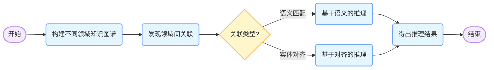

# 基于知识图谱的跨领域推理能力增强方法

> 关键词：知识图谱、跨领域推理、推理能力增强、语义理解、图神经网络

> 摘要：本文聚焦于基于知识图谱的跨领域推理能力增强方法。首先介绍了该研究的背景、目的、预期读者等信息，接着阐述了知识图谱和跨领域推理的核心概念及联系，详细讲解了相关核心算法原理和具体操作步骤，包括使用Python代码进行说明。通过数学模型和公式进一步剖析了推理机制，并给出举例。在项目实战部分，展示了开发环境搭建、源代码实现与解读。探讨了该方法在实际中的应用场景，推荐了学习资源、开发工具框架以及相关论文著作。最后总结了未来发展趋势与挑战，解答了常见问题，并提供了扩展阅读和参考资料，旨在为提升基于知识图谱的跨领域推理能力提供全面的技术指导。

## 1. 背景介绍 
### 1.1 目的和范围
随着信息时代的发展，数据量呈爆炸式增长，且分布在不同的领域。知识图谱作为一种有效的知识表示和管理方式，能够整合多源异构数据，揭示实体之间的关系。然而，现有的知识图谱在跨领域推理方面仍存在不足，无法充分挖掘不同领域知识之间的潜在联系。本研究的目的在于探索基于知识图谱的跨领域推理能力增强方法，提高知识图谱在处理跨领域问题时的推理准确性和效率。

本研究的范围涵盖了知识图谱的构建、跨领域推理算法的设计与优化、以及相关技术在实际应用场景中的验证。具体包括研究不同领域知识图谱的融合方法，开发适用于跨领域推理的模型，通过实验评估推理能力的提升效果等。

### 1.2 预期读者
本文的预期读者包括从事人工智能、知识工程、自然语言处理等领域的研究人员和开发者，以及对知识图谱和跨领域推理感兴趣的学生和爱好者。对于希望深入了解知识图谱技术，提升跨领域推理能力的专业人士，本文将提供有价值的理论和实践指导。

### 1.3 文档结构概述
本文共分为十个部分。第一部分为背景介绍，阐述了研究的目的、范围、预期读者和文档结构。第二部分介绍核心概念与联系，包括知识图谱和跨领域推理的原理和架构，并给出相应的示意图和流程图。第三部分详细讲解核心算法原理和具体操作步骤，结合Python代码进行说明。第四部分通过数学模型和公式深入剖析推理机制，并举例说明。第五部分是项目实战，包括开发环境搭建、源代码实现与解读。第六部分探讨实际应用场景。第七部分推荐学习资源、开发工具框架和相关论文著作。第八部分总结未来发展趋势与挑战。第九部分为附录，解答常见问题。第十部分提供扩展阅读和参考资料。

### 1.4 术语表
#### 1.4.1 核心术语定义
- **知识图谱**：是一种用图模型来描述知识和建模世界万物之间关联关系的技术方法。它由实体、关系和属性组成，通过节点表示实体，边表示关系，属性描述实体的特征。
- **跨领域推理**：指在不同领域的知识图谱之间进行推理，利用一个领域的知识来推断另一个领域的信息，从而发现新的知识和关系。
- **语义理解**：是指计算机对自然语言文本所表达的意义的理解，包括词汇、句法和语义层面的分析，以实现对文本的准确解读。
- **图神经网络**：是一种专门处理图结构数据的神经网络，它能够自动学习图中节点和边的特征表示，用于图的分类、节点分类和链接预测等任务。

#### 1.4.2 相关概念解释
- **本体**：是对概念化的明确规范说明，用于描述特定领域的知识结构和概念之间的关系。在知识图谱中，本体可以作为构建知识图谱的基础，定义实体、关系和属性的类型。
- **知识嵌入**：是将知识图谱中的实体和关系映射到低维向量空间的技术，通过向量表示可以方便地进行计算和推理。
- **推理规则**：是用于从已知知识推导出新的知识的规则，常见的推理规则包括逻辑规则、统计规则等。

#### 1.4.3 缩略词列表
- **KG**：Knowledge Graph，知识图谱
- **GNN**：Graph Neural Network，图神经网络
- **NLP**：Natural Language Processing，自然语言处理
- **RDF**：Resource Description Framework，资源描述框架

## 2. 核心概念与联系 

### 知识图谱原理
知识图谱是一种语义网络，它以图的形式表示知识。其基本组成元素包括实体（Entity）、关系（Relation）和属性（Attribute）。实体是现实世界中的具体事物或抽象概念，如人物、地点、事件等；关系表示实体之间的联系，如“是...的父亲”、“位于”等；属性用于描述实体的特征，如“年龄”、“性别”等。

知识图谱的构建过程通常包括数据采集、数据清洗、实体识别、关系抽取和知识融合等步骤。通过这些步骤，可以将不同来源的数据整合到一个统一的知识图谱中。

### 跨领域推理原理
跨领域推理的核心思想是利用不同领域知识图谱之间的关联，从一个领域的已知知识推导出另一个领域的未知知识。这需要解决两个关键问题：一是如何发现不同领域知识图谱之间的关联；二是如何利用这些关联进行有效的推理。

发现不同领域知识图谱之间的关联可以通过语义匹配、实体对齐等方法实现。语义匹配是指通过比较实体和关系的语义相似度，找出不同领域中具有相似含义的元素；实体对齐是指将不同领域中表示同一实体的节点进行合并。

在利用关联进行推理时，可以采用基于规则的推理、基于机器学习的推理和基于深度学习的推理等方法。基于规则的推理是根据预先定义的推理规则进行推理；基于机器学习的推理是通过训练机器学习模型来学习推理模式；基于深度学习的推理是利用深度学习模型自动学习知识图谱的特征表示，进行推理。

### 核心概念架构的文本示意图
```plaintext
              跨领域推理
                  |
                  |
        +-----------------+
        |  不同领域知识图谱  |
        +-----------------+
        |  领域A知识图谱  |  |  领域B知识图谱  |
        +-----------------+
        |  实体  |  关系  |  |  实体  |  关系  |
        +-----------------+
        |  属性  |        |  |  属性  |        |
        +-----------------+
```

### Mermaid 流程图


## 3. 核心算法原理 & 具体操作步骤 

### 基于图神经网络的跨领域推理算法原理
图神经网络（GNN）是一种强大的工具，可用于学习知识图谱的结构和特征。在跨领域推理中，我们可以使用图神经网络来捕捉不同领域知识图谱之间的关联信息。

具体来说，我们可以将不同领域的知识图谱合并成一个大图，然后使用图神经网络对这个大图进行训练。在训练过程中，图神经网络会自动学习节点和边的特征表示，从而能够更好地理解知识图谱的语义信息。

### Python源代码实现
```python
import torch
import torch.nn.functional as F
from torch_geometric.nn import GCNConv

# 定义图神经网络模型
class GNNModel(torch.nn.Module):
    def __init__(self, in_channels, hidden_channels, out_channels):
        super(GNNModel, self).__init__()
        self.conv1 = GCNConv(in_channels, hidden_channels)
        self.conv2 = GCNConv(hidden_channels, out_channels)

    def forward(self, x, edge_index):
        x = self.conv1(x, edge_index)
        x = F.relu(x)
        x = F.dropout(x, training=self.training)
        x = self.conv2(x, edge_index)
        return F.log_softmax(x, dim=1)

# 示例数据
# 节点特征
x = torch.randn(10, 16)
# 边索引
edge_index = torch.tensor([[0, 1, 1, 2], [1, 0, 2, 1]], dtype=torch.long)
# 标签
y = torch.tensor([0, 1, 0, 1, 0, 1, 0, 1, 0, 1], dtype=torch.long)

# 初始化模型
model = GNNModel(in_channels=16, hidden_channels=32, out_channels=2)
# 定义优化器
optimizer = torch.optim.Adam(model.parameters(), lr=0.01)

# 训练模型
for epoch in range(200):
    optimizer.zero_grad()
    out = model(x, edge_index)
    loss = F.nll_loss(out, y)
    loss.backward()
    optimizer.step()

    if epoch % 10 == 0:
        print(f'Epoch: {epoch}, Loss: {loss.item()}')
```

### 具体操作步骤
1. **数据准备**：收集不同领域的知识图谱数据，并将其转换为适合图神经网络处理的格式。这包括节点特征矩阵和边索引矩阵。
2. **模型定义**：定义图神经网络模型，确定输入层、隐藏层和输出层的维度。
3. **模型训练**：使用训练数据对模型进行训练，通过优化损失函数来更新模型的参数。
4. **推理过程**：使用训练好的模型对新的输入数据进行推理，得到推理结果。

## 4. 数学模型和公式 & 详细讲解 & 举例说明 

### 图神经网络的数学模型
图神经网络的核心是消息传递机制，它通过节点之间的消息传递来更新节点的特征表示。具体来说，对于图中的每个节点 $v$，其在第 $l+1$ 层的特征表示 $h_v^{(l+1)}$ 可以通过以下公式计算：

$$
h_v^{(l+1)} = \sigma\left(W^{(l)} \cdot \text{AGGREGATE}^{(l)}\left(\{h_u^{(l)}: u \in \mathcal{N}(v)\}\right) + b^{(l)}\right)
$$

其中，$\sigma$ 是激活函数，$W^{(l)}$ 是第 $l$ 层的权重矩阵，$b^{(l)}$ 是第 $l$ 层的偏置向量，$\text{AGGREGATE}^{(l)}$ 是聚合函数，用于聚合节点 $v$ 的邻居节点的特征表示，$\mathcal{N}(v)$ 是节点 $v$ 的邻居节点集合。

### 详细讲解
- **激活函数**：常用的激活函数包括 ReLU、Sigmoid 和 Tanh 等。激活函数的作用是引入非线性因素，使模型能够学习到更复杂的特征表示。
- **权重矩阵和偏置向量**：权重矩阵和偏置向量是模型的可学习参数，通过训练过程来优化这些参数，使模型能够更好地拟合数据。
- **聚合函数**：常见的聚合函数包括求和、均值和最大值等。聚合函数的作用是将节点的邻居节点的特征表示进行聚合，得到节点的综合特征表示。

### 举例说明
假设我们有一个简单的图，包含 3 个节点和 2 条边。节点的初始特征表示为 $h_1^{(0)} = [1, 2]^T$，$h_2^{(0)} = [3, 4]^T$，$h_3^{(0)} = [5, 6]^T$。边的连接关系为 $(1, 2)$ 和 $(2, 3)$。

我们使用求和聚合函数，激活函数为 ReLU，权重矩阵 $W^{(0)} = \begin{bmatrix} 0.1 & 0.2 \\ 0.3 & 0.4 \end{bmatrix}$，偏置向量 $b^{(0)} = [0.1, 0.2]^T$。

对于节点 1，其邻居节点为 2，节点 1 在第 1 层的特征表示计算如下：

$$
\begin{align*}
\text{AGGREGATE}^{(0)}\left(\{h_2^{(0)}\}\right) &= h_2^{(0)} = [3, 4]^T \\
W^{(0)} \cdot \text{AGGREGATE}^{(0)}\left(\{h_2^{(0)}\}\right) + b^{(0)} &= \begin{bmatrix} 0.1 & 0.2 \\ 0.3 & 0.4 \end{bmatrix} \cdot \begin{bmatrix} 3 \\ 4 \end{bmatrix} + \begin{bmatrix} 0.1 \\ 0.2 \end{bmatrix} \\
&= \begin{bmatrix} 0.1 \times 3 + 0.2 \times 4 \\ 0.3 \times 3 + 0.4 \times 4 \end{bmatrix} + \begin{bmatrix} 0.1 \\ 0.2 \end{bmatrix} \\
&= \begin{bmatrix} 1.1 \\ 2.5 \end{bmatrix} + \begin{bmatrix} 0.1 \\ 0.2 \end{bmatrix} \\
&= \begin{bmatrix} 1.2 \\ 2.7 \end{bmatrix} \\
h_1^{(1)} &= \text{ReLU}\left(\begin{bmatrix} 1.2 \\ 2.7 \end{bmatrix}\right) = \begin{bmatrix} 1.2 \\ 2.7 \end{bmatrix}
\end{align*}
$$

同理，可以计算出节点 2 和节点 3 在第 1 层的特征表示。

## 5. 项目实战：代码实际案例和详细解释说明 

### 5.1  开发环境搭建
#### 安装Python
首先，确保你已经安装了 Python 3.6 或更高版本。可以从 Python 官方网站（https://www.python.org/downloads/）下载并安装。

#### 安装依赖库
使用以下命令安装所需的依赖库：
```sh
pip install torch torch_geometric
```

### 5.2  源代码详细实现和代码解读
```python
import torch
import torch.nn.functional as F
from torch_geometric.nn import GCNConv

# 定义图神经网络模型
class GNNModel(torch.nn.Module):
    def __init__(self, in_channels, hidden_channels, out_channels):
        super(GNNModel, self).__init__()
        # 定义第一层图卷积层
        self.conv1 = GCNConv(in_channels, hidden_channels)
        # 定义第二层图卷积层
        self.conv2 = GCNConv(hidden_channels, out_channels)

    def forward(self, x, edge_index):
        # 通过第一层图卷积层
        x = self.conv1(x, edge_index)
        # 使用 ReLU 激活函数
        x = F.relu(x)
        # 应用 dropout 防止过拟合
        x = F.dropout(x, training=self.training)
        # 通过第二层图卷积层
        x = self.conv2(x, edge_index)
        # 使用 log_softmax 函数进行分类
        return F.log_softmax(x, dim=1)

# 示例数据
# 节点特征矩阵，包含 10 个节点，每个节点有 16 个特征
x = torch.randn(10, 16)
# 边索引矩阵，定义了图的边连接关系
edge_index = torch.tensor([[0, 1, 1, 2], [1, 0, 2, 1]], dtype=torch.long)
# 节点标签，用于训练模型
y = torch.tensor([0, 1, 0, 1, 0, 1, 0, 1, 0, 1], dtype=torch.long)

# 初始化模型
model = GNNModel(in_channels=16, hidden_channels=32, out_channels=2)
# 定义优化器，使用 Adam 优化器
optimizer = torch.optim.Adam(model.parameters(), lr=0.01)

# 训练模型
for epoch in range(200):
    # 清零梯度
    optimizer.zero_grad()
    # 前向传播
    out = model(x, edge_index)
    # 计算损失函数
    loss = F.nll_loss(out, y)
    # 反向传播
    loss.backward()
    # 更新模型参数
    optimizer.step()

    if epoch % 10 == 0:
        print(f'Epoch: {epoch}, Loss: {loss.item()}')
```

### 5.3  代码解读与分析
- **模型定义**：`GNNModel` 类继承自 `torch.nn.Module`，定义了一个两层的图神经网络模型。第一层图卷积层将输入特征映射到隐藏层，第二层图卷积层将隐藏层特征映射到输出层。
- **前向传播**：在 `forward` 方法中，通过两层图卷积层和 ReLU 激活函数进行特征变换，最后使用 `log_softmax` 函数进行分类。
- **数据准备**：`x` 是节点特征矩阵，`edge_index` 是边索引矩阵，`y` 是节点标签。
- **模型训练**：使用 Adam 优化器进行模型训练，通过迭代更新模型参数，使损失函数最小化。

## 6. 实际应用场景 
### 智能医疗
在智能医疗领域，知识图谱可以整合医学文献、临床数据、基因数据等多源信息。通过跨领域推理能力增强方法，可以利用药物研发领域的知识来推断疾病治疗方案，或者根据患者的基因信息和临床症状预测疾病的发展趋势。例如，结合药物化学知识图谱和临床医学知识图谱，推理出针对特定基因突变的新型药物治疗方案。

### 金融风险评估
金融领域涉及多个领域的知识，如宏观经济、行业动态、企业财务等。基于知识图谱的跨领域推理可以帮助金融机构更好地评估风险。例如，通过整合宏观经济数据、行业竞争态势和企业财务报表等知识图谱，推断企业的信用风险和市场风险，为投资决策提供支持。

### 智能交通
在智能交通领域，知识图谱可以整合交通流量数据、地理信息、气象数据等。跨领域推理能力增强方法可以利用气象领域的知识来预测交通拥堵情况，或者根据交通流量和地理信息优化交通路线规划。例如，结合气象知识图谱和交通流量知识图谱，提前预测恶劣天气下的交通拥堵热点区域，为交通管理部门提供决策依据。

## 7. 工具和资源推荐
### 7.1 学习资源推荐
#### 7.1.1 书籍推荐
- 《知识图谱：方法、实践与应用》：全面介绍了知识图谱的理论、方法和应用案例，适合初学者和专业人士阅读。
- 《图神经网络：基础、前沿与应用》：详细讲解了图神经网络的原理、算法和应用，对于深入理解基于图神经网络的跨领域推理方法有很大帮助。

#### 7.1.2 在线课程
- Coursera 上的“Knowledge Graphs”课程：由知名学者授课，系统介绍了知识图谱的构建、推理和应用。
- edX 上的“Graph Neural Networks for Machine Learning”课程：专注于图神经网络的理论和实践，提供了丰富的编程案例。

#### 7.1.3 技术博客和网站
- AI科技评论：提供了大量关于人工智能、知识图谱等领域的最新技术文章和评论。
- 机器之心：专注于人工智能技术的报道和分析，有很多关于知识图谱和跨领域推理的深度文章。

### 7.2 开发工具框架推荐
#### 7.2.1 IDE和编辑器
- PyCharm：是一款功能强大的 Python 集成开发环境，提供了代码编辑、调试、版本控制等功能，适合开发基于 Python 的知识图谱和图神经网络项目。
- Jupyter Notebook：是一个交互式的编程环境，支持代码、文本、图像等多种格式的展示，方便进行数据分析和模型实验。

#### 7.2.2 调试和性能分析工具
- TensorBoard：是 TensorFlow 提供的可视化工具，可以用于监控模型训练过程中的损失函数、准确率等指标，以及可视化模型的结构和参数。
- PyTorch Profiler：是 PyTorch 提供的性能分析工具，可以帮助开发者找出代码中的性能瓶颈，优化代码性能。

#### 7.2.3 相关框架和库
- PyTorch Geometric：是一个基于 PyTorch 的图神经网络库，提供了丰富的图神经网络模型和工具，方便开发者进行图数据的处理和分析。
- RDFLib：是一个用于处理 RDF 数据的 Python 库，支持 RDF 数据的解析、存储和查询，对于知识图谱的构建和管理非常有用。

### 7.3 相关论文著作推荐
#### 7.3.1 经典论文
- “TransE: Translating Embeddings for Modeling Multi-relational Data”：提出了 TransE 模型，用于将知识图谱中的实体和关系嵌入到低维向量空间，为知识图谱的表示学习奠定了基础。
- “Graph Convolutional Networks for Semi-Supervised Classification”：介绍了图卷积网络（GCN）的基本原理和算法，为图神经网络在知识图谱推理中的应用提供了重要思路。

#### 7.3.2 最新研究成果
- “Knowledge Graph Embedding with Iterative Guidance from Soft Rules”：提出了一种基于软规则的知识图谱嵌入方法，通过迭代引导的方式提高了知识图谱的推理能力。
- “Cross-Domain Knowledge Graph Alignment via Graph Convolutional Networks”：研究了跨领域知识图谱对齐问题，利用图卷积网络实现了不同领域知识图谱之间的实体对齐。

#### 7.3.3 应用案例分析
- “Applying Knowledge Graphs in Healthcare: A Systematic Review”：对知识图谱在医疗领域的应用进行了系统综述，分析了知识图谱在医疗数据整合、疾病诊断、药物研发等方面的应用案例和效果。
- “Knowledge Graphs for Financial Risk Assessment: A Survey”：探讨了知识图谱在金融风险评估中的应用，介绍了知识图谱在信用风险评估、市场风险预测等方面的应用案例和方法。

## 8. 总结：未来发展趋势与挑战
### 未来发展趋势
- **多模态知识图谱融合**：未来的知识图谱将不仅包含文本信息，还将融合图像、音频、视频等多模态信息。通过跨领域推理能力增强方法，可以更好地挖掘多模态知识之间的潜在联系，提高知识图谱的表达能力和推理能力。
- **与深度学习的深度融合**：深度学习技术在图像识别、自然语言处理等领域取得了巨大成功。未来，知识图谱将与深度学习技术深度融合，利用深度学习模型自动学习知识图谱的特征表示，提高跨领域推理的准确性和效率。
- **知识图谱的动态更新和演化**：随着时间的推移，知识是不断更新和演化的。未来的知识图谱需要具备动态更新和演化的能力，能够实时捕捉新知识，更新知识图谱的结构和内容。通过跨领域推理能力增强方法，可以更好地处理知识图谱的动态变化，提高推理的时效性。

### 挑战
- **数据质量和一致性问题**：不同领域的数据来源广泛，数据质量和一致性难以保证。在构建知识图谱和进行跨领域推理时，需要解决数据噪声、数据缺失、数据冲突等问题，以确保推理结果的准确性。
- **语义理解和对齐难题**：不同领域的知识具有不同的语义表达和概念体系，如何实现不同领域知识的语义理解和对齐是一个挑战。需要研究更加有效的语义匹配和实体对齐方法，提高跨领域推理的效果。
- **计算资源和效率要求**：随着知识图谱规模的不断增大，跨领域推理的计算复杂度也会相应增加。如何在有限的计算资源下提高推理效率，是需要解决的问题之一。需要研究高效的推理算法和优化技术，降低计算成本。

## 9. 附录：常见问题与解答
### 问题 1：知识图谱和传统数据库有什么区别？
知识图谱是以图的形式表示知识，强调实体之间的关系和语义信息，能够更好地支持推理和知识发现。而传统数据库主要以表格的形式存储数据，侧重于数据的存储和查询，缺乏对知识的语义表达和推理能力。

### 问题 2：跨领域推理一定能得到准确的结果吗？
跨领域推理的准确性受到多种因素的影响，如数据质量、语义理解的准确性、推理算法的有效性等。虽然跨领域推理可以发现新的知识和关系，但不能保证推理结果一定准确。在实际应用中，需要对推理结果进行验证和评估。

### 问题 3：如何选择合适的图神经网络模型进行跨领域推理？
选择合适的图神经网络模型需要考虑多个因素，如数据的特点、推理任务的要求、计算资源的限制等。不同的图神经网络模型具有不同的特点和适用场景，例如，GCN 适用于处理静态图数据，而 GraphSAGE 适用于处理动态图数据。可以通过实验比较不同模型的性能，选择最适合的模型。

## 10. 扩展阅读 & 参考资料
### 扩展阅读
- 《人工智能：现代方法》：全面介绍了人工智能的基本概念、算法和应用，对于深入理解知识图谱和跨领域推理的背景和原理有很大帮助。
- 《自然语言处理入门》：详细讲解了自然语言处理的基本技术和方法，对于处理知识图谱中的文本信息和语义理解有重要参考价值。

### 参考资料
- 相关学术论文：在学术数据库（如 IEEE Xplore、ACM Digital Library 等）中搜索关于知识图谱、跨领域推理、图神经网络等方面的最新研究成果。
- 开源项目：在 GitHub 等代码托管平台上查找相关的开源项目，学习他人的代码实现和经验。

作者：AI天才研究院/AI Genius Institute & 禅与计算机程序设计艺术 /Zen And The Art of Computer Programming