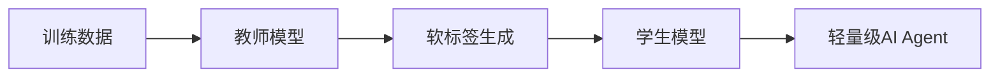

# 基于知识蒸馏的轻量级AI Agent

> 关键词：知识蒸馏、轻量级AI Agent、模型压缩、人工智能、强化学习

> 摘要：本文围绕基于知识蒸馏的轻量级AI Agent展开深入探讨。首先介绍了知识蒸馏和轻量级AI Agent的背景知识，明确研究目的和适用范围。接着阐述了核心概念及它们之间的联系，详细讲解了核心算法原理和具体操作步骤，并给出Python代码示例。同时，对相关数学模型和公式进行推导与举例说明。通过项目实战，展示了开发环境搭建、源代码实现与解读。还探讨了该技术的实际应用场景，推荐了学习资源、开发工具框架和相关论文著作。最后总结了未来发展趋势与挑战，并对常见问题进行解答，提供扩展阅读和参考资料，旨在为读者全面呈现基于知识蒸馏构建轻量级AI Agent的技术全貌。

## 1. 背景介绍 
### 1.1 目的和范围
随着人工智能技术的飞速发展，AI Agent在各个领域得到了广泛应用。然而，传统的AI Agent模型往往具有较大的规模和较高的计算复杂度，这使得它们在资源受限的设备上难以部署，如移动设备、物联网终端等。知识蒸馏作为一种有效的模型压缩技术，可以将大型教师模型的知识迁移到小型学生模型中，从而构建轻量级的AI Agent。本文的目的在于深入研究基于知识蒸馏的轻量级AI Agent的原理、算法和应用，探讨如何利用知识蒸馏技术降低AI Agent的计算成本和存储需求，同时保持较高的性能。研究范围涵盖了知识蒸馏的基本原理、轻量级AI Agent的架构设计、核心算法的实现以及实际应用场景的分析。

### 1.2 预期读者
本文预期读者包括人工智能领域的研究人员、开发者、学生以及对AI Agent和模型压缩技术感兴趣的技术爱好者。对于研究人员，本文可以为他们提供新的研究思路和方向；对于开发者，本文详细的代码实现和项目实战部分可以帮助他们在实际项目中应用基于知识蒸馏的轻量级AI Agent技术；对于学生，本文系统的知识讲解和丰富的案例可以帮助他们深入理解相关概念和技术；对于技术爱好者，本文通俗易懂的语言和生动的示例可以让他们对这一前沿技术有初步的了解。

### 1.3 文档结构概述
本文共分为十个部分。第一部分为背景介绍，阐述了研究的目的和范围、预期读者以及文档的结构概述，并给出了相关术语的定义和解释。第二部分介绍核心概念与联系，包括知识蒸馏和轻量级AI Agent的原理和架构，并通过文本示意图和Mermaid流程图进行直观展示。第三部分详细讲解核心算法原理和具体操作步骤，同时给出Python源代码示例。第四部分对相关数学模型和公式进行推导和详细讲解，并通过具体例子进行说明。第五部分是项目实战，包括开发环境搭建、源代码详细实现和代码解读。第六部分探讨实际应用场景。第七部分推荐学习资源、开发工具框架和相关论文著作。第八部分总结未来发展趋势与挑战。第九部分为附录，解答常见问题。第十部分提供扩展阅读和参考资料。

### 1.4 术语表
#### 1.4.1 核心术语定义
- **知识蒸馏（Knowledge Distillation）**：一种模型压缩技术，通过让小型学生模型学习大型教师模型的输出，将教师模型的知识迁移到学生模型中，从而使学生模型在保持较小规模的同时具有较好的性能。
- **轻量级AI Agent**：指具有较小计算成本和存储需求的人工智能代理，能够在资源受限的设备上高效运行，完成特定的任务。
- **教师模型（Teacher Model）**：在知识蒸馏中，通常是一个大型、复杂且性能较好的模型，用于为学生模型提供知识指导。
- **学生模型（Student Model）**：在知识蒸馏中，是一个小型、简单的模型，通过学习教师模型的输出，来提升自身的性能。

#### 1.4.2 相关概念解释
- **模型压缩**：通过各种技术手段减少模型的参数数量和计算复杂度，从而降低模型的存储需求和计算成本，使模型能够在资源受限的设备上运行。常见的模型压缩技术包括知识蒸馏、剪枝、量化等。
- **强化学习**：一种机器学习范式，智能体通过与环境进行交互，根据环境反馈的奖励信号来学习最优的行为策略。在AI Agent的设计中，强化学习经常被用于训练智能体以完成特定的任务。

#### 1.4.3 缩略词列表
- **AI**：Artificial Intelligence，人工智能
- **RL**：Reinforcement Learning，强化学习
- **KD**：Knowledge Distillation，知识蒸馏

## 2. 核心概念与联系 

### 知识蒸馏原理
知识蒸馏的核心思想是让学生模型学习教师模型的输出，而不仅仅是学习训练数据的标签。教师模型通常是一个大型、复杂且性能较好的模型，它在训练数据上已经学习到了丰富的知识。学生模型则是一个小型、简单的模型，通过模仿教师模型的输出，学生模型可以在较小的规模下学习到教师模型的知识，从而提升自身的性能。

具体来说，知识蒸馏的过程可以分为以下几个步骤：
1. **训练教师模型**：使用大量的训练数据对教师模型进行训练，使其在训练数据上达到较好的性能。
2. **生成软标签**：将训练数据输入到教师模型中，得到教师模型的输出，这些输出可以作为软标签。软标签包含了更多的信息，例如类别之间的相对概率，而不仅仅是一个硬标签（即一个类别）。
3. **训练学生模型**：使用训练数据和软标签对学生模型进行训练。在训练过程中，学生模型的目标是最小化其输出与软标签之间的差异。

### 轻量级AI Agent架构
轻量级AI Agent通常由感知模块、决策模块和执行模块组成。感知模块用于获取环境信息，决策模块根据感知模块提供的信息做出决策，执行模块根据决策模块的输出执行相应的动作。在基于知识蒸馏的轻量级AI Agent中，决策模块通常采用学生模型，通过知识蒸馏技术，学生模型可以在较小的规模下学习到教师模型的决策能力，从而实现轻量级的决策。

### 核心概念联系
知识蒸馏和轻量级AI Agent之间存在着紧密的联系。知识蒸馏为构建轻量级AI Agent提供了一种有效的方法，通过将教师模型的知识迁移到学生模型中，可以在不损失太多性能的情况下，显著降低AI Agent的计算成本和存储需求。同时，轻量级AI Agent的应用场景也为知识蒸馏技术提供了广阔的发展空间，例如在资源受限的设备上部署AI Agent时，知识蒸馏技术可以帮助实现高效的模型压缩。

### 文本示意图
```plaintext
                +-----------------+
                |  训练数据       |
                +-----------------+
                        |
                        v
                +-----------------+
                |  教师模型       |
                +-----------------+
                        |
                        v
                +-----------------+
                |  软标签生成     |
                +-----------------+
                        |
                        v
                +-----------------+
                |  学生模型       |
                +-----------------+
                        |
                        v
                +-----------------+
                |  轻量级AI Agent |
                +-----------------+
```

### Mermaid流程图


## 3. 核心算法原理 & 具体操作步骤 

### 知识蒸馏算法原理
知识蒸馏的核心算法可以通过最小化学生模型的输出与教师模型的软标签之间的损失函数来实现。常用的损失函数包括交叉熵损失函数。假设教师模型的输出为 $T$，学生模型的输出为 $S$，则知识蒸馏的损失函数可以表示为：

$$L_{KD} = \alpha \cdot \text{CE}(S, T) + (1 - \alpha) \cdot \text{CE}(S, y)$$

其中，$\text{CE}$ 表示交叉熵损失函数，$y$ 表示训练数据的真实标签，$\alpha$ 是一个超参数，用于平衡软标签损失和真实标签损失。

### 具体操作步骤
1. **初始化教师模型和学生模型**：选择合适的教师模型和学生模型架构，并初始化它们的参数。
2. **训练教师模型**：使用训练数据对教师模型进行训练，直到教师模型在验证集上达到较好的性能。
3. **生成软标签**：将训练数据输入到教师模型中，得到教师模型的输出，作为软标签。
4. **训练学生模型**：使用训练数据、软标签和真实标签对学生模型进行训练，最小化知识蒸馏的损失函数 $L_{KD}$。
5. **评估学生模型**：使用测试数据对训练好的学生模型进行评估，检查其性能是否满足要求。

### Python源代码示例
```python
import torch
import torch.nn as nn
import torch.optim as optim

# 定义教师模型
class TeacherModel(nn.Module):
    def __init__(self):
        super(TeacherModel, self).__init__()
        self.fc1 = nn.Linear(10, 20)
        self.fc2 = nn.Linear(20, 5)

    def forward(self, x):
        x = torch.relu(self.fc1(x))
        x = self.fc2(x)
        return x

# 定义学生模型
class StudentModel(nn.Module):
    def __init__(self):
        super(StudentModel, self).__init__()
        self.fc1 = nn.Linear(10, 10)
        self.fc2 = nn.Linear(10, 5)

    def forward(self, x):
        x = torch.relu(self.fc1(x))
        x = self.fc2(x)
        return x

# 初始化模型
teacher_model = TeacherModel()
student_model = StudentModel()

# 定义损失函数和优化器
criterion = nn.CrossEntropyLoss()
optimizer = optim.Adam(student_model.parameters(), lr=0.001)

# 训练教师模型（这里简化，假设已经训练好）
#...

# 生成软标签
def generate_soft_labels(teacher_model, data):
    with torch.no_grad():
        soft_labels = teacher_model(data)
    return soft_labels

# 训练学生模型
def train_student_model(student_model, teacher_model, data, labels, alpha=0.5, epochs=10):
    for epoch in range(epochs):
        soft_labels = generate_soft_labels(teacher_model, data)
        optimizer.zero_grad()
        outputs = student_model(data)
        loss_soft = criterion(outputs, soft_labels)
        loss_hard = criterion(outputs, labels)
        loss = alpha * loss_soft + (1 - alpha) * loss_hard
        loss.backward()
        optimizer.step()
        print(f'Epoch {epoch+1}/{epochs}, Loss: {loss.item()}')

# 示例数据
data = torch.randn(100, 10)
labels = torch.randint(0, 5, (100,))

# 训练学生模型
train_student_model(student_model, teacher_model, data, labels)
```

## 4. 数学模型和公式 & 详细讲解 & 举例说明 

### 交叉熵损失函数
交叉熵损失函数是知识蒸馏中常用的损失函数之一，用于衡量两个概率分布之间的差异。假设 $p$ 是真实概率分布，$q$ 是预测概率分布，则交叉熵损失函数可以表示为：

$$H(p, q) = - \sum_{i} p_i \log(q_i)$$

在知识蒸馏中，教师模型的输出 $T$ 和学生模型的输出 $S$ 都可以看作是概率分布，因此可以使用交叉熵损失函数来衡量它们之间的差异。

### 知识蒸馏损失函数详细推导
知识蒸馏的损失函数 $L_{KD}$ 由两部分组成：软标签损失和真实标签损失。软标签损失用于衡量学生模型的输出与教师模型的软标签之间的差异，真实标签损失用于衡量学生模型的输出与训练数据的真实标签之间的差异。具体推导如下：

- **软标签损失**：假设教师模型的输出为 $T$，学生模型的输出为 $S$，则软标签损失可以表示为：

$$L_{soft} = \text{CE}(S, T) = - \sum_{i} T_i \log(S_i)$$

- **真实标签损失**：假设训练数据的真实标签为 $y$，学生模型的输出为 $S$，则真实标签损失可以表示为：

$$L_{hard} = \text{CE}(S, y) = - \sum_{i} y_i \log(S_i)$$

- **知识蒸馏损失函数**：将软标签损失和真实标签损失加权求和，得到知识蒸馏的损失函数：

$$L_{KD} = \alpha \cdot L_{soft} + (1 - \alpha) \cdot L_{hard} = \alpha \cdot \text{CE}(S, T) + (1 - \alpha) \cdot \text{CE}(S, y)$$

其中，$\alpha$ 是一个超参数，用于平衡软标签损失和真实标签损失。

### 举例说明
假设我们有一个二分类问题，训练数据的真实标签为 $y = [1, 0]$，教师模型的输出为 $T = [0.8, 0.2]$，学生模型的输出为 $S = [0.7, 0.3]$，$\alpha = 0.5$。则软标签损失、真实标签损失和知识蒸馏损失函数的计算如下：

- **软标签损失**：

$$L_{soft} = - (0.8 \log(0.7) + 0.2 \log(0.3)) \approx 0.26$$

- **真实标签损失**：

$$L_{hard} = - (1 \log(0.7) + 0 \log(0.3)) \approx 0.36$$

- **知识蒸馏损失函数**：

$$L_{KD} = 0.5 \times 0.26 + 0.5 \times 0.36 = 0.31$$

## 5. 项目实战：代码实际案例和详细解释说明 

### 5.1  开发环境搭建
- **操作系统**：推荐使用Linux系统，如Ubuntu 18.04及以上版本。
- **Python环境**：使用Python 3.7及以上版本。可以使用Anaconda来管理Python环境，具体安装步骤如下：
  1. 从Anaconda官网下载适合自己操作系统的Anaconda安装包。
  2. 运行安装包，按照提示进行安装。
  3. 创建一个新的Python环境：

```bash
conda create -n knowledge_distillation python=3.8
conda activate knowledge_distillation
```

- **深度学习框架**：使用PyTorch作为深度学习框架，安装命令如下：

```bash
pip install torch torchvision
```

### 5.2  源代码详细实现和代码解读
#### 数据集准备
我们使用一个简单的手写数字识别数据集MNIST来进行实验。PyTorch提供了方便的数据集加载工具，代码如下：

```python
import torch
import torchvision
import torchvision.transforms as transforms

# 定义数据预处理
transform = transforms.Compose([
    transforms.ToTensor(),
    transforms.Normalize((0.5,), (0.5,))
])

# 加载训练集和测试集
trainset = torchvision.datasets.MNIST(root='./data', train=True,
                                      download=True, transform=transform)
trainloader = torch.utils.data.DataLoader(trainset, batch_size=64,
                                          shuffle=True)

testset = torchvision.datasets.MNIST(root='./data', train=False,
                                     download=True, transform=transform)
testloader = torch.utils.data.DataLoader(testset, batch_size=64,
                                         shuffle=False)
```

#### 定义教师模型和学生模型
教师模型使用一个简单的卷积神经网络（CNN），学生模型使用一个较浅的CNN。代码如下：

```python
import torch.nn as nn
import torch.nn.functional as F

# 定义教师模型
class TeacherCNN(nn.Module):
    def __init__(self):
        super(TeacherCNN, self).__init__()
        self.conv1 = nn.Conv2d(1, 32, kernel_size=3, padding=1)
        self.conv2 = nn.Conv2d(32, 64, kernel_size=3, padding=1)
        self.pool = nn.MaxPool2d(2, 2)
        self.fc1 = nn.Linear(64 * 7 * 7, 128)
        self.fc2 = nn.Linear(128, 10)

    def forward(self, x):
        x = self.pool(F.relu(self.conv1(x)))
        x = self.pool(F.relu(self.conv2(x)))
        x = x.view(-1, 64 * 7 * 7)
        x = F.relu(self.fc1(x))
        x = self.fc2(x)
        return x

# 定义学生模型
class StudentCNN(nn.Module):
    def __init__(self):
        super(StudentCNN, self).__init__()
        self.conv1 = nn.Conv2d(1, 16, kernel_size=3, padding=1)
        self.pool = nn.MaxPool2d(2, 2)
        self.fc1 = nn.Linear(16 * 7 * 7, 64)
        self.fc2 = nn.Linear(64, 10)

    def forward(self, x):
        x = self.pool(F.relu(self.conv1(x)))
        x = self.pool(x)
        x = x.view(-1, 16 * 7 * 7)
        x = F.relu(self.fc1(x))
        x = self.fc2(x)
        return x
```

#### 训练教师模型
```python
import torch.optim as optim

# 初始化教师模型
teacher_model = TeacherCNN()

# 定义损失函数和优化器
criterion = nn.CrossEntropyLoss()
optimizer = optim.Adam(teacher_model.parameters(), lr=0.001)

# 训练教师模型
epochs = 10
for epoch in range(epochs):
    running_loss = 0.0
    for i, data in enumerate(trainloader, 0):
        inputs, labels = data
        optimizer.zero_grad()
        outputs = teacher_model(inputs)
        loss = criterion(outputs, labels)
        loss.backward()
        optimizer.step()
        running_loss += loss.item()
    print(f'Epoch {epoch+1}/{epochs}, Loss: {running_loss / len(trainloader)}')

# 保存教师模型
torch.save(teacher_model.state_dict(), 'teacher_model.pth')
```

#### 知识蒸馏训练学生模型
```python
# 初始化学生模型
student_model = StudentCNN()

# 加载教师模型
teacher_model = TeacherCNN()
teacher_model.load_state_dict(torch.load('teacher_model.pth'))
teacher_model.eval()

# 定义损失函数和优化器
criterion = nn.CrossEntropyLoss()
optimizer = optim.Adam(student_model.parameters(), lr=0.001)

# 知识蒸馏训练学生模型
alpha = 0.5
epochs = 10
for epoch in range(epochs):
    running_loss = 0.0
    for i, data in enumerate(trainloader, 0):
        inputs, labels = data
        optimizer.zero_grad()

        # 生成软标签
        with torch.no_grad():
            soft_labels = teacher_model(inputs)

        # 学生模型输出
        outputs = student_model(inputs)

        # 计算软标签损失和真实标签损失
        loss_soft = criterion(outputs, soft_labels)
        loss_hard = criterion(outputs, labels)

        # 计算知识蒸馏损失
        loss = alpha * loss_soft + (1 - alpha) * loss_hard

        # 反向传播和优化
        loss.backward()
        optimizer.step()

        running_loss += loss.item()
    print(f'Epoch {epoch+1}/{epochs}, Loss: {running_loss / len(trainloader)}')

# 保存学生模型
torch.save(student_model.state_dict(), 'student_model.pth')
```

### 5.3  代码解读与分析
- **数据集准备**：使用`torchvision.datasets.MNIST`加载MNIST数据集，并使用`torch.utils.data.DataLoader`创建数据加载器，方便批量加载数据。
- **教师模型和学生模型定义**：教师模型使用两个卷积层和两个全连接层，学生模型使用一个卷积层和两个全连接层，学生模型的参数数量明显少于教师模型。
- **训练教师模型**：使用交叉熵损失函数和Adam优化器对教师模型进行训练，训练10个epoch。
- **知识蒸馏训练学生模型**：在训练学生模型时，首先加载训练好的教师模型，然后使用教师模型生成软标签。在计算损失时，将软标签损失和真实标签损失加权求和，得到知识蒸馏损失。通过这种方式，学生模型可以学习到教师模型的知识，从而在较小的规模下达到较好的性能。

## 6. 实际应用场景 
### 移动设备应用
在移动设备上，由于计算资源和存储容量有限，传统的大型AI模型难以部署。基于知识蒸馏的轻量级AI Agent可以在保证一定性能的前提下，显著降低模型的计算成本和存储需求，从而在移动设备上实现高效的智能应用，如语音识别、图像分类、目标检测等。

### 物联网设备应用
物联网设备通常具有较低的计算能力和有限的电池续航能力。轻量级AI Agent可以在物联网设备上实时处理传感器数据，进行智能决策，如智能家居中的设备控制、工业物联网中的故障预测等。

### 边缘计算应用
边缘计算是指在靠近数据源的边缘节点上进行数据处理和分析，以减少数据传输延迟和带宽需求。基于知识蒸馏的轻量级AI Agent可以部署在边缘节点上，实现实时的智能推理，如智能交通系统中的车辆检测和交通流量预测、智能安防系统中的人员识别和行为分析等。

### 实时决策系统
在一些需要实时决策的场景中，如金融交易、自动驾驶等，传统的大型AI模型由于计算复杂度高，难以满足实时性要求。轻量级AI Agent可以在短时间内做出决策，同时保持较高的准确性，从而提高系统的实时性能和可靠性。

## 7. 工具和资源推荐
### 7.1 学习资源推荐
#### 7.1.1 书籍推荐
- 《深度学习》（Deep Learning）：由Ian Goodfellow、Yoshua Bengio和Aaron Courville所著，是深度学习领域的经典教材，全面介绍了深度学习的基本概念、算法和应用。
- 《动手学深度学习》（Dive into Deep Learning）：由李沐等人所著，提供了丰富的代码示例和实践项目，适合初学者快速上手深度学习。
- 《强化学习：原理与Python实现》：介绍了强化学习的基本原理和算法，并使用Python实现了多个强化学习案例，对于理解AI Agent的决策机制有很大帮助。

#### 7.1.2 在线课程
- Coursera上的“深度学习专项课程”（Deep Learning Specialization）：由Andrew Ng教授授课，涵盖了深度学习的各个方面，包括神经网络、卷积神经网络、循环神经网络等。
- edX上的“强化学习基础”（Foundations of Reinforcement Learning）：介绍了强化学习的基本概念、算法和应用，适合对强化学习感兴趣的学习者。
- 哔哩哔哩上的“PyTorch深度学习快速入门教程”：由吴恩达团队制作，通过实际案例介绍了如何使用PyTorch进行深度学习模型的开发和训练。

#### 7.1.3 技术博客和网站
- Medium：上面有很多关于人工智能、深度学习和知识蒸馏的技术文章，作者来自世界各地的研究人员和开发者。
- arXiv：是一个预印本服务器，提供了大量的学术论文，包括知识蒸馏和轻量级AI Agent的最新研究成果。
- AI研习社：专注于人工智能领域的技术分享和交流，提供了丰富的技术文章、教程和案例。

### 7.2 开发工具框架推荐
#### 7.2.1 IDE和编辑器
- PyCharm：是一款专门为Python开发设计的集成开发环境，提供了丰富的代码编辑、调试和分析功能，适合开发基于Python的深度学习项目。
- Jupyter Notebook：是一个交互式的开发环境，可以将代码、文本、图表等整合在一起，方便进行数据探索和模型实验。
- Visual Studio Code：是一款轻量级的代码编辑器，支持多种编程语言和插件，具有丰富的扩展功能，适合快速开发和调试代码。

#### 7.2.2 调试和性能分析工具
- PyTorch Profiler：是PyTorch提供的性能分析工具，可以帮助开发者分析模型的计算时间、内存使用情况等，找出性能瓶颈。
- TensorBoard：是TensorFlow提供的可视化工具，也可以与PyTorch集成，用于可视化模型的训练过程、损失曲线、准确率等指标。
- cProfile：是Python内置的性能分析工具，可以帮助开发者分析代码的运行时间和函数调用情况。

#### 7.2.3 相关框架和库
- PyTorch：是一个开源的深度学习框架，提供了丰富的神经网络层、优化器和损失函数，支持GPU加速，方便开发者进行深度学习模型的开发和训练。
- NumPy：是Python的一个科学计算库，提供了高效的多维数组对象和数学函数，是深度学习框架的基础库之一。
- Pandas：是Python的一个数据处理库，提供了高效的数据结构和数据操作方法，方便进行数据清洗、预处理和分析。

### 7.3 相关论文著作推荐
#### 7.3.1 经典论文
- “Distilling the Knowledge in a Neural Network”：由Geoffrey Hinton等人发表，首次提出了知识蒸馏的概念，为模型压缩技术的发展奠定了基础。
- “MobileNetV2: Inverted Residuals and Linear Bottlenecks”：提出了MobileNetV2架构，是一种轻量级的卷积神经网络，适合在移动设备上部署。
- “Proximal Policy Optimization Algorithms”：提出了近端策略优化算法（PPO），是一种高效的强化学习算法，在AI Agent的训练中得到了广泛应用。

#### 7.3.2 最新研究成果
- 关注arXiv上关于知识蒸馏和轻量级AI Agent的最新论文，了解该领域的最新研究动态和技术进展。
- 参加国际人工智能会议，如NeurIPS、ICML、CVPR等，获取最新的研究成果和学术交流机会。

#### 7.3.3 应用案例分析
- 研究一些实际应用案例，如谷歌的TensorFlow Lite在移动设备上的应用、百度的飞桨框架在物联网设备上的应用等，了解基于知识蒸馏的轻量级AI Agent在实际项目中的应用场景和实现方法。

## 8. 总结：未来发展趋势与挑战
### 未来发展趋势
- **更高效的知识蒸馏算法**：随着研究的深入，未来可能会出现更高效的知识蒸馏算法，能够在更少的训练数据和更短的时间内实现更好的模型压缩效果。
- **跨领域知识蒸馏**：目前的知识蒸馏主要应用于图像、语音等单一领域，未来可能会出现跨领域的知识蒸馏技术，将不同领域的知识进行融合和迁移。
- **轻量级AI Agent的自主学习能力**：未来的轻量级AI Agent可能会具备更强的自主学习能力，能够在不断的交互和实践中自动调整和优化自身的行为策略。
- **与其他技术的融合**：知识蒸馏可能会与其他技术，如联邦学习、量子计算等进行融合，为人工智能的发展带来新的机遇。

### 挑战
- **知识迁移的准确性**：如何确保教师模型的知识能够准确地迁移到学生模型中，是知识蒸馏面临的一个重要挑战。在某些情况下，学生模型可能无法完全学习到教师模型的知识，导致性能下降。
- **模型压缩与性能的平衡**：在进行模型压缩时，需要在降低模型复杂度和保持模型性能之间找到一个平衡点。如果压缩过度，模型的性能可能会受到严重影响；如果压缩不足，模型的计算成本和存储需求仍然较高。
- **数据隐私和安全**：在知识蒸馏过程中，教师模型的输出可能包含敏感信息，如何保护数据隐私和安全是一个需要解决的问题。
- **硬件适配**：不同的硬件设备具有不同的计算能力和存储容量，如何使轻量级AI Agent能够在各种硬件设备上高效运行，是一个挑战。

## 9. 附录：常见问题与解答
### 知识蒸馏一定会提高学生模型的性能吗？
不一定。知识蒸馏的效果受到多种因素的影响，如教师模型的性能、学生模型的架构、训练数据的质量和数量、超参数的选择等。在某些情况下，知识蒸馏可能无法显著提高学生模型的性能，甚至可能导致性能下降。因此，在使用知识蒸馏技术时，需要进行充分的实验和调优。

### 如何选择合适的教师模型和学生模型？
选择合适的教师模型和学生模型需要考虑多个因素。教师模型通常应该具有较高的性能和丰富的知识，可以选择在大规模数据集上预训练的模型。学生模型应该具有较小的规模和较低的计算复杂度，同时要能够适应教师模型的知识表示。在实际应用中，可以通过实验比较不同的模型架构和参数设置，选择最适合的教师模型和学生模型。

### 知识蒸馏的超参数 $\alpha$ 如何选择？
超参数 $\alpha$ 用于平衡软标签损失和真实标签损失。一般来说，可以通过交叉验证的方法来选择合适的 $\alpha$ 值。在实验中，可以尝试不同的 $\alpha$ 值，观察学生模型的性能变化，选择使学生模型性能最优的 $\alpha$ 值。通常，$\alpha$ 的取值范围在 $0.1$ 到 $0.9$ 之间。

### 知识蒸馏可以应用于所有类型的模型吗？
知识蒸馏可以应用于多种类型的模型，包括神经网络、决策树、支持向量机等。但不同类型的模型在知识蒸馏过程中可能需要采用不同的方法和技术。例如，对于神经网络模型，可以使用交叉熵损失函数来进行知识蒸馏；对于决策树模型，可以通过将教师决策树的结构和规则迁移到学生决策树中来实现知识蒸馏。

## 10. 扩展阅读 & 参考资料
### 扩展阅读
- 《神经网络与深度学习》：进一步深入学习神经网络的原理和算法，了解深度学习的最新发展动态。
- 《人工智能：一种现代的方法》：全面介绍人工智能的各个领域，包括知识表示、推理、机器学习、自然语言处理等。
- 《深度学习实战》：通过实际案例介绍深度学习的应用，帮助读者更好地理解和掌握深度学习技术。

### 参考资料
- Hinton, G., Vinyals, O., & Dean, J. (2015). Distilling the Knowledge in a Neural Network. arXiv preprint arXiv:1503.02531.
- Sandler, M., Howard, A., Zhu, M., Zhmoginov, A., & Chen, L. C. (2018). MobileNetV2: Inverted Residuals and Linear Bottlenecks. In Proceedings of the IEEE conference on computer vision and pattern recognition (pp. 4510-4520).
- Schulman, J., Wolski, F., Dhariwal, P., Radford, A., & Klimov, O. (2017). Proximal Policy Optimization Algorithms. arXiv preprint arXiv:1707.06347.

作者：AI天才研究院/AI Genius Institute & 禅与计算机程序设计艺术 /Zen And The Art of Computer Programming