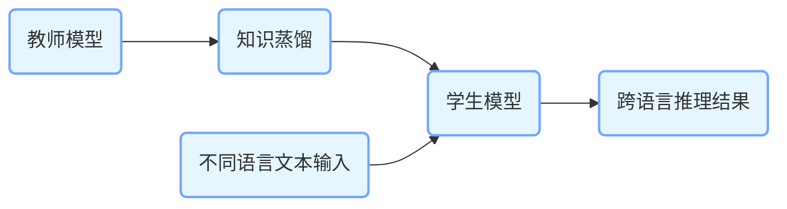

# 基于知识蒸馏的轻量级跨语言推理模型设计方法

> 关键词：知识蒸馏、轻量级模型、跨语言推理、模型设计、自然语言处理

> 摘要：本文围绕基于知识蒸馏的轻量级跨语言推理模型设计方法展开深入探讨。首先介绍了该研究的背景，包括目的、预期读者、文档结构和相关术语。接着阐述了核心概念及它们之间的联系，通过文本示意图和 Mermaid 流程图进行直观展示。详细讲解了核心算法原理，并用 Python 代码进行了具体实现。给出了相关的数学模型和公式，并举例说明。通过项目实战，从开发环境搭建到源代码实现与解读，全面展示了模型的构建过程。分析了该模型的实际应用场景，推荐了学习资源、开发工具框架和相关论文著作。最后总结了未来发展趋势与挑战，并提供了常见问题解答和扩展阅读参考资料，旨在为相关领域的研究者和开发者提供全面且深入的技术指导。

## 1. 背景介绍 
### 1.1 目的和范围
在当今全球化的时代，跨语言交流和信息处理变得越来越重要。自然语言处理（NLP）领域中的跨语言推理任务旨在理解不同语言文本之间的逻辑关系，然而，现有的跨语言推理模型通常规模庞大，计算资源消耗高，难以在资源受限的设备上部署。因此，设计轻量级的跨语言推理模型具有重要的现实意义。

本文的目的是介绍一种基于知识蒸馏的轻量级跨语言推理模型设计方法，详细阐述其原理、算法实现、实际应用等方面。范围涵盖从核心概念的讲解到项目实战的全流程，以及相关工具和资源的推荐，为读者提供一个全面的技术指导。

### 1.2 预期读者
本文预期读者包括自然语言处理领域的研究者、人工智能和机器学习方向的研究生、软件开发者以及对跨语言推理和轻量级模型设计感兴趣的技术爱好者。读者需要具备一定的机器学习和自然语言处理基础知识，了解深度学习中的基本概念，如神经网络、损失函数等。

### 1.3 文档结构概述
本文将按照以下结构进行组织：
1. 背景介绍：阐述研究目的、预期读者、文档结构和相关术语。
2. 核心概念与联系：介绍知识蒸馏、轻量级模型和跨语言推理的核心概念，展示它们之间的联系。
3. 核心算法原理 & 具体操作步骤：详细讲解基于知识蒸馏的轻量级跨语言推理模型的算法原理，并给出 Python 代码实现。
4. 数学模型和公式 & 详细讲解 & 举例说明：给出相关的数学模型和公式，并进行详细解释和举例。
5. 项目实战：代码实际案例和详细解释说明：包括开发环境搭建、源代码实现和代码解读。
6. 实际应用场景：分析该模型在不同领域的实际应用。
7. 工具和资源推荐：推荐学习资源、开发工具框架和相关论文著作。
8. 总结：未来发展趋势与挑战：总结研究成果，分析未来发展趋势和面临的挑战。
9. 附录：常见问题与解答：解答读者可能遇到的常见问题。
10. 扩展阅读 & 参考资料：提供相关的扩展阅读材料和参考资料。

### 1.4 术语表
#### 1.4.1 核心术语定义
- **知识蒸馏（Knowledge Distillation）**：一种模型压缩技术，通过将大型教师模型的知识转移到小型学生模型中，使学生模型在保持较高性能的同时，具有更小的模型规模和更低的计算成本。
- **轻量级模型（Lightweight Model）**：指模型参数较少、计算复杂度较低的模型，通常适用于资源受限的设备，如移动设备、嵌入式系统等。
- **跨语言推理（Cross - Lingual Inference）**：在不同语言的文本之间进行逻辑推理，判断它们之间的蕴含、矛盾或中性关系。
- **教师模型（Teacher Model）**：在知识蒸馏中，通常是一个大型、性能较好的模型，用于向学生模型传授知识。
- **学生模型（Student Model）**：在知识蒸馏中，是一个小型、待训练的模型，通过学习教师模型的知识来提高自身性能。

#### 1.4.2 相关概念解释
- **模型压缩（Model Compression）**：通过各种技术减少模型的参数数量和计算复杂度，以实现模型的轻量化。知识蒸馏是模型压缩的一种有效方法。
- **跨语言表示学习（Cross - Lingual Representation Learning）**：旨在学习能够在不同语言之间共享的文本表示，使得模型能够处理多种语言的输入。

#### 1.4.3 缩略词列表
- **NLP**：自然语言处理（Natural Language Processing）
- **ML**：机器学习（Machine Learning）
- **DL**：深度学习（Deep Learning）
- **BERT**：双向编码器表示来自变换器（Bidirectional Encoder Representations from Transformers）

## 2. 核心概念与联系 
### 核心概念原理
#### 知识蒸馏
知识蒸馏的核心思想是让小型的学生模型学习大型教师模型的输出分布。教师模型通常在大规模数据集上进行训练，具有较高的性能。学生模型通过最小化与教师模型输出之间的差异来学习知识。具体来说，教师模型的输出不仅包含了最终的预测结果，还包含了样本之间的相对置信度信息，这些信息可以帮助学生模型更好地泛化。

#### 轻量级模型
轻量级模型的设计目标是在保证一定性能的前提下，减少模型的参数数量和计算复杂度。常见的方法包括使用较小的网络结构、减少隐藏层的维度、采用量化技术等。轻量级模型可以在资源受限的设备上快速运行，降低计算成本。

#### 跨语言推理
跨语言推理要求模型能够理解不同语言文本之间的逻辑关系。这通常需要模型学习到跨语言的文本表示，使得不同语言的文本在同一特征空间中具有相似的表示。常见的方法是使用多语言预训练模型，如 mBERT（Multilingual BERT），来学习跨语言的语义信息。

### 架构的文本示意图
```plaintext
教师模型（大型、高性能）
    |
    | 知识蒸馏（输出分布）
    v
学生模型（小型、轻量级）
    |
    | 输入不同语言文本
    v
跨语言推理结果
```

### Mermaid 流程图


## 3. 核心算法原理 & 具体操作步骤 
### 核心算法原理
基于知识蒸馏的轻量级跨语言推理模型的核心算法主要包括两个阶段：教师模型训练和学生模型知识蒸馏。

#### 教师模型训练
教师模型通常是一个大型的预训练语言模型，如 mBERT。在跨语言推理任务中，教师模型在大规模的跨语言推理数据集上进行微调，以学习不同语言文本之间的逻辑关系。训练过程中使用交叉熵损失函数来最小化模型预测结果与真实标签之间的差异。

#### 学生模型知识蒸馏
学生模型是一个轻量级的模型，如 DistilBERT。在知识蒸馏阶段，学生模型同时学习教师模型的输出分布和真实标签。具体来说，使用一个组合损失函数，包括蒸馏损失和分类损失。蒸馏损失用于衡量学生模型输出与教师模型输出之间的差异，通常使用 KL 散度（Kullback - Leibler Divergence）；分类损失用于衡量学生模型输出与真实标签之间的差异，使用交叉熵损失。

### 具体操作步骤
1. **数据准备**：收集跨语言推理数据集，包括不同语言的文本对和对应的标签。对数据进行预处理，如分词、编码等。
2. **教师模型训练**：
    - 加载预训练的 mBERT 模型。
    - 在跨语言推理数据集上对 mBERT 进行微调，使用交叉熵损失函数进行训练。
3. **学生模型知识蒸馏**：
    - 加载轻量级的 DistilBERT 模型。
    - 在训练过程中，计算蒸馏损失和分类损失的组合损失。
    - 使用优化器（如 Adam）更新学生模型的参数。
4. **模型评估**：使用测试数据集对学生模型进行评估，计算准确率、召回率等指标。

### Python 代码实现
```python
import torch
import torch.nn as nn
import torch.optim as optim
from transformers import BertForSequenceClassification, DistilBertForSequenceClassification, BertTokenizer, DistilBertTokenizer
from torch.utils.data import DataLoader, Dataset

# 定义数据集类
class CrossLingualInferenceDataset(Dataset):
    def __init__(self, texts, labels, tokenizer, max_length):
        self.texts = texts
        self.labels = labels
        self.tokenizer = tokenizer
        self.max_length = max_length

    def __len__(self):
        return len(self.texts)

    def __getitem__(self, idx):
        text = self.texts[idx]
        label = self.labels[idx]
        encoding = self.tokenizer.encode_plus(
            text,
            add_special_tokens=True,
            max_length=self.max_length,
            padding='max_length',
            truncation=True,
            return_tensors='pt'
        )
        return {
            'input_ids': encoding['input_ids'].flatten(),
            'attention_mask': encoding['attention_mask'].flatten(),
            'labels': torch.tensor(label, dtype=torch.long)
        }

# 教师模型训练
def train_teacher_model(train_dataloader, model, optimizer, device, epochs):
    model.train()
    criterion = nn.CrossEntropyLoss()
    for epoch in range(epochs):
        total_loss = 0
        for batch in train_dataloader:
            input_ids = batch['input_ids'].to(device)
            attention_mask = batch['attention_mask'].to(device)
            labels = batch['labels'].to(device)

            optimizer.zero_grad()
            outputs = model(input_ids, attention_mask=attention_mask)
            logits = outputs.logits
            loss = criterion(logits, labels)
            loss.backward()
            optimizer.step()
            total_loss += loss.item()
        print(f'Epoch {epoch + 1}, Loss: {total_loss / len(train_dataloader)}')

# 学生模型知识蒸馏
def distill_knowledge(train_dataloader, teacher_model, student_model, optimizer, device, epochs, temperature=2.0, alpha=0.5):
    teacher_model.eval()
    student_model.train()
    criterion_distillation = nn.KLDivLoss(reduction='batchmean')
    criterion_classification = nn.CrossEntropyLoss()
    for epoch in range(epochs):
        total_loss = 0
        for batch in train_dataloader:
            input_ids = batch['input_ids'].to(device)
            attention_mask = batch['attention_mask'].to(device)
            labels = batch['labels'].to(device)

            optimizer.zero_grad()

            with torch.no_grad():
                teacher_logits = teacher_model(input_ids, attention_mask=attention_mask).logits

            student_logits = student_model(input_ids, attention_mask=attention_mask).logits

            distillation_loss = criterion_distillation(
                nn.functional.log_softmax(student_logits / temperature, dim=1),
                nn.functional.softmax(teacher_logits / temperature, dim=1)
            ) * (temperature ** 2)

            classification_loss = criterion_classification(student_logits, labels)

            loss = alpha * distillation_loss + (1 - alpha) * classification_loss
            loss.backward()
            optimizer.step()
            total_loss += loss.item()
        print(f'Epoch {epoch + 1}, Loss: {total_loss / len(train_dataloader)}')

# 主函数
def main():
    # 数据准备
    texts = ["This is a sample text.", "另一个示例文本。"]
    labels = [0, 1]
    tokenizer_teacher = BertTokenizer.from_pretrained('bert-base-multilingual-cased')
    tokenizer_student = DistilBertTokenizer.from_pretrained('distilbert-base-multilingual-cased')
    max_length = 128
    dataset = CrossLingualInferenceDataset(texts, labels, tokenizer_teacher, max_length)
    train_dataloader = DataLoader(dataset, batch_size=2, shuffle=True)

    # 设备设置
    device = torch.device('cuda' if torch.cuda.is_available() else 'cpu')

    # 教师模型训练
    teacher_model = BertForSequenceClassification.from_pretrained('bert-base-multilingual-cased', num_labels=2)
    teacher_model.to(device)
    optimizer_teacher = optim.Adam(teacher_model.parameters(), lr=2e-5)
    train_teacher_model(train_dataloader, teacher_model, optimizer_teacher, device, epochs=3)

    # 学生模型知识蒸馏
    student_model = DistilBertForSequenceClassification.from_pretrained('distilbert-base-multilingual-cased', num_labels=2)
    student_model.to(device)
    optimizer_student = optim.Adam(student_model.parameters(), lr=2e-5)
    distill_knowledge(train_dataloader, teacher_model, student_model, optimizer_student, device, epochs=3)

if __name__ == "__main__":
    main()
```

## 4. 数学模型和公式 & 详细讲解 & 举例说明 
### 交叉熵损失函数
交叉熵损失函数常用于分类任务，用于衡量模型预测结果与真实标签之间的差异。对于一个样本，其交叉熵损失的计算公式为：
$$
H(p, q)=-\sum_{i=1}^{C} p_{i} \log(q_{i})
$$
其中，$p$ 是真实标签的概率分布，$q$ 是模型预测的概率分布，$C$ 是类别数。

在跨语言推理任务中，假设我们有一个样本的真实标签为 $y$（one - hot 编码），模型的预测输出为 $\hat{y}$，则该样本的交叉熵损失为：
$$
L_{cls}=-\sum_{i=1}^{C} y_{i} \log(\hat{y}_{i})
$$

### KL 散度
KL 散度用于衡量两个概率分布之间的差异。在知识蒸馏中，用于衡量学生模型输出分布与教师模型输出分布之间的差异。其计算公式为：
$$
D_{KL}(p \| q)=\sum_{i=1}^{C} p_{i} \log\left(\frac{p_{i}}{q_{i}}\right)
$$
其中，$p$ 是教师模型的输出分布，$q$ 是学生模型的输出分布。

为了在知识蒸馏中控制教师模型输出的平滑度，通常会引入温度参数 $T$。在计算 KL 散度时，使用软化后的概率分布：
$$
p_{i}=\frac{\exp(z_{i}^{t} / T)}{\sum_{j=1}^{C} \exp(z_{j}^{t} / T)}
$$
$$
q_{i}=\frac{\exp(z_{i}^{s} / T)}{\sum_{j=1}^{C} \exp(z_{j}^{s} / T)}
$$
其中，$z^{t}$ 是教师模型的 logits，$z^{s}$ 是学生模型的 logits。

### 组合损失函数
在知识蒸馏阶段，学生模型的损失函数是蒸馏损失和分类损失的组合：
$$
L=\alpha D_{KL}(p \| q)+(1 - \alpha)L_{cls}
$$
其中，$\alpha$ 是一个超参数，用于控制蒸馏损失和分类损失的权重。

### 举例说明
假设我们有一个二分类任务，教师模型对于一个样本的 logits 为 $z^{t}=[2, 1]$，学生模型的 logits 为 $z^{s}=[1, 0]$，真实标签为 $y=[1, 0]$。温度参数 $T = 2$，$\alpha = 0.5$。

1. **计算教师模型和学生模型的软化概率分布**：
    - 教师模型的软化概率分布：
$$
p_{1}=\frac{\exp(2 / 2)}{\exp(2 / 2)+\exp(1 / 2)}\approx 0.73
$$
$$
p_{2}=\frac{\exp(1 / 2)}{\exp(2 / 2)+\exp(1 / 2)}\approx 0.27
$$
    - 学生模型的软化概率分布：
$$
q_{1}=\frac{\exp(1 / 2)}{\exp(1 / 2)+\exp(0 / 2)}\approx 0.62
$$
$$
q_{2}=\frac{\exp(0 / 2)}{\exp(1 / 2)+\exp(0 / 2)}\approx 0.38
$$

2. **计算蒸馏损失**：
$$
D_{KL}(p \| q)=p_{1} \log\left(\frac{p_{1}}{q_{1}}\right)+p_{2} \log\left(\frac{p_{2}}{q_{2}}\right)\approx 0.09
$$

3. **计算分类损失**：
$$
L_{cls}=-(1\times\log(0.62)+0\times\log(0.38))\approx 0.48
$$

4. **计算组合损失**：
$$
L = 0.5\times0.09+(1 - 0.5)\times0.48 = 0.285
$$

## 5. 项目实战：代码实际案例和详细解释说明 
### 5.1  开发环境搭建
#### 安装 Python
确保你已经安装了 Python 3.6 或更高版本。可以从 Python 官方网站（https://www.python.org/downloads/）下载并安装。

#### 创建虚拟环境
使用 `venv` 或 `conda` 创建一个虚拟环境，以隔离项目的依赖。例如，使用 `venv` 创建虚拟环境：
```bash
python -m venv cross_lingual_env
source cross_lingual_env/bin/activate  # 在 Windows 上使用 cross_lingual_env\Scripts\activate
```

#### 安装依赖库
在虚拟环境中安装所需的依赖库，包括 `torch`、`transformers` 等：
```bash
pip install torch transformers
```

### 5.2  源代码详细实现和代码解读
```python
import torch
import torch.nn as nn
import torch.optim as optim
from transformers import BertForSequenceClassification, DistilBertForSequenceClassification, BertTokenizer, DistilBertTokenizer
from torch.utils.data import DataLoader, Dataset

# 定义数据集类
class CrossLingualInferenceDataset(Dataset):
    def __init__(self, texts, labels, tokenizer, max_length):
        self.texts = texts
        self.labels = labels
        self.tokenizer = tokenizer
        self.max_length = max_length

    def __len__(self):
        return len(self.texts)

    def __getitem__(self, idx):
        text = self.texts[idx]
        label = self.labels[idx]
        encoding = self.tokenizer.encode_plus(
            text,
            add_special_tokens=True,
            max_length=self.max_length,
            padding='max_length',
            truncation=True,
            return_tensors='pt'
        )
        return {
            'input_ids': encoding['input_ids'].flatten(),
            'attention_mask': encoding['attention_mask'].flatten(),
            'labels': torch.tensor(label, dtype=torch.long)
        }

# 教师模型训练
def train_teacher_model(train_dataloader, model, optimizer, device, epochs):
    model.train()
    criterion = nn.CrossEntropyLoss()
    for epoch in range(epochs):
        total_loss = 0
        for batch in train_dataloader:
            input_ids = batch['input_ids'].to(device)
            attention_mask = batch['attention_mask'].to(device)
            labels = batch['labels'].to(device)

            optimizer.zero_grad()
            outputs = model(input_ids, attention_mask=attention_mask)
            logits = outputs.logits
            loss = criterion(logits, labels)
            loss.backward()
            optimizer.step()
            total_loss += loss.item()
        print(f'Epoch {epoch + 1}, Loss: {total_loss / len(train_dataloader)}')

# 学生模型知识蒸馏
def distill_knowledge(train_dataloader, teacher_model, student_model, optimizer, device, epochs, temperature=2.0, alpha=0.5):
    teacher_model.eval()
    student_model.train()
    criterion_distillation = nn.KLDivLoss(reduction='batchmean')
    criterion_classification = nn.CrossEntropyLoss()
    for epoch in range(epochs):
        total_loss = 0
        for batch in train_dataloader:
            input_ids = batch['input_ids'].to(device)
            attention_mask = batch['attention_mask'].to(device)
            labels = batch['labels'].to(device)

            optimizer.zero_grad()

            with torch.no_grad():
                teacher_logits = teacher_model(input_ids, attention_mask=attention_mask).logits

            student_logits = student_model(input_ids, attention_mask=attention_mask).logits

            distillation_loss = criterion_distillation(
                nn.functional.log_softmax(student_logits / temperature, dim=1),
                nn.functional.softmax(teacher_logits / temperature, dim=1)
            ) * (temperature ** 2)

            classification_loss = criterion_classification(student_logits, labels)

            loss = alpha * distillation_loss + (1 - alpha) * classification_loss
            loss.backward()
            optimizer.step()
            total_loss += loss.item()
        print(f'Epoch {epoch + 1}, Loss: {total_loss / len(train_dataloader)}')

# 主函数
def main():
    # 数据准备
    texts = ["This is a sample text.", "另一个示例文本。"]
    labels = [0, 1]
    tokenizer_teacher = BertTokenizer.from_pretrained('bert-base-multilingual-cased')
    tokenizer_student = DistilBertTokenizer.from_pretrained('distilbert-base-multilingual-cased')
    max_length = 128
    dataset = CrossLingualInferenceDataset(texts, labels, tokenizer_teacher, max_length)
    train_dataloader = DataLoader(dataset, batch_size=2, shuffle=True)

    # 设备设置
    device = torch.device('cuda' if torch.cuda.is_available() else 'cpu')

    # 教师模型训练
    teacher_model = BertForSequenceClassification.from_pretrained('bert-base-multilingual-cased', num_labels=2)
    teacher_model.to(device)
    optimizer_teacher = optim.Adam(teacher_model.parameters(), lr=2e-5)
    train_teacher_model(train_dataloader, teacher_model, optimizer_teacher, device, epochs=3)

    # 学生模型知识蒸馏
    student_model = DistilBertForSequenceClassification.from_pretrained('distilbert-base-multilingual-cased', num_labels=2)
    student_model.to(device)
    optimizer_student = optim.Adam(student_model.parameters(), lr=2e-5)
    distill_knowledge(train_dataloader, teacher_model, student_model, optimizer_student, device, epochs=3)

if __name__ == "__main__":
    main()
```

### 代码解读与分析
#### 数据集类 `CrossLingualInferenceDataset`
该类继承自 `torch.utils.data.Dataset`，用于封装跨语言推理数据集。在 `__init__` 方法中，初始化数据集的文本、标签、分词器和最大长度。`__len__` 方法返回数据集的长度，`__getitem__` 方法根据索引返回一个样本，包括输入 ID、注意力掩码和标签。

#### 教师模型训练函数 `train_teacher_model`
该函数用于训练教师模型。在每个 epoch 中，遍历训练数据加载器，计算模型的输出和交叉熵损失，然后进行反向传播和参数更新。

#### 学生模型知识蒸馏函数 `distill_knowledge`
该函数用于对学生模型进行知识蒸馏。教师模型设置为评估模式，学生模型设置为训练模式。在每个 epoch 中，遍历训练数据加载器，计算教师模型的输出（无梯度）和学生模型的输出，然后计算蒸馏损失和分类损失的组合损失，进行反向传播和参数更新。

#### 主函数 `main`
在主函数中，首先进行数据准备，包括定义文本、标签、分词器和数据集，创建数据加载器。然后设置设备（GPU 或 CPU），训练教师模型，最后对学生模型进行知识蒸馏。

## 6. 实际应用场景 
### 跨语言问答系统
在跨语言问答系统中，用户可能使用不同的语言提出问题，系统需要能够理解问题并从多语言的知识库中找到答案。基于知识蒸馏的轻量级跨语言推理模型可以在资源受限的设备上快速运行，帮助系统判断问题与答案之间的逻辑关系，提高问答的准确性和效率。

### 多语言信息检索
在多语言信息检索场景中，用户可以使用不同的语言输入查询关键词，系统需要从多语言的文档集合中检索相关信息。该模型可以用于判断查询与文档之间的相关性，从而提高检索的准确性。

### 跨境电商客服
在跨境电商中，客服人员需要处理来自不同国家和地区的客户咨询。轻量级跨语言推理模型可以帮助客服系统理解客户的问题，自动分类问题类型，并提供相应的解决方案，提高客服效率和客户满意度。

### 国际新闻分析
在国际新闻领域，需要对不同语言的新闻文章进行分析和推理。该模型可以用于判断新闻之间的逻辑关系，如因果关系、对比关系等，帮助媒体机构和研究人员更好地理解国际新闻动态。

## 7. 工具和资源推荐
### 7.1 学习资源推荐
#### 7.1.1 书籍推荐
- 《自然语言处理入门》：这本书系统地介绍了自然语言处理的基本概念、算法和应用，适合初学者入门。
- 《深度学习》：由 Ian Goodfellow、Yoshua Bengio 和 Aaron Courville 编写，是深度学习领域的经典教材，涵盖了神经网络、优化算法等方面的内容。
- 《Transformers 自然语言处理》：详细介绍了 Transformer 架构及其在自然语言处理中的应用，包括 BERT、GPT 等模型。

#### 7.1.2 在线课程
- Coursera 上的“自然语言处理专项课程”：由顶尖高校的教授授课，涵盖了自然语言处理的各个方面，包括词法分析、句法分析、语义理解等。
- edX 上的“深度学习微硕士项目”：提供了深度学习的深入学习内容，包括神经网络、卷积神经网络、循环神经网络等。
- 吴恩达的“机器学习”课程：是机器学习领域的经典课程，适合初学者了解机器学习的基本概念和算法。

#### 7.1.3 技术博客和网站
- Hugging Face 博客：提供了关于自然语言处理模型、工具和技术的最新信息，包括预训练模型的使用、模型微调等方面的内容。
- Medium 上的自然语言处理专栏：有许多专业人士分享自然语言处理的研究成果和实践经验。
- arXiv 网站：可以获取最新的自然语言处理研究论文，了解该领域的前沿动态。

### 7.2 开发工具框架推荐
#### 7.2.1 IDE和编辑器
- PyCharm：是一款专业的 Python 集成开发环境，提供了代码编辑、调试、版本控制等功能，适合大规模项目的开发。
- Visual Studio Code：是一款轻量级的代码编辑器，支持多种编程语言和插件扩展，具有丰富的代码提示和调试功能。
- Jupyter Notebook：是一个交互式的开发环境，适合进行数据分析、模型训练和实验，支持代码、文本和可视化的混合展示。

#### 7.2.2 调试和性能分析工具
- PyTorch Profiler：是 PyTorch 提供的性能分析工具，可以帮助开发者分析模型的训练和推理性能，找出性能瓶颈。
- TensorBoard：是 TensorFlow 提供的可视化工具，也可以与 PyTorch 结合使用，用于可视化模型的训练过程、损失曲线等。
- cProfile：是 Python 内置的性能分析工具，可以分析代码的运行时间和函数调用次数，帮助开发者优化代码性能。

#### 7.2.3 相关框架和库
- PyTorch：是一个开源的深度学习框架，提供了丰富的神经网络层和优化算法，易于使用和扩展。
- Transformers：是 Hugging Face 开发的自然语言处理库，提供了多种预训练模型，如 BERT、DistilBERT 等，方便开发者进行模型的加载和微调。
- NLTK：是一个自然语言处理工具包，提供了词法分析、句法分析、语义理解等方面的工具和数据集。

### 7.3 相关论文著作推荐
#### 7.3.1 经典论文
- “BERT: Pre-training of Deep Bidirectional Transformers for Language Understanding”：介绍了 BERT 模型的预训练方法和在自然语言处理任务中的应用，是自然语言处理领域的经典论文。
- “DistilBERT, a distilled version of BERT: smaller, faster, cheaper and lighter”：提出了 DistilBERT 模型，是一种轻量级的 BERT 变体，通过知识蒸馏技术实现了模型的压缩。
- “XNLI: Evaluating Cross-lingual Sentence Representations”：介绍了 XNLI 数据集和跨语言自然语言推理任务，为跨语言自然语言处理的研究提供了基准。

#### 7.3.2 最新研究成果
- 在 arXiv 网站上搜索“Knowledge Distillation for Cross-lingual Inference”等关键词，可以获取关于基于知识蒸馏的跨语言推理的最新研究成果。

#### 7.3.3 应用案例分析
- 一些学术会议和期刊，如 ACL（Association for Computational Linguistics）、EMNLP（Conference on Empirical Methods in Natural Language Processing）等，会发表关于自然语言处理应用案例的论文，可以从中了解基于知识蒸馏的轻量级跨语言推理模型在实际应用中的效果和挑战。

## 8. 总结：未来发展趋势与挑战
### 未来发展趋势
#### 模型性能提升
未来的研究将继续致力于提高轻量级跨语言推理模型的性能，通过改进知识蒸馏算法、设计更高效的轻量级架构等方式，使模型在保持小尺寸的同时，能够达到甚至超越大型模型的性能。

#### 多模态融合
随着多模态技术的发展，将跨语言推理模型与图像、音频等其他模态的信息进行融合是一个重要的发展方向。例如，在跨语言的图像描述生成、视频理解等任务中，融合多模态信息可以提高模型的理解能力和表达能力。

#### 自适应知识蒸馏
研究自适应的知识蒸馏方法，根据不同的任务和数据特点，动态调整蒸馏损失和分类损失的权重，以及温度参数等超参数，使模型能够更好地适应不同的场景。

#### 低资源语言支持
目前的跨语言推理模型在高资源语言上表现较好，但在低资源语言上的性能还有待提高。未来的研究将关注如何利用有限的低资源语言数据，通过知识蒸馏等技术训练出有效的跨语言推理模型。

### 挑战
#### 知识蒸馏的有效性
知识蒸馏的效果受到多种因素的影响，如教师模型的选择、蒸馏损失函数的设计、温度参数的设置等。如何确保知识能够有效地从教师模型转移到学生模型，是一个需要解决的问题。

#### 跨语言语义鸿沟
不同语言之间存在着语义和语法的差异，如何弥合这些差异，使模型能够准确地理解不同语言文本之间的逻辑关系，是跨语言推理面临的一个挑战。

#### 模型可解释性
轻量级跨语言推理模型通常是基于深度学习的黑盒模型，缺乏可解释性。在一些对模型解释性要求较高的应用场景中，如法律、医疗等领域，如何提高模型的可解释性是一个重要的问题。

#### 计算资源限制
虽然轻量级模型在一定程度上减少了计算资源的消耗，但在大规模数据集上进行训练和推理仍然需要较高的计算资源。如何在资源受限的环境下进一步优化模型的训练和推理效率，是一个持续的挑战。

## 9. 附录：常见问题与解答
### 问题 1：知识蒸馏中温度参数 $T$ 的作用是什么？
温度参数 $T$ 用于控制教师模型和学生模型输出的平滑度。当 $T$ 较大时，输出分布会更加平滑，模型对不同类别的置信度差异会减小；当 $T$ 较小时，输出分布会更加尖锐，模型对不同类别的置信度差异会增大。通过调整 $T$ 的值，可以控制知识蒸馏的效果。

### 问题 2：如何选择知识蒸馏中的超参数 $\alpha$？
超参数 $\alpha$ 用于控制蒸馏损失和分类损失的权重。一般来说，可以通过实验的方法来选择合适的 $\alpha$ 值。可以在验证集上尝试不同的 $\alpha$ 值，选择使模型性能最佳的 $\alpha$。通常情况下，$\alpha$ 的取值范围在 0.2 - 0.8 之间。

### 问题 3：轻量级模型在跨语言推理任务中的性能是否能达到大型模型的水平？
在一些情况下，轻量级模型通过知识蒸馏等技术可以在跨语言推理任务中达到接近大型模型的性能。但由于轻量级模型的参数数量和计算复杂度较低，其表达能力可能会受到一定的限制。因此，在对性能要求较高的场景中，大型模型可能仍然具有优势。

### 问题 4：如何处理跨语言推理数据集中的低资源语言数据？
可以采用数据增强、迁移学习等方法来处理低资源语言数据。数据增强可以通过对现有数据进行变换、扩充等方式来增加数据量；迁移学习可以利用高资源语言数据训练的模型，将其知识迁移到低资源语言任务中。

## 10. 扩展阅读 & 参考资料
### 扩展阅读
- 《神经网络与深度学习》：深入介绍了神经网络的原理和应用，包括卷积神经网络、循环神经网络等。
- 《人工智能：现代方法》：全面介绍了人工智能的各个领域，包括自然语言处理、机器学习、计算机视觉等。
- 《自然语言处理实战》：通过实际案例介绍了自然语言处理的各种技术和应用，适合有一定基础的读者进一步学习。

### 参考资料
- Devlin, J., Chang, M. - W., Lee, K., & Toutanova, K. (2018). BERT: Pre-training of Deep Bidirectional Transformers for Language Understanding. arXiv preprint arXiv:1810.04805.
- Sanh, V., Debut, L., Chaumond, J., & Wolf, T. (2019). DistilBERT, a distilled version of BERT: smaller, faster, cheaper and lighter. arXiv preprint arXiv:1910.01108.
- Conneau, A., Rinott, R., Lample, G., Williams, A., Bowman, S. R., Schwenk, H., & Stoyanov, V. (2018). XNLI: Evaluating Cross-lingual Sentence Representations. arXiv preprint arXiv:1809.05053.

作者：AI天才研究院/AI Genius Institute & 禅与计算机程序设计艺术 /Zen And The Art of Computer Programming