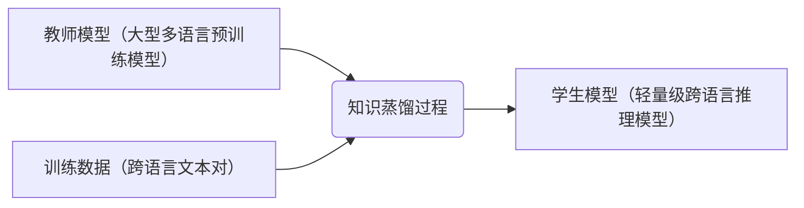

# 基于知识蒸馏的轻量级跨语言推理模型设计方法研究

> 关键词：知识蒸馏、轻量级模型、跨语言推理、模型设计、自然语言处理

> 摘要：本文聚焦于基于知识蒸馏的轻量级跨语言推理模型设计方法。首先介绍了相关背景，包括研究目的、预期读者等内容。详细阐述了核心概念，如知识蒸馏、跨语言推理等，并给出相应的文本示意图和 Mermaid 流程图。深入讲解了核心算法原理，通过 Python 源代码进行详细说明，同时给出了数学模型和公式并举例。结合实际项目，展示了代码案例及详细解释。探讨了该模型的实际应用场景，推荐了相关的学习资源、开发工具框架以及论文著作。最后对未来发展趋势与挑战进行总结，并给出常见问题解答和扩展阅读参考资料。旨在为研究和应用跨语言推理模型的人员提供全面且深入的技术指导。

## 1. 背景介绍 
### 1.1 目的和范围
在当今全球化的时代，跨语言交流与信息处理变得越来越重要。自然语言处理（NLP）领域中的跨语言推理任务旨在理解不同语言文本之间的逻辑关系，例如判断不同语言的两个句子是否存在蕴含、矛盾或中立关系。然而，现有的跨语言推理模型通常规模较大，计算资源消耗高，难以在资源受限的设备上部署。

本研究的目的是设计一种基于知识蒸馏的轻量级跨语言推理模型。具体范围包括：深入研究知识蒸馏技术在跨语言推理场景下的应用，探索如何将大型预训练跨语言模型的知识转移到轻量级模型中；设计轻量级的跨语言推理模型架构，使其在保证一定推理性能的前提下，降低模型的参数量和计算复杂度；通过实验验证所设计模型的有效性和实用性。

### 1.2 预期读者
本文的预期读者包括自然语言处理领域的研究人员，他们可以从本文中获取关于知识蒸馏和轻量级跨语言推理模型设计的新方法和新思路，为进一步的研究提供参考；人工智能和机器学习方向的研究生，有助于他们深入理解跨语言推理任务和知识蒸馏技术的结合应用；从事自然语言处理相关产品开发的工程师，能够借鉴本文的方法和代码实现，开发出更高效、更适合资源受限环境的跨语言推理应用。

### 1.3 文档结构概述
本文将按照以下结构进行组织：
- 核心概念与联系：介绍知识蒸馏、跨语言推理等核心概念，以及它们之间的联系，并给出相应的文本示意图和 Mermaid 流程图。
- 核心算法原理 & 具体操作步骤：详细讲解基于知识蒸馏的轻量级跨语言推理模型的核心算法原理，通过 Python 源代码进行具体操作步骤的阐述。
- 数学模型和公式 & 详细讲解 & 举例说明：给出知识蒸馏和跨语言推理相关的数学模型和公式，并进行详细讲解和举例。
- 项目实战：代码实际案例和详细解释说明：展示一个实际的项目案例，包括开发环境搭建、源代码详细实现和代码解读。
- 实际应用场景：探讨基于知识蒸馏的轻量级跨语言推理模型的实际应用场景。
- 工具和资源推荐：推荐相关的学习资源、开发工具框架以及论文著作。
- 总结：未来发展趋势与挑战：对基于知识蒸馏的轻量级跨语言推理模型的未来发展趋势进行总结，并分析可能面临的挑战。
- 附录：常见问题与解答：解答读者在阅读和实践过程中可能遇到的常见问题。
- 扩展阅读 & 参考资料：提供相关的扩展阅读材料和参考资料。

### 1.4 术语表
#### 1.4.1 核心术语定义
- **知识蒸馏（Knowledge Distillation）**：一种模型压缩技术，通过将一个大型的、表现良好的教师模型的知识转移到一个小型的学生模型中，使学生模型在保持一定性能的同时，具有更小的参数量和计算复杂度。
- **跨语言推理（Cross - lingual Inference）**：指在不同语言的文本之间进行逻辑推理的任务，例如判断不同语言的两个句子之间是否存在蕴含、矛盾或中立关系。
- **轻量级模型（Lightweight Model）**：相对于传统的大型模型，轻量级模型具有较少的参数和较低的计算复杂度，更适合在资源受限的设备上部署。
- **教师模型（Teacher Model）**：在知识蒸馏中，教师模型是一个大型的、表现良好的模型，它的输出作为知识源，用于指导学生模型的训练。
- **学生模型（Student Model）**：在知识蒸馏中，学生模型是一个小型的模型，它通过学习教师模型的输出，来提高自己的性能。

#### 1.4.2 相关概念解释
- **预训练模型（Pretrained Model）**：在大规模无监督数据上进行预训练的模型，例如 BERT、RoBERTa 等。这些模型学习到了丰富的语言知识，可以在各种自然语言处理任务中进行微调。
- **多语言模型（Multilingual Model）**：能够处理多种语言的模型，通常在多语言语料上进行训练，具有跨语言的表示能力。
- **模型压缩（Model Compression）**：通过各种技术减少模型的参数量和计算复杂度，提高模型的效率，常见的方法包括知识蒸馏、量化、剪枝等。

#### 1.4.3 缩略词列表
- **NLP**：Natural Language Processing，自然语言处理
- **BERT**：Bidirectional Encoder Representations from Transformers，基于 Transformer 的双向编码器表示
- **RoBERTa**：Robustly Optimized BERT Pretraining Approach，鲁棒优化的 BERT 预训练方法

## 2. 核心概念与联系 

### 知识蒸馏概念
知识蒸馏的核心思想是让一个小型的学生模型学习大型教师模型的输出。教师模型通常在大规模数据上进行训练，具有较好的性能，但参数量大、计算成本高。学生模型则通过模仿教师模型的输出分布来学习知识，从而在保证一定性能的前提下，降低模型的复杂度。

### 跨语言推理概念
跨语言推理是指在不同语言的文本之间进行逻辑推理。例如，判断一个英语句子和一个法语句子之间是否存在蕴含关系。为了实现跨语言推理，模型需要具备跨语言的表示能力，能够将不同语言的文本映射到同一个语义空间中。

### 两者联系
在跨语言推理任务中，使用大型的多语言预训练模型作为教师模型，可以学习到丰富的跨语言知识。然后通过知识蒸馏技术，将这些知识转移到轻量级的学生模型中，使得学生模型也能够在跨语言推理任务中取得较好的性能。这样既可以解决大型模型在资源受限环境下难以部署的问题，又可以利用大型模型的知识来提高轻量级模型的性能。

### 文本示意图
```plaintext
教师模型（大型多语言预训练模型）
   |
   | 知识输出（概率分布等）
   v
知识蒸馏过程
   |
   | 指导学习
   v
学生模型（轻量级跨语言推理模型）
```

### Mermaid 流程图


## 3. 核心算法原理 & 具体操作步骤 

### 核心算法原理
知识蒸馏的核心算法通常基于软标签和硬标签的结合。软标签是教师模型的输出概率分布，硬标签是真实的标签。学生模型的损失函数通常由两部分组成：一部分是学生模型输出与硬标签之间的交叉熵损失，另一部分是学生模型输出与教师模型输出之间的软标签损失。

### 具体操作步骤

#### 步骤 1：选择教师模型和学生模型
选择一个大型的多语言预训练模型作为教师模型，例如 mBERT（Multilingual BERT）。选择一个轻量级的模型架构作为学生模型，例如 DistilBERT 的多语言版本。

#### 步骤 2：准备训练数据
收集跨语言推理任务的训练数据，包括不同语言的文本对以及对应的标签（蕴含、矛盾、中立）。

#### 步骤 3：定义损失函数
学生模型的损失函数 $L_{total}$ 定义为：

$L_{total} = \alpha L_{hard} + (1 - \alpha) L_{soft}$

其中，$L_{hard}$ 是学生模型输出与硬标签之间的交叉熵损失，$L_{soft}$ 是学生模型输出与教师模型输出之间的软标签损失，$\alpha$ 是一个超参数，用于平衡两部分损失的权重。

#### 步骤 4：训练学生模型
在训练过程中，将训练数据输入到教师模型和学生模型中。教师模型输出软标签，学生模型输出预测结果。计算损失函数 $L_{total}$，并使用梯度下降法更新学生模型的参数。

### Python 源代码实现

```python
import torch
import torch.nn as nn
import torch.optim as optim
from transformers import BertModel, DistilBertModel

# 定义教师模型和学生模型
teacher_model = BertModel.from_pretrained('bert-base-multilingual-cased')
student_model = DistilBertModel.from_pretrained('distilbert-base-multilingual-cased')

# 定义损失函数和优化器
alpha = 0.3
criterion_hard = nn.CrossEntropyLoss()
criterion_soft = nn.KLDivLoss(reduction='batchmean')
optimizer = optim.Adam(student_model.parameters(), lr=1e-5)

# 模拟训练数据
input_ids = torch.randint(0, 1000, (32, 128))  # 32 个样本，每个样本长度为 128
labels = torch.randint(0, 3, (32,))  # 32 个样本的标签，标签范围为 0 - 2

# 训练过程
for epoch in range(10):
    # 前向传播
    with torch.no_grad():
        teacher_output = teacher_model(input_ids)[0]
        teacher_logits = nn.Linear(teacher_model.config.hidden_size, 3)(teacher_output[:, 0, :])
    
    student_output = student_model(input_ids)[0]
    student_logits = nn.Linear(student_model.config.hidden_size, 3)(student_output[:, 0, :])
    
    # 计算损失
    L_hard = criterion_hard(student_logits, labels)
    soft_labels = torch.softmax(teacher_logits / 2, dim=1)  # 使用温度参数 T = 2
    L_soft = criterion_soft(torch.log_softmax(student_logits / 2, dim=1), soft_labels)
    L_total = alpha * L_hard + (1 - alpha) * L_soft
    
    # 反向传播和参数更新
    optimizer.zero_grad()
    L_total.backward()
    optimizer.step()
    
    print(f'Epoch {epoch + 1}, Loss: {L_total.item()}')
```

## 4. 数学模型和公式 & 详细讲解 & 举例说明 

### 软标签损失函数
软标签损失函数通常使用 KL 散度（Kullback - Leibler Divergence）来衡量学生模型输出和教师模型输出之间的差异。KL 散度的定义如下：

$$D_{KL}(P || Q) = \sum_{i} P(i) \log \frac{P(i)}{Q(i)}$$

其中，$P$ 是教师模型的输出概率分布，$Q$ 是学生模型的输出概率分布。

在知识蒸馏中，通常会引入一个温度参数 $T$ 来平滑教师模型和学生模型的输出。具体来说，教师模型的软标签 $P_T$ 和学生模型的预测分布 $Q_T$ 分别为：

$$P_T(i) = \frac{\exp(z_{t,i} / T)}{\sum_{j} \exp(z_{t,j} / T)}$$

$$Q_T(i) = \frac{\exp(z_{s,i} / T)}{\sum_{j} \exp(z_{s,j} / T)}$$

其中，$z_{t,i}$ 和 $z_{s,i}$ 分别是教师模型和学生模型的第 $i$ 个输出的 logits，$T$ 是温度参数。

软标签损失函数 $L_{soft}$ 可以表示为：

$$L_{soft} = D_{KL}(P_T || Q_T)$$

### 硬标签损失函数
硬标签损失函数通常使用交叉熵损失（Cross - Entropy Loss）来衡量学生模型输出和真实标签之间的差异。交叉熵损失的定义如下：

$$L_{hard} = - \sum_{i} y_i \log(p_i)$$

其中，$y_i$ 是真实标签的 one - hot 编码，$p_i$ 是学生模型的预测概率。

### 总损失函数
总损失函数 $L_{total}$ 是硬标签损失和软标签损失的加权和：

$$L_{total} = \alpha L_{hard} + (1 - \alpha) L_{soft}$$

其中，$\alpha$ 是一个超参数，用于平衡两部分损失的权重。

### 举例说明
假设我们有一个简单的二分类问题，教师模型的输出 logits 为 $z_t = [2, -1]$，学生模型的输出 logits 为 $z_s = [1, -2]$，真实标签为 $y = [1, 0]$。

#### 计算软标签损失
首先，设置温度参数 $T = 2$。

教师模型的软标签 $P_T$：

$$P_T(1) = \frac{\exp(2 / 2)}{\exp(2 / 2) + \exp(-1 / 2)} \approx 0.817$$

$$P_T(2) = \frac{\exp(-1 / 2)}{\exp(2 / 2) + \exp(-1 / 2)} \approx 0.183$$

学生模型的预测分布 $Q_T$：

$$Q_T(1) = \frac{\exp(1 / 2)}{\exp(1 / 2) + \exp(-2 / 2)} \approx 0.731$$

$$Q_T(2) = \frac{\exp(-2 / 2)}{\exp(1 / 2) + \exp(-2 / 2)} \approx 0.269$$

软标签损失 $L_{soft}$：

$$L_{soft} = D_{KL}(P_T || Q_T) = 0.817 \log \frac{0.817}{0.731} + 0.183 \log \frac{0.183}{0.269} \approx 0.063$$

#### 计算硬标签损失
学生模型的预测概率 $p$：

$$p(1) = \frac{\exp(1)}{\exp(1) + \exp(-2)} \approx 0.953$$

$$p(2) = \frac{\exp(-2)}{\exp(1) + \exp(-2)} \approx 0.047$$

硬标签损失 $L_{hard}$：

$$L_{hard} = - (1 \times \log(0.953) + 0 \times \log(0.047)) \approx 0.048$$

#### 计算总损失
假设 $\alpha = 0.3$，则总损失 $L_{total}$：

$$L_{total} = 0.3 \times 0.048 + (1 - 0.3) \times 0.063 \approx 0.057$$

## 5. 项目实战：代码实际案例和详细解释说明 

### 5.1  开发环境搭建
#### 安装 Python
首先，确保你已经安装了 Python 3.6 或更高版本。可以从 Python 官方网站（https://www.python.org/downloads/）下载并安装。

#### 创建虚拟环境
为了避免不同项目之间的依赖冲突，建议使用虚拟环境。可以使用 `venv` 模块来创建虚拟环境：

```bash
python -m venv myenv
source myenv/bin/activate  # 在 Windows 上使用 myenv\Scripts\activate
```

#### 安装依赖库
在虚拟环境中安装所需的依赖库，包括 `torch`、`transformers` 等：

```bash
pip install torch transformers numpy pandas
```

### 5.2  源代码详细实现和代码解读

```python
import torch
import torch.nn as nn
import torch.optim as optim
from transformers import BertModel, DistilBertModel, BertTokenizer, DistilBertTokenizer
import pandas as pd
from torch.utils.data import Dataset, DataLoader

# 定义数据集类
class CrossLingualInferenceDataset(Dataset):
    def __init__(self, data_path, tokenizer, max_length):
        self.data = pd.read_csv(data_path)
        self.tokenizer = tokenizer
        self.max_length = max_length
    
    def __len__(self):
        return len(self.data)
    
    def __getitem__(self, idx):
        premise = self.data.iloc[idx]['premise']
        hypothesis = self.data.iloc[idx]['hypothesis']
        label = self.data.iloc[idx]['label']
        
        encoding = self.tokenizer.encode_plus(
            premise,
            hypothesis,
            add_special_tokens=True,
            max_length=self.max_length,
            padding='max_length',
            truncation=True,
            return_tensors='pt'
        )
        
        input_ids = encoding['input_ids'].flatten()
        attention_mask = encoding['attention_mask'].flatten()
        
        return {
            'input_ids': input_ids,
            'attention_mask': attention_mask,
            'labels': torch.tensor(label, dtype=torch.long)
        }

# 定义教师模型和学生模型
teacher_model = BertModel.from_pretrained('bert-base-multilingual-cased')
student_model = DistilBertModel.from_pretrained('distilbert-base-multilingual-cased')

# 定义分类器
class ClassificationHead(nn.Module):
    def __init__(self, input_size, num_classes):
        super(ClassificationHead, self).__init__()
        self.fc = nn.Linear(input_size, num_classes)
    
    def forward(self, x):
        return self.fc(x)

teacher_classifier = ClassificationHead(teacher_model.config.hidden_size, 3)
student_classifier = ClassificationHead(student_model.config.hidden_size, 3)

# 定义损失函数和优化器
alpha = 0.3
criterion_hard = nn.CrossEntropyLoss()
criterion_soft = nn.KLDivLoss(reduction='batchmean')
optimizer = optim.Adam(student_model.parameters(), lr=1e-5)

# 准备数据集和数据加载器
tokenizer = DistilBertTokenizer.from_pretrained('distilbert-base-multilingual-cased')
train_dataset = CrossLingualInferenceDataset('train.csv', tokenizer, max_length=128)
train_dataloader = DataLoader(train_dataset, batch_size=32, shuffle=True)

# 训练过程
num_epochs = 10
for epoch in range(num_epochs):
    running_loss = 0.0
    for batch in train_dataloader:
        input_ids = batch['input_ids']
        attention_mask = batch['attention_mask']
        labels = batch['labels']
        
        # 前向传播教师模型
        with torch.no_grad():
            teacher_output = teacher_model(input_ids, attention_mask=attention_mask)[0]
            teacher_logits = teacher_classifier(teacher_output[:, 0, :])
        
        # 前向传播学生模型
        student_output = student_model(input_ids, attention_mask=attention_mask)[0]
        student_logits = student_classifier(student_output[:, 0, :])
        
        # 计算损失
        L_hard = criterion_hard(student_logits, labels)
        soft_labels = torch.softmax(teacher_logits / 2, dim=1)
        L_soft = criterion_soft(torch.log_softmax(student_logits / 2, dim=1), soft_labels)
        L_total = alpha * L_hard + (1 - alpha) * L_soft
        
        # 反向传播和参数更新
        optimizer.zero_grad()
        L_total.backward()
        optimizer.step()
        
        running_loss += L_total.item()
    
    print(f'Epoch {epoch + 1}, Loss: {running_loss / len(train_dataloader)}')
```

### 5.3  代码解读与分析
- **数据集类 `CrossLingualInferenceDataset`**：用于加载和处理跨语言推理任务的训练数据。该类继承自 `torch.utils.data.Dataset`，实现了 `__len__` 和 `__getitem__` 方法。在 `__getitem__` 方法中，使用 `tokenizer` 对输入的前提和假设文本进行编码，并返回输入 ID、注意力掩码和标签。
- **教师模型和学生模型**：分别使用 `BertModel` 和 `DistilBertModel` 作为教师模型和学生模型。同时，定义了分类器 `ClassificationHead` 用于将模型的输出映射到分类结果。
- **损失函数和优化器**：使用交叉熵损失函数 `nn.CrossEntropyLoss` 计算硬标签损失，使用 KL 散度损失函数 `nn.KLDivLoss` 计算软标签损失。使用 Adam 优化器更新学生模型的参数。
- **训练过程**：在每个 epoch 中，遍历训练数据加载器，依次计算教师模型和学生模型的输出，计算总损失，并进行反向传播和参数更新。

## 6. 实际应用场景 
### 跨语言信息检索
在跨语言信息检索系统中，用户可能使用不同的语言进行查询。基于知识蒸馏的轻量级跨语言推理模型可以用于判断查询语句和文档之间的相关性，提高检索的准确性。例如，一个用户使用中文查询“苹果公司的新产品”，系统可以使用该模型在英文文档中找到与之相关的信息。

### 国际商务谈判辅助
在国际商务谈判中，双方可能使用不同的语言进行交流。该模型可以实时分析双方语言表达之间的逻辑关系，例如判断对方的提议是否与己方的需求存在蕴含或矛盾关系，为谈判人员提供决策支持。

### 跨语言舆情分析
在全球范围内，不同国家和地区的媒体和社交媒体使用不同的语言发布信息。通过该模型可以对不同语言的舆情信息进行推理分析，了解不同语言文本之间的逻辑关联，及时发现潜在的危机和机遇。

### 多语言智能客服
在多语言智能客服系统中，用户可能使用不同的语言提出问题。该模型可以帮助客服系统理解不同语言问题之间的逻辑关系，提供更准确的回答。例如，当用户用中文询问“产品的保修期是多久”，而系统中只有英文的相关解答，模型可以判断两者之间的逻辑联系，为用户提供合适的答案。

## 7. 工具和资源推荐
### 7.1 学习资源推荐
#### 7.1.1 书籍推荐
- 《自然语言处理入门》：这本书详细介绍了自然语言处理的基础知识和常见技术，包括词法分析、句法分析、语义分析等内容，适合初学者入门。
- 《深度学习》：由 Ian Goodfellow、Yoshua Bengio 和 Aaron Courville 所著，是深度学习领域的经典教材，涵盖了神经网络、卷积神经网络、循环神经网络等内容，对于理解知识蒸馏和跨语言推理模型的原理有很大帮助。
- 《Python 自然语言处理》：介绍了如何使用 Python 进行自然语言处理任务，包括文本预处理、特征提取、模型训练等方面的内容，结合实际案例进行讲解，具有很强的实用性。

#### 7.1.2 在线课程
- Coursera 上的“Natural Language Processing Specialization”：由顶尖高校的教授授课，涵盖了自然语言处理的多个方面，包括词向量、序列模型、机器翻译等内容，课程内容丰富，讲解详细。
- edX 上的“Deep Learning for Natural Language Processing”：重点介绍了深度学习在自然语言处理中的应用，包括知识蒸馏、预训练模型等技术，通过实际编程作业帮助学生掌握相关知识。
- 哔哩哔哩上的一些自然语言处理相关课程：许多博主会分享自然语言处理的学习经验和教程，内容生动易懂，适合初学者快速入门。

#### 7.1.3 技术博客和网站
- Hugging Face Blog：Hugging Face 是自然语言处理领域的知名组织，其博客上会发布关于预训练模型、知识蒸馏等方面的最新研究成果和技术文章。
- Towards Data Science：这是一个专注于数据科学和人工智能领域的博客平台，有很多关于自然语言处理的高质量文章，包括技术讲解、案例分析等内容。
- arXiv：一个预印本论文平台，上面可以找到关于知识蒸馏、跨语言推理等方面的最新研究论文，了解该领域的前沿动态。

### 7.2 开发工具框架推荐
#### 7.2.1 IDE和编辑器
- PyCharm：是一款专门为 Python 开发设计的集成开发环境，具有代码自动补全、调试、版本控制等功能，能够提高开发效率。
- Visual Studio Code：一款轻量级的代码编辑器，支持多种编程语言，通过安装插件可以实现代码高亮、调试等功能，适合快速开发和学习。
- Jupyter Notebook：是一个交互式的开发环境，支持 Python、R 等多种编程语言。可以将代码、文本、图表等内容整合在一起，方便进行数据分析和模型实验。

#### 7.2.2 调试和性能分析工具
- PyTorch Profiler：是 PyTorch 提供的性能分析工具，可以帮助开发者分析模型的计算时间、内存使用等情况，找出性能瓶颈。
- TensorBoard：是 TensorFlow 提供的可视化工具，也可以与 PyTorch 结合使用。可以用于可视化模型的训练过程、损失曲线、准确率等指标，方便开发者监控模型的性能。
- cProfile：是 Python 内置的性能分析模块，可以分析代码的执行时间和函数调用次数，帮助开发者找出代码中的性能瓶颈。

#### 7.2.3 相关框架和库
- PyTorch：是一个开源的深度学习框架，提供了丰富的神经网络层和优化算法，支持 GPU 加速，广泛应用于自然语言处理、计算机视觉等领域。
- Transformers：是 Hugging Face 开发的一个自然语言处理库，提供了多种预训练模型，包括 BERT、RoBERTa、DistilBERT 等，方便开发者进行模型的微调和解码。
- NLTK：是一个流行的 Python 自然语言处理库，提供了丰富的文本处理工具和数据集，包括词法分析、句法分析、情感分析等功能。

### 7.3 相关论文著作推荐
#### 7.3.1 经典论文
- “Distilling the Knowledge in a Neural Network”：这是知识蒸馏领域的经典论文，首次提出了知识蒸馏的概念和方法，为后续的研究奠定了基础。
- “BERT: Pre-training of Deep Bidirectional Transformers for Language Understanding”：介绍了 BERT 模型的预训练方法和在自然语言处理任务中的应用，是预训练模型领域的里程碑论文。
- “Unsupervised Cross-lingual Representation Learning at Scale”：提出了一种大规模无监督跨语言表示学习的方法，提高了模型的跨语言能力。

#### 7.3.2 最新研究成果
- 关注 arXiv 上关于知识蒸馏和跨语言推理的最新论文，了解该领域的最新研究进展，例如如何改进知识蒸馏的方法、如何提高跨语言推理模型的性能等。
- 参加自然语言处理领域的国际会议，如 ACL（Association for Computational Linguistics）、EMNLP（Conference on Empirical Methods in Natural Language Processing）等，这些会议上会展示该领域的最新研究成果。

#### 7.3.3 应用案例分析
- 查找一些关于跨语言推理模型在实际应用中的案例分析文章，了解如何将基于知识蒸馏的轻量级跨语言推理模型应用到具体的业务场景中，以及在应用过程中遇到的问题和解决方案。

## 8. 总结：未来发展趋势与挑战
### 未来发展趋势
- **模型性能提升**：未来的研究将继续探索如何提高基于知识蒸馏的轻量级跨语言推理模型的性能。例如，改进知识蒸馏的方法，使学生模型能够更好地学习教师模型的知识；设计更高效的轻量级模型架构，提高模型的推理能力。
- **多模态融合**：随着多模态技术的发展，将跨语言推理模型与图像、音频等多模态信息进行融合是一个重要的发展趋势。例如，在跨语言视频问答任务中，结合文本和视频信息进行推理，提高模型的应用范围和准确性。
- **低资源语言支持**：目前的跨语言推理模型主要集中在高资源语言上，未来将更加关注低资源语言的支持。通过利用迁移学习、多语言预训练等技术，提高模型在低资源语言上的性能。
- **实际应用拓展**：基于知识蒸馏的轻量级跨语言推理模型将在更多的实际场景中得到应用，如智能交通、医疗健康等领域。随着技术的不断成熟，这些模型将为不同领域的跨语言信息处理提供更有效的解决方案。

### 挑战
- **知识蒸馏方法的局限性**：目前的知识蒸馏方法还存在一些局限性，例如如何更好地选择教师模型的知识进行蒸馏，如何平衡硬标签损失和软标签损失等问题还需要进一步研究。
- **跨语言语义理解的困难**：不同语言之间的语义差异较大，如何让模型更好地理解不同语言的语义，进行准确的跨语言推理是一个挑战。需要研究更有效的跨语言表示学习方法，提高模型的跨语言语义理解能力。
- **计算资源和数据的限制**：虽然轻量级模型在一定程度上降低了计算资源的需求，但在处理大规模数据和复杂任务时，仍然需要较高的计算资源。同时，高质量的跨语言训练数据也相对较少，如何在有限的数据和资源下训练出高性能的模型是一个亟待解决的问题。
- **模型的可解释性**：深度学习模型通常具有较高的复杂性，缺乏可解释性。在跨语言推理任务中，模型的决策过程往往难以理解，这对于一些对解释性要求较高的应用场景，如法律、医疗等领域，是一个较大的挑战。

## 9. 附录：常见问题与解答
### 问题 1：知识蒸馏中温度参数 $T$ 的作用是什么？
温度参数 $T$ 的作用是平滑教师模型和学生模型的输出概率分布。当 $T$ 较大时，概率分布会更加平滑，使得模型对不同类别的预测更加均匀；当 $T$ 较小时，概率分布会更加尖锐，模型会更加关注概率较大的类别。通过调整温度参数 $T$，可以控制知识蒸馏的效果。

### 问题 2：如何选择合适的 $\alpha$ 值来平衡硬标签损失和软标签损失？
$\alpha$ 值的选择通常需要通过实验来确定。一般来说，可以从一个较小的范围开始尝试，例如 $\alpha$ 取值为 0.2 - 0.5。在实验过程中，观察模型的训练损失和验证集上的性能，选择使得模型性能最优的 $\alpha$ 值。

### 问题 3：轻量级模型在跨语言推理任务中的性能是否能够达到大型模型的水平？
轻量级模型在参数量和计算复杂度上通常小于大型模型，因此在性能上可能无法完全达到大型模型的水平。但是，通过知识蒸馏等技术，可以将大型模型的知识转移到轻量级模型中，使得轻量级模型在保证一定性能的前提下，具有更好的效率。在一些对计算资源和实时性要求较高的场景中，轻量级模型是一个不错的选择。

### 问题 4：如何处理跨语言推理任务中的低资源语言？
处理跨语言推理任务中的低资源语言可以采用以下方法：
- **迁移学习**：利用高资源语言的预训练模型，通过微调的方式应用到低资源语言上。
- **多语言预训练**：在多语言语料上进行预训练，让模型学习到不同语言之间的共性知识，提高在低资源语言上的性能。
- **数据增强**：通过一些数据增强技术，如回译、同义词替换等，扩充低资源语言的训练数据。

## 10. 扩展阅读 & 参考资料
### 扩展阅读
- 《Neural Network Methods in Natural Language Processing》：深入介绍了神经网络在自然语言处理中的应用，包括知识蒸馏、预训练模型等技术的详细原理和实现方法。
- 《Advances in Information Retrieval》：该书中有关于跨语言信息检索的相关内容，对于理解跨语言推理模型在信息检索中的应用有很大帮助。
- 《Natural Language Processing with Python Cookbook》：提供了大量使用 Python 进行自然语言处理的实际案例，包括文本分类、情感分析、机器翻译等任务，对于提高实际编程能力有很大帮助。

### 参考资料
- [Hugging Face Transformers Documentation](https://huggingface.co/transformers/)：Hugging Face 提供的 Transformers 库的官方文档，详细介绍了各种预训练模型的使用方法和 API。
- [PyTorch Documentation](https://pytorch.org/docs/stable/index.html)：PyTorch 官方文档，提供了 PyTorch 框架的详细使用说明和 API 参考。
- [arXiv.org](https://arxiv.org/)：预印本论文平台，可获取关于知识蒸馏、跨语言推理等领域的最新研究论文。

作者：AI天才研究院/AI Genius Institute & 禅与计算机程序设计艺术 /Zen And The Art of Computer Programming