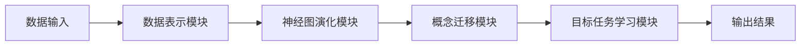

# 基于神经图演化的概念迁移学习模型

> 关键词：神经图演化、概念迁移学习、深度学习、图神经网络、知识迁移

> 摘要：本文深入探讨了基于神经图演化的概念迁移学习模型。首先介绍了该模型提出的背景和相关基础概念，详细阐述了其核心原理、算法步骤以及数学模型。通过项目实战展示了模型的具体实现和代码解读，分析了其在实际应用中的场景。同时推荐了学习该模型所需的工具和资源，最后对模型未来的发展趋势与挑战进行了总结，并提供了常见问题的解答和参考资料。旨在为研究人员和开发者提供全面且深入的关于基于神经图演化的概念迁移学习模型的知识。

## 1. 背景介绍 
### 1.1 目的和范围
在人工智能和机器学习领域，迁移学习旨在将从一个或多个源任务中学习到的知识应用到目标任务中，以提高目标任务的学习效率和性能。然而，传统的迁移学习方法在处理复杂的概念迁移时存在一定的局限性。基于神经图演化的概念迁移学习模型的提出，旨在解决这些局限性，能够更有效地捕捉不同任务之间的概念关联和结构信息，实现更高效的知识迁移。

本文章的范围涵盖了该模型的理论基础、算法实现、实际应用以及相关工具和资源的推荐，为读者提供一个全面的关于基于神经图演化的概念迁移学习模型的知识体系。

### 1.2 预期读者
本文预期读者包括人工智能、机器学习领域的研究人员，希望深入了解迁移学习新技术的开发者，以及对相关领域感兴趣的学生和爱好者。对于有一定机器学习基础的读者，能够帮助他们进一步理解和掌握基于神经图演化的概念迁移学习模型；对于初学者，也能提供一个系统的学习路径和知识框架。

### 1.3 文档结构概述
本文首先介绍了基于神经图演化的概念迁移学习模型的背景信息，包括目的、预期读者和文档结构。接着阐述了核心概念与联系，包括相关概念的原理和架构。然后详细讲解了核心算法原理和具体操作步骤，并给出了数学模型和公式。通过项目实战展示了模型的代码实现和详细解释。分析了该模型的实际应用场景，推荐了相关的工具和资源。最后总结了模型的未来发展趋势与挑战，提供了常见问题的解答和参考资料。

### 1.4 术语表
#### 1.4.1 核心术语定义
- **神经图演化**：指通过图神经网络对图结构进行动态演化和学习，以捕捉图中节点和边的特征变化以及图的整体结构信息。
- **概念迁移学习**：将一个或多个源任务中的概念知识迁移到目标任务中，以提升目标任务的学习效果。
- **图神经网络（GNN）**：一类专门处理图结构数据的神经网络，能够对图中的节点和边进行特征提取和信息传递。
- **知识迁移**：将在一个领域或任务中获得的知识应用到另一个相关领域或任务中。

#### 1.4.2 相关概念解释
- **图结构数据**：由节点和边组成的数据结构，节点表示实体，边表示实体之间的关系。例如，社交网络可以用图结构数据表示，用户是节点，用户之间的好友关系是边。
- **迁移学习**：传统的迁移学习方法主要基于特征表示、模型参数等进行知识迁移，而概念迁移学习更侧重于将概念层面的知识进行迁移。

#### 1.4.3 缩略词列表
- **GNN**：Graph Neural Network（图神经网络）
- **ML**：Machine Learning（机器学习）
- **AI**：Artificial Intelligence（人工智能）

## 2. 核心概念与联系 

### 2.1 神经图演化原理
神经图演化的核心思想是利用图神经网络对图结构进行动态更新和学习。图神经网络通过节点之间的消息传递机制，不断聚合相邻节点的信息，从而更新节点的特征表示。在神经图演化过程中，图的结构和节点特征会随着时间或迭代次数的增加而发生变化。

例如，在一个社交网络中，用户节点的特征可能包括年龄、性别、兴趣爱好等。通过图神经网络的消息传递，用户节点可以从其好友节点那里获取信息，从而更新自己的特征表示。同时，图的结构也可能会因为新的好友关系的建立或旧的好友关系的删除而发生变化。

### 2.2 概念迁移学习原理
概念迁移学习的目标是将源任务中的概念知识迁移到目标任务中。概念可以被看作是一种抽象的语义信息，例如在图像分类任务中，“猫”和“狗”就是不同的概念。通过概念迁移学习，可以利用源任务中已经学习到的关于这些概念的知识，帮助目标任务更快地学习和分类。

例如，在一个源任务中，已经训练了一个图像分类模型来区分猫和狗。在目标任务中，需要对其他动物进行分类。通过概念迁移学习，可以将源任务中关于“猫”和“狗”的概念知识迁移过来，帮助目标任务更好地理解动物的特征和分类。

### 2.3 神经图演化与概念迁移学习的联系
神经图演化可以为概念迁移学习提供一种有效的方式来捕捉不同任务之间的概念关联和结构信息。通过将不同任务中的数据表示为图结构，利用神经图演化对图进行动态更新和学习，可以更好地挖掘任务之间的潜在关系。

例如，在多个图像分类任务中，可以将每个任务的图像数据表示为一个图，图像中的物体作为节点，物体之间的关系作为边。通过神经图演化，可以学习到不同任务之间的概念关联，从而实现更有效的概念迁移学习。

### 2.4 核心概念架构的文本示意图
基于神经图演化的概念迁移学习模型主要由以下几个部分组成：
1. **数据表示模块**：将源任务和目标任务的数据表示为图结构，包括节点和边的定义。
2. **神经图演化模块**：利用图神经网络对图结构进行动态演化和学习，更新节点和边的特征表示。
3. **概念迁移模块**：将源任务中的概念知识迁移到目标任务中，通过某种机制实现知识的传递和融合。
4. **目标任务学习模块**：利用迁移过来的知识和目标任务的数据进行学习和训练，提高目标任务的性能。

### 2.5 Mermaid 流程图


## 3. 核心算法原理 & 具体操作步骤 

### 3.1 核心算法原理
基于神经图演化的概念迁移学习模型的核心算法主要包括以下几个步骤：
1. **图构建**：将源任务和目标任务的数据表示为图结构，确定节点和边的特征。
2. **神经图演化**：利用图神经网络对图进行动态演化，更新节点和边的特征表示。
3. **概念提取**：从源任务的图中提取概念信息。
4. **概念迁移**：将提取的概念信息迁移到目标任务的图中。
5. **目标任务学习**：利用迁移后的图数据进行目标任务的学习和训练。

### 3.2 具体操作步骤
#### 3.2.1 图构建
假设我们有源任务数据集 $S = \{s_1, s_2, \cdots, s_n\}$ 和目标任务数据集 $T = \{t_1, t_2, \cdots, t_m\}$。对于每个数据样本，我们可以将其表示为一个节点，节点的特征可以是样本的属性。边的定义可以根据样本之间的关系来确定，例如相似度、相关性等。

以下是一个简单的图构建的 Python 代码示例：
```python
import networkx as nx
import numpy as np

# 示例数据
source_data = np.random.rand(10, 5)  # 源任务数据
target_data = np.random.rand(8, 5)  # 目标任务数据

# 构建图
G_source = nx.Graph()
G_target = nx.Graph()

# 添加源任务节点
for i in range(len(source_data)):
    G_source.add_node(i, features=source_data[i])

# 添加目标任务节点
for i in range(len(target_data)):
    G_target.add_node(i, features=target_data[i])

# 计算节点之间的相似度并添加边
def add_edges(G, data, threshold=0.5):
    num_nodes = len(data)
    for i in range(num_nodes):
        for j in range(i + 1, num_nodes):
            similarity = np.dot(data[i], data[j]) / (np.linalg.norm(data[i]) * np.linalg.norm(data[j]))
            if similarity > threshold:
                G.add_edge(i, j)

add_edges(G_source, source_data)
add_edges(G_target, target_data)
```

#### 3.2.2 神经图演化
在神经图演化阶段，我们使用图神经网络对图进行更新。这里我们使用 PyTorch Geometric 库来实现一个简单的图卷积网络（GCN）。

```python
import torch
import torch.nn.functional as F
from torch_geometric.nn import GCNConv

class GCN(torch.nn.Module):
    def __init__(self, in_channels, hidden_channels, out_channels):
        super(GCN, self).__init__()
        self.conv1 = GCNConv(in_channels, hidden_channels)
        self.conv2 = GCNConv(hidden_channels, out_channels)

    def forward(self, x, edge_index):
        x = self.conv1(x, edge_index)
        x = F.relu(x)
        x = F.dropout(x, training=self.training)
        x = self.conv2(x, edge_index)
        return x

# 初始化 GCN 模型
in_channels = source_data.shape[1]
hidden_channels = 16
out_channels = 8
model = GCN(in_channels, hidden_channels, out_channels)

# 将图数据转换为 PyTorch Geometric 格式
from torch_geometric.utils import from_networkx
data_source = from_networkx(G_source)
data_target = from_networkx(G_target)

# 进行神经图演化
def evolve_graph(model, data):
    x = data.x.float()
    edge_index = data.edge_index
    output = model(x, edge_index)
    return output

source_output = evolve_graph(model, data_source)
target_output = evolve_graph(model, data_target)
```

#### 3.2.3 概念提取
概念提取可以通过对源任务的图数据进行聚类或特征选择来实现。这里我们使用 K-Means 聚类算法来提取概念。

```python
from sklearn.cluster import KMeans

# 聚类数
num_clusters = 3

# 对源任务的输出进行聚类
kmeans = KMeans(n_clusters=num_clusters)
concept_labels = kmeans.fit_predict(source_output.detach().numpy())
```

#### 3.2.4 概念迁移
概念迁移的过程可以通过将源任务的概念信息映射到目标任务的图数据中。这里我们简单地将源任务的概念标签通过最近邻方法分配给目标任务的节点。

```python
from sklearn.neighbors import NearestNeighbors

# 找到每个目标任务节点的最近邻源任务节点
nn = NearestNeighbors(n_neighbors=1)
nn.fit(source_output.detach().numpy())
distances, indices = nn.kneighbors(target_output.detach().numpy())

# 分配概念标签
target_concept_labels = concept_labels[indices.flatten()]
```

#### 3.2.5 目标任务学习
最后，我们可以利用迁移后的概念标签和目标任务的数据进行学习和训练。这里我们使用一个简单的全连接神经网络进行分类任务。

```python
import torch.nn as nn

class MLP(nn.Module):
    def __init__(self, in_channels, hidden_channels, out_channels):
        super(MLP, self).__init__()
        self.fc1 = nn.Linear(in_channels, hidden_channels)
        self.fc2 = nn.Linear(hidden_channels, out_channels)

    def forward(self, x):
        x = self.fc1(x)
        x = F.relu(x)
        x = self.fc2(x)
        return x

# 初始化 MLP 模型
in_channels = target_output.shape[1]
hidden_channels = 16
out_channels = num_clusters
mlp_model = MLP(in_channels, hidden_channels, out_channels)

# 定义损失函数和优化器
criterion = nn.CrossEntropyLoss()
optimizer = torch.optim.Adam(mlp_model.parameters(), lr=0.01)

# 训练 MLP 模型
num_epochs = 100
for epoch in range(num_epochs):
    optimizer.zero_grad()
    output = mlp_model(target_output)
    loss = criterion(output, torch.tensor(target_concept_labels))
    loss.backward()
    optimizer.step()
    if (epoch + 1) % 10 == 0:
        print(f'Epoch {epoch + 1}/{num_epochs}, Loss: {loss.item():.4f}')
```

## 4. 数学模型和公式 & 详细讲解 & 举例说明 

### 4.1 图卷积网络（GCN）的数学模型
图卷积网络（GCN）是一种常用的图神经网络，其核心思想是通过聚合相邻节点的信息来更新节点的特征表示。GCN 的数学模型可以表示为：

$$H^{(l + 1)} = \sigma(\tilde{D}^{-\frac{1}{2}}\tilde{A}\tilde{D}^{-\frac{1}{2}}H^{(l)}W^{(l)})$$

其中：
- $H^{(l)}$ 是第 $l$ 层的节点特征矩阵，形状为 $N \times C^{(l)}$，$N$ 是节点数量，$C^{(l)}$ 是第 $l$ 层的特征维度。
- $\tilde{A} = A + I$ 是邻接矩阵 $A$ 加上自环的矩阵，$I$ 是单位矩阵。
- $\tilde{D}$ 是 $\tilde{A}$ 的度矩阵，即 $\tilde{D}_{ii} = \sum_{j}\tilde{A}_{ij}$。
- $W^{(l)}$ 是第 $l$ 层的可学习权重矩阵，形状为 $C^{(l)} \times C^{(l + 1)}$。
- $\sigma$ 是激活函数，例如 ReLU 函数。

### 4.2 详细讲解
- **邻接矩阵和度矩阵的作用**：邻接矩阵 $A$ 表示图中节点之间的连接关系，$\tilde{A}$ 加上自环是为了让节点能够聚合自身的信息。度矩阵 $\tilde{D}$ 用于对邻接矩阵进行归一化，使得不同节点的信息能够得到合理的加权。
- **权重矩阵的作用**：权重矩阵 $W^{(l)}$ 用于对聚合后的信息进行线性变换，学习不同特征之间的关系。
- **激活函数的作用**：激活函数 $\sigma$ 引入了非线性因素，使得 GCN 能够学习到更复杂的特征表示。

### 4.3 举例说明
假设我们有一个简单的图，包含 3 个节点，节点特征矩阵 $H^{(0)}$ 为：

$$H^{(0)} = \begin{bmatrix}
1 & 2 \\
3 & 4 \\
5 & 6
\end{bmatrix}$$

邻接矩阵 $A$ 为：

$$A = \begin{bmatrix}
0 & 1 & 1 \\
1 & 0 & 1 \\
1 & 1 & 0
\end{bmatrix}$$

则 $\tilde{A} = A + I$ 为：

$$\tilde{A} = \begin{bmatrix}
1 & 1 & 1 \\
1 & 1 & 1 \\
1 & 1 & 1
\end{bmatrix}$$

$\tilde{D}$ 为：

$$\tilde{D} = \begin{bmatrix}
3 & 0 & 0 \\
0 & 3 & 0 \\
0 & 0 & 3
\end{bmatrix}$$

$\tilde{D}^{-\frac{1}{2}}$ 为：

$$\tilde{D}^{-\frac{1}{2}} = \begin{bmatrix}
\frac{1}{\sqrt{3}} & 0 & 0 \\
0 & \frac{1}{\sqrt{3}} & 0 \\
0 & 0 & \frac{1}{\sqrt{3}}
\end{bmatrix}$$

假设 $W^{(0)}$ 为：

$$W^{(0)} = \begin{bmatrix}
0.1 & 0.2 \\
0.3 & 0.4
\end{bmatrix}$$

则 $H^{(1)}$ 为：

$$H^{(1)} = \sigma(\tilde{D}^{-\frac{1}{2}}\tilde{A}\tilde{D}^{-\frac{1}{2}}H^{(0)}W^{(0)})$$

首先计算 $\tilde{D}^{-\frac{1}{2}}\tilde{A}\tilde{D}^{-\frac{1}{2}}$：

$$\tilde{D}^{-\frac{1}{2}}\tilde{A}\tilde{D}^{-\frac{1}{2}} = \begin{bmatrix}
\frac{1}{3} & \frac{1}{3} & \frac{1}{3} \\
\frac{1}{3} & \frac{1}{3} & \frac{1}{3} \\
\frac{1}{3} & \frac{1}{3} & \frac{1}{3}
\end{bmatrix}$$

然后计算 $\tilde{D}^{-\frac{1}{2}}\tilde{A}\tilde{D}^{-\frac{1}{2}}H^{(0)}$：

$$\tilde{D}^{-\frac{1}{2}}\tilde{A}\tilde{D}^{-\frac{1}{