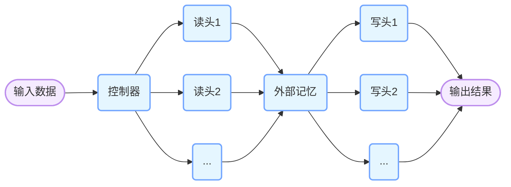

# 基于神经图灵机的复杂算法推理框架

> 关键词：神经图灵机、复杂算法推理、深度学习、记忆增强、计算模型

> 摘要：本文聚焦于基于神经图灵机的复杂算法推理框架。首先介绍了该研究的背景，包括目的、预期读者等内容。接着阐述了神经图灵机及复杂算法推理的核心概念和联系，通过文本示意图和Mermaid流程图进行直观展示。详细讲解了核心算法原理，并给出Python源代码进行说明。深入探讨了相关的数学模型和公式，结合具体例子进行解释。通过项目实战，从开发环境搭建到源代码实现和解读，展示了该框架的实际应用。分析了其在不同领域的实际应用场景，推荐了相关的学习资源、开发工具框架以及论文著作。最后总结了未来发展趋势与挑战，并对常见问题进行了解答，同时列出扩展阅读和参考资料，旨在为读者全面呈现基于神经图灵机的复杂算法推理框架的全貌。

## 1. 背景介绍 
### 1.1 目的和范围
随着人工智能技术的不断发展，对于复杂算法推理的需求日益增长。传统的神经网络在处理需要长期记忆和复杂逻辑推理的任务时存在一定的局限性。神经图灵机（Neural Turing Machine，NTM）作为一种具有可读写外部记忆的神经网络扩展模型，为解决复杂算法推理问题提供了新的思路。本文的目的在于深入探讨基于神经图灵机的复杂算法推理框架，详细介绍其原理、实现步骤以及实际应用场景。范围涵盖了从理论基础到代码实现，再到实际应用的整个过程，旨在为研究人员和开发者提供一个全面的参考。

### 1.2 预期读者
本文预期读者包括对人工智能、深度学习、神经网络等领域感兴趣的研究人员、开发者以及学生。对于想要了解神经图灵机如何应用于复杂算法推理的专业人士，本文将提供详细的技术讲解和实践指导。同时，对于初学者，也可以通过本文初步了解神经图灵机和复杂算法推理的基本概念和方法。

### 1.3 文档结构概述
本文将按照以下结构进行组织：首先介绍相关的核心概念和联系，通过文本示意图和流程图直观展示其架构；接着详细讲解核心算法原理，并给出Python源代码实现；然后介绍相关的数学模型和公式，并结合具体例子进行说明；通过项目实战，展示开发环境搭建、源代码实现和代码解读；分析该框架在不同领域的实际应用场景；推荐相关的学习资源、开发工具框架以及论文著作；最后总结未来发展趋势与挑战，解答常见问题，并列出扩展阅读和参考资料。

### 1.4 术语表
#### 1.4.1 核心术语定义
- **神经图灵机（Neural Turing Machine，NTM）**：一种具有可读写外部记忆的神经网络扩展模型，结合了神经网络的学习能力和图灵机的计算能力，能够处理需要长期记忆和复杂逻辑推理的任务。
- **复杂算法推理**：指对具有复杂逻辑结构和计算步骤的算法进行推理和执行的过程，需要考虑多个因素和步骤之间的相互关系。
- **外部记忆**：神经图灵机中用于存储信息的外部存储单元，类似于计算机的硬盘，可通过读写头进行信息的读写操作。
- **读写头**：神经图灵机中用于对外部记忆进行读写操作的组件，通过注意力机制决定在外部记忆的哪个位置进行读写。

#### 1.4.2 相关概念解释
- **注意力机制**：在神经图灵机中，注意力机制用于决定读写头在外部记忆中的位置，通过计算每个位置的注意力权重，使得读写头能够聚焦于特定的位置进行信息的读写。
- **深度学习**：一种基于神经网络的机器学习方法，通过构建多层神经网络来学习数据的特征和模式，在图像识别、自然语言处理等领域取得了显著的成果。
- **计算模型**：用于描述计算过程和算法的数学模型，神经图灵机可以看作是一种新型的计算模型，结合了神经网络和图灵机的特点。

#### 1.4.3 缩略词列表
- **NTM**：Neural Turing Machine（神经图灵机）
- **RNN**：Recurrent Neural Network（循环神经网络）
- **LSTM**：Long Short-Term Memory（长短期记忆网络）

## 2. 核心概念与联系 
### 核心概念原理
神经图灵机的核心思想是将神经网络与外部记忆相结合，以增强神经网络的记忆和推理能力。传统的神经网络在处理长序列数据时，容易出现梯度消失或梯度爆炸的问题，导致难以学习到长期的依赖关系。而神经图灵机通过引入外部记忆和读写头，能够在需要时从外部记忆中读取相关信息，并将处理结果写入外部记忆，从而实现对长期信息的有效管理和利用。

神经图灵机主要由控制器（Controller）、外部记忆（Memory）和读写头（Read/Write Heads）三部分组成。控制器通常是一个神经网络，负责根据输入数据和从外部记忆中读取的信息生成控制信号，控制读写头的操作和输出结果。外部记忆是一个二维矩阵，用于存储信息，每个位置可以存储一个向量。读写头根据控制器生成的控制信号，对外部记忆进行读写操作。

### 架构的文本示意图
```plaintext
+----------------------+
|       输入数据       |
+----------------------+
           |
           v
+----------------------+
|      控制器 (NN)     |
+----------------------+
           |
           +------+------+
           |      |      |
           v      v      v
+--------+ +--------+ +--------+
| 读头1  | | 读头2  | |...    |
+--------+ +--------+ +--------+
           |      |      |
           v      v      v
+----------------------+
|      外部记忆       |
+----------------------+
           ^      ^      ^
           |      |      |
+--------+ +--------+ +--------+
| 写头1  | | 写头2  | |...    |
+--------+ +--------+ +--------+
           |
           v
+----------------------+
|      输出结果       |
+----------------------+
```

### Mermaid流程图


## 3. 核心算法原理 & 具体操作步骤 
### 核心算法原理
神经图灵机的核心算法主要包括控制器的前向传播、读写头的操作以及外部记忆的更新。以下是具体的步骤：

1. **控制器前向传播**：控制器接收输入数据 $x_t$ 和从外部记忆中读取的信息 $r_{t-1}$，通过神经网络计算得到控制信号 $h_t$。控制信号 $h_t$ 包括用于控制读写头操作的参数，如注意力权重、位移参数等。

2. **读头操作**：读头根据控制信号 $h_t$ 计算注意力权重 $w_{r,t}$，通过注意力机制决定在外部记忆 $M_{t-1}$ 中的读取位置。然后，根据注意力权重 $w_{r,t}$ 对外部记忆 $M_{t-1}$ 进行加权求和，得到读取的信息 $r_t$。

3. **写头操作**：写头根据控制信号 $h_t$ 计算注意力权重 $w_{w,t}$ 和写入向量 $e_t$、$a_t$。首先，根据注意力权重 $w_{w,t}$ 确定在外部记忆 $M_{t-1}$ 中的写入位置。然后，通过擦除向量 $e_t$ 对外部记忆 $M_{t-1}$ 中相应位置的信息进行擦除，再通过添加向量 $a_t$ 向外部记忆中写入新的信息，得到更新后的外部记忆 $M_t$。

4. **输出结果**：控制器根据当前的控制信号 $h_t$ 和读取的信息 $r_t$ 计算输出结果 $y_t$。

### 具体操作步骤的Python源代码实现
```python
import torch
import torch.nn as nn
import torch.nn.functional as F

# 定义控制器
class Controller(nn.Module):
    def __init__(self, input_size, hidden_size, output_size):
        super(Controller, self).__init__()
        self.rnn = nn.LSTM(input_size, hidden_size)
        self.fc = nn.Linear(hidden_size, output_size)

    def forward(self, x, hidden):
        output, hidden = self.rnn(x.unsqueeze(0), hidden)
        output = self.fc(output.squeeze(0))
        return output, hidden

# 定义读头
class ReadHead(nn.Module):
    def __init__(self, hidden_size, memory_size, memory_dim):
        super(ReadHead, self).__init__()
        self.fc = nn.Linear(hidden_size, memory_size)

    def forward(self, h, M):
        w = F.softmax(self.fc(h), dim=0)
        r = torch.mm(w.unsqueeze(0), M)
        return r.squeeze(0), w

# 定义写头
class WriteHead(nn.Module):
    def __init__(self, hidden_size, memory_size, memory_dim):
        super(WriteHead, self).__init__()
        self.fc_w = nn.Linear(hidden_size, memory_size)
        self.fc_e = nn.Linear(hidden_size, memory_dim)
        self.fc_a = nn.Linear(hidden_size, memory_dim)

    def forward(self, h, M):
        w = F.softmax(self.fc_w(h), dim=0)
        e = torch.sigmoid(self.fc_e(h))
        a = self.fc_a(h)
        M_hat = M * (1 - torch.ger(w, e))
        M_new = M_hat + torch.ger(w, a)
        return M_new, w

# 定义神经图灵机
class NeuralTuringMachine(nn.Module):
    def __init__(self, input_size, hidden_size, output_size, memory_size, memory_dim):
        super(NeuralTuringMachine, self).__init__()
        self.controller = Controller(input_size + memory_dim, hidden_size, output_size + memory_size * 2 + memory_dim * 2)
        self.read_head = ReadHead(hidden_size, memory_size, memory_dim)
        self.write_head = WriteHead(hidden_size, memory_size, memory_dim)
        self.fc_output = nn.Linear(output_size + memory_dim, output_size)
        self.memory_size = memory_size
        self.memory_dim = memory_dim

    def forward(self, x, M, hidden):
        r, _ = self.read_head(hidden[0].squeeze(0), M)
        input_with_read = torch.cat((x, r), dim=0)
        output, hidden = self.controller(input_with_read, hidden)
        output_ctrl, w_read_params, w_write_params, e_params, a_params = torch.split(output, [self.controller.fc.out_features - self.memory_size * 2 - self.memory_dim * 2, self.memory_size, self.memory_size, self.memory_dim, self.memory_dim], dim=0)
        M_new, _ = self.write_head(torch.cat((hidden[0].squeeze(0), w_write_params, e_params, a_params), dim=0), M)
        output_final = self.fc_output(torch.cat((output_ctrl, r), dim=0))
        return output_final, M_new, hidden


# 示例使用
input_size = 10
hidden_size = 20
output_size = 5
memory_size = 30
memory_dim = 20

ntm = NeuralTuringMachine(input_size, hidden_size, output_size, memory_size, memory_dim)
x = torch.randn(input_size)
M = torch.randn(memory_size, memory_dim)
hidden = (torch.randn(1, 1, hidden_size), torch.randn(1, 1, hidden_size))

output, M_new, hidden_new = ntm(x, M, hidden)
print("Output:", output)
print("New Memory:", M_new)
```

## 4. 数学模型和公式 & 详细讲解 & 举例说明 
### 控制器前向传播
控制器通常使用循环神经网络（如LSTM）进行前向传播，其数学公式如下：

$$
\begin{aligned}
[h_t, c_t] &= \text{LSTM}(x_t \oplus r_{t-1}, [h_{t-1}, c_{t-1}]) \\
o_t &= \text{FC}(h_t)
\end{aligned}
$$

其中，$x_t$ 是输入数据，$r_{t-1}$ 是上一时刻从外部记忆中读取的信息，$\oplus$ 表示向量拼接操作，$[h_t, c_t]$ 是LSTM的隐藏状态和细胞状态，$o_t$ 是控制器的输出。

### 读头操作
读头根据控制器的输出计算注意力权重 $w_{r,t}$，并从外部记忆 $M_{t-1}$ 中读取信息 $r_t$，公式如下：

$$
\begin{aligned}
w_{r,t} &= \text{Softmax}(\text{FC}_r(h_t)) \\
r_t &= \sum_{i=1}^{N} w_{r,t}(i) M_{t-1}(i)
\end{aligned}
$$

其中，$\text{FC}_r$ 是一个全连接层，$N$ 是外部记忆的行数。

### 写头操作
写头根据控制器的输出计算注意力权重 $w_{w,t}$、擦除向量 $e_t$ 和添加向量 $a_t$，并更新外部记忆 $M_t$，公式如下：

$$
\begin{aligned}
w_{w,t} &= \text{Softmax}(\text{FC}_w(h_t)) \\
e_t &= \text{Sigmoid}(\text{FC}_e(h_t)) \\
a_t &= \text{FC}_a(h_t) \\
M_{t}(i) &= M_{t-1}(i) \odot (1 - w_{w,t}(i) e_t) + w_{w,t}(i) a_t
\end{aligned}
$$

其中，$\odot$ 表示逐元素相乘操作。

### 输出结果
控制器根据当前的控制信号 $h_t$ 和读取的信息 $r_t$ 计算输出结果 $y_t$，公式如下：

$$
y_t = \text{FC}_{out}(h_t \oplus r_t)
$$

### 举例说明
假设输入数据 $x_t$ 是一个长度为 10 的向量，外部记忆 $M_{t-1}$ 是一个 $30 \times 20$ 的矩阵，控制器的隐藏状态 $h_t$ 是一个长度为 20 的向量。读头根据 $h_t$ 计算注意力权重 $w_{r,t}$，通过加权求和从 $M_{t-1}$ 中读取一个长度为 20 的向量 $r_t$。写头根据 $h_t$ 计算注意力权重 $w_{w,t}$、擦除向量 $e_t$ 和添加向量 $a_t$，对 $M_{t-1}$ 进行更新得到 $M_t$。最后，控制器根据 $h_t$ 和 $r_t$ 计算输出结果 $y_t$。

## 5. 项目实战：代码实际案例和详细解释说明 
### 5.1  开发环境搭建
为了实现基于神经图灵机的复杂算法推理框架，我们需要搭建相应的开发环境。以下是具体的步骤：

1. **安装Python**：建议使用Python 3.7及以上版本，可以从Python官方网站（https://www.python.org/downloads/）下载并安装。

2. **安装深度学习框架**：本文使用PyTorch作为深度学习框架，可以根据自己的系统和CUDA版本选择合适的安装方式，具体安装命令可以参考PyTorch官方网站（https://pytorch.org/get-started/locally/）。

3. **安装其他依赖库**：还需要安装一些其他的依赖库，如NumPy、Matplotlib等，可以使用pip命令进行安装：
```bash
pip install numpy matplotlib
```

### 5.2  源代码详细实现和代码解读
以下是一个完整的基于神经图灵机的序列复制任务的代码示例：

```python
import torch
import torch.nn as nn
import torch.optim as optim
import numpy as np
import matplotlib.pyplot as plt

# 定义控制器
class Controller(nn.Module):
    def __init__(self, input_size, hidden_size, output_size):
        super(Controller, self).__init__()
        self.rnn = nn.LSTM(input_size, hidden_size)
        self.fc = nn.Linear(hidden_size, output_size)

    def forward(self, x, hidden):
        output, hidden = self.rnn(x.unsqueeze(0), hidden)
        output = self.fc(output.squeeze(0))
        return output, hidden

# 定义读头
class ReadHead(nn.Module):
    def __init__(self, hidden_size, memory_size, memory_dim):
        super(ReadHead, self).__init__()
        self.fc = nn.Linear(hidden_size, memory_size)

    def forward(self, h, M):
        w = torch.softmax(self.fc(h), dim=0)
        r = torch.mm(w.unsqueeze(0), M)
        return r.squeeze(0), w

# 定义写头
class WriteHead(nn.Module):
    def __init__(self, hidden_size, memory_size, memory_dim):
        super(WriteHead, self).__init__()
        self.fc_w = nn.Linear(hidden_size, memory_size)
        self.fc_e = nn.Linear(hidden_size, memory_dim)
        self.fc_a = nn.Linear(hidden_size, memory_dim)

    def forward(self, h, M):
        w = torch.softmax(self.fc_w(h), dim=0)
        e = torch.sigmoid(self.fc_e(h))
        a = self.fc_a(h)
        M_hat = M * (1 - torch.ger(w, e))
        M_new = M_hat + torch.ger(w, a)
        return M_new, w

# 定义神经图灵机
class NeuralTuringMachine(nn.Module):
    def __init__(self, input_size, hidden_size, output_size, memory_size, memory_dim):
        super(NeuralTuringMachine, self).__init__()
        self.controller = Controller(input_size + memory_dim, hidden_size, output_size + memory_size * 2 + memory_dim * 2)
        self.read_head = ReadHead(hidden_size, memory_size, memory_dim)
        self.write_head = WriteHead(hidden_size, memory_size, memory_dim)
        self.fc_output = nn.Linear(output_size + memory_dim, output_size)
        self.memory_size = memory_size
        self.memory_dim = memory_dim

    def forward(self, x, M, hidden):
        r, _ = self.read_head(hidden[0].squeeze(0), M)
        input_with_read = torch.cat((x, r), dim=0)
        output, hidden = self.controller(input_with_read, hidden)
        output_ctrl, w_read_params, w_write_params, e_params, a_params = torch.split(output, [self.controller.fc.out_features - self.memory_size * 2 - self.memory_dim * 2, self.memory_size, self.memory_size, self.memory_dim, self.memory_dim], dim=0)
        M_new, _ = self.write_head(torch.cat((hidden[0].squeeze(0), w_write_params, e_params, a_params), dim=0), M)
        output_final = self.fc_output(torch.cat((output_ctrl, r), dim=0))
        return output_final, M_new, hidden


# 生成序列复制任务的数据
def generate_data(seq_length, input_dim):
    seq = torch.randint(0, 2, (seq_length, input_dim)).float()
    end_marker = torch.zeros(input_dim)
    end_marker[-1] = 1
    input_seq = torch.cat((seq, end_marker.unsqueeze(0)), dim=0)
    target_seq = seq
    return input_seq, target_seq


# 训练模型
def train_model(model, criterion, optimizer, num_epochs, seq_length, input_dim):
    losses = []
    for epoch in range(num_epochs):
        input_seq, target_seq = generate_data(seq_length, input_dim)
        M = torch.zeros(model.memory_size, model.memory_dim)
        hidden = (torch.zeros(1, 1, model.controller.rnn.hidden_size), torch.zeros(1, 1, model.controller.rnn.hidden_size))
        outputs = []
        for t in range(input_seq.size(0)):
            output, M, hidden = model(input_seq[t], M, hidden)
            outputs.append(output)
        for t in range(target_seq.size(0)):
            output, M, hidden = model(torch.zeros(input_dim), M, hidden)
            outputs.append(output)
        outputs = torch.stack(outputs)[input_seq.size(0):]
        loss = criterion(outputs, target_seq)
        optimizer.zero_grad()
        loss.backward()
        optimizer.step()
        losses.append(loss.item())
        if (epoch + 1) % 100 == 0:
            print(f'Epoch [{epoch + 1}/{num_epochs}], Loss: {loss.item():.4f}')
    return losses


# 超参数设置
input_dim = 8
hidden_size = 100
output_dim = input_dim
memory_size = 128
memory_dim = 20
seq_length = 10
num_epochs = 1000
learning_rate = 0.001

# 初始化模型、损失函数和优化器
model = NeuralTuringMachine(input_dim, hidden_size, output_dim, memory_size, memory_dim)
criterion = nn.BCELoss()
optimizer = optim.Adam(model.parameters(), lr=learning_rate)

# 训练模型
losses = train_model(model, criterion, optimizer, num_epochs, seq_length, input_dim)

# 绘制损失曲线
plt.plot(losses)
plt.xlabel('Epoch')
plt.ylabel('Loss')
plt.title('Training Loss')
plt.show()
```

### 5.3  代码解读与分析
1. **控制器（Controller）**：使用LSTM作为控制器，接收输入数据和从外部记忆中读取的信息，通过全连接层输出控制信号。
2. **读头（ReadHead）**：根据控制器的输出计算注意力权重，从外部记忆中读取信息。
3. **写头（WriteHead）**：根据控制器的输出计算注意力权重、擦除向量和添加向量，对外部记忆进行更新。
4. **神经图灵机（NeuralTuringMachine）**：将控制器、读头和写头组合在一起，实现整个神经图灵机的前向传播过程。
5. **数据生成**：生成序列复制任务的数据，包括输入序列和目标序列。
6. **训练过程**：在每个epoch中，生成一个新的序列，将输入序列依次输入到神经图灵机中，然后在没有输入的情况下让神经图灵机输出目标序列，计算损失并进行反向传播更新模型参数。
7. **损失曲线绘制**：绘制训练过程中的损失曲线，观察模型的训练效果。

## 6. 实际应用场景 
基于神经图灵机的复杂算法推理框架在许多领域都有潜在的应用价值，以下是一些具体的应用场景：

### 自然语言处理
- **机器翻译**：神经图灵机可以处理长句子和复杂的语法结构，通过外部记忆存储上下文信息，提高机器翻译的准确性和流畅性。
- **问答系统**：在问答系统中，神经图灵机可以根据用户的问题从外部记忆中检索相关信息，并进行推理和回答，提高问答的质量和效率。

### 图像识别
- **图像描述生成**：神经图灵机可以结合图像特征和外部记忆中的知识，生成更准确、详细的图像描述。
- **目标检测和跟踪**：在目标检测和跟踪任务中，神经图灵机可以利用外部记忆存储目标的历史信息，提高目标检测和跟踪的准确性和稳定性。

### 机器人控制
- **路径规划**：神经图灵机可以根据机器人的当前位置和环境信息，从外部记忆中检索相关的路径规划知识，进行复杂的路径规划。
- **任务执行**：在机器人执行任务的过程中，神经图灵机可以根据任务的要求和外部记忆中的知识，进行实时的决策和调整，提高机器人的智能水平和执行能力。

### 金融领域
- **风险评估**：神经图灵机可以处理大量的金融数据和复杂的风险模型，通过外部记忆存储历史数据和风险评估结果，提高风险评估的准确性和可靠性。
- **投资决策**：在投资决策中，神经图灵机可以根据市场信息和外部记忆中的投资策略，进行实时的投资决策，提高投资收益和降低风险。

## 7. 工具和资源推荐
### 7.1 学习资源推荐
#### 7.1.1 书籍推荐
- 《深度学习》（Deep Learning）：由Ian Goodfellow、Yoshua Bengio和Aaron Courville合著，是深度学习领域的经典教材，涵盖了神经网络、卷积神经网络、循环神经网络等基础知识，也包括神经图灵机等高级内容。
- 《Python深度学习》（Deep Learning with Python）：由Francois Chollet（Keras库的作者）所著，通过大量的代码示例和实际项目，介绍了如何使用Python和Keras进行深度学习开发，对理解神经图灵机的实现有很大帮助。

#### 7.1.2 在线课程
- Coursera上的“深度学习专项课程”（Deep Learning Specialization）：由Andrew Ng教授授课，包括神经网络、卷积神经网络、循环神经网络等多个课程，对深度学习的原理和应用进行了系统的介绍。
- edX上的“强化学习”（Reinforcement Learning）：介绍了强化学习的基本概念和算法，神经图灵机在强化学习中也有一定的应用，该课程可以帮助读者进一步理解神经图灵机的应用场景。

#### 7.1.3 技术博客和网站
- Medium上的“Towards Data Science”：汇集了大量关于数据科学、机器学习和深度学习的文章，其中有很多关于神经图灵机的介绍和实践经验分享。
- arXiv.org：是一个预印本数据库，提供了大量的学术论文，包括神经图灵机的最新研究成果，可以及时了解该领域的最新动态。

### 7.2 开发工具框架推荐
#### 7.2.1 IDE和编辑器
- PyCharm：是一款专门为Python开发设计的集成开发环境，具有代码自动补全、调试、版本控制等功能，非常适合进行深度学习项目的开发。
- Jupyter Notebook：是一个交互式的开发环境，可以将代码、文本、图像等内容整合在一起，方便进行代码的编写、调试和展示，在深度学习研究中广泛使用。

#### 7.2.2 调试和性能分析工具
- TensorBoard：是TensorFlow提供的一个可视化工具，可以用于可视化训练过程中的损失曲线、准确率等指标，还可以查看模型的结构和参数分布，帮助调试和优化模型。
- PyTorch Profiler：是PyTorch提供的性能分析工具，可以分析模型的运行时间、内存使用等情况，帮助找出性能瓶颈并进行优化。

#### 7.2.3 相关框架和库
- PyTorch：是一个开源的深度学习框架，提供了丰富的神经网络层和优化算法，易于使用和扩展，非常适合实现神经图灵机。
- NumPy：是Python的一个科学计算库，提供了高效的多维数组操作和数学函数，在深度学习中广泛用于数据处理和计算。

### 7.3 相关论文著作推荐
#### 7.3.1 经典论文
- “Neural Turing Machines”：由Alex Graves、Greg Wayne和Ivo Danihelka发表，首次提出了神经图灵机的概念，并详细介绍了其原理和实现方法，是该领域的经典论文。
- “Memory Networks”：由Jason Weston、Sumit Chopra和Antoine Bordes发表，提出了记忆网络的概念，与神经图灵机有一定的相似性，对理解神经图灵机的思想有很大帮助。

#### 7.3.2 最新研究成果
- 可以通过arXiv.org等学术数据库搜索关于神经图灵机的最新研究成果，了解该领域的最新发展趋势和技术创新。

#### 7.3.3 应用案例分析
- 一些学术会议（如NeurIPS、ICML等）的论文集中会有关于神经图灵机在不同领域应用的案例分析，可以从中学习到实际应用中的经验和技巧。

## 8. 总结：未来发展趋势与挑战
### 未来发展趋势
- **与其他技术的融合**：神经图灵机可能会与强化学习、生成对抗网络等技术相结合，进一步拓展其应用领域和功能。例如，将神经图灵机应用于强化学习中，可以提高智能体的记忆和推理能力，使其在复杂环境中做出更智能的决策。
- **硬件加速**：随着硬件技术的不断发展，专门为深度学习设计的硬件（如GPU、TPU等）将不断优化，神经图灵机的训练和推理速度将得到进一步提升，从而推动其在实际应用中的广泛使用。
- **理论研究的深入**：对神经图灵机的理论研究将不断深入，包括其计算能力、表达能力等方面的研究，为其在更复杂任务中的应用提供理论支持。

### 挑战
- **训练难度**：神经图灵机的训练相对复杂，需要大量的计算资源和时间。如何提高训练效率，降低训练成本，是当前面临的一个挑战。
- **可解释性**：神经图灵机作为一种深度学习模型，其内部的决策过程和推理机制往往难以解释。在一些对可解释性要求较高的领域（如医疗、金融等），如何提高神经图灵机的可解释性是一个亟待解决的问题。
- **数据需求**：神经图灵机需要大量的标注数据进行训练，而在一些实际应用场景中，数据的获取和标注往往比较困难。如何在数据有限的情况下提高神经图灵机的性能，是一个需要研究的问题。

## 9. 附录：常见问题与解答
### 问题1：神经图灵机与传统神经网络有什么区别？
答：传统神经网络在处理长序列数据时容易出现梯度消失或梯度爆炸的问题，难以学习到长期的依赖关系。而神经图灵机引入了外部记忆和读写头，能够在需要时从外部记忆中读取相关信息，并将处理结果写入外部记忆，从而实现对长期信息的有效管理和利用，增强了神经网络的记忆和推理能力。

### 问题2：神经图灵机的训练时间为什么比较长？
答：神经图灵机的训练时间较长主要有以下几个原因：一是神经图灵机的结构相对复杂，包含控制器、读写头和外部记忆等多个组件，需要学习的参数较多；二是神经图灵机的训练过程需要进行大量的矩阵运算，计算量较大；三是神经图灵机在处理复杂任务时需要学习复杂的逻辑推理和记忆模式，需要更多的训练数据和迭代次数来收敛。

### 问题3：如何提高神经图灵机的可解释性？
答：提高神经图灵机的可解释性可以从以下几个方面入手：一是设计可解释的模型结构，例如采用更简单的控制器和读写头结构，减少模型的复杂度；二是引入可视化技术，将神经图灵机的决策过程和记忆使用情况进行可视化展示，帮助人们理解模型的工作原理；三是结合先验知识和规则，在模型中引入一些可解释的规则和约束，提高模型的可解释性。

### 问题4：神经图灵机在实际应用中有哪些限制？
答：神经图灵机在实际应用中存在一些限制，主要包括：一是训练成本较高，需要大量的计算资源和时间；二是可解释性较差，难以理解模型的决策过程和推理机制；三是对数据的需求较大，需要大量的标注数据进行训练；四是在处理大规模数据和复杂任务时，模型的性能和效率可能会受到影响。

## 10. 扩展阅读 & 参考资料
- Graves, A., Wayne, G., & Danihelka, I. (2014). Neural Turing Machines. arXiv preprint arXiv:1410.5401.
- Weston, J., Chopra, S., & Bordes, A. (2014). Memory Networks. arXiv preprint arXiv:1410.3916.
- Goodfellow, I., Bengio, Y., & Courville, A. (2016). Deep Learning. MIT Press.
- Chollet, F. (2017). Deep Learning with Python. Manning Publications.

作者：AI天才研究院/AI Genius Institute & 禅与计算机程序设计艺术 /Zen And The Art of Computer Programming