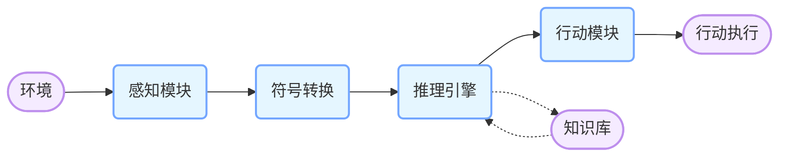

# 基于神经符号AI的可解释Agent设计

> 关键词：神经符号AI、可解释Agent、符号推理、神经网络、智能决策

> 摘要：本文聚焦于基于神经符号AI的可解释Agent设计。首先介绍了相关背景，包括研究目的、预期读者等内容。接着阐述了神经符号AI和可解释Agent的核心概念及联系，给出了相应的文本示意图和Mermaid流程图。详细讲解了核心算法原理，并用Python代码进行说明，同时介绍了相关数学模型和公式。通过项目实战，展示了代码实际案例并进行详细解读。分析了该技术的实际应用场景，推荐了学习资源、开发工具框架以及相关论文著作。最后总结了未来发展趋势与挑战，还提供了常见问题解答和扩展阅读参考资料，旨在为研究者和开发者提供全面的技术指导。

## 1. 背景介绍 
### 1.1 目的和范围
随着人工智能技术的飞速发展，智能Agent在各个领域得到了广泛应用。然而，许多现有的智能Agent基于深度学习模型，其决策过程往往是黑盒的，缺乏可解释性，这在一些对安全性和可靠性要求较高的场景中成为了应用的瓶颈。本研究的目的在于设计一种基于神经符号AI的可解释Agent，将神经网络强大的感知能力与符号推理的可解释性相结合，使Agent的决策过程能够被人类理解和信任。

本研究的范围涵盖了神经符号AI和可解释Agent的核心概念、算法原理、数学模型，以及实际项目中的开发和应用。通过理论分析和实践案例，探讨如何构建具有可解释性的智能Agent。

### 1.2 预期读者
本文预期读者包括人工智能领域的研究者、开发者、学生，以及对智能Agent可解释性感兴趣的专业人士。对于想要深入了解神经符号AI和可解释Agent技术的人员，本文提供了系统的知识体系和实践指导。

### 1.3 文档结构概述
本文将按照以下结构进行组织：首先介绍核心概念与联系，帮助读者理解神经符号AI和可解释Agent的基本原理和架构；接着详细讲解核心算法原理和具体操作步骤，并用Python代码进行实现；然后介绍相关的数学模型和公式，并举例说明；通过项目实战，展示如何在实际中开发基于神经符号AI的可解释Agent；分析该技术的实际应用场景；推荐学习资源、开发工具框架和相关论文著作；最后总结未来发展趋势与挑战，提供常见问题解答和扩展阅读参考资料。

### 1.4 术语表
#### 1.4.1 核心术语定义
- **神经符号AI**：将神经网络和符号推理相结合的人工智能方法，旨在充分发挥神经网络的感知能力和符号推理的可解释性。
- **可解释Agent**：能够以人类可理解的方式解释其决策过程和行为的智能Agent。
- **符号推理**：基于符号逻辑进行推理和决策的方法，具有明确的语义和规则。
- **神经网络**：一种模仿人类神经系统的计算模型，用于处理复杂的非线性问题。

#### 1.4.2 相关概念解释
- **知识表示**：将知识以某种形式表示出来，以便计算机能够处理和推理。在神经符号AI中，知识可以用符号表示，也可以用神经网络的参数表示。
- **推理引擎**：根据已知的知识和规则进行推理和决策的系统。在可解释Agent中，推理引擎负责根据感知到的信息和内部知识进行决策，并解释决策的依据。
- **感知模块**：负责从环境中获取信息的模块，通常使用神经网络实现。感知模块将环境信息转换为Agent能够理解的表示形式。

#### 1.4.3 缩略词列表
- **AI**：Artificial Intelligence，人工智能
- **NN**：Neural Network，神经网络
- **KB**：Knowledge Base，知识库

## 2. 核心概念与联系 

### 2.1 神经符号AI原理
神经符号AI的核心思想是将神经网络和符号推理相结合。神经网络具有强大的感知能力，能够处理复杂的输入数据，如图像、语音等。而符号推理则具有明确的语义和规则，能够进行逻辑推理和决策。神经符号AI通过将神经网络的输出转换为符号表示，然后利用符号推理进行决策，同时将符号推理的结果反馈给神经网络，实现两者的协同工作。

### 2.2 可解释Agent架构
可解释Agent主要由感知模块、推理引擎和行动模块组成。感知模块使用神经网络从环境中获取信息，并将其转换为符号表示。推理引擎根据知识库中的知识和规则进行推理和决策，并生成可解释的决策依据。行动模块根据推理引擎的决策执行相应的动作。

### 2.3 文本示意图
```plaintext
              +-----------------+
              |  感知模块 (NN)  |
              +-----------------+
                     |
                     v
              +-----------------+
              |  符号转换模块   |
              +-----------------+
                     |
                     v
              +-----------------+
              |  推理引擎 (KB)  |
              +-----------------+
                     |
                     v
              +-----------------+
              |  行动模块       |
              +-----------------+
```

### 2.4 Mermaid流程图


## 3. 核心算法原理 & 具体操作步骤 

### 3.1 感知模块算法
感知模块通常使用神经网络进行实现，例如卷积神经网络（CNN）用于图像感知，循环神经网络（RNN）用于序列数据感知。以下是一个简单的CNN感知模块的Python代码示例：

```python
import torch
import torch.nn as nn

class PerceptionModule(nn.Module):
    def __init__(self):
        super(PerceptionModule, self).__init__()
        self.conv1 = nn.Conv2d(3, 16, kernel_size=3, padding=1)
        self.relu1 = nn.ReLU()
        self.pool1 = nn.MaxPool2d(2)
        self.conv2 = nn.Conv2d(16, 32, kernel_size=3, padding=1)
        self.relu2 = nn.ReLU()
        self.pool2 = nn.MaxPool2d(2)
        self.fc1 = nn.Linear(32 * 8 * 8, 128)
        self.relu3 = nn.ReLU()
        self.fc2 = nn.Linear(128, 10)

    def forward(self, x):
        x = self.pool1(self.relu1(self.conv1(x)))
        x = self.pool2(self.relu2(self.conv2(x)))
        x = x.view(-1, 32 * 8 * 8)
        x = self.relu3(self.fc1(x))
        x = self.fc2(x)
        return x
```

### 3.2 符号转换模块算法
符号转换模块将神经网络的输出转换为符号表示。可以使用阈值法或聚类算法将连续的输出值转换为离散的符号。以下是一个简单的阈值法符号转换代码示例：

```python
def symbol_conversion(output):
    symbols = []
    for value in output:
        if value > 0.5:
            symbols.append(1)
        else:
            symbols.append(0)
    return symbols
```

### 3.3 推理引擎算法
推理引擎根据知识库中的知识和规则进行推理和决策。可以使用基于规则的推理方法，如前向推理或后向推理。以下是一个简单的前向推理代码示例：

```python
class RuleBasedReasoner:
    def __init__(self, knowledge_base):
        self.knowledge_base = knowledge_base

    def forward_inference(self, symbols):
        conclusions = []
        for rule in self.knowledge_base:
            antecedent, consequent = rule
            if all([symbols[i] == antecedent[i] for i in range(len(antecedent))]):
                conclusions.append(consequent)
        return conclusions
```

### 3.4 具体操作步骤
1. **数据输入**：将环境信息输入到感知模块。
2. **感知处理**：感知模块使用神经网络对输入数据进行处理，得到输出结果。
3. **符号转换**：将感知模块的输出转换为符号表示。
4. **推理决策**：推理引擎根据符号表示和知识库进行推理，得到决策结果。
5. **行动执行**：行动模块根据推理引擎的决策执行相应的动作。

## 4. 数学模型和公式 & 详细讲解 & 举例说明 

### 4.1 神经网络数学模型
神经网络的基本单元是神经元，其输入输出关系可以用以下公式表示：

$$
y = f\left(\sum_{i=1}^{n} w_{i}x_{i} + b\right)
$$

其中，$x_{i}$ 是输入值，$w_{i}$ 是权重，$b$ 是偏置，$f$ 是激活函数。

例如，在一个简单的单层神经网络中，有三个输入神经元 $x_1, x_2, x_3$，一个输出神经元 $y$，权重分别为 $w_1 = 0.2, w_2 = 0.3, w_3 = 0.4$，偏置 $b = 0.1$，激活函数为 sigmoid 函数：

$$
f(z) = \frac{1}{1 + e^{-z}}
$$

输入值为 $x_1 = 0.5, x_2 = 0.6, x_3 = 0.7$，则计算过程如下：

$$
z = w_1x_1 + w_2x_2 + w_3x_3 + b = 0.2\times0.5 + 0.3\times0.6 + 0.4\times0.7 + 0.1 = 0.6
$$

$$
y = f(z) = \frac{1}{1 + e^{-0.6}} \approx 0.645
$$

### 4.2 符号推理数学模型
符号推理通常基于逻辑规则进行，例如命题逻辑中的蕴含关系：

$$
A \rightarrow B
$$

表示如果 $A$ 为真，则 $B$ 为真。在推理过程中，如果已知 $A$ 为真，则可以推出 $B$ 为真。

例如，知识库中有以下规则：

- 如果天气晴朗（$A$），则去野餐（$B$）：$A \rightarrow B$
- 如果天气晴朗（$A$）且温度适宜（$C$），则去公园散步（$D$）：$A \land C \rightarrow D$

已知天气晴朗（$A$ 为真），温度适宜（$C$ 为真），则可以根据规则推出去公园散步（$D$ 为真）。

### 4.3 神经符号AI融合模型
神经符号AI的融合模型可以用以下公式表示：

$$
\mathbf{s} = \mathcal{S}(\mathbf{y})
$$

其中，$\mathbf{y}$ 是神经网络的输出，$\mathcal{S}$ 是符号转换函数，$\mathbf{s}$ 是符号表示。

$$
\mathbf{c} = \mathcal{R}(\mathbf{s}, \mathcal{K})
$$

其中，$\mathcal{R}$ 是推理函数，$\mathcal{K}$ 是知识库，$\mathbf{c}$ 是推理结论。

例如，神经网络的输出 $\mathbf{y} = [0.6, 0.3, 0.8]$，通过符号转换函数 $\mathcal{S}$ 转换为符号表示 $\mathbf{s} = [1, 0, 1]$，知识库 $\mathcal{K}$ 中有规则 $[1, 0, 1] \rightarrow [1]$，则通过推理函数 $\mathcal{R}$ 可以得到推理结论 $\mathbf{c} = [1]$。

## 5. 项目实战：代码实际案例和详细解释说明 

### 5.1  开发环境搭建
#### 5.1.1 安装Python
首先需要安装Python，建议使用Python 3.7及以上版本。可以从Python官方网站（https://www.python.org/downloads/）下载安装包进行安装。

#### 5.1.2 安装必要的库
使用pip安装必要的库，如PyTorch、NumPy等：

```sh
pip install torch numpy
```

### 5.2  源代码详细实现和代码解读
以下是一个完整的基于神经符号AI的可解释Agent的代码示例：

```python
import torch
import torch.nn as nn

# 感知模块
class PerceptionModule(nn.Module):
    def __init__(self):
        super(PerceptionModule, self).__init__()
        self.fc1 = nn.Linear(2, 10)
        self.relu = nn.ReLU()
        self.fc2 = nn.Linear(10, 2)

    def forward(self, x):
        x = self.relu(self.fc1(x))
        x = self.fc2(x)
        return x

# 符号转换模块
def symbol_conversion(output):
    symbols = []
    for value in output:
        if value > 0:
            symbols.append(1)
        else:
            symbols.append(0)
    return symbols

# 推理引擎
class RuleBasedReasoner:
    def __init__(self, knowledge_base):
        self.knowledge_base = knowledge_base

    def forward_inference(self, symbols):
        conclusions = []
        for rule in self.knowledge_base:
            antecedent, consequent = rule
            if all([symbols[i] == antecedent[i] for i in range(len(antecedent))]):
                conclusions.append(consequent)
        return conclusions

# 主程序
if __name__ == "__main__":
    # 初始化感知模块
    perception_module = PerceptionModule()

    # 知识库
    knowledge_base = [
        ([1, 0], [1]),
        ([0, 1], [0])
    ]

    # 推理引擎
    reasoner = RuleBasedReasoner(knowledge_base)

    # 输入数据
    input_data = torch.tensor([[0.5, -0.3]], dtype=torch.float32)

    # 感知处理
    output = perception_module(input_data)

    # 符号转换
    symbols = symbol_conversion(output[0].tolist())

    # 推理决策
    conclusions = reasoner.forward_inference(symbols)

    print("输入数据:", input_data)
    print("感知模块输出:", output)
    print("符号表示:", symbols)
    print("推理结论:", conclusions)
```

### 5.3  代码解读与分析
- **感知模块**：`PerceptionModule` 类是一个简单的两层全连接神经网络，用于处理输入数据。输入数据经过第一层全连接层和ReLU激活函数，再经过第二层全连接层得到输出。
- **符号转换模块**：`symbol_conversion` 函数将神经网络的输出转换为符号表示，使用阈值法将大于0的值转换为1，小于等于0的值转换为0。
- **推理引擎**：`RuleBasedReasoner` 类实现了基于规则的前向推理。根据知识库中的规则和符号表示进行推理，得到决策结论。
- **主程序**：初始化感知模块和推理引擎，输入数据经过感知处理、符号转换和推理决策，最终输出推理结论。

## 6. 实际应用场景 
### 6.1 医疗诊断
在医疗诊断领域，可解释Agent可以帮助医生进行疾病诊断。感知模块可以从患者的病历、检查报告等数据中提取信息，符号转换模块将这些信息转换为符号表示，推理引擎根据医学知识库中的规则进行推理，给出诊断结果和解释。例如，根据患者的症状（如发热、咳嗽等）和检查指标（如血常规、X光等），推理出可能的疾病，并解释诊断的依据。

### 6.2 自动驾驶
在自动驾驶中，可解释Agent可以提高系统的安全性和可靠性。感知模块通过摄像头、雷达等传感器获取环境信息，符号转换模块将这些信息转换为符号表示，推理引擎根据交通规则和驾驶经验进行决策，如是否加速、减速、转弯等，并解释决策的原因。例如，当遇到前方有行人时，可解释Agent可以解释为什么要减速停车。

### 6.3 金融风险评估
在金融领域，可解释Agent可以用于风险评估。感知模块从金融数据中提取信息，如客户的信用记录、财务状况等，符号转换模块将这些信息转换为符号表示，推理引擎根据金融规则和风险模型进行推理，评估客户的信用风险，并解释评估的依据。例如，根据客户的收入、负债等情况，推理出客户的信用风险等级，并解释为什么给出这样的评估结果。

## 7. 工具和资源推荐
### 7.1 学习资源推荐
#### 7.1.1 书籍推荐
- 《人工智能：一种现代的方法》：全面介绍了人工智能的基本概念、算法和应用，是人工智能领域的经典教材。
- 《深度学习》：详细介绍了深度学习的原理、算法和实践，适合深入学习深度学习的读者。
- 《知识表示与推理》：讲解了知识表示和推理的方法和技术，对于理解符号推理有很大帮助。

#### 7.1.2 在线课程
- Coursera上的“人工智能基础”课程：由知名教授授课，系统介绍了人工智能的基础知识和方法。
- edX上的“深度学习”课程：提供了深度学习的理论和实践教学，包括TensorFlow和PyTorch的使用。
- Udemy上的“神经符号AI实战”课程：专门介绍神经符号AI的原理和应用，通过实际案例进行讲解。

#### 7.1.3 技术博客和网站
- arXiv：提供了大量的人工智能领域的学术论文，包括神经符号AI的最新研究成果。
- Medium：有许多人工智能领域的技术博客，分享了最新的技术动态和实践经验。
- Towards Data Science：专注于数据科学和人工智能领域的技术文章，内容丰富实用。

### 7.2 开发工具框架推荐
#### 7.2.1 IDE和编辑器
- PyCharm：一款功能强大的Python集成开发环境，提供了代码编辑、调试、版本控制等功能。
- Jupyter Notebook：交互式的开发环境，适合进行数据探索和模型实验。
- Visual Studio Code：轻量级的代码编辑器，支持多种编程语言和插件扩展。

#### 7.2.2 调试和性能分析工具
- PyTorch Profiler：用于分析PyTorch模型的性能，找出性能瓶颈。
- TensorBoard：用于可视化深度学习模型的训练过程和结果，方便调试和优化。
- cProfile：Python内置的性能分析工具，用于分析Python代码的执行时间和调用关系。

#### 7.2.3 相关框架和库
- PyTorch：一个开源的深度学习框架，提供了丰富的神经网络模型和工具。
- TensorFlow：另一个广泛使用的深度学习框架，具有强大的分布式训练和部署能力。
- SymPy：用于符号计算的Python库，可以进行符号推理和数学公式推导。

### 7.3 相关论文著作推荐
#### 7.3.1 经典论文
- "Neural-Symbolic Learning and Reasoning: Contributions and Challenges"：介绍了神经符号AI的发展历程、主要方法和面临的挑战。
- "Explainable AI: A Systematic Review of the State-of-the-Art"：对可解释AI的研究现状进行了系统的综述。
- "Knowledge Representation and Reasoning for Autonomous Agents"：探讨了知识表示和推理在自主Agent中的应用。

#### 7.3.2 最新研究成果
- 关注NeurIPS、ICML、AAAI等顶级人工智能会议上的相关论文，了解神经符号AI和可解释Agent的最新研究进展。
- 查阅《Journal of Artificial Intelligence Research》、《Artificial Intelligence》等学术期刊上的文章，获取最新的研究成果。

#### 7.3.3 应用案例分析
- 参考一些实际应用案例的论文，如医疗诊断、自动驾驶、金融风险评估等领域的可解释Agent应用案例，学习如何将技术应用到实际场景中。

## 8. 总结：未来发展趋势与挑战
### 8.1 未来发展趋势
- **更强的融合能力**：未来神经符号AI将进一步加强神经网络和符号推理的融合，提高Agent的智能水平和可解释性。例如，开发更加高效的符号转换方法和推理算法，使两者能够更好地协同工作。
- **跨领域应用拓展**：可解释Agent将在更多领域得到应用，如教育、农业、工业制造等。通过将神经符号AI技术与各领域的知识相结合，为解决实际问题提供更有效的方案。
- **与其他技术的结合**：神经符号AI可能会与区块链、物联网等技术相结合，创造出更加智能、安全和可信赖的系统。例如，利用区块链的不可篡改特性来保证知识的可靠性，利用物联网设备获取更丰富的环境信息。

### 8.2 挑战
- **知识表示和获取难题**：如何有效地表示和获取领域知识是一个挑战。知识的表示需要兼顾可解释性和计算效率，而知识的获取则需要解决数据的质量和数量问题。
- **计算资源需求**：神经符号AI通常需要大量的计算资源，尤其是在处理大规模数据和复杂推理时。如何降低计算成本，提高系统的效率是一个亟待解决的问题。
- **可解释性评估标准**：目前缺乏统一的可解释性评估标准，难以准确衡量Agent的可解释性程度。建立科学合理的评估标准对于可解释Agent的发展至关重要。

## 9. 附录：常见问题与解答
### 9.1 神经符号AI与传统AI有什么区别？
传统AI主要分为基于符号推理的方法和基于神经网络的方法。符号推理方法具有可解释性，但难以处理复杂的感知任务；神经网络方法具有强大的感知能力，但决策过程缺乏可解释性。神经符号AI将两者相结合，充分发挥了它们的优势，既能够处理复杂的感知任务，又能够提供可解释的决策依据。

### 9.2 如何提高可解释Agent的推理效率？
可以从以下几个方面提高可解释Agent的推理效率：优化推理算法，减少不必要的推理步骤；采用并行计算技术，提高推理的并行度；对知识库进行合理的组织和管理，提高知识的检索效率。

### 9.3 可解释Agent的可解释性是否会影响其性能？
在一定程度上，可解释性可能会对性能产生影响。为了实现可解释性，需要增加一些额外的计算和处理步骤，如符号转换和推理。然而，通过合理的设计和优化，可以在保证可解释性的前提下，尽量减少对性能的影响。

## 10. 扩展阅读 & 参考资料
### 10.1 扩展阅读
- 阅读相关的研究报告和技术文档，深入了解神经符号AI和可解释Agent的最新发展动态。
- 参与相关的学术论坛和社区，与其他研究者和开发者交流经验和想法。

### 10.2 参考资料
- 相关的学术论文、书籍和在线课程，如前面推荐的学习资源。
- 开源代码库，如GitHub上的神经符号AI和可解释Agent相关项目，学习他人的代码实现和实践经验。

作者：AI天才研究院/AI Genius Institute & 禅与计算机程序设计艺术 /Zen And The Art of Computer Programming