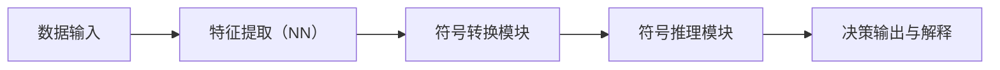

# 基于神经符号推理的可解释AI决策系统设计

> 关键词：神经符号推理、可解释AI、决策系统设计、符号逻辑、神经网络

> 摘要：本文聚焦于基于神经符号推理的可解释AI决策系统设计。首先介绍了该研究的背景，包括目的、预期读者、文档结构和相关术语。接着阐述了神经符号推理和可解释AI决策系统的核心概念及其联系，给出了原理和架构的文本示意图与Mermaid流程图。详细讲解了核心算法原理并使用Python代码进行示例，同时介绍了相关的数学模型和公式。通过项目实战，展示了开发环境搭建、源代码实现与解读。探讨了该系统的实际应用场景，推荐了学习资源、开发工具框架以及相关论文著作。最后总结了未来发展趋势与挑战，还提供了常见问题解答和扩展阅读参考资料，旨在为该领域的研究和实践提供全面且深入的指导。

## 1. 背景介绍 
### 1.1 目的和范围
在当今人工智能飞速发展的时代，AI系统在各个领域的应用越来越广泛，如医疗诊断、金融风险评估、自动驾驶等。然而，大多数现有的AI模型，尤其是深度神经网络，往往被视为“黑盒”，其决策过程难以理解和解释。这在一些对安全性、可靠性和可问责性要求较高的领域，成为了阻碍AI技术进一步应用和发展的关键问题。

基于神经符号推理的可解释AI决策系统设计的目的在于构建一种既能利用神经网络强大的学习能力，又能结合符号逻辑的可解释性，从而实现可解释的AI决策。本研究的范围涵盖了神经符号推理的基本原理、可解释AI决策系统的架构设计、核心算法的实现、数学模型的构建，以及通过实际项目案例展示系统的应用和效果。

### 1.2 预期读者
本文的预期读者包括人工智能领域的研究人员、开发者、工程师，以及对可解释AI技术感兴趣的相关专业学生。对于研究人员，本文可以为他们在神经符号推理和可解释AI方面的研究提供理论基础和新的思路；对于开发者和工程师，文中的代码实现和项目实战部分可以作为他们开发可解释AI决策系统的参考；对于学生，本文有助于他们深入理解人工智能领域的前沿技术和研究方法。

### 1.3 文档结构概述
本文将按照以下结构进行阐述：
- 核心概念与联系：介绍神经符号推理和可解释AI决策系统的核心概念，以及它们之间的联系，并给出原理和架构的文本示意图与Mermaid流程图。
- 核心算法原理 & 具体操作步骤：详细讲解基于神经符号推理的核心算法原理，并使用Python代码进行具体实现和说明。
- 数学模型和公式 & 详细讲解 & 举例说明：介绍相关的数学模型和公式，并通过具体例子进行详细解释。
- 项目实战：通过一个实际项目案例，展示基于神经符号推理的可解释AI决策系统的开发过程，包括开发环境搭建、源代码实现和代码解读。
- 实际应用场景：探讨基于神经符号推理的可解释AI决策系统在不同领域的实际应用场景。
- 工具和资源推荐：推荐相关的学习资源、开发工具框架和论文著作。
- 总结：未来发展趋势与挑战：总结基于神经符号推理的可解释AI决策系统的未来发展趋势和面临的挑战。
- 附录：常见问题与解答：解答读者在阅读过程中可能遇到的常见问题。
- 扩展阅读 & 参考资料：提供相关的扩展阅读材料和参考资料。

### 1.4 术语表
#### 1.4.1 核心术语定义
- **神经符号推理**：将神经网络的感知能力和符号逻辑的推理能力相结合的一种推理方法。神经网络用于从数据中提取特征和模式，符号逻辑用于对这些特征和模式进行推理和解释。
- **可解释AI**：指的是能够对其决策过程和结果进行解释和说明的人工智能系统。可解释AI可以帮助用户理解系统的决策依据，提高系统的可信度和可接受性。
- **决策系统**：根据输入的信息和一定的规则或算法，做出决策并输出结果的系统。在本文中，决策系统是基于神经符号推理的可解释AI系统。

#### 1.4.2 相关概念解释
- **符号逻辑**：是一种用符号来表示命题和推理规则的逻辑系统。符号逻辑可以对命题进行精确的表示和推理，从而得出可靠的结论。
- **神经网络**：是一种模仿人类神经系统的计算模型，由大量的神经元组成。神经网络可以通过学习数据中的模式和特征，进行分类、预测等任务。

#### 1.4.3 缩略词列表
- **AI**：Artificial Intelligence，人工智能
- **DNN**：Deep Neural Network，深度神经网络
- **ML**：Machine Learning，机器学习

## 2. 核心概念与联系 

### 核心概念原理
#### 神经符号推理
神经符号推理旨在融合神经网络和符号逻辑的优势。神经网络具有强大的感知和模式识别能力，能够自动从大量的数据中学习到复杂的特征和模式。例如，在图像识别任务中，卷积神经网络（CNN）可以自动提取图像中的边缘、纹理等特征，从而实现对图像的分类。

而符号逻辑则具有明确的语义和推理规则，能够进行精确的推理和解释。例如，在逻辑推理中，我们可以使用谓词逻辑来表示事实和规则，并通过推理引擎进行推理。神经符号推理将神经网络学习到的特征和模式转化为符号表示，然后利用符号逻辑进行推理，从而实现可解释的决策。

#### 可解释AI决策系统
可解释AI决策系统的核心目标是在做出决策的同时，能够对决策过程和结果进行解释。该系统通常由数据输入模块、特征提取模块、推理模块和决策输出模块组成。数据输入模块负责收集和预处理相关的数据；特征提取模块使用神经网络从数据中提取特征；推理模块利用神经符号推理对提取的特征进行推理；决策输出模块根据推理结果做出决策并输出解释。

### 架构的文本示意图
```plaintext
+---------------------+
|      数据输入       |
+---------------------+
         |
         v
+---------------------+
|    特征提取（NN）    |
+---------------------+
         |
         v
+---------------------+
|    符号转换模块     |
+---------------------+
         |
         v
+---------------------+
|    符号推理模块     |
+---------------------+
         |
         v
+---------------------+
|    决策输出与解释   |
+---------------------+
```

### Mermaid流程图


在这个流程图中，数据首先经过特征提取模块，该模块使用神经网络提取数据的特征。然后，提取的特征被转换为符号表示，进入符号推理模块进行推理。最后，根据推理结果做出决策并输出相应的解释。

## 3. 核心算法原理 & 具体操作步骤 

### 核心算法原理
基于神经符号推理的可解释AI决策系统的核心算法主要包括特征提取、符号转换和符号推理三个部分。

#### 特征提取
特征提取使用神经网络来完成。以图像分类任务为例，我们可以使用卷积神经网络（CNN）来提取图像的特征。CNN由卷积层、池化层和全连接层组成。卷积层通过卷积核在图像上滑动，提取图像的局部特征；池化层用于减少特征图的尺寸，降低计算量；全连接层将提取的特征进行整合，输出分类结果。

#### 符号转换
符号转换的目的是将神经网络提取的特征转换为符号表示。一种常见的方法是使用聚类算法将特征向量进行聚类，每个聚类中心可以表示一个符号。例如，在图像分类中，我们可以将不同类别的图像特征向量聚类，每个聚类代表一个图像类别。

#### 符号推理
符号推理使用符号逻辑来完成。在得到符号表示后，我们可以使用谓词逻辑、规则引擎等进行推理。例如，我们可以定义一些规则，如“如果图像是猫的符号，那么决策为猫”，然后根据输入的符号进行推理。

### 具体操作步骤及Python代码示例
#### 特征提取
```python
import torch
import torchvision.models as models
import torchvision.transforms as transforms
from PIL import Image

# 加载预训练的ResNet模型
model = models.resnet18(pretrained=True)
# 去掉最后一层全连接层，用于特征提取
feature_extractor = torch.nn.Sequential(*list(model.children())[:-1])

# 定义图像预处理
preprocess = transforms.Compose([
    transforms.Resize(256),
    transforms.CenterCrop(224),
    transforms.ToTensor(),
    transforms.Normalize(mean=[0.485, 0.456, 0.406], std=[0.229, 0.224, 0.225])
])

# 加载图像
image = Image.open('test_image.jpg')
# 预处理图像
input_tensor = preprocess(image)
input_batch = input_tensor.unsqueeze(0)

# 提取特征
with torch.no_grad():
    features = feature_extractor(input_batch)
    features = features.squeeze()

print("提取的特征形状:", features.shape)
```

#### 符号转换
```python
from sklearn.cluster import KMeans
import numpy as np

# 假设我们有多个图像的特征
features_list = [features.numpy() for _ in range(10)]
features_array = np.array(features_list)

# 使用KMeans进行聚类
kmeans = KMeans(n_clusters=3)
kmeans.fit(features_array)

# 获取每个样本的符号标签
symbols = kmeans.labels_
print("符号标签:", symbols)
```

#### 符号推理
```python
# 定义规则
rules = {
    0: "类别A",
    1: "类别B",
    2: "类别C"
}

# 根据符号进行推理
decision = rules[symbols[0]]
print("决策结果:", decision)
```

## 4. 数学模型和公式 & 详细讲解 & 举例说明 

### 特征提取的数学模型
在卷积神经网络中，卷积层的数学模型可以表示为：
$$
y_{i,j}^l = \sum_{m=0}^{M - 1}\sum_{n=0}^{N - 1}x_{i + m,j + n}^{l - 1} \cdot w_{m,n}^l + b^l
$$
其中，$y_{i,j}^l$ 是第 $l$ 层卷积层在位置 $(i,j)$ 处的输出，$x_{i + m,j + n}^{l - 1}$ 是第 $l - 1$ 层在位置 $(i + m,j + n)$ 处的输入，$w_{m,n}^l$ 是第 $l$ 层的卷积核在位置 $(m,n)$ 处的权重，$b^l$ 是第 $l$ 层的偏置，$M$ 和 $N$ 是卷积核的大小。

### 符号转换的数学模型
在使用KMeans进行聚类时，目标是最小化样本到其所属聚类中心的距离之和。数学公式可以表示为：
$$
\min_{\mu_1,\cdots,\mu_k}\sum_{i = 1}^{n}\min_{j = 1,\cdots,k}\|x_i - \mu_j\|^2
$$
其中，$x_i$ 是第 $i$ 个样本，$\mu_j$ 是第 $j$ 个聚类中心，$n$ 是样本数量，$k$ 是聚类的数量。

### 符号推理的数学模型
在谓词逻辑中，一个简单的规则可以表示为：
$$
P_1 \land P_2 \land \cdots \land P_n \rightarrow Q
$$
其中，$P_1,P_2,\cdots,P_n$ 是前提条件，$Q$ 是结论。如果所有的前提条件都满足，那么结论成立。

### 举例说明
#### 特征提取举例
假设我们有一个 $3\times3$ 的卷积核 $w$ 和一个 $5\times5$ 的输入图像 $x$。卷积核的权重为：
$$
w = \begin{bmatrix}
1 & 0 & -1 \\
2 & 0 & -2 \\
1 & 0 & -1
\end{bmatrix}
$$
输入图像为：
$$
x = \begin{bmatrix}
1 & 2 & 3 & 4 & 5 \\
6 & 7 & 8 & 9 & 10 \\
11 & 12 & 13 & 14 & 15 \\
16 & 17 & 18 & 19 & 20 \\
21 & 22 & 23 & 24 & 25
\end{bmatrix}
$$
我们以左上角的 $3\times3$ 区域为例进行卷积计算：
$$
\begin{align*}
y_{0,0} &= \sum_{m = 0}^{2}\sum_{n = 0}^{2}x_{m,n} \cdot w_{m,n} \\
&= 1\times1 + 2\times0 + 3\times(-1) + 6\times2 + 7\times0 + 8\times(-2) + 11\times1 + 12\times0 + 13\times(-1) \\
&= 1 + 0 - 3 + 12 + 0 - 16 + 11 + 0 - 13 \\
&= -8
\end{align*}
$$

#### 符号转换举例
假设我们有三个样本 $x_1 = [1, 2]$, $x_2 = [3, 4]$, $x_3 = [5, 6]$，使用KMeans进行聚类，聚类数量 $k = 2$。初始聚类中心 $\mu_1 = [0, 0]$，$\mu_2 = [10, 10]$。

首先计算每个样本到聚类中心的距离：
$$
\begin{align*}
d(x_1,\mu_1) &= \sqrt{(1 - 0)^2 + (2 - 0)^2} = \sqrt{5} \\
d(x_1,\mu_2) &= \sqrt{(1 - 10)^2 + (2 - 10)^2} = \sqrt{81 + 64} = \sqrt{145} \\
d(x_2,\mu_1) &= \sqrt{(3 - 0)^2 + (4 - 0)^2} = 5 \\
d(x_2,\mu_2) &= \sqrt{(3 - 10)^2 + (4 - 10)^2} = \sqrt{49 + 36} = \sqrt{85} \\
d(x_3,\mu_1) &= \sqrt{(5 - 0)^2 + (6 - 0)^2} = \sqrt{25 + 36} = \sqrt{61} \\
d(x_3,\mu_2) &= \sqrt{(5 - 10)^2 + (6 - 10)^2} = \sqrt{25 + 16} = \sqrt{41}
\end{align*}
$$
根据距离最小原则，$x_1$ 和 $x_2$ 属于 $\mu_1$ 所在的聚类，$x_3$ 属于 $\mu_2$ 所在的聚类。然后更新聚类中心：
$$
\mu_1 = \frac{x_1 + x_2}{2} = \left[\frac{1 + 3}{2}, \frac{2 + 4}{2}\right] = [2, 3]
$$
$$
\mu_2 = x_3 = [5, 6]
$$
重复上述过程，直到聚类中心不再变化。

#### 符号推理举例
假设我们有以下规则：
$$
\text{IsCat}(x) \land \text{IsBlack}(x) \rightarrow \text{BlackCat}(x)
$$
如果我们已知 $\text{IsCat}(Tom) = \text{True}$ 且 $\text{IsBlack}(Tom) = \text{True}$，那么根据规则可以推出 $\text{BlackCat}(Tom) = \text{True}$。

## 5. 项目实战：代码实际案例和详细解释说明 

### 5.1  开发环境搭建
#### 操作系统
推荐使用Linux系统，如Ubuntu 18.04或更高版本。也可以使用Windows 10或macOS。

#### Python环境
建议使用Python 3.7或更高版本。可以使用Anaconda来管理Python环境，以下是创建和激活虚拟环境的命令：
```bash
conda create -n neurosymbolic python=3.8
conda activate neurosymbolic
```

#### 安装依赖库
安装必要的Python库，如PyTorch、Scikit-learn等：
```bash
pip install torch torchvision
pip install scikit-learn
```

### 5.2  源代码详细实现和代码解读
```python
import torch
import torchvision.models as models
import torchvision.transforms as transforms
from PIL import Image
from sklearn.cluster import KMeans

# 特征提取模块
class FeatureExtractor:
    def __init__(self):
        # 加载预训练的ResNet模型
        self.model = models.resnet18(pretrained=True)
        # 去掉最后一层全连接层，用于特征提取
        self.feature_extractor = torch.nn.Sequential(*list(self.model.children())[:-1])
        # 定义图像预处理
        self.preprocess = transforms.Compose([
            transforms.Resize(256),
            transforms.CenterCrop(224),
            transforms.ToTensor(),
            transforms.Normalize(mean=[0.485, 0.456, 0.406], std=[0.229, 0.224, 0.225])
        ])

    def extract_features(self, image_path):
        # 加载图像
        image = Image.open(image_path)
        # 预处理图像
        input_tensor = self.preprocess(image)
        input_batch = input_tensor.unsqueeze(0)

        # 提取特征
        with torch.no_grad():
            features = self.feature_extractor(input_batch)
            features = features.squeeze()

        return features.numpy()

# 符号转换模块
class SymbolConverter:
    def __init__(self, n_clusters=3):
        self.kmeans = KMeans(n_clusters=n_clusters)

    def fit(self, features_list):
        features_array = np.array(features_list)
        self.kmeans.fit(features_array)

    def convert(self, features):
        symbol = self.kmeans.predict([features])[0]
        return symbol

# 符号推理模块
class SymbolReasoner:
    def __init__(self):
        # 定义规则
        self.rules = {
            0: "类别A",
            1: "类别B",
            2: "类别C"
        }

    def reason(self, symbol):
        decision = self.rules[symbol]
        return decision

# 主函数
if __name__ == "__main__":
    # 特征提取
    extractor = FeatureExtractor()
    image_paths = ["image1.jpg", "image2.jpg", "image3.jpg"]
    features_list = []
    for image_path in image_paths:
        features = extractor.extract_features(image_path)
        features_list.append(features)

    # 符号转换
    converter = SymbolConverter()
    converter.fit(features_list)

    # 对第一个图像进行推理
    first_features = features_list[0]
    symbol = converter.convert(first_features)

    # 符号推理
    reasoner = SymbolReasoner()
    decision = reasoner.reason(symbol)

    print("决策结果:", decision)
```

### 5.3  代码解读与分析
#### 特征提取模块
`FeatureExtractor` 类负责从图像中提取特征。在初始化时，加载预训练的ResNet模型并去掉最后一层全连接层。`extract_features` 方法用于加载图像、预处理图像并提取特征。

#### 符号转换模块
`SymbolConverter` 类使用KMeans算法进行符号转换。`fit` 方法用于对特征进行聚类，`convert` 方法用于将单个特征转换为符号。

#### 符号推理模块
`SymbolReasoner` 类根据定义的规则进行符号推理。`reason` 方法根据输入的符号输出决策结果。

#### 主函数
主函数依次调用特征提取、符号转换和符号推理模块，完成整个决策过程。

## 6. 实际应用场景 
### 医疗诊断
在医疗诊断领域，基于神经符号推理的可解释AI决策系统可以帮助医生更准确地做出诊断。例如，在医学影像诊断中，系统可以使用神经网络提取影像的特征，然后将特征转换为符号表示，如“肿瘤大小”、“肿瘤形状”等。接着，利用符号逻辑进行推理，结合医学知识和临床经验，给出诊断结果和解释。医生可以根据系统的解释更好地理解诊断依据，提高诊断的准确性和可信度。

### 金融风险评估
在金融领域，可解释AI决策系统可以用于风险评估。系统可以从客户的财务数据、信用记录等信息中提取特征，将其转换为符号，如“信用等级”、“偿债能力”等。然后，通过符号推理判断客户的风险等级，并给出风险评估的解释。金融机构可以根据系统的解释更好地评估客户的风险，制定合理的信贷政策。

### 自动驾驶
在自动驾驶领域，可解释AI决策系统可以提高自动驾驶车辆的安全性和可靠性。系统可以从传感器数据中提取特征，如“障碍物距离”、“车速”等，将其转换为符号。然后，利用符号逻辑进行推理，做出驾驶决策，如“加速”、“减速”、“转弯”等，并给出决策的解释。这样，驾驶员可以更好地理解车辆的决策过程，在必要时进行干预。

## 7. 工具和资源推荐
### 7.1 学习资源推荐
#### 7.1.1 书籍推荐
- 《深度学习》（Deep Learning）：由Ian Goodfellow、Yoshua Bengio和Aaron Courville所著，是深度学习领域的经典教材，涵盖了神经网络、深度学习模型等方面的知识。
- 《人工智能：一种现代的方法》（Artificial Intelligence: A Modern Approach）：由Stuart Russell和Peter Norvig所著，全面介绍了人工智能的各个领域，包括知识表示、推理、机器学习等。
- 《神经符号人工智能：从原理到实践》（Neural-Symbolic Artificial Intelligence: Principles and Practice）：专门介绍神经符号推理的书籍，深入探讨了神经符号推理的理论和应用。

#### 7.1.2 在线课程
- Coursera上的“深度学习专项课程”（Deep Learning Specialization）：由Andrew Ng教授授课，包括神经网络基础、卷积神经网络、循环神经网络等内容。
- edX上的“人工智能导论”（Introduction to Artificial Intelligence）：由麻省理工学院（MIT）提供，介绍了人工智能的基本概念和方法。
- Udemy上的“神经符号推理实战课程”：专门讲解神经符号推理的实战课程，通过实际项目案例帮助学习者掌握相关技术。

#### 7.1.3 技术博客和网站
- Medium：有许多人工智能领域的优秀博客文章，涉及神经符号推理、可解释AI等方面的最新研究和实践经验。
- arXiv：提供了大量的学术论文，包括神经符号推理和可解释AI领域的最新研究成果。
- Towards Data Science：专注于数据科学和人工智能领域的博客网站，有许多关于可解释AI的文章和案例分析。

### 7.2 开发工具框架推荐
#### 7.2.1 IDE和编辑器
- PyCharm：一款专业的Python集成开发环境（IDE），提供了代码编辑、调试、版本控制等功能，适合开发基于Python的AI项目。
- Jupyter Notebook：一种交互式的开发环境，支持Python、R等多种编程语言，方便进行数据分析和模型实验。
- Visual Studio Code：一款轻量级的代码编辑器，支持多种编程语言和插件扩展，适合快速开发和调试AI代码。

#### 7.2.2 调试和性能分析工具
- TensorBoard：TensorFlow提供的可视化工具，可以用于可视化模型的训练过程、性能指标等。
- PyTorch Profiler：PyTorch提供的性能分析工具，可以帮助开发者分析模型的性能瓶颈，优化代码。
- cProfile：Python标准库中的性能分析工具，可以用于分析Python代码的执行时间和调用关系。

#### 7.2.3 相关框架和库
- PyTorch：一个开源的深度学习框架，提供了丰富的神经网络模型和工具，支持GPU加速。
- TensorFlow：另一个广泛使用的深度学习框架，具有强大的分布式训练和部署能力。
- scikit-learn：一个用于机器学习的Python库，提供了多种机器学习算法和工具，如分类、聚类、回归等。

### 7.3 相关论文著作推荐
#### 7.3.1 经典论文
- “Neural-Symbolic Learning and Reasoning: Contributions and Challenges”：该论文全面介绍了神经符号学习和推理的发展历程、主要贡献和面临的挑战。
- “Explainable Artificial Intelligence: A Review of the State-of-the-Art”：对可解释AI领域的现状进行了综述，介绍了各种可解释AI的方法和技术。
- “DeepProbLog: Neural Probabilistic Logic Programming”：提出了DeepProbLog模型，将深度学习和概率逻辑编程相结合，实现了神经符号推理。

#### 7.3.2 最新研究成果
- 可以通过arXiv、ACM Digital Library、IEEE Xplore等学术数据库搜索最新的神经符号推理和可解释AI领域的研究论文。

#### 7.3.3 应用案例分析
- 一些知名的学术会议和期刊，如NeurIPS、ICML、IJCAI等，会发表一些关于神经符号推理和可解释AI在不同领域应用的案例分析论文。可以关注这些会议和期刊的最新动态。

## 8. 总结：未来发展趋势与挑战
### 未来发展趋势
#### 更强大的融合能力
未来，神经符号推理技术将进一步发展，实现神经网络和符号逻辑的更深度融合。例如，开发更高效的符号转换方法，使得神经网络提取的特征能够更准确地转换为符号表示；设计更复杂的符号推理引擎，能够处理更复杂的逻辑推理任务。

#### 多模态融合
随着人工智能技术的发展，多模态数据（如图像、文本、语音等）的处理变得越来越重要。基于神经符号推理的可解释AI决策系统将向多模态融合方向发展，能够同时处理多种类型的数据，并进行综合推理和决策。

#### 应用领域拓展
除了医疗、金融、自动驾驶等领域，基于神经符号推理的可解释AI决策系统将在更多领域得到应用，如教育、工业制造、农业等。在这些领域，可解释AI可以帮助人们更好地理解系统的决策过程，提高决策的质量和效率。

### 面临的挑战
#### 理论基础不完善
目前，神经符号推理的理论基础还不够完善，缺乏统一的理论框架和数学模型。这使得在实际应用中，很难对系统的性能和可靠性进行准确的评估和分析。

#### 计算资源需求大
神经符号推理系统通常需要大量的计算资源，尤其是在处理大规模数据和复杂推理任务时。这限制了系统的应用范围和可扩展性。

#### 数据质量和标注问题
神经符号推理系统需要高质量的数据和准确的标注。然而，在实际应用中，数据质量往往参差不齐，标注工作也非常耗时耗力。这可能会影响系统的性能和可解释性。

## 9. 附录：常见问题与解答
### 问题1：神经符号推理和传统的机器学习方法有什么区别？
神经符号推理结合了神经网络和符号逻辑的优势，既能够利用神经网络强大的学习能力从数据中提取特征，又能够利用符号逻辑进行精确的推理和解释。而传统的机器学习方法，如决策树、支持向量机等，往往侧重于数据的学习和分类，缺乏可解释性。

### 问题2：可解释AI决策系统的解释是否一定准确？
可解释AI决策系统的解释是基于系统的推理过程和规则生成的，在大多数情况下是准确的。然而，由于数据的不确定性、模型的局限性等因素，解释可能存在一定的误差。因此，在实际应用中，需要结合领域知识和专家经验对解释进行评估和验证。

### 问题3：如何评估基于神经符号推理的可解释AI决策系统的性能？
可以从多个方面评估系统的性能，如决策的准确性、解释的合理性、系统的可扩展性等。常用的评估指标包括准确率、召回率、F1值等。此外，还可以通过用户调查、案例分析等方法评估系统的实用性和可接受性。

## 10. 扩展阅读 & 参考资料
### 扩展阅读
- 《可解释机器学习》（Interpretable Machine Learning）：深入介绍了可解释机器学习的各种方法和技术。
- 《知识图谱：方法、实践与应用》：介绍了知识图谱的构建和应用，与神经符号推理有一定的关联。

### 参考资料
- 文中引用的学术论文和书籍。
- 相关的技术博客文章和在线课程资料。

作者：AI天才研究院/AI Genius Institute & 禅与计算机程序设计艺术 /Zen And The Art of Computer Programming