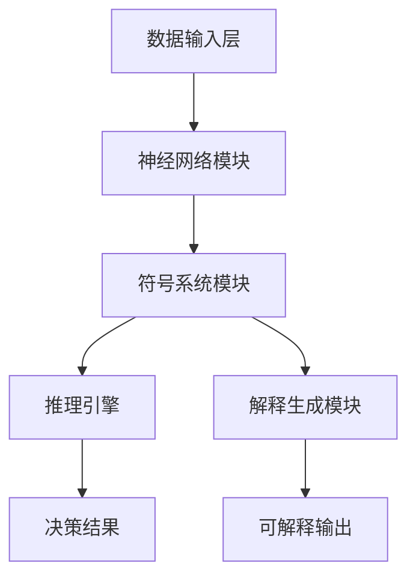

# 基于神经符号整合的可解释AI推理系统性能评估

> 关键词：神经符号整合、可解释AI、推理系统、性能评估、人工智能

> 摘要：本文围绕基于神经符号整合的可解释AI推理系统性能评估展开深入探讨。首先介绍了研究的背景、目的与范围等内容，阐述了神经符号整合、可解释AI等核心概念及其联系。详细讲解了相关核心算法原理，通过Python代码进行具体操作步骤的说明，同时给出数学模型和公式并举例解释。结合项目实战，展示代码实际案例并详细解读。分析了该推理系统的实际应用场景，推荐了相关的学习资源、开发工具框架以及论文著作。最后总结未来发展趋势与挑战，提供常见问题解答和扩展阅读参考资料，旨在为该领域的研究和实践提供全面且深入的指导。

## 1. 背景介绍 
### 1.1 目的和范围
随着人工智能技术的飞速发展，AI系统在诸多领域得到广泛应用。然而，传统的深度学习模型往往被视为“黑盒”，其决策过程难以理解，这在一些对安全性、可靠性要求较高的领域（如医疗、金融、自动驾驶等）限制了AI的进一步应用。基于神经符号整合的可解释AI推理系统旨在将神经网络的强大感知能力与符号系统的逻辑推理能力相结合，以实现可解释的AI决策。本研究的目的在于建立一套科学、全面的性能评估体系，对基于神经符号整合的可解释AI推理系统进行客观、准确的评估，明确其优势与不足，为系统的优化和改进提供依据。研究范围涵盖了该推理系统的各个方面，包括推理准确性、解释性、效率、鲁棒性等性能指标的评估。

### 1.2 预期读者
本文预期读者包括人工智能领域的研究人员、学者，他们可以从本文中获取关于神经符号整合和可解释AI推理系统性能评估的最新研究成果和方法，为其研究工作提供参考和启发；软件开发工程师，有助于他们在开发基于神经符号整合的可解释AI推理系统时，更好地理解系统性能要求，进行系统优化；对人工智能技术感兴趣的爱好者，能够通过本文了解该领域的前沿知识和技术原理。

### 1.3 文档结构概述
本文首先介绍研究的背景信息，包括目的、预期读者和文档结构概述等内容。接着阐述神经符号整合、可解释AI等核心概念及其联系，通过文本示意图和Mermaid流程图进行直观展示。然后详细讲解核心算法原理，使用Python代码说明具体操作步骤，并给出相关数学模型和公式进行详细解释和举例。结合项目实战，介绍开发环境搭建、源代码实现和代码解读。分析该推理系统的实际应用场景，推荐相关的学习资源、开发工具框架和论文著作。最后总结未来发展趋势与挑战，提供常见问题解答和扩展阅读参考资料。

### 1.4 术语表
#### 1.4.1 核心术语定义
- **神经符号整合**：将神经网络的感知能力与符号系统的逻辑推理能力相结合的一种技术方法，旨在充分发挥两者的优势，实现更强大、更可解释的AI系统。
- **可解释AI**：指能够以人类可理解的方式解释其决策过程和结果的人工智能系统，有助于提高系统的透明度和可信度。
- **推理系统**：根据已知信息和规则进行推理，得出结论的系统，在AI领域中用于解决各种问题。
- **性能评估**：对系统的各项性能指标进行测量、分析和评价的过程，以确定系统的优劣和改进方向。

#### 1.4.2 相关概念解释
- **神经网络**：一种模仿人类神经系统的计算模型，由大量的神经元组成，通过学习数据中的模式和规律来进行预测和分类。
- **符号系统**：使用符号和规则进行逻辑推理和知识表示的系统，能够处理抽象的概念和关系。
- **可解释性**：指系统的决策过程和结果能够被人类理解和解释的程度，是可解释AI的核心概念。

#### 1.4.3 缩略词列表
- **AI**：Artificial Intelligence，人工智能
- **ML**：Machine Learning，机器学习
- **DL**：Deep Learning，深度学习

## 2. 核心概念与联系 

### 核心概念原理
#### 神经符号整合
神经符号整合的核心思想是将神经网络和符号系统的优势相结合。神经网络具有强大的感知和学习能力，能够从大量的数据中提取特征和模式，但缺乏明确的逻辑推理能力和可解释性。符号系统则擅长处理抽象的概念和逻辑关系，能够进行精确的推理和知识表示，但对数据的感知和处理能力相对较弱。神经符号整合通过将两者有机结合，使得系统既能够利用神经网络的感知能力处理复杂的数据，又能够利用符号系统的逻辑推理能力进行可解释的决策。

#### 可解释AI
可解释AI的目标是让人工智能系统的决策过程和结果能够被人类理解。这可以通过多种方式实现，如使用可视化技术展示系统的决策依据，采用规则或逻辑表达式来解释系统的推理过程等。可解释AI有助于提高系统的透明度和可信度，在一些对安全性和可靠性要求较高的领域尤为重要。

#### 推理系统
推理系统是基于已知信息和规则进行推理的系统。在AI领域中，推理系统可以根据输入的数据和预先定义的规则，推导出新的结论或做出决策。推理系统的性能直接影响到AI系统的智能水平和应用效果。

### 架构的文本示意图
基于神经符号整合的可解释AI推理系统的架构主要包括数据输入层、神经网络模块、符号系统模块、推理引擎和解释生成模块。数据输入层负责接收原始数据，将其传输到神经网络模块进行特征提取和模式识别。神经网络模块将提取的特征信息传递给符号系统模块，符号系统模块将这些特征信息转换为符号表示，并结合预先定义的知识和规则进行逻辑推理。推理引擎根据符号系统的推理结果做出决策，解释生成模块则根据推理过程和结果生成人类可理解的解释。

### Mermaid流程图


## 3. 核心算法原理 & 具体操作步骤 

### 核心算法原理
#### 神经符号整合算法
神经符号整合算法的核心是将神经网络的输出与符号系统的知识和规则进行融合。一种常见的方法是将神经网络的输出作为符号系统的输入，符号系统根据这些输入进行逻辑推理。例如，在图像识别任务中，神经网络可以对图像进行分类，输出图像所属的类别标签。符号系统可以根据这些标签和预先定义的规则，进行进一步的推理和决策。

#### 可解释性生成算法
可解释性生成算法的目的是将推理系统的决策过程和结果转换为人类可理解的解释。一种常见的方法是使用规则或逻辑表达式来表示推理过程。例如，在医疗诊断系统中，推理系统可以根据患者的症状和检查结果做出诊断，解释生成算法可以将诊断过程表示为一系列的规则和条件，如“如果患者出现症状A和症状B，且检查结果C为阳性，则诊断为疾病D”。

### 具体操作步骤
以下是基于Python实现的一个简单的神经符号整合推理系统的示例代码：

```python
import numpy as np

# 定义神经网络模型
class NeuralNetwork:
    def __init__(self, input_size, hidden_size, output_size):
        self.weights1 = np.random.randn(input_size, hidden_size)
        self.weights2 = np.random.randn(hidden_size, output_size)

    def forward(self, x):
        self.z1 = np.dot(x, self.weights1)
        self.a1 = np.tanh(self.z1)
        self.z2 = np.dot(self.a1, self.weights2)
        self.a2 = np.tanh(self.z2)
        return self.a2

# 定义符号系统规则
def symbol_system(neural_output):
    if neural_output[0] > 0.5:
        return "Class A"
    else:
        return "Class B"

# 主函数
def main():
    # 初始化神经网络
    input_size = 10
    hidden_size = 5
    output_size = 1
    nn = NeuralNetwork(input_size, hidden_size, output_size)

    # 生成随机输入数据
    input_data = np.random.randn(1, input_size)

    # 神经网络前向传播
    neural_output = nn.forward(input_data)

    # 符号系统推理
    result = symbol_system(neural_output)

    print("Neural Network Output:", neural_output)
    print("Symbol System Result:", result)

if __name__ == "__main__":
    main()
```

### 代码解释
1. **神经网络模型**：定义了一个简单的两层神经网络，包括输入层、隐藏层和输出层。使用`tanh`作为激活函数。
2. **符号系统规则**：根据神经网络的输出结果，判断输入数据属于“Class A”还是“Class B”。
3. **主函数**：初始化神经网络，生成随机输入数据，进行神经网络前向传播，然后将神经网络的输出传递给符号系统进行推理，最后输出结果。

## 4. 数学模型和公式 & 详细讲解 & 举例说明 

### 神经网络数学模型
神经网络的基本数学模型可以表示为一系列的线性变换和非线性激活函数的组合。对于一个简单的两层神经网络，其前向传播过程可以用以下公式表示：

$$
z_1 = xW_1 + b_1
$$

$$
a_1 = f(z_1)
$$

$$
z_2 = a_1W_2 + b_2
$$

$$
a_2 = f(z_2)
$$

其中，$x$ 是输入数据，$W_1$ 和 $W_2$ 是权重矩阵，$b_1$ 和 $b_2$ 是偏置向量，$f$ 是激活函数（如`tanh`函数），$z_1$ 和 $z_2$ 是线性变换的结果，$a_1$ 和 $a_2$ 是经过激活函数处理后的输出。

### 符号系统逻辑推理公式
符号系统的逻辑推理可以用逻辑表达式来表示。例如，在上述示例中，符号系统的规则可以表示为：

$$
\text{result} = 
\begin{cases}
\text{"Class A"} & \text{if } a_2 > 0.5 \\
\text{"Class B"} & \text{otherwise}
\end{cases}
$$

### 举例说明
假设输入数据 $x = [0.1, 0.2, 0.3, 0.4, 0.5, 0.6, 0.7, 0.8, 0.9, 1.0]$，权重矩阵 $W_1$ 和 $W_2$ 以及偏置向量 $b_1$ 和 $b_2$ 是随机初始化的。经过神经网络的前向传播，得到输出 $a_2 = 0.6$。根据符号系统的规则，由于 $a_2 > 0.5$，所以推理结果为“Class A”。

## 5. 项目实战：代码实际案例和详细解释说明 

### 5.1  开发环境搭建
#### 操作系统
本项目可以在Windows、Linux或macOS等主流操作系统上进行开发。

#### 编程语言和环境
使用Python作为开发语言，建议使用Python 3.6及以上版本。可以使用Anaconda来管理Python环境，Anaconda提供了丰富的科学计算库和工具。

#### 安装依赖库
本项目需要安装以下依赖库：
- `numpy`：用于数值计算
- `matplotlib`：用于数据可视化（可选）

可以使用以下命令进行安装：
```sh
pip install numpy matplotlib
```

### 5.2  源代码详细实现和代码解读
以下是一个更完整的基于神经符号整合的可解释AI推理系统的示例代码：

```python
import numpy as np
import matplotlib.pyplot as plt

# 定义神经网络模型
class NeuralNetwork:
    def __init__(self, input_size, hidden_size, output_size):
        self.weights1 = np.random.randn(input_size, hidden_size)
        self.bias1 = np.zeros((1, hidden_size))
        self.weights2 = np.random.randn(hidden_size, output_size)
        self.bias2 = np.zeros((1, output_size))

    def forward(self, x):
        self.z1 = np.dot(x, self.weights1) + self.bias1
        self.a1 = np.tanh(self.z1)
        self.z2 = np.dot(self.a1, self.weights2) + self.bias2
        self.a2 = np.tanh(self.z2)
        return self.a2

    def backward(self, x, y, learning_rate):
        m = x.shape[0]

        # 计算输出层的误差
        dZ2 = self.a2 - y
        dW2 = np.dot(self.a1.T, dZ2) / m
        db2 = np.sum(dZ2, axis=0, keepdims=True) / m

        # 计算隐藏层的误差
        dZ1 = np.dot(dZ2, self.weights2.T) * (1 - np.power(self.a1, 2))
        dW1 = np.dot(x.T, dZ1) / m
        db1 = np.sum(dZ1, axis=0, keepdims=True) / m

        # 更新权重和偏置
        self.weights2 -= learning_rate * dW2
        self.bias2 -= learning_rate * db2
        self.weights1 -= learning_rate * dW1
        self.bias1 -= learning_rate * db1

# 定义符号系统规则
def symbol_system(neural_output):
    if neural_output[0][0] > 0.5:
        return "Class A"
    else:
        return "Class B"

# 生成数据集
def generate_data(num_samples, input_size):
    X = np.random.randn(num_samples, input_size)
    y = np.random.randint(0, 2, (num_samples, 1))
    return X, y

# 训练神经网络
def train_nn(nn, X, y, num_epochs, learning_rate):
    losses = []
    for epoch in range(num_epochs):
        output = nn.forward(X)
        loss = np.mean(np.square(output - y))
        losses.append(loss)
        nn.backward(X, y, learning_rate)

        if epoch % 100 == 0:
            print(f"Epoch {epoch}: Loss = {loss}")

    plt.plot(losses)
    plt.xlabel('Epoch')
    plt.ylabel('Loss')
    plt.show()

# 主函数
def main():
    # 生成数据集
    num_samples = 1000
    input_size = 10
    X, y = generate_data(num_samples, input_size)

    # 初始化神经网络
    hidden_size = 5
    output_size = 1
    nn = NeuralNetwork(input_size, hidden_size, output_size)

    # 训练神经网络
    num_epochs = 1000
    learning_rate = 0.01
    train_nn(nn, X, y, num_epochs, learning_rate)

    # 随机选择一个样本进行推理
    sample_index = np.random.randint(0, num_samples)
    sample_input = X[sample_index:sample_index+1]
    neural_output = nn.forward(sample_input)
    result = symbol_system(neural_output)

    print("Sample Input:", sample_input)
    print("Neural Network Output:", neural_output)
    print("Symbol System Result:", result)

if __name__ == "__main__":
    main()
```

### 5.3  代码解读与分析
#### 神经网络类
- `__init__` 方法：初始化神经网络的权重和偏置。
- `forward` 方法：实现神经网络的前向传播过程。
- `backward` 方法：实现神经网络的反向传播过程，用于更新权重和偏置。

#### 符号系统规则
`symbol_system` 函数根据神经网络的输出结果，判断输入数据属于“Class A”还是“Class B”。

#### 数据集生成
`generate_data` 函数生成随机的输入数据和标签。

#### 训练神经网络
`train_nn` 函数用于训练神经网络，记录每个epoch的损失值，并绘制损失曲线。

#### 主函数
- 生成数据集
- 初始化神经网络
- 训练神经网络
- 随机选择一个样本进行推理，并输出结果

## 6. 实际应用场景 
### 医疗领域
在医疗诊断中，基于神经符号整合的可解释AI推理系统可以结合患者的症状、检查结果等数据进行诊断。神经网络可以对医学图像（如X光、CT等）进行分析，提取特征信息。符号系统可以根据这些特征信息和医学知识规则，进行逻辑推理，做出诊断决策，并生成可解释的诊断报告。这样的系统可以帮助医生提高诊断的准确性和效率，同时为医生提供决策依据，增强医生对AI系统的信任。

### 金融领域
在金融风险评估中，该推理系统可以分析客户的信用数据、交易记录等信息。神经网络可以学习数据中的模式和规律，符号系统可以根据金融规则和风险评估模型进行推理，评估客户的信用风险，并给出可解释的风险评估报告。这有助于金融机构做出更明智的决策，降低金融风险。

### 自动驾驶领域
在自动驾驶中，推理系统可以处理传感器采集的环境数据。神经网络可以识别道路、车辆、行人等物体，符号系统可以根据交通规则和安全策略进行推理，做出驾驶决策。可解释性的输出可以帮助工程师调试和优化自动驾驶系统，提高系统的安全性和可靠性。

## 7. 工具和资源推荐
### 7