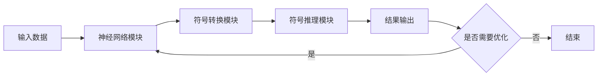

# 基于神经符号整合的可解释推理系统设计

> 关键词：神经符号整合、可解释推理系统、深度学习、符号推理、知识表示

> 摘要：本文聚焦于基于神经符号整合的可解释推理系统设计。首先介绍了该领域的背景，包括目的和范围、预期读者等内容。接着详细阐述了核心概念与联系，通过文本示意图和Mermaid流程图展示架构。深入讲解了核心算法原理，并给出Python源代码示例。分析了相关数学模型和公式，辅以举例说明。进行了项目实战，包括开发环境搭建、源代码实现与解读。探讨了实际应用场景，推荐了相关工具和资源，最后总结了未来发展趋势与挑战，解答常见问题并提供扩展阅读和参考资料。旨在为构建可解释推理系统提供全面的技术指导和理论支持。

## 1. 背景介绍 
### 1.1 目的和范围
随着人工智能技术的飞速发展，深度学习模型在图像识别、自然语言处理等领域取得了显著成就。然而，这些模型往往被视为“黑盒”，缺乏可解释性，这在一些对安全性和可靠性要求较高的领域，如医疗诊断、金融决策等，限制了其应用。基于神经符号整合的可解释推理系统旨在结合神经网络强大的感知能力和符号推理的可解释性，构建既能有效处理复杂数据，又能对推理过程进行清晰解释的系统。本研究的范围涵盖了神经符号整合的理论基础、算法设计、系统实现以及实际应用等方面。

### 1.2 预期读者
本文预期读者包括人工智能领域的研究人员、开发者、对可解释人工智能感兴趣的学者以及相关行业的从业者。对于研究人员，本文提供了神经符号整合领域的最新进展和研究思路；对于开发者，详细的算法和代码实现可作为系统开发的参考；对于学者和从业者，有助于了解可解释推理系统在实际应用中的潜力和挑战。

### 1.3 文档结构概述
本文将按照以下结构展开：首先介绍核心概念与联系，包括神经符号整合的原理和架构；接着阐述核心算法原理和具体操作步骤，并给出Python代码示例；然后分析相关数学模型和公式，通过举例说明其应用；进行项目实战，包括开发环境搭建、源代码实现与解读；探讨实际应用场景；推荐相关工具和资源；总结未来发展趋势与挑战；解答常见问题；最后提供扩展阅读和参考资料。

### 1.4 术语表
#### 1.4.1 核心术语定义
- **神经符号整合**：将神经网络和符号推理相结合的技术，旨在发挥两者的优势，实现可解释的推理。
- **可解释推理系统**：能够对推理过程和结果进行清晰解释的系统，便于用户理解和信任。
- **深度学习**：一类基于人工神经网络的机器学习技术，通过多层神经网络自动学习数据的特征表示。
- **符号推理**：基于符号逻辑和规则进行推理的方法，具有明确的语义和可解释性。
- **知识表示**：将知识以计算机可处理的形式表示出来，便于知识的存储、推理和应用。

#### 1.4.2 相关概念解释
- **神经网络的黑盒性**：指深度学习模型的决策过程难以被人类理解，因为其内部参数和计算过程复杂，缺乏明确的语义解释。
- **符号推理的可解释性**：符号推理基于明确的逻辑规则和知识表示，推理过程可以用自然语言或逻辑表达式进行解释，易于人类理解。
- **知识图谱**：一种以图的形式表示知识的方法，节点表示实体，边表示实体之间的关系，是符号推理的重要知识来源。

#### 1.4.3 缩略词列表
- **DNN**：深度神经网络（Deep Neural Network）
- **RNN**：循环神经网络（Recurrent Neural Network）
- **CNN**：卷积神经网络（Convolutional Neural Network）
- **KG**：知识图谱（Knowledge Graph）

## 2. 核心概念与联系 
### 核心概念原理
神经符号整合的核心思想是将神经网络和符号推理有机结合，充分发挥两者的优势。神经网络具有强大的感知能力，能够自动从数据中学习特征表示，适用于处理复杂的非结构化数据，如图像、文本等。然而，神经网络的决策过程往往难以解释，缺乏明确的语义信息。符号推理则基于符号逻辑和规则，能够进行精确的推理和解释，但对于复杂数据的处理能力相对较弱。通过神经符号整合，可以利用神经网络对数据进行预处理和特征提取，将提取的特征转换为符号表示，然后利用符号推理进行逻辑推理和决策，最后将推理结果反馈给神经网络进行进一步的优化。

### 架构的文本示意图
以下是一个基于神经符号整合的可解释推理系统的架构示意图：

输入数据（图像、文本等） -> 神经网络模块（特征提取） -> 符号转换模块（将特征转换为符号表示） -> 符号推理模块（基于规则和知识图谱进行推理） -> 结果输出（推理结果和解释）
|                                                          |
|                                                          v
反馈机制（将推理结果反馈给神经网络进行优化）

### Mermaid 流程图


## 3. 核心算法原理 & 具体操作步骤 
### 核心算法原理
基于神经符号整合的可解释推理系统的核心算法主要包括神经网络特征提取算法、符号转换算法和符号推理算法。

#### 神经网络特征提取算法
以卷积神经网络（CNN）为例，用于图像数据的特征提取。CNN通过卷积层、池化层和全连接层等结构，自动学习图像的特征表示。卷积层通过卷积核在图像上滑动，提取局部特征；池化层用于降低特征图的维度，减少计算量；全连接层将提取的特征映射到一个低维向量空间。

#### 符号转换算法
将神经网络提取的特征转换为符号表示是神经符号整合的关键步骤。一种常见的方法是使用聚类算法将特征向量进行分类，每个类别对应一个符号。例如，可以使用K-means聚类算法将特征向量划分为K个类别，每个类别用一个符号表示。

#### 符号推理算法
符号推理基于符号逻辑和规则进行推理。常见的符号推理方法包括基于规则的推理和基于知识图谱的推理。基于规则的推理通过定义一系列的逻辑规则，根据输入的符号进行推理；基于知识图谱的推理则利用知识图谱中实体和关系的信息进行推理。

### 具体操作步骤
#### 步骤1：数据预处理
对输入数据进行预处理，如图像的归一化、文本的分词等，以便神经网络能够更好地处理数据。

#### 步骤2：神经网络特征提取
使用CNN等神经网络模型对预处理后的数据进行特征提取，得到特征向量。

#### 步骤3：符号转换
使用聚类算法将特征向量转换为符号表示。

#### 步骤4：符号推理
基于符号表示和预定义的规则或知识图谱进行推理，得到推理结果。

#### 步骤5：结果输出和解释
输出推理结果，并对推理过程进行解释，以便用户理解。

### Python源代码示例
```python
import numpy as np
from sklearn.cluster import KMeans
from sklearn.neural_network import MLPClassifier

# 步骤1：数据预处理
# 假设输入数据是一个二维数组
data = np.random.rand(100, 10)  # 100个样本，每个样本有10个特征

# 步骤2：神经网络特征提取
# 使用多层感知机（MLP）进行特征提取
mlp = MLPClassifier(hidden_layer_sizes=(20, 10))
mlp.fit(data, np.random.randint(0, 2, 100))  # 随机生成标签进行训练
features = mlp.predict_proba(data)  # 提取特征

# 步骤3：符号转换
# 使用K-means聚类算法将特征转换为符号表示
kmeans = KMeans(n_clusters=3)
symbols = kmeans.fit_predict(features)

# 步骤4：符号推理
# 简单的基于规则的推理示例
rules = {
    0: "类别0推理结果",
    1: "类别1推理结果",
    2: "类别2推理结果"
}
results = [rules[symbol] for symbol in symbols]

# 步骤5：结果输出和解释
for i in range(len(results)):
    print(f"样本 {i} 的推理结果：{results[i]}，符号表示：{symbols[i]}")
```

## 4. 数学模型和公式 & 详细讲解 & 举例说明 
### 神经网络特征提取的数学模型
以卷积神经网络（CNN）为例，卷积层的数学模型可以表示为：

$$y_{i,j}^l = f\left(\sum_{m=0}^{M-1}\sum_{n=0}^{N-1} w_{m,n}^l x_{i+m,j+n}^{l-1} + b^l\right)$$

其中，$y_{i,j}^l$ 是第 $l$ 层卷积层在位置 $(i,j)$ 处的输出，$f$ 是激活函数，$w_{m,n}^l$ 是第 $l$ 层卷积核在位置 $(m,n)$ 处的权重，$x_{i+m,j+n}^{l-1}$ 是第 $l-1$ 层在位置 $(i+m,j+n)$ 处的输入，$b^l$ 是第 $l$ 层的偏置。

### 符号转换的数学模型
K-means聚类算法的目标是最小化样本到其所属聚类中心的距离之和，数学模型可以表示为：

$$\min_{C} \sum_{k=1}^{K} \sum_{x_i \in C_k} \left\| x_i - \mu_k \right\|^2$$

其中，$C = \{C_1, C_2, \cdots, C_K\}$ 是聚类结果，$K$ 是聚类的数量，$x_i$ 是样本，$\mu_k$ 是第 $k$ 个聚类的中心。

### 符号推理的数学模型
基于规则的推理可以使用逻辑表达式来表示。例如，假设规则为“如果符号为A且符号为B，则结果为C”，可以表示为：

$$A \land B \rightarrow C$$

### 举例说明
#### 神经网络特征提取举例
假设有一个 $3\times3$ 的图像，使用一个 $2\times2$ 的卷积核进行卷积操作，卷积核的权重为 $w = \begin{bmatrix} 1 & 2 \\ 3 & 4 \end{bmatrix}$，偏置为 $b = 1$，激活函数为ReLU。图像数据为 $x = \begin{bmatrix} 1 & 2 & 3 \\ 4 & 5 & 6 \\ 7 & 8 & 9 \end{bmatrix}$。

首先，计算卷积结果：

$$y_{0,0} = f\left(1\times1 + 2\times2 + 3\times4 + 4\times5 + 1\right) = f(36) = 36$$

$$y_{0,1} = f\left(1\times2 + 2\times3 + 3\times5 + 4\times6 + 1\right) = f(44) = 44$$

$$y_{1,0} = f\left(1\times4 + 2\times5 + 3\times7 + 4\times8 + 1\right) = f(66) = 66$$

$$y_{1,1} = f\left(1\times5 + 2\times6 + 3\times8 + 4\times9 + 1\right) = f(74) = 74$$

最终得到的特征图为 $y = \begin{bmatrix} 36 & 44 \\ 66 & 74 \end{bmatrix}$。

#### 符号转换举例
假设有4个样本的特征向量为 $x_1 = [1, 2]$, $x_2 = [2, 3]$, $x_3 = [8, 9]$, $x_4 = [9, 10]$，使用K-means聚类算法将其分为2类。

首先，随机初始化两个聚类中心 $\mu_1 = [1, 1]$ 和 $\mu_2 = [9, 9]$。

然后，计算每个样本到聚类中心的距离：

$d(x_1, \mu_1) = \sqrt{(1 - 1)^2 + (2 - 1)^2} = 1$

$d(x_1, \mu_2) = \sqrt{(1 - 9)^2 + (2 - 9)^2} = \sqrt{64 + 49} = \sqrt{113}$

$d(x_2, \mu_1) = \sqrt{(2 - 1)^2 + (3 - 1)^2} = \sqrt{5}$

$d(x_2, \mu_2) = \sqrt{(2 - 9)^2 + (3 - 9)^2} = \sqrt{49 + 36} = \sqrt{85}$

$d(x_3, \mu_1) = \sqrt{(8 - 1)^2 + (9 - 1)^2} = \sqrt{49 + 64} = \sqrt{113}$

$d(x_3, \mu_2) = \sqrt{(8 - 9)^2 + (9 - 9)^2} = 1$

$d(x_4, \mu_1) = \sqrt{(9 - 1)^2 + (10 - 1)^2} = \sqrt{64 + 81} = \sqrt{145}$

$d(x_4, \mu_2) = \sqrt{(9 - 9)^2 + (10 - 9)^2} = 1$

根据距离将样本分配到最近的聚类中心，得到 $x_1$ 和 $x_2$ 属于第一类，$x_3$ 和 $x_4$ 属于第二类。

最后，更新聚类中心：

$\mu_1 = \frac{x_1 + x_2}{2} = \left[\frac{1 + 2}{2}, \frac{2 + 3}{2}\right] = [1.5, 2.5]$

$\mu_2 = \frac{x_3 + x_4}{2} = \left[\frac{8 + 9}{2}, \frac{9 + 10}{2}\right] = [8.5, 9.5]$

重复上述步骤，直到聚类中心不再变化。

#### 符号推理举例
假设规则为“如果符号为0且符号为1，则结果为2”，当前符号为 $A = 0$ 和 $B = 1$，根据规则可以推理出结果 $C = 2$。

## 5. 项目实战：代码实际案例和详细解释说明 
### 5.1  开发环境搭建
#### 操作系统
建议使用Linux系统，如Ubuntu 18.04及以上版本，也可以使用Windows 10或macOS系统。

#### Python环境
安装Python 3.7及以上版本，可以使用Anaconda来管理Python环境。

#### 依赖库安装
安装以下依赖库：
```bash
pip install numpy scikit-learn tensorflow torch
```

### 5.2  源代码详细实现和代码解读
```python
import numpy as np
import torch
import torch.nn as nn
import torch.optim as optim
from sklearn.cluster import KMeans

# 定义神经网络模型
class NeuralNetwork(nn.Module):
    def __init__(self):
        super(NeuralNetwork, self).__init__()
        self.fc1 = nn.Linear(10, 20)
        self.relu = nn.ReLU()
        self.fc2 = nn.Linear(20, 10)

    def forward(self, x):
        x = self.fc1(x)
        x = self.relu(x)
        x = self.fc2(x)
        return x

# 步骤1：数据准备
data = np.random.rand(100, 10)  # 100个样本，每个样本有10个特征
labels = np.random.randint(0, 2, 100)  # 随机生成标签

# 步骤2：将数据转换为PyTorch张量
data_tensor = torch.tensor(data, dtype=torch.float32)
labels_tensor = torch.tensor(labels, dtype=torch.long)

# 步骤3：初始化神经网络模型
model = NeuralNetwork()

# 步骤4：定义损失函数和优化器
criterion = nn.CrossEntropyLoss()
optimizer = optim.Adam(model.parameters(), lr=0.001)

# 步骤5：训练神经网络模型
num_epochs = 100
for epoch in range(num_epochs):
    outputs = model(data_tensor)
    loss = criterion(outputs, labels_tensor)

    optimizer.zero_grad()
    loss.backward()
    optimizer.step()

    if (epoch + 1) % 10 == 0:
        print(f'Epoch [{epoch + 1}/{num_epochs}], Loss: {loss.item():.4f}')

# 步骤6：提取特征
features = model(data_tensor).detach().numpy()

# 步骤7：符号转换
kmeans = KMeans(n_clusters=3)
symbols = kmeans.fit_predict(features)

# 步骤8：符号推理
rules = {
    0: "类别0推理结果",
    1: "类别1推理结果",
    2: "类别2推理结果"
}
results = [rules[symbol] for symbol in symbols]

# 步骤9：结果输出和解释
for i in range(len(results)):
    print(f"样本 {i} 的推理结果：{results[i]}，符号表示：{symbols[i]}")
```

### 代码解读与分析
#### 神经网络模型定义
```python
class NeuralNetwork(nn.Module):
    def __init__(self):
        super(NeuralNetwork, self).__init__()
        self.fc1 = nn.Linear(10, 20)
        self.relu = nn.ReLU()
        self.fc2 = nn.Linear(20, 10)

    def forward(self, x):
        x = self.fc1(x)
        x = self.relu(x)
        x = self.fc2(x)
        return x
```
定义了一个简单的两层全连接神经网络，输入层有10个神经元，隐藏层有20个神经元，输出层有10个神经元。使用ReLU作为激活函数。

#### 数据准备和训练
```python
data = np.random.rand(100, 10)
labels = np.random.randint(0, 2, 100)
data_tensor = torch.tensor(data, dtype=torch.float32)
labels_tensor = torch.tensor(labels, dtype=torch.long)

model = NeuralNetwork()
criterion = nn.CrossEntropyLoss()
optimizer = optim.Adam(model.parameters(), lr=0.001)

num_epochs = 100
for epoch in range(num_epochs):
    outputs = model(data_tensor)
    loss = criterion(outputs, labels_tensor)

    optimizer.zero_grad()
    loss.backward()
    optimizer.step()

    if (epoch + 1) % 10 == 0:
        print(f'Epoch [{epoch + 1}/{num_epochs}], Loss: {loss.item():.4f}')
```
使用随机生成的数据进行训练，定义了交叉熵损失函数和Adam优化器，训练100个epoch。

#### 特征提取和符号转换
```python
features = model(data_tensor).detach().numpy()
kmeans = KMeans(n_clusters=3)
symbols = kmeans.fit_predict(features)
```
提取训练好的神经网络的输出作为特征，使用K-means聚类算法将特征转换为符号表示。

#### 符号推理和结果输出
```python
rules = {
    0: "类别0推理结果",
    1: "类别1推理结果",
    2: "类别2推理结果"
}
results = [rules[symbol] for symbol in symbols]

for i in range(len(results)):
    print(f"样本 {i} 的推理结果：{results[i]}，符号表示：{symbols[i]}")
```
根据预定义的规则进行符号推理，输出推理结果和符号表示。

## 6. 实际应用场景 
### 医疗诊断
在医疗诊断领域，可解释推理系统可以结合患者的病历数据、检查报告等信息，进行疾病的诊断和预测。神经网络可以用于对医学图像（如X光、CT等）进行特征提取，符号推理则可以结合医学知识图谱和专家规则，对疾病进行诊断和解释。例如，对于肺癌的诊断，神经网络可以从CT图像中提取肿瘤的特征，符号推理可以根据这些特征和医学知识判断肿瘤的性质（良性或恶性），并给出诊断的依据和解释，帮助医生做出更准确的决策。

### 金融风险评估
在金融领域，可解释推理系统可以用于评估客户的信用风险、预测市场趋势等。神经网络可以对客户的交易记录、信用历史等数据进行特征提取，符号推理可以结合金融规则和市场知识，对客户的信用风险进行评估和解释。例如，在信用卡审批中，神经网络可以从客户的申请信息中提取特征，符号推理可以根据这些特征和银行的风险评估规则，判断客户是否适合发放信用卡，并给出评估的理由和风险提示。

### 智能交通
在智能交通领域，可解释推理系统可以用于交通流量预测、交通事故预警等。神经网络可以对交通传感器采集的数据（如车辆速度、流量等）进行特征提取，符号推理可以结合交通规则和地图信息，对交通状况进行预测和推理。例如，在交通拥堵预测中，神经网络可以从实时交通数据中提取特征，符号推理可以根据这些特征和交通规则，预测某个路段是否会发生拥堵，并给出预测的依据和建议。

## 7. 工具和资源推荐
### 7.1 学习资源推荐
#### 7.1.1 书籍推荐
- 《深度学习》（Deep Learning）：由Ian Goodfellow、Yoshua Bengio和Aaron Courville所著，是深度学习领域的经典教材，涵盖了神经网络、卷积神经网络、循环神经网络等方面的内容。
- 《人工智能：一种现代的方法》（Artificial Intelligence: A Modern Approach）：由Stuart Russell和Peter Norvig所著，是人工智能领域的权威教材，介绍了人工智能的各个方面，包括搜索算法、知识表示、推理、机器学习等。
- 《神经符号人工智能：从基础到应用》（Neural-Symbolic Artificial Intelligence: Foundations and Applications）：详细介绍了神经符号整合的理论和方法，以及在不同领域的应用。

#### 7.1.2 在线课程
- Coursera上的“深度学习专项课程”（Deep Learning Specialization）：由Andrew Ng教授授课，包括神经网络基础、卷积神经网络、循环神经网络等课程，是学习深度学习的优质资源。
- edX上的“人工智能导论”（Introduction to Artificial Intelligence）：由MIT教授授课，介绍了人工智能的基本概念、算法和应用。
- Udemy上的“神经符号整合实战课程”（Neural-Symbolic Integration Practical Course）：专门讲解神经符号整合的实战应用，包括算法实现和项目开发。

#### 7.1.3 技术博客和网站
- arXiv.org：是一个预印本服务器，提供了大量的人工智能领域的研究论文，包括神经符号整合方面的最新研究成果。
- Medium上的人工智能相关博客：有许多人工智能领域的专家和从业者分享他们的研究成果和经验，如Towards Data Science等。
- AI开源社区：如GitHub上的人工智能项目，提供了许多开源的代码和工具，可以用于学习和实践。

### 7.2 开发工具框架推荐
#### 7.2.1 IDE和编辑器
- PyCharm：是一款专门为Python开发设计的集成开发环境（IDE），提供了代码编辑、调试、版本控制等功能，适合开发基于Python的可解释推理系统。
- Jupyter Notebook：是一个交互式的开发环境，支持Python、R等多种编程语言，适合进行数据分析、模型训练和可视化。
- Visual Studio Code：是一款轻量级的代码编辑器，支持多种编程语言和插件，具有丰富的扩展功能，适合快速开发和调试。

#### 7.2.2 调试和性能分析工具
- TensorBoard：是TensorFlow提供的可视化工具，可以用于可视化模型的训练过程、损失函数变化、参数分布等，帮助开发者调试和优化模型。
- PyTorch Profiler：是PyTorch提供的性能分析工具，可以分析模型的计算时间、内存使用等情况，帮助开发者找出性能瓶颈。
- cProfile：是Python标准库中的性能分析工具，可以分析Python代码的执行时间和函数调用情况，帮助开发者优化代码性能。

#### 7.2.3 相关框架和库
- TensorFlow：是Google开发的深度学习框架，提供了丰富的神经网络模型和工具，支持分布式训练和部署。
- PyTorch：是Facebook开发的深度学习框架，具有动态图的特点，易于使用和调试，广泛应用于学术研究和工业开发。
- NetworkX：是Python的一个图论库，可用于构建和分析知识图谱，支持各种图算法和操作。
- scikit-learn：是Python的一个机器学习库，提供了丰富的机器学习算法和工具，如聚类算法、分类算法等，可用于符号转换和推理。

### 7.3 相关论文著作推荐
#### 7.3.1 经典论文
- “Neural-Symbolic Learning and Reasoning: Contributions and Challenges”：该论文对神经符号学习和推理的发展历程、主要贡献和面临的挑战进行了全面的综述。
- “Towards Interpretable Machine Learning: A Unified Approach”：提出了一种统一的可解释机器学习方法，结合了神经网络和符号推理的思想。
- “Knowledge Graph Embedding: A Survey of Approaches and Applications”：对知识图谱嵌入的方法和应用进行了详细的综述，为基于知识图谱的符号推理提供了理论基础。

#### 7.3.2 最新研究成果
- “Neuro-Symbolic Concept Learner: Interpreting Scenes, Words, and Sentences From Natural Supervision”：提出了一种神经符号概念学习器，能够从自然监督中学习概念和进行推理。
- “Logic Tensor Networks: Deep Learning and Logical Reasoning From Data and Knowledge”：介绍了逻辑张量网络，将深度学习和逻辑推理相结合，实现了从数据和知识中进行学习和推理。
- “Symbolic Knowledge Distillation: from General Language Models to Commonsense Models”：提出了符号知识蒸馏的方法，将通用语言模型中的知识蒸馏到常识模型中，提高模型的可解释性和推理能力。

#### 7.3.3 应用案例分析
- “Applying Neural-Symbolic Integration in Medical Diagnosis: A Case Study”：介绍了将神经符号整合应用于医疗诊断的案例，分析了系统的设计和实现过程，以及取得的效果。
- “Financial Risk Assessment Using Neuro-Symbolic Reasoning: A Real-World Application”：探讨了神经符号推理在金融风险评估中的应用，通过实际案例展示了系统的有效性和可解释性。
- “Intelligent Traffic Prediction Based on Neural-Symbolic Integration: A Practical Approach”：提出了基于神经符号整合的智能交通预测方法，并通过实际数据验证了方法的准确性和可靠性。

## 8. 总结：未来发展趋势与挑战
### 未来发展趋势
#### 更强的融合能力
未来的神经符号整合系统将具备更强的融合能力，能够更好地结合神经网络和符号推理的优势。例如，开发更加高效的符号转换算法，实现特征和符号之间的无缝转换；设计更加灵活的推理机制，能够根据不同的任务和数据动态调整推理策略。

#### 跨领域应用拓展
神经符号整合的可解释推理系统将在更多领域得到应用，如教育、法律、农业等。通过结合不同领域的知识和数据，系统可以为这些领域提供更加智能、可解释的决策支持。

#### 与其他技术的融合
神经符号整合将与其他技术如强化学习、迁移学习、联邦学习等进行融合，进一步提升系统的性能和应用范围。例如，将神经符号整合与强化学习相结合，可以实现更加智能的决策和行为控制；与迁移学习相结合，可以提高系统在不同任务和领域之间的泛化能力。

### 挑战
#### 理论基础不完善
目前，神经符号整合的理论基础还不够完善，缺乏统一的框架和方法。例如，如何在神经网络和符号推理之间进行有效的信息传递和交互，如何保证符号推理的正确性和可靠性等问题还需要进一步研究。

#### 计算资源需求大
神经符号整合系统通常需要大量的计算资源，尤其是在处理大规模数据和复杂任务时。如何优化系统的计算效率，降低计算资源的需求，是一个亟待解决的问题。

#### 知识获取和更新困难
符号推理依赖于大量的知识，如何获取和更新这些知识是一个挑战。一方面，知识的获取需要人工标注和整理，成本较高；另一方面，知识是不断更新和变化的，如何保证系统能够及时获取和更新知识也是一个问题。

## 9. 附录：常见问题与解答
### 问题1：神经符号整合和传统的机器学习方法有什么区别？
神经符号整合结合了神经网络和符号推理的优势，既能够处理复杂的非结构化数据，又能够对推理过程进行解释。传统的机器学习方法如决策树、支持向量机等，虽然具有一定的可解释性，但对于复杂数据的处理能力相对较弱；而深度学习模型如神经网络虽然在处理复杂数据方面表现出色，但缺乏可解释性。

### 问题2：如何选择合适的符号转换算法？
选择合适的符号转换算法需要考虑数据的特点、任务的需求和计算资源等因素。如果数据具有明显的聚类结构，可以使用聚类算法如K-means、DBSCAN等；如果数据是文本数据，可以使用词嵌入和聚类相结合的方法。此外，还可以根据任务的需求选择不同的符号表示方式，如离散符号、连续符号等。

### 问题3：如何保证符号推理的正确性和可靠性？
保证符号推理的正确性和可靠性需要从多个方面入手。首先，需要建立准确的知识图谱和规则库，确保知识的准确性和完整性；其次，需要对推理过程进行验证和评估，及时发现和纠正推理中的错误；最后，需要不断更新和完善知识图谱和规则库，以适应不断变化的环境和任务。

### 问题4：神经符号整合系统的性能如何评估？
神经符号整合系统的性能可以从多个方面进行评估，包括推理的准确性、可解释性、计算效率等。推理的准确性可以通过与真实结果进行比较来评估；可解释性可以通过人工评估和自动化评估相结合的方式来评估，如计算解释的清晰度、可信度等；计算效率可以通过测量系统的运行时间和内存使用等指标来评估。

## 10. 扩展阅读 & 参考资料
### 扩展阅读
- 《可解释人工智能》（Explainable Artificial Intelligence）：深入探讨了可解释人工智能的理论和方法，包括神经符号整合在内的多种可解释性技术。
- 《知识图谱：方法、实践与应用》（Knowledge Graph: Methods, Practices and Applications）：详细介绍了知识图谱的构建、表示和推理方法，为神经符号整合中的符号推理提供了丰富的知识和技术支持。
- 《人工智能中的不确定性推理》（Uncertainty Reasoning in Artificial Intelligence）：介绍了人工智能中处理不确定性的方法和技术，对于神经符号整合系统在处理不确定数据时具有重要的参考价值。

### 参考资料
- Goodfellow, I., Bengio, Y., & Courville, A. (2016). Deep Learning. MIT Press.
- Russell, S. J., & Norvig, P. (2020). Artificial Intelligence: A Modern Approach. Pearson.
- Hitzler, P., Seda, A. K., & Zhang, Y. (2020). Neural-Symbolic Artificial Intelligence: Foundations and Applications. Morgan & Claypool Publishers.

作者：AI天才研究院/AI Genius Institute & 禅与计算机程序设计艺术 /Zen And The Art of Computer Programming