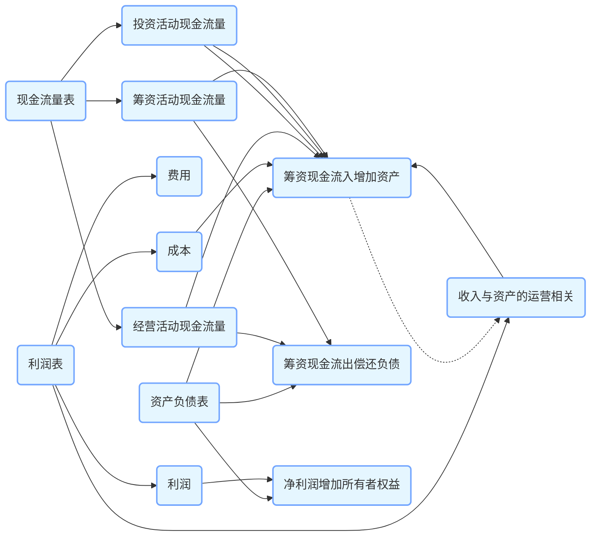

# 塞思·卡拉曼的公司财务报表深度解析

> 关键词：塞思·卡拉曼、公司财务报表、财务分析、价值投资、财务指标

> 摘要：本文旨在对塞思·卡拉曼所关注和应用的公司财务报表进行深度解析。通过阐述财务报表分析的背景知识，包括目的、预期读者等，详细讲解核心概念与联系，如资产负债表、利润表、现金流量表之间的关系。介绍核心算法原理和具体操作步骤，结合数学模型和公式进行举例说明。通过项目实战，展示如何搭建开发环境、实现代码并进行解读。探讨财务报表分析在实际中的应用场景，推荐相关的工具和资源，最后总结未来发展趋势与挑战，解答常见问题并提供扩展阅读和参考资料，帮助读者全面深入地理解公司财务报表分析，为价值投资决策提供有力支持。

## 1. 背景介绍 
### 1.1 目的和范围
本博客的主要目的是深入剖析塞思·卡拉曼所运用的公司财务报表分析方法和理念。塞思·卡拉曼是价值投资领域的杰出代表，他非常重视对公司财务报表的研究，以此来评估公司的内在价值和投资潜力。通过本博客，我们将全面探讨财务报表的各个方面，包括资产负债表、利润表、现金流量表等，以及如何运用这些报表中的数据进行有效的财务分析和投资决策。范围涵盖了财务报表分析的基本概念、核心算法、数学模型、实际应用等多个层面，旨在为读者提供一个系统、全面的财务报表分析知识体系。

### 1.2 预期读者
预期读者包括对价值投资感兴趣的投资者、金融专业的学生、从事财务分析工作的专业人士以及希望深入了解公司财务状况的企业管理者等。无论您是初学者还是有一定经验的专业人士，都能从本博客中获得有价值的信息和启示。

### 1.3 文档结构概述
本文将按照以下结构进行阐述：首先介绍背景知识，包括目的、预期读者和文档结构概述等；接着讲解核心概念与联系，通过文本示意图和 Mermaid 流程图展示财务报表各部分之间的关系；然后介绍核心算法原理和具体操作步骤，并结合 Python 源代码进行详细说明；再通过数学模型和公式对财务分析进行进一步的阐述和举例；之后进行项目实战，展示如何搭建开发环境、实现代码并进行解读；探讨财务报表分析在实际中的应用场景；推荐相关的工具和资源；总结未来发展趋势与挑战；解答常见问题并提供扩展阅读和参考资料。

### 1.4 术语表
#### 1.4.1 核心术语定义
- **资产负债表**：反映企业在某一特定日期财务状况的会计报表，它展示了企业的资产、负债和所有者权益的情况。
- **利润表**：反映企业在一定会计期间经营成果的报表，体现了企业的收入、成本、费用和利润等信息。
- **现金流量表**：反映企业在一定会计期间现金和现金等价物流入和流出的报表，有助于评估企业的现金创造能力和资金流动性。
- **价值投资**：一种投资策略，通过对企业内在价值的评估，寻找被低估的股票进行投资。
- **财务比率**：用于分析企业财务状况和经营绩效的指标，如市盈率、市净率、净资产收益率等。

#### 1.4.2 相关概念解释
- **权责发生制**：会计核算的基础，按照权利和责任的发生来确认收入和费用，而不是以现金的收付为标准。
- **收付实现制**：以现金的实际收付为标准来确认收入和费用的会计核算方法。
- **会计政策**：企业在会计核算时所遵循的具体原则以及企业所采纳的具体会计处理方法。

#### 1.4.3 缩略词列表
- **P/E**：市盈率（Price-to-Earnings Ratio），反映股票价格与每股盈利之间的比率。
- **P/B**：市净率（Price-to-Book Ratio），反映股票价格与每股净资产之间的比率。
- **ROE**：净资产收益率（Return on Equity），衡量企业运用自有资本的效率。

## 2. 核心概念与联系 

### 财务报表核心概念
公司的财务报表主要由资产负债表、利润表和现金流量表组成。资产负债表是企业财务状况的快照，它反映了企业在某一特定日期所拥有的资产、所承担的负债以及所有者权益的情况。资产可以分为流动资产和非流动资产，流动资产包括现金、应收账款、存货等，非流动资产包括固定资产、无形资产等。负债也可以分为流动负债和非流动负债，流动负债如短期借款、应付账款等，非流动负债如长期借款、应付债券等。所有者权益则是企业资产减去负债后的剩余权益，代表了股东对企业的所有权。

利润表是企业经营成果的体现，它反映了企业在一定会计期间的收入、成本、费用和利润情况。收入是企业通过销售商品或提供劳务等经营活动所获得的经济利益流入，成本是企业为生产产品或提供劳务所发生的各种耗费，费用则是企业在经营过程中发生的除成本以外的其他支出，如管理费用、销售费用、财务费用等。利润是收入减去成本和费用后的余额，包括营业利润、利润总额和净利润等。

现金流量表是企业现金流动情况的记录，它反映了企业在一定会计期间现金和现金等价物流入和流出的情况。现金流量表可以分为经营活动现金流量、投资活动现金流量和筹资活动现金流量。经营活动现金流量反映了企业经营活动产生的现金收支情况，如销售商品、提供劳务收到的现金，购买商品、接受劳务支付的现金等。投资活动现金流量反映了企业投资活动产生的现金收支情况，如购置固定资产、无形资产支付的现金，收回投资收到的现金等。筹资活动现金流量反映了企业筹资活动产生的现金收支情况，如吸收投资收到的现金，偿还债务支付的现金等。

### 核心概念联系示意图


这个流程图展示了资产负债表、利润表和现金流量表之间的紧密联系。资产负债表中的资产和负债状况会影响企业的经营活动，进而影响利润表中的收入、成本和费用。利润表中的净利润会影响所有者权益，同时也会对现金流量表中的经营活动现金流量产生影响。现金流量表中的现金收支情况又会直接影响资产负债表中的资产和负债。例如，经营活动产生的现金流入会增加企业的资产，而投资活动和筹资活动的现金收支会改变企业的资产和负债结构。

## 3. 核心算法原理 & 具体操作步骤 

### 财务比率计算原理
财务比率是财务报表分析中常用的工具，通过计算各种财务比率可以帮助我们评估企业的财务状况和经营绩效。下面我们将介绍几个重要的财务比率及其计算原理，并使用 Python 代码进行实现。

#### 市盈率（P/E）
市盈率是指股票价格与每股盈利之间的比率，它反映了投资者为获得每一元盈利所愿意支付的价格。计算公式为：

$P/E = \frac{股票价格}{每股盈利}$

以下是使用 Python 计算市盈率的代码示例：
```python
def calculate_pe(stock_price, earnings_per_share):
    """
    计算市盈率
    :param stock_price: 股票价格
    :param earnings_per_share: 每股盈利
    :return: 市盈率
    """
    if earnings_per_share == 0:
        return float('nan')
    return stock_price / earnings_per_share

# 示例数据
stock_price = 50
earnings_per_share = 2
pe_ratio = calculate_pe(stock_price, earnings_per_share)
print(f"市盈率: {pe_ratio}")
```

#### 市净率（P/B）
市净率是指股票价格与每股净资产之间的比率，它反映了股票价格相对于每股净资产的倍数。计算公式为：

$P/B = \frac{股票价格}{每股净资产}$

以下是使用 Python 计算市净率的代码示例：
```python
def calculate_pb(stock_price, book_value_per_share):
    """
    计算市净率
    :param stock_price: 股票价格
    :param book_value_per_share: 每股净资产
    :return: 市净率
    """
    if book_value_per_share == 0:
        return float('nan')
    return stock_price / book_value_per_share

# 示例数据
stock_price = 50
book_value_per_share = 10
pb_ratio = calculate_pb(stock_price, book_value_per_share)
print(f"市净率: {pb_ratio}")
```

#### 净资产收益率（ROE）
净资产收益率是指净利润与平均净资产之间的比率，它衡量了企业运用自有资本的效率。计算公式为：

$ROE = \frac{净利润}{平均净资产} \times 100\%$

以下是使用 Python 计算净资产收益率的代码示例：
```python
def calculate_roe(net_income, average_equity):
    """
    计算净资产收益率
    :param net_income: 净利润
    :param average_equity: 平均净资产
    :return: 净资产收益率
    """
    if average_equity == 0:
        return float('nan')
    return (net_income / average_equity) * 100

# 示例数据
net_income = 100
average_equity = 500
roe = calculate_roe(net_income, average_equity)
print(f"净资产收益率: {roe}%")
```

### 具体操作步骤
1. **数据收集**：收集企业的财务报表数据，包括资产负债表、利润表和现金流量表等。这些数据可以从企业的官方网站、证券交易所网站或专业的金融数据提供商处获取。
2. **数据整理**：对收集到的数据进行整理和清洗，确保数据的准确性和一致性。例如，检查数据是否存在缺失值、异常值等，并进行相应的处理。
3. **计算财务比率**：根据上述介绍的财务比率计算公式，使用 Python 代码或其他数据分析工具计算各种财务比率。
4. **分析财务比率**：对计算得到的财务比率进行分析，评估企业的财务状况和经营绩效。可以将企业的财务比率与同行业其他企业进行比较，也可以分析企业财务比率的历史变化趋势。
5. **做出决策**：根据财务比率分析的结果，结合企业的行业背景、发展前景等因素，做出投资决策或其他相关决策。

## 4. 数学模型和公式 & 详细讲解 & 举例说明 

### 杜邦分析模型
杜邦分析模型是一种综合分析企业财务状况的方法，它通过将净资产收益率分解为多个因素的乘积，揭示了影响净资产收益率的各个因素之间的关系。杜邦分析模型的基本公式为：

$ROE = \frac{净利润}{营业收入} \times \frac{营业收入}{总资产} \times \frac{总资产}{股东权益}$

其中，$\frac{净利润}{营业收入}$ 称为销售净利率，反映了企业的盈利能力；$\frac{营业收入}{总资产}$ 称为总资产周转率，反映了企业的资产运营效率；$\frac{总资产}{股东权益}$ 称为权益乘数，反映了企业的财务杠杆水平。

通过杜邦分析模型，我们可以深入了解企业净资产收益率的驱动因素。例如，如果一家企业的净资产收益率较高，可能是由于其销售净利率较高、总资产周转率较快或权益乘数较大。通过进一步分析各个因素的变化情况，我们可以找出企业的优势和不足之处，为企业的经营决策提供参考。

### 举例说明
假设某企业的相关财务数据如下：
- 净利润：100 万元
- 营业收入：500 万元
- 总资产：1000 万元
- 股东权益：500 万元

根据杜邦分析模型，我们可以计算该企业的净资产收益率及其各个组成部分：

- 销售净利率：$\frac{100}{500} \times 100\% = 20\%$
- 总资产周转率：$\frac{500}{1000} = 0.5$
- 权益乘数：$\frac{1000}{500} = 2$

净资产收益率：$20\% \times 0.5 \times 2 = 20\%$

从上述计算结果可以看出，该企业的净资产收益率为 20%，其中销售净利率为 20%，说明企业具有较强的盈利能力；总资产周转率为 0.5，说明企业的资产运营效率有待提高；权益乘数为 2，说明企业使用了一定的财务杠杆。

### 自由现金流模型
自由现金流是指企业在满足了所有必要的资本支出后所剩余的现金流量，它反映了企业真正的现金创造能力。自由现金流模型是一种用于评估企业内在价值的方法，其基本公式为：

$V = \sum_{t=1}^{n} \frac{FCF_t}{(1 + r)^t} + \frac{TV}{(1 + r)^n}$

其中，$V$ 表示企业的内在价值，$FCF_t$ 表示第 $t$ 期的自由现金流，$r$ 表示折现率，$TV$ 表示企业的终值，$n$ 表示预测期数。

自由现金流的计算公式为：

$FCF = 经营活动现金流量 - 资本支出$

### 举例说明
假设某企业未来 5 年的自由现金流预测如下：
| 年份 | 自由现金流（万元） |
| ---- | ---- |
| 1 | 100 |
| 2 | 120 |
| 3 | 140 |
| 4 | 160 |
| 5 | 180 |

假设企业在第 5 年后进入稳定增长阶段，增长率为 3%，折现率为 10%。我们可以使用自由现金流模型计算该企业的内在价值。

首先，计算第 5 年的终值：

$TV = \frac{FCF_5 \times (1 + g)}{r - g} = \frac{180 \times (1 + 0.03)}{0.1 - 0.03} = \frac{185.4}{0.07} \approx 2648.57$（万元）

然后，计算企业的内在价值：

$V = \frac{100}{(1 + 0.1)^1} + \frac{120}{(1 + 0.1)^2} + \frac{140}{(1 + 0.1)^3} + \frac{160}{(1 + 0.1)^4} + \frac{180}{(1 + 0.1)^5} + \frac{2648.57}{(1 + 0.1)^5}$

```python
import math

fcfs = [100, 120, 140, 160, 180]
r = 0.1
g = 0.03
n = 5
fcfs_5 = fcfs[-1]
tv = (fcfs_5 * (1 + g)) / (r - g)

value = 0
for i in range(n):
    value += fcfs[i] / math.pow(1 + r, i + 1)
value += tv / math.pow(1 + r, n)

print(f"企业内在价值: {value} 万元")
```

通过上述计算，我们可以得到该企业的内在价值。将计算得到的内在价值与企业的市场价值进行比较，如果内在价值大于市场价值，则说明该企业被低估，具有投资价值；反之，则说明该企业被高估，投资风险较大。

## 5. 项目实战：代码实际案例和详细解释说明 

### 5.1  开发环境搭建
在进行财务报表分析的项目实战之前，我们需要搭建相应的开发环境。以下是具体的搭建步骤：

#### 安装 Python
首先，你需要安装 Python 编程语言。可以从 Python 官方网站（https://www.python.org/downloads/）下载适合你操作系统的 Python 安装包，并按照安装向导进行安装。建议安装 Python 3.x 版本。

#### 安装必要的库
为了进行财务报表分析，我们需要安装一些必要的 Python 库，如 Pandas、Numpy、Matplotlib 等。可以使用以下命令来安装这些库：
```sh
pip install pandas numpy matplotlib
```

### 5.2  源代码详细实现和代码解读
以下是一个完整的财务报表分析项目实战代码示例，我们将使用 Pandas 库来读取和处理财务报表数据，并计算一些重要的财务比率。

```python
import pandas as pd
import numpy as np

# 读取财务报表数据
# 假设数据文件为 csv 格式，包含以下列：'营业收入', '净利润', '总资产', '股东权益'
data = pd.read_csv('financial_statements.csv')

# 计算销售净利率
data['销售净利率'] = data['净利润'] / data['营业收入']

# 计算总资产周转率
data['总资产周转率'] = data['营业收入'] / data['总资产']

# 计算权益乘数
data['权益乘数'] = data['总资产'] / data['股东权益']

# 计算净资产收益率
data['净资产收益率'] = data['销售净利率'] * data['总资产周转率'] * data['权益乘数']

# 输出计算结果
print(data[['销售净利率', '总资产周转率', '权益乘数', '净资产收益率']])

# 绘制净资产收益率的趋势图
import matplotlib.pyplot as plt

plt.plot(data.index, data['净资产收益率'])
plt.xlabel('年份')
plt.ylabel('净资产收益率')
plt.title('净资产收益率趋势图')
plt.show()
```

### 代码解读与分析
1. **数据读取**：使用 Pandas 的 `read_csv` 函数读取包含财务报表数据的 CSV 文件。假设文件中包含 '营业收入'、'净利润'、'总资产' 和 '股东权益' 等列。
2. **财务比率计算**：
    - **销售净利率**：通过将净利润除以营业收入得到销售净利率。
    - **总资产周转率**：将营业收入除以总资产得到总资产周转率。
    - **权益乘数**：将总资产除以股东权益得到权益乘数。
    - **净资产收益率**：根据杜邦分析模型，将销售净利率、总资产周转率和权益乘数相乘得到净资产收益率。
3. **结果输出**：使用 `print` 函数输出计算得到的财务比率结果。
4. **趋势图绘制**：使用 Matplotlib 库绘制净资产收益率的趋势图，帮助我们直观地观察净资产收益率的变化情况。

通过这个项目实战，我们可以看到如何使用 Python 进行财务报表分析，计算重要的财务比率，并通过可视化的方式展示分析结果。

## 6. 实际应用场景 
### 价值投资决策
在价值投资领域，财务报表分析是至关重要的。投资者可以通过分析企业的财务报表，评估企业的内在价值，寻找被低估的股票进行投资。例如，通过计算市盈率、市净率等财务比率，投资者可以判断股票的估值水平；通过分析净资产收益率、自由现金流等指标，投资者可以评估企业的盈利能力和现金创造能力。塞思·卡拉曼就是通过深入研究企业的财务报表，挖掘出具有投资价值的企业，从而获得了优异的投资业绩。

### 企业财务诊断
企业管理者可以利用财务报表分析对企业的财务状况和经营绩效进行诊断。通过分析资产负债表，管理者可以了解企业的资产结构和负债水平，评估企业的偿债能力和财务风险；通过分析利润表，管理者可以了解企业的收入、成本和利润情况，评估企业的盈利能力和经营效率；通过分析现金流量表，管理者可以了解企业的现金收支情况，评估企业的现金创造能力和资金流动性。根据财务报表分析的结果，管理者可以发现企业存在的问题，并采取相应的措施进行改进。

### 信贷评估
银行等金融机构在进行信贷决策时，会对企业的财务报表进行分析。通过分析企业的财务状况和经营绩效，金融机构可以评估企业的还款能力和信用风险。例如，金融机构会关注企业的资产负债率、流动比率、速动比率等指标，以评估企业的偿债能力；会关注企业的营业收入增长率、净利润增长率等指标，以评估企业的盈利能力和发展潜力。根据财务报表分析的结果，金融机构可以决定是否给予企业贷款以及贷款的额度和利率等。

### 企业并购与重组
在企业并购与重组过程中，财务报表分析也起着重要的作用。收购方会对目标企业的财务报表进行详细分析，评估目标企业的价值和潜在风险。通过分析目标企业的资产负债表、利润表和现金流量表，收购方可以了解目标企业的财务状况、经营绩效和现金流量情况，从而确定合理的收购价格和交易方式。同时，财务报表分析也可以帮助收购方发现目标企业存在的问题和潜在风险，为并购后的整合和管理提供参考。

## 7. 工具和资源推荐
### 7.1 学习资源推荐
#### 7.1.1 书籍推荐
- 《财务报表分析与证券定价》：这本书系统地介绍了财务报表分析的方法和技术，并结合证券定价的理论和实践，为读者提供了一个全面的财务分析框架。
- 《聪明的投资者》：本杰明·格雷厄姆的经典著作，强调了价值投资的理念和方法，其中包含了大量关于财务报表分析的内容。
- 《巴菲特致股东的信：股份公司教程》：沃伦·巴菲特每年写给股东的信，其中包含了他对企业财务报表分析的独特见解和投资经验。

#### 7.1.2 在线课程
- Coursera 上的 “Financial Markets” 课程：由耶鲁大学教授罗伯特·席勒讲授，涵盖了金融市场的基本原理和财务报表分析的方法。
- edX 上的 “Introduction to Financial Accounting” 课程：提供了财务会计的基础知识和财务报表分析的入门技巧。

#### 7.1.3 技术博客和网站
- Seeking Alpha：一个专业的金融投资网站，提供了大量的财务报表分析文章和投资研究报告。
- Morningstar：提供了丰富的金融数据和分析工具，包括财务报表分析、基金评级等。

### 7.2 开发工具框架推荐
#### 7.2.1 IDE和编辑器
- PyCharm：一款专业的 Python 集成开发环境，提供了丰富的代码编辑、调试和分析功能。
- Jupyter Notebook：一个交互式的编程环境，适合进行数据探索和分析，支持 Python、R 等多种编程语言。

#### 7.2.2 调试和性能分析工具
- PDB：Python 自带的调试器，可以帮助开发者定位和解决代码中的问题。
- cProfile：Python 的性能分析工具，可以帮助开发者找出代码中的性能瓶颈。

#### 7.2.3 相关框架和库
- Pandas：一个强大的数据处理和分析库，提供了高效的数据结构和数据操作方法，适合处理财务报表数据。
- Numpy：一个用于科学计算的 Python 库，提供了高效的数组操作和数学函数，可用于财务分析中的数值计算。
- Matplotlib：一个用于数据可视化的 Python 库，可以绘制各种类型的图表，帮助开发者直观地展示财务分析结果。

### 7.3 相关论文著作推荐
#### 7.3.1 经典论文
- “The Cross-Section of Expected Stock Returns” by Eugene F. Fama and Kenneth R. French：这篇论文提出了著名的 Fama-French 三因子模型，对股票收益率的影响因素进行了深入研究。
- “Earnings, Book Values, and Dividends in Equity Valuation” by James A. Ohlson：该论文建立了基于会计信息的股票估值模型，为财务报表分析在股票估值中的应用提供了理论基础。

#### 7.3.2 最新研究成果
- 可以关注《Journal of Financial Economics》、《The Accounting Review》等顶级金融和会计学术期刊，了解财务报表分析领域的最新研究成果。

#### 7.3.3 应用案例分析
- 《Case Studies in Financial Reporting》：这本书提供了大量的财务报表分析案例，帮助读者将理论知识应用到实际案例中。

## 8. 总结：未来发展趋势与挑战
### 未来发展趋势
#### 大数据与人工智能的应用
随着大数据和人工智能技术的不断发展，财务报表分析将越来越多地借助这些技术。大数据可以提供更丰富、更全面的财务和非财务数据，人工智能算法可以对这些数据进行深度挖掘和分析，从而发现传统方法难以发现的规律和模式。例如，机器学习算法可以用于预测企业的财务状况和经营绩效，自然语言处理技术可以用于分析企业的年报和公告等文本信息。

#### 非财务信息的重视
传统的财务报表分析主要关注企业的财务数据，未来将越来越重视非财务信息的分析。非财务信息包括企业的市场份额、客户满意度、创新能力、员工素质等，这些信息可以更全面地反映企业的竞争力和发展潜力。通过将财务信息和非财务信息相结合，投资者和管理者可以做出更准确的决策。

#### 国际化与全球化趋势
随着经济全球化的发展，企业的跨国经营和投资活动越来越频繁。财务报表分析也将面临国际化和全球化的挑战。不同国家和地区的会计准则和财务报告制度存在差异，这就要求分析师具备跨文化和跨准则的分析能力。同时，国际金融市场的波动和风险也会对企业的财务状况产生影响，分析师需要关注全球经济形势和市场动态。

### 挑战
#### 数据质量与可靠性
大数据的应用虽然为财务报表分析提供了更多的数据来源，但也带来了数据质量和可靠性的问题。大量的数据可能存在噪声、错误和缺失值，如何对这些数据进行清洗和预处理，保证数据的准确性和一致性，是分析师面临的一个重要挑战。

#### 技术更新换代快
大数据和人工智能技术发展迅速，新的算法和工具不断涌现。分析师需要不断学习和掌握这些新技术，才能跟上时代的步伐。同时，技术的更新换代也会导致原有的分析方法和工具过时，需要及时进行更新和升级。

#### 法律法规和监管要求
随着金融市场的不断发展和监管的加强，财务报表分析需要遵守越来越多的法律法规和监管要求。例如，分析师需要保证分析结果的客观性和公正性，不得进行虚假陈述和误导性宣传。同时，不同国家和地区的法律法规和监管要求存在差异，这也增加了分析师的合规成本和难度。

## 9. 附录：常见问题与解答
### 1. 财务报表分析的结果一定准确吗？
财务报表分析的结果受到多种因素的影响，包括数据的准确性、分析方法的合理性、市场环境的变化等。因此，财务报表分析的结果并不是绝对准确的，只能作为决策的参考依据。在进行决策时，还需要结合其他因素进行综合考虑。

### 2. 如何判断一家企业的财务报表是否真实可靠？
可以从以下几个方面判断企业财务报表的真实性和可靠性：
- **审计报告**：查看企业的审计报告，审计报告是由独立的会计师事务所对企业财务报表进行审计后出具的意见。如果审计报告为无保留意见，说明企业的财务报表在所有重大方面按照适用的财务报告编制基础编制并实现公允反映；如果审计报告为保留意见、否定意见或无法表示意见，则需要谨慎对待企业的财务报表。
- **财务比率分析**：通过分析企业的财务比率，如毛利率、净利率、资产负债率等，并与同行业其他企业进行比较，如果企业的财务比率与同行业存在较大差异，可能存在财务造假的嫌疑。
- **现金流量分析**：关注企业的现金流量情况，现金流量是企业真实经营状况的反映。如果企业的净利润很高，但经营活动现金流量为负数，可能存在利润虚增的问题。
- **关联交易分析**：检查企业是否存在大量的关联交易，关联交易可能会影响企业财务报表的真实性和独立性。如果关联交易的价格和条款不合理，可能存在利益输送的问题。

### 3. 财务报表分析中常用的方法有哪些？
财务报表分析中常用的方法包括：
- **比较分析法**：将企业的财务数据与同行业其他企业或企业自身的历史数据进行比较，找出差异和变化趋势。
- **比率分析法**：计算各种财务比率，如市盈率、市净率、净资产收益率等，评估企业的财务状况和经营绩效。
- **趋势分析法**：分析企业财务数据的历史变化趋势，预测企业未来的发展趋势。
- **结构分析法**：分析企业财务报表中各项目的构成比例，了解企业的资产结构、负债结构和利润结构等。
- **因素分析法**：分析影响企业财务指标的各种因素，确定各因素对指标的影响程度。

### 4. 如何进行财务报表的横向分析和纵向分析？
- **横向分析**：也称为水平分析，是将企业不同时期的财务数据进行比较，分析其变化趋势和幅度。通常以某一年份为基期，计算其他年份相对于基期的增减百分比。例如，计算企业营业收入在不同年份的增长率，以了解企业的业务发展情况。
- **纵向分析**：也称为垂直分析，是将企业某一时期的财务报表各项目与总体指标进行比较，分析各项目在总体中的占比情况。例如，计算资产负债表中各项资产占总资产的比例，以了解企业的资产结构；计算利润表中各项成本和费用占营业收入的比例，以了解企业的成本费用结构。

## 10. 扩展阅读 & 参考资料
### 扩展阅读
- 《财务分析与估值：从财务报表到市场价值》：深入介绍了财务分析和估值的方法和技巧，适合有一定财务基础的读者进一步学习。
- 《手把手教你读财报》：以通俗易懂的语言和实际案例，教读者如何读懂企业的财务报表，适合初学者入门。

### 参考资料
- 企业的官方网站和证券交易所网站，获取企业的财务报表和相关公告。
- 专业的金融数据提供商，如 Wind、东方财富等，提供了丰富的金融数据和分析工具。
- 相关的学术期刊和研究报告，如《Journal of Finance》、《Review of Financial Studies》等，了解财务报表分析领域的最新研究成果。

作者：AI天才研究院/AI Genius Institute & 禅与计算机程序设计艺术 /Zen And The Art of Computer Programming