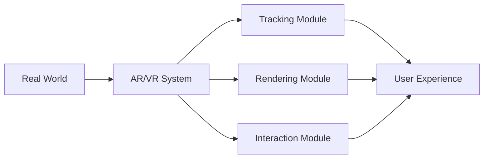

# 增强现实（AR）和虚拟现实（VR）技术的商业化与投资前景

> 关键词：增强现实（AR）、虚拟现实（VR）、商业化、投资前景、技术应用

> 摘要：本文深入探讨了增强现实（AR）和虚拟现实（VR）技术的商业化与投资前景。首先介绍了AR和VR技术的背景，包括目的范围、预期读者等内容。详细阐述了AR和VR的核心概念、联系以及相关算法原理。通过数学模型和公式对其技术原理进行了深入剖析，并给出具体示例。结合项目实战，展示了开发环境搭建、源代码实现与解读。分析了AR和VR技术在不同领域的实际应用场景，推荐了学习资源、开发工具框架以及相关论文著作。最后总结了未来发展趋势与挑战，解答常见问题，并提供扩展阅读和参考资料，为关注AR和VR技术商业化与投资的人士提供全面的技术和市场视角。

## 1. 背景介绍 
### 1.1 目的和范围
增强现实（AR）和虚拟现实（VR）技术近年来在科技领域引起了广泛关注。本文章的目的是全面分析这两项技术的商业化现状以及未来的投资前景。我们将涵盖AR和VR技术的基本原理、核心算法、数学模型等技术层面的内容，同时深入探讨它们在不同行业的应用案例以及市场发展趋势。范围涉及从技术研发到商业落地的整个产业链，旨在为投资者、创业者、技术爱好者等提供有价值的参考。

### 1.2 预期读者
本文的预期读者包括但不限于以下几类人群：
- 投资者：希望了解AR和VR技术的市场潜力和投资机会，评估投资风险和回报。
- 创业者：关注新兴技术趋势，寻找商业创新点，计划在AR和VR领域开展创业项目。
- 技术人员：对AR和VR技术的原理、算法和开发有深入研究的需求，希望通过实际案例提升技术水平。
- 行业分析师：需要对AR和VR市场进行全面分析和预测，为企业决策提供数据支持。
- 普通科技爱好者：对前沿科技感兴趣，希望了解AR和VR技术的发展动态和应用场景。

### 1.3 文档结构概述
本文将按照以下结构进行组织：
- 核心概念与联系：介绍AR和VR的基本概念、原理和架构，通过文本示意图和Mermaid流程图展示它们之间的联系。
- 核心算法原理 & 具体操作步骤：详细讲解AR和VR的核心算法，使用Python源代码进行示例说明。
- 数学模型和公式 & 详细讲解 & 举例说明：运用数学模型和公式深入剖析AR和VR技术的原理，并给出具体案例。
- 项目实战：代码实际案例和详细解释说明，包括开发环境搭建、源代码实现和代码解读。
- 实际应用场景：分析AR和VR技术在不同行业的实际应用案例。
- 工具和资源推荐：推荐学习资源、开发工具框架以及相关论文著作。
- 总结：未来发展趋势与挑战：总结AR和VR技术的未来发展趋势，分析面临的挑战。
- 附录：常见问题与解答：解答读者在阅读过程中可能遇到的常见问题。
- 扩展阅读 & 参考资料：提供相关的扩展阅读材料和参考资料。

### 1.4 术语表
#### 1.4.1 核心术语定义
- 增强现实（AR）：是一种将虚拟信息与真实世界场景相结合的技术，通过计算机生成的图像、声音、视频等虚拟元素，增强用户对现实世界的感知和交互体验。
- 虚拟现实（VR）：是一种创建和体验虚拟世界的计算机模拟技术，用户通过佩戴特定的设备（如头戴式显示器），完全沉浸在虚拟环境中，与虚拟世界进行交互。
- 跟踪技术：用于实时跟踪用户的头部、手部等身体部位的运动，以便准确地更新虚拟场景的视角和交互效果。
- 渲染技术：将虚拟场景中的三维模型、纹理等数据转换为二维图像的过程，以呈现给用户。
- 交互技术：支持用户与虚拟世界进行交互的技术，如手势识别、语音识别、眼动追踪等。

#### 1.4.2 相关概念解释
- 混合现实（MR）：是AR和VR技术的进一步融合，它允许虚拟物体与真实世界进行更深度的交互和融合，用户可以在真实环境中看到并操作虚拟物体。
- 全息投影：是一种利用干涉和衍射原理记录并再现物体真实三维图像的技术，可用于创建逼真的虚拟影像。
- 体感技术：通过传感器感知用户的身体动作和姿态，实现与虚拟世界的自然交互。

#### 1.4.3 缩略词列表
- AR：增强现实（Augmented Reality）
- VR：虚拟现实（Virtual Reality）
- MR：混合现实（Mixed Reality）
- SDK：软件开发工具包（Software Development Kit）
- API：应用程序编程接口（Application Programming Interface）

## 2. 核心概念与联系 

### 2.1 增强现实（AR）
增强现实技术通过摄像头或其他传感器获取现实场景的图像或视频，然后利用计算机算法将虚拟信息叠加到现实场景中，使用户在看到真实世界的同时，也能看到虚拟元素。例如，在手机上使用AR应用程序，用户可以通过摄像头看到周围的环境，同时在屏幕上看到虚拟的宠物、游戏角色等元素。

### 2.2 虚拟现实（VR）
虚拟现实技术则是创建一个完全虚拟的环境，用户通过佩戴头戴式显示器等设备，将自己的视觉、听觉等感官与现实世界隔离，完全沉浸在虚拟环境中。例如，在VR游戏中，用户可以身临其境地体验游戏场景，仿佛自己就在游戏世界中一样。

### 2.3 核心概念原理和架构的文本示意图
```plaintext
                +-------------------+
                |   Real World      |
                +-------------------+
                         |
                         |  Sensor Input (Camera, etc.)
                         v
                +-------------------+
                |  AR/VR System     |
                |                   |
                |  Tracking Module  |
                |  Rendering Module |
                |  Interaction Module|
                +-------------------+
                         |
                         |  Output (Display, Audio)
                         v
                +-------------------+
                |  User Experience  |
                +-------------------+
```

### 2.4 Mermaid流程图


在这个流程图中，现实世界的信息通过传感器输入到AR/VR系统中。系统中的跟踪模块负责实时跟踪用户的运动，渲染模块将虚拟场景进行渲染，交互模块支持用户与虚拟世界进行交互。最终，这些模块的输出共同构成了用户的体验。

## 3. 核心算法原理 & 具体操作步骤 

### 3.1 跟踪算法原理
跟踪算法是AR和VR技术中非常重要的一部分，它用于实时跟踪用户的头部、手部等身体部位的运动。常见的跟踪算法包括基于视觉的跟踪算法和基于惯性传感器的跟踪算法。

#### 基于视觉的跟踪算法
基于视觉的跟踪算法通过摄像头获取图像，然后利用特征提取和匹配算法来跟踪物体的运动。以下是一个简单的基于OpenCV的Python代码示例，用于跟踪图像中的物体：

```python
import cv2

# 初始化摄像头
cap = cv2.VideoCapture(0)

# 创建跟踪器
tracker = cv2.TrackerCSRT_create()

# 读取第一帧
ret, frame = cap.read()

# 选择跟踪区域
bbox = cv2.selectROI(frame, False)

# 初始化跟踪器
ok = tracker.init(frame, bbox)

while True:
    # 读取新的帧
    ret, frame = cap.read()
    if not ret:
        break

    # 更新跟踪器
    ok, bbox = tracker.update(frame)

    # 绘制跟踪框
    if ok:
        (x, y, w, h) = [int(v) for v in bbox]
        cv2.rectangle(frame, (x, y), (x + w, y + h), (0, 255, 0), 2)
    else:
        cv2.putText(frame, "Tracking failed", (100, 80), cv2.FONT_HERSHEY_SIMPLEX, 0.75, (0, 0, 255), 2)

    # 显示结果
    cv2.imshow("Tracking", frame)

    # 按 'q' 键退出
    if cv2.waitKey(1) & 0xFF == ord('q'):
        break

# 释放摄像头并关闭窗口
cap.release()
cv2.destroyAllWindows()
```

#### 基于惯性传感器的跟踪算法
基于惯性传感器的跟踪算法利用加速度计、陀螺仪等传感器来测量物体的加速度和角速度，从而计算出物体的运动轨迹。以下是一个简单的Python代码示例，用于模拟基于惯性传感器的跟踪：

```python
import numpy as np

# 初始化传感器数据
acceleration = np.array([0.1, 0.2, 0.3])  # 加速度
angular_velocity = np.array([0.01, 0.02, 0.03])  # 角速度

# 初始化位置和姿态
position = np.array([0, 0, 0])
orientation = np.array([1, 0, 0, 0])  # 四元数表示姿态

# 模拟时间步长
dt = 0.1

# 模拟跟踪过程
for i in range(10):
    # 更新位置
    position += acceleration * dt

    # 更新姿态
    # 这里简化处理，实际应用中需要更复杂的算法
    orientation += angular_velocity * dt

    print(f"Step {i}: Position = {position}, Orientation = {orientation}")
```

### 3.2 渲染算法原理
渲染算法用于将虚拟场景中的三维模型、纹理等数据转换为二维图像。常见的渲染算法包括光栅化渲染和光线追踪渲染。

#### 光栅化渲染
光栅化渲染是一种基于三角形的渲染算法，它将三维模型分解为多个三角形，然后将这些三角形投影到二维屏幕上，并对每个像素进行颜色计算。以下是一个简单的Python代码示例，用于实现基本的光栅化渲染：

```python
import numpy as np
import matplotlib.pyplot as plt

# 定义一个简单的三维模型（一个三角形）
vertices = np.array([[0, 0, 0], [1, 0, 0], [0, 1, 0]])

# 定义投影矩阵
projection_matrix = np.array([[1, 0, 0], [0, 1, 0]])

# 投影顶点到二维平面
projected_vertices = np.dot(vertices, projection_matrix.T)

# 绘制三角形
plt.fill(projected_vertices[:, 0], projected_vertices[:, 1], 'r')
plt.axis('equal')
plt.show()
```

#### 光线追踪渲染
光线追踪渲染是一种基于物理的渲染算法，它模拟光线在场景中的传播和反射，从而生成逼真的图像。以下是一个简单的Python代码示例，用于实现基本的光线追踪渲染：

```python
import numpy as np
import matplotlib.pyplot as plt

# 定义场景中的物体（一个球体）
sphere_center = np.array([0, 0, -5])
sphere_radius = 1

# 定义相机参数
camera_position = np.array([0, 0, 0])
image_width = 800
image_height = 600

# 创建图像数组
image = np.zeros((image_height, image_width, 3))

# 遍历每个像素
for y in range(image_height):
    for x in range(image_width):
        # 计算射线方向
        pixel_x = (x - image_width / 2) / image_width
        pixel_y = (y - image_height / 2) / image_height
        ray_direction = np.array([pixel_x, pixel_y, -1])
        ray_direction = ray_direction / np.linalg.norm(ray_direction)

        # 计算射线与球体的交点
        oc = camera_position - sphere_center
        a = np.dot(ray_direction, ray_direction)
        b = 2.0 * np.dot(oc, ray_direction)
        c = np.dot(oc, oc) - sphere_radius**2
        discriminant = b**2 - 4 * a * c

        if discriminant >= 0:
            # 射线与球体相交
            image[y, x] = [1, 0, 0]  # 红色
        else:
            # 射线与球体不相交
            image[y, x] = [0, 0, 1]  # 蓝色

# 显示图像
plt.imshow(image)
plt.show()
```

### 3.3 交互算法原理
交互算法用于支持用户与虚拟世界进行交互，常见的交互算法包括手势识别、语音识别、眼动追踪等。以下是一个简单的Python代码示例，用于实现基本的手势识别：

```python
import cv2
import numpy as np

# 初始化摄像头
cap = cv2.VideoCapture(0)

while True:
    # 读取帧
    ret, frame = cap.read()
    if not ret:
        break

    # 转换为灰度图像
    gray = cv2.cvtColor(frame, cv2.COLOR_BGR2GRAY)

    # 进行高斯模糊
    blurred = cv2.GaussianBlur(gray, (5, 5), 0)

    # 进行阈值处理
    _, thresh = cv2.threshold(blurred, 127, 255, cv2.THRESH_BINARY)

    # 查找轮廓
    contours, _ = cv2.findContours(thresh.copy(), cv2.RETR_EXTERNAL, cv2.CHAIN_APPROX_SIMPLE)

    if len(contours) > 0:
        # 找到最大的轮廓
        max_contour = max(contours, key=cv2.contourArea)

        # 计算轮廓的凸包
        hull = cv2.convexHull(max_contour)

        # 绘制轮廓和凸包
        cv2.drawContours(frame, [max_contour], 0, (0, 255, 0), 2)
        cv2.drawContours(frame, [hull], 0, (0, 0, 255), 2)

        # 计算凸缺陷
        hull_indices = cv2.convexHull(max_contour, returnPoints=False)
        defects = cv2.convexityDefects(max_contour, hull_indices)

        if defects is not None:
            for i in range(defects.shape[0]):
                s, e, f, d = defects[i, 0]
                start = tuple(max_contour[s][0])
                end = tuple(max_contour[e][0])
                far = tuple(max_contour[f][0])
                cv2.line(frame, start, end, [0, 255, 0], 2)
                cv2.circle(frame, far, 5, [0, 0, 255], -1)

    # 显示结果
    cv2.imshow("Gesture Recognition", frame)

    # 按 'q' 键退出
    if cv2.waitKey(1) & 0xFF == ord('q'):
        break

# 释放摄像头并关闭窗口
cap.release()
cv2.destroyAllWindows()
```

## 4. 数学模型和公式 & 详细讲解 & 举例说明 

### 4.1 投影变换公式
在AR和VR技术中，投影变换是将三维空间中的点转换为二维屏幕上的点的重要步骤。常见的投影变换包括透视投影和正交投影。

#### 透视投影
透视投影模拟了人眼观察物体的方式，近大远小。透视投影矩阵可以表示为：

$$
P = 
\begin{bmatrix}
\frac{2n}{r - l} & 0 & \frac{r + l}{r - l} & 0 \\
0 & \frac{2n}{t - b} & \frac{t + b}{t - b} & 0 \\
0 & 0 & -\frac{f + n}{f - n} & -\frac{2fn}{f - n} \\
0 & 0 & -1 & 0
\end{bmatrix}
$$

其中，$n$ 是近裁剪面的距离，$f$ 是远裁剪面的距离，$l$ 和 $r$ 分别是左和右裁剪面的坐标，$b$ 和 $t$ 分别是下和上裁剪面的坐标。

#### 正交投影
正交投影不考虑物体的远近，所有物体在投影后保持相同的大小。正交投影矩阵可以表示为：

$$
P = 
\begin{bmatrix}
\frac{2}{r - l} & 0 & 0 & -\frac{r + l}{r - l} \\
0 & \frac{2}{t - b} & 0 & -\frac{t + b}{t - b} \\
0 & 0 & -\frac{2}{f - n} & -\frac{f + n}{f - n} \\
0 & 0 & 0 & 1
\end{bmatrix}
$$

### 4.2 四元数旋转公式
在AR和VR技术中，四元数常用于表示物体的旋转。四元数可以表示为 $q = w + xi + yj + zk$，其中 $w$ 是实部，$x, y, z$ 是虚部。四元数的乘法可以用于组合多个旋转。

设 $q_1 = w_1 + x_1i + y_1j + z_1k$ 和 $q_2 = w_2 + x_2i + y_2j + z_2k$ 是两个四元数，则它们的乘积为：

$$
q_1q_2 = (w_1w_2 - x_1x_2 - y_1y_2 - z_1z_2) + (w_1x_2 + x_1w_2 + y_1z_2 - z_1y_2)i + (w_1y_2 - x_1z_2 + y_1w_2 + z_1x_2)j + (w_1z_2 + x_1y_2 - y_1x_2 + z_1w_2)k
$$

四元数可以用于旋转一个三维向量 $\vec{v}$。设 $q$ 是一个四元数，$\vec{v}$ 是一个三维向量，则旋转后的向量 $\vec{v}'$ 可以表示为：

$$
\vec{v}' = q\vec{v}q^{-1}
$$

其中，$q^{-1}$ 是 $q$ 的逆四元数。

### 4.3 举例说明
假设我们有一个三维点 $P = (1, 2, 3)$，我们想将其进行透视投影。设近裁剪面距离 $n = 1$，远裁剪面距离 $f = 10$，左裁剪面坐标 $l = -1$，右裁剪面坐标 $r = 1$，下裁剪面坐标 $b = -1$，上裁剪面坐标 $t = 1$。

首先，我们可以计算透视投影矩阵 $P$：

```python
import numpy as np

n = 1
f = 10
l = -1
r = 1
b = -1
t = 1

P = np.array([
    [2 * n / (r - l), 0, (r + l) / (r - l), 0],
    [0, 2 * n / (t - b), (t + b) / (t - b), 0],
    [0, 0, -(f + n) / (f - n), -2 * f * n / (f - n)],
    [0, 0, -1, 0]
])

P = np.array([
    [2 * n / (r - l), 0, (r + l) / (r - l), 0],
    [0, 2 * n / (t - b), (t + b) / (t - b), 0],
    [0, 0, -(f + n) / (f - n), -2 * f * n / (f - n)],
    [0, 0, -1, 0]
])

# 定义三维点 P
P_point = np.array([1, 2, 3, 1])

# 进行投影变换
projected_point = np.dot(P, P_point)

# 进行透视除法
projected_point = projected_point[:3] / projected_point[3]

print("投影后的点:", projected_point)
```

在这个例子中，我们通过计算透视投影矩阵，将三维点 $P$ 投影到二维平面上。最终得到的投影后的点就是在屏幕上的坐标。

## 5. 项目实战：代码实际案例和详细解释说明 

### 5.1  开发环境搭建
在进行AR和VR项目开发之前，需要搭建相应的开发环境。以下是一些常见的开发环境搭建步骤：

#### 安装Python
Python是一种常用的编程语言，在AR和VR开发中也有广泛的应用。可以从Python官方网站（https://www.python.org/downloads/）下载并安装Python。

#### 安装开发库
在AR和VR开发中，常用的开发库包括OpenCV、NumPy、Matplotlib等。可以使用pip命令来安装这些库：

```sh
pip install opencv-python numpy matplotlib
```

#### 安装AR/VR开发工具包
如果要进行AR/VR应用开发，还需要安装相应的开发工具包，如Unity、Unreal Engine等。这些工具包提供了丰富的功能和接口，方便开发者创建AR/VR应用。

### 5.2  源代码详细实现和代码解读
以下是一个简单的AR项目示例，使用OpenCV和Python实现将虚拟物体叠加到现实场景中：

```python
import cv2
import numpy as np

# 读取现实场景图像
scene_image = cv2.imread('scene.jpg')

# 读取虚拟物体图像
object_image = cv2.imread('object.png', -1)

# 获取虚拟物体的尺寸
object_height, object_width = object_image.shape[:2]

# 定义虚拟物体在现实场景中的位置
x = 100
y = 100

# 提取虚拟物体的透明度通道
alpha = object_image[:, :, 3] / 255.0

# 循环遍历虚拟物体的每个像素
for i in range(object_height):
    for j in range(object_width):
        # 计算虚拟物体在现实场景中的位置
        scene_x = x + j
        scene_y = y + i

        # 检查位置是否在现实场景范围内
        if scene_x < scene_image.shape[1] and scene_y < scene_image.shape[0]:
            # 混合虚拟物体和现实场景
            for c in range(3):
                scene_image[scene_y, scene_x, c] = (
                    alpha[i, j] * object_image[i, j, c] +
                    (1 - alpha[i, j]) * scene_image[scene_y, scene_x, c]
                )

# 显示结果
cv2.imshow('AR Result', scene_image)
cv2.waitKey(0)
cv2.destroyAllWindows()
```

#### 代码解读
1. **读取图像**：使用 `cv2.imread` 函数读取现实场景图像和虚拟物体图像。
2. **获取虚拟物体尺寸**：使用 `shape` 属性获取虚拟物体的高度和宽度。
3. **定义位置**：定义虚拟物体在现实场景中的位置。
4. **提取透明度通道**：使用 `object_image[:, :, 3]` 提取虚拟物体的透明度通道，并将其归一化到0到1之间。
5. **混合图像**：通过循环遍历虚拟物体的每个像素，将虚拟物体和现实场景进行混合。
6. **显示结果**：使用 `cv2.imshow` 函数显示混合后的图像。

### 5.3  代码解读与分析
通过上述代码，我们实现了一个简单的AR效果，将虚拟物体叠加到现实场景中。在实际应用中，还需要考虑更多的因素，如跟踪技术、光照处理等。

跟踪技术可以确保虚拟物体能够随着用户的移动而实时更新位置和姿态。光照处理可以使虚拟物体更好地融入现实场景，提高真实感。此外，还可以使用更复杂的算法和技术，如三维重建、深度学习等，来提升AR应用的性能和效果。

## 6. 实际应用场景 
### 6.1 游戏娱乐
AR和VR技术在游戏娱乐领域有着广泛的应用。例如，AR游戏《Pokémon Go》让玩家在现实世界中捕捉虚拟的宝可梦，极大地增强了游戏的趣味性和互动性。VR游戏则可以让玩家完全沉浸在虚拟的游戏世界中，提供更加逼真的游戏体验。

### 6.2 教育领域
在教育领域，AR和VR技术可以为学生提供更加生动、直观的学习体验。例如，通过AR技术，学生可以在教材上看到虚拟的三维模型，更加深入地理解知识点。VR技术则可以创建虚拟的教学场景，如历史事件重现、科学实验模拟等，让学生身临其境地感受学习内容。

### 6.3 医疗保健
AR和VR技术在医疗保健领域也有着重要的应用。例如，在手术导航中，AR技术可以将患者的医学影像叠加到现实场景中，帮助医生更准确地进行手术操作。VR技术则可以用于康复治疗，通过创建虚拟的康复环境，帮助患者进行康复训练。

### 6.4 工业制造
在工业制造领域，AR和VR技术可以用于产品设计、生产过程监控等方面。例如，设计师可以使用VR技术创建虚拟的产品模型，进行虚拟装配和测试，提高设计效率和质量。AR技术则可以在生产线上为工人提供实时的操作指导，减少错误和提高生产效率。

### 6.5 房地产
在房地产领域，AR和VR技术可以为购房者提供更加直观的看房体验。通过VR技术，购房者可以身临其境地参观虚拟的房屋，了解房屋的布局和装修情况。AR技术则可以在现实场景中叠加房屋的虚拟信息，如户型图、装修效果等，帮助购房者更好地了解房屋情况。

## 7. 工具和资源推荐
### 7.1 学习资源推荐
#### 7.1.1 书籍推荐
- 《虚拟现实技术及应用》：介绍了虚拟现实技术的基本原理、算法和应用案例。
- 《增强现实：原理、技术与应用》：详细讲解了增强现实技术的核心概念、算法和开发方法。
- 《计算机图形学（第四版）》：涵盖了计算机图形学的基础知识，包括渲染、几何变换等内容，对AR和VR技术的学习有很大帮助。

#### 7.1.2 在线课程
- Coursera上的“Virtual Reality”课程：由知名高校的教授授课，系统地介绍了虚拟现实技术的原理和应用。
- Udemy上的“Augmented Reality Development with Unity”课程：通过实际项目，教你如何使用Unity开发增强现实应用。
- edX上的“Computer Graphics Fundamentals”课程：讲解了计算机图形学的基础知识，为学习AR和VR技术打下坚实的基础。

#### 7.1.3 技术博客和网站
- AR/VR World（https://www.arvrworld.com/）：提供了AR和VR技术的最新资讯、行业动态和技术文章。
- UploadVR（https://uploadvr.com/）：专注于VR和AR游戏、应用的评测和报道。
- Medium上的AR/VR相关博客：有很多开发者和专家分享他们的经验和见解。

### 7.2 开发工具框架推荐
#### 7.2.1 IDE和编辑器
- Unity：是一款广泛使用的游戏开发引擎，也支持AR和VR应用开发。它提供了丰富的功能和工具，方便开发者创建高质量的AR/VR应用。
- Unreal Engine：另一款强大的游戏开发引擎，具有出色的图形渲染能力，适用于开发大型的AR/VR项目。
- Visual Studio Code：是一款轻量级的代码编辑器，支持多种编程语言，可用于AR/VR项目的代码编写和调试。

#### 7.2.2 调试和性能分析工具
- Unity Profiler：可以帮助开发者分析Unity项目的性能瓶颈，优化代码和资源使用。
- Unreal Insights：是Unreal Engine的性能分析工具，提供了详细的性能数据和可视化界面。
- RenderDoc：是一款开源的图形调试工具，可用于分析AR/VR应用的渲染性能。

#### 7.2.3 相关框架和库
- ARCore：是Google推出的AR开发框架，支持Android设备，提供了丰富的AR功能和接口。
- ARKit：是Apple推出的AR开发框架，支持iOS设备，为开发者提供了简单易用的AR开发工具。
- OpenCV：是一个开源的计算机视觉库，可用于AR和VR中的图像和视频处理、跟踪等任务。

### 7.3 相关论文著作推荐
#### 7.3.1 经典论文
- “A Survey of Augmented Reality”：对增强现实技术进行了全面的综述，介绍了AR的发展历程、核心技术和应用领域。
- “Virtual Reality: A Definition and Taxonomy”：给出了虚拟现实的定义和分类方法，对理解VR技术有重要的参考价值。
- “The Design of Everyday Things”：虽然不是专门针对AR和VR的论文，但它提出的设计原则对AR/VR应用的用户体验设计有很大的启示。

#### 7.3.2 最新研究成果
- 可以通过IEEE Xplore、ACM Digital Library等学术数据库搜索关于AR和VR的最新研究论文，了解该领域的前沿技术和发展趋势。

#### 7.3.3 应用案例分析
- 《AR/VR Case Studies: Real-World Examples of Augmented and Virtual Reality in Business》：收集了AR和VR技术在商业领域的实际应用案例，对创业者和投资者有很大的参考价值。

## 8. 总结：未来发展趋势与挑战
### 8.1 未来发展趋势
#### 技术融合
AR和VR技术将与其他新兴技术，如人工智能、5G、物联网等深度融合。例如，人工智能可以为AR/VR应用提供更智能的交互和内容生成，5G技术可以提供更高速的网络连接，支持更流畅的AR/VR体验，物联网可以将虚拟世界与现实世界的设备进行连接，实现更丰富的应用场景。

#### 应用场景拓展
AR和VR技术的应用场景将不断拓展，除了游戏娱乐、教育、医疗等领域，还将在文化艺术、旅游、社交等领域得到更广泛的应用。例如，在文化艺术领域，AR/VR技术可以让观众身临其境地欣赏艺术品，增强艺术体验。

#### 硬件设备升级
随着技术的不断进步，AR/VR硬件设备将不断升级，变得更加轻便、舒适、高性能。例如，未来的头戴式显示器可能会采用更先进的显示技术，提供更高的分辨率和更广阔的视野，同时减轻设备的重量和体积。

### 8.2 挑战
#### 技术瓶颈
目前，AR和VR技术仍然存在一些技术瓶颈，如跟踪精度、渲染性能、交互体验等方面。提高这些技术指标需要进一步的研究和创新。

#### 内容创作难度
高质量的AR/VR内容创作需要专业的技术和创意人才，目前内容创作的难度较大，数量和质量都有待提高。

#### 市场接受度
虽然AR和VR技术具有很大的发展潜力，但目前市场接受度仍然有限。消费者对AR/VR设备的价格、使用舒适度等方面存在一定的顾虑，需要进一步的市场培育和推广。

#### 隐私和安全问题
AR和VR技术涉及到大量的用户数据和个人信息，隐私和安全问题不容忽视。如何保障用户的隐私和数据安全，是AR/VR技术发展面临的重要挑战之一。

## 9. 附录：常见问题与解答
### 9.1 AR和VR有什么区别？
AR是将虚拟信息与真实世界场景相结合，用户可以在看到真实世界的同时，也能看到虚拟元素。而VR是创建一个完全虚拟的环境，用户完全沉浸在虚拟世界中，与现实世界隔离。

### 9.2 AR/VR技术的发展前景如何？
AR/VR技术具有广阔的发展前景，在游戏娱乐、教育、医疗、工业制造等领域都有很大的应用潜力。随着技术的不断进步和市场的逐渐成熟，AR/VR技术有望成为未来的主流技术之一。

### 9.3 如何学习AR/VR开发？
可以通过学习相关的书籍、在线课程，参加培训等方式来学习AR/VR开发。同时，需要掌握一定的编程语言和计算机图形学知识，如Python、Unity、OpenGL等。

### 9.4 AR/VR设备的价格贵吗？
目前，AR/VR设备的价格相对较高，但随着技术的不断进步和市场的竞争加剧，价格有望逐渐下降。同时，也有一些价格较为亲民的入门级设备可供选择。

### 9.5 AR/VR技术存在哪些风险？
AR/VR技术存在一些风险，如隐私和安全问题、对用户身体健康的影响等。在使用AR/VR设备时，需要注意保护个人隐私和数据安全，同时合理控制使用时间，避免对身体健康造成不良影响。

## 10. 扩展阅读 & 参考资料
### 10.1 扩展阅读
- 《The VR Book: Human-Centered Design for Virtual Reality》
- 《AR in Practice: A Guide to Augmented Reality in Business》
- 《Virtual Reality: Concepts and Applications》

### 10.2 参考资料
- IEEE Transactions on Visualization and Computer Graphics
- ACM SIGGRAPH Conference Proceedings
- AR/VR industry reports from market research firms such as IDC, Gartner

作者：AI天才研究院/AI Genius Institute & 禅与计算机程序设计艺术 /Zen And The Art of Computer Programming