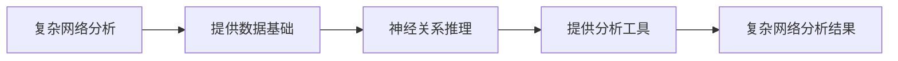

# 复杂网络分析中神经关系推理的优化技术

> 关键词：复杂网络分析、神经关系推理、优化技术、深度学习、图神经网络

> 摘要：本文聚焦于复杂网络分析中神经关系推理的优化技术。首先介绍了相关背景，包括目的、预期读者、文档结构和术语表。接着阐述了核心概念与联系，通过文本示意图和 Mermaid 流程图进行说明。详细讲解了核心算法原理，并用 Python 代码进行阐述，同时给出了数学模型和公式。通过项目实战展示了代码的实际应用和详细解读。探讨了实际应用场景，推荐了学习资源、开发工具框架和相关论文著作。最后总结了未来发展趋势与挑战，并给出常见问题解答和扩展阅读参考资料。旨在为研究者和开发者在复杂网络的神经关系推理优化方面提供全面且深入的指导。

## 1. 背景介绍 
### 1.1 目的和范围
在当今信息爆炸的时代，复杂网络无处不在，如社交网络、生物网络、电力网络等。这些网络中蕴含着丰富的关系信息，对其进行准确的关系推理具有重要的现实意义。例如，在社交网络中，通过推理用户之间的关系可以实现精准的推荐系统；在生物网络中，了解蛋白质之间的相互作用关系有助于药物研发。然而，复杂网络的规模庞大、结构复杂，传统的关系推理方法面临着计算效率低、准确性差等问题。因此，本文的目的是探讨复杂网络分析中神经关系推理的优化技术，提高关系推理的效率和准确性。

本文的范围主要涵盖复杂网络分析中神经关系推理的基本概念、核心算法、数学模型、实际应用以及相关的优化技术。我们将从理论和实践两个方面进行深入研究，为读者提供全面的知识体系和实用的技术方法。

### 1.2 预期读者
本文预期读者包括计算机科学、数据科学、统计学、物理学等相关领域的研究者和学生，以及从事复杂网络分析、人工智能、机器学习等方面工作的工程师和开发者。对于对复杂网络和关系推理感兴趣的初学者，本文可以作为入门学习的资料；对于有一定基础的专业人士，本文提供的优化技术和实际应用案例可以为他们的研究和开发工作提供新的思路和方法。

### 1.3 文档结构概述
本文将按照以下结构进行组织：
1. **背景介绍**：介绍本文的目的、预期读者、文档结构和术语表。
2. **核心概念与联系**：阐述复杂网络分析、神经关系推理的核心概念，并通过文本示意图和 Mermaid 流程图展示它们之间的联系。
3. **核心算法原理 & 具体操作步骤**：详细讲解神经关系推理的核心算法原理，并用 Python 代码进行实现和说明。
4. **数学模型和公式 & 详细讲解 & 举例说明**：给出神经关系推理的数学模型和公式，并通过具体例子进行详细讲解。
5. **项目实战：代码实际案例和详细解释说明**：通过一个实际项目，展示神经关系推理的代码实现和详细解读。
6. **实际应用场景**：探讨神经关系推理在不同领域的实际应用场景。
7. **工具和资源推荐**：推荐学习资源、开发工具框架和相关论文著作。
8. **总结：未来发展趋势与挑战**：总结神经关系推理的未来发展趋势和面临的挑战。
9. **附录：常见问题与解答**：解答读者在学习和实践过程中可能遇到的常见问题。
10. **扩展阅读 & 参考资料**：提供相关的扩展阅读材料和参考资料。

### 1.4 术语表
#### 1.4.1 核心术语定义
- **复杂网络**：由大量节点和连接这些节点的边组成的网络，其结构和动态行为具有复杂性，如无标度性、小世界性等。
- **神经关系推理**：利用神经网络模型对复杂网络中节点之间的关系进行推理和预测的技术。
- **图神经网络（GNN）**：一类专门用于处理图结构数据的神经网络，能够有效地捕捉图中节点和边的信息。
- **嵌入向量**：将复杂网络中的节点或边映射到低维向量空间中的表示，便于神经网络进行处理。

#### 1.4.2 相关概念解释
- **节点特征**：复杂网络中每个节点所具有的属性信息，如社交网络中用户的年龄、性别等。
- **边特征**：连接节点的边所具有的属性信息，如社交网络中用户之间的互动频率、关系类型等。
- **邻接矩阵**：用于表示复杂网络中节点之间连接关系的矩阵，矩阵中的元素表示节点之间是否存在边以及边的权重。

#### 1.4.3 缩略词列表
- **GNN**：Graph Neural Network（图神经网络）
- **MLP**：Multi - Layer Perceptron（多层感知机）
- **ReLU**：Rectified Linear Unit（修正线性单元）

## 2. 核心概念与联系 

### 复杂网络分析
复杂网络分析是研究复杂系统中个体之间相互关系的学科。复杂网络由节点和边组成，节点代表系统中的个体，边代表个体之间的相互作用。复杂网络具有多种特性，如度分布、聚类系数、最短路径长度等，这些特性反映了网络的结构和功能。

### 神经关系推理
神经关系推理是利用神经网络对复杂网络中节点之间的关系进行推理和预测的技术。它通过学习网络中节点和边的特征，建立关系推理模型，从而预测未知的关系。神经关系推理的核心思想是将复杂网络中的信息转化为神经网络可以处理的形式，如嵌入向量，然后利用神经网络的强大学习能力进行关系推理。

### 两者的联系
复杂网络分析为神经关系推理提供了数据基础，神经关系推理为复杂网络分析提供了强大的工具。通过神经关系推理，可以更深入地挖掘复杂网络中的关系信息，提高复杂网络分析的准确性和效率。

### 文本示意图
```plaintext
复杂网络分析
    |
    | 提供数据基础
    v
神经关系推理
    |
    | 提供分析工具
    v
复杂网络分析结果
```

### Mermaid 流程图


## 3. 核心算法原理 & 具体操作步骤 

### 核心算法原理
神经关系推理的核心算法通常基于图神经网络（GNN）。GNN 可以通过消息传递机制来聚合节点的邻域信息，从而学习节点的嵌入向量。具体来说，GNN 的每一层都包含以下两个步骤：
1. **消息传递**：节点将自己的特征信息传递给其邻接节点。
2. **信息聚合**：节点将接收到的邻域信息和自己的特征信息进行聚合，更新自己的特征表示。

通过多层的消息传递和信息聚合，GNN 可以学习到节点在整个网络中的上下文信息，从而得到更准确的节点嵌入向量。然后，我们可以利用这些嵌入向量进行关系推理，例如通过一个多层感知机（MLP）来预测节点之间的关系。

### 具体操作步骤
#### 步骤 1：数据预处理
将复杂网络数据转换为适合 GNN 处理的格式，包括构建节点特征矩阵、边索引矩阵和边特征矩阵。

#### 步骤 2：定义 GNN 模型
选择合适的 GNN 架构，如 Graph Convolutional Network（GCN）、Graph Attention Network（GAT）等，并定义模型的层数和每层的神经元数量。

#### 步骤 3：训练 GNN 模型
使用训练数据对 GNN 模型进行训练，通过最小化损失函数来优化模型的参数。

#### 步骤 4：关系推理
使用训练好的 GNN 模型得到节点的嵌入向量，然后通过一个 MLP 进行关系推理，预测节点之间的关系。

### Python 代码实现
```python
import torch
import torch.nn.functional as F
from torch_geometric.nn import GCNConv

# 定义 GNN 模型
class GNN(torch.nn.Module):
    def __init__(self, in_channels, hidden_channels, out_channels):
        super(GNN, self).__init__()
        self.conv1 = GCNConv(in_channels, hidden_channels)
        self.conv2 = GCNConv(hidden_channels, out_channels)

    def forward(self, x, edge_index):
        x = self.conv1(x, edge_index)
        x = F.relu(x)
        x = F.dropout(x, training=self.training)
        x = self.conv2(x, edge_index)
        return F.log_softmax(x, dim=1)

# 定义 MLP 模型用于关系推理
class RelationInference(torch.nn.Module):
    def __init__(self, in_channels, hidden_channels, out_channels):
        super(RelationInference, self).__init__()
        self.mlp = torch.nn.Sequential(
            torch.nn.Linear(in_channels * 2, hidden_channels),
            torch.nn.ReLU(),
            torch.nn.Linear(hidden_channels, out_channels)
        )

    def forward(self, node_embeddings, edge_index):
        src_embeddings = node_embeddings[edge_index[0]]
        dst_embeddings = node_embeddings[edge_index[1]]
        input_embeddings = torch.cat([src_embeddings, dst_embeddings], dim=1)
        output = self.mlp(input_embeddings)
        return output

# 示例数据
num_nodes = 100
num_features = 16
num_classes = 2
edge_index = torch.randint(0, num_nodes, (2, 200))
x = torch.randn(num_nodes, num_features)

# 初始化模型
gnn_model = GNN(num_features, 32, 16)
relation_model = RelationInference(16, 32, num_classes)

# 前向传播
node_embeddings = gnn_model(x, edge_index)
relation_output = relation_model(node_embeddings, edge_index)
print(relation_output.shape)
```

## 4. 数学模型和公式 & 详细讲解 & 举例说明 

### 图神经网络的数学模型
#### 消息传递机制
在图神经网络中，第 $l$ 层的消息传递可以表示为：
$$m_{i}^{l+1} = \sum_{j \in \mathcal{N}(i)} M^{l}(h_{i}^{l}, h_{j}^{l}, e_{ij})$$
其中，$m_{i}^{l+1}$ 是节点 $i$ 在第 $l+1$ 层接收到的消息，$\mathcal{N}(i)$ 是节点 $i$ 的邻域节点集合，$h_{i}^{l}$ 和 $h_{j}^{l}$ 分别是节点 $i$ 和节点 $j$ 在第 $l$ 层的特征表示，$e_{ij}$ 是节点 $i$ 和节点 $j$ 之间的边特征，$M^{l}$ 是消息传递函数。

#### 信息聚合机制
节点 $i$ 在第 $l+1$ 层的特征更新可以表示为：
$$h_{i}^{l+1} = U^{l}(h_{i}^{l}, m_{i}^{l+1})$$
其中，$U^{l}$ 是信息聚合函数。

### 以 GCN 为例的具体公式
在 Graph Convolutional Network（GCN）中，消息传递和信息聚合的公式可以简化为：
$$H^{l+1} = \sigma(\tilde{D}^{-\frac{1}{2}} \tilde{A} \tilde{D}^{-\frac{1}{2}} H^{l} W^{l})$$
其中，$H^{l}$ 是第 $l$ 层的节点特征矩阵，$\tilde{A} = A + I$ 是邻接矩阵加上自环矩阵，$\tilde{D}$ 是 $\tilde{A}$ 的度矩阵，$W^{l}$ 是第 $l$ 层的可学习权重矩阵，$\sigma$ 是激活函数，如 ReLU。

### 关系推理的数学模型
假设我们已经得到了节点的嵌入向量 $h_{i}$ 和 $h_{j}$，我们可以通过一个多层感知机（MLP）来预测节点 $i$ 和节点 $j$ 之间的关系：
$$\hat{y}_{ij} = \text{MLP}(h_{i}, h_{j})$$
其中，$\hat{y}_{ij}$ 是预测的关系标签。

### 举例说明
假设我们有一个简单的社交网络，包含 4 个节点和 3 条边，邻接矩阵 $A$ 如下：
$$A = \begin{bmatrix}
0 & 1 & 0 & 0 \\
1 & 0 & 1 & 0 \\
0 & 1 & 0 & 1 \\
0 & 0 & 1 & 0
\end{bmatrix}$$
节点特征矩阵 $H^{0}$ 如下：
$$H^{0} = \begin{bmatrix}
1 & 0 \\
0 & 1 \\
1 & 1 \\
0 & 0
\end{bmatrix}$$
可学习权重矩阵 $W^{0}$ 如下：
$$W^{0} = \begin{bmatrix}
0.1 & 0.2 \\
0.3 & 0.4
\end{bmatrix}$$
首先，计算 $\tilde{A} = A + I$：
$$\tilde{A} = \begin{bmatrix}
1 & 1 & 0 & 0 \\
1 & 1 & 1 & 0 \\
0 & 1 & 1 & 1 \\
0 & 0 & 1 & 1
\end{bmatrix}$$
然后，计算 $\tilde{D}$：
$$\tilde{D} = \begin{bmatrix}
2 & 0 & 0 & 0 \\
0 & 3 & 0 & 0 \\
0 & 0 & 3 & 0 \\
0 & 0 & 0 & 2
\end{bmatrix}$$
接着，计算 $\tilde{D}^{-\frac{1}{2}}$：
$$\tilde{D}^{-\frac{1}{2}} = \begin{bmatrix}
\frac{1}{\sqrt{2}} & 0 & 0 & 0 \\
0 & \frac{1}{\sqrt{3}} & 0 & 0 \\
0 & 0 & \frac{1}{\sqrt{3}} & 0 \\
0 & 0 & 0 & \frac{1}{\sqrt{2}}
\end{bmatrix}$$
再计算 $\tilde{D}^{-\frac{1}{2}} \tilde{A} \tilde{D}^{-\frac{1}{2}}$：
$$\tilde{D}^{-\frac{1}{2}} \tilde{A} \tilde{D}^{-\frac{1}{2}} = \begin{bmatrix}
\frac{1}{2} & \frac{1}{\sqrt{6}} & 0 & 0 \\
\frac{1}{\sqrt{6}} & \frac{1}{3} & \frac{1}{3} & 0 \\
0 & \frac{1}{3} & \frac{1}{3} & \frac{1}{\sqrt{6}} \\
0 & 0 & \frac{1}{\sqrt{6}} & \frac{1}{2}
\end{bmatrix}$$
最后，计算 $H^{1}$：
$$H^{1} = \text{ReLU}(\tilde{D}^{-\frac{1}{2}} \tilde{A} \tilde{D}^{-\frac{1}{2}} H^{0} W^{0})$$
通过以上计算，我们可以得到节点在第一层的特征表示。然后，我们可以利用这些特征表示进行关系推理。

## 5. 项目实战：代码实际案例和详细解释说明 

### 5.1  开发环境搭建
#### 安装 Python
首先，确保你已经安装了 Python 3.6 或更高版本。你可以从 Python 官方网站（https://www.python.org/downloads/）下载并安装。

#### 安装 PyTorch 和 PyTorch Geometric
使用以下命令安装 PyTorch 和 PyTorch Geometric：
```bash
pip install torch
pip install torch-geometric
```

### 5.2  源代码详细实现和代码解读
```python
import torch
import torch.nn.functional as F
from torch_geometric.datasets import Planetoid
import torch_geometric.transforms as T
from torch_geometric.nn import GCNConv

# 加载数据集
dataset = Planetoid(root='data/Planetoid', name='Cora', transform=T.NormalizeFeatures())
data = dataset[0]

# 定义 GNN 模型
class GCN(torch.nn.Module):
    def __init__(self, in_channels, hidden_channels, out_channels):
        super(GCN, self).__init__()
        self.conv1 = GCNConv(in_channels, hidden_channels)
        self.conv2 = GCNConv(hidden_channels, out_channels)

    def forward(self, x, edge_index):
        x = self.conv1(x, edge_index)
        x = F.relu(x)
        x = F.dropout(x, training=self.training)
        x = self.conv2(x, edge_index)
        return F.log_softmax(x, dim=1)

# 初始化模型、优化器和损失函数
model = GCN(dataset.num_node_features, 16, dataset.num_classes)
optimizer = torch.optim.Adam(model.parameters(), lr=0.01, weight_decay=5e-4)
criterion = torch.nn.NLLLoss()

# 训练模型
def train():
    model.train()
    optimizer.zero_grad()
    out = model(data.x, data.edge_index)
    loss = criterion(out[data.train_mask], data.y[data.train_mask])
    loss.backward()
    optimizer.step()
    return loss.item()

# 测试模型
def test():
    model.eval()
    out = model(data.x, data.edge_index)
    pred = out.argmax(dim=1)
    test_correct = pred[data.test_mask] == data.y[data.test_mask]
    test_acc = int(test_correct.sum()) / int(data.test_mask.sum())
    return test_acc

# 训练和测试循环
for epoch in range(200):
    loss = train()
    if (epoch + 1) % 10 == 0:
        test_acc = test()
        print(f'Epoch: {epoch+1}, Loss: {loss:.4f}, Test Acc: {test_acc:.4f}')
```

### 5.3  代码解读与分析
#### 数据加载
```python
dataset = Planetoid(root='data/Planetoid', name='Cora', transform=T.NormalizeFeatures())
data = dataset[0]
```
这部分代码使用 `Planetoid` 数据集加载 Cora 数据集，并对节点特征进行归一化处理。

#### 模型定义
```python
class GCN(torch.nn.Module):
    def __init__(self, in_channels, hidden_channels, out_channels):
        super(GCN, self).__init__()
        self.conv1 = GCNConv(in_channels, hidden_channels)
        self.conv2 = GCNConv(hidden_channels, out_channels)

    def forward(self, x, edge_index):
        x = self.conv1(x, edge_index)
        x = F.relu(x)
        x = F.dropout(x, training=self.training)
        x = self.conv2(x, edge_index)
        return F.log_softmax(x, dim=1)
```
这里定义了一个两层的 GCN 模型，包含两个 `GCNConv` 层和一个 ReLU 激活函数，最后使用 `log_softmax` 函数输出概率分布。

#### 训练和测试
```python
# 训练模型
def train():
    model.train()
    optimizer.zero_grad()
    out = model(data.x, data.edge_index)
    loss = criterion(out[data.train_mask], data.y[data.train_mask])
    loss.backward()
    optimizer.step()
    return loss.item()

# 测试模型
def test():
    model.eval()
    out = model(data.x, data.edge_index)
    pred = out.argmax(dim=1)
    test_correct = pred[data.test_mask] == data.y[data.test_mask]
    test_acc = int(test_correct.sum()) / int(data.test_mask.sum())
    return test_acc
```
`train` 函数用于训练模型，计算损失并进行反向传播更新模型参数；`test` 函数用于测试模型，计算测试集上的准确率。

## 6. 实际应用场景 
### 社交网络分析
在社交网络中，神经关系推理可以用于预测用户之间的关系，如朋友关系、合作关系等。通过分析用户的行为数据和社交网络结构，神经关系推理模型可以更准确地预测用户之间的潜在关系，从而实现精准的推荐系统，如好友推荐、商品推荐等。

### 生物网络研究
在生物网络中，如蛋白质相互作用网络、基因调控网络等，神经关系推理可以用于预测蛋白质之间的相互作用关系、基因之间的调控关系等。这有助于深入理解生物系统的功能和机制，为药物研发、疾病诊断等提供重要的依据。

### 电力网络优化
在电力网络中，神经关系推理可以用于分析电力设备之间的关联关系，预测电力故障的发生概率和传播路径。通过对电力网络的实时监测和关系推理，可以实现电力网络的优化调度和故障预警，提高电力系统的可靠性和稳定性。

### 金融网络风险评估
在金融网络中，神经关系推理可以用于分析金融机构之间的关联关系，评估金融风险的传播和扩散。通过对金融交易数据和网络结构的分析，神经关系推理模型可以更准确地预测金融风险的发生概率和影响范围，为金融监管和风险管理提供重要的支持。

## 7. 工具和资源推荐
### 7.1 学习资源推荐
#### 7.1.1 书籍推荐
- 《Graph Neural Networks: Foundations, Frontiers, and Applications》：全面介绍了图神经网络的基本原理、前沿技术和应用场景。
- 《Complex Networks: Principles, Methods and Applications》：深入探讨了复杂网络的基本概念、分析方法和应用案例。
- 《Deep Learning》：深度学习领域的经典教材，涵盖了神经网络的基本原理、训练方法和应用。

#### 7.1.2 在线课程
- Coursera 上的 “Graph Neural Networks for Machine Learning”：由知名学者授课，系统介绍了图神经网络的理论和实践。
- edX 上的 “Complex Networks”：提供了复杂网络分析的基础知识和前沿技术。
- 网易云课堂上的 “深度学习实战”：包含了深度学习的基本概念和实践操作，对理解神经关系推理有帮助。

#### 7.1.3 技术博客和网站
- Medium 上的 “Towards Data Science”：有很多关于图神经网络和复杂网络分析的优质文章。
- arXiv.org：可以获取最新的研究论文和技术报告。
- 图神经网络官方文档：如 PyTorch Geometric 的官方文档，提供了详细的使用说明和示例代码。

### 7.2 开发工具框架推荐
#### 7.2.1 IDE和编辑器
- PyCharm：功能强大的 Python 集成开发环境，支持代码调试、版本控制等功能。
- Jupyter Notebook：交互式的编程环境，适合进行数据分析和模型实验。
- Visual Studio Code：轻量级的代码编辑器，支持多种编程语言和插件扩展。

#### 7.2.2 调试和性能分析工具
- PyTorch Profiler：可以对 PyTorch 模型进行性能分析，找出性能瓶颈。
- TensorBoard：用于可视化模型的训练过程和性能指标。
- cProfile：Python 内置的性能分析工具，可以分析代码的执行时间和调用次数。

#### 7.2.3 相关框架和库
- PyTorch Geometric：专门用于处理图结构数据的 PyTorch 扩展库，提供了丰富的图神经网络模型和工具。
- DGL（Deep Graph Library）：另一个流行的图神经网络框架，支持多种深度学习后端。
- NetworkX：用于创建、操作和研究复杂网络的 Python 库，提供了丰富的网络分析算法。

### 7.3 相关论文著作推荐
#### 7.3.1 经典论文
- “Semi - Supervised Classification with Graph Convolutional Networks”：介绍了 Graph Convolutional Network（GCN）的基本原理和应用。
- “Graph Attention Networks”：提出了 Graph Attention Network（GAT），通过注意力机制增强了图神经网络的表达能力。
- “Neural Relational Inference for Interacting Systems”：首次提出了神经关系推理的概念和方法。

#### 7.3.2 最新研究成果
- 关注 arXiv.org 上关于图神经网络和神经关系推理的最新论文，了解该领域的前沿技术和研究动态。
- 参加相关的学术会议，如 NeurIPS、ICML、KDD 等，获取最新的研究成果和行业趋势。

#### 7.3.3 应用案例分析
- 阅读相关的行业报告和应用案例，了解神经关系推理在不同领域的实际应用情况和效果。
- 参考开源项目中的代码实现和文档，学习如何将神经关系推理应用到实际项目中。

## 8. 总结：未来发展趋势与挑战
### 未来发展趋势
#### 模型融合
将神经关系推理与其他机器学习模型，如深度学习模型、强化学习模型等进行融合，以提高关系推理的准确性和效率。例如，结合强化学习的策略优化方法，让神经关系推理模型能够根据环境的变化动态调整推理策略。

#### 多模态信息融合
在复杂网络分析中，除了图结构信息，还可以利用其他模态的信息，如图像、文本、音频等。未来的研究将注重如何将多模态信息融合到神经关系推理中，以获取更全面、准确的关系信息。

#### 可解释性研究
随着神经关系推理模型的复杂度不断增加，模型的可解释性变得越来越重要。未来的研究将致力于提高神经关系推理模型的可解释性，让用户能够理解模型的推理过程和决策依据。

#### 应用拓展
神经关系推理将在更多领域得到应用，如智能交通、智能家居、工业互联网等。通过在不同领域的应用，不断拓展神经关系推理的边界，为各个行业带来新的发展机遇。

### 挑战
#### 数据质量和规模
复杂网络数据往往具有噪声、缺失值等问题，数据质量的高低直接影响神经关系推理的性能。此外，随着网络规模的不断增大，数据的存储和处理也面临着巨大的挑战。

#### 计算资源需求
神经关系推理模型通常需要大量的计算资源进行训练和推理，尤其是在处理大规模复杂网络时。如何降低计算资源的需求，提高模型的训练和推理效率，是当前面临的一个重要挑战。

#### 模型泛化能力
由于复杂网络的多样性和复杂性，神经关系推理模型在不同的网络结构和数据分布下的泛化能力有待提高。如何设计具有良好泛化能力的模型，是未来研究的一个重点方向。

#### 隐私和安全问题
在处理复杂网络数据时，往往涉及到用户的隐私信息。如何在保证神经关系推理性能的同时，保护用户的隐私和数据安全，是一个亟待解决的问题。

## 9. 附录：常见问题与解答
### 问题 1：神经关系推理和传统关系推理方法有什么区别？
传统关系推理方法通常基于规则、统计模型等，需要人工定义特征和规则，对于复杂网络的处理能力有限。而神经关系推理利用神经网络的强大学习能力，能够自动从数据中学习特征和关系模式，不需要人工干预，在处理复杂网络时具有更高的准确性和效率。

### 问题 2：如何选择合适的 GNN 架构？
选择合适的 GNN 架构需要考虑多个因素，如网络的规模、节点和边的特征信息、任务的类型等。一般来说，如果网络结构比较简单，可以选择简单的 GNN 架构，如 GCN；如果网络结构比较复杂，需要考虑使用具有更强表达能力的架构，如 GAT。此外，还可以通过实验比较不同架构的性能，选择最优的架构。

### 问题 3：神经关系推理模型的训练时间过长怎么办？
可以采取以下措施来缩短训练时间：
1. 减少模型的复杂度，如减少模型的层数和神经元数量。
2. 增加训练数据的批量大小，提高训练效率。
3. 使用更高效的优化算法，如 AdamW。
4. 利用 GPU 进行加速训练。

### 问题 4：如何评估神经关系推理模型的性能？
可以使用多种指标来评估神经关系推理模型的性能，如准确率、召回率、F1 值、均方误差等。具体选择哪种指标需要根据任务的类型和需求来确定。此外，还可以进行交叉验证和可视化分析，以更全面地评估模型的性能。

## 10. 扩展阅读 & 参考资料
### 扩展阅读
- 《Graph Representation Learning》：深入介绍了图表示学习的方法和应用，对理解神经关系推理的基础有帮助。
- 《AI and Complex Networks》：探讨了人工智能和复杂网络的交叉领域，介绍了相关的研究成果和应用案例。

### 参考资料
- [PyTorch Geometric Documentation](https://pytorch-geometric.readthedocs.io/en/latest/)
- [DGL Documentation](https://docs.dgl.ai/)
- [NetworkX Documentation](https://networkx.org/documentation/stable/)

作者：AI天才研究院/AI Genius Institute & 禅与计算机程序设计艺术 /Zen And The Art of Computer Programming