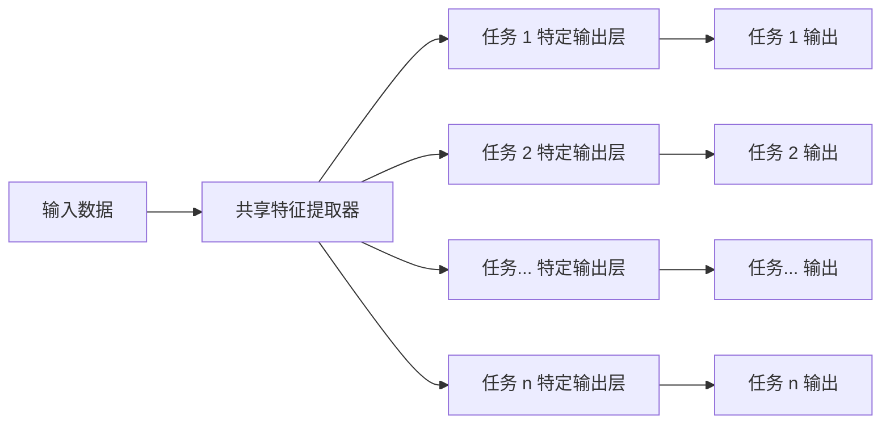

# 多任务学习对推理能力鲁棒性的影响分析

> 关键词：多任务学习、推理能力、鲁棒性、深度学习、任务相关性

> 摘要：本文旨在深入分析多任务学习对推理能力鲁棒性的影响。首先介绍了多任务学习和推理能力鲁棒性的相关背景知识，包括研究目的、预期读者等内容。接着详细阐述了多任务学习和推理能力鲁棒性的核心概念及其联系，并给出了相应的文本示意图和 Mermaid 流程图。在核心算法原理部分，使用 Python 源代码进行了详细讲解。通过数学模型和公式对多任务学习与推理能力鲁棒性的关系进行了深入分析，并举例说明。项目实战部分给出了代码实际案例和详细解释。探讨了多任务学习在不同场景下的实际应用，推荐了相关的学习资源、开发工具框架和论文著作。最后总结了多任务学习对推理能力鲁棒性影响的未来发展趋势与挑战，并对常见问题进行了解答。

## 1. 背景介绍 
### 1.1 目的和范围
在当今人工智能领域，单一任务学习模型往往难以适应复杂多变的现实环境。多任务学习作为一种有效的学习策略，旨在同时学习多个相关任务，以提高模型的泛化能力和学习效率。推理能力鲁棒性则是衡量模型在面对各种干扰和不确定性时，能否准确进行推理的重要指标。本研究的目的在于深入分析多任务学习对推理能力鲁棒性的影响，探究多任务学习如何通过共享信息和特征来增强推理的稳定性和准确性。研究范围涵盖了多任务学习的各种算法、推理能力鲁棒性的评估方法，以及它们在不同领域的应用。

### 1.2 预期读者
本文预期读者包括人工智能领域的研究人员、工程师、学生等。对于研究人员，本文提供了多任务学习和推理能力鲁棒性相关的前沿研究成果和分析方法；对于工程师，本文给出了实际应用中的代码案例和开发建议；对于学生，本文可以作为学习多任务学习和推理能力鲁棒性的入门资料，帮助他们理解相关概念和技术。

### 1.3 文档结构概述
本文将按照以下结构进行组织：首先介绍多任务学习和推理能力鲁棒性的核心概念及其联系；然后详细讲解核心算法原理和具体操作步骤，使用 Python 代码进行说明；接着通过数学模型和公式深入分析多任务学习对推理能力鲁棒性的影响，并举例说明；在项目实战部分，给出代码实际案例和详细解释；探讨多任务学习在实际场景中的应用；推荐相关的学习资源、开发工具框架和论文著作；最后总结未来发展趋势与挑战，解答常见问题，并提供扩展阅读和参考资料。

### 1.4 术语表
#### 1.4.1 核心术语定义
- **多任务学习（Multi - task Learning）**：指在一个学习系统中同时学习多个相关任务，通过共享模型的参数和特征表示，提高模型的泛化能力和学习效率。
- **推理能力（Reasoning Ability）**：模型根据已知信息得出合理结论的能力，包括逻辑推理、归纳推理、演绎推理等。
- **鲁棒性（Robustness）**：模型在面对噪声、异常值、对抗攻击等干扰时，仍能保持良好性能的能力。
- **任务相关性（Task Relevance）**：多个任务之间的关联程度，通常通过任务的输入特征、输出目标等方面来衡量。

#### 1.4.2 相关概念解释
- **共享表示（Shared Representation）**：在多任务学习中，不同任务共享的特征表示。通过共享表示，模型可以从多个任务中学习到更通用的特征，提高泛化能力。
- **特定任务表示（Task - specific Representation）**：每个任务特有的特征表示，用于处理该任务的特定信息。
- **正则化（Regularization）**：一种防止模型过拟合的技术，通过在损失函数中添加正则项来约束模型的复杂度。

#### 1.4.3 缩略词列表
- **MTL**：Multi - task Learning（多任务学习）
- **CNN**：Convolutional Neural Network（卷积神经网络）
- **RNN**：Recurrent Neural Network（循环神经网络）
- **LSTM**：Long Short - Term Memory（长短期记忆网络）

## 2. 核心概念与联系 

### 多任务学习的核心概念
多任务学习的核心思想是通过同时学习多个相关任务，让模型能够从不同任务中学习到互补的信息，从而提高模型的泛化能力。在多任务学习中，通常会有一个共享的特征提取器，用于提取输入数据的通用特征，然后每个任务有一个特定的输出层，用于处理该任务的特定信息。

例如，在一个图像识别系统中，同时学习目标检测和图像分类两个任务。共享的特征提取器可以是一个卷积神经网络（CNN），用于提取图像的通用特征，然后目标检测任务和图像分类任务分别有自己的输出层，用于预测目标的位置和类别。

### 推理能力鲁棒性的核心概念
推理能力鲁棒性强调模型在面对各种干扰和不确定性时，能够准确进行推理的能力。干扰可能包括噪声、异常值、对抗攻击等。例如，在一个自然语言处理任务中，模型需要对包含拼写错误、语法错误的文本进行推理，鲁棒性好的模型能够正确理解文本的含义并得出合理的结论。

### 多任务学习与推理能力鲁棒性的联系
多任务学习可以通过以下几种方式提高推理能力的鲁棒性：
- **信息互补**：不同任务之间的信息可以相互补充，使模型能够从多个角度理解输入数据，从而提高推理的准确性。例如，在一个同时学习图像分类和图像描述的多任务模型中，图像分类任务可以提供图像中物体的类别信息，图像描述任务可以提供物体的细节信息，两者相互补充，提高模型对图像的理解能力。
- **特征共享**：共享特征表示可以使模型学习到更通用的特征，减少对特定任务的依赖，从而提高模型在面对干扰时的稳定性。例如，在一个多任务学习模型中，不同任务共享一个 CNN 特征提取器，这个特征提取器学习到的特征可以适用于多个任务，即使某个任务的输入数据受到干扰，模型仍然可以利用共享特征进行推理。

### 文本示意图
```plaintext
输入数据
|
V
共享特征提取器
|
+------> 任务 1 特定输出层 -> 任务 1 输出
|
+------> 任务 2 特定输出层 -> 任务 2 输出
|
...
|
+------> 任务 n 特定输出层 -> 任务 n 输出
```

### Mermaid 流程图


## 3. 核心算法原理 & 具体操作步骤 

### 多任务学习的常见算法
#### 硬参数共享（Hard Parameter Sharing）
硬参数共享是最常见的多任务学习算法之一。在这种算法中，多个任务共享一个特征提取器，每个任务有自己的输出层。

以下是一个使用 PyTorch 实现的硬参数共享多任务学习模型的示例代码：
```python
import torch
import torch.nn as nn

# 定义共享特征提取器
class SharedFeatureExtractor(nn.Module):
    def __init__(self):
        super(SharedFeatureExtractor, self).__init__()
        self.fc1 = nn.Linear(10, 20)
        self.relu = nn.ReLU()

    def forward(self, x):
        x = self.fc1(x)
        x = self.relu(x)
        return x

# 定义任务特定输出层
class TaskSpecificOutput(nn.Module):
    def __init__(self):
        super(TaskSpecificOutput, self).__init__()
        self.fc = nn.Linear(20, 1)

    def forward(self, x):
        x = self.fc(x)
        return x

# 定义多任务学习模型
class MultiTaskModel(nn.Module):
    def __init__(self):
        super(MultiTaskModel, self).__init__()
        self.shared_extractor = SharedFeatureExtractor()
        self.task1_output = TaskSpecificOutput()
        self.task2_output = TaskSpecificOutput()

    def forward(self, x):
        shared_features = self.shared_extractor(x)
        task1_output = self.task1_output(shared_features)
        task2_output = self.task2_output(shared_features)
        return task1_output, task2_output

# 测试模型
model = MultiTaskModel()
input_data = torch.randn(1, 10)
task1_output, task2_output = model(input_data)
print("Task 1 output:", task1_output)
print("Task 2 output:", task2_output)
```
#### 软参数共享（Soft Parameter Sharing）
软参数共享允许不同任务的模型参数在一定程度上相互独立，但通过正则化项来约束参数之间的差异。这种方法可以使模型在不同任务之间更好地平衡共享和特定信息。

### 具体操作步骤
1. **数据准备**：收集和整理多个相关任务的数据集，并进行预处理，如归一化、划分训练集和测试集等。
2. **模型定义**：根据任务的特点选择合适的多任务学习算法，定义共享特征提取器和任务特定输出层。
3. **损失函数定义**：为每个任务定义损失函数，通常可以使用交叉熵损失、均方误差损失等。然后将多个任务的损失函数组合成一个总的损失函数，例如可以使用加权求和的方式。
4. **模型训练**：使用训练集对模型进行训练，通过反向传播算法更新模型的参数，使总的损失函数最小化。
5. **模型评估**：使用测试集对训练好的模型进行评估，计算每个任务的性能指标，如准确率、召回率、均方误差等。

## 4. 数学模型和公式 & 详细讲解 & 举例说明 

### 多任务学习的损失函数
假设我们有 $n$ 个任务，第 $i$ 个任务的损失函数为 $L_i(\theta)$，其中 $\theta$ 是模型的参数。在多任务学习中，总的损失函数可以定义为：
$$L(\theta)=\sum_{i = 1}^{n}w_iL_i(\theta)$$
其中 $w_i$ 是第 $i$ 个任务的权重，用于控制每个任务在总损失中的重要性。

### 推理能力鲁棒性的评估指标
#### 准确率（Accuracy）
准确率是最常用的评估指标之一，用于衡量模型预测正确的样本数占总样本数的比例。对于分类任务，准确率可以定义为：
$$Accuracy=\frac{TP + TN}{TP + TN+FP + FN}$$
其中 $TP$ 是真正例（True Positives），$TN$ 是真反例（True Negatives），$FP$ 是假正例（False Positives），$FN$ 是假反例（False Negatives）。

#### 均方误差（Mean Squared Error, MSE）
对于回归任务，均方误差用于衡量模型预测值与真实值之间的平均平方误差。均方误差可以定义为：
$$MSE=\frac{1}{m}\sum_{j = 1}^{m}(y_j-\hat{y}_j)^2$$
其中 $m$ 是样本数，$y_j$ 是第 $j$ 个样本的真实值，$\hat{y}_j$ 是第 $j$ 个样本的预测值。

### 多任务学习对推理能力鲁棒性的影响分析
假设我们有两个任务 $T_1$ 和 $T_2$，它们的损失函数分别为 $L_1(\theta)$ 和 $L_2(\theta)$。在单任务学习中，我们分别训练两个模型 $\theta_1$ 和 $\theta_2$，使 $L_1(\theta_1)$ 和 $L_2(\theta_2)$ 最小化。在多任务学习中，我们训练一个共享模型 $\theta$，使 $L(\theta)=w_1L_1(\theta)+w_2L_2(\theta)$ 最小化。

通过共享参数，多任务学习可以使模型学习到更通用的特征，从而提高推理能力的鲁棒性。例如，当任务 $T_1$ 的输入数据受到干扰时，由于模型学习到了来自任务 $T_2$ 的信息，仍然可以利用共享特征进行推理，减少对任务 $T_1$ 特定信息的依赖。

### 举例说明
假设我们有一个多任务学习模型，同时学习图像分类和目标检测两个任务。图像分类任务的损失函数为交叉熵损失 $L_{cls}$，目标检测任务的损失函数为均方误差损失 $L_{det}$。总的损失函数可以定义为：
$$L(\theta)=0.6L_{cls}(\theta)+0.4L_{det}(\theta)$$
在训练过程中，模型通过最小化总的损失函数来更新参数。当测试图像中存在噪声时，由于模型在训练过程中学习到了两个任务的互补信息，仍然可以准确地进行图像分类和目标检测，提高了推理能力的鲁棒性。

## 5. 项目实战：代码实际案例和详细解释说明 

### 5.1  开发环境搭建
#### 安装 Python
首先需要安装 Python，建议使用 Python 3.7 及以上版本。可以从 Python 官方网站（https://www.python.org/downloads/）下载并安装。

#### 安装 PyTorch
PyTorch 是一个常用的深度学习框架，用于实现多任务学习模型。可以根据自己的操作系统和 CUDA 版本选择合适的安装方式，具体安装命令可以参考 PyTorch 官方网站（https://pytorch.org/get-started/locally/）。

#### 安装其他依赖库
还需要安装一些其他的依赖库，如 NumPy、Pandas、Matplotlib 等。可以使用以下命令进行安装：
```sh
pip install numpy pandas matplotlib
```

### 5.2  源代码详细实现和代码解读
以下是一个使用 PyTorch 实现的多任务学习模型的完整代码示例，用于同时学习手写数字识别和数字奇偶分类两个任务：
```python
import torch
import torch.nn as nn
import torch.optim as optim
from torchvision import datasets, transforms
from torch.utils.data import DataLoader

# 定义共享特征提取器
class SharedFeatureExtractor(nn.Module):
    def __init__(self):
        super(SharedFeatureExtractor, self).__init__()
        self.conv1 = nn.Conv2d(1, 10, kernel_size=5)
        self.conv2 = nn.Conv2d(10, 20, kernel_size=5)
        self.fc1 = nn.Linear(320, 50)
        self.relu = nn.ReLU()

    def forward(self, x):
        x = self.relu(self.conv1(x))
        x = nn.MaxPool2d(2)(x)
        x = self.relu(self.conv2(x))
        x = nn.MaxPool2d(2)(x)
        x = x.view(-1, 320)
        x = self.relu(self.fc1(x))
        return x

# 定义手写数字识别任务特定输出层
class DigitRecognitionOutput(nn.Module):
    def __init__(self):
        super(DigitRecognitionOutput, self).__init__()
        self.fc = nn.Linear(50, 10)

    def forward(self, x):
        x = self.fc(x)
        return x

# 定义数字奇偶分类任务特定输出层
class ParityClassificationOutput(nn.Module):
    def __init__(self):
        super(ParityClassificationOutput, self).__init__()
        self.fc = nn.Linear(50, 2)

    def forward(self, x):
        x = self.fc(x)
        return x

# 定义多任务学习模型
class MultiTaskModel(nn.Module):
    def __init__(self):
        super(MultiTaskModel, self).__init__()
        self.shared_extractor = SharedFeatureExtractor()
        self.digit_recognition_output = DigitRecognitionOutput()
        self.parity_classification_output = ParityClassificationOutput()

    def forward(self, x):
        shared_features = self.shared_extractor(x)
        digit_output = self.digit_recognition_output(shared_features)
        parity_output = self.parity_classification_output(shared_features)
        return digit_output, parity_output

# 数据预处理
transform = transforms.Compose([
    transforms.ToTensor(),
    transforms.Normalize((0.1307,), (0.3081,))
])

# 加载数据集
train_dataset = datasets.MNIST(root='./data', train=True,
                               download=True, transform=transform)
test_dataset = datasets.MNIST(root='./data', train=False,
                              download=True, transform=transform)

train_loader = DataLoader(train_dataset, batch_size=64, shuffle=True)
test_loader = DataLoader(test_dataset, batch_size=64, shuffle=False)

# 初始化模型、损失函数和优化器
model = MultiTaskModel()
criterion_digit = nn.CrossEntropyLoss()
criterion_parity = nn.CrossEntropyLoss()
optimizer = optim.Adam(model.parameters(), lr=0.001)

# 训练模型
num_epochs = 10
for epoch in range(num_epochs):
    model.train()
    for batch_idx, (data, target) in enumerate(train_loader):
        optimizer.zero_grad()
        digit_output, parity_output = model(data)
        parity_target = target % 2  # 计算数字的奇偶性
        loss_digit = criterion_digit(digit_output, target)
        loss_parity = criterion_parity(parity_output, parity_target)
        total_loss = loss_digit + loss_parity
        total_loss.backward()
        optimizer.step()

    # 测试模型
    model.eval()
    correct_digit = 0
    correct_parity = 0
    total = 0
    with torch.no_grad():
        for data, target in test_loader:
            digit_output, parity_output = model(data)
            parity_target = target % 2
            _, predicted_digit = torch.max(digit_output.data, 1)
            _, predicted_parity = torch.max(parity_output.data, 1)
            total += target.size(0)
            correct_digit += (predicted_digit == target).sum().item()
            correct_parity += (predicted_parity == parity_target).sum().item()

    print(f'Epoch {epoch + 1}/{num_epochs}, '
          f'Digit Recognition Accuracy: {100 * correct_digit / total:.2f}%, '
          f'Parity Classification Accuracy: {100 * correct_parity / total:.2f}%')
```
### 5.3  代码解读与分析
- **共享特征提取器**：`SharedFeatureExtractor` 类定义了一个卷积神经网络，用于提取输入图像的通用特征。通过卷积层和池化层，模型可以学习到图像的局部特征和空间信息。
- **任务特定输出层**：`DigitRecognitionOutput` 类和 `ParityClassificationOutput` 类分别定义了手写数字识别和数字奇偶分类任务的特定输出层。这些输出层将共享特征映射到相应的任务输出空间。
- **多任务学习模型**：`MultiTaskModel` 类将共享特征提取器和任务特定输出层组合在一起，实现了多任务学习的功能。
- **数据加载**：使用 `torchvision` 库加载 MNIST 数据集，并进行预处理。将数据集划分为训练集和测试集，并使用 `DataLoader` 进行批量加载。
- **损失函数和优化器**：使用交叉熵损失函数分别计算手写数字识别和数字奇偶分类任务的损失，并将它们相加得到总的损失。使用 Adam 优化器更新模型的参数。
- **训练和测试**：在训练过程中，通过反向传播算法更新模型的参数。在测试过程中，计算两个任务的准确率并输出。

通过多任务学习，模型可以同时学习手写数字识别和数字奇偶分类两个任务，共享特征提取器可以学习到更通用的特征，从而提高模型的推理能力和鲁棒性。

## 6. 实际应用场景 
### 自然语言处理
在自然语言处理领域，多任务学习可以用于同时学习多个相关任务，如文本分类、命名实体识别、情感分析等。通过共享特征表示，模型可以从不同任务中学习到互补的信息，提高对文本的理解能力和推理能力的鲁棒性。例如，在一个智能客服系统中，模型可以同时处理用户的问题分类、意图识别和情感分析等任务，提高服务的准确性和效率。

### 计算机视觉
在计算机视觉领域，多任务学习可以用于同时学习图像分类、目标检测、语义分割等任务。共享的特征提取器可以学习到图像的通用特征，减少对特定任务的依赖，提高模型在不同场景下的鲁棒性。例如，在自动驾驶系统中，模型可以同时进行道路识别、车辆检测和行人检测等任务，确保行驶的安全性。

### 医疗保健
在医疗保健领域，多任务学习可以用于同时学习疾病诊断、疾病预测、药物推荐等任务。通过共享患者的病历信息和医学图像等数据，模型可以提高诊断的准确性和鲁棒性。例如，在癌症诊断系统中，模型可以同时分析患者的病理图像和基因数据，提供更准确的诊断结果。

### 金融领域
在金融领域，多任务学习可以用于同时学习信用评估、风险预测、投资推荐等任务。共享金融数据的特征表示，模型可以更好地理解市场动态和客户行为，提高决策的准确性和鲁棒性。例如，在银行的信贷审批系统中，模型可以同时考虑客户的信用历史、收入情况和消费习惯等因素，做出更合理的审批决策。

## 7. 工具和资源推荐
### 7.1 学习资源推荐
#### 7.1.1 书籍推荐
- 《深度学习》（Deep Learning）：由 Ian Goodfellow、Yoshua Bengio 和 Aaron Courville 所著，是深度学习领域的经典教材，涵盖了多任务学习等多个重要主题。
- 《动手学深度学习》（Dive into Deep Learning）：由 Aston Zhang、Zachary C. Lipton、Mu Li 和 Alexander J. Smola 所著，提供了丰富的代码示例和实践项目，适合初学者快速上手。
- 《机器学习》（Machine Learning）：由 Tom M. Mitchell 所著，是机器学习领域的经典著作，对多任务学习的理论和算法进行了深入讲解。

#### 7.1.2 在线课程
- Coursera 上的“深度学习专项课程”（Deep Learning Specialization）：由 Andrew Ng 教授授课，包括深度学习基础、卷积神经网络、循环神经网络等多个课程，对多任务学习有一定的涉及。
- edX 上的“人工智能导论”（Introduction to Artificial Intelligence）：由 MIT 教授授课，涵盖了人工智能的多个领域，包括多任务学习的基本概念和算法。
- 哔哩哔哩上的“李宏毅机器学习”：李宏毅教授的课程通俗易懂，对多任务学习等深度学习技术进行了详细讲解，并提供了丰富的案例分析。

#### 7.1.3 技术博客和网站
- Medium：一个技术博客平台，有很多关于多任务学习和深度学习的优质文章。
- arXiv：一个预印本网站，提供了最新的学术研究成果，包括多任务学习的前沿研究。
- Towards Data Science：一个专注于数据科学和机器学习的网站，有很多关于多任务学习的实践经验分享和技术教程。

### 7.2 开发工具框架推荐
#### 7.2.1 IDE和编辑器
- PyCharm：一个专业的 Python 集成开发环境，提供了代码编辑、调试、版本控制等功能，适合开发多任务学习模型。
- Jupyter Notebook：一个交互式的开发环境，可以将代码、文本和可视化结果整合在一起，方便进行实验和数据分析。
- Visual Studio Code：一个轻量级的代码编辑器，支持多种编程语言和插件，可用于快速开发和调试多任务学习代码。

#### 7.2.2 调试和性能分析工具
- PyTorch Profiler：PyTorch 提供的性能分析工具，可以帮助用户分析模型的运行时间、内存使用等情况，优化模型性能。
- TensorBoard：一个可视化工具，可以用于可视化模型的训练过程、损失函数曲线、模型结构等信息，方便用户进行调试和分析。
- NVIDIA Nsight Systems：一个用于 GPU 性能分析的工具，可以帮助用户深入了解模型在 GPU 上的运行情况，优化 GPU 利用率。

#### 7.2.3 相关框架和库
- PyTorch：一个开源的深度学习框架，提供了丰富的神经网络层和优化算法，支持多任务学习的实现。
- TensorFlow：另一个流行的深度学习框架，具有强大的分布式训练和部署能力，也可以用于实现多任务学习模型。
- Scikit - learn：一个用于机器学习的 Python 库，提供了多种机器学习算法和工具，可用于数据预处理、模型评估等任务。

### 7.3 相关论文著作推荐
#### 7.3.1 经典论文
- "Learning Multiple Tasks with Gradient Boosting"：介绍了使用梯度提升算法进行多任务学习的方法，是多任务学习领域的经典论文之一。
- "An Overview of Multi-Task Learning in Deep Neural Networks"：对深度学习中的多任务学习进行了全面的综述，介绍了多任务学习的各种算法和应用场景。
- "Multi-Task Learning Using Uncertainty to Weigh Losses for Scene Geometry and Semantics"：提出了一种基于不确定性的多任务学习方法，通过动态调整任务的权重来提高模型的性能。

#### 7.3.2 最新研究成果
- 在 arXiv 上搜索“Multi - task Learning”可以找到最新的多任务学习研究成果，包括新的算法、理论和应用。
- 参加国际机器学习会议（ICML）、神经信息处理系统大会（NeurIPS）等学术会议，可以了解多任务学习领域的前沿研究动态。

#### 7.3.3 应用案例分析
- 在各大科技公司的博客和研究报告中，可以找到多任务学习在实际应用中的案例分析，如 Google、Facebook、Microsoft 等公司的相关技术博客。
- 一些开源项目也提供了多任务学习的应用案例，如 GitHub 上的一些深度学习项目，可以参考其代码实现和应用场景。

## 8. 总结：未来发展趋势与挑战
### 未来发展趋势
- **多模态多任务学习**：随着人工智能技术的发展，多模态数据（如图像、文本、语音等）的处理需求越来越大。未来，多模态多任务学习将成为一个重要的研究方向，通过同时学习多个模态的相关任务，模型可以更全面地理解数据，提高推理能力的鲁棒性。
- **自适应多任务学习**：不同任务之间的相关性和重要性可能会随着时间和数据的变化而变化。自适应多任务学习可以根据任务的实时情况动态调整任务的权重和模型的参数，提高模型的灵活性和性能。
- **强化学习与多任务学习的结合**：强化学习可以用于优化多任务学习的策略，通过奖励机制引导模型更好地平衡不同任务之间的学习。未来，强化学习与多任务学习的结合将在机器人控制、自动驾驶等领域得到更广泛的应用。

### 挑战
- **任务相关性的度量**：准确度量任务之间的相关性是多任务学习的关键问题之一。目前，还没有一种通用的方法可以准确地衡量不同任务之间的相关性，这可能会导致模型在共享特征时出现偏差，影响推理能力的鲁棒性。
- **计算资源的需求**：多任务学习通常需要更多的计算资源来同时训练多个任务。随着任务数量的增加和模型复杂度的提高，计算资源的需求会急剧增加，这对硬件设备和计算平台提出了更高的要求。
- **模型可解释性**：多任务学习模型通常比较复杂，其决策过程难以解释。在一些对模型可解释性要求较高的领域，如医疗保健、金融等，模型的可解释性问题成为了多任务学习应用的一个障碍。

## 9. 附录：常见问题与解答
### 问题 1：多任务学习一定能提高推理能力的鲁棒性吗？
答：不一定。多任务学习能否提高推理能力的鲁棒性取决于多个因素，如任务之间的相关性、模型的架构、数据的质量等。如果任务之间的相关性较低，或者模型的架构设计不合理，多任务学习可能会导致模型的性能下降。因此，在应用多任务学习时，需要仔细选择任务和设计模型。

### 问题 2：如何选择多任务学习中的任务权重？
答：选择多任务学习中的任务权重是一个关键问题。常见的方法包括手动调整权重、使用自适应权重调整算法等。手动调整权重需要根据任务的重要性和难度进行经验性的设置；自适应权重调整算法可以根据任务的训练情况动态调整权重，如基于不确定性的权重调整方法。

### 问题 3：多任务学习模型的训练时间会比单任务学习模型长吗？
答：一般情况下，多任务学习模型的训练时间会比单任务学习模型长。因为多任务学习需要同时处理多个任务，模型的复杂度和计算量会增加。但是，通过合理设计模型架构和优化训练算法，可以在一定程度上减少训练时间。

### 问题 4：多任务学习模型在面对新任务时的适应性如何？
答：多任务学习模型在面对新任务时的适应性取决于模型的泛化能力和任务之间的相关性。如果新任务与已学习的任务具有较高的相关性，模型可以利用共享特征快速适应新任务；如果新任务与已学习的任务相关性较低，模型可能需要重新训练或进行微调。

## 10. 扩展阅读 & 参考资料
- Goodfellow, I., Bengio, Y., & Courville, A. (2016). Deep Learning. MIT Press.
- Zhang, A., Lipton, Z. C., Li, M., & Smola, A. J. (2020). Dive into Deep Learning.
- Mitchell, T. M. (1997). Machine Learning. McGraw - Hill.
- Caruana, R. (1997). Multitask learning. Machine learning, 28(1), 41 - 75.
- Kendall, A., Gal, Y., & Cipolla, R. (2018). Multi - task learning using uncertainty to weigh losses for scene geometry and semantics. In Proceedings of the IEEE conference on computer vision and pattern recognition (pp. 7482 - 7491).

作者：AI天才研究院/AI Genius Institute & 禅与计算机程序设计艺术 /Zen And The Art of Computer Programming