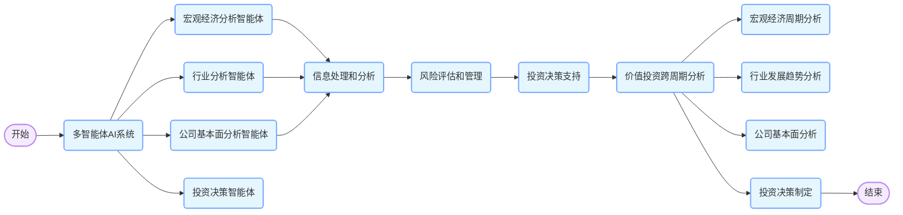

# 多智能体AI如何增强价值投资的跨周期分析能力

> 关键词：多智能体AI、价值投资、跨周期分析、投资决策、市场预测

> 摘要：本文深入探讨了多智能体AI在增强价值投资跨周期分析能力方面的应用。首先介绍了相关背景知识，包括目的、预期读者、文档结构和术语表。接着阐述了多智能体AI和价值投资跨周期分析的核心概念及联系，详细讲解了核心算法原理与具体操作步骤，运用数学模型和公式进行了理论支持，并给出了实际案例。通过项目实战展示了如何在实际中运用多智能体AI进行价值投资的跨周期分析，还介绍了其实际应用场景、相关工具和资源。最后对未来发展趋势与挑战进行了总结，解答了常见问题并提供了扩展阅读和参考资料，旨在为投资者和相关研究人员提供全面的技术和理论指导。

## 1. 背景介绍 
### 1.1 目的和范围
价值投资作为一种长期投资策略，旨在寻找被低估的资产并长期持有以获取价值回归带来的收益。然而，在实际操作中，由于市场环境的复杂性和不确定性，跨周期分析面临着诸多挑战。多智能体AI作为一种新兴的人工智能技术，具有分布式、自主决策和协同合作等特点，有望为价值投资的跨周期分析提供新的思路和方法。

本文的目的是深入探讨多智能体AI如何增强价值投资的跨周期分析能力，具体范围包括多智能体AI的核心概念、算法原理、数学模型，以及如何将其应用于价值投资的跨周期分析中，同时通过实际案例展示其效果，并介绍相关的工具和资源。

### 1.2 预期读者
本文的预期读者包括金融投资者、投资分析师、人工智能研究人员、金融科技从业者以及对价值投资和人工智能交叉领域感兴趣的学者和学生。对于投资者来说，本文可以帮助他们了解如何利用多智能体AI提高投资决策的准确性和有效性；对于研究人员和从业者来说，本文可以为他们提供相关的理论和实践参考，推动该领域的研究和发展。

### 1.3 文档结构概述
本文共分为十个部分。第一部分为背景介绍，阐述了文章的目的、预期读者、文档结构和术语表；第二部分介绍多智能体AI和价值投资跨周期分析的核心概念及联系；第三部分详细讲解核心算法原理和具体操作步骤，并给出Python代码示例；第四部分运用数学模型和公式对相关理论进行详细讲解和举例说明；第五部分通过项目实战展示如何运用多智能体AI进行价值投资的跨周期分析，包括开发环境搭建、源代码实现和代码解读；第六部分介绍多智能体AI在价值投资跨周期分析中的实际应用场景；第七部分推荐相关的学习资源、开发工具框架和论文著作；第八部分总结未来发展趋势与挑战；第九部分为附录，解答常见问题；第十部分提供扩展阅读和参考资料。

### 1.4 术语表
#### 1.4.1 核心术语定义
- **多智能体AI（Multi - Agent AI）**：由多个智能体组成的人工智能系统，每个智能体具有自主决策能力，能够感知环境并与其他智能体进行交互和协作，以实现共同的目标。
- **价值投资（Value Investing）**：一种投资策略，投资者通过分析资产的内在价值，寻找被市场低估的资产并长期持有，等待资产价值回归以获取收益。
- **跨周期分析（Cross - Cycle Analysis）**：对投资标的在不同经济周期和市场环境下的表现进行综合分析，以评估其长期投资价值和风险。

#### 1.4.2 相关概念解释
- **智能体（Agent）**：在多智能体AI中，智能体是具有自主性、反应性、社会性和主动性的实体，能够感知环境并根据自身的目标和知识做出决策和行动。
- **内在价值（Intrinsic Value）**：资产的真实价值，通常基于其未来现金流、盈利能力、资产质量等因素进行评估。
- **市场效率（Market Efficiency）**：市场价格反映资产内在价值的程度。在有效市场中，市场价格能够迅速反映所有可用信息；在无效市场中，市场价格可能会偏离资产的内在价值。

#### 1.4.3 缩略词列表
- **AI**：人工智能（Artificial Intelligence）
- **ML**：机器学习（Machine Learning）
- **RL**：强化学习（Reinforcement Learning）

## 2. 核心概念与联系 

### 2.1 多智能体AI的核心概念
多智能体AI是一种复杂的人工智能系统，由多个智能体组成。每个智能体可以是一个独立的程序或实体，具有以下特点：
- **自主性**：智能体能够独立地感知环境并做出决策，不需要外部的直接控制。
- **反应性**：智能体能够对环境的变化做出及时的反应，调整自己的行为。
- **社会性**：智能体能够与其他智能体进行交互和协作，通过信息共享和合作来实现共同的目标。
- **主动性**：智能体能够主动地寻找机会和解决问题，而不仅仅是对环境的被动反应。

多智能体AI的架构通常包括以下几个部分：
- **智能体层**：由多个智能体组成，每个智能体负责特定的任务和功能。
- **通信层**：负责智能体之间的信息传递和交互，确保智能体能够协同工作。
- **环境层**：智能体所处的外部环境，包括市场数据、经济指标等。

### 2.2 价值投资跨周期分析的核心概念
价值投资跨周期分析的核心是评估资产在不同经济周期和市场环境下的内在价值和投资价值。这需要考虑多个因素，包括宏观经济因素、行业发展趋势、公司基本面等。

在跨周期分析中，投资者需要关注以下几个方面：
- **宏观经济周期**：不同的经济周期对资产的表现有不同的影响。例如，在经济扩张期，股票市场通常表现较好；在经济衰退期，债券等固定收益资产可能更具吸引力。
- **行业发展趋势**：不同行业在不同的经济周期和市场环境下的表现也有所不同。投资者需要选择具有长期增长潜力的行业进行投资。
- **公司基本面**：包括公司的盈利能力、资产质量、管理水平等。投资者需要选择基本面良好的公司进行投资。

### 2.3 多智能体AI与价值投资跨周期分析的联系
多智能体AI可以为价值投资的跨周期分析提供以下几个方面的支持：
- **信息处理和分析**：多智能体AI可以同时处理和分析大量的市场数据和信息，包括宏观经济数据、行业数据、公司财务数据等。每个智能体可以负责不同类型的数据处理和分析，然后通过协作和信息共享，提供更全面和准确的分析结果。
- **风险评估和管理**：多智能体AI可以通过对市场风险、行业风险和公司风险的评估，为投资者提供更合理的风险控制策略。不同的智能体可以从不同的角度评估风险，然后通过协作制定出最优的风险管理方案。
- **投资决策支持**：多智能体AI可以根据分析结果和风险评估，为投资者提供投资决策建议。智能体可以通过学习和优化，不断提高投资决策的准确性和有效性。

### 2.4 核心概念原理和架构的文本示意图
```plaintext
多智能体AI系统
├── 智能体层
│   ├── 宏观经济分析智能体
│   ├── 行业分析智能体
│   ├── 公司基本面分析智能体
│   └── 投资决策智能体
├── 通信层
│   └── 智能体间通信协议
└── 环境层
    ├── 宏观经济数据
    ├── 行业数据
    └── 公司财务数据

价值投资跨周期分析
├── 宏观经济周期分析
├── 行业发展趋势分析
├── 公司基本面分析
└── 投资决策制定

多智能体AI与价值投资跨周期分析的联系
├── 信息处理和分析
├── 风险评估和管理
└── 投资决策支持
```

### 2.5 Mermaid流程图


## 3. 核心算法原理 & 具体操作步骤 

### 3.1 核心算法原理
多智能体AI在价值投资跨周期分析中可以采用多种算法，如机器学习算法、强化学习算法等。下面以强化学习算法为例，介绍其核心原理。

强化学习是一种通过智能体与环境进行交互来学习最优策略的算法。在价值投资跨周期分析中，智能体可以看作是投资者，环境可以看作是市场。智能体通过执行不同的投资动作（如买入、卖出、持有等），并根据环境反馈的奖励（如投资收益）来学习最优的投资策略。

强化学习的核心概念包括状态（State）、动作（Action）、奖励（Reward）和策略（Policy）。智能体在每个时间步根据当前状态选择一个动作，执行该动作后环境会反馈一个奖励，并转移到下一个状态。智能体的目标是通过不断地与环境交互，学习到一个最优策略，使得长期累积奖励最大化。

### 3.2 具体操作步骤
#### 步骤1：定义状态空间
状态空间是智能体能够感知到的环境信息的集合。在价值投资跨周期分析中，状态空间可以包括宏观经济指标（如GDP增长率、通货膨胀率等）、行业指标（如行业利润率、行业增长率等）、公司财务指标（如市盈率、市净率等）。

#### 步骤2：定义动作空间
动作空间是智能体可以执行的动作的集合。在价值投资中，动作空间可以包括买入、卖出、持有等。

#### 步骤3：定义奖励函数
奖励函数是环境对智能体执行动作的反馈。在价值投资中，奖励函数可以定义为投资收益，如资产的增值或减值。

#### 步骤4：选择强化学习算法
常见的强化学习算法包括Q - learning、Deep Q - Network（DQN）等。可以根据具体情况选择合适的算法。

#### 步骤5：训练智能体
使用历史市场数据对智能体进行训练，让智能体通过不断地与环境交互，学习到最优的投资策略。

#### 步骤6：测试和评估
使用测试数据对训练好的智能体进行测试和评估，评估其投资策略的性能。

### 3.3 Python源代码详细阐述
```python
import numpy as np
import random
import gym

# 定义状态空间维度
STATE_DIM = 5
# 定义动作空间维度
ACTION_DIM = 3
# 定义Q表
Q_TABLE = np.zeros((STATE_DIM, ACTION_DIM))

# 定义超参数
ALPHA = 0.1  # 学习率
GAMMA = 0.9  # 折扣因子
EPSILON = 0.1  # 探索率

# 定义环境
class InvestmentEnv(gym.Env):
    def __init__(self):
        self.state = random.randint(0, STATE_DIM - 1)
        self.action_space = gym.spaces.Discrete(ACTION_DIM)
        self.observation_space = gym.spaces.Discrete(STATE_DIM)

    def step(self, action):
        # 随机生成奖励
        reward = random.randint(-10, 10)
        # 随机转移到下一个状态
        next_state = random.randint(0, STATE_DIM - 1)
        done = False
        return next_state, reward, done, {}

    def reset(self):
        self.state = random.randint(0, STATE_DIM - 1)
        return self.state

# 定义Q - learning算法
def q_learning(env, episodes=1000):
    for episode in range(episodes):
        state = env.reset()
        done = False
        while not done:
            if random.uniform(0, 1) < EPSILON:
                action = env.action_space.sample()
            else:
                action = np.argmax(Q_TABLE[state, :])
            next_state, reward, done, _ = env.step(action)
            Q_TABLE[state, action] = (1 - ALPHA) * Q_TABLE[state, action] + ALPHA * (
                    reward + GAMMA * np.max(Q_TABLE[next_state, :]))
            state = next_state
    return Q_TABLE

# 创建环境
env = InvestmentEnv()
# 训练智能体
q_table = q_learning(env)
print("训练后的Q表：")
print(q_table)
```

### 3.4 代码解释
- **状态空间和动作空间**：`STATE_DIM` 和 `ACTION_DIM` 分别定义了状态空间和动作空间的维度。
- **Q表**：`Q_TABLE` 用于存储智能体在不同状态下执行不同动作的Q值。
- **超参数**：`ALPHA` 是学习率，控制智能体学习的速度；`GAMMA` 是折扣因子，用于平衡短期奖励和长期奖励；`EPSILON` 是探索率，控制智能体的探索和利用行为。
- **环境类**：`InvestmentEnv` 类定义了投资环境，包括状态的初始化、动作的执行和奖励的反馈。
- **Q - learning算法**：`q_learning` 函数实现了Q - learning算法，通过不断地与环境交互，更新Q表，学习最优的投资策略。

## 4. 数学模型和公式 & 详细讲解 & 举例说明 

### 4.1 强化学习的数学模型
强化学习的数学模型可以用马尔可夫决策过程（Markov Decision Process，MDP）来描述。一个MDP由以下几个元素组成：
- **状态空间 $S$**：所有可能的状态的集合。
- **动作空间 $A$**：所有可能的动作的集合。
- **状态转移概率 $P(s'|s,a)$**：在状态 $s$ 执行动作 $a$ 后转移到状态 $s'$ 的概率。
- **奖励函数 $R(s,a,s')$**：在状态 $s$ 执行动作 $a$ 并转移到状态 $s'$ 后获得的奖励。
- **折扣因子 $\gamma$**：用于平衡短期奖励和长期奖励，$0 \leq \gamma \leq 1$。

### 4.2 Q - learning算法的数学公式
Q - learning算法的目标是学习一个最优的Q函数 $Q^*(s,a)$，使得智能体在每个状态 $s$ 选择最优动作 $a$ 时，长期累积奖励最大化。Q - learning算法通过以下迭代公式更新Q值：

$$Q(s,a) \leftarrow Q(s,a) + \alpha [R(s,a,s') + \gamma \max_{a'} Q(s',a') - Q(s,a)]$$

其中：
- $Q(s,a)$ 是在状态 $s$ 执行动作 $a$ 的Q值。
- $\alpha$ 是学习率，控制Q值更新的速度。
- $R(s,a,s')$ 是在状态 $s$ 执行动作 $a$ 并转移到状态 $s'$ 后获得的奖励。
- $\gamma$ 是折扣因子，用于平衡短期奖励和长期奖励。
- $\max_{a'} Q(s',a')$ 是在状态 $s'$ 下所有动作的最大Q值。

### 4.3 详细讲解
Q - learning算法的核心思想是通过不断地与环境交互，根据环境反馈的奖励来更新Q值。在每个时间步，智能体根据当前的Q表选择一个动作，执行该动作后环境会反馈一个奖励和下一个状态。然后，智能体根据上述公式更新当前状态和动作的Q值。通过不断地迭代更新，Q表会逐渐收敛到最优Q函数。

### 4.4 举例说明
假设我们有一个简单的投资环境，状态空间 $S = \{s_1, s_2\}$，动作空间 $A = \{a_1, a_2\}$。初始时，Q表为：

$$Q = \begin{bmatrix}
0 & 0 \\
0 & 0
\end{bmatrix}$$

学习率 $\alpha = 0.1$，折扣因子 $\gamma = 0.9$。

在某个时间步，智能体处于状态 $s_1$，选择动作 $a_1$，执行该动作后环境反馈奖励 $R = 10$，并转移到状态 $s_2$。根据Q - learning算法的更新公式，我们可以更新Q表：

首先，计算 $\max_{a'} Q(s_2,a')$，由于 $Q(s_2,a_1) = Q(s_2,a_2) = 0$，所以 $\max_{a'} Q(s_2,a') = 0$。

然后，更新 $Q(s_1,a_1)$：

$$Q(s_1,a_1) \leftarrow Q(s_1,a_1) + \alpha [R(s_1,a_1,s_2) + \gamma \max_{a'} Q(s_2,a') - Q(s_1,a_1)]$$

$$Q(s_1,a_1) \leftarrow 0 + 0.1 [10 + 0.9 \times 0 - 0] = 1$$

更新后的Q表为：

$$Q = \begin{bmatrix}
1 & 0 \\
0 & 0
\end{bmatrix}$$

通过不断地与环境交互和更新Q表，智能体可以学习到最优的投资策略。

## 5. 项目实战：代码实际案例和详细解释说明 

### 5.1  开发环境搭建
#### 5.1.1 安装Python
首先，需要安装Python环境。建议使用Python 3.7及以上版本，可以从Python官方网站（https://www.python.org/downloads/）下载并安装。

#### 5.1.2 安装必要的库
在项目中，需要使用一些Python库，如`numpy`、`gym`等。可以使用`pip`命令进行安装：

```bash
pip install numpy gym
```

### 5.2  源代码详细实现和代码解读
```python
import numpy as np
import random
import gym

# 定义状态空间维度
STATE_DIM = 5
# 定义动作空间维度
ACTION_DIM = 3
# 定义Q表
Q_TABLE = np.zeros((STATE_DIM, ACTION_DIM))

# 定义超参数
ALPHA = 0.1  # 学习率
GAMMA = 0.9  # 折扣因子
EPSILON = 0.1  # 探索率

# 定义环境
class InvestmentEnv(gym.Env):
    def __init__(self):
        self.state = random.randint(0, STATE_DIM - 1)
        self.action_space = gym.spaces.Discrete(ACTION_DIM)
        self.observation_space = gym.spaces.Discrete(STATE_DIM)

    def step(self, action):
        # 随机生成奖励
        reward = random.randint(-10, 10)
        # 随机转移到下一个状态
        next_state = random.randint(0, STATE_DIM - 1)
        done = False
        return next_state, reward, done, {}

    def reset(self):
        self.state = random.randint(0, STATE_DIM - 1)
        return self.state

# 定义Q - learning算法
def q_learning(env, episodes=1000):
    for episode in range(episodes):
        state = env.reset()
        done = False
        while not done:
            if random.uniform(0, 1) < EPSILON:
                action = env.action_space.sample()
            else:
                action = np.argmax(Q_TABLE[state, :])
            next_state, reward, done, _ = env.step(action)
            Q_TABLE[state, action] = (1 - ALPHA) * Q_TABLE[state, action] + ALPHA * (
                    reward + GAMMA * np.max(Q_TABLE[next_state, :]))
            state = next_state
    return Q_TABLE

# 创建环境
env = InvestmentEnv()
# 训练智能体
q_table = q_learning(env)
print("训练后的Q表：")
print(q_table)
```

### 5.3  代码解读与分析
#### 5.3.1 状态空间和动作空间
`STATE_DIM` 和 `ACTION_DIM` 分别定义了状态空间和动作空间的维度。在实际应用中，状态空间可以包括宏观经济指标、行业指标、公司财务指标等，动作空间可以包括买入、卖出、持有等。

#### 5.3.2 Q表
`Q_TABLE` 是一个二维数组，用于存储智能体在不同状态下执行不同动作的Q值。初始时，Q表中的所有值都为0。

#### 5.3.3 超参数
- `ALPHA`：学习率，控制Q值更新的速度。学习率越大，Q值更新越快，但可能会导致算法不稳定；学习率越小，Q值更新越慢，但算法可能更稳定。
- `GAMMA`：折扣因子，用于平衡短期奖励和长期奖励。折扣因子越接近1，智能体越注重长期奖励；折扣因子越接近0，智能体越注重短期奖励。
- `EPSILON`：探索率，控制智能体的探索和利用行为。探索率越大，智能体越倾向于随机选择动作进行探索；探索率越小，智能体越倾向于根据Q表选择最优动作进行利用。

#### 5.3.4 环境类
`InvestmentEnv` 类继承自`gym.Env`，定义了投资环境。`__init__` 方法初始化环境的状态、动作空间和观察空间；`step` 方法执行动作并返回下一个状态、奖励和是否结束的标志；`reset` 方法重置环境的状态。

#### 5.3.5 Q - learning算法
`q_learning` 函数实现了Q - learning算法。在每个训练周期中，智能体从环境中获取初始状态，然后根据Q表或随机选择动作执行，根据环境反馈的奖励更新Q表，直到环境结束。

#### 5.3.6 训练和输出
最后，创建投资环境并调用`q_learning` 函数进行训练，训练完成后输出训练后的Q表。

## 6. 实际应用场景 
### 6.1 资产配置
多智能体AI可以帮助投资者进行跨周期的资产配置。不同的智能体可以负责分析不同类型的资产，如股票、债券、基金等，考虑宏观经济周期、行业发展趋势和公司基本面等因素，为投资者提供最优的资产配置方案。例如，在经济扩张期，股票智能体可以推荐具有高增长潜力的股票；在经济衰退期，债券智能体可以推荐具有稳定收益的债券。

### 6.2 选股决策
在选股过程中，多智能体AI可以通过对大量公司的基本面数据、行业数据和市场数据进行分析，筛选出具有投资价值的股票。宏观经济分析智能体可以评估宏观经济环境对股票的影响；行业分析智能体可以分析行业的竞争格局和发展趋势；公司基本面分析智能体可以评估公司的盈利能力、资产质量和管理水平。最后，投资决策智能体可以根据各智能体的分析结果，为投资者提供选股建议。

### 6.3 风险预警
多智能体AI可以实时监测市场风险和投资组合的风险。通过对宏观经济指标、市场波动、行业风险等因素的分析，智能体可以及时发现潜在的风险，并向投资者发出预警。例如，当宏观经济指标出现恶化迹象时，宏观经济分析智能体可以及时发出风险预警，提醒投资者调整投资组合。

### 6.4 投资组合优化
多智能体AI可以帮助投资者优化投资组合，提高投资组合的风险 - 收益比。通过对不同资产的风险和收益进行评估，智能体可以根据投资者的风险偏好和投资目标，调整投资组合中各资产的权重。例如，对于风险偏好较低的投资者，智能体可以增加债券等固定收益资产的权重；对于风险偏好较高的投资者，智能体可以增加股票等权益类资产的权重。

## 7. 工具和资源推荐
### 7.1 学习资源推荐
#### 7.1.1 书籍推荐
- 《人工智能：一种现代的方法》（Artificial Intelligence: A Modern Approach）：这本书是人工智能领域的经典教材，涵盖了人工智能的各个方面，包括多智能体系统、机器学习、强化学习等。
- 《强化学习：原理与Python实现》：本书详细介绍了强化学习的原理和算法，并通过Python代码实现了多个实际案例，适合初学者学习强化学习。
- 《价值投资：从格雷厄姆到巴菲特》：这本书介绍了价值投资的理论和方法，包括如何评估资产的内在价值、如何选择投资标的等，是价值投资领域的经典著作。

#### 7.1.2 在线课程
- Coursera上的“人工智能基础”（Fundamentals of Artificial Intelligence）课程：该课程由知名教授授课，涵盖了人工智能的基本概念、算法和应用，包括多智能体系统和强化学习。
- edX上的“强化学习”（Reinforcement Learning）课程：该课程深入介绍了强化学习的理论和算法，并通过实际案例让学生掌握强化学习的应用。
- 中国大学MOOC上的“金融投资学”课程：该课程介绍了金融投资的基本理论和方法，包括价值投资、资产配置、风险管理等，适合投资者学习金融投资知识。

#### 7.1.3 技术博客和网站
- Towards Data Science：这是一个专注于数据科学和人工智能的技术博客，上面有很多关于多智能体AI、强化学习和价值投资的文章和教程。
- Medium：这是一个综合性的技术博客平台，有很多人工智能和金融领域的专家分享他们的经验和见解。
- 雪球网：这是一个专注于股票投资的社区，上面有很多投资者分享他们的投资经验和研究成果，对于价值投资的学习和实践有很大的帮助。

### 7.2 开发工具框架推荐
#### 7.2.1 IDE和编辑器
- PyCharm：这是一个专业的Python集成开发环境，具有代码编辑、调试、版本控制等功能，适合开发Python项目。
- Jupyter Notebook：这是一个交互式的开发环境，支持Python、R等多种编程语言，适合进行数据探索、模型训练和可视化等工作。
- Visual Studio Code：这是一个轻量级的代码编辑器，支持多种编程语言和插件，具有丰富的扩展功能，适合快速开发和调试代码。

#### 7.2.2 调试和性能分析工具
- PDB：这是Python自带的调试工具，可以帮助开发者在代码中设置断点、单步执行、查看变量值等，方便调试代码。
- cProfile：这是Python的性能分析工具，可以帮助开发者分析代码的运行时间和性能瓶颈，优化代码性能。
- TensorBoard：这是TensorFlow的可视化工具，可以帮助开发者可视化模型的训练过程、参数分布等，方便调试和优化模型。

#### 7.2.3 相关框架和库
- TensorFlow：这是一个开源的机器学习框架，支持深度学习、强化学习等多种算法，具有高效的计算能力和丰富的工具库。
- PyTorch：这是另一个开源的机器学习框架，具有动态图机制、易于使用等特点，适合快速开发和实验。
- OpenAI Gym：这是一个开源的强化学习环境库，提供了多种经典的强化学习环境，方便开发者进行强化学习算法的测试和验证。

### 7.3 相关论文著作推荐
#### 7.3.1 经典论文
- “Multi - Agent Systems: A Modern Approach to Distributed Artificial Intelligence”：这篇论文介绍了多智能体系统的基本概念、架构和算法，是多智能体系统领域的经典论文。
- “Reinforcement Learning: An Introduction”：这本书是强化学习领域的经典著作，详细介绍了强化学习的理论和算法，是学习强化学习的必读之作。
- “The Intelligent Investor”：这本书是价值投资领域的经典著作，由本杰明·格雷厄姆所著，介绍了价值投资的基本理念和方法，对投资者有很大的启发。

#### 7.3.2 最新研究成果
- 近年来，关于多智能体AI在金融领域的应用有很多研究成果。可以通过学术数据库（如IEEE Xplore、ACM Digital Library等）搜索相关的论文，了解最新的研究动态。
- 一些知名的学术会议（如NeurIPS、ICML等）也会发表关于多智能体AI和金融科技的研究成果，可以关注这些会议的论文集。

#### 7.3.3 应用案例分析
- 一些金融科技公司和投资机构会发布关于多智能体AI在价值投资中的应用案例。可以通过他们的官方网站、研究报告等渠道获取相关信息，学习实际应用中的经验和方法。

## 8. 总结：未来发展趋势与挑战
### 8.1 未来发展趋势
#### 8.1.1 更复杂的多智能体系统
未来，多智能体AI系统将变得更加复杂，智能体之间的协作和交互将更加深入。例如，不同类型的智能体可以通过深度学习和强化学习算法不断学习和进化，提高分析和决策的能力。同时，多智能体系统可以与其他技术（如区块链、物联网等）相结合，实现更广泛的应用。

#### 8.1.2 与大数据和云计算的融合
随着大数据和云计算技术的发展，多智能体AI可以处理和分析更多的数据，提高分析的准确性和效率。通过云计算平台，多智能体系统可以实现分布式计算和存储，提高系统的可扩展性和性能。

#### 8.1.3 个性化投资服务
多智能体AI可以根据投资者的个性化需求和风险偏好，提供更加个性化的投资服务。例如，智能体可以根据投资者的年龄、收入、投资目标等因素，为其定制专属的投资策略和资产配置方案。

### 8.2 挑战
#### 8.2.1 数据质量和隐私问题
多智能体AI需要大量的高质量数据进行训练和分析。然而，金融数据往往存在噪声、缺失值等问题，影响分析的准确性。同时，金融数据涉及到投资者的隐私和敏感信息，如何保护数据的安全和隐私是一个重要的挑战。

#### 8.2.2 模型解释性和可解释性
多智能体AI模型通常是复杂的黑盒模型，难以解释其决策过程和结果。在金融领域，投资者需要了解模型的决策依据，以便做出合理的投资决策。因此，如何提高模型的解释性和可解释性是一个亟待解决的问题。

#### 8.2.3 市场不确定性和风险
金融市场具有高度的不确定性和风险，多智能体AI模型在面对复杂多变的市场环境时，可能会出现预测不准确、决策失误等问题。如何提高模型的鲁棒性和适应性，应对市场的不确定性和风险，是多智能体AI在价值投资中面临的挑战之一。

## 9. 附录：常见问题与解答
### 9.1 多智能体AI和传统AI有什么区别？
传统AI通常是单个智能体系统，由一个中央控制器进行决策和控制。而多智能体AI由多个智能体组成，每个智能体具有自主决策能力，能够感知环境并与其他智能体进行交互和协作。多智能体AI更适合处理复杂的、分布式的问题，如价值投资的跨周期分析。

### 9.2 多智能体AI在价值投资中的应用是否可靠？
多智能体AI在价值投资中的应用具有一定的可靠性，但也存在一定的局限性。多智能体AI可以通过对大量数据的分析和处理，提供更全面和准确的投资决策建议。然而，金融市场具有高度的不确定性和复杂性，多智能体AI模型可能无法完全准确地预测市场走势和资产价格。因此，投资者在使用多智能体AI的投资建议时，还需要结合自己的经验和判断，进行综合分析和决策。

### 9.3 如何评估多智能体AI模型的性能？
评估多智能体AI模型的性能可以从多个方面进行，如投资收益、风险控制、决策准确性等。常见的评估指标包括夏普比率、最大回撤、准确率、召回率等。可以使用历史数据对模型进行回测，评估其在不同市场环境下的表现。同时，还可以与其他投资策略进行比较，评估模型的相对优势。

### 9.4 多智能体AI的开发难度大吗？
多智能体AI的开发难度相对较大，需要具备一定的人工智能、机器学习和编程基础。开发多智能体AI系统需要掌握多智能体系统的架构和算法，如智能体的设计、通信协议的实现、协作机制的设计等。同时，还需要处理大量的数据，进行模型训练和优化。对于初学者来说，可以从简单的多智能体系统开始学习和实践，逐步提高开发能力。

## 10. 扩展阅读 & 参考资料
### 10.1 扩展阅读
- 《多智能体系统：原理与编程》：这本书详细介绍了多智能体系统的原理和编程方法，适合深入学习多智能体系统的读者。
- 《金融科技：变革与创新》：这本书介绍了金融科技的发展趋势和应用，包括人工智能、区块链、大数据等技术在金融领域的应用，对于了解金融科技的发展有很大的帮助。
- 《机器学习实战》：这本书通过实际案例介绍了机器学习的算法和应用，适合初学者学习机器学习。

### 10.2 参考资料
- Sutton, R. S., & Barto, A. G. (2018). Reinforcement Learning: An Introduction. MIT Press.
- Wooldridge, M. (2009). An Introduction to Multi - Agent Systems. John Wiley & Sons.
- Graham, B. (2003). The Intelligent Investor. HarperBusiness.

作者：AI天才研究院/AI Genius Institute & 禅与计算机程序设计艺术 /Zen And The Art of Computer Programming