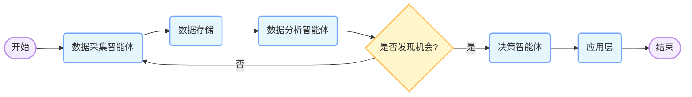

# 多智能体协同分析全球价值链机会

> 关键词：多智能体协同、全球价值链、机会分析、智能决策、供应链优化

> 摘要：本文聚焦于利用多智能体协同技术来分析全球价值链机会。首先介绍了研究的背景、目的、预期读者和文档结构等内容。接着阐述了多智能体协同和全球价值链的核心概念及其联系，给出了原理和架构的文本示意图与 Mermaid 流程图。详细讲解了核心算法原理，通过 Python 源代码进行说明，并介绍了相关的数学模型和公式。以实际项目为例，展示了代码实现和详细解释。探讨了多智能体协同分析全球价值链机会的实际应用场景，推荐了学习资源、开发工具框架和相关论文著作。最后总结了未来发展趋势与挑战，提供了常见问题解答和扩展阅读参考资料。旨在为相关领域的研究者和从业者提供全面深入的技术指导和理论支持。

## 1. 背景介绍 
### 1.1 目的和范围
在当今全球化的经济格局下，全球价值链（Global Value Chain, GVC）已经成为国际经济活动的重要组织形式。企业和国家都希望在全球价值链中找到自身的定位和发展机会，以实现资源的优化配置和价值的最大化创造。然而，全球价值链涉及众多参与主体、复杂的业务流程和海量的数据信息，传统的分析方法难以全面、准确地把握其中的机会。

本研究的目的是利用多智能体协同（Multi - Agent Collaboration）技术，对全球价值链中的各种信息进行整合、分析和决策，从而帮助企业和决策者发现潜在的商业机会、优化供应链布局、提高竞争力。具体范围包括多智能体系统的构建、算法设计、数学模型的建立，以及在实际全球价值链场景中的应用。

### 1.2 预期读者
本文预期读者主要包括以下几类人群：
- **企业管理人员**：希望通过先进的技术手段分析全球价值链机会，优化企业战略决策，提升企业在全球市场的竞争力。
- **供应链从业者**：对供应链优化、协同管理感兴趣，希望借助多智能体协同技术改善供应链的效率和灵活性。
- **学术研究人员**：从事多智能体系统、全球价值链分析、人工智能等相关领域研究的学者和学生，希望从理论和实践的角度深入了解多智能体协同在全球价值链机会分析中的应用。
- **政策制定者**：需要了解全球价值链的发展动态，制定相关政策以促进产业升级和经济发展的政府官员和政策研究人员。

### 1.3 文档结构概述
本文将按照以下结构进行组织：
- **核心概念与联系**：介绍多智能体协同和全球价值链的核心概念，分析它们之间的联系，并给出原理和架构的文本示意图与 Mermaid 流程图。
- **核心算法原理 & 具体操作步骤**：详细阐述多智能体协同分析全球价值链机会所使用的核心算法，通过 Python 源代码进行说明，并给出具体的操作步骤。
- **数学模型和公式 & 详细讲解 & 举例说明**：建立相关的数学模型和公式，对其进行详细讲解，并通过实际例子说明其应用。
- **项目实战：代码实际案例和详细解释说明**：以一个实际项目为例，展示多智能体协同分析全球价值链机会的代码实现过程，并对代码进行详细解读和分析。
- **实际应用场景**：探讨多智能体协同分析全球价值链机会在不同领域的实际应用场景。
- **工具和资源推荐**：推荐相关的学习资源、开发工具框架和论文著作，帮助读者进一步深入学习和研究。
- **总结：未来发展趋势与挑战**：总结多智能体协同分析全球价值链机会的研究现状，分析未来的发展趋势和面临的挑战。
- **附录：常见问题与解答**：解答读者在学习和应用过程中可能遇到的常见问题。
- **扩展阅读 & 参考资料**：提供相关的扩展阅读材料和参考资料，方便读者进一步深入研究。

### 1.4 术语表
#### 1.4.1 核心术语定义
- **多智能体协同（Multi - Agent Collaboration）**：多个智能体（Agent）通过相互通信、协调和合作，共同完成一个或多个任务的过程。智能体是具有自主决策能力、能够感知环境并与其他智能体进行交互的实体。
- **全球价值链（Global Value Chain, GVC）**：一种国际生产组织模式，将产品或服务的设计、生产、销售等环节分布在不同国家和地区，通过全球范围内的资源配置和分工协作，实现价值的创造和增值。
- **智能体（Agent）**：具有自主决策能力、能够感知环境并与其他智能体进行交互的实体。智能体可以是软件程序、机器人或其他具有一定智能的设备。
- **机会分析（Opportunity Analysis）**：对市场、行业或业务领域中潜在的商业机会进行识别、评估和筛选的过程。

#### 1.4.2 相关概念解释
- **供应链（Supply Chain）**：围绕核心企业，通过对信息流、物流、资金流的控制，从采购原材料开始，制成中间产品以及最终产品，最后由销售网络把产品送到消费者手中的将供应商、制造商、分销商、零售商、直到最终用户连成一个整体的功能网链结构。
- **协同决策（Collaborative Decision - Making）**：多个决策者或决策主体通过相互沟通、协商和合作，共同制定决策的过程。
- **数据挖掘（Data Mining）**：从大量的数据中发现潜在的模式、规律和知识的过程。

#### 1.4.3 缩略词列表
- **GVC**：Global Value Chain（全球价值链）
- **MAS**：Multi - Agent System（多智能体系统）
- **AI**：Artificial Intelligence（人工智能）

## 2. 核心概念与联系 
### 核心概念原理
#### 多智能体协同原理
多智能体协同基于智能体的自主性、交互性和协作性。每个智能体具有自己的目标、知识和能力，能够感知环境中的信息，并根据自身的规则和策略做出决策。智能体之间通过通信机制进行信息交换和协调，以实现共同的目标。例如，在一个多智能体物流系统中，运输智能体负责货物的运输，仓储智能体负责货物的存储，它们之间通过交换货物的位置、数量等信息，协同完成物流任务。

#### 全球价值链原理
全球价值链是一种跨国家、跨地区的生产和贸易组织模式。它将产品或服务的整个生命周期划分为多个环节，每个环节都可以在全球范围内寻找最具优势的资源和生产地点。例如，苹果公司的 iPhone 手机，其设计环节在美国，芯片制造在韩国，零部件生产在中国等不同国家和地区，最后在中国进行组装和销售。通过全球价值链的分工协作，企业可以降低成本、提高效率、提升产品质量。

### 架构的文本示意图
多智能体协同分析全球价值链机会的架构主要包括以下几个部分：
- **智能体层**：由多个不同类型的智能体组成，如数据采集智能体、数据分析智能体、决策智能体等。数据采集智能体负责从全球价值链的各个环节收集相关数据，数据分析智能体对采集到的数据进行处理和分析，决策智能体根据分析结果做出决策。
- **通信层**：负责智能体之间的信息交换和通信。智能体可以通过网络协议（如 HTTP、TCP/IP 等）进行通信，实现数据的共享和协同工作。
- **数据层**：存储全球价值链的相关数据，包括企业信息、市场数据、供应链数据等。数据层可以采用数据库管理系统（如 MySQL、Oracle 等）进行数据的存储和管理。
- **应用层**：将多智能体协同分析的结果应用到实际的业务场景中，如企业战略决策、供应链优化、市场拓展等。

### Mermaid 流程图


## 3. 核心算法原理 & 具体操作步骤 
### 核心算法原理
多智能体协同分析全球价值链机会主要使用的算法包括强化学习算法、遗传算法和蚁群算法等。这里以强化学习算法为例进行详细讲解。

强化学习是一种机器学习方法，智能体通过与环境进行交互，根据环境反馈的奖励信号来学习最优的行为策略。在多智能体协同分析全球价值链机会的场景中，每个智能体可以看作是一个决策者，通过不断地尝试不同的决策，根据决策的结果获得相应的奖励，从而学习到如何在全球价值链中找到最优的机会。

### Python 源代码示例
```python
import numpy as np

# 定义智能体类
class Agent:
    def __init__(self, num_actions, learning_rate=0.1, discount_factor=0.9):
        self.num_actions = num_actions
        self.learning_rate = learning_rate
        self.discount_factor = discount_factor
        self.q_table = np.zeros((1, num_actions))

    def choose_action(self, state):
        if np.random.uniform(0, 1) < 0.1:
            action = np.random.choice(self.num_actions)
        else:
            action = np.argmax(self.q_table[state, :])
        return action

    def learn(self, state, action, reward, next_state):
        predict = self.q_table[state, action]
        target = reward + self.discount_factor * np.max(self.q_table[next_state, :])
        self.q_table[state, action] += self.learning_rate * (target - predict)


# 模拟全球价值链环境
class GlobalValueChainEnv:
    def __init__(self):
        self.num_states = 1
        self.num_actions = 3  # 假设有三种决策动作
        self.rewards = [1, 2, -1]  # 不同动作的奖励

    def step(self, action):
        reward = self.rewards[action]
        next_state = 0
        done = False
        return next_state, reward, done


# 主程序
if __name__ == "__main__":
    env = GlobalValueChainEnv()
    agent = Agent(num_actions=env.num_actions)

    num_episodes = 100
    for episode in range(num_episodes):
        state = 0
        done = False
        while not done:
            action = agent.choose_action(state)
            next_state, reward, done = env.step(action)
            agent.learn(state, action, reward, next_state)
            state = next_state

    best_action = np.argmax(agent.q_table[0, :])
    print(f"最优决策动作是: {best_action}")


```
### 具体操作步骤
1. **初始化智能体和环境**：创建智能体对象和全球价值链环境对象，初始化智能体的 Q 表和环境的参数。
2. **进行训练**：在多个训练周期内，智能体不断地与环境进行交互。在每个周期中，智能体根据当前状态选择一个动作，环境根据智能体的动作返回下一个状态和奖励，智能体根据奖励更新 Q 表。
3. **选择最优决策**：训练完成后，智能体根据 Q 表选择最优的决策动作。

## 4. 数学模型和公式 & 详细讲解 & 举例说明 
### 数学模型
在强化学习中，常用的数学模型是马尔可夫决策过程（Markov Decision Process, MDP）。一个 MDP 可以用一个五元组 $(S, A, P, R, \gamma)$ 来表示，其中：
- $S$ 是状态空间，表示智能体可能处于的所有状态的集合。
- $A$ 是动作空间，表示智能体可以采取的所有动作的集合。
- $P(s'|s, a)$ 是状态转移概率，表示智能体在状态 $s$ 采取动作 $a$ 后转移到状态 $s'$ 的概率。
- $R(s, a, s')$ 是奖励函数，表示智能体在状态 $s$ 采取动作 $a$ 转移到状态 $s'$ 后获得的奖励。
- $\gamma$ 是折扣因子，用于衡量未来奖励的重要性，取值范围为 $[0, 1]$。

### 公式
在 Q - learning 算法中，Q 表的更新公式为：
$$Q(s, a) \leftarrow Q(s, a)+\alpha\left[R(s, a)+\gamma \max _{a^{\prime}} Q\left(s^{\prime}, a^{\prime}\right)-Q(s, a)\right]$$
其中：
- $Q(s, a)$ 表示在状态 $s$ 采取动作 $a$ 的 Q 值。
- $\alpha$ 是学习率，控制每次更新的步长。
- $R(s, a)$ 是在状态 $s$ 采取动作 $a$ 获得的奖励。
- $\gamma$ 是折扣因子。
- $s'$ 是下一个状态。
- $\max_{a'} Q(s', a')$ 表示在下一个状态 $s'$ 采取最优动作的 Q 值。

### 详细讲解
Q - learning 算法的核心思想是通过不断地更新 Q 表，使得智能体能够学习到最优的行为策略。每次智能体与环境交互后，根据获得的奖励和下一个状态的最优 Q 值，更新当前状态和动作的 Q 值。学习率 $\alpha$ 控制了每次更新的幅度，折扣因子 $\gamma$ 表示未来奖励的重要性。当 $\gamma$ 接近 1 时，智能体更注重未来的奖励；当 $\gamma$ 接近 0 时，智能体更注重当前的奖励。

### 举例说明
假设一个简单的全球价值链场景，智能体有两种决策动作：$a_1$ 和 $a_2$，初始状态为 $s_0$。当智能体在状态 $s_0$ 采取动作 $a_1$ 时，获得奖励 $R(s_0, a_1) = 2$，转移到状态 $s_1$；当采取动作 $a_2$ 时，获得奖励 $R(s_0, a_2) = -1$，转移到状态 $s_2$。假设学习率 $\alpha = 0.1$，折扣因子 $\gamma = 0.9$，初始 Q 表为 $Q(s_0, a_1) = 0$，$Q(s_0, a_2) = 0$。

如果智能体在状态 $s_0$ 选择动作 $a_1$，则根据 Q - learning 公式更新 Q 表：
$$Q(s_0, a_1) \leftarrow 0 + 0.1\times[2+0.9\times\max\{Q(s_1, a_1), Q(s_1, a_2)\}-0]$$
假设在状态 $s_1$ 采取最优动作的 Q 值为 3，则：
$$Q(s_0, a_1) \leftarrow 0 + 0.1\times(2 + 0.9\times3)=0 + 0.1\times(2 + 2.7)=0.47$$

通过不断地与环境交互和更新 Q 表，智能体可以学习到在不同状态下的最优决策动作。

## 5. 项目实战：代码实际案例和详细解释说明 
### 5.1  开发环境搭建
#### 操作系统
本项目可以在 Windows、Linux 或 macOS 操作系统上进行开发。建议使用 Linux 系统，如 Ubuntu 18.04 及以上版本，因为 Linux 系统对 Python 开发环境的支持较好。

#### Python 版本
建议使用 Python 3.7 及以上版本。可以从 Python 官方网站（https://www.python.org/downloads/）下载并安装 Python。

#### 依赖库安装
本项目需要安装以下 Python 依赖库：
- `numpy`：用于数值计算。
可以使用以下命令进行安装：
```sh
pip install numpy
```

### 5.2  源代码详细实现和代码解读
```python
import numpy as np

# 定义智能体类
class Agent:
    def __init__(self, num_actions, learning_rate=0.1, discount_factor=0.9):
        """
        初始化智能体
        :param num_actions: 动作的数量
        :param learning_rate: 学习率
        :param discount_factor: 折扣因子
        """
        self.num_actions = num_actions
        self.learning_rate = learning_rate
        self.discount_factor = discount_factor
        # 初始化 Q 表
        self.q_table = np.zeros((1, num_actions))

    def choose_action(self, state):
        """
        根据当前状态选择动作
        :param state: 当前状态
        :return: 选择的动作
        """
        if np.random.uniform(0, 1) < 0.1:
            # 以 10% 的概率随机选择动作
            action = np.random.choice(self.num_actions)
        else:
            # 以 90% 的概率选择 Q 值最大的动作
            action = np.argmax(self.q_table[state, :])
        return action

    def learn(self, state, action, reward, next_state):
        """
        根据奖励更新 Q 表
        :param state: 当前状态
        :param action: 选择的动作
        :param reward: 获得的奖励
        :param next_state: 下一个状态
        """
        predict = self.q_table[state, action]
        target = reward + self.discount_factor * np.max(self.q_table[next_state, :])
        # 更新 Q 表
        self.q_table[state, action] += self.learning_rate * (target - predict)


# 模拟全球价值链环境
class GlobalValueChainEnv:
    def __init__(self):
        """
        初始化全球价值链环境
        """
        self.num_states = 1
        self.num_actions = 3  # 假设有三种决策动作
        self.rewards = [1, 2, -1]  # 不同动作的奖励

    def step(self, action):
        """
        根据动作返回下一个状态、奖励和是否结束的标志
        :param action: 选择的动作
        :return: 下一个状态、奖励、是否结束的标志
        """
        reward = self.rewards[action]
        next_state = 0
        done = False
        return next_state, reward, done


# 主程序
if __name__ == "__main__":
    # 创建全球价值链环境对象
    env = GlobalValueChainEnv()
    # 创建智能体对象
    agent = Agent(num_actions=env.num_actions)

    num_episodes = 100
    for episode in range(num_episodes):
        state = 0
        done = False
        while not done:
            # 智能体选择动作
            action = agent.choose_action(state)
            # 环境根据动作返回下一个状态和奖励
            next_state, reward, done = env.step(action)
            # 智能体根据奖励更新 Q 表
            agent.learn(state, action, reward, next_state)
            state = next_state

    # 选择最优决策动作
    best_action = np.argmax(agent.q_table[0, :])
    print(f"最优决策动作是: {best_action}")


```
### 5.3  代码解读与分析
#### 智能体类（Agent）
- `__init__` 方法：初始化智能体的动作数量、学习率、折扣因子和 Q 表。
- `choose_action` 方法：根据当前状态选择动作。以 10% 的概率随机选择动作，以 90% 的概率选择 Q 值最大的动作，这种策略称为 $\epsilon$-贪心策略，用于平衡探索和利用。
- `learn` 方法：根据奖励更新 Q 表，使用 Q - learning 算法的更新公式。

#### 全球价值链环境类（GlobalValueChainEnv）
- `__init__` 方法：初始化环境的状态数量、动作数量和不同动作的奖励。
- `step` 方法：根据智能体选择的动作返回下一个状态、奖励和是否结束的标志。

#### 主程序
- 创建全球价值链环境对象和智能体对象。
- 在多个训练周期内，智能体不断地与环境进行交互，选择动作、获得奖励并更新 Q 表。
- 训练完成后，选择 Q 值最大的动作作为最优决策动作。

通过这个项目实战，我们可以看到如何使用多智能体协同（这里简化为单个智能体）和强化学习算法来分析全球价值链机会。

## 6. 实际应用场景 
### 企业战略决策
企业可以利用多智能体协同分析全球价值链机会，制定更加科学合理的战略决策。例如，通过分析全球市场需求、原材料供应、生产成本等信息，智能体可以帮助企业确定最佳的生产地点、产品组合和市场拓展策略。企业可以根据智能体的决策建议，调整自身的业务布局，提高市场竞争力。

### 供应链优化
在供应链管理中，多智能体协同可以用于优化供应链的各个环节。例如，运输智能体可以根据实时交通信息和货物需求，选择最优的运输路线和运输方式；仓储智能体可以根据库存水平和订单需求，合理安排货物的存储和配送。通过多智能体的协同工作，可以提高供应链的效率、降低成本、减少库存积压。

### 市场拓展
多智能体协同可以帮助企业发现新的市场机会和潜在客户。数据采集智能体可以从互联网、社交媒体等渠道收集市场信息和客户反馈，数据分析智能体对这些信息进行分析和挖掘，发现市场趋势和客户需求。决策智能体根据分析结果，为企业制定市场拓展策略，如选择合适的目标市场、开发新的产品或服务等。

### 风险管理
在全球价值链中，企业面临着各种风险，如市场风险、信用风险、自然灾害风险等。多智能体协同可以用于风险管理。风险监测智能体可以实时监测市场动态、供应商信用状况等信息，当发现潜在风险时，及时发出预警。决策智能体可以根据风险评估结果，制定相应的风险应对策略，如调整供应链布局、购买保险等。

## 7. 工具和资源推荐
### 7.1 学习资源推荐
#### 7.1.1 书籍推荐
- 《多智能体系统导论》：全面介绍了多智能体系统的基本概念、理论和方法，是学习多智能体系统的经典教材。
- 《强化学习：原理与Python实现》：详细讲解了强化学习的基本原理和算法，并通过 Python 代码进行实现，适合初学者学习强化学习。
- 《全球价值链与中国产业升级》：深入探讨了全球价值链的理论和实践，以及中国企业在全球价值链中的地位和发展策略。

#### 7.1.2 在线课程
- Coursera 上的“Multi - Agent Systems”课程：由知名高校的教授授课，系统地介绍了多智能体系统的知识和技术。
- edX 上的“Reinforcement Learning”课程：提供了强化学习的理论和实践教学，通过编程作业帮助学生掌握强化学习算法。
- 中国大学MOOC上的“全球价值链分析”课程：介绍了全球价值链的分析方法和应用案例，适合对全球价值链感兴趣的学习者。

#### 7.1.3 技术博客和网站
- Medium 上的“Multi - Agent Systems”专题：汇集了多智能体系统领域的最新研究成果和实践经验。
- AI Stack Exchange：一个人工智能领域的问答社区，可以在上面提问和交流多智能体协同和全球价值链分析的相关问题。
- 中国信息通信研究院官网：提供了全球价值链和产业数字化转型的相关研究报告和政策解读。

### 7.2 开发工具框架推荐
#### 7.2.1 IDE和编辑器
- PyCharm：一款功能强大的 Python 集成开发环境，提供了代码编辑、调试、版本控制等功能，适合开发多智能体协同和强化学习项目。
- Jupyter Notebook：一个交互式的编程环境，可以方便地进行代码编写、数据可视化和结果展示，适合进行算法实验和数据分析。

#### 7.2.2 调试和性能分析工具
- pdb：Python 自带的调试工具，可以帮助开发者定位代码中的错误和问题。
- cProfile：Python 的性能分析工具，可以分析代码的运行时间和函数调用情况，帮助开发者优化代码性能。

#### 7.2.3 相关框架和库
- Mesa：一个用于构建基于代理的模型的 Python 框架，提供了智能体建模、环境模拟和可视化等功能，适合开发多智能体系统。
- Stable - Baselines3：一个基于 PyTorch 的强化学习库，提供了多种强化学习算法的实现，方便开发者快速搭建强化学习模型。

### 7.3 相关论文著作推荐
#### 7.3.1 经典论文
- “Multi - Agent Systems: A Modern Approach to Distributed Artificial Intelligence”：介绍了多智能体系统的基本概念和理论框架，是多智能体系统领域的经典论文。
- “Reinforcement Learning: An Introduction”：系统地阐述了强化学习的基本原理和算法，是强化学习领域的权威著作。
- “Global Value Chains in a Post - Crisis World: A Development Perspective”：探讨了全球价值链在金融危机后的发展趋势和对发展中国家的影响。

#### 7.3.2 最新研究成果
- 在 IEEE Transactions on Intelligent Systems、Artificial Intelligence 等期刊上搜索关于多智能体协同和全球价值链分析的最新研究论文，了解该领域的前沿动态。
- 关注国际人工智能会议（如 IJCAI、AAAI）和供应链管理会议（如 POMS）上的相关研究报告。

#### 7.3.3 应用案例分析
- 一些知名企业（如苹果、亚马逊、丰田等）的供应链管理案例分析，可以了解多智能体协同在实际企业中的应用情况和效果。
- 政府发布的产业发展报告和政策文件，其中包含了全球价值链分析和产业升级的应用案例和实践经验。

## 8. 总结：未来发展趋势与挑战
### 未来发展趋势
#### 智能化程度不断提高
随着人工智能技术的不断发展，多智能体系统的智能化程度将不断提高。智能体将具备更强的感知能力、决策能力和学习能力，能够更加准确地分析全球价值链中的机会和风险。

#### 与其他技术的融合
多智能体协同将与区块链、物联网、大数据等技术深度融合。例如，区块链技术可以提供安全可靠的信息共享和交易平台，物联网技术可以实现智能体对物理世界的实时感知和控制，大数据技术可以为智能体提供丰富的数据支持。

#### 应用领域不断拓展
多智能体协同分析全球价值链机会的应用领域将不断拓展，不仅局限于企业战略决策、供应链优化等领域，还将应用于智慧城市、能源管理、医疗卫生等更多领域。

### 挑战
#### 智能体间的协调与通信
在多智能体系统中，智能体之间的协调与通信是一个关键问题。不同智能体可能具有不同的目标、知识和能力，如何实现智能体之间的有效协调和通信，避免冲突和竞争，是需要解决的挑战。

#### 数据质量和安全
多智能体协同分析全球价值链机会需要大量的数据支持，数据的质量和安全直接影响分析结果的准确性和可靠性。如何确保数据的准确性、完整性和安全性，防止数据泄露和滥用，是需要解决的问题。

#### 算法复杂度和计算资源
随着智能体数量的增加和问题规模的扩大，多智能体协同算法的复杂度也会相应增加，需要大量的计算资源和时间。如何优化算法，降低计算复杂度，提高算法的效率和可扩展性，是需要研究的方向。

## 9. 附录：常见问题与解答
### 问题 1：多智能体协同和传统的协同方法有什么区别？
多智能体协同强调智能体的自主性和交互性，每个智能体可以根据自身的目标和环境信息自主做出决策，并与其他智能体进行交互和协作。传统的协同方法通常需要一个集中的控制中心进行协调和管理，智能体的自主性和灵活性相对较低。

### 问题 2：如何选择合适的强化学习算法？
选择合适的强化学习算法需要考虑问题的特点、数据的规模和计算资源等因素。如果问题的状态空间和动作空间较小，可以选择简单的 Q - learning 算法；如果问题的状态空间和动作空间较大，可以选择深度强化学习算法，如 Deep Q - Network（DQN）、Proximal Policy Optimization（PPO）等。

### 问题 3：多智能体协同分析全球价值链机会需要哪些数据？
需要的数据包括全球市场需求数据、原材料价格数据、生产成本数据、运输成本数据、企业信息数据、政策法规数据等。这些数据可以从政府部门、行业协会、市场调研机构、企业自身等渠道获取。

### 问题 4：如何评估多智能体协同分析的结果？
可以从多个方面评估多智能体协同分析的结果，如决策的准确性、效率的提升、成本的降低、风险的控制等。可以通过与实际情况进行对比、进行模拟实验等方法来评估分析结果的有效性和可靠性。

## 10. 扩展阅读 & 参考资料
### 扩展阅读
- 《人工智能：一种现代方法》：全面介绍了人工智能的基本概念、理论和方法，包括多智能体系统、强化学习等内容。
- 《供应链管理：战略、规划与运营》：深入探讨了供应链管理的理论和实践，提供了供应链优化和协同管理的方法和案例。
- 《数字化转型：从战略到执行》：介绍了企业数字化转型的理论和实践，包括如何利用新兴技术（如人工智能、物联网等）提升企业的竞争力。

### 参考资料
- Wooldridge, M. (2009). An Introduction to Multi - Agent Systems. John Wiley & Sons.
- Sutton, R. S., & Barto, A. G. (2018). Reinforcement Learning: An Introduction. The MIT Press.
- Gereffi, G., Humphrey, J., & Sturgeon, T. (2005). The governance of global value chains. Review of international political economy, 12(1), 78 - 104.

作者：AI天才研究院/AI Genius Institute & 禅与计算机程序设计艺术 /Zen And The Art of Computer Programming