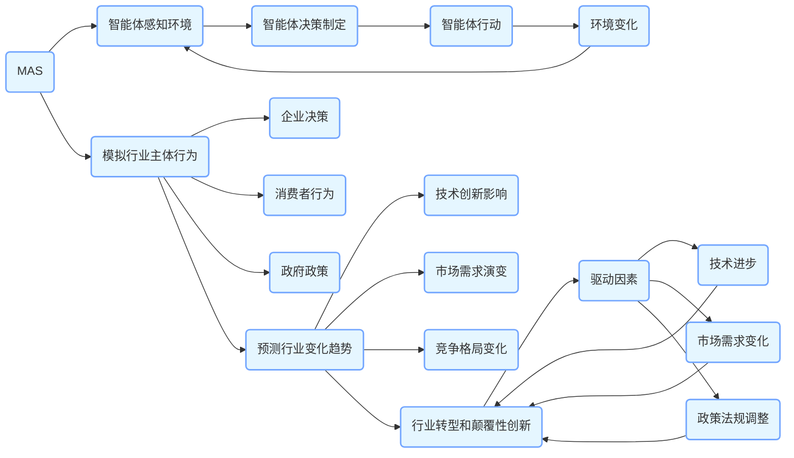

# 多智能体系统在识别行业转型和颠覆性创新中的作用

> 关键词：多智能体系统、行业转型、颠覆性创新、识别、智能决策

> 摘要：本文深入探讨了多智能体系统在识别行业转型和颠覆性创新中的重要作用。首先介绍了相关背景，包括目的、预期读者、文档结构和术语表。接着阐述了多智能体系统的核心概念及其与行业转型和颠覆性创新的联系，通过文本示意图和 Mermaid 流程图进行直观展示。详细讲解了核心算法原理和具体操作步骤，并用 Python 源代码进行了说明。分析了相关的数学模型和公式，并举例说明。通过项目实战案例，从开发环境搭建到源代码实现和解读进行了详细阐述。探讨了多智能体系统在实际中的应用场景，推荐了学习资源、开发工具框架和相关论文著作。最后总结了未来发展趋势与挑战，提供了常见问题解答和扩展阅读参考资料。旨在帮助读者全面理解多智能体系统在该领域的价值和应用。

## 1. 背景介绍 
### 1.1 目的和范围
在当今快速发展的商业环境中，行业转型和颠覆性创新不断涌现。准确识别这些变化对于企业的战略规划、投资者的决策以及政策制定者的引导至关重要。多智能体系统作为一种强大的建模和分析工具，能够模拟复杂的社会和经济系统，为识别行业转型和颠覆性创新提供了新的视角和方法。

本文的目的是全面探讨多智能体系统在识别行业转型和颠覆性创新中的作用。具体范围包括：多智能体系统的核心概念和原理、用于识别的核心算法、相关的数学模型、实际项目案例分析、应用场景探讨以及相关工具和资源推荐等。

### 1.2 预期读者
本文的预期读者包括：
- 企业管理人员和战略规划者：希望通过多智能体系统识别行业变化，制定适应市场的战略。
- 投资者：寻找具有颠覆性创新潜力的投资机会。
- 研究人员：对多智能体系统在经济和管理领域的应用感兴趣。
- 政策制定者：利用多智能体系统的分析结果制定有利于行业发展的政策。
- 计算机科学和人工智能专业的学生和从业者：了解多智能体系统在实际领域的应用。

### 1.3 文档结构概述
本文将按照以下结构进行阐述：
- 核心概念与联系：介绍多智能体系统、行业转型和颠覆性创新的核心概念，并展示它们之间的联系。
- 核心算法原理 & 具体操作步骤：讲解用于识别的核心算法，并给出 Python 代码示例。
- 数学模型和公式 & 详细讲解 & 举例说明：分析相关的数学模型和公式，并通过实例进行说明。
- 项目实战：代码实际案例和详细解释说明：通过一个实际项目案例，从开发环境搭建到代码实现和解读进行详细介绍。
- 实际应用场景：探讨多智能体系统在不同行业中的应用场景。
- 工具和资源推荐：推荐学习资源、开发工具框架和相关论文著作。
- 总结：未来发展趋势与挑战：总结多智能体系统在该领域的未来发展趋势和面临的挑战。
- 附录：常见问题与解答：提供常见问题的解答。
- 扩展阅读 & 参考资料：提供相关的扩展阅读材料和参考资料。

### 1.4 术语表
#### 1.4.1 核心术语定义
- **多智能体系统（Multi - Agent System，MAS）**：由多个智能体组成的系统，这些智能体能够自主地感知环境、做出决策并采取行动，通过相互协作和交互来实现共同的目标。
- **行业转型**：指一个行业在技术、市场、竞争格局等方面发生的重大变化，导致行业的结构、运营模式和发展方向发生转变。
- **颠覆性创新**：指引入新的技术、产品或商业模式，打破现有市场的竞争格局，对传统企业和行业产生巨大冲击的创新行为。
- **智能体（Agent）**：具有自主性、反应性、社会性和主动性的实体，能够感知环境并根据自身的目标和知识做出决策。

#### 1.4.2 相关概念解释
- **环境感知**：智能体通过传感器等手段获取周围环境的信息，包括市场数据、技术趋势、竞争对手动态等。
- **决策制定**：智能体根据感知到的信息和自身的目标，运用一定的算法和策略做出决策，如是否进入新市场、是否采用新技术等。
- **交互与协作**：智能体之间通过通信和协调机制进行交互和协作，共同完成复杂的任务，如多个企业智能体合作开展研发项目。

#### 1.4.3 缩略词列表
- MAS：Multi - Agent System（多智能体系统）
- AI：Artificial Intelligence（人工智能）
- ML：Machine Learning（机器学习）

## 2. 核心概念与联系 
### 核心概念原理
#### 多智能体系统原理
多智能体系统的核心思想是将复杂的系统分解为多个相对简单的智能体，每个智能体具有一定的自主性和智能。智能体可以是物理实体（如机器人）或软件程序（如智能算法）。智能体之间通过通信和交互来协调行动，共同完成系统的目标。

智能体通常具有以下几个基本要素：
- **感知能力**：能够感知周围环境的状态和变化。
- **决策能力**：根据感知到的信息和自身的目标，做出合理的决策。
- **行动能力**：根据决策结果采取相应的行动，影响周围环境。

#### 行业转型和颠覆性创新原理
行业转型通常是由多种因素驱动的，如技术进步、市场需求变化、政策法规调整等。当这些因素积累到一定程度时，会导致行业的结构和运营模式发生重大变化。

颠覆性创新则是一种突破传统的创新方式，它往往通过引入新的技术、产品或商业模式，创造出新的市场需求，打破现有市场的竞争格局。颠覆性创新通常具有以下特点：
- **技术创新性**：采用了全新的技术或技术组合。
- **市场破坏性**：对传统市场和企业造成巨大冲击。
- **发展快速性**：一旦出现，往往会迅速发展壮大。

### 核心概念联系
多智能体系统可以用于模拟行业中的各种主体（如企业、消费者、政府等）的行为和交互，从而帮助我们更好地理解行业的动态变化。通过在多智能体系统中设置不同的参数和规则，可以模拟行业转型和颠覆性创新的发生过程。

例如，在一个模拟的市场环境中，多个企业智能体可以根据市场需求、技术趋势和竞争对手的情况做出决策，如是否进行技术创新、是否进入新市场等。当某个企业智能体采用了一种新的技术或商业模式时，可能会引发其他企业的反应，从而导致整个行业的竞争格局发生变化，模拟出行业转型和颠覆性创新的过程。

### 文本示意图
```plaintext
多智能体系统
├── 智能体1
│   ├── 感知能力
│   ├── 决策能力
│   ├── 行动能力
├── 智能体2
│   ├── 感知能力
│   ├── 决策能力
│   ├── 行动能力
├──...
└── 通信与交互

行业转型和颠覆性创新
├── 驱动因素
│   ├── 技术进步
│   ├── 市场需求变化
│   ├── 政策法规调整
├── 表现形式
│   ├── 行业结构变化
│   ├── 运营模式转变
│   ├── 竞争格局重塑

多智能体系统与行业转型和颠覆性创新的联系
├── 模拟行业主体行为
│   ├── 企业决策
│   ├── 消费者行为
│   ├── 政府政策
├── 预测行业变化趋势
│   ├── 技术创新影响
│   ├── 市场需求演变
│   ├── 竞争格局变化
```

### Mermaid 流程图


## 3. 核心算法原理 & 具体操作步骤 
### 核心算法原理
在多智能体系统中，用于识别行业转型和颠覆性创新的核心算法通常涉及以下几个方面：

#### 环境感知算法
环境感知算法用于智能体获取周围环境的信息。常见的环境感知算法包括数据采集和预处理算法。例如，可以使用网络爬虫技术从互联网上采集市场数据、技术新闻等信息，然后使用数据清洗和特征提取算法对采集到的数据进行预处理。

#### 决策算法
决策算法用于智能体根据感知到的信息和自身的目标做出决策。常见的决策算法包括基于规则的决策算法、机器学习算法和优化算法。例如，可以使用规则引擎根据预设的规则做出决策，也可以使用机器学习算法（如神经网络、决策树等）对数据进行学习和预测，从而做出决策。

#### 交互与协作算法
交互与协作算法用于智能体之间的通信和协调。常见的交互与协作算法包括合同网协议、拍卖算法等。例如，在合同网协议中，一个智能体可以发布任务，其他智能体可以竞争该任务，通过协商和谈判达成合作。

### 具体操作步骤
#### 步骤 1：定义智能体和环境
首先，需要定义多智能体系统中的智能体和环境。智能体可以根据实际情况进行分类，如企业智能体、消费者智能体、政府智能体等。环境可以包括市场环境、技术环境、政策环境等。

#### 步骤 2：设计智能体的感知、决策和行动规则
根据智能体的类型和目标，设计智能体的感知、决策和行动规则。例如，企业智能体可以根据市场需求和竞争对手的情况决定是否进行技术创新，消费者智能体可以根据产品的价格和质量决定是否购买。

#### 步骤 3：实现环境感知算法
使用合适的环境感知算法，让智能体获取周围环境的信息。例如，可以使用网络爬虫和数据预处理算法获取市场数据和技术新闻。

#### 步骤 4：实现决策算法
根据设计的决策规则，实现智能体的决策算法。可以使用基于规则的决策算法、机器学习算法或优化算法。

#### 步骤 5：实现交互与协作算法
使用合适的交互与协作算法，让智能体之间进行通信和协调。例如，可以使用合同网协议实现智能体之间的任务分配和合作。

#### 步骤 6：运行多智能体系统并分析结果
运行多智能体系统，观察智能体的行为和交互，分析系统的运行结果。可以通过统计分析、可视化等方法对结果进行分析，识别行业转型和颠覆性创新的迹象。

### Python 源代码示例
```python
import random

# 定义智能体类
class Agent:
    def __init__(self, agent_type, initial_state):
        self.agent_type = agent_type
        self.state = initial_state
        self.perception = {}

    def perceive(self, environment):
        # 简单的环境感知，随机获取部分环境信息
        for key in environment:
            if random.random() < 0.5:
                self.perception[key] = environment[key]

    def make_decision(self):
        # 简单的决策规则，根据感知信息随机决策
        if 'market_demand' in self.perception and self.perception['market_demand'] > 50:
            self.state = 'innovate'
        else:
            self.state = 'maintain'

    def take_action(self, environment):
        # 简单的行动，根据决策改变环境
        if self.state == 'innovate':
            environment['technology_level'] += 10
        return environment

# 定义环境类
class Environment:
    def __init__(self):
        self.market_demand = random.randint(0, 100)
        self.technology_level = 50
        self.policy = 'neutral'

    def get_state(self):
        return {
            'market_demand': self.market_demand,
            'technology_level': self.technology_level,
            'policy': self.policy
        }

# 创建环境和智能体
env = Environment()
agent = Agent('enterprise', 'maintain')

# 模拟多智能体系统运行
for i in range(10):
    print(f"Step {i}:")
    # 智能体感知环境
    agent.perceive(env.get_state())
    # 智能体做出决策
    agent.make_decision()
    # 智能体采取行动
    env = agent.take_action(env)
    print(f"Agent state: {agent.state}")
    print(f"Environment state: {env.get_state()}")
```
在上述代码中，我们定义了一个简单的多智能体系统，包括一个智能体类和一个环境类。智能体可以感知环境、做出决策并采取行动，环境会根据智能体的行动发生变化。通过模拟多智能体系统的运行，我们可以观察智能体的行为和环境的变化，从而识别行业转型和颠覆性创新的迹象。

## 4. 数学模型和公式 & 详细讲解 & 举例说明 
### 数学模型
#### 智能体状态转移模型
智能体的状态可以用一个向量 $\mathbf{s}_t$ 表示，其中 $t$ 表示时间步。智能体的状态转移可以用以下公式表示：
$$\mathbf{s}_{t + 1} = f(\mathbf{s}_t, \mathbf{p}_t, \mathbf{a}_t)$$
其中，$\mathbf{p}_t$ 表示智能体在时间步 $t$ 感知到的环境信息，$\mathbf{a}_t$ 表示智能体在时间步 $t$ 采取的行动，$f$ 是一个状态转移函数。

#### 环境演化模型
环境的状态可以用一个向量 $\mathbf{e}_t$ 表示。环境的演化可以用以下公式表示：
$$\mathbf{e}_{t + 1} = g(\mathbf{e}_t, \mathbf{A}_t)$$
其中，$\mathbf{A}_t$ 表示所有智能体在时间步 $t$ 采取的行动集合，$g$ 是一个环境演化函数。

### 详细讲解
#### 智能体状态转移模型讲解
智能体的状态转移模型描述了智能体的状态如何随着时间和环境信息的变化而变化。智能体的状态可以包括多个方面，如企业智能体的生产规模、技术水平、市场份额等。智能体的感知信息 $\mathbf{p}_t$ 可以通过环境感知算法获取，行动 $\mathbf{a}_t$ 可以通过决策算法确定。状态转移函数 $f$ 可以是一个复杂的函数，取决于智能体的类型和决策规则。

#### 环境演化模型讲解
环境演化模型描述了环境的状态如何随着智能体的行动而变化。环境的状态可以包括市场需求、技术水平、政策法规等。所有智能体的行动集合 $\mathbf{A}_t$ 会对环境产生影响，环境演化函数 $g$ 描述了这种影响的具体方式。

### 举例说明
假设我们有一个简单的多智能体系统，其中有一个企业智能体和一个市场环境。企业智能体的状态可以用一个二维向量 $\mathbf{s}_t = (x_t, y_t)$ 表示，其中 $x_t$ 表示企业的生产规模，$y_t$ 表示企业的技术水平。环境的状态可以用一个一维向量 $\mathbf{e}_t = (z_t)$ 表示，其中 $z_t$ 表示市场需求。

智能体的状态转移函数可以定义为：
$$
\begin{cases}
x_{t + 1} = x_t + \alpha \cdot a_{x,t} \\
y_{t + 1} = y_t + \beta \cdot a_{y,t}
\end{cases}
$$
其中，$a_{x,t}$ 和 $a_{y,t}$ 分别表示企业在时间步 $t$ 对生产规模和技术水平采取的行动，$\alpha$ 和 $\beta$ 是常数。

环境的演化函数可以定义为：
$$z_{t + 1} = z_t + \gamma \cdot \sum_{i} a_{x,i,t}$$
其中，$\gamma$ 是常数，$\sum_{i} a_{x,i,t}$ 表示所有企业在时间步 $t$ 对生产规模采取的行动之和。

假设在时间步 $t = 0$ 时，企业的状态为 $\mathbf{s}_0 = (10, 20)$，市场需求为 $\mathbf{e}_0 = (50)$。企业在时间步 $t = 0$ 采取的行动为 $a_{x,0} = 5$，$a_{y,0} = 3$。假设 $\alpha = 0.5$，$\beta = 0.3$，$\gamma = 0.1$。

则在时间步 $t = 1$ 时，企业的状态为：
$$
\begin{cases}
x_1 = 10 + 0.5 \cdot 5 = 12.5 \\
y_1 = 20 + 0.3 \cdot 3 = 20.9
\end{cases}
$$
市场需求为：
$$z_1 = 50 + 0.1 \cdot 5 = 50.5$$

通过不断迭代智能体状态转移模型和环境演化模型，我们可以模拟多智能体系统的运行过程，观察企业和市场的变化情况，从而识别行业转型和颠覆性创新的迹象。

## 5. 项目实战：代码实际案例和详细解释说明 
### 5.1  开发环境搭建
#### 操作系统
本项目可以在 Windows、Linux 或 macOS 操作系统上进行开发。建议使用 Linux 系统，如 Ubuntu 18.04 或更高版本，因为 Linux 系统对 Python 开发环境的支持较好。

#### Python 环境
本项目使用 Python 3.7 或更高版本进行开发。可以从 Python 官方网站（https://www.python.org/downloads/）下载并安装 Python。安装完成后，可以使用以下命令验证 Python 版本：
```bash
python --version
```

#### 依赖库安装
本项目需要安装以下 Python 依赖库：
- `numpy`：用于数值计算。
- `matplotlib`：用于数据可视化。

可以使用以下命令安装这些依赖库：
```bash
pip install numpy matplotlib
```

### 5.2  源代码详细实现和代码解读
```python
import numpy as np
import matplotlib.pyplot as plt

# 定义智能体类
class Agent:
    def __init__(self, agent_id, initial_technology, initial_market_share):
        self.agent_id = agent_id
        self.technology = initial_technology
        self.market_share = initial_market_share
        self.profit = 0

    def innovate(self, innovation_rate):
        # 智能体进行创新，提高技术水平
        if np.random.rand() < innovation_rate:
            self.technology += np.random.randint(1, 5)

    def compete(self, other_agents, market_size):
        # 智能体参与市场竞争，计算市场份额和利润
        total_technology = sum([agent.technology for agent in other_agents])
        if total_technology == 0:
            self.market_share = 1 / len(other_agents)
        else:
            self.market_share = self.technology / total_technology
        self.profit = self.market_share * market_size

# 定义环境类
class Environment:
    def __init__(self, num_agents, initial_market_size):
        self.num_agents = num_agents
        self.market_size = initial_market_size
        self.agents = [Agent(i, np.random.randint(1, 10), 1 / num_agents) for i in range(num_agents)]

    def run_simulation(self, num_steps, innovation_rate):
        technology_history = []
        market_share_history = []
        profit_history = []
        for step in range(num_steps):
            # 每个智能体进行创新
            for agent in self.agents:
                agent.innovate(innovation_rate)
            # 每个智能体参与市场竞争
            for agent in self.agents:
                agent.compete(self.agents, self.market_size)
            # 记录数据
            technology_history.append([agent.technology for agent in self.agents])
            market_share_history.append([agent.market_share for agent in self.agents])
            profit_history.append([agent.profit for agent in self.agents])
        return technology_history, market_share_history, profit_history

# 主程序
if __name__ == "__main__":
    num_agents = 5
    initial_market_size = 100
    num_steps = 20
    innovation_rate = 0.3

    env = Environment(num_agents, initial_market_size)
    technology_history, market_share_history, profit_history = env.run_simulation(num_steps, innovation_rate)

    # 可视化结果
    plt.figure(figsize=(15, 5))
    plt.subplot(1, 3, 1)
    for i in range(num_agents):
        plt.plot([step for step in range(num_steps)], [technology_history[step][i] for step in range(num_steps)], label=f"Agent {i}")
    plt.title("Technology Level")
    plt.xlabel("Step")
    plt.ylabel("Technology")
    plt.legend()

    plt.subplot(1, 3, 2)
    for i in range(num_agents):
        plt.plot([step for step in range(num_steps)], [market_share_history[step][i] for step in range(num_steps)], label=f"Agent {i}")
    plt.title("Market Share")
    plt.xlabel("Step")
    plt.ylabel("Market Share")
    plt.legend()

    plt.subplot(1, 3, 3)
    for i in range(num_agents):
        plt.plot([step for step in range(num_steps)], [profit_history[step][i] for step in range(num_steps)], label=f"Agent {i}")
    plt.title("Profit")
    plt.xlabel("Step")
    plt.ylabel("Profit")
    plt.legend()

    plt.tight_layout()
    plt.show()
```

### 5.3  代码解读与分析
#### 智能体类（Agent）
- `__init__` 方法：初始化智能体的 ID、初始技术水平、初始市场份额和利润。
- `innovate` 方法：智能体以一定的创新率进行创新，提高技术水平。
- `compete` 方法：智能体参与市场竞争，根据自身技术水平和其他智能体的技术水平计算市场份额和利润。

#### 环境类（Environment）
- `__init__` 方法：初始化环境，包括智能体的数量、初始市场规模和创建智能体列表。
- `run_simulation` 方法：运行模拟过程，每个时间步中，智能体进行创新和市场竞争，并记录技术水平、市场份额和利润的历史数据。

#### 主程序
- 定义模拟参数，如智能体数量、初始市场规模、模拟步数和创新率。
- 创建环境对象并运行模拟。
- 使用 `matplotlib` 库将技术水平、市场份额和利润的历史数据进行可视化。

通过这个项目实战案例，我们可以观察到智能体在不同创新率下的技术发展、市场份额变化和利润情况，从而识别行业转型和颠覆性创新的迹象。例如，如果某个智能体的技术水平和市场份额在短时间内大幅提升，可能意味着该智能体采用了颠覆性创新技术，引发了行业的转型。

## 6. 实际应用场景 
### 金融行业
在金融行业中，多智能体系统可以用于识别金融市场的转型和颠覆性创新。例如，可以模拟银行、证券、保险等金融机构的行为和交互，分析市场竞争格局的变化。当出现新的金融科技（如区块链、人工智能等）时，可以通过多智能体系统预测其对金融行业的影响，帮助金融机构制定相应的战略。

### 医疗行业
在医疗行业中，多智能体系统可以用于识别医疗模式的转型和颠覆性创新。例如，可以模拟医院、药企、患者等主体的行为和交互，分析医疗市场的供需关系。当出现新的医疗技术（如基因编辑、远程医疗等）时，可以通过多智能体系统评估其对医疗行业的影响，为政策制定者提供决策依据。

### 能源行业
在能源行业中，多智能体系统可以用于识别能源市场的转型和颠覆性创新。例如，可以模拟能源生产企业、能源消费企业、政府等主体的行为和交互，分析能源市场的价格波动和供需平衡。当出现新的能源技术（如太阳能、风能等）时，可以通过多智能体系统预测其对能源行业的影响，帮助能源企业进行投资决策。

### 制造业
在制造业中，多智能体系统可以用于识别制造业的转型和颠覆性创新。例如，可以模拟制造企业、供应商、客户等主体的行为和交互，分析制造业的供应链和生产模式。当出现新的制造技术（如 3D 打印、智能制造等）时，可以通过多智能体系统评估其对制造业的影响，帮助制造企业进行转型升级。

## 7. 工具和资源推荐
### 7.1 学习资源推荐
#### 7.1.1 书籍推荐
- 《多智能体系统：原理与编程》：全面介绍了多智能体系统的基本原理、算法和编程实现。
- 《复杂适应系统：社会生活计算模型引论》：介绍了复杂适应系统的概念和应用，包括多智能体系统在社会和经济领域的应用。
- 《人工智能：一种现代的方法》：经典的人工智能教材，涵盖了多智能体系统的相关内容。

#### 7.1.2 在线课程
- Coursera 上的“Multi - Agent Systems”课程：由知名教授授课，系统介绍了多智能体系统的理论和实践。
- edX 上的“Artificial Intelligence”课程：包含了多智能体系统的相关章节，帮助学习者深入理解人工智能的各个方面。

#### 7.1.3 技术博客和网站
- Multi - Agent Systems Wiki：提供了多智能体系统的相关知识和资源，包括定义、算法、应用案例等。
- AI Stack Exchange：一个人工智能领域的问答社区，用户可以在上面提问和交流多智能体系统的相关问题。

### 7.2 开发工具框架推荐
#### 7.2.1 IDE和编辑器
- PyCharm：一款专业的 Python 集成开发环境，提供了丰富的代码编辑、调试和项目管理功能。
- Jupyter Notebook：一个交互式的编程环境，适合进行数据探索和模型开发，支持 Python 等多种编程语言。

#### 7.2.2 调试和性能分析工具
- pdb：Python 自带的调试工具，可以帮助开发者定位代码中的问题。
- cProfile：Python 自带的性能分析工具，可以分析代码的运行时间和函数调用情况。

#### 7.2.3 相关框架和库
- Mesa：一个用于构建多智能体系统的 Python 框架，提供了丰富的智能体和环境类，方便开发者快速搭建多智能体模型。
- NetLogo：一个用于模拟复杂系统的多智能体建模工具，具有可视化界面，适合初学者和非专业开发者使用。

### 7.3 相关论文著作推荐
#### 7.3.1 经典论文
- “Distributed Problem Solving and Multi - Agent Systems”：介绍了分布式问题解决和多智能体系统的基本概念和方法。
- “Agent - Based Modeling: Methods and Techniques for Simulating Human Systems”：阐述了基于智能体的建模方法和技术，用于模拟人类系统。

#### 7.3.2 最新研究成果
- 关注 ACM Transactions on Intelligent Systems and Technology、Journal of Artificial Intelligence Research 等期刊，了解多智能体系统的最新研究进展。

#### 7.3.3 应用案例分析
- 查阅 MIT Sloan Management Review、Harvard Business Review 等商业期刊，获取多智能体系统在实际行业中的应用案例分析。

## 8. 总结：未来发展趋势与挑战
### 未来发展趋势
#### 与其他技术的融合
多智能体系统将与人工智能的其他技术（如机器学习、深度学习、强化学习等）深度融合，提高智能体的决策能力和适应性。同时，多智能体系统也将与物联网、大数据等技术相结合，实现更广泛的应用。

#### 应用领域的拓展
多智能体系统将在更多的领域得到应用，如交通、教育、农业等。通过模拟这些领域中的主体行为和交互，可以更好地理解系统的运行机制，为决策提供支持。

#### 大规模和复杂系统的模拟
随着计算机性能的不断提高，多智能体系统将能够模拟更大规模和更复杂的系统。例如，可以模拟全球经济系统、生态系统等，为解决全球性问题提供帮助。

### 挑战
#### 模型的准确性和可靠性
多智能体系统的模型往往基于一定的假设和简化，其准确性和可靠性受到质疑。如何提高模型的准确性和可靠性，使其更好地反映实际情况，是一个亟待解决的问题。

#### 智能体的行为建模
智能体的行为建模是多智能体系统的核心问题之一。如何准确地描述智能体的感知、决策和行动过程，以及智能体之间的交互和协作机制，是一个具有挑战性的任务。

#### 计算资源的需求
大规模和复杂的多智能体系统模拟需要大量的计算资源。如何优化算法和模型，减少计算资源的需求，提高模拟效率，是一个需要解决的问题。

## 9. 附录：常见问题与解答
### 问题 1：多智能体系统与传统的系统建模方法有什么区别？
解答：传统的系统建模方法通常将系统看作一个整体，采用数学模型进行描述。而多智能体系统将系统分解为多个智能体，每个智能体具有自主性和智能，通过相互协作和交互来实现系统的目标。多智能体系统更适合模拟复杂的社会和经济系统，能够更好地反映系统中主体的行为和交互。

### 问题 2：如何确定多智能体系统中的智能体数量和类型？
解答：智能体的数量和类型需要根据具体的问题和研究目的来确定。一般来说，可以根据系统中实际存在的主体类型来定义智能体的类型，如企业、消费者、政府等。智能体的数量可以通过实验和分析来确定，以保证系统能够反映实际情况，同时又不会过于复杂。

### 问题 3：多智能体系统的模拟结果如何验证？
解答：多智能体系统的模拟结果可以通过与实际数据进行对比来验证。可以收集实际系统的历史数据，将模拟结果与实际数据进行比较，分析模拟结果的准确性和可靠性。同时，也可以通过敏感性分析等方法，分析模型中参数的变化对模拟结果的影响。

### 问题 4：多智能体系统在实际应用中存在哪些局限性？
解答：多智能体系统在实际应用中存在一些局限性。例如，模型的准确性和可靠性受到质疑，智能体的行为建模比较困难，计算资源的需求较大等。此外，多智能体系统的模拟结果可能受到初始条件和参数设置的影响，需要进行多次模拟和分析。

## 10. 扩展阅读 & 参考资料
### 扩展阅读
- 《复杂网络：原理、方法及其应用》：介绍了复杂网络的基本原理和应用，与多智能体系统有一定的关联。
- 《系统动力学：建模与仿真》：系统动力学是另一种用于模拟复杂系统的方法，可以与多智能体系统进行对比和学习。

### 参考资料
- Wooldridge, M. (2009). An introduction to multiagent systems. John Wiley & Sons.
- Epstein, J. M., & Axtell, R. (1996). Growing artificial societies: Social science from the bottom up. MIT press.
- Axelrod, R. (1984). The evolution of cooperation. Basic books.

作者：AI天才研究院/AI Genius Institute & 禅与计算机程序设计艺术 /Zen And The Art of Computer Programming