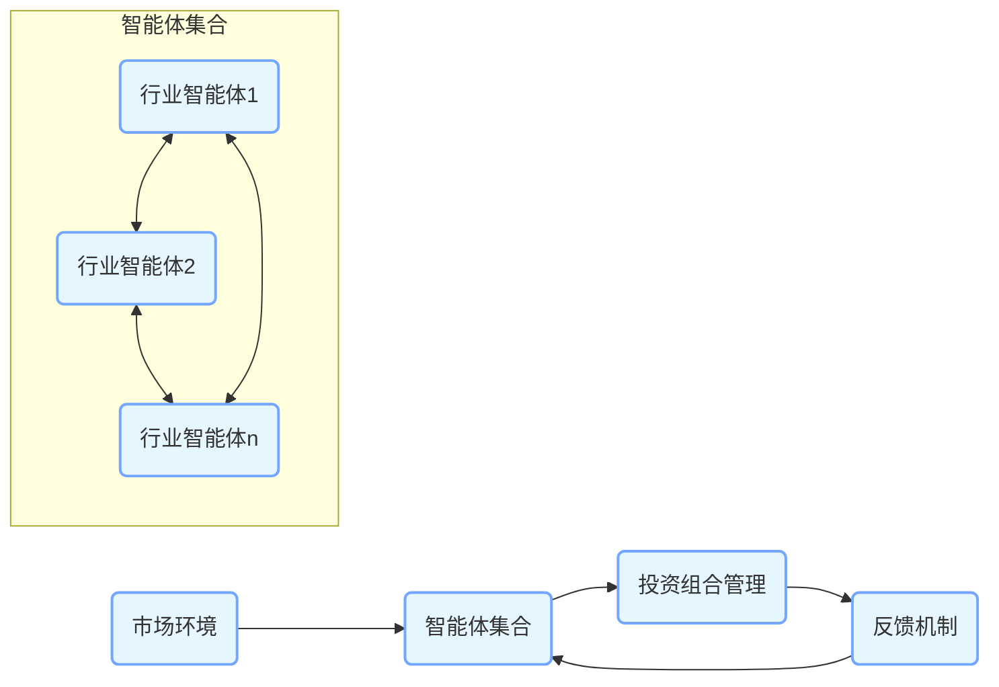

# 多智能体系统如何实现动态行业轮动

> 关键词：多智能体系统、动态行业轮动、人工智能、金融市场、强化学习

> 摘要：本文围绕多智能体系统实现动态行业轮动展开深入探讨。首先介绍了多智能体系统和动态行业轮动的背景知识，包括目的、预期读者、文档结构和相关术语。接着阐述了核心概念及其联系，给出了原理和架构的文本示意图与Mermaid流程图。详细讲解了核心算法原理，用Python代码进行说明，并介绍了相关数学模型和公式。通过项目实战，展示了开发环境搭建、源代码实现与解读。分析了多智能体系统实现动态行业轮动在金融市场等方面的实际应用场景，推荐了学习资源、开发工具框架和相关论文著作。最后总结了未来发展趋势与挑战，提供了常见问题解答和扩展阅读参考资料，旨在为相关领域的研究者和从业者提供全面的技术指导和深入的理论分析。

## 1. 背景介绍 
### 1.1 目的和范围
在金融市场中，行业轮动是一种常见的现象。不同行业在不同的经济周期和市场环境下表现各异。动态行业轮动旨在通过合理的策略，在不同行业之间进行资金的动态调配，以获取更高的投资回报。多智能体系统是由多个智能体组成的系统，每个智能体具有一定的自主性和智能，能够与其他智能体和环境进行交互。本文章的目的是探讨如何利用多智能体系统来实现动态行业轮动，包括系统的设计、算法的选择和实际应用等方面。范围涵盖了多智能体系统的基本概念、动态行业轮动的原理、相关算法的实现以及在金融市场中的实际应用案例。

### 1.2 预期读者
本文预期读者包括金融行业的从业者，如投资经理、交易员等，他们可以通过了解多智能体系统在动态行业轮动中的应用，优化投资策略，提高投资绩效。同时，计算机科学领域的研究者和开发者也可以从本文中获取灵感，探索多智能体系统在金融领域的应用。此外，对金融市场和人工智能技术感兴趣的学生和爱好者也可以通过阅读本文，了解相关领域的前沿知识。

### 1.3 文档结构概述
本文将按照以下结构进行组织：首先介绍多智能体系统和动态行业轮动的核心概念及其联系，通过文本示意图和Mermaid流程图进行清晰展示。接着详细讲解实现动态行业轮动的核心算法原理，并给出Python源代码示例。然后介绍相关的数学模型和公式，并通过具体例子进行说明。通过项目实战，展示如何搭建开发环境、实现源代码并进行代码解读。分析多智能体系统实现动态行业轮动的实际应用场景。推荐相关的学习资源、开发工具框架和论文著作。最后总结未来发展趋势与挑战，提供常见问题解答和扩展阅读参考资料。

### 1.4 术语表
#### 1.4.1 核心术语定义
- **多智能体系统（Multi - Agent System, MAS）**：由多个智能体组成的系统，每个智能体能够感知环境、做出决策并与其他智能体进行交互。
- **动态行业轮动**：在不同的市场环境和经济周期下，资金在不同行业之间进行动态调配的投资策略。
- **智能体（Agent）**：具有一定自主性和智能的实体，能够根据环境信息做出决策并采取行动。
- **强化学习（Reinforcement Learning）**：一种机器学习方法，智能体通过与环境进行交互，根据奖励信号来学习最优策略。

#### 1.4.2 相关概念解释
- **市场环境**：包括宏观经济数据、政策变化、行业竞争等因素，这些因素会影响不同行业的表现。
- **投资组合**：由多种资产组成的集合，通过合理配置资产可以降低风险并提高收益。
- **信息交互**：智能体之间通过某种方式交换信息，以协调行动和做出更优决策。

#### 1.4.3 缩略词列表
- MAS：Multi - Agent System（多智能体系统）
- RL：Reinforcement Learning（强化学习）

## 2. 核心概念与联系 
### 核心概念原理
多智能体系统实现动态行业轮动的核心思想是将每个行业看作一个智能体，每个智能体具有自己的状态和决策能力。智能体通过感知市场环境信息，如行业的财务数据、宏观经济指标等，评估自身的发展前景和投资价值。然后，智能体之间进行信息交互，根据其他智能体的状态和决策，调整自己的投资策略。通过不断地交互和学习，智能体能够在不同行业之间动态地分配资金，实现行业轮动。

### 架构的文本示意图
```plaintext
多智能体系统实现动态行业轮动架构

|-- 市场环境
|   |-- 宏观经济数据
|   |-- 行业财务数据
|   |-- 政策信息
|
|-- 智能体集合
|   |-- 行业智能体 1
|   |   |-- 状态感知
|   |   |-- 决策制定
|   |   |-- 信息交互
|   |-- 行业智能体 2
|   |   |-- 状态感知
|   |   |-- 决策制定
|   |   |-- 信息交互
|   |--...
|   |-- 行业智能体 n
|       |-- 状态感知
|       |-- 决策制定
|       |-- 信息交互
|
|-- 投资组合管理
|   |-- 资金分配
|   |-- 风险控制
|
|-- 反馈机制
|   |-- 投资回报评估
|   |-- 策略调整
```

### Mermaid流程图


## 3. 核心算法原理 & 具体操作步骤 
### 核心算法原理
在多智能体系统实现动态行业轮动中，强化学习是一种常用的算法。强化学习的基本思想是智能体通过与环境进行交互，根据环境反馈的奖励信号来学习最优策略。在这个场景中，智能体是行业智能体，环境是市场环境，奖励信号可以是投资回报。

智能体的状态可以用行业的相关指标来表示，如行业的市盈率、市净率、营收增长率等。智能体的动作是决定是否增加或减少对该行业的投资。智能体根据当前状态选择一个动作，执行该动作后，环境会反馈一个奖励信号，智能体根据奖励信号更新自己的策略，以期望在未来获得更高的奖励。

### Python源代码示例
```python
import numpy as np

# 定义智能体类
class IndustryAgent:
    def __init__(self, state_size, action_size):
        self.state_size = state_size
        self.action_size = action_size
        # 初始化Q表
        self.q_table = np.zeros((state_size, action_size))
        # 学习率
        self.learning_rate = 0.1
        # 折扣因子
        self.discount_factor = 0.9
        # 探索率
        self.epsilon = 0.1

    def choose_action(self, state):
        if np.random.uniform(0, 1) < self.epsilon:
            # 探索：随机选择动作
            action = np.random.choice(self.action_size)
        else:
            # 利用：选择Q值最大的动作
            action = np.argmax(self.q_table[state, :])
        return action

    def update_q_table(self, state, action, reward, next_state):
        # Q学习更新公式
        predict = self.q_table[state, action]
        target = reward + self.discount_factor * np.max(self.q_table[next_state, :])
        self.q_table[state, action] = (1 - self.learning_rate) * predict + self.learning_rate * target

# 模拟市场环境
class MarketEnvironment:
    def __init__(self, num_states, num_actions):
        self.num_states = num_states
        self.num_actions = num_actions

    def step(self, state, action):
        # 模拟奖励和下一个状态
        next_state = np.random.randint(0, self.num_states)
        reward = np.random.randint(-10, 10)
        return next_state, reward

# 主函数
def main():
    state_size = 10
    action_size = 3
    agent = IndustryAgent(state_size, action_size)
    env = MarketEnvironment(state_size, action_size)

    num_episodes = 1000
    for episode in range(num_episodes):
        state = np.random.randint(0, state_size)
        total_reward = 0
        for _ in range(10):
            action = agent.choose_action(state)
            next_state, reward = env.step(state, action)
            agent.update_q_table(state, action, reward, next_state)
            state = next_state
            total_reward += reward
        print(f"Episode {episode + 1}: Total Reward = {total_reward}")

if __name__ == "__main__":
    main()
```
### 具体操作步骤
1. **初始化**：初始化行业智能体的Q表、学习率、折扣因子和探索率等参数，同时初始化市场环境。
2. **状态感知**：每个行业智能体感知当前的市场环境信息，确定自己的状态。
3. **动作选择**：智能体根据当前状态，通过探索和利用的策略选择一个动作。
4. **执行动作**：智能体执行选择的动作，即调整对该行业的投资。
5. **环境反馈**：市场环境根据智能体的动作，反馈一个奖励信号和下一个状态。
6. **策略更新**：智能体根据奖励信号和下一个状态，更新自己的Q表，调整策略。
7. **重复步骤2 - 6**：不断重复上述步骤，直到达到预设的训练次数或满足其他终止条件。

## 4. 数学模型和公式 & 详细讲解 & 举例说明 
### 数学模型
在强化学习中，常用的数学模型是马尔可夫决策过程（Markov Decision Process, MDP）。一个MDP可以用一个五元组 $(S, A, P, R, \gamma)$ 来表示，其中：
- $S$ 是状态空间，表示智能体可能处于的所有状态的集合。
- $A$ 是动作空间，表示智能体可以采取的所有动作的集合。
- $P(s'|s, a)$ 是状态转移概率，表示在状态 $s$ 下采取动作 $a$ 后转移到状态 $s'$ 的概率。
- $R(s, a, s')$ 是奖励函数，表示在状态 $s$ 下采取动作 $a$ 转移到状态 $s'$ 时获得的奖励。
- $\gamma$ 是折扣因子，用于权衡当前奖励和未来奖励的重要性，取值范围为 $[0, 1]$。

### 公式
在Q学习算法中，Q表的更新公式为：
$$Q(s, a) \leftarrow (1 - \alpha)Q(s, a) + \alpha [R(s, a, s') + \gamma \max_{a'} Q(s', a')]$$
其中：
- $Q(s, a)$ 是状态 $s$ 下采取动作 $a$ 的Q值。
- $\alpha$ 是学习率，控制Q值更新的速度。
- $R(s, a, s')$ 是在状态 $s$ 下采取动作 $a$ 转移到状态 $s'$ 时获得的奖励。
- $\gamma$ 是折扣因子。
- $\max_{a'} Q(s', a')$ 是下一个状态 $s'$ 下所有动作的最大Q值。

### 详细讲解
Q学习算法的核心思想是通过不断地更新Q表，使得智能体能够学习到最优策略。学习率 $\alpha$ 决定了新的经验对Q值的影响程度，$\alpha$ 越大，新的经验对Q值的影响越大；折扣因子 $\gamma$ 决定了未来奖励的重要性，$\gamma$ 越接近1，智能体越注重未来的奖励。

### 举例说明
假设状态空间 $S = \{s_1, s_2, s_3\}$，动作空间 $A = \{a_1, a_2\}$，初始Q表如下：
| 状态 | $a_1$ | $a_2$ |
|------|-------|-------|
| $s_1$ | 0 | 0 |
| $s_2$ | 0 | 0 |
| $s_3$ | 0 | 0 |

当前状态 $s = s_1$，智能体选择动作 $a = a_1$，执行动作后转移到状态 $s' = s_2$，获得奖励 $R(s, a, s') = 5$。假设学习率 $\alpha = 0.1$，折扣因子 $\gamma = 0.9$。

首先，计算目标值：
$$target = R(s, a, s') + \gamma \max_{a'} Q(s', a') = 5 + 0.9 \times 0 = 5$$

然后，更新Q表：
$$Q(s, a) = (1 - \alpha)Q(s, a) + \alpha [R(s, a, s') + \gamma \max_{a'} Q(s', a')]$$
$$Q(s_1, a_1) = (1 - 0.1) \times 0 + 0.1 \times 5 = 0.5$$

更新后的Q表如下：
| 状态 | $a_1$ | $a_2$ |
|------|-------|-------|
| $s_1$ | 0.5 | 0 |
| $s_2$ | 0 | 0 |
| $s_3$ | 0 | 0 |

## 5. 项目实战：代码实际案例和详细解释说明 
### 5.1  开发环境搭建
#### 安装Python
首先需要安装Python，建议使用Python 3.7及以上版本。可以从Python官方网站（https://www.python.org/downloads/）下载并安装。

#### 安装依赖库
项目中使用了`numpy`库，用于数值计算。可以使用以下命令安装：
```sh
pip install numpy
```

### 5.2  源代码详细实现和代码解读
```python
import numpy as np

# 定义智能体类
class IndustryAgent:
    def __init__(self, state_size, action_size):
        # 状态空间大小
        self.state_size = state_size
        # 动作空间大小
        self.action_size = action_size
        # 初始化Q表，初始值都为0
        self.q_table = np.zeros((state_size, action_size))
        # 学习率，控制Q值更新的速度
        self.learning_rate = 0.1
        # 折扣因子，权衡当前奖励和未来奖励
        self.discount_factor = 0.9
        # 探索率，用于探索新的动作
        self.epsilon = 0.1

    def choose_action(self, state):
        if np.random.uniform(0, 1) < self.epsilon:
            # 以epsilon的概率进行探索，随机选择一个动作
            action = np.random.choice(self.action_size)
        else:
            # 以1 - epsilon的概率进行利用，选择Q值最大的动作
            action = np.argmax(self.q_table[state, :])
        return action

    def update_q_table(self, state, action, reward, next_state):
        # 获取当前状态和动作的Q值
        predict = self.q_table[state, action]
        # 计算目标Q值
        target = reward + self.discount_factor * np.max(self.q_table[next_state, :])
        # 根据Q学习更新公式更新Q表
        self.q_table[state, action] = (1 - self.learning_rate) * predict + self.learning_rate * target

# 模拟市场环境
class MarketEnvironment:
    def __init__(self, num_states, num_actions):
        # 状态空间大小
        self.num_states = num_states
        # 动作空间大小
        self.num_actions = num_actions

    def step(self, state, action):
        # 随机生成下一个状态
        next_state = np.random.randint(0, self.num_states)
        # 随机生成奖励
        reward = np.random.randint(-10, 10)
        return next_state, reward

# 主函数
def main():
    # 状态空间大小
    state_size = 10
    # 动作空间大小
    action_size = 3
    # 创建行业智能体
    agent = IndustryAgent(state_size, action_size)
    # 创建市场环境
    env = MarketEnvironment(state_size, action_size)

    # 训练的回合数
    num_episodes = 1000
    for episode in range(num_episodes):
        # 随机初始化当前状态
        state = np.random.randint(0, state_size)
        total_reward = 0
        for _ in range(10):
            # 智能体选择动作
            action = agent.choose_action(state)
            # 执行动作，获取下一个状态和奖励
            next_state, reward = env.step(state, action)
            # 更新Q表
            agent.update_q_table(state, action, reward, next_state)
            state = next_state
            total_reward += reward
        print(f"Episode {episode + 1}: Total Reward = {total_reward}")

if __name__ == "__main__":
    main()
```
### 5.3  代码解读与分析
#### 智能体类（`IndustryAgent`）
- `__init__`方法：初始化智能体的状态空间大小、动作空间大小、Q表、学习率、折扣因子和探索率。
- `choose_action`方法：根据当前状态选择一个动作。以 $\epsilon$ 的概率进行探索，随机选择一个动作；以 $1 - \epsilon$ 的概率进行利用，选择Q值最大的动作。
- `update_q_table`方法：根据Q学习更新公式更新Q表。

#### 市场环境类（`MarketEnvironment`）
- `__init__`方法：初始化状态空间大小和动作空间大小。
- `step`方法：模拟市场环境，根据当前状态和动作返回下一个状态和奖励。

#### 主函数（`main`）
- 初始化状态空间大小、动作空间大小、行业智能体和市场环境。
- 进行多个回合的训练，每个回合中智能体选择动作、执行动作、更新Q表，并记录总奖励。

通过分析代码的执行过程，可以发现智能体通过不断地与环境交互，逐渐学习到最优策略，使得总奖励不断增加。

## 6. 实际应用场景 
### 金融投资领域
在金融投资中，多智能体系统实现动态行业轮动可以帮助投资者优化投资组合。投资者可以将不同行业的股票看作不同的智能体，通过智能体之间的信息交互和决策，动态地调整投资组合中各行业股票的比例。例如，在经济复苏阶段，一些周期性行业如钢铁、汽车等可能表现较好，智能体可以增加对这些行业的投资；而在经济衰退阶段，一些防御性行业如医药、消费等可能更具稳定性，智能体可以增加对这些行业的投资。

### 风险管理
多智能体系统可以用于风险管理，通过对不同行业的风险进行评估和监测，及时调整投资策略，降低投资风险。例如，当某个行业的风险指标超过一定阈值时，智能体可以减少对该行业的投资，将资金转移到其他风险较低的行业。

### 行业分析和预测
智能体可以收集和分析不同行业的相关数据，如财务报表、市场趋势等，通过信息交互和学习，对行业的未来发展进行预测。投资者可以根据智能体的预测结果，提前布局相关行业，获取更高的投资回报。

## 7. 工具和资源推荐
### 7.1 学习资源推荐
#### 7.1.1 书籍推荐
- 《强化学习：原理与Python实现》：这本书详细介绍了强化学习的基本原理和算法，并通过Python代码进行实现，对于理解多智能体系统中的强化学习算法有很大帮助。
- 《多智能体系统：算法、博弈论及应用》：全面介绍了多智能体系统的理论和应用，包括智能体的建模、通信、协作等方面。
- 《金融市场技术分析》：介绍了金融市场的技术分析方法，对于理解市场环境和行业轮动有重要参考价值。

#### 7.1.2 在线课程
- Coursera上的“Reinforcement Learning Specialization”：由知名教授授课，系统地介绍了强化学习的理论和实践。
- edX上的“Multi - Agent Systems”：深入讲解了多智能体系统的相关知识，包括智能体的设计、交互和协调等。

#### 7.1.3 技术博客和网站
- Towards Data Science：提供了大量关于人工智能和机器学习的技术文章，包括强化学习和多智能体系统的应用案例。
- arXiv：一个预印本平台，提供了最新的学术研究成果，对于了解多智能体系统和金融领域的前沿研究有很大帮助。

### 7.2 开发工具框架推荐
#### 7.2.1 IDE和编辑器
- PyCharm：一款功能强大的Python集成开发环境，提供了代码编辑、调试、版本控制等功能，适合开发多智能体系统的Python代码。
- Jupyter Notebook：一种交互式的开发环境，适合进行代码实验和数据分析，可以方便地展示代码和结果。

#### 7.2.2 调试和性能分析工具
- PDB：Python自带的调试工具，可以帮助开发者定位代码中的问题。
- cProfile：Python的性能分析工具，可以分析代码的运行时间和资源消耗，帮助优化代码性能。

#### 7.2.3 相关框架和库
- OpenAI Gym：一个用于开发和比较强化学习算法的工具包，提供了多种环境和基准测试。
- Stable Baselines3：基于PyTorch的强化学习库，提供了多种预训练的强化学习算法，方便开发者快速实现强化学习模型。

### 7.3 相关论文著作推荐
#### 7.3.1 经典论文
- “Reinforcement Learning: An Introduction”：强化学习领域的经典著作，系统地介绍了强化学习的基本概念和算法。
- “Multi - Agent Systems: A Modern Approach to Distributed Artificial Intelligence”：多智能体系统领域的经典论文，对多智能体系统的理论和应用进行了深入探讨。

#### 7.3.2 最新研究成果
- 在arXiv和顶级学术会议如AAAI、IJCAI等上搜索关于多智能体系统在金融领域应用的最新研究成果，可以了解到该领域的前沿动态。

#### 7.3.3 应用案例分析
- 一些金融机构和研究机构会发布关于多智能体系统在投资组合优化、风险管理等方面的应用案例分析，可以从中学习到实际应用中的经验和方法。

## 8. 总结：未来发展趋势与挑战
### 未来发展趋势
- **与深度学习的融合**：将多智能体系统与深度学习相结合，可以更好地处理复杂的市场环境和大规模的数据。例如，使用深度学习模型来提取市场环境的特征，提高智能体的决策能力。
- **跨领域应用**：多智能体系统实现动态行业轮动的方法可以应用到更多的领域，如供应链管理、能源管理等。在供应链管理中，不同的供应商和零售商可以看作智能体，通过动态调整合作策略，优化供应链的效率。
- **强化学习算法的改进**：不断改进强化学习算法，提高智能体的学习效率和决策质量。例如，使用分布式强化学习算法，加速训练过程。

### 挑战
- **数据质量和获取**：准确的市场数据是多智能体系统实现动态行业轮动的基础，但数据的质量和获取可能存在困难。例如，一些行业的数据可能不完整或不准确，影响智能体的决策。
- **智能体之间的协调**：在多智能体系统中，智能体之间的协调是一个挑战。不同的智能体可能有不同的目标和策略，如何实现智能体之间的有效协作是需要解决的问题。
- **模型的可解释性**：强化学习模型通常是黑盒模型，其决策过程难以解释。在金融投资领域，投资者需要了解模型的决策依据，因此提高模型的可解释性是一个重要的挑战。

## 9. 附录：常见问题与解答
### 问题1：多智能体系统实现动态行业轮动的效果如何评估？
可以从投资回报、风险控制等方面进行评估。例如，计算投资组合的收益率、夏普比率等指标，评估投资回报；计算波动率、最大回撤等指标，评估风险控制能力。

### 问题2：如何选择合适的学习率和折扣因子？
学习率和折扣因子的选择通常需要通过实验来确定。一般来说，学习率可以在 $0.01 - 0.1$ 之间选择，折扣因子可以在 $0.9 - 0.99$ 之间选择。可以通过多次实验，观察智能体的学习效果和收敛速度，选择最优的参数。

### 问题3：多智能体系统中的智能体数量如何确定？
智能体数量的确定需要考虑市场环境的复杂度和计算资源的限制。一般来说，可以根据行业的数量来确定智能体的数量，每个行业对应一个智能体。同时，需要确保计算资源能够支持智能体之间的信息交互和决策过程。

## 10. 扩展阅读 & 参考资料
### 扩展阅读
- 《人工智能：一种现代的方法》：全面介绍了人工智能的各个领域，包括多智能体系统和强化学习。
- 《Python金融数据分析》：介绍了如何使用Python进行金融数据的分析和处理，对于多智能体系统在金融领域的应用有很大帮助。

### 参考资料
- Sutton, R. S., & Barto, A. G. (2018). Reinforcement Learning: An Introduction. MIT press.
- Weiss, G. (Ed.). (2013). Multi - Agent Systems: A Modern Approach to Distributed Artificial Intelligence. MIT Press.

作者：AI天才研究院/AI Genius Institute & 禅与计算机程序设计艺术 /Zen And The Art of Computer Programming