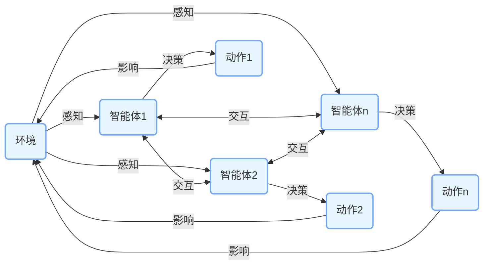

# 多智能体系统实现智能化行业比较分析

> 关键词：多智能体系统、智能化行业、比较分析、智能体交互、行业应用

> 摘要：本文旨在对多智能体系统在不同智能化行业的实现情况进行全面且深入的比较分析。首先介绍多智能体系统的背景知识，包括目的、预期读者、文档结构等。接着阐述核心概念、算法原理、数学模型，通过Python代码详细展示算法实现。以实际项目案例说明多智能体系统在开发环境搭建、代码实现与解读等方面的操作。分析多智能体系统在不同行业的实际应用场景，推荐相关学习资源、开发工具和论文著作。最后总结多智能体系统未来发展趋势与挑战，并对常见问题进行解答，为读者提供全面且有价值的参考。

## 1. 背景介绍 
### 1.1 目的和范围
多智能体系统（Multi-Agent System，MAS）作为人工智能领域的重要分支，在多个行业的智能化进程中发挥着关键作用。本分析的目的在于深入探讨多智能体系统在不同智能化行业的应用特点、优势与局限性，通过比较不同行业的应用情况，为相关从业者、研究者以及企业决策者提供有价值的参考。范围涵盖交通、医疗、金融、制造业、物流等多个典型的智能化行业，分析多智能体系统在这些行业中的系统架构、交互机制、应用效果等方面的差异。

### 1.2 预期读者
本文预期读者包括人工智能领域的研究者、多智能体系统相关的开发人员、各智能化行业的技术主管和决策者，以及对多智能体系统应用感兴趣的学生和爱好者。对于研究者，本文提供不同行业的应用案例和研究方向；对于开发人员，有助于学习多智能体系统在不同场景下的实现细节；对于行业决策者，可为智能化转型提供战略参考；对于学生和爱好者，能帮助他们了解多智能体系统的实际应用。

### 1.3 文档结构概述
本文首先介绍多智能体系统的背景知识，包括目的、预期读者和文档结构。接着阐述多智能体系统的核心概念、联系以及架构，通过Mermaid流程图展示。然后详细讲解核心算法原理，使用Python代码实现。介绍相关的数学模型和公式，并举例说明。通过实际项目案例，展示开发环境搭建、代码实现和解读。分析多智能体系统在不同行业的实际应用场景。推荐学习资源、开发工具和相关论文著作。最后总结多智能体系统的未来发展趋势与挑战，解答常见问题，并提供扩展阅读和参考资料。

### 1.4 术语表
#### 1.4.1 核心术语定义
- **多智能体系统（Multi-Agent System，MAS）**：由多个自主的智能体组成的系统，这些智能体能够感知环境、进行决策并执行动作，通过相互协作实现系统的整体目标。
- **智能体（Agent）**：具有自主性、反应性、社会性和主动性的实体，能够在一定环境中独立运行，根据自身的知识和目标进行决策和行动。
- **智能体交互（Agent Interaction）**：智能体之间通过消息传递、协商、合作等方式进行信息交流和协作的过程。
- **行业智能化**：利用先进的信息技术，如人工智能、大数据、物联网等，实现行业生产、管理、服务等环节的自动化、智能化和高效化。

#### 1.4.2 相关概念解释
- **自主性**：智能体能够在没有外界直接干预的情况下，独立地感知环境、进行决策和执行动作。
- **反应性**：智能体能够对环境的变化做出及时的反应，调整自己的行为以适应环境。
- **社会性**：智能体能够与其他智能体进行交互和协作，共同完成系统的任务。
- **主动性**：智能体能够主动地发起行动，追求自己的目标。

#### 1.4.3 缩略词列表
- **MAS**：Multi-Agent System（多智能体系统）
- **AI**：Artificial Intelligence（人工智能）
- **IoT**：Internet of Things（物联网）
- **ML**：Machine Learning（机器学习）

## 2. 核心概念与联系 
### 核心概念原理
多智能体系统的核心在于多个智能体的协同工作。每个智能体都有自己的感知器，用于感知周围环境的信息；决策器，根据感知到的信息和自身的目标进行决策；执行器，执行决策产生的动作。智能体之间通过交互机制进行信息共享和协作，以实现系统的整体目标。

例如，在一个物流配送的多智能体系统中，每个配送车辆可以看作一个智能体。车辆智能体通过传感器感知路况、货物信息等环境信息，根据自身的配送任务和当前环境进行路径规划决策，然后执行行驶动作。同时，车辆智能体之间可以通过无线通信进行信息交互，如共享路况信息、协调配送任务等，以提高整个物流配送系统的效率。

### 架构的文本示意图
```plaintext
多智能体系统
├── 智能体1
│   ├── 感知器
│   ├── 决策器
│   ├── 执行器
├── 智能体2
│   ├── 感知器
│   ├── 决策器
│   ├── 执行器
├──...
├── 智能体n
│   ├── 感知器
│   ├── 决策器
│   ├── 执行器
├── 交互机制
│   ├── 消息传递
│   ├── 协商机制
│   ├── 合作策略
```

### Mermaid 流程图


该流程图展示了多智能体系统中智能体与环境以及智能体之间的关系。智能体从环境中感知信息，经过决策产生动作，动作又会对环境产生影响。同时，智能体之间通过交互机制进行信息交流和协作。

## 3. 核心算法原理 & 具体操作步骤 
### 核心算法原理 - 基于合同网协议的任务分配算法
合同网协议是多智能体系统中常用的任务分配算法，其基本思想是通过招标、投标和中标三个阶段实现任务的合理分配。以下是具体的算法步骤：

1. **招标阶段**：任务发起者（管理者智能体）向所有潜在的执行者（工作者智能体）广播任务信息，包括任务的描述、要求和截止时间等。
2. **投标阶段**：工作者智能体收到任务信息后，根据自身的能力和资源评估是否能够完成任务，并向管理者智能体发送投标信息，包括投标价格、完成时间等。
3. **中标阶段**：管理者智能体收到所有投标信息后，根据一定的评估标准（如最低价格、最短时间等）选择最合适的工作者智能体，并向其发送中标通知。中标的工作者智能体负责执行任务。

### Python源代码实现
```python
import random

# 定义智能体类
class Agent:
    def __init__(self, id):
        self.id = id
        self.capability = random.randint(1, 10)  # 智能体的能力，随机生成

    def bid(self, task):
        # 根据任务要求和自身能力计算投标价格
        if task['requirement'] <= self.capability:
            price = task['requirement'] / self.capability * 10
            return price
        else:
            return None

    def execute_task(self, task):
        print(f"Agent {self.id} is executing task {task['id']}")

# 定义任务类
class Task:
    def __init__(self, id, requirement):
        self.id = id
        self.requirement = requirement

# 定义管理者智能体类
class ManagerAgent:
    def __init__(self):
        self.agents = []
        self.tasks = []

    def add_agent(self, agent):
        self.agents.append(agent)

    def add_task(self, task):
        self.tasks.append(task)

    def auction(self):
        for task in self.tasks:
            bids = {}
            # 招标阶段：广播任务信息
            for agent in self.agents:
                bid_price = agent.bid(task)
                if bid_price is not None:
                    bids[agent] = bid_price
            # 中标阶段：选择最低价格的智能体
            if bids:
                winner = min(bids, key=bids.get)
                winner.execute_task(task)
            else:
                print(f"No agent can handle task {task.id}")

# 主程序
if __name__ == "__main__":
    manager = ManagerAgent()
    # 添加智能体
    for i in range(5):
        agent = Agent(i)
        manager.add_agent(agent)
    # 添加任务
    for i in range(3):
        task = Task(i, random.randint(1, 10))
        manager.add_task(task)
    # 进行任务分配
    manager.auction()
```

### 具体操作步骤
1. **初始化智能体和任务**：创建管理者智能体、多个工作者智能体和任务对象，并将工作者智能体和任务添加到管理者智能体中。
2. **执行任务分配**：调用管理者智能体的`auction`方法，开始任务分配过程。在`auction`方法中，依次对每个任务进行招标、投标和中标操作。
3. **执行任务**：中标的工作者智能体执行相应的任务。

## 4. 数学模型和公式 & 详细讲解 & 举例说明 
### 智能体决策模型 - 基于效用函数的决策模型
智能体在进行决策时，通常会根据不同的行动方案计算其效用值，然后选择效用值最大的行动方案。效用函数可以表示为：

$$U(a, s) = \sum_{i=1}^{n} w_i \cdot f_i(a, s)$$

其中，$U(a, s)$ 表示在状态 $s$ 下选择行动 $a$ 的效用值，$w_i$ 是第 $i$ 个因素的权重，$f_i(a, s)$ 是第 $i$ 个因素在状态 $s$ 下选择行动 $a$ 的评估值。

### 详细讲解
- **因素评估值 $f_i(a, s)$**：每个因素可以是与任务相关的各种指标，如成本、时间、质量等。例如，在物流配送中，成本因素的评估值可以是运输成本，时间因素的评估值可以是预计送达时间。
- **权重 $w_i$**：权重表示每个因素在决策中的重要程度，所有权重之和为 1，即 $\sum_{i=1}^{n} w_i = 1$。例如，在某些情况下，成本因素可能更重要，权重可以设置得较高；而在紧急配送任务中，时间因素的权重可能更高。

### 举例说明
假设一个智能体需要在两个行动方案 $a_1$ 和 $a_2$ 中进行选择，考虑两个因素：成本和时间。权重分别为 $w_1 = 0.6$（成本）和 $w_2 = 0.4$（时间）。在当前状态 $s$ 下，各因素的评估值如下：

| 行动方案 | 成本评估值 $f_1(a, s)$ | 时间评估值 $f_2(a, s)$ |
| ---- | ---- | ---- |
| $a_1$ | 8 | 7 |
| $a_2$ | 6 | 9 |

计算各行动方案的效用值：

对于行动方案 $a_1$：

$$U(a_1, s) = w_1 \cdot f_1(a_1, s) + w_2 \cdot f_2(a_1, s) = 0.6 \times 8 + 0.4 \times 7 = 7.6$$

对于行动方案 $a_2$：

$$U(a_2, s) = w_1 \cdot f_1(a_2, s) + w_2 \cdot f_2(a_2, s) = 0.6 \times 6 + 0.4 \times 9 = 7.2$$

由于 $U(a_1, s) > U(a_2, s)$，智能体应选择行动方案 $a_1$。

## 5. 项目实战：代码实际案例和详细解释说明 
### 5.1  开发环境搭建
#### 操作系统
选择主流的操作系统，如Windows 10、Ubuntu 20.04等。

#### 编程语言和环境
使用Python 3.x作为开发语言，推荐安装Anaconda来管理Python环境。可以通过以下命令安装Anaconda：

```bash
wget https://repo.anaconda.com/archive/Anaconda3-2021.11-Linux-x86_64.sh
bash Anaconda3-2021.11-Linux-x86_64.sh
```

#### 依赖库安装
安装必要的Python库，如`numpy`、`matplotlib`等，可以使用以下命令：

```bash
pip install numpy matplotlib
```

### 5.2  源代码详细实现和代码解读
以下是一个简单的多智能体系统模拟项目，模拟多个智能体在一个二维环境中寻找目标的过程。

```python
import numpy as np
import matplotlib.pyplot as plt

# 定义智能体类
class Agent:
    def __init__(self, id, position):
        self.id = id
        self.position = np.array(position)
        self.speed = 1

    def move_towards(self, target):
        direction = target - self.position
        distance = np.linalg.norm(direction)
        if distance > self.speed:
            direction = direction / distance * self.speed
        self.position += direction

# 定义环境类
class Environment:
    def __init__(self, size, target):
        self.size = size
        self.target = np.array(target)
        self.agents = []

    def add_agent(self, agent):
        self.agents.append(agent)

    def step(self):
        for agent in self.agents:
            agent.move_towards(self.target)

    def visualize(self):
        plt.figure()
        plt.scatter(self.target[0], self.target[1], color='red', label='Target')
        for agent in self.agents:
            plt.scatter(agent.position[0], agent.position[1], label=f'Agent {agent.id}')
        plt.legend()
        plt.xlim(0, self.size[0])
        plt.ylim(0, self.size[1])
        plt.show()

# 主程序
if __name__ == "__main__":
    env = Environment(size=(10, 10), target=[8, 8])
    # 添加智能体
    for i in range(5):
        position = [random.randint(0, 10), random.randint(0, 10)]
        agent = Agent(i, position)
        env.add_agent(agent)
    # 模拟多个时间步
    for _ in range(10):
        env.step()
    # 可视化结果
    env.visualize()
```

### 代码解读与分析
#### 智能体类（Agent）
- `__init__` 方法：初始化智能体的ID、位置和速度。
- `move_towards` 方法：根据目标位置计算移动方向，并更新智能体的位置。如果距离目标大于速度，则按速度移动；否则，直接移动到目标位置。

#### 环境类（Environment）
- `__init__` 方法：初始化环境的大小、目标位置和智能体列表。
- `add_agent` 方法：向环境中添加智能体。
- `step` 方法：在每个时间步，调用每个智能体的 `move_towards` 方法，使其向目标移动。
- `visualize` 方法：使用 `matplotlib` 库可视化环境中的目标和智能体的位置。

#### 主程序
创建环境对象和多个智能体对象，将智能体添加到环境中。模拟多个时间步，每个时间步调用环境的 `step` 方法。最后，调用环境的 `visualize` 方法可视化结果。

## 6. 实际应用场景 
### 交通行业
在交通领域，多智能体系统可用于交通流量控制和自动驾驶。例如，每个车辆可以看作一个智能体，通过与其他车辆和交通基础设施进行交互，实现实时的交通信息共享和协同驾驶。智能体可以根据路况信息调整行驶速度和路线，避免交通拥堵，提高交通效率。同时，交通信号灯也可以作为智能体，根据实时交通流量调整信号灯的时间，优化交通信号控制。

### 医疗行业
在医疗领域，多智能体系统可用于医疗资源分配和远程医疗。例如，医院的各个科室可以看作智能体，通过交互实现医疗资源的合理分配。当某个科室的患者过多时，可以向其他科室请求支援。在远程医疗中，患者的智能健康设备可以作为智能体，实时监测患者的健康状况，并将数据传输给医生的智能终端。医生可以根据这些数据进行远程诊断和治疗。

### 金融行业
在金融领域，多智能体系统可用于投资决策和风险管理。例如，每个投资者可以看作一个智能体，根据市场信息和自身的投资策略进行决策。智能体之间可以进行信息交流和协作，共同应对市场变化。同时，金融机构可以利用多智能体系统进行风险管理，通过模拟不同的市场情景，评估投资组合的风险，并采取相应的措施进行风险控制。

### 制造业
在制造业领域，多智能体系统可用于生产调度和质量控制。例如，每个生产设备可以看作一个智能体，通过与其他设备进行交互，实现生产任务的合理分配和协同工作。智能体可以根据生产进度和设备状态调整生产计划，提高生产效率。在质量控制方面，智能体可以实时监测产品质量，发现问题及时反馈并采取措施进行纠正。

### 物流行业
在物流领域，多智能体系统可用于物流配送和仓储管理。例如，每个配送车辆和仓库可以看作智能体，通过交互实现物流任务的优化分配和协同运作。车辆智能体可以根据实时路况和货物信息选择最佳的配送路线，仓库智能体可以根据库存情况和订单需求进行货物的存储和调配。

## 7. 工具和资源推荐
### 7.1 学习资源推荐
#### 7.1.1 书籍推荐
- 《多智能体系统：原理、技术与应用》：全面介绍多智能体系统的基本原理、技术和应用案例，适合初学者和有一定基础的读者。
- 《人工智能：一种现代的方法》：经典的人工智能教材，其中包含多智能体系统的相关内容，对多智能体系统的理论和算法进行了深入讲解。
- 《智能系统中的概率推理：似然网络》：介绍了概率推理在智能系统中的应用，对于理解多智能体系统中的不确定性处理有很大帮助。

#### 7.1.2 在线课程
- Coursera上的“Artificial Intelligence for Robotics”：该课程介绍了人工智能在机器人领域的应用，其中包括多智能体系统的相关内容。
- edX上的“Multi-Agent Systems”：专门针对多智能体系统的课程，涵盖了多智能体系统的基础理论、算法和应用。

#### 7.1.3 技术博客和网站
- AI Time：提供人工智能领域的最新研究成果和技术动态，包括多智能体系统的相关内容。
- arXiv：一个预印本平台，可获取多智能体系统领域的最新研究论文。

### 7.2 开发工具框架推荐
#### 7.2.1 IDE和编辑器
- PyCharm：功能强大的Python集成开发环境，提供代码编辑、调试、版本控制等功能，适合开发多智能体系统的Python代码。
- Visual Studio Code：轻量级的代码编辑器，支持多种编程语言和插件，可用于快速开发和调试多智能体系统代码。

#### 7.2.2 调试和性能分析工具
- pdb：Python自带的调试器，可用于调试多智能体系统的Python代码。
- cProfile：Python的性能分析工具，可用于分析多智能体系统代码的性能瓶颈。

#### 7.2.3 相关框架和库
- Mesa：一个用于构建基于智能体的模型的Python库，提供了丰富的智能体和环境类，方便快速开发多智能体系统。
- JADE：一个Java开发的多智能体系统框架，支持智能体的创建、通信和协作，具有良好的可扩展性和跨平台性。

### 7.3 相关论文著作推荐
#### 7.3.1 经典论文
- “Contract Net Protocols: High-Level Communication and Control in Distributed Problem Solving”：介绍了合同网协议的基本原理和实现方法，是多智能体系统中任务分配的经典论文。
- “Distributed Problem Solving and Multi-Agent Systems”：对分布式问题求解和多智能体系统进行了系统的阐述，为多智能体系统的研究奠定了基础。

#### 7.3.2 最新研究成果
- 关注ACM SIGART、IEEE Transactions on Intelligent Systems等学术期刊和会议，可获取多智能体系统领域的最新研究成果。

#### 7.3.3 应用案例分析
- 阅读相关行业的案例研究报告，如交通、医疗、金融等行业的多智能体系统应用案例，了解多智能体系统在实际应用中的实现方法和效果。

## 8. 总结：未来发展趋势与挑战
### 未来发展趋势
- **与其他技术的融合**：多智能体系统将与人工智能的其他技术，如机器学习、深度学习、强化学习等深度融合，提高智能体的学习能力和决策能力。例如，通过强化学习算法，智能体可以在与环境的交互中不断学习最优的行为策略。
- **大规模多智能体系统**：随着计算能力的提升和通信技术的发展，将出现大规模的多智能体系统，应用于更复杂的场景，如智慧城市、全球供应链管理等。在大规模多智能体系统中，智能体的数量可能达到数千甚至数百万个，需要解决智能体之间的高效协作和通信问题。
- **跨领域应用拓展**：多智能体系统将在更多领域得到应用，如能源管理、农业、教育等。例如，在能源管理中，多智能体系统可以实现分布式能源资源的优化调度和管理，提高能源利用效率。

### 挑战
- **智能体间的协作与协调**：在多智能体系统中，智能体之间的协作和协调是一个关键问题。由于智能体的自主性和目标的多样性，可能会出现冲突和竞争，需要设计有效的协作机制和协调算法，确保系统的整体性能。
- **通信和信息安全**：多智能体系统依赖于智能体之间的通信来实现信息共享和协作。因此，通信的可靠性和信息的安全性至关重要。需要解决通信延迟、带宽限制、信息泄露等问题，确保智能体之间的通信安全和稳定。
- **可扩展性和鲁棒性**：随着多智能体系统规模的扩大，系统的可扩展性和鲁棒性成为挑战。需要设计具有良好可扩展性的系统架构和算法，以适应智能体数量的增加和环境的变化。同时，系统需要具备鲁棒性，能够在部分智能体故障或环境干扰的情况下正常运行。

## 9. 附录：常见问题与解答
### 问题1：多智能体系统与传统的分布式系统有什么区别？
答：多智能体系统强调智能体的自主性、反应性、社会性和主动性，智能体能够根据自身的知识和目标进行决策和行动，并与其他智能体进行交互和协作。而传统的分布式系统主要关注系统的分布式计算和资源共享，节点之间的协作通常是基于预先定义的规则和协议，缺乏智能体的自主性和智能性。

### 问题2：如何设计智能体之间的交互机制？
答：设计智能体之间的交互机制需要考虑以下几个方面：
- **通信协议**：选择合适的通信协议，如消息传递协议、RPC协议等，确保智能体之间能够高效、可靠地进行通信。
- **交互策略**：根据系统的目标和智能体的特点，设计合适的交互策略，如合作策略、竞争策略、协商策略等。
- **信息表示**：定义统一的信息表示格式，使智能体能够理解和处理彼此传递的信息。

### 问题3：多智能体系统的性能如何评估？
答：多智能体系统的性能评估可以从以下几个方面进行：
- **任务完成率**：评估系统在规定时间内完成任务的比例。
- **效率指标**：如平均任务执行时间、资源利用率等。
- **协作效果**：评估智能体之间的协作程度和效果，如协作成功率、协作效率等。
- **稳定性**：评估系统在不同环境条件下的稳定性和可靠性。

## 10. 扩展阅读 & 参考资料
### 扩展阅读
- 《Multiagent Systems: Algorithmic, Game-Theoretic, and Logical Foundations》：深入探讨多智能体系统的算法、博弈论和逻辑基础，适合对多智能体系统理论有深入研究需求的读者。
- 《Swarm Intelligence: From Natural to Artificial Systems》：介绍群体智能的相关知识，多智能体系统与群体智能有密切的联系，可作为扩展阅读。

### 参考资料
- 相关学术期刊和会议论文，如ACM SIGART、IEEE Transactions on Intelligent Systems、AAAI、IJCAI等。
- 多智能体系统相关的开源项目和代码库，如Mesa、JADE等的官方文档和源代码。

作者：AI天才研究院/AI Genius Institute & 禅与计算机程序设计艺术 /Zen And The Art of Computer Programming