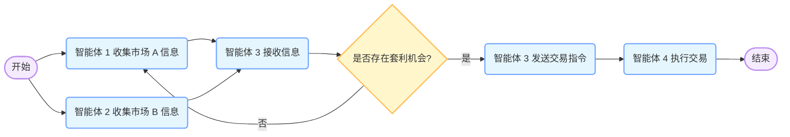

# 多智能体系统实现跨市场套利策略

> 关键词：多智能体系统、跨市场套利、策略实现、人工智能、金融市场

> 摘要：本文围绕多智能体系统实现跨市场套利策略展开深入探讨。首先介绍了相关背景，包括目的范围、预期读者等内容。详细阐述了多智能体系统及跨市场套利的核心概念与联系，给出了清晰的原理和架构示意图以及流程图。深入讲解了核心算法原理，用 Python 代码进行详细阐述，并对相关数学模型和公式进行说明与举例。通过项目实战，从开发环境搭建到源代码实现与解读，全面展示了如何利用多智能体系统实现跨市场套利策略。分析了该策略的实际应用场景，推荐了学习资源、开发工具框架以及相关论文著作。最后总结了未来发展趋势与挑战，提供常见问题解答和扩展阅读参考资料，旨在为相关领域的研究和实践提供全面且深入的指导。

## 1. 背景介绍 
### 1.1 目的和范围
多智能体系统（Multi - Agent System, MAS）是一种由多个智能体组成的系统，每个智能体都具有一定的自主决策能力和交互能力。跨市场套利则是指利用不同市场之间的价格差异进行交易，以获取无风险或低风险利润的行为。本文章的目的在于探讨如何利用多智能体系统来实现跨市场套利策略，详细阐述其原理、算法、实现步骤以及实际应用场景等内容。范围涵盖金融市场中的股票、期货、外汇等多个市场，以及相关的人工智能技术和编程实现。

### 1.2 预期读者
本文预期读者包括金融领域的从业者，如交易员、投资经理等，他们可以通过了解多智能体系统实现跨市场套利策略，优化自身的交易决策和投资组合。同时，也适合计算机科学领域的研究人员和开发者，尤其是对人工智能、多智能体系统感兴趣的人员，为他们在金融领域的应用提供案例和思路。此外，对金融市场和人工智能交叉领域有学习需求的学生和爱好者也能从本文中获得有价值的信息。

### 1.3 文档结构概述
本文首先介绍背景信息，包括目的范围、预期读者等内容。接着阐述多智能体系统和跨市场套利的核心概念与联系，给出原理和架构示意图以及流程图。然后深入讲解核心算法原理，用 Python 代码进行详细说明，并对相关数学模型和公式进行解释与举例。通过项目实战，从开发环境搭建到源代码实现与解读，全面展示实现过程。分析该策略的实际应用场景，推荐学习资源、开发工具框架以及相关论文著作。最后总结未来发展趋势与挑战，提供常见问题解答和扩展阅读参考资料。

### 1.4 术语表
#### 1.4.1 核心术语定义
- **多智能体系统（Multi - Agent System, MAS）**：由多个智能体组成的系统，每个智能体能够感知环境、自主决策并与其他智能体进行交互，以实现共同或各自的目标。
- **跨市场套利**：利用不同市场之间同一资产或相关资产的价格差异，在一个市场买入，同时在另一个市场卖出，从而获取利润的交易行为。
- **智能体（Agent）**：具有自主性、反应性、社会性和主动性等特性的实体，能够在特定环境中感知信息，进行推理和决策，并采取行动。

#### 1.4.2 相关概念解释
- **市场效率**：指市场价格反映所有可用信息的程度。在有效市场中，价格能够迅速调整以反映新的信息，跨市场套利机会相对较少；而在非有效市场中，可能存在价格差异，为跨市场套利提供了机会。
- **信息不对称**：不同市场参与者拥有的信息不同，导致某些参与者能够利用信息优势进行套利。多智能体系统可以通过信息共享和交互来缓解信息不对称问题。

#### 1.4.3 缩略词列表
- **MAS**：Multi - Agent System（多智能体系统）
- **AI**：Artificial Intelligence（人工智能）

## 2. 核心概念与联系 
### 2.1 多智能体系统原理
多智能体系统的核心思想是将复杂的问题分解为多个简单的子问题，每个子问题由一个智能体来处理。智能体之间通过通信和协作来实现整体目标。智能体通常具有以下几个关键特性：
- **自主性**：智能体能够独立地感知环境信息，并根据自身的知识和目标进行决策和行动。
- **反应性**：智能体能够对环境中的变化做出及时的反应，调整自己的行为。
- **社会性**：智能体能够与其他智能体进行交互和协作，通过通信和协商来解决问题。
- **主动性**：智能体能够主动地发起行动，追求自己的目标。

### 2.2 跨市场套利原理
跨市场套利的基本原理是利用不同市场之间的价格差异。例如，在市场 A 中某资产的价格为 $P_A$，在市场 B 中该资产的价格为 $P_B$，且 $P_A < P_B$。投资者可以在市场 A 买入该资产，同时在市场 B 卖出该资产，从而获取利润 $P_B - P_A$ （忽略交易成本）。

### 2.3 多智能体系统与跨市场套利的联系
多智能体系统可以在跨市场套利中发挥重要作用。多个智能体可以分别负责不同市场的信息收集、分析和交易决策。例如，一个智能体可以专门负责收集市场 A 的价格信息，另一个智能体负责市场 B 的信息。智能体之间通过通信和协作，实时比较不同市场的价格，发现套利机会，并协调交易操作。这样可以提高套利的效率和准确性，同时降低人工操作的风险。

### 2.4 核心概念架构的文本示意图
```plaintext
多智能体系统
├── 智能体 1（市场 A 信息收集）
│   └── 与其他智能体通信
├── 智能体 2（市场 B 信息收集）
│   └── 与其他智能体通信
├── 智能体 3（价格比较与套利决策）
│   ├── 接收智能体 1 和 2 的信息
│   └── 向交易智能体发送指令
└── 智能体 4（交易执行）
    └── 接收智能体 3 的指令并执行交易
```

### 2.5 Mermaid 流程图


## 3. 核心算法原理 & 具体操作步骤 
### 3.1 核心算法原理
在多智能体系统实现跨市场套利策略中，核心算法主要包括信息收集、价格比较和交易决策三个部分。

#### 3.1.1 信息收集
智能体通过与不同市场的数据源进行交互，实时收集市场价格、交易量等信息。可以使用网络爬虫技术从金融网站、交易平台等获取数据。

#### 3.1.2 价格比较
智能体将收集到的不同市场的价格信息进行比较，计算价格差异。设市场 A 的价格为 $P_A$，市场 B 的价格为 $P_B$，价格差异 $\Delta P = P_B - P_A$。

#### 3.1.3 交易决策
根据价格差异和预设的套利阈值 $\theta$ 进行交易决策。如果 $\Delta P > \theta$，则认为存在套利机会，发送交易指令；否则，继续收集信息。

### 3.2 Python 代码详细阐述
```python
import time

# 模拟市场 A 的价格数据源
def get_market_a_price():
    # 这里可以替换为实际的数据源获取代码
    return 100

# 模拟市场 B 的价格数据源
def get_market_b_price():
    # 这里可以替换为实际的数据源获取代码
    return 105

# 套利阈值
arbitrage_threshold = 3

# 智能体 1：市场 A 信息收集
class Agent1:
    def __init__(self):
        pass

    def collect_info(self):
        return get_market_a_price()

# 智能体 2：市场 B 信息收集
class Agent2:
    def __init__(self):
        pass

    def collect_info(self):
        return get_market_b_price()

# 智能体 3：价格比较与套利决策
class Agent3:
    def __init__(self, threshold):
        self.threshold = threshold

    def compare_prices(self, price_a, price_b):
        price_difference = price_b - price_a
        if price_difference > self.threshold:
            return True
        else:
            return False

    def make_decision(self, price_a, price_b):
        if self.compare_prices(price_a, price_b):
            print("发现套利机会，发送交易指令")
        else:
            print("未发现套利机会，继续收集信息")

# 智能体 4：交易执行
class Agent4:
    def __init__(self):
        pass

    def execute_trade(self):
        print("执行交易操作")

# 主程序
if __name__ == "__main__":
    agent1 = Agent1()
    agent2 = Agent2()
    agent3 = Agent3(arbitrage_threshold)
    agent4 = Agent4()

    while True:
        price_a = agent1.collect_info()
        price_b = agent2.collect_info()
        agent3.make_decision(price_a, price_b)
        time.sleep(1)  # 每隔 1 秒收集一次信息
```

### 3.3 具体操作步骤
1. **初始化智能体**：创建市场信息收集智能体、价格比较与套利决策智能体和交易执行智能体。
2. **信息收集**：市场信息收集智能体分别从不同市场获取价格信息。
3. **价格比较**：价格比较与套利决策智能体接收收集到的价格信息，计算价格差异。
4. **交易决策**：根据价格差异和套利阈值进行交易决策。如果存在套利机会，发送交易指令；否则，继续收集信息。
5. **交易执行**：交易执行智能体接收到交易指令后，执行相应的交易操作。
6. **循环执行**：重复上述步骤，实时监测市场价格变化，寻找套利机会。

## 4. 数学模型和公式 & 详细讲解 & 举例说明 
### 4.1 价格差异计算
设市场 A 的价格为 $P_A$，市场 B 的价格为 $P_B$，则价格差异 $\Delta P$ 可以表示为：
$$\Delta P = P_B - P_A$$

### 4.2 套利利润计算
在考虑交易成本的情况下，设市场 A 的买入成本为 $C_A$，市场 B 的卖出成本为 $C_B$，则套利利润 $\pi$ 可以表示为：
$$\pi=(P_B - P_A)-(C_A + C_B)$$

### 4.3 详细讲解
- **价格差异计算**：价格差异 $\Delta P$ 是判断是否存在套利机会的关键指标。如果 $\Delta P > 0$，则表示市场 B 的价格高于市场 A 的价格，存在潜在的套利机会。
- **套利利润计算**：在实际交易中，需要考虑交易成本。只有当套利利润 $\pi > 0$ 时，才真正存在套利机会。

### 4.4 举例说明
假设市场 A 中某股票的价格 $P_A = 100$ 元，市场 B 中该股票的价格 $P_B = 105$ 元，市场 A 的买入成本 $C_A = 1$ 元，市场 B 的卖出成本 $C_B = 1$ 元。

- **价格差异计算**：
$\Delta P = P_B - P_A = 105 - 100 = 5$ 元

- **套利利润计算**：
$\pi=(P_B - P_A)-(C_A + C_B)=5-(1 + 1)=3$ 元

由于 $\pi > 0$，所以存在套利机会，投资者可以在市场 A 买入该股票，同时在市场 B 卖出，获取 3 元的利润。

## 5. 项目实战：代码实际案例和详细解释说明 
### 5.1  开发环境搭建
#### 5.1.1 操作系统
建议使用 Linux 或 macOS 操作系统，因为它们对 Python 开发环境的支持较好。也可以使用 Windows 操作系统，但需要注意一些配置问题。

#### 5.1.2 Python 安装
从 Python 官方网站（https://www.python.org/downloads/） 下载并安装 Python 3.x 版本。安装完成后，确保 Python 和 pip 命令可以在命令行中正常使用。

#### 5.1.3 第三方库安装
在项目中，可能需要使用一些第三方库，如 `requests` 用于网络请求，`pandas` 用于数据处理等。可以使用以下命令进行安装：
```sh
pip install requests pandas
```

### 5.2  源代码详细实现和代码解读
```python
import requests
import pandas as pd
import time

# 市场 A 的 API 接口
market_a_api = "https://example.com/market_a/api"
# 市场 B 的 API 接口
market_b_api = "https://example.com/market_b/api"

# 套利阈值
arbitrage_threshold = 3

# 智能体 1：市场 A 信息收集
class Agent1:
    def __init__(self):
        pass

    def collect_info(self):
        try:
            response = requests.get(market_a_api)
            data = response.json()
            price = data["price"]
            return price
        except Exception as e:
            print(f"市场 A 信息收集失败: {e}")
            return None

# 智能体 2：市场 B 信息收集
class Agent2:
    def __init__(self):
        pass

    def collect_info(self):
        try:
            response = requests.get(market_b_api)
            data = response.json()
            price = data["price"]
            return price
        except Exception as e:
            print(f"市场 B 信息收集失败: {e}")
            return None

# 智能体 3：价格比较与套利决策
class Agent3:
    def __init__(self, threshold):
        self.threshold = threshold

    def compare_prices(self, price_a, price_b):
        if price_a is not None and price_b is not None:
            price_difference = price_b - price_a
            if price_difference > self.threshold:
                return True
            else:
                return False
        else:
            return False

    def make_decision(self, price_a, price_b):
        if self.compare_prices(price_a, price_b):
            print("发现套利机会，发送交易指令")
        else:
            print("未发现套利机会，继续收集信息")

# 智能体 4：交易执行
class Agent4:
    def __init__(self):
        pass

    def execute_trade(self):
        print("执行交易操作")

# 主程序
if __name__ == "__main__":
    agent1 = Agent1()
    agent2 = Agent2()
    agent3 = Agent3(arbitrage_threshold)
    agent4 = Agent4()

    while True:
        price_a = agent1.collect_info()
        price_b = agent2.collect_info()
        agent3.make_decision(price_a, price_b)
        time.sleep(1)  # 每隔 1 秒收集一次信息
```

### 5.3  代码解读与分析
#### 5.3.1 信息收集部分
- `Agent1` 和 `Agent2` 类分别负责市场 A 和市场 B 的信息收集。通过 `requests` 库向对应的 API 接口发送请求，获取市场价格信息。
- 如果请求失败，会捕获异常并打印错误信息。

#### 5.3.2 价格比较与套利决策部分
- `Agent3` 类负责价格比较和套利决策。`compare_prices` 方法计算价格差异，并与套利阈值进行比较。
- `make_decision` 方法根据比较结果输出相应的信息。

#### 5.3.3 交易执行部分
- `Agent4` 类负责交易执行。`execute_trade` 方法模拟执行交易操作。

#### 5.3.4 主程序部分
- 在主程序中，创建了四个智能体对象，并使用一个无限循环不断收集信息、进行决策和执行交易（如果有套利机会）。每隔 1 秒收集一次信息，以实时监测市场价格变化。

## 6. 实际应用场景 
### 6.1 金融市场
在金融市场中，多智能体系统实现跨市场套利策略可以应用于股票、期货、外汇等多个领域。例如，在股票市场中，不同证券交易所可能存在同一股票的价格差异，通过多智能体系统实时监测和交易，可以获取套利利润。在期货市场中，不同合约之间也可能存在价格差异，利用该策略可以进行跨期套利。在外汇市场中，不同银行或交易平台的汇率可能存在差异，通过多智能体系统可以实现外汇套利。

### 6.2 商品市场
在商品市场中，不同地区或不同交易平台的商品价格可能存在差异。例如，在农产品市场中，不同产地的同一农产品价格可能不同，通过多智能体系统可以实时监测价格变化，进行跨地区套利。在能源市场中，不同国家或地区的石油、天然气等能源价格也可能存在差异，利用该策略可以实现能源商品的套利。

### 6.3 电力市场
在电力市场中，不同区域的电价可能存在差异。多智能体系统可以实时监测不同区域的电价信息，通过合理调度电力资源，实现跨区域的电力套利。例如，在电价较低的区域购买电力，然后在电价较高的区域出售，从而获取利润。

## 7. 工具和资源推荐
### 7.1 学习资源推荐
#### 7.1.1 书籍推荐
- 《多智能体系统》：全面介绍了多智能体系统的基本概念、理论和方法，是学习多智能体系统的经典教材。
- 《金融市场技术分析》：详细讲解了金融市场的技术分析方法，对于理解跨市场套利策略有很大帮助。
- 《Python 数据分析实战》：介绍了如何使用 Python 进行数据分析，在多智能体系统实现跨市场套利策略中，数据分析是非常重要的环节。

#### 7.1.2 在线课程
- Coursera 上的“Multi - Agent Systems”课程：由知名教授授课，系统地讲解了多智能体系统的相关知识。
- edX 上的“Financial Markets”课程：介绍了金融市场的基本原理和交易策略，对于理解跨市场套利有很大帮助。
- 中国大学 MOOC 上的“Python 语言程序设计”课程：适合初学者学习 Python 编程，为实现多智能体系统提供编程基础。

#### 7.1.3 技术博客和网站
- Medium 上的人工智能和金融领域的博客：可以获取最新的技术动态和研究成果。
- 知乎上的金融科技和人工智能话题：可以与其他爱好者交流经验和见解。
- 金融界、和讯网等金融网站：可以获取金融市场的实时数据和相关资讯。

### 7.2 开发工具框架推荐
#### 7.2.1 IDE和编辑器
- PyCharm：功能强大的 Python 集成开发环境，提供代码编辑、调试、版本控制等功能。
- Visual Studio Code：轻量级的代码编辑器，支持多种编程语言，有丰富的插件可以扩展功能。

#### 7.2.2 调试和性能分析工具
- pdb：Python 自带的调试工具，可以帮助开发者定位代码中的问题。
- cProfile：Python 的性能分析工具，可以分析代码的运行时间和函数调用情况，帮助优化代码性能。

#### 7.2.3 相关框架和库
- Mesa：一个用于构建基于智能体的模型的 Python 框架，提供了丰富的工具和接口，方便开发者实现多智能体系统。
- Requests：用于发送 HTTP 请求的 Python 库，在信息收集环节非常有用。
- Pandas：用于数据处理和分析的 Python 库，可以对收集到的市场数据进行清洗、整理和分析。

### 7.3 相关论文著作推荐
#### 7.3.1 经典论文
- “Multi - Agent Systems: A Modern Approach to Distributed Artificial Intelligence”：介绍了多智能体系统的基本概念和理论，是该领域的经典论文。
- “Arbitrage Pricing Theory”：提出了套利定价理论，为跨市场套利提供了理论基础。

#### 7.3.2 最新研究成果
- 关注顶级学术会议如 AAAI（Association for the Advancement of Artificial Intelligence）、IJCAI（International Joint Conference on Artificial Intelligence）上的相关论文，了解多智能体系统和跨市场套利的最新研究进展。

#### 7.3.3 应用案例分析
- 一些金融机构和研究机构发布的关于跨市场套利的应用案例分析报告，可以学习实际应用中的经验和方法。

## 8. 总结：未来发展趋势与挑战
### 8.1 未来发展趋势
- **智能化程度提高**：随着人工智能技术的不断发展，多智能体系统将更加智能化。智能体将具备更强的学习能力和推理能力，能够更好地适应市场变化，发现更多的套利机会。
- **与其他技术融合**：多智能体系统将与区块链、大数据、云计算等技术深度融合。例如，区块链技术可以提供安全、透明的交易环境，大数据技术可以提供更全面的市场信息，云计算技术可以提供强大的计算能力。
- **应用领域拓展**：多智能体系统实现跨市场套利策略将不仅仅应用于金融市场和商品市场，还将拓展到其他领域，如供应链管理、能源管理等。

### 8.2 挑战
- **市场不确定性**：金融市场和其他市场具有高度的不确定性，价格波动频繁。多智能体系统需要能够快速适应市场变化，准确判断套利机会，否则可能会导致损失。
- **信息安全**：在多智能体系统中，智能体需要收集和处理大量的市场信息，包括敏感的交易数据。如何保障信息的安全和隐私是一个重要的挑战。
- **法律法规限制**：跨市场套利可能涉及到不同地区的法律法规差异。在实施跨市场套利策略时，需要遵守相关的法律法规，避免法律风险。

## 9. 附录：常见问题与解答
### 9.1 多智能体系统实现跨市场套利策略是否一定能盈利？
不一定。虽然跨市场套利策略的理论基础是利用价格差异获取利润，但市场具有不确定性，价格波动可能导致套利机会消失或出现亏损。此外，还需要考虑交易成本、市场流动性等因素。

### 9.2 如何确定套利阈值？
套利阈值的确定需要综合考虑多个因素，如市场波动性、交易成本、风险承受能力等。可以通过历史数据回测和模拟交易来确定一个合适的套利阈值。

### 9.3 多智能体系统中的智能体如何进行通信？
智能体可以通过多种方式进行通信，如消息传递、共享内存等。在 Python 中，可以使用网络编程、消息队列等技术实现智能体之间的通信。

### 9.4 如何处理市场信息收集失败的情况？
当市场信息收集失败时，可以进行重试操作，设置重试次数和重试间隔时间。如果多次重试仍然失败，可以记录错误信息，并进行相应的处理，如暂停交易或通知管理员。

## 10. 扩展阅读 & 参考资料
- 《人工智能：一种现代方法》
- 《金融工程学》
- “Multi - Agent Systems for Automated Trading in Financial Markets”
- 金融时报、华尔街日报等金融媒体的相关报道

作者：AI天才研究院/AI Genius Institute & 禅与计算机程序设计艺术 /Zen And The Art of Computer Programming