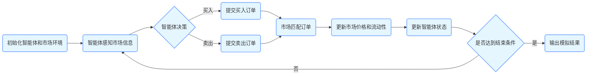

# 多智能体系统模拟市场流动性冲击

> 关键词：多智能体系统、市场流动性冲击、模拟、金融市场、交易策略

> 摘要：本文聚焦于利用多智能体系统模拟市场流动性冲击这一前沿领域。首先介绍了研究的背景、目的、预期读者以及文档结构，阐述了相关术语。接着深入探讨了多智能体系统和市场流动性冲击的核心概念及其联系，给出了原理和架构的文本示意图与Mermaid流程图。详细讲解了核心算法原理，并通过Python源代码进行说明。对相关数学模型和公式进行了推导和举例。在项目实战部分，搭建了开发环境，给出实际代码案例并进行详细解读。分析了多智能体系统模拟市场流动性冲击在金融市场的实际应用场景。推荐了学习资源、开发工具框架以及相关论文著作。最后总结了未来发展趋势与挑战，还设置了附录解答常见问题，并提供扩展阅读和参考资料。

## 1. 背景介绍 
### 1.1 目的和范围
在金融市场中，市场流动性冲击是一个关键且复杂的现象。当市场流动性突然发生变化时，可能会引发资产价格的剧烈波动、交易成本的增加等一系列问题，影响市场的稳定性和参与者的利益。本研究的目的是利用多智能体系统来模拟市场流动性冲击，深入理解流动性冲击的形成机制、传播过程以及对市场的影响。

研究范围涵盖了多智能体系统的构建，包括不同类型智能体的行为规则设定；市场流动性的度量和模拟；以及分析流动性冲击在多智能体市场环境中的动态变化。通过模拟，我们旨在为市场监管者、投资者和金融机构提供有价值的参考，帮助他们更好地应对市场流动性风险。

### 1.2 预期读者
本文预期读者包括金融领域的研究人员，他们可以从多智能体模拟的角度深入研究市场流动性问题，拓展研究思路；金融市场的从业者，如交易员、风险管理人员等，通过了解市场流动性冲击的模拟过程，更好地制定交易策略和风险管理方案；计算机科学领域对金融应用感兴趣的开发者，他们可以借鉴多智能体系统的实现方法，开发相关的金融模拟软件。

### 1.3 文档结构概述
本文首先介绍研究的背景信息，包括目的、预期读者和文档结构。接着阐述多智能体系统和市场流动性冲击的核心概念及其联系，给出相应的原理和架构图。然后详细讲解核心算法原理和具体操作步骤，并用Python代码实现。之后介绍相关的数学模型和公式，并举例说明。在项目实战部分，搭建开发环境，给出实际代码案例并进行解读。分析实际应用场景，推荐学习资源、开发工具框架和相关论文著作。最后总结未来发展趋势与挑战，解答常见问题，并提供扩展阅读和参考资料。

### 1.4 术语表
#### 1.4.1 核心术语定义
- **多智能体系统（Multi - Agent System, MAS）**：由多个智能体组成的系统，每个智能体具有自主决策能力，能够根据自身的目标和感知到的环境信息进行行动，并与其他智能体进行交互。
- **市场流动性**：指资产能够以合理价格迅速买卖的能力，通常用交易量、买卖价差等指标来衡量。
- **市场流动性冲击**：指由于某些因素导致市场流动性突然发生较大变化，对市场价格和交易产生显著影响的现象。
- **智能体（Agent）**：在多智能体系统中，具有一定的感知、决策和行动能力的实体。

#### 1.4.2 相关概念解释
- **交易策略**：智能体在市场中进行交易的规则和方法，例如基于价格趋势、技术指标等进行买卖决策。
- **市场微观结构**：研究市场交易机制、交易规则以及市场参与者行为对市场价格和流动性影响的理论。

#### 1.4.3 缩略词列表
- MAS：Multi - Agent System（多智能体系统）

## 2. 核心概念与联系 
### 核心概念原理
#### 多智能体系统原理
多智能体系统基于分布式人工智能的思想，将复杂的系统分解为多个具有自主能力的智能体。每个智能体可以感知其所处的局部环境信息，根据自身的目标和规则进行决策，并采取相应的行动。智能体之间通过通信和交互来协调各自的行为，从而实现整个系统的目标。

例如，在金融市场模拟中，智能体可以代表不同类型的投资者，如散户、机构投资者等。每个投资者根据自己的投资目标、风险偏好和对市场的判断来决定买卖行为。他们之间的交易行为相互影响，共同决定了市场的价格和流动性。

#### 市场流动性冲击原理
市场流动性冲击通常由多种因素引发，如宏观经济数据的发布、重大政策变化、突发事件等。当这些因素导致市场参与者的预期发生变化时，他们会调整自己的交易策略，从而影响市场的供求关系。如果市场上卖方力量突然增强，而买方力量相对不足，就会导致市场流动性下降，资产价格下跌，形成流动性冲击。

### 架构的文本示意图
多智能体系统模拟市场流动性冲击的架构主要包括以下几个部分：

1. **智能体层**：包含多个不同类型的智能体，如投资者智能体、做市商智能体等。每个智能体具有自己的属性和行为规则，如初始资金、交易策略等。
2. **市场环境层**：模拟金融市场的基本规则和机制，包括交易时间、交易规则、价格形成机制等。智能体在这个环境中进行交易活动。
3. **数据层**：记录市场的各种数据，如资产价格、交易量、买卖订单等。这些数据用于智能体的决策和系统的分析。
4. **交互层**：负责智能体之间以及智能体与市场环境之间的交互。智能体通过交互层发送和接收信息，进行交易和信息共享。

### Mermaid流程图


## 3. 核心算法原理 & 具体操作步骤 
### 核心算法原理
在多智能体系统模拟市场流动性冲击中，核心算法主要涉及智能体的决策算法和市场的价格形成算法。

#### 智能体决策算法
智能体的决策通常基于其自身的目标和对市场信息的感知。一种常见的决策算法是基于规则的决策算法。例如，一个简单的投资者智能体可以根据资产价格的变化来决定买卖行为：
- 如果资产价格上涨超过一定比例，且智能体持有该资产，则卖出一定数量的资产。
- 如果资产价格下跌超过一定比例，且智能体有足够的资金，则买入一定数量的资产。

#### 市场价格形成算法
市场价格形成通常基于供需关系。在模拟中，可以采用订单驱动的价格形成机制。当有买入订单和卖出订单提交到市场时，市场会按照一定的规则进行订单匹配。如果买入订单的价格高于或等于卖出订单的价格，则交易成交，成交价格为双方协商的价格。市场价格会根据最新的成交价格进行更新。

### 具体操作步骤
#### 步骤1：初始化
- 初始化智能体：为每个智能体分配初始资金、初始资产持有量等属性，并设定其交易策略。
- 初始化市场环境：设定市场的初始价格、交易规则等参数。

#### 步骤2：智能体感知市场信息
每个智能体在每个时间步长内感知市场的当前价格、交易量等信息。

#### 步骤3：智能体决策
智能体根据自身的交易策略和感知到的市场信息进行决策，决定是否买入或卖出资产，以及买入或卖出的数量。

#### 步骤4：提交订单
智能体将决策结果以订单的形式提交到市场。

#### 步骤5：市场匹配订单
市场根据订单驱动的价格形成机制对提交的订单进行匹配，完成交易。

#### 步骤6：更新市场价格和流动性
根据交易结果，更新市场的价格和流动性指标，如买卖价差、交易量等。

#### 步骤7：更新智能体状态
更新智能体的资金和资产持有量等状态信息。

#### 步骤8：判断是否结束
检查是否达到模拟的结束条件，如达到预设的时间步长。如果未达到结束条件，则返回步骤2继续模拟；如果达到结束条件，则输出模拟结果。

### Python源代码实现
```python
import random

# 定义智能体类
class Agent:
    def __init__(self, initial_funds, initial_assets, trading_strategy):
        self.funds = initial_funds
        self.assets = initial_assets
        self.trading_strategy = trading_strategy

    def make_decision(self, market_price):
        if self.trading_strategy == 'simple':
            # 简单的交易策略
            if market_price > 1.1 * market_price:
                # 价格上涨超过10%，卖出10%的资产
                sell_amount = int(0.1 * self.assets)
                return -sell_amount
            elif market_price < 0.9 * market_price:
                # 价格下跌超过10%，用10%的资金买入
                buy_amount = int(0.1 * self.funds / market_price)
                return buy_amount
        return 0

# 定义市场类
class Market:
    def __init__(self, initial_price):
        self.price = initial_price
        self.orders = []

    def receive_order(self, order):
        self.orders.append(order)

    def match_orders(self):
        buy_orders = [order for order in self.orders if order > 0]
        sell_orders = [-order for order in self.orders if order < 0]
        total_buy = sum(buy_orders)
        total_sell = sum(sell_orders)
        if total_buy > total_sell:
            # 供不应求，价格上涨
            self.price *= 1.01
        elif total_buy < total_sell:
            # 供过于求，价格下跌
            self.price *= 0.99
        self.orders = []

# 模拟主函数
def simulate(num_agents, initial_funds, initial_assets, initial_price, num_steps):
    agents = [Agent(initial_funds, initial_assets, 'simple') for _ in range(num_agents)]
    market = Market(initial_price)
    prices = [initial_price]
    for _ in range(num_steps):
        # 智能体感知市场信息并决策
        for agent in agents:
            order = agent.make_decision(market.price)
            if order > 0 and agent.funds >= order * market.price:
                agent.funds -= order * market.price
                agent.assets += order
            elif order < 0 and agent.assets >= -order:
                agent.funds += -order * market.price
                agent.assets -= -order
            market.receive_order(order)
        # 市场匹配订单
        market.match_orders()
        prices.append(market.price)
    return prices

# 运行模拟
num_agents = 100
initial_funds = 10000
initial_assets = 100
initial_price = 100
num_steps = 100
prices = simulate(num_agents, initial_funds, initial_assets, initial_price, num_steps)
print(prices)
```

## 4. 数学模型和公式 & 详细讲解 & 举例说明 
### 市场流动性度量模型
市场流动性可以用多种指标来度量，常见的有买卖价差和交易量。

#### 买卖价差
买卖价差是指市场上买入价和卖出价之间的差值。通常用相对买卖价差来衡量，公式为：
$$S = \frac{P_{ask}-P_{bid}}{P_{mid}}$$
其中，$S$ 表示相对买卖价差，$P_{ask}$ 表示卖出价，$P_{bid}$ 表示买入价，$P_{mid}=\frac{P_{ask}+P_{bid}}{2}$ 表示中间价。

例如，某资产的买入价为 $99$ 元，卖出价为 $101$ 元，则中间价 $P_{mid}=\frac{99 + 101}{2}=100$ 元，相对买卖价差 $S=\frac{101 - 99}{100}=0.02$ 或 $2\%$。相对买卖价差越大，说明市场流动性越差。

#### 交易量
交易量是指在一定时间内市场上成交的资产数量。通常用单位时间内的平均交易量来衡量市场的活跃程度，交易量越大，市场流动性越好。

### 价格形成模型
在订单驱动的市场中，价格形成可以用以下模型来描述。假设市场上有 $n$ 个买入订单，其价格分别为 $P_{b1},P_{b2},\cdots,P_{bn}$，数量分别为 $Q_{b1},Q_{b2},\cdots,Q_{bn}$；有 $m$ 个卖出订单，其价格分别为 $P_{s1},P_{s2},\cdots,P_{sm}$，数量分别为 $Q_{s1},Q_{s2},\cdots,Q_{sm}$。

首先，将买入订单按价格从高到低排序，卖出订单按价格从低到高排序。然后，从最高买入价和最低卖出价开始进行匹配。如果 $P_{b1}\geq P_{s1}$，则成交数量为 $Q = \min(Q_{b1},Q_{s1})$，成交价格为 $P=\frac{P_{b1}+P_{s1}}{2}$。更新买入订单和卖出订单的数量：$Q_{b1}=Q_{b1}-Q$，$Q_{s1}=Q_{s1}-Q$。如果 $Q_{b1}=0$，则移除该买入订单；如果 $Q_{s1}=0$，则移除该卖出订单。重复上述过程，直到没有可匹配的订单为止。

例如，市场上有两个买入订单：$(P_{b1}=100,Q_{b1}=10)$ 和 $(P_{b2}=99,Q_{b2}=20)$；有两个卖出订单：$(P_{s1}=101,Q_{s1}=15)$ 和 $(P_{s2}=102,Q_{s2}=5)$。由于 $P_{b1}<P_{s1}$，没有可匹配的订单，市场价格保持不变。

### 智能体决策模型
智能体的决策可以用效用函数来描述。假设智能体的目标是最大化其财富的期望效用。智能体的财富 $W$ 由资金 $F$ 和资产价值 $A\times P$ 组成，其中 $A$ 是资产持有量，$P$ 是资产价格。

智能体的效用函数可以表示为 $U(W)$，常见的效用函数形式有对数效用函数 $U(W)=\ln(W)$。智能体在决策时，会根据不同的交易策略计算不同决策下的期望效用，然后选择期望效用最大的决策。

例如，智能体当前的资金为 $F = 10000$ 元，资产持有量为 $A = 100$ 股，资产价格为 $P = 100$ 元，财富 $W = F+A\times P = 10000 + 100\times100 = 20000$ 元。如果智能体考虑卖出 $20$ 股资产，卖出后资金变为 $F'=10000 + 20\times100 = 12000$ 元，资产持有量变为 $A' = 80$ 股，假设卖出后资产价格不变，财富变为 $W'=12000+80\times100 = 20000$ 元。智能体可以计算卖出和不卖出两种情况下的期望效用，然后做出决策。

## 5. 项目实战：代码实际案例和详细解释说明 
### 5.1  开发环境搭建
#### 安装Python
首先，确保你已经安装了Python。可以从Python官方网站（https://www.python.org/downloads/）下载适合你操作系统的Python版本。建议安装Python 3.x 版本。

#### 安装必要的库
在本项目中，我们只使用了Python的内置库，不需要额外安装其他库。如果后续需要进行数据可视化等操作，可以安装 `matplotlib` 库，使用以下命令进行安装：
```sh
pip install matplotlib
```

### 5.2  源代码详细实现和代码解读
```python
import random

# 定义智能体类
class Agent:
    def __init__(self, initial_funds, initial_assets, trading_strategy):
        self.funds = initial_funds
        self.assets = initial_assets
        self.trading_strategy = trading_strategy

    def make_decision(self, market_price):
        if self.trading_strategy == 'simple':
            # 简单的交易策略
            if market_price > 1.1 * market_price:
                # 价格上涨超过10%，卖出10%的资产
                sell_amount = int(0.1 * self.assets)
                return -sell_amount
            elif market_price < 0.9 * market_price:
                # 价格下跌超过10%，用10%的资金买入
                buy_amount = int(0.1 * self.funds / market_price)
                return buy_amount
        return 0

# 定义市场类
class Market:
    def __init__(self, initial_price):
        self.price = initial_price
        self.orders = []

    def receive_order(self, order):
        self.orders.append(order)

    def match_orders(self):
        buy_orders = [order for order in self.orders if order > 0]
        sell_orders = [-order for order in self.orders if order < 0]
        total_buy = sum(buy_orders)
        total_sell = sum(sell_orders)
        if total_buy > total_sell:
            # 供不应求，价格上涨
            self.price *= 1.01
        elif total_buy < total_sell:
            # 供过于求，价格下跌
            self.price *= 0.99
        self.orders = []

# 模拟主函数
def simulate(num_agents, initial_funds, initial_assets, initial_price, num_steps):
    agents = [Agent(initial_funds, initial_assets, 'simple') for _ in range(num_agents)]
    market = Market(initial_price)
    prices = [initial_price]
    for _ in range(num_steps):
        # 智能体感知市场信息并决策
        for agent in agents:
            order = agent.make_decision(market.price)
            if order > 0 and agent.funds >= order * market.price:
                agent.funds -= order * market.price
                agent.assets += order
            elif order < 0 and agent.assets >= -order:
                agent.funds += -order * market.price
                agent.assets -= -order
            market.receive_order(order)
        # 市场匹配订单
        market.match_orders()
        prices.append(market.price)
    return prices

# 运行模拟
num_agents = 100
initial_funds = 10000
initial_assets = 100
initial_price = 100
num_steps = 100
prices = simulate(num_agents, initial_funds, initial_assets, initial_price, num_steps)
print(prices)
```

#### 代码解读
1. **智能体类（Agent）**：
    - `__init__` 方法：初始化智能体的资金、资产持有量和交易策略。
    - `make_decision` 方法：根据交易策略和市场价格进行决策。在简单交易策略中，如果价格上涨超过10%，卖出10%的资产；如果价格下跌超过10%，用10%的资金买入资产。

2. **市场类（Market）**：
    - `__init__` 方法：初始化市场的初始价格和订单列表。
    - `receive_order` 方法：接收智能体提交的订单。
    - `match_orders` 方法：对订单进行匹配，根据供需关系更新市场价格，并清空订单列表。

3. **模拟主函数（simulate）**：
    - 初始化智能体和市场。
    - 在每个时间步长内，智能体感知市场信息并决策，提交订单到市场。
    - 市场对订单进行匹配，更新市场价格。
    - 记录每个时间步长的市场价格，最后返回价格列表。

### 5.3  代码解读与分析
通过上述代码，我们实现了一个简单的多智能体系统模拟市场流动性冲击的程序。在这个程序中，智能体根据简单的交易策略进行买卖决策，市场根据供需关系更新价格。

可以通过调整参数，如智能体数量、初始资金、初始资产、初始价格和模拟步数，来观察不同情况下市场价格的变化。例如，增加智能体数量可能会使市场更加活跃，价格波动更加复杂；改变交易策略可以模拟不同类型投资者的行为。

然而，这个程序只是一个简单的示例，实际的市场情况要复杂得多。在后续的研究中，可以进一步完善智能体的决策算法，考虑更多的市场因素，如宏观经济数据、政策变化等，以提高模拟的准确性和真实性。

## 6. 实际应用场景 
### 金融市场监管
市场监管者可以利用多智能体系统模拟市场流动性冲击，预测市场可能出现的风险，提前制定相应的监管政策。例如，通过模拟不同情况下市场流动性的变化，监管者可以确定合理的保证金比例、交易限制等，以维护市场的稳定。

### 投资者决策
投资者可以使用多智能体模拟来评估不同投资策略在市场流动性冲击下的表现。通过模拟，投资者可以了解自己的投资组合在不同市场环境下的风险和收益情况，从而调整投资策略，降低风险。

### 金融机构风险管理
金融机构，如银行、证券公司等，可以利用多智能体模拟来评估自身的流动性风险。通过模拟市场流动性冲击，金融机构可以分析自身的资产负债结构在不同情况下的稳定性，制定相应的风险管理措施，如增加流动性储备、优化资产配置等。

### 学术研究
在学术领域，多智能体系统模拟市场流动性冲击可以为金融市场理论的研究提供新的方法和视角。研究人员可以通过模拟来验证和完善现有的金融理论，探索市场流动性冲击的形成机制和传播规律。

## 7. 工具和资源推荐
### 7.1 学习资源推荐
#### 7.1.1 书籍推荐
- 《多智能体系统：原理与编程》：介绍了多智能体系统的基本原理、算法和编程实现，适合初学者入门。
- 《金融市场微观结构理论》：深入讲解了金融市场的微观结构，包括交易机制、价格形成等内容，对于理解市场流动性冲击有很大帮助。
- 《Python金融实战》：结合Python编程，介绍了金融领域的各种应用，如金融数据分析、投资组合优化等。

#### 7.1.2 在线课程
- Coursera上的“Financial Markets”：由耶鲁大学教授开设的课程，介绍了金融市场的基本概念、理论和实践。
- edX上的“Introduction to Artificial Intelligence”：介绍了人工智能的基本概念和算法，其中包括多智能体系统的相关内容。

#### 7.1.3 技术博客和网站
- Towards Data Science：一个专注于数据科学和机器学习的博客平台，上面有很多关于金融模拟和多智能体系统的文章。
- arXiv：一个开放的学术预印本平台，可以找到最新的关于金融市场模拟和多智能体系统的研究论文。

### 7.2 开发工具框架推荐
#### 7.2.1 IDE和编辑器
- PyCharm：一款专业的Python集成开发环境，具有代码编辑、调试、自动补全等功能，适合Python开发。
- Jupyter Notebook：一个交互式的开发环境，可以方便地进行代码编写、数据分析和可视化，适合进行实验和研究。

#### 7.2.2 调试和性能分析工具
- PDB：Python的内置调试器，可以帮助开发者调试代码，查找问题。
- cProfile：Python的性能分析工具，可以分析代码的运行时间和函数调用情况，帮助优化代码性能。

#### 7.2.3 相关框架和库
- Mesa：一个用于构建多智能体系统的Python框架，提供了丰富的工具和类库，方便开发者快速搭建多智能体模拟系统。
- Pandas：一个用于数据处理和分析的Python库，可以方便地处理金融市场数据。
- Matplotlib：一个用于数据可视化的Python库，可以将模拟结果以图表的形式展示出来。

### 7.3 相关论文著作推荐
#### 7.3.1 经典论文
- "Market Microstructure and Asset Pricing: On the Compensation for Illiquidity in Stock Returns"：研究了市场微观结构和资产定价之间的关系，探讨了流动性风险对股票收益的影响。
- "Agent - Based Computational Finance: Suggested Readings and Early Research"：介绍了基于智能体的计算金融的基本概念和早期研究成果。

#### 7.3.2 最新研究成果
可以通过学术数据库，如IEEE Xplore、ACM Digital Library等，搜索最新的关于多智能体系统模拟市场流动性冲击的研究论文。

#### 7.3.3 应用案例分析
一些金融机构和研究机构会发布关于市场流动性风险分析和管理的应用案例报告，可以通过他们的官方网站获取相关信息。

## 8. 总结：未来发展趋势与挑战
### 未来发展趋势
#### 与其他技术的融合
多智能体系统模拟市场流动性冲击将与其他技术，如人工智能、大数据、区块链等深度融合。例如，利用人工智能算法优化智能体的决策模型，提高模拟的准确性；利用大数据分析市场的历史数据，为模拟提供更丰富的信息；利用区块链技术保证市场交易的安全性和透明度。

#### 更加复杂的模型构建
未来的模拟模型将考虑更多的市场因素和智能体行为，构建更加复杂和真实的市场环境。例如，考虑宏观经济政策的动态变化、投资者的情绪因素等，使模拟结果更能反映实际市场情况。

#### 跨市场和跨领域应用
多智能体模拟将不仅局限于金融市场，还将应用于其他领域，如能源市场、房地产市场等。同时，还将考虑不同市场之间的相互影响，进行跨市场的流动性冲击模拟。

### 挑战
#### 数据的准确性和完整性
模拟的准确性依赖于大量的市场数据，然而实际市场数据可能存在噪声、缺失值等问题，如何获取准确和完整的数据是一个挑战。

#### 模型的验证和校准
多智能体模型的参数较多，如何对模型进行有效的验证和校准，使模拟结果与实际市场情况相符，是一个需要解决的问题。

#### 计算资源的需求
随着模型的复杂度增加，模拟所需的计算资源也会大幅增加，如何在有限的计算资源下进行高效的模拟是一个挑战。

## 9. 附录：常见问题与解答
### 问题1：多智能体系统模拟市场流动性冲击的准确性如何保证？
解答：可以从以下几个方面保证模拟的准确性：
- 使用准确和完整的市场数据进行模型训练和校准。
- 不断优化智能体的决策模型，考虑更多的市场因素和投资者行为。
- 对模拟结果进行验证和评估，与实际市场数据进行对比分析，及时调整模型参数。

### 问题2：如何选择合适的智能体交易策略？
解答：选择合适的交易策略需要考虑多个因素，如市场环境、投资者的风险偏好、投资目标等。可以通过历史数据回测不同的交易策略，评估其在不同市场情况下的表现，选择表现较好的策略。同时，也可以结合实际市场情况和投资者的经验进行调整。

### 问题3：多智能体系统模拟市场流动性冲击需要哪些计算资源？
解答：计算资源的需求取决于模拟的复杂度，如智能体数量、模拟步数、模型的复杂度等。对于简单的模拟，普通的个人计算机就可以满足需求；对于复杂的模拟，可能需要使用服务器或云计算平台来提供足够的计算资源。

## 10. 扩展阅读 & 参考资料
### 扩展阅读
- 《复杂适应系统：社会生活计算模型引论》：介绍了复杂适应系统的基本概念和应用，对于理解多智能体系统和市场复杂性有很大帮助。
- 《金融风险管理师（FRM）考试教材》：全面介绍了金融风险管理的理论和实践，包括市场流动性风险的管理。

### 参考资料
- 《多智能体系统基础》
- 《金融市场学》
- 相关学术论文和研究报告

作者：AI天才研究院/AI Genius Institute & 禅与计算机程序设计艺术 /Zen And The Art of Computer Programming