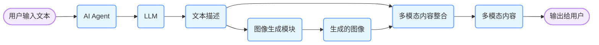

# 多模态内容生成 AI Agent：整合 LLM 与图像生成

> 关键词：多模态内容生成、AI Agent、大语言模型（LLM）、图像生成、整合

> 摘要：本文聚焦于多模态内容生成 AI Agent 整合 LLM 与图像生成这一前沿技术领域。首先介绍其背景，包括目的、预期读者等内容。接着深入探讨核心概念与联系，阐述整合的原理和架构。通过 Python 代码详细讲解核心算法原理与具体操作步骤，同时给出数学模型和公式并举例说明。结合项目实战，从开发环境搭建到源代码详细实现与解读进行分析。探讨实际应用场景，推荐相关工具和资源。最后总结未来发展趋势与挑战，提供常见问题解答和扩展阅读参考资料，旨在全面剖析这一技术，为相关领域的研究者和开发者提供有价值的参考。

## 1. 背景介绍 
### 1.1 目的和范围
在当今数字化信息爆炸的时代，用户对于多样化、丰富内容的需求日益增长。单一模态的信息呈现方式已经难以满足人们对于信息获取和交互的期望。多模态内容生成技术应运而生，它能够将不同类型的信息，如文本、图像、音频等进行融合，为用户提供更加全面、生动的信息体验。

本文的目的在于深入探讨如何将大语言模型（LLM）与图像生成技术整合到一个 AI Agent 中，实现多模态内容的高效生成。范围涵盖了从核心概念的介绍、算法原理的剖析、数学模型的建立，到实际项目的开发与应用场景的分析，旨在为读者提供一个全面、系统的关于多模态内容生成 AI Agent 整合 LLM 与图像生成的知识体系。

### 1.2 预期读者
本文预期读者包括但不限于以下几类人群：
- **人工智能研究者**：对多模态技术、AI Agent 等前沿领域感兴趣，希望深入了解相关技术原理和发展趋势的科研人员。
- **程序员和开发者**：想要将多模态内容生成技术应用到实际项目中，寻求技术实现方案和代码示例的专业人员。
- **软件架构师**：负责系统架构设计，需要考虑如何整合不同技术模块以构建高效、稳定的多模态内容生成系统的专业人士。
- **技术爱好者**：对人工智能、图像生成等领域充满好奇，希望了解相关技术的基本概念和应用场景的普通读者。

### 1.3 文档结构概述
本文按照以下结构进行组织：
1. **背景介绍**：阐述本文的目的、预期读者、文档结构概述以及相关术语的定义和解释。
2. **核心概念与联系**：介绍多模态内容生成、AI Agent、LLM 和图像生成等核心概念，以及它们之间的联系，并通过文本示意图和 Mermaid 流程图进行直观展示。
3. **核心算法原理 & 具体操作步骤**：使用 Python 代码详细讲解整合 LLM 与图像生成的核心算法原理和具体操作步骤。
4. **数学模型和公式 & 详细讲解 & 举例说明**：建立相关的数学模型，给出具体的公式，并通过实际例子进行详细说明。
5. **项目实战：代码实际案例和详细解释说明**：从开发环境的搭建开始，逐步介绍源代码的实现和解读，包括代码的功能、逻辑和优化。
6. **实际应用场景**：探讨多模态内容生成 AI Agent 整合 LLM 与图像生成在不同领域的实际应用场景。
7. **工具和资源推荐**：推荐学习资源、开发工具框架以及相关的论文著作，帮助读者进一步深入学习和研究。
8. **总结：未来发展趋势与挑战**：总结多模态内容生成技术的未来发展趋势，并分析可能面临的挑战。
9. **附录：常见问题与解答**：解答读者在学习和实践过程中可能遇到的常见问题。
10. **扩展阅读 & 参考资料**：提供相关的扩展阅读材料和参考资料，方便读者进一步探索。

### 1.4 术语表
#### 1.4.1 核心术语定义
- **多模态内容生成**：指利用多种模态的信息（如文本、图像、音频等）进行内容创作和生成的技术。
- **AI Agent**：一种能够感知环境、做出决策并采取行动的智能实体，它可以根据预设的目标和规则自主地完成任务。
- **大语言模型（LLM）**：基于深度学习技术训练的大规模语言模型，能够处理自然语言任务，如文本生成、问答系统等。
- **图像生成**：利用计算机算法生成图像的技术，常见的方法包括基于生成对抗网络（GAN）、变分自编码器（VAE）等。

#### 1.4.2 相关概念解释
- **模态**：指信息的表现形式，如文本、图像、音频、视频等。不同的模态具有不同的特征和处理方法。
- **整合**：将不同的技术、模块或系统进行有机结合，使其协同工作，实现共同的目标。在本文中，指将 LLM 和图像生成技术整合到一个 AI Agent 中。
- **生成对抗网络（GAN）**：一种深度学习模型，由生成器和判别器组成。生成器负责生成数据，判别器负责判断生成的数据是否真实。通过两者的对抗训练，生成器能够学习到数据的分布，从而生成高质量的图像。
- **变分自编码器（VAE）**：一种生成模型，通过将输入数据编码为潜在空间的向量，然后从潜在空间中采样并解码生成新的数据。VAE 可以学习到数据的分布特征，适用于图像生成等任务。

#### 1.4.3 缩略词列表
- **LLM**：Large Language Model（大语言模型）
- **GAN**：Generative Adversarial Network（生成对抗网络）
- **VAE**：Variational Autoencoder（变分自编码器）
- **API**：Application Programming Interface（应用程序编程接口）

## 2. 核心概念与联系 

### 核心概念原理
#### 多模态内容生成
多模态内容生成的核心思想是融合多种模态的信息，以生成更加丰富、生动的内容。例如，在一个故事讲述系统中，可以结合文本描述和相关的图像，为用户呈现一个更加直观的故事场景。多模态内容生成需要处理不同模态之间的语义关联和信息融合，以确保生成的内容在语义和视觉上都是一致的。

#### AI Agent
AI Agent 是一个具有自主性、反应性和社交性的智能实体。它可以感知环境中的信息，根据预设的目标和规则进行决策，并采取相应的行动。在多模态内容生成中，AI Agent 可以作为一个整体的控制中心，协调 LLM 和图像生成模块的工作，根据用户的输入和任务要求，生成合适的多模态内容。

#### 大语言模型（LLM）
LLM 是基于深度学习技术训练的大规模语言模型，通常使用Transformer架构。它通过在大规模的文本数据上进行无监督学习，学习到语言的模式和规律。LLM 可以处理各种自然语言任务，如文本生成、文本分类、问答系统等。在多模态内容生成中，LLM 可以用于生成文本描述、理解用户的文本输入等。

#### 图像生成
图像生成技术可以根据输入的信息生成相应的图像。常见的图像生成方法包括基于GAN和VAE的方法。GAN通过生成器和判别器的对抗训练，学习到图像的分布，从而生成高质量的图像。VAE则通过将输入图像编码为潜在空间的向量，然后从潜在空间中采样并解码生成新的图像。在多模态内容生成中，图像生成模块可以根据 LLM 生成的文本描述生成相应的图像。

### 架构的文本示意图
```plaintext
用户输入（文本）
|
v
AI Agent
|
+--- LLM（处理文本输入，生成文本描述）
|       |
|       v
|    文本描述
|       |
|       +--- 图像生成模块（根据文本描述生成图像）
|       |       |
|       |       v
|       |    生成的图像
|       |
|       +--- 多模态内容整合（将文本描述和生成的图像组合）
|               |
|               v
|            多模态内容（文本 + 图像）
|
v
输出给用户
```

### Mermaid 流程图


## 3. 核心算法原理 & 具体操作步骤 

### 核心算法原理
整合 LLM 与图像生成的核心算法主要包括以下几个步骤：
1. **文本处理**：使用 LLM 对用户输入的文本进行处理，生成相应的文本描述。LLM 可以根据用户的输入进行文本生成、推理、问答等操作，以获取与图像生成相关的信息。
2. **图像生成**：根据 LLM 生成的文本描述，使用图像生成模型生成相应的图像。图像生成模型可以是基于 GAN、VAE 等方法的模型，它们可以学习到图像的分布特征，根据文本描述生成符合要求的图像。
3. **多模态内容整合**：将 LLM 生成的文本描述和图像生成模型生成的图像进行整合，形成多模态内容。整合过程需要考虑文本和图像之间的语义关联和视觉一致性，以确保生成的多模态内容在语义和视觉上都是合理的。

### 具体操作步骤
以下是使用 Python 代码实现整合 LLM 与图像生成的具体操作步骤：

#### 步骤 1：安装必要的库
```python
# 安装 LLM 相关库，以 Hugging Face 的 Transformers 为例
!pip install transformers
# 安装图像生成相关库，以 DALL - E 2 API 为例
# 由于 DALL - E 2 是 OpenAI 的服务，需要安装 openai 库
!pip install openai
```

#### 步骤 2：设置 API 密钥
```python
import openai

# 设置 OpenAI API 密钥
openai.api_key = "your_openai_api_key"
```

#### 步骤 3：使用 LLM 生成文本描述
```python
from transformers import pipeline

# 加载文本生成模型，以 GPT - Neo 为例
generator = pipeline('text-generation', model='EleutherAI/gpt-neo-125M')

# 用户输入文本
user_input = "一只可爱的猫咪在花园里玩耍"

# 使用 LLM 生成文本描述
text_description = generator(user_input, max_length=50, num_return_sequences=1)[0]['generated_text']
print("生成的文本描述:", text_description)
```

#### 步骤 4：使用图像生成模型生成图像
```python
# 使用 DALL - E 2 API 生成图像
response = openai.Image.create(
    prompt=text_description,
    n=1,
    size="512x512"
)

image_url = response['data'][0]['url']
print("生成的图像 URL:", image_url)
```

#### 步骤 5：多模态内容整合（简单示例，仅打印文本和图像 URL）
```python
print("多模态内容：")
print("文本描述:", text_description)
print("图像 URL:", image_url)
```

### 代码解释
1. **安装必要的库**：使用 `pip` 安装 `transformers` 和 `openai` 库，分别用于 LLM 和图像生成。
2. **设置 API 密钥**：将 OpenAI 的 API 密钥设置为环境变量，以便使用 DALL - E 2 API。
3. **使用 LLM 生成文本描述**：使用 Hugging Face 的 `pipeline` 加载 GPT - Neo 模型，对用户输入的文本进行处理，生成相应的文本描述。
4. **使用图像生成模型生成图像**：使用 OpenAI 的 DALL - E 2 API，根据 LLM 生成的文本描述生成相应的图像，并获取图像的 URL。
5. **多模态内容整合**：简单地将文本描述和图像 URL 打印出来，作为多模态内容的示例。

## 4. 数学模型和公式 & 详细讲解 & 举例说明 

### 数学模型
#### LLM 的语言模型
LLM 通常基于自回归语言模型，其目标是预测给定上下文下的下一个词的概率分布。设输入的文本序列为 $x = [x_1, x_2, \cdots, x_n]$，则 LLM 的目标是最大化以下概率：
$$P(x) = \prod_{i = 1}^{n} P(x_i | x_1, x_2, \cdots, x_{i - 1})$$

其中，$P(x_i | x_1, x_2, \cdots, x_{i - 1})$ 表示在给定前 $i - 1$ 个词的条件下，第 $i$ 个词为 $x_i$ 的概率。

#### 图像生成模型（以 GAN 为例）
GAN 由生成器 $G$ 和判别器 $D$ 组成。生成器 $G$ 接收一个随机噪声向量 $z$ 作为输入，生成一个图像 $G(z)$。判别器 $D$ 接收一个图像 $x$ 作为输入，输出一个概率值 $D(x)$，表示该图像是真实图像的概率。

GAN 的训练目标是最小化以下对抗损失函数：
$$\min_G \max_D V(D, G) = \mathbb{E}_{x \sim p_{data}(x)}[\log D(x)] + \mathbb{E}_{z \sim p_z(z)}[\log(1 - D(G(z)))]$$

其中，$p_{data}(x)$ 表示真实图像的分布，$p_z(z)$ 表示随机噪声的分布。

### 详细讲解
#### LLM 的语言模型
LLM 通过在大规模的文本数据上进行训练，学习到语言的模式和规律。在生成文本时，LLM 根据当前的上下文，计算下一个词的概率分布，然后从中采样得到下一个词，重复这个过程直到生成一个完整的文本序列。

#### 图像生成模型（以 GAN 为例）
GAN 的训练过程是一个对抗的过程。生成器试图生成越来越逼真的图像，以欺骗判别器；判别器试图区分真实图像和生成的图像。通过不断的对抗训练，生成器能够学习到真实图像的分布，从而生成高质量的图像。

### 举例说明
#### LLM 的语言模型
假设输入的文本序列为 "今天天气"，LLM 会根据这个上下文，计算下一个词的概率分布。例如，下一个词可能是 "很好"、"不错"、"有点冷" 等，LLM 会根据概率分布选择一个词作为下一个词，然后继续生成后续的文本。

#### 图像生成模型（以 GAN 为例）
假设生成器接收一个随机噪声向量 $z$，生成一个图像 $G(z)$。判别器接收这个图像和真实图像，输出一个概率值。如果判别器认为生成的图像是真实图像的概率较低，生成器会调整自己的参数，生成更逼真的图像。经过多次训练，生成器能够生成与真实图像非常相似的图像。

## 5. 项目实战：代码实际案例和详细解释说明 

### 5.1  开发环境搭建
#### 硬件环境
- **CPU**：Intel Core i7 或更高性能的处理器，以确保能够处理复杂的计算任务。
- **GPU**：NVIDIA GPU（如 GeForce RTX 3060 或更高），用于加速深度学习模型的训练和推理。
- **内存**：至少 16GB 的 RAM，以确保系统能够流畅运行。
- **存储**：至少 500GB 的硬盘空间，用于存储数据集、模型和相关文件。

#### 软件环境
- **操作系统**：Ubuntu 20.04 或 Windows 10。
- **Python 环境**：Python 3.8 或更高版本。
- **深度学习框架**：PyTorch 或 TensorFlow。
- **开发工具**：Jupyter Notebook 或 PyCharm。

#### 安装依赖库
```bash
# 创建虚拟环境
python -m venv myenv
source myenv/bin/activate  # 对于 Windows 使用 myenv\Scripts\activate

# 安装必要的库
pip install transformers openai torch torchvision numpy matplotlib
```

### 5.2  源代码详细实现和代码解读
以下是一个完整的项目示例，实现了整合 LLM 与图像生成的功能：

```python
import openai
from transformers import pipeline
import matplotlib.pyplot as plt
import requests
from PIL import Image
from io import BytesIO

# 设置 OpenAI API 密钥
openai.api_key = "your_openai_api_key"

# 加载文本生成模型，以 GPT - Neo 为例
generator = pipeline('text-generation', model='EleutherAI/gpt-neo-125M')

def generate_text_description(user_input):
    """
    使用 LLM 生成文本描述
    :param user_input: 用户输入的文本
    :return: 生成的文本描述
    """
    text_description = generator(user_input, max_length=50, num_return_sequences=1)[0]['generated_text']
    return text_description

def generate_image(text_description):
    """
    使用 DALL - E 2 API 生成图像
    :param text_description: 文本描述
    :return: 图像的 URL
    """
    response = openai.Image.create(
        prompt=text_description,
        n=1,
        size="512x512"
    )
    image_url = response['data'][0]['url']
    return image_url

def display_image(image_url):
    """
    显示生成的图像
    :param image_url: 图像的 URL
    """
    response = requests.get(image_url)
    img = Image.open(BytesIO(response.content))
    plt.imshow(img)
    plt.axis('off')
    plt.show()

if __name__ == "__main__":
    # 用户输入文本
    user_input = "一只可爱的猫咪在花园里玩耍"
    
    # 生成文本描述
    text_description = generate_text_description(user_input)
    print("生成的文本描述:", text_description)
    
    # 生成图像
    image_url = generate_image(text_description)
    print("生成的图像 URL:", image_url)
    
    # 显示图像
    display_image(image_url)
```

### 5.3  代码解读与分析
#### 代码结构
- **导入必要的库**：导入 `openai`、`transformers`、`matplotlib`、`requests` 和 `PIL` 等库，用于 LLM、图像生成、图像显示等功能。
- **设置 API 密钥**：设置 OpenAI 的 API 密钥，以便使用 DALL - E 2 API。
- **加载文本生成模型**：使用 Hugging Face 的 `pipeline` 加载 GPT - Neo 模型，用于生成文本描述。
- **定义函数**：定义 `generate_text_description` 函数用于生成文本描述，`generate_image` 函数用于生成图像，`display_image` 函数用于显示图像。
- **主程序**：用户输入文本，调用 `generate_text_description` 函数生成文本描述，调用 `generate_image` 函数生成图像，最后调用 `display_image` 函数显示图像。

#### 代码优化
- **错误处理**：在调用 OpenAI API 时，可能会出现网络错误、API 密钥错误等异常情况。可以添加异常处理代码，提高程序的健壮性。
- **缓存机制**：对于相同的文本描述，可以使用缓存机制，避免重复调用图像生成 API，提高程序的效率。
- **模型选择**：可以根据具体需求选择不同的 LLM 和图像生成模型，以提高生成内容的质量。

## 6. 实际应用场景 
### 创意设计领域
在广告设计、动漫制作等创意设计领域，多模态内容生成 AI Agent 整合 LLM 与图像生成可以发挥重要作用。设计师可以输入简单的创意描述，如“一个充满科技感的未来城市海报”，AI Agent 利用 LLM 生成详细的文本描述，再结合图像生成技术生成相应的海报图像，为设计师提供灵感和创意参考，大大提高设计效率。

### 教育领域
在教育资源开发中，多模态内容生成可以丰富教学材料。教师可以输入课程主题，如“太阳系的行星”，AI Agent 生成相关的文本讲解和对应的行星图像，制作成图文并茂的教学课件。对于学生来说，多模态的学习材料更能吸引他们的注意力，提高学习效果。

### 娱乐领域
在游戏开发中，多模态内容生成可以用于生成游戏角色、场景等。游戏开发者可以输入角色的特点描述，如“一个勇敢的骑士，身着金色铠甲”，AI Agent 生成相应的角色图像，为游戏增添视觉效果。在影视制作中，也可以利用该技术生成虚拟场景和特效，降低制作成本。

### 电商领域
在电商平台上，多模态内容生成可以用于商品展示。商家可以输入商品的描述信息，如“一款时尚的女士连衣裙，颜色鲜艳，款式新颖”，AI Agent 生成商品的图片和详细的介绍文本，吸引消费者的关注，提高商品的销售量。

### 新闻媒体领域
在新闻报道中，多模态内容生成可以使新闻更加生动、直观。记者可以输入新闻事件的关键信息，AI Agent 生成相关的文本报道和配图，快速制作出图文并茂的新闻稿件，及时向公众传递信息。

## 7. 工具和资源推荐
### 7.1 学习资源推荐
#### 7.1.1 书籍推荐
- 《深度学习》（Deep Learning）：由 Ian Goodfellow、Yoshua Bengio 和 Aaron Courville 合著，是深度学习领域的经典教材，介绍了深度学习的基本原理和方法。
- 《Python 深度学习》（Deep Learning with Python）：由 Francois Chollet 编写，结合 Keras 框架，详细介绍了如何使用 Python 进行深度学习开发。
- 《自然语言处理入门》：介绍了自然语言处理的基本概念、算法和应用，适合初学者学习。

#### 7.1.2 在线课程
- Coursera 上的“深度学习专项课程”（Deep Learning Specialization）：由 Andrew Ng 教授授课，系统地介绍了深度学习的各个方面。
- edX 上的“自然语言处理”（Natural Language Processing）：提供了自然语言处理的理论和实践课程。
- 哔哩哔哩上的相关 AI 技术教程：有很多用户上传的关于深度学习、图像生成等技术的教程，内容丰富且易于理解。

#### 7.1.3 技术博客和网站
- Hugging Face 博客：提供了关于自然语言处理、深度学习模型等方面的最新研究和技术分享。
- OpenAI 官方博客：介绍了 OpenAI 的最新研究成果和技术进展，包括 GPT 系列模型和 DALL - E 等图像生成技术。
- Medium 上的 AI 相关博客：有很多专业人士分享的关于人工智能、多模态技术等方面的文章。

### 7.2 开发工具框架推荐
#### 7.2.1 IDE和编辑器
- PyCharm：是一款专业的 Python 集成开发环境，提供了丰富的代码编辑、调试和项目管理功能。
- Jupyter Notebook：是一个交互式的开发环境，适合进行数据分析、模型训练和代码演示。
- Visual Studio Code：是一款轻量级的代码编辑器，支持多种编程语言和插件，可用于快速开发和调试。

#### 7.2.2 调试和性能分析工具
- TensorBoard：是 TensorFlow 提供的可视化工具，可用于查看模型的训练过程、性能指标等。
- PyTorch Profiler：是 PyTorch 提供的性能分析工具，可用于分析模型的运行时间、内存使用等情况。
- VS Code 的调试器：可以方便地对 Python 代码进行调试，查看变量的值和程序的执行流程。

#### 7.2.3 相关框架和库
- Transformers：由 Hugging Face 开发的自然语言处理框架，提供了丰富的预训练模型和工具，方便进行文本生成、分类等任务。
- OpenAI API：提供了 DALL - E 2 等图像生成服务的接口，可用于快速实现图像生成功能。
- PyTorch 和 TensorFlow：是深度学习领域的两大主流框架，提供了丰富的深度学习模型和工具，可用于模型训练和推理。

### 7.3 相关论文著作推荐
#### 7.3.1 经典论文
- “Attention Is All You Need”：介绍了 Transformer 架构，是自然语言处理领域的经典论文。
- “Generative Adversarial Networks”：提出了生成对抗网络（GAN）的概念，为图像生成技术的发展奠定了基础。
- “Variational Auto - Encoders”：介绍了变分自编码器（VAE）的原理和应用，是图像生成领域的重要论文。

#### 7.3.2 最新研究成果
- 关注顶级学术会议，如 NeurIPS、ICML、ACL 等，这些会议上会发表关于多模态技术、AI Agent 等领域的最新研究成果。
- 关注知名学术期刊，如 Journal of Artificial Intelligence Research（JAIR）、Artificial Intelligence 等，获取最新的研究论文。

#### 7.3.3 应用案例分析
- 一些知名公司和研究机构会发布关于多模态内容生成技术的应用案例，如 OpenAI 关于 DALL - E 的应用案例、谷歌关于多模态模型的研究和应用等。可以通过他们的官方网站和技术博客获取相关信息。

## 8. 总结：未来发展趋势与挑战
### 未来发展趋势
#### 更高质量的多模态内容生成
随着深度学习技术的不断发展，LLM 和图像生成模型的性能将不断提高，能够生成更加高质量、逼真的多模态内容。例如，图像生成的细节更加丰富，文本描述更加准确、生动。

#### 跨模态融合的深度发展
未来的多模态内容生成技术将不仅仅是简单的文本和图像的组合，而是实现更深层次的跨模态融合。例如，能够理解文本和图像之间的语义关系，实现图像中的物体与文本描述的精准对应。

#### 个性化多模态内容生成
根据用户的偏好和历史数据，为用户生成个性化的多模态内容。例如，在电商推荐中，根据用户的浏览历史和购买记录，生成符合用户口味的商品图片和介绍文本。

#### 多模态内容生成在更多领域的应用
除了现有的创意设计、教育、娱乐等领域，多模态内容生成技术将在医疗、金融、交通等更多领域得到广泛应用。例如，在医疗领域，生成医学图像和相关的诊断报告。

### 挑战
#### 数据和计算资源的需求
训练高质量的 LLM 和图像生成模型需要大量的数据和计算资源。数据的收集、标注和管理是一个巨大的挑战，同时，训练模型所需的计算资源也非常昂贵。

#### 语义理解和跨模态对齐
实现准确的语义理解和跨模态对齐是多模态内容生成的关键。不同模态之间的语义关系复杂，如何准确地理解和对齐这些关系是一个亟待解决的问题。

#### 伦理和法律问题
多模态内容生成技术可能会带来一些伦理和法律问题，如虚假信息的传播、图像和文本的版权问题等。如何制定相应的法律法规和道德准则，规范技术的使用是一个重要的挑战。

#### 模型的可解释性
深度学习模型通常是黑盒模型，缺乏可解释性。在多模态内容生成中，如何解释模型的决策过程和生成结果，让用户信任模型的输出是一个需要解决的问题。

## 9. 附录：常见问题与解答
### 问题 1：如何选择合适的 LLM 和图像生成模型？
解答：选择合适的 LLM 和图像生成模型需要考虑多个因素，如任务需求、计算资源、模型性能等。对于文本生成任务，可以根据任务的复杂度和数据集的大小选择不同规模的 LLM，如 GPT - Neo、BERT 等。对于图像生成任务，可以根据生成图像的质量和风格选择不同的模型，如 DALL - E 2、Stable Diffusion 等。

### 问题 2：使用 OpenAI API 有哪些限制？
解答：使用 OpenAI API 有一些限制，如 API 调用频率限制、每月使用额度限制等。具体的限制可以参考 OpenAI 官方文档。此外，使用 OpenAI API 需要遵守其使用条款和隐私政策。

### 问题 3：如何提高多模态内容生成的质量？
解答：提高多模态内容生成的质量可以从以下几个方面入手：
- **选择高质量的模型**：使用性能更好的 LLM 和图像生成模型。
- **优化数据集**：使用更多、更优质的训练数据，提高模型的泛化能力。
- **调整模型参数**：通过实验和调优，找到最优的模型参数。
- **多模态融合技术**：采用更先进的多模态融合技术，提高文本和图像之间的语义关联。

### 问题 4：如何处理多模态内容生成中的错误和异常？
解答：可以使用异常处理机制来处理多模态内容生成中的错误和异常。例如，在调用 API 时，捕获网络错误、API 密钥错误等异常，并进行相应的处理，如重试、提示用户检查输入等。同时，可以记录错误日志，方便后续的调试和分析。

## 10. 扩展阅读 & 参考资料
### 扩展阅读
- 《人工智能：现代方法》（Artificial Intelligence: A Modern Approach）：全面介绍了人工智能的各个领域，包括搜索算法、知识表示、机器学习等。
- 《计算机视觉：算法与应用》（Computer Vision: Algorithms and Applications）：介绍了计算机视觉的基本算法和应用，包括图像分类、目标检测、图像生成等。
- 《自然语言处理实战》（Natural Language Processing in Action）：结合实际案例，介绍了自然语言处理的各种技术和应用。

### 参考资料
- Hugging Face 官方文档：https://huggingface.co/docs
- OpenAI 官方文档：https://platform.openai.com/docs
- PyTorch 官方文档：https://pytorch.org/docs/stable/index.html
- TensorFlow 官方文档：https://www.tensorflow.org/api_docs

作者：AI天才研究院/AI Genius Institute & 禅与计算机程序设计艺术 /Zen And The Art of Computer Programming