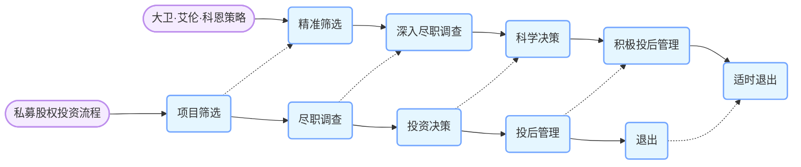

# 大卫·艾伦·科恩的私募股权投资策略

> 关键词：大卫·艾伦·科恩、私募股权投资、投资策略、风险评估、价值创造

> 摘要：本文深入探讨了大卫·艾伦·科恩的私募股权投资策略。首先介绍了私募股权投资领域的背景，明确文章的目的、范围、预期读者和文档结构。接着阐述了私募股权投资的核心概念及与大卫·艾伦·科恩策略的联系，通过文本示意图和 Mermaid 流程图进行清晰展示。详细分析了其核心算法原理和具体操作步骤，并结合 Python 源代码进行说明。同时给出相关数学模型和公式，辅以举例解释。通过项目实战案例，包括开发环境搭建、源代码实现与解读，进一步剖析该策略在实际中的应用。还探讨了其实际应用场景，推荐了相关的学习资源、开发工具框架以及论文著作。最后总结了未来发展趋势与挑战，解答常见问题并提供扩展阅读和参考资料，旨在为读者全面深入地理解大卫·艾伦·科恩的私募股权投资策略提供有价值的信息。

## 1. 背景介绍 
### 1.1 目的和范围
本文章的目的在于全面且深入地剖析大卫·艾伦·科恩的私募股权投资策略。通过研究其独特的投资理念、方法和决策流程，为投资者、金融从业者以及对私募股权投资感兴趣的人士提供有价值的参考和启示。范围涵盖了对其投资策略核心概念的阐述、算法原理的讲解、数学模型的分析、实际项目案例的探讨，以及在不同应用场景下的效果评估等多个方面。

### 1.2 预期读者
预期读者主要包括以下几类人群：
- 专业投资者：希望从大卫·艾伦·科恩的策略中获取新的投资思路和方法，优化自身的投资组合。
- 金融从业者：如私募股权基金经理、投资银行家等，可借鉴其策略提升业务水平和决策能力。
- 金融专业学生：有助于他们深入理解私募股权投资的实际运作和策略制定，为未来的职业发展打下基础。
- 对金融投资感兴趣的普通大众：能够了解私募股权投资领域的基本知识和策略，增加对金融市场的认识。

### 1.3 文档结构概述
本文将按照以下结构展开：
- 核心概念与联系：介绍私募股权投资的基本概念以及大卫·艾伦·科恩策略与这些概念的关联。
- 核心算法原理 & 具体操作步骤：详细讲解其投资决策所依据的算法原理，并给出具体的操作流程。
- 数学模型和公式 & 详细讲解 & 举例说明：运用数学模型和公式对投资策略进行量化分析，并通过实际例子加深理解。
- 项目实战：通过实际案例展示该策略在项目中的应用，包括开发环境搭建、源代码实现和代码解读。
- 实际应用场景：探讨该策略在不同行业和市场环境下的应用情况。
- 工具和资源推荐：推荐相关的学习资源、开发工具框架和论文著作。
- 总结：未来发展趋势与挑战：总结该策略的特点，分析其未来的发展趋势和可能面临的挑战。
- 附录：常见问题与解答：解答读者在阅读过程中可能遇到的常见问题。
- 扩展阅读 & 参考资料：提供进一步深入学习的扩展阅读材料和参考资料。

### 1.4 术语表
#### 1.4.1 核心术语定义
- 私募股权投资（Private Equity Investment）：指通过私募形式对非上市企业进行的权益性投资，在交易实施过程中附带考虑了将来的退出机制，即通过上市、并购或管理层回购等方式，出售持股获利。
- 风险评估（Risk Assessment）：对投资项目可能面临的各种风险进行识别、分析和评价的过程，以确定风险的大小和可能性。
- 价值创造（Value Creation）：通过对被投资企业进行管理优化、战略调整等手段，提升企业的内在价值，从而实现投资收益的增长。
- 投资组合（Investment Portfolio）：由多种不同的投资项目组成的集合，旨在分散风险、实现收益最大化。

#### 1.4.2 相关概念解释
- 尽职调查（Due Diligence）：在投资决策前，对目标企业的财务状况、经营情况、法律合规等方面进行全面深入的调查，以评估投资的可行性和风险。
- 退出机制（Exit Strategy）：投资者在投资达到一定阶段后，将所持有的股权变现的方式和途径，常见的退出方式包括上市、股权转让、清算等。
- 杠杆收购（Leveraged Buyout）：一种利用高负债融资收购目标企业的方式，通过债务融资获取资金，以实现对目标企业的控制。

#### 1.4.3 缩略词列表
- PE：私募股权投资（Private Equity）
- LBO：杠杆收购（Leveraged Buyout）
- DCF：现金流折现法（Discounted Cash Flow）

## 2. 核心概念与联系 

### 私募股权投资核心概念
私募股权投资是一种长期的、非公开的权益性投资方式。其核心在于寻找具有高成长潜力的非上市企业，通过注入资金和资源，帮助企业实现价值提升，最终通过合适的退出机制获得高额回报。主要包括以下几个关键环节：
- 项目筛选：从众多潜在项目中挑选出符合投资标准的目标企业。
- 尽职调查：对目标企业进行全面的调查和分析，评估其投资价值和风险。
- 投资决策：根据尽职调查结果，决定是否进行投资以及投资的金额和方式。
- 投后管理：在投资后，为被投资企业提供战略指导、资源整合等支持，促进企业的发展。
- 退出：在合适的时机，通过上市、股权转让等方式退出投资，实现收益。

### 大卫·艾伦·科恩策略与核心概念的联系
大卫·艾伦·科恩的私募股权投资策略紧密围绕上述核心概念展开。他注重项目筛选的精准性，通过独特的分析方法和经验，挑选出具有潜在价值的企业。在尽职调查方面，他强调对企业的深入了解，不仅关注财务数据，还注重企业的商业模式、团队素质等因素。在投资决策时，他综合考虑风险和收益，运用科学的算法和模型进行评估。投后管理是他策略的重要组成部分，他通过积极参与企业的运营管理，为企业创造价值。最后，他会根据市场情况和企业发展阶段，选择最佳的退出时机和方式，实现投资回报的最大化。

### 文本示意图
```plaintext
私募股权投资
|-- 项目筛选
|   |-- 行业分析
|   |-- 企业评估
|-- 尽职调查
|   |-- 财务调查
|   |-- 法律调查
|   |-- 业务调查
|-- 投资决策
|   |-- 风险评估
|   |-- 收益预测
|-- 投后管理
|   |-- 战略指导
|   |-- 资源整合
|-- 退出
|   |-- 上市
|   |-- 股权转让
|   |-- 清算

大卫·艾伦·科恩策略
|-- 精准筛选
|-- 深入尽职调查
|-- 科学决策
|-- 积极投后管理
|-- 适时退出
```

### Mermaid 流程图


## 3. 核心算法原理 & 具体操作步骤 

### 核心算法原理
大卫·艾伦·科恩的投资决策算法主要基于风险评估和收益预测。他通过建立多维度的评估模型，综合考虑企业的财务状况、市场竞争力、行业前景等因素，计算出投资项目的预期风险和收益。具体来说，他采用了以下几种主要的算法：
- 现金流折现法（DCF）：通过预测企业未来的现金流，并将其折现到当前，以评估企业的内在价值。公式为：$$V = \sum_{t=1}^{n} \frac{CF_t}{(1 + r)^t}$$ 其中，$V$ 表示企业的内在价值，$CF_t$ 表示第 $t$ 期的现金流，$r$ 表示折现率，$n$ 表示预测期数。
- 风险调整收益法（RAROC）：将投资项目的预期收益与风险进行匹配，计算出经风险调整后的收益。公式为：$$RAROC = \frac{预期收益}{经济资本}$$ 其中，经济资本是指为了应对投资项目可能面临的风险而需要预留的资本。
- 多因素模型：考虑多个影响投资项目的因素，如市场风险、行业风险、企业特定风险等，通过建立线性回归模型来评估投资项目的价值。公式为：$$R_i = \alpha + \beta_1F_1 + \beta_2F_2 + \cdots + \beta_nF_n + \epsilon_i$$ 其中，$R_i$ 表示投资项目 $i$ 的预期收益率，$\alpha$ 表示截距项，$\beta_j$ 表示第 $j$ 个因素的系数，$F_j$ 表示第 $j$ 个因素，$\epsilon_i$ 表示误差项。

### 具体操作步骤
#### 数据收集
收集目标企业的相关数据，包括财务报表、市场调研报告、行业分析报告等。同时，收集宏观经济数据、市场指数等外部数据，用于评估市场环境和行业趋势。

#### 数据预处理
对收集到的数据进行清洗、整理和标准化处理，去除异常值和缺失值，确保数据的质量和一致性。

#### 模型构建
根据收集到的数据和投资目标，选择合适的算法构建评估模型。例如，使用现金流折现法预测企业的内在价值，使用风险调整收益法评估投资项目的风险和收益。

#### 参数估计
使用历史数据或市场数据对模型的参数进行估计。例如，使用最小二乘法估计多因素模型中的系数。

#### 模型评估
使用交叉验证等方法对构建的模型进行评估，检验模型的准确性和稳定性。如果模型的性能不理想，则对模型进行调整和优化。

#### 投资决策
根据模型的评估结果，计算投资项目的预期风险和收益，制定投资决策。如果预期收益大于风险，则考虑进行投资；否则，放弃该项目。

### Python 源代码实现
```python
import numpy as np
import pandas as pd
from sklearn.linear_model import LinearRegression

# 数据收集和预处理
def data_preprocessing(file_path):
    data = pd.read_csv(file_path)
    # 去除缺失值
    data = data.dropna()
    # 标准化处理
    for col in data.columns:
        if col!= 'target':
            data[col] = (data[col] - data[col].mean()) / data[col].std()
    return data

# 模型构建和参数估计
def model_building(data):
    X = data.drop('target', axis=1)
    y = data['target']
    model = LinearRegression()
    model.fit(X, y)
    return model

# 模型评估
def model_evaluation(model, X_test, y_test):
    score = model.score(X_test, y_test)
    return score

# 投资决策
def investment_decision(model, X_new):
    prediction = model.predict(X_new)
    if prediction > 0:
        return 'Invest'
    else:
        return 'Not Invest'

# 主函数
def main():
    file_path = 'investment_data.csv'
    data = data_preprocessing(file_path)
    # 划分训练集和测试集
    train_size = int(len(data) * 0.8)
    train_data = data[:train_size]
    test_data = data[train_size:]
    X_train = train_data.drop('target', axis=1)
    y_train = train_data['target']
    X_test = test_data.drop('target', axis=1)
    y_test = test_data['target']
    # 模型构建和参数估计
    model = model_building(train_data)
    # 模型评估
    score = model_evaluation(model, X_test, y_test)
    print(f"Model score: {score}")
    # 新数据投资决策
    X_new = np.array([[1, 2, 3, 4, 5]])
    decision = investment_decision(model, X_new)
    print(f"Investment decision: {decision}")

if __name__ == "__main__":
    main()
```

## 4. 数学模型和公式 & 详细讲解 & 举例说明 

### 现金流折现法（DCF）
#### 公式
$$V = \sum_{t=1}^{n} \frac{CF_t}{(1 + r)^t}$$
其中，$V$ 表示企业的内在价值，$CF_t$ 表示第 $t$ 期的现金流，$r$ 表示折现率，$n$ 表示预测期数。

#### 详细讲解
现金流折现法的核心思想是将企业未来的现金流折现到当前，以反映其真实的价值。预测期数 $n$ 通常根据企业的发展阶段和行业特点来确定。折现率 $r$ 是一个重要的参数，它反映了投资者对投资项目的风险要求。一般来说，折现率越高，说明投资者对风险的要求越高，企业的内在价值就越低。

#### 举例说明
假设一家企业未来 3 年的现金流分别为 100 万元、120 万元和 150 万元，折现率为 10%。则该企业的内在价值为：
$$V = \frac{100}{(1 + 0.1)^1} + \frac{120}{(1 + 0.1)^2} + \frac{150}{(1 + 0.1)^3}$$
$$V = \frac{100}{1.1} + \frac{120}{1.21} + \frac{150}{1.331}$$
$$V \approx 90.91 + 99.17 + 112.69$$
$$V \approx 302.77 \text{（万元）}$$

### 风险调整收益法（RAROC）
#### 公式
$$RAROC = \frac{预期收益}{经济资本}$$
其中，经济资本是指为了应对投资项目可能面临的风险而需要预留的资本。

#### 详细讲解
风险调整收益法的目的是将投资项目的预期收益与风险进行匹配，以评估投资项目的真实盈利能力。经济资本的计算通常基于风险度量模型，如 VaR（Value at Risk）模型。通过计算 RAROC，可以比较不同投资项目的风险调整后收益，从而做出更合理的投资决策。

#### 举例说明
假设一个投资项目的预期收益为 200 万元，经济资本为 1000 万元。则该项目的 RAROC 为：
$$RAROC = \frac{200}{1000} = 0.2$$
如果另一个投资项目的预期收益为 150 万元，经济资本为 800 万元。则该项目的 RAROC 为：
$$RAROC = \frac{150}{800} = 0.1875$$
比较两个项目的 RAROC，可以发现第一个项目的风险调整后收益更高，因此更具投资价值。

### 多因素模型
#### 公式
$$R_i = \alpha + \beta_1F_1 + \beta_2F_2 + \cdots + \beta_nF_n + \epsilon_i$$
其中，$R_i$ 表示投资项目 $i$ 的预期收益率，$\alpha$ 表示截距项，$\beta_j$ 表示第 $j$ 个因素的系数，$F_j$ 表示第 $j$ 个因素，$\epsilon_i$ 表示误差项。

#### 详细讲解
多因素模型考虑了多个影响投资项目收益率的因素，通过建立线性回归模型来评估投资项目的价值。因素 $F_j$ 可以是市场风险、行业风险、企业特定风险等。系数 $\beta_j$ 表示每个因素对投资项目收益率的影响程度。截距项 $\alpha$ 表示投资项目的超额收益率。误差项 $\epsilon_i$ 表示模型无法解释的随机因素。

#### 举例说明
假设一个投资项目的预期收益率与市场收益率和行业收益率有关。市场收益率 $F_1$ 的系数 $\beta_1$ 为 1.2，行业收益率 $F_2$ 的系数 $\beta_2$ 为 0.8，截距项 $\alpha$ 为 2%。如果市场收益率为 10%，行业收益率为 8%，则该投资项目的预期收益率为：
$$R_i = 0.02 + 1.2 \times 0.1 + 0.8 \times 0.08$$
$$R_i = 0.02 + 0.12 + 0.064$$
$$R_i = 0.204 = 20.4\%$$

## 5. 项目实战：代码实际案例和详细解释说明 

### 5.1  开发环境搭建
#### 安装 Python
首先，需要安装 Python 环境。可以从 Python 官方网站（https://www.python.org/downloads/）下载适合自己操作系统的 Python 版本，并按照安装向导进行安装。

#### 安装必要的库
在安装好 Python 后，需要安装一些必要的库，如 NumPy、Pandas、Scikit-learn 等。可以使用以下命令进行安装：
```sh
pip install numpy pandas scikit-learn
```

#### 准备数据
准备一个包含投资项目相关数据的 CSV 文件，文件中应包含特征变量和目标变量。例如，文件名为 `investment_data.csv`，包含以下列：`feature1`, `feature2`, `feature3`, `target`。

### 5.2  源代码详细实现和代码解读
```python
import numpy as np
import pandas as pd
from sklearn.linear_model import LinearRegression

# 数据收集和预处理
def data_preprocessing(file_path):
    data = pd.read_csv(file_path)
    # 去除缺失值
    data = data.dropna()
    # 标准化处理
    for col in data.columns:
        if col!= 'target':
            data[col] = (data[col] - data[col].mean()) / data[col].std()
    return data

# 模型构建和参数估计
def model_building(data):
    X = data.drop('target', axis=1)
    y = data['target']
    model = LinearRegression()
    model.fit(X, y)
    return model

# 模型评估
def model_evaluation(model, X_test, y_test):
    score = model.score(X_test, y_test)
    return score

# 投资决策
def investment_decision(model, X_new):
    prediction = model.predict(X_new)
    if prediction > 0:
        return 'Invest'
    else:
        return 'Not Invest'

# 主函数
def main():
    file_path = 'investment_data.csv'
    data = data_preprocessing(file_path)
    # 划分训练集和测试集
    train_size = int(len(data) * 0.8)
    train_data = data[:train_size]
    test_data = data[train_size:]
    X_train = train_data.drop('target', axis=1)
    y_train = train_data['target']
    X_test = test_data.drop('target', axis=1)
    y_test = test_data['target']
    # 模型构建和参数估计
    model = model_building(train_data)
    # 模型评估
    score = model_evaluation(model, X_test, y_test)
    print(f"Model score: {score}")
    # 新数据投资决策
    X_new = np.array([[1, 2, 3, 4, 5]])
    decision = investment_decision(model, X_new)
    print(f"Investment decision: {decision}")

if __name__ == "__main__":
    main()
```

#### 代码解读
- `data_preprocessing` 函数：该函数用于读取 CSV 文件，并对数据进行预处理。首先使用 `pandas` 库的 `read_csv` 函数读取文件，然后使用 `dropna` 函数去除缺失值，最后对特征变量进行标准化处理，以确保数据的一致性。
- `model_building` 函数：该函数用于构建线性回归模型，并使用训练数据进行参数估计。首先将特征变量和目标变量分离，然后使用 `sklearn` 库的 `LinearRegression` 类创建模型，并使用 `fit` 方法进行训练。
- `model_evaluation` 函数：该函数用于评估模型的性能。使用测试数据计算模型的得分，得分越高表示模型的性能越好。
- `investment_decision` 函数：该函数用于根据模型的预测结果做出投资决策。如果预测值大于 0，则建议投资；否则，建议不投资。
- `main` 函数：该函数是程序的入口点。首先调用 `data_preprocessing` 函数进行数据预处理，然后划分训练集和测试集。接着调用 `model_building` 函数构建模型，并使用训练数据进行训练。再调用 `model_evaluation` 函数评估模型的性能。最后，使用新数据调用 `investment_decision` 函数做出投资决策。

### 5.3  代码解读与分析
#### 优点
- 代码结构清晰：将数据预处理、模型构建、模型评估和投资决策等功能分别封装成函数，提高了代码的可读性和可维护性。
- 数据处理合理：对数据进行了缺失值处理和标准化处理，有助于提高模型的性能。
- 模型选择合适：使用线性回归模型进行投资决策，简单易懂，适用于初步的投资分析。

#### 缺点
- 模型复杂度较低：线性回归模型只能处理线性关系，对于复杂的非线性关系可能无法很好地拟合。
- 数据依赖性强：模型的性能很大程度上依赖于数据的质量和数量，如果数据存在偏差或不足，可能会影响模型的准确性。
- 缺乏鲁棒性：模型对异常值比较敏感，可能会受到异常值的影响而导致预测结果不准确。

#### 改进建议
- 尝试使用更复杂的模型：如决策树、随机森林、神经网络等，以提高模型的拟合能力和预测准确性。
- 进行特征工程：除了标准化处理外，还可以进行特征选择、特征提取等操作，以提高数据的质量和模型的性能。
- 增加数据量：收集更多的数据进行训练，以提高模型的泛化能力和鲁棒性。

## 6. 实际应用场景 
### 新兴行业投资
在新兴行业，如人工智能、生物医药、新能源等领域，大卫·艾伦·科恩的私募股权投资策略具有重要的应用价值。这些行业具有高成长潜力，但同时也伴随着高风险。他的策略可以帮助投资者精准筛选出具有核心竞争力和创新能力的企业，通过深入的尽职调查评估企业的技术实力和市场前景，运用科学的算法和模型进行投资决策，降低投资风险。在投后管理方面，他可以利用自身的资源和经验，为企业提供战略指导和资源整合，帮助企业快速成长。例如，在人工智能领域，他可能会投资那些拥有先进算法和技术团队的初创企业，通过投后管理推动企业的技术研发和市场推广，最终实现企业的上市或被并购，获得高额回报。

### 传统行业转型升级
传统行业在面临转型升级的过程中，也需要大量的资金和资源支持。大卫·艾伦·科恩的策略可以帮助投资者发现传统行业中具有转型潜力的企业，通过投资和投后管理，推动企业进行技术创新、管理优化和商业模式升级。例如，在制造业领域，他可能会投资那些积极推进智能制造和工业互联网的企业，帮助企业引入先进的生产设备和管理系统，提高生产效率和产品质量，增强企业的市场竞争力。同时，他也可以通过资源整合，帮助企业拓展市场渠道，实现产业协同发展。

### 企业并购重组
在企业并购重组的过程中，大卫·艾伦·科恩的策略可以发挥重要的作用。他可以通过精准的项目筛选，找到合适的并购目标，进行深入的尽职调查，评估目标企业的价值和风险。在投资决策阶段，他可以运用科学的算法和模型，计算并购的成本和收益，制定合理的并购方案。在投后管理方面，他可以帮助并购双方进行业务整合和文化融合，实现协同效应，提高企业的整体价值。例如，在两个同行业企业的并购中，他可以通过资源整合和业务优化，降低企业的运营成本，提高市场份额，实现 1 + 1 > 2 的效果。

### 困境企业救助
对于一些陷入困境的企业，大卫·艾伦·科恩的策略也可以提供有效的解决方案。他可以通过深入的尽职调查，了解企业陷入困境的原因，制定针对性的救助方案。在投资决策时，他会综合考虑企业的资产质量、市场前景和救助成本等因素，决定是否进行投资。在投后管理方面，他会帮助企业进行债务重组、业务调整和管理优化，恢复企业的盈利能力。例如，对于一家因资金链断裂而陷入困境的企业，他可以注入资金，帮助企业解决短期资金问题，同时推动企业进行业务转型，开拓新的市场领域，实现企业的重生。

## 7. 工具和资源推荐
### 7.1 学习资源推荐
#### 7.1.1 书籍推荐
- 《私募股权投资基金：案例、实务与操作指引》：本书详细介绍了私募股权投资基金的运作流程、投资策略、风险管理等方面的知识，并通过大量的实际案例进行分析，具有很强的实用性和指导性。
- 《价值投资：从格雷厄姆到巴菲特》：深入阐述了价值投资的理念和方法，介绍了巴菲特等投资大师的投资策略和实践经验，对于理解私募股权投资的价值评估和投资决策具有重要的参考价值。
- 《财务报表分析与证券定价》：帮助读者掌握财务报表分析的方法和技巧，通过对企业财务报表的深入分析，评估企业的财务状况和经营业绩，为私募股权投资提供重要的依据。

#### 7.1.2 在线课程
- Coursera 上的“私募股权投资基础”课程：由知名大学的教授授课，系统地介绍了私募股权投资的基本概念、投资流程、估值方法等内容，课程内容丰富，讲解详细。
- edX 上的“金融建模与投资分析”课程：重点介绍了金融建模的方法和技巧，以及如何运用模型进行投资分析和决策，对于提高私募股权投资的量化分析能力具有很大的帮助。
- 中国大学 MOOC 上的“投资学”课程：涵盖了投资学的基本理论和方法，包括资产定价、投资组合管理、风险管理等方面的内容，为私募股权投资提供了坚实的理论基础。

#### 7.1.3 技术博客和网站
- 私募通：提供私募股权投资领域的最新资讯、行业报告、数据分析等内容，是了解私募股权投资行业动态的重要平台。
- 投中网：专注于创业投资和私募股权投资领域，发布行业深度报道、投资案例分析、专家观点等内容，对于学习私募股权投资的实践经验具有很大的帮助。
- Seeking Alpha：一个全球性的金融投资网站，提供股票、债券、基金等多种投资产品的分析和评论，也有很多关于私募股权投资的文章和观点，有助于拓宽投资视野。

### 7.2 开发工具框架推荐
#### 7.2.1 IDE和编辑器
- PyCharm：一款专业的 Python 集成开发环境，具有强大的代码编辑、调试、自动补全、代码分析等功能，适合用于开发私募股权投资相关的 Python 代码。
- Jupyter Notebook：一个基于网页的交互式开发环境，支持多种编程语言，如 Python、R 等。可以方便地进行数据处理、模型构建、可视化展示等操作，非常适合进行数据分析和投资模型的开发。
- Visual Studio Code：一款轻量级的代码编辑器，具有丰富的插件和扩展功能，支持多种编程语言。可以通过安装相关插件，实现 Python 代码的开发、调试和版本控制等功能。

#### 7.2.2 调试和性能分析工具
- Py-Spy：一个用于 Python 代码性能分析的工具，可以实时监测 Python 程序的 CPU 使用情况、函数调用时间等信息，帮助开发者找出代码中的性能瓶颈。
- cProfile：Python 内置的性能分析模块，可以统计函数的调用次数、执行时间等信息，生成性能分析报告，方便开发者进行代码优化。
- PDB：Python 内置的调试器，可以在代码中设置断点，逐行执行代码，查看变量的值和程序的执行流程，帮助开发者快速定位和解决代码中的问题。

#### 7.2.3 相关框架和库
- NumPy：一个用于科学计算的 Python 库，提供了高效的多维数组对象和各种数学函数，是进行数据处理和数值计算的基础库。
- Pandas：一个用于数据处理和分析的 Python 库，提供了灵活的数据结构和数据操作方法，如数据读取、清洗、转换、统计分析等，是进行投资数据分析的重要工具。
- Scikit-learn：一个用于机器学习的 Python 库，提供了各种机器学习算法和工具，如分类、回归、聚类、降维等，可用于构建投资决策模型和进行风险评估。

### 7.3 相关论文著作推荐
#### 7.3.1 经典论文
- Jensen, M. C., & Meckling, W. H. (1976). Theory of the firm: managerial behavior, agency costs and ownership structure. Journal of Financial Economics, 3(4), 305-360. 该论文提出了代理理论，探讨了企业所有权结构和管理层行为对企业价值的影响，对于理解私募股权投资中的委托代理问题具有重要的意义。
- Fama, E. F., & French, K. R. (1992). The cross-section of expected stock returns. The Journal of Finance, 47(2), 427-465. 这篇论文提出了 Fama-French 三因素模型，解释了股票预期收益率的横截面差异，为投资组合管理和资产定价提供了重要的理论基础。
- Black, F., & Scholes, M. (1973). The pricing of options and corporate liabilities. Journal of Political Economy, 81(3), 637-654. 该论文提出了 Black-Scholes 期权定价模型，为金融衍生品的定价和风险管理提供了重要的工具，在私募股权投资的估值和风险评估中也有广泛的应用。

#### 7.3.2 最新研究成果
- Kaplan, S. N., & Stromberg, P. (2009). Leveraged buyouts and private equity. Journal of Economic Perspectives, 23(1), 121-146. 该论文对杠杆收购和私募股权投资的现状、发展趋势和经济影响进行了深入的研究，为理解私募股权投资的行业动态和发展趋势提供了重要的参考。
- Axelson, U., Jenkinson, T., Strömberg, P., & Weisbach, M. S. (2013). Borrow cheap, buy high? The determinants of leverage in buyouts. The Journal of Finance, 68(6), 2223-2267. 这篇论文研究了杠杆收购中杠杆率的决定因素，分析了债务融资对私募股权投资绩效的影响，对于优化私募股权投资的融资策略具有重要的启示。
- Ewens, M., & Rhodes-Kropf, M. (2020). Innovation and private equity. Journal of Financial Economics, 136(2), 323-342. 该论文探讨了私募股权投资对企业创新的影响，通过实证研究发现私募股权投资可以促进企业的创新活动，提高企业的创新能力和竞争力。

#### 7.3.3 应用案例分析
- Gompers, P. A., & Lerner, J. (2001). The venture capital cycle. MIT press. 本书通过大量的案例分析，介绍了风险投资的运作流程、投资策略和退出机制，对于理解私募股权投资中的风险投资领域具有重要的参考价值。
- Phalippou, L. (2020). Private equity demystified: understanding how money is made in alternative investments. Cambridge University Press. 该书对私募股权投资的各个方面进行了深入的剖析，通过实际案例分析了私募股权投资的盈利模式、风险管理和投资决策等问题，为投资者和从业者提供了实用的指导。
- Metrick, A., & Yasuda, A. (2010). The economics of private equity funds. Review of Financial Studies, 23(6), 2303-2341. 该论文通过对私募股权基金的经济分析，结合实际案例探讨了私募股权基金的组织结构、收费模式、投资绩效等问题，对于理解私募股权基金的运作机制和投资回报具有重要的意义。

## 8. 总结：未来发展趋势与挑战
### 未来发展趋势
#### 数字化转型加速
随着科技的不断发展，私募股权投资行业将加速数字化转型。大数据、人工智能、区块链等技术将被广泛应用于项目筛选、尽职调查、投资决策、投后管理等各个环节。通过数据分析和挖掘，可以更精准地评估投资项目的风险和收益，提高投资决策的效率和准确性。例如，利用人工智能算法对企业的财务数据、市场数据、社交媒体数据等进行分析，挖掘潜在的投资机会；利用区块链技术实现投资项目的信息共享和透明化，降低交易成本和风险。

#### 绿色投资兴起
在全球气候变化和可持续发展的背景下，绿色投资将成为私募股权投资的重要发展方向。投资者将更加关注企业的环境、社会和治理（ESG）表现，倾向于投资那些具有环保意识、社会责任和良好治理结构的企业。绿色投资领域包括可再生能源、节能环保、清洁技术等，这些领域具有广阔的发展前景和投资价值。例如，投资太阳能、风能等可再生能源项目，不仅可以获得经济回报，还可以为环境保护做出贡献。

#### 跨境投资增加
随着经济全球化的深入发展，私募股权投资的跨境投资将不断增加。投资者将更加关注全球市场的投资机会，通过跨境投资实现资产的多元化配置和风险分散。同时，新兴市场国家的经济快速发展和投资环境的不断改善，也吸引了越来越多的国际私募股权投资机构的关注。例如，中国、印度等新兴市场国家的科技、消费、医疗等领域具有巨大的发展潜力，成为国际私募股权投资机构的热门投资目的地。

#### 行业整合加剧
私募股权投资行业将面临更加激烈的竞争，行业整合将加剧。大型私募股权投资机构将通过并购、重组等方式扩大规模，提高市场竞争力。同时，一些小型私募股权投资机构可能会面临生存压力，被迫退出市场或与大型机构合并。行业整合将有助于提高行业的集中度和专业化水平，促进私募股权投资行业的健康发展。

### 挑战
#### 市场不确定性增加
全球经济形势的不确定性、贸易摩擦、地缘政治风险等因素将给私募股权投资带来更大的挑战。市场波动加剧，投资项目的风险和收益难以准确预测，增加了投资决策的难度。例如，在全球经济衰退的情况下，企业的盈利能力和市场估值可能会下降，导致投资项目的回报降低。投资者需要更加谨慎地评估市场风险，制定合理的投资策略。

#### 监管要求提高
随着私募股权投资行业的发展，监管部门对该行业的监管要求也在不断提高。监管政策的变化可能会对私募股权投资机构的业务运营和投资决策产生影响。例如，加强对私募股权投资基金的备案管理、规范投资行为、加强信息披露等要求，将增加私募股权投资机构的合规成本和运营难度。私募股权投资机构需要加强合规管理，确保业务运营符合监管要求。

#### 人才竞争激烈
私募股权投资行业需要具备丰富的金融知识、投资经验和行业洞察力的专业人才。随着行业的发展，人才竞争将日益激烈。优秀的投资人才不仅需要具备扎实的专业知识，还需要具备良好的沟通能力、团队协作能力和创新能力。私募股权投资机构需要加强人才培养和引进，提高团队的整体素质和竞争力。

#### 技术应用挑战
虽然数字化转型为私募股权投资行业带来了机遇，但也面临着技术应用的挑战。例如，大数据、人工智能等技术的应用需要大量的数据分析和处理能力，以及专业的技术人才支持。同时，技术的快速发展也要求私募股权投资机构不断更新技术和知识，以适应市场的变化。私募股权投资机构需要加大对技术研发和应用的投入，提高技术应用水平。

## 9. 附录：常见问题与解答
### 问题 1：大卫·艾伦·科恩的私募股权投资策略适用于所有类型的企业吗？
解答：不是的。大卫·艾伦·科恩的策略主要侧重于具有高成长潜力和价值创造空间的企业。对于一些传统行业中发展较为稳定但增长空间有限的企业，或者处于衰退期的企业，该策略可能并不适用。此外，该策略对于企业的管理团队素质、商业模式创新性等方面也有一定的要求。

### 问题 2：在使用现金流折现法评估企业价值时，折现率如何确定？
解答：折现率的确定是一个复杂的过程，需要综合考虑多个因素。一般来说，可以参考市场利率、行业平均收益率、企业的风险水平等。市场利率反映了资金的时间价值，行业平均收益率体现了行业的整体盈利能力，企业的风险水平则决定了投资者对该企业投资的风险补偿要求。通常，可以使用资本资产定价模型（CAPM）来估算折现率，公式为：$$r = R_f + \beta(R_m - R_f)$$ 其中，$r$ 表示折现率，$R_f$ 表示无风险利率，$\beta$ 表示企业的贝塔系数，$R_m$ 表示市场收益率。

### 问题 3：私募股权投资的退出方式有哪些，如何选择合适的退出方式？
解答：常见的私募股权投资退出方式包括上市、股权转让、清算等。选择合适的退出方式需要考虑多个因素，如企业的发展阶段、市场环境、投资回报要求等。如果企业发展良好，具有较高的市场估值和上市潜力，上市是一种理想的退出方式，可以获得较高的投资回报。股权转让则适用于企业发展到一定阶段，但上市条件不成熟，或者投资者希望提前退出的情况。清算通常是在企业经营不善、无法继续运营的情况下采取的退出方式，一般会导致投资损失。

### 问题 4：在投后管理中，私募股权投资机构可以为企业提供哪些支持？
解答：私募股权投资机构在投后管理中可以为企业提供多方面的支持。在战略层面，帮助企业制定发展战略，明确市场定位和发展方向；在管理层面，提供专业的管理经验和建议，优化企业的组织结构和管理流程；在资源层面，为企业引入战略合作伙伴、客户、供应商等资源，促进企业的业务发展；在资金层面，根据企业的发展需求，提供后续的资金支持，帮助企业扩大生产规模、进行技术研发等。

### 问题 5：如何评估私募股权投资项目的风险？
解答：评估私募股权投资项目的风险可以从多个方面进行。首先，进行尽职调查，全面了解企业的财务状况、经营情况、法律合规等方面的风险。其次，分析行业风险，包括行业竞争态势、市场需求变化、政策法规等因素对企业的影响。然后，运用风险评估模型，如风险矩阵、VaR 模型等，对投资项目的风险进行量化分析。最后，结合投资者的风险承受能力和投资目标，综合评估投资项目的风险水平。

## 10. 扩展阅读 & 参考资料
### 扩展阅读
- 《金融炼金术》：乔治·索罗斯的经典著作，介绍了他的投资理念和方法，对于理解金融市场的运行规律和投资决策具有重要的启示。
- 《聪明的投资者》：本杰明·格雷厄姆的投资经典，强调了价值投资的重要性，为投资者提供了实用的投资原则和方法。
- 《从 0 到 1：开启商业与未来的秘密》：彼得·蒂尔的著作，探讨了创业和创新的本质，对于投资新兴行业和初创企业具有重要的参考价值。

### 参考资料
- 私募股权投资行业报告，各大金融机构和研究机构发布。
- 相关学术期刊，如《Journal of Financial Economics》、《The Journal of Finance》等。
- 财经新闻媒体，如 Bloomberg、CNBC、财新网等，提供私募股权投资领域的最新资讯和市场动态。

作者：AI天才研究院/AI Genius Institute & 禅与计算机程序设计艺术 /Zen And The Art of Computer Programming