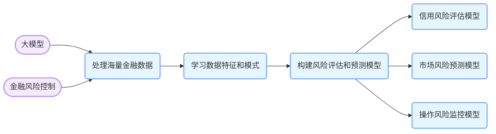

# 大模型在金融风险控制中的创新应用案例

> 关键词：大模型、金融风险控制、创新应用案例、风险评估、预测分析

> 摘要：本文聚焦于大模型在金融风险控制领域的创新应用案例。首先介绍了研究的背景、目的、预期读者以及文档结构等内容。详细阐述了大模型和金融风险控制的核心概念及其联系，给出了相应的原理和架构示意图。深入探讨了大模型在金融风险控制中应用的核心算法原理，通过Python代码进行说明，并介绍了相关的数学模型和公式。结合实际项目，展示了代码实现和解读。分析了大模型在金融风险控制中的实际应用场景，推荐了学习资源、开发工具框架以及相关论文著作。最后总结了大模型在该领域的未来发展趋势与挑战，并提供了常见问题解答和扩展阅读参考资料，旨在为金融行业从业者和相关研究人员提供全面的技术指导和实践借鉴。

## 1. 背景介绍 
### 1.1 目的和范围
随着金融市场的不断发展和复杂化，金融风险的种类和规模也日益增加。传统的金融风险控制方法在处理海量、复杂的数据时逐渐显得力不从心。大模型凭借其强大的数据分析和处理能力，为金融风险控制带来了新的机遇和挑战。本文的目的在于深入研究大模型在金融风险控制中的创新应用案例，分析其原理、方法和效果，为金融机构和相关从业者提供参考和借鉴。

本文的范围主要涵盖大模型在信用风险评估、市场风险预测、操作风险监控等金融风险控制的主要领域的应用案例。同时，也会涉及到相关的算法原理、数学模型以及实际项目的开发和实施过程。

### 1.2 预期读者
本文的预期读者包括金融行业的从业者，如银行信贷分析师、风险管理人员、投资经理等，他们可以从本文中了解大模型在金融风险控制中的具体应用和实践经验，为实际工作提供参考。同时，也适合计算机科学、统计学等领域的研究人员和开发者，他们可以通过本文了解金融领域的需求和应用场景，为大模型的研究和开发提供方向。此外，对金融科技和人工智能感兴趣的学生和爱好者也可以从本文中获得相关的知识和启发。

### 1.3 文档结构概述
本文将按照以下结构进行组织：
1. 背景介绍：介绍研究的目的、范围、预期读者和文档结构。
2. 核心概念与联系：阐述大模型和金融风险控制的核心概念，以及它们之间的联系。
3. 核心算法原理 & 具体操作步骤：介绍大模型在金融风险控制中应用的核心算法原理，并给出具体的操作步骤和Python代码示例。
4. 数学模型和公式 & 详细讲解 & 举例说明：介绍相关的数学模型和公式，并进行详细讲解和举例说明。
5. 项目实战：代码实际案例和详细解释说明：结合实际项目，展示代码的实现和详细解释。
6. 实际应用场景：分析大模型在金融风险控制中的实际应用场景。
7. 工具和资源推荐：推荐学习资源、开发工具框架和相关论文著作。
8. 总结：未来发展趋势与挑战：总结大模型在金融风险控制中的未来发展趋势和面临的挑战。
9. 附录：常见问题与解答：提供常见问题的解答。
10. 扩展阅读 & 参考资料：提供扩展阅读的建议和参考资料。

### 1.4 术语表
#### 1.4.1 核心术语定义
- **大模型**：通常指具有大量参数和强大计算能力的机器学习模型，如深度学习中的神经网络模型，能够处理复杂的数据分析和预测任务。
- **金融风险控制**：指金融机构通过各种手段和方法，对金融活动中可能面临的风险进行识别、评估、监测和控制，以降低风险损失，保障金融稳定和安全。
- **信用风险**：指借款人或交易对手未能履行合同义务而导致金融机构遭受损失的风险。
- **市场风险**：指由于市场价格波动（如利率、汇率、股票价格等）而导致金融机构资产价值发生变化的风险。
- **操作风险**：指由于不完善或有问题的内部程序、人员和系统，或外部事件而导致金融机构损失的风险。

#### 1.4.2 相关概念解释
- **机器学习**：是一门多领域交叉学科，涉及概率论、统计学、逼近论、凸分析、算法复杂度理论等多门学科。它专门研究计算机怎样模拟或实现人类的学习行为，以获取新的知识或技能，重新组织已有的知识结构使之不断改善自身的性能。
- **深度学习**：是机器学习的一个分支领域，它是一种基于对数据进行表征学习的方法。深度学习通过构建具有很多层的神经网络模型，自动从大量数据中学习特征和模式，从而实现对数据的分类、预测等任务。
- **数据挖掘**：是指从大量的数据中通过算法搜索隐藏于其中信息的过程。数据挖掘通常与计算机科学有关，并通过统计、在线分析处理、情报检索、机器学习、专家系统（依靠过去的经验法则）和模式识别等诸多方法来实现上述目标。

#### 1.4.3 缩略词列表
- **AI**：Artificial Intelligence，人工智能
- **ML**：Machine Learning，机器学习
- **DL**：Deep Learning，深度学习
- **CNN**：Convolutional Neural Network，卷积神经网络
- **RNN**：Recurrent Neural Network，循环神经网络
- **LSTM**：Long Short-Term Memory，长短期记忆网络

## 2. 核心概念与联系 

### 2.1 大模型的概念与原理
大模型是指具有大量参数和强大计算能力的机器学习模型，特别是深度学习中的神经网络模型。这些模型通常由多个层次的神经元组成，能够自动从大量数据中学习特征和模式。例如，在图像识别领域，卷积神经网络（CNN）通过卷积层、池化层和全连接层等结构，自动提取图像的特征，从而实现对图像的分类和识别。

大模型的训练过程通常采用反向传播算法，通过不断调整模型的参数，使得模型的输出结果与真实标签之间的误差最小化。在训练过程中，需要大量的标注数据和计算资源，以确保模型能够学习到足够的特征和模式。

### 2.2 金融风险控制的概念与方法
金融风险控制是金融机构管理风险的重要手段，旨在识别、评估、监测和控制金融活动中可能面临的风险。常见的金融风险包括信用风险、市场风险、操作风险等。

金融风险控制的方法主要包括风险识别、风险评估、风险监测和风险控制等环节。风险识别是指通过对金融活动的分析和研究，识别可能存在的风险因素。风险评估是指对识别出的风险因素进行量化评估，确定风险的大小和可能性。风险监测是指对金融活动的风险状况进行实时监测，及时发现风险的变化和趋势。风险控制是指根据风险评估和监测的结果，采取相应的措施来降低风险损失。

### 2.3 大模型与金融风险控制的联系
大模型在金融风险控制中具有重要的应用价值。一方面，大模型能够处理海量、复杂的金融数据，包括结构化数据（如财务报表、交易记录等）和非结构化数据（如新闻报道、社交媒体信息等），从而更全面地识别和评估金融风险。另一方面，大模型能够通过深度学习算法，自动学习金融数据中的特征和模式，提高风险预测的准确性和可靠性。

例如，在信用风险评估中，大模型可以综合考虑借款人的信用历史、收入水平、资产状况等多个因素，通过对大量数据的学习和分析，建立更准确的信用评分模型，从而更有效地评估借款人的信用风险。在市场风险预测中，大模型可以分析市场价格的历史数据和相关的宏观经济指标，预测市场价格的走势，帮助金融机构制定合理的投资策略。

### 2.4 核心概念原理和架构的文本示意图
```plaintext
+---------------------+           +---------------------+
|       大模型        |           |    金融风险控制     |
+---------------------+           +---------------------+
| - 深度学习算法      |           | - 风险识别          |
| - 大量参数和数据    |           | - 风险评估          |
| - 自动特征学习      |           | - 风险监测          |
| - 反向传播训练      |           | - 风险控制          |
+---------------------+           +---------------------+
             |                                 |
             |  处理海量金融数据，学习特征模式 |
             |                                 |
             v                                 v
+-------------------------------------------------+
|            大模型在金融风险控制中的应用        |
+-------------------------------------------------+
| - 信用风险评估模型                            |
| - 市场风险预测模型                            |
| - 操作风险监控模型                            |
+-------------------------------------------------+
```

### 2.5 Mermaid 流程图


## 3. 核心算法原理 & 具体操作步骤 

### 3.1 核心算法原理
在金融风险控制中，常用的大模型算法包括深度学习中的神经网络算法，如卷积神经网络（CNN）、循环神经网络（RNN）及其变体长短期记忆网络（LSTM）等。

#### 3.1.1 卷积神经网络（CNN）
卷积神经网络主要用于处理具有网格结构的数据，如图像、时间序列数据等。在金融风险控制中，CNN可以用于分析金融时间序列数据，如股票价格、汇率等。

CNN的核心结构包括卷积层、池化层和全连接层。卷积层通过卷积核在输入数据上滑动，提取数据的局部特征。池化层用于对卷积层的输出进行下采样，减少数据的维度，同时保留重要的特征信息。全连接层将池化层的输出进行全连接，将特征映射到输出空间，实现分类或预测任务。

#### 3.1.2 循环神经网络（RNN）
循环神经网络主要用于处理序列数据，如文本、语音等。在金融风险控制中，RNN可以用于分析金融时间序列数据的动态变化。

RNN的特点是具有循环结构，能够利用序列数据中的历史信息。在每个时间步，RNN接收当前输入和上一个时间步的隐藏状态，计算当前时间步的隐藏状态和输出。然而，传统的RNN存在梯度消失和梯度爆炸的问题，导致难以学习长序列数据中的长期依赖关系。

#### 3.1.3 长短期记忆网络（LSTM）
长短期记忆网络是RNN的一种变体，通过引入门控机制，解决了传统RNN的梯度消失和梯度爆炸问题，能够更好地学习长序列数据中的长期依赖关系。

LSTM的核心结构包括输入门、遗忘门和输出门。输入门控制当前输入信息的进入，遗忘门控制上一个时间步的隐藏状态信息的保留或遗忘，输出门控制当前时间步的隐藏状态信息的输出。

### 3.2 具体操作步骤

#### 3.2.1 数据准备
首先，需要收集和整理金融数据，包括结构化数据和非结构化数据。对数据进行清洗和预处理，去除噪声和缺失值，对数据进行归一化或标准化处理，以便模型能够更好地学习数据的特征。

#### 3.2.2 模型构建
根据金融风险控制的具体任务，选择合适的大模型算法，如CNN、RNN或LSTM等。使用深度学习框架（如TensorFlow、PyTorch等）构建模型的结构，定义模型的输入、输出和隐藏层。

#### 3.2.3 模型训练
将准备好的数据划分为训练集、验证集和测试集。使用训练集对模型进行训练，通过反向传播算法调整模型的参数，使得模型的输出结果与真实标签之间的误差最小化。在训练过程中，使用验证集对模型的性能进行评估，防止模型过拟合。

#### 3.2.4 模型评估
使用测试集对训练好的模型进行评估，计算模型的准确率、召回率、F1值等评估指标，评估模型的性能和泛化能力。

#### 3.2.5 模型部署
将训练好的模型部署到实际的金融风险控制系统中，实时监测和预测金融风险。定期对模型进行更新和优化，以适应金融市场的变化。

### 3.3 Python源代码示例
以下是一个使用PyTorch实现的简单的LSTM模型用于金融时间序列预测的示例代码：

```python
import torch
import torch.nn as nn
import numpy as np
import matplotlib.pyplot as plt

# 生成示例数据
def generate_data(n_steps):
    time = np.linspace(0, np.pi * 2, n_steps)
    data = np.sin(time) + np.random.normal(0, 0.1, n_steps)
    return data

# 数据预处理
def prepare_data(data, seq_length):
    inputs = []
    targets = []
    for i in range(len(data) - seq_length):
        inputs.append(data[i:i+seq_length])
        targets.append(data[i+seq_length])
    inputs = np.array(inputs)
    targets = np.array(targets)
    inputs = torch.from_numpy(inputs).float().unsqueeze(2)
    targets = torch.from_numpy(targets).float().unsqueeze(1)
    return inputs, targets

# 定义LSTM模型
class LSTMModel(nn.Module):
    def __init__(self, input_size, hidden_size, num_layers, output_size):
        super(LSTMModel, self).__init__()
        self.hidden_size = hidden_size
        self.num_layers = num_layers
        self.lstm = nn.LSTM(input_size, hidden_size, num_layers, batch_first=True)
        self.fc = nn.Linear(hidden_size, output_size)

    def forward(self, x):
        h0 = torch.zeros(self.num_layers, x.size(0), self.hidden_size).requires_grad_()
        c0 = torch.zeros(self.num_layers, x.size(0), self.hidden_size).requires_grad_()
        out, (hn, cn) = self.lstm(x, (h0.detach(), c0.detach()))
        out = self.fc(out[:, -1, :])
        return out

# 训练模型
def train_model(model, inputs, targets, num_epochs, learning_rate):
    criterion = nn.MSELoss()
    optimizer = torch.optim.Adam(model.parameters(), lr=learning_rate)
    losses = []
    for epoch in range(num_epochs):
        outputs = model(inputs)
        loss = criterion(outputs, targets)
        optimizer.zero_grad()
        loss.backward()
        optimizer.step()
        losses.append(loss.item())
        if (epoch+1) % 100 == 0:
            print(f'Epoch [{epoch+1}/{num_epochs}], Loss: {loss.item():.4f}')
    return losses

# 主函数
if __name__ == '__main__':
    n_steps = 1000
    seq_length = 20
    input_size = 1
    hidden_size = 32
    num_layers = 2
    output_size = 1
    num_epochs = 500
    learning_rate = 0.001

    data = generate_data(n_steps)
    inputs, targets = prepare_data(data, seq_length)

    model = LSTMModel(input_size, hidden_size, num_layers, output_size)
    losses = train_model(model, inputs, targets, num_epochs, learning_rate)

    # 绘制损失曲线
    plt.plot(losses)
    plt.xlabel('Epoch')
    plt.ylabel('Loss')
    plt.title('Training Loss')
    plt.show()

    # 进行预测
    test_inputs = inputs[-1].unsqueeze(0)
    prediction = model(test_inputs).detach().numpy()[0][0]
    print(f'Prediction: {prediction}')
```

### 代码解释
1. **数据生成**：`generate_data` 函数生成一个包含噪声的正弦波时间序列数据。
2. **数据预处理**：`prepare_data` 函数将时间序列数据转换为适合LSTM模型输入的格式，即将数据划分为输入序列和目标值。
3. **模型定义**：`LSTMModel` 类定义了一个简单的LSTM模型，包括一个LSTM层和一个全连接层。
4. **模型训练**：`train_model` 函数使用均方误差损失函数和Adam优化器对模型进行训练，记录每个epoch的损失值。
5. **主函数**：在主函数中，调用上述函数完成数据生成、预处理、模型定义和训练，并绘制损失曲线，最后进行一次预测。

## 4. 数学模型和公式 & 详细讲解 & 举例说明 

### 4.1 卷积神经网络（CNN）的数学模型和公式

#### 4.1.1 卷积层
卷积层是CNN的核心层，通过卷积操作提取输入数据的局部特征。假设输入数据为 $X \in \mathbb{R}^{H \times W \times C}$，其中 $H$ 是输入数据的高度，$W$ 是输入数据的宽度，$C$ 是输入数据的通道数。卷积核为 $K \in \mathbb{R}^{h \times w \times C \times F}$，其中 $h$ 和 $w$ 是卷积核的高度和宽度，$F$ 是卷积核的数量。

卷积操作的数学公式为：
$$
Y_{i,j,f} = \sum_{c=0}^{C-1} \sum_{m=0}^{h-1} \sum_{n=0}^{w-1} K_{m,n,c,f} \cdot X_{i+m,j+n,c} + b_f
$$
其中，$Y \in \mathbb{R}^{H' \times W' \times F}$ 是卷积层的输出，$H'$ 和 $W'$ 是输出数据的高度和宽度，$b_f$ 是第 $f$ 个卷积核的偏置项。

#### 4.1.2 池化层
池化层用于对卷积层的输出进行下采样，减少数据的维度。常见的池化操作有最大池化和平均池化。

最大池化的数学公式为：
$$
Y_{i,j,f} = \max_{m=0}^{h_p-1} \max_{n=0}^{w_p-1} X_{i \cdot s + m, j \cdot s + n, f}
$$
其中，$X \in \mathbb{R}^{H \times W \times F}$ 是池化层的输入，$Y \in \mathbb{R}^{H' \times W' \times F}$ 是池化层的输出，$h_p$ 和 $w_p$ 是池化窗口的高度和宽度，$s$ 是池化窗口的步长。

#### 4.1.3 全连接层
全连接层将池化层的输出进行全连接，将特征映射到输出空间。假设全连接层的输入为 $X \in \mathbb{R}^{N}$，输出为 $Y \in \mathbb{R}^{M}$，则全连接层的数学公式为：
$$
Y = WX + b
$$
其中，$W \in \mathbb{R}^{M \times N}$ 是权重矩阵，$b \in \mathbb{R}^{M}$ 是偏置向量。

### 4.2 循环神经网络（RNN）的数学模型和公式
RNN的核心结构是循环单元，在每个时间步 $t$，RNN接收当前输入 $x_t$ 和上一个时间步的隐藏状态 $h_{t-1}$，计算当前时间步的隐藏状态 $h_t$ 和输出 $y_t$。

RNN的数学公式为：
$$
h_t = \tanh(W_{hh} h_{t-1} + W_{xh} x_t + b_h)
$$
$$
y_t = W_{hy} h_t + b_y
$$
其中，$W_{hh}$ 是隐藏状态到隐藏状态的权重矩阵，$W_{xh}$ 是输入到隐藏状态的权重矩阵，$W_{hy}$ 是隐藏状态到输出的权重矩阵，$b_h$ 和 $b_y$ 分别是隐藏状态和输出的偏置向量，$\tanh$ 是激活函数。

### 4.3 长短期记忆网络（LSTM）的数学模型和公式
LSTM通过引入门控机制，解决了传统RNN的梯度消失和梯度爆炸问题。LSTM的核心结构包括输入门 $i_t$、遗忘门 $f_t$、输出门 $o_t$ 和细胞状态 $C_t$。

LSTM的数学公式为：
$$
i_t = \sigma(W_{xi} x_t + W_{hi} h_{t-1} + b_i)
$$
$$
f_t = \sigma(W_{xf} x_t + W_{hf} h_{t-1} + b_f)
$$
$$
o_t = \sigma(W_{xo} x_t + W_{ho} h_{t-1} + b_o)
$$
$$
\tilde{C}_t = \tanh(W_{xc} x_t + W_{hc} h_{t-1} + b_c)
$$
$$
C_t = f_t \odot C_{t-1} + i_t \odot \tilde{C}_t
$$
$$
h_t = o_t \odot \tanh(C_t)
$$
其中，$\sigma$ 是Sigmoid激活函数，$\odot$ 是逐元素相乘操作，$W_{xi}$、$W_{hi}$、$W_{xf}$、$W_{hf}$、$W_{xo}$、$W_{ho}$、$W_{xc}$、$W_{hc}$ 是权重矩阵，$b_i$、$b_f$、$b_o$、$b_c$ 是偏置向量。

### 4.4 举例说明
假设我们要使用CNN对股票价格的时间序列数据进行预测。输入数据是一个长度为 $T$ 的时间序列，每个时间步有 $C$ 个特征，即输入数据 $X \in \mathbb{R}^{T \times C}$。我们可以将输入数据看作一个 $T$ 行 $C$ 列的矩阵，将其转换为适合CNN输入的格式 $X \in \mathbb{R}^{1 \times T \times C}$。

假设我们使用一个卷积核大小为 $h = 3$，宽度为 $C$，数量为 $F = 16$ 的卷积层对输入数据进行卷积操作。根据卷积层的数学公式，卷积层的输出 $Y \in \mathbb{R}^{1 \times (T - 3 + 1) \times 16}$。

然后，我们可以使用一个最大池化层对卷积层的输出进行下采样，假设池化窗口大小为 $h_p = 2$，步长为 $s = 2$，则池化层的输出 $Y \in \mathbb{R}^{1 \times \lfloor \frac{T - 3 + 1}{2} \rfloor \times 16}$。

最后，我们可以将池化层的输出展平为一个一维向量，输入到全连接层中，得到预测结果。

## 5. 项目实战：代码实际案例和详细解释说明 

### 5.1 开发环境搭建
#### 5.1.1 安装Python
首先，需要安装Python环境。建议使用Python 3.7及以上版本，可以从Python官方网站（https://www.python.org/downloads/）下载并安装。

#### 5.1.2 安装深度学习框架
本文使用PyTorch作为深度学习框架，可以使用以下命令安装：
```sh
pip install torch torchvision
```

#### 5.1.3 安装其他依赖库
还需要安装一些其他的依赖库，如NumPy、Matplotlib等，可以使用以下命令安装：
```sh
pip install numpy matplotlib
```

### 5.2 源代码详细实现和代码解读
以下是一个完整的使用LSTM模型进行股票价格预测的项目代码：

```python
import torch
import torch.nn as nn
import numpy as np
import pandas as pd
import matplotlib.pyplot as plt
from sklearn.preprocessing import MinMaxScaler

# 读取数据
def read_data(file_path):
    data = pd.read_csv(file_path)
    close_prices = data['Close'].values.reshape(-1, 1)
    return close_prices

# 数据预处理
def preprocess_data(data, seq_length):
    scaler = MinMaxScaler(feature_range=(0, 1))
    scaled_data = scaler.fit_transform(data)
    inputs = []
    targets = []
    for i in range(len(scaled_data) - seq_length):
        inputs.append(scaled_data[i:i+seq_length])
        targets.append(scaled_data[i+seq_length])
    inputs = np.array(inputs)
    targets = np.array(targets)
    inputs = torch.from_numpy(inputs).float()
    targets = torch.from_numpy(targets).float()
    return inputs, targets, scaler

# 定义LSTM模型
class LSTMModel(nn.Module):
    def __init__(self, input_size, hidden_size, num_layers, output_size):
        super(LSTMModel, self).__init__()
        self.hidden_size = hidden_size
        self.num_layers = num_layers
        self.lstm = nn.LSTM(input_size, hidden_size, num_layers, batch_first=True)
        self.fc = nn.Linear(hidden_size, output_size)

    def forward(self, x):
        h0 = torch.zeros(self.num_layers, x.size(0), self.hidden_size).requires_grad_()
        c0 = torch.zeros(self.num_layers, x.size(0), self.hidden_size).requires_grad_()
        out, (hn, cn) = self.lstm(x, (h0.detach(), c0.detach()))
        out = self.fc(out[:, -1, :])
        return out

# 训练模型
def train_model(model, inputs, targets, num_epochs, learning_rate):
    criterion = nn.MSELoss()
    optimizer = torch.optim.Adam(model.parameters(), lr=learning_rate)
    losses = []
    for epoch in range(num_epochs):
        outputs = model(inputs)
        loss = criterion(outputs, targets)
        optimizer.zero_grad()
        loss.backward()
        optimizer.step()
        losses.append(loss.item())
        if (epoch+1) % 100 == 0:
            print(f'Epoch [{epoch+1}/{num_epochs}], Loss: {loss.item():.4f}')
    return losses

# 预测
def predict(model, inputs, scaler):
    model.eval()
    with torch.no_grad():
        predictions = model(inputs)
        predictions = predictions.numpy()
        predictions = scaler.inverse_transform(predictions)
    return predictions

# 主函数
if __name__ == '__main__':
    file_path = 'stock_prices.csv'
    seq_length = 20
    input_size = 1
    hidden_size = 32
    num_layers = 2
    output_size = 1
    num_epochs = 500
    learning_rate = 0.001

    # 读取数据
    close_prices = read_data(file_path)

    # 数据预处理
    inputs, targets, scaler = preprocess_data(close_prices, seq_length)

    # 划分训练集和测试集
    train_size = int(len(inputs) * 0.8)
    train_inputs = inputs[:train_size]
    train_targets = targets[:train_size]
    test_inputs = inputs[train_size:]
    test_targets = targets[train_size:]

    # 定义模型
    model = LSTMModel(input_size, hidden_size, num_layers, output_size)

    # 训练模型
    losses = train_model(model, train_inputs, train_targets, num_epochs, learning_rate)

    # 绘制损失曲线
    plt.plot(losses)
    plt.xlabel('Epoch')
    plt.ylabel('Loss')
    plt.title('Training Loss')
    plt.show()

    # 进行预测
    predictions = predict(model, test_inputs, scaler)
    test_targets = scaler.inverse_transform(test_targets.numpy())

    # 绘制预测结果
    plt.plot(test_targets, label='Actual Prices')
    plt.plot(predictions, label='Predicted Prices')
    plt.xlabel('Time')
    plt.ylabel('Stock Price')
    plt.title('Stock Price Prediction')
    plt.legend()
    plt.show()
```

### 代码解读
1. **数据读取**：`read_data` 函数从CSV文件中读取股票的收盘价数据。
2. **数据预处理**：`preprocess_data` 函数使用MinMaxScaler对数据进行归一化处理，将数据转换为适合LSTM模型输入的格式。
3. **模型定义**：`LSTMModel` 类定义了一个简单的LSTM模型，包括一个LSTM层和一个全连接层。
4. **模型训练**：`train_model` 函数使用均方误差损失函数和Adam优化器对模型进行训练，记录每个epoch的损失值。
5. **预测**：`predict` 函数使用训练好的模型对测试数据进行预测，并将预测结果反归一化。
6. **主函数**：在主函数中，调用上述函数完成数据读取、预处理、模型定义、训练和预测，并绘制损失曲线和预测结果。

### 5.3 代码解读与分析
#### 5.3.1 数据处理
在数据处理阶段，使用MinMaxScaler对数据进行归一化处理，将数据缩放到 [0, 1] 范围内。这是因为神经网络模型对输入数据的尺度比较敏感，归一化可以提高模型的训练效果。

#### 5.3.2 模型结构
使用LSTM模型对股票价格进行预测，LSTM模型能够处理时间序列数据的长期依赖关系。模型包括一个LSTM层和一个全连接层，LSTM层用于学习时间序列数据的特征，全连接层用于将特征映射到输出空间。

#### 5.3.3 训练过程
在训练过程中，使用均方误差损失函数和Adam优化器对模型进行训练。均方误差损失函数用于衡量模型的预测结果与真实标签之间的误差，Adam优化器用于更新模型的参数。

#### 5.3.4 预测结果
在预测阶段，使用训练好的模型对测试数据进行预测，并将预测结果反归一化。通过绘制预测结果和真实标签的曲线，可以直观地观察模型的预测效果。

## 6. 实际应用场景 
### 6.1 信用风险评估
在信用风险评估中，大模型可以综合考虑借款人的各种信息，包括个人基本信息、信用历史、收入水平、资产状况等，通过对大量数据的学习和分析，建立更准确的信用评分模型。

例如，金融机构可以使用大模型分析借款人的社交媒体数据、消费记录等非结构化数据，了解借款人的消费习惯、社交圈子等信息，从而更全面地评估借款人的信用风险。同时，大模型还可以实时监测借款人的信用状况，及时发现信用风险的变化，采取相应的措施。

### 6.2 市场风险预测
在市场风险预测中，大模型可以分析市场价格的历史数据和相关的宏观经济指标，预测市场价格的走势，帮助金融机构制定合理的投资策略。

例如，大模型可以分析股票价格、汇率、利率等市场数据，结合宏观经济指标（如GDP、通货膨胀率等），预测市场的未来走势。金融机构可以根据预测结果，调整投资组合，降低市场风险。

### 6.3 操作风险监控
在操作风险监控中，大模型可以对金融机构的业务流程和交易数据进行实时监测，及时发现异常交易和潜在的操作风险。

例如，大模型可以分析金融机构的交易记录、账户信息等数据，识别异常交易模式，如大额异常转账、频繁交易等。同时，大模型还可以对金融机构的内部管理流程进行监控，如员工操作行为、系统日志等，及时发现潜在的操作风险。

### 6.4 反欺诈检测
在反欺诈检测中，大模型可以对金融交易数据进行实时分析，识别欺诈交易模式，及时发现和防范金融欺诈行为。

例如，大模型可以分析信用卡交易数据、贷款申请数据等，通过对大量正常交易和欺诈交易数据的学习和分析，建立欺诈检测模型。当出现异常交易时，模型可以及时发出警报，帮助金融机构采取相应的措施。

## 7. 工具和资源推荐
### 7.1 学习资源推荐
#### 7.1.1 书籍推荐
- 《深度学习》（Deep Learning）：作者是Ian Goodfellow、Yoshua Bengio和Aaron Courville，这本书是深度学习领域的经典教材，系统地介绍了深度学习的基本概念、算法和应用。
- 《Python机器学习》（Python Machine Learning）：作者是Sebastian Raschka和Vahid Mirjalili，这本书以Python为工具，详细介绍了机器学习的各种算法和应用。
- 《动手学深度学习》（Dive into Deep Learning）：作者是阿斯顿·张、李沐等，这本书结合了理论和实践，通过大量的代码示例，帮助读者快速掌握深度学习的知识和技能。

#### 7.1.2 在线课程
- Coursera上的“深度学习专项课程”（Deep Learning Specialization）：由Andrew Ng教授主讲，包括五门课程，系统地介绍了深度学习的各个方面。
- edX上的“使用Python进行数据科学”（Data Science with Python）：这门课程介绍了Python在数据科学中的应用，包括数据处理、数据分析、机器学习等方面。
- 哔哩哔哩上的“李沐深度学习”系列视频：李沐老师通过生动形象的讲解和代码演示，帮助观众快速入门深度学习。

#### 7.1.3 技术博客和网站
- Medium：Medium上有很多关于机器学习、深度学习的技术博客，作者们分享了自己的研究成果和实践经验。
- Towards Data Science：这是一个专注于数据科学和机器学习的网站，提供了大量的技术文章和教程。
- Kaggle：Kaggle是一个数据科学竞赛平台，上面有很多优秀的数据集和代码示例，可以帮助读者学习和实践。

### 7.2 开发工具框架推荐
#### 7.2.1 IDE和编辑器
- PyCharm：PyCharm是一款专门为Python开发设计的集成开发环境，提供了丰富的功能和工具，如代码编辑、调试、版本控制等。
- Jupyter Notebook：Jupyter Notebook是一个交互式的开发环境，支持Python、R等多种编程语言，适合进行数据探索和模型实验。
- Visual Studio Code：Visual Studio Code是一款轻量级的代码编辑器，支持多种编程语言，通过安装Python扩展，可以方便地进行Python开发。

#### 7.2.2 调试和性能分析工具
- PyTorch Profiler：PyTorch Profiler是PyTorch自带的性能分析工具，可以帮助开发者分析模型的性能瓶颈，优化模型的训练和推理速度。
- TensorBoard：TensorBoard是TensorFlow的可视化工具，也可以用于PyTorch模型的可视化和调试，通过TensorBoard可以查看模型的训练过程、损失曲线等信息。
- cProfile：cProfile是Python的内置性能分析工具，可以帮助开发者分析Python代码的性能瓶颈，找出耗时较长的函数和代码段。

#### 7.2.3 相关框架和库
- PyTorch：PyTorch是一个开源的深度学习框架，提供了丰富的深度学习模型和工具，支持GPU加速，易于使用和扩展。
- TensorFlow：TensorFlow是另一个流行的深度学习框架，由Google开发，提供了分布式训练、模型部署等功能，广泛应用于工业界和学术界。
- Scikit-learn：Scikit-learn是一个用于机器学习的Python库，提供了各种机器学习算法和工具，如分类、回归、聚类等，适合初学者和快速开发。

### 7.3 相关论文著作推荐
#### 7.3.1 经典论文
- 《Gradient-based learning applied to document recognition》：这篇论文介绍了卷积神经网络（CNN）在手写数字识别中的应用，是CNN领域的经典论文。
- 《Long Short-Term Memory》：这篇论文介绍了长短期记忆网络（LSTM）的原理和应用，是LSTM领域的经典论文。
- 《Attention Is All You Need》：这篇论文介绍了Transformer模型，提出了注意力机制，是自然语言处理领域的重要突破。

#### 7.3.2 最新研究成果
- 在arXiv.org上可以找到很多关于大模型在金融风险控制中的最新研究成果，这些论文通常涵盖了最新的算法和应用案例。
- 顶级学术会议如NeurIPS、ICML、KDD等也会发表很多关于机器学习和金融科技的研究论文，可以关注这些会议的论文集。

#### 7.3.3 应用案例分析
- 《AI in Finance: From Theory to Practice》：这本书介绍了人工智能在金融领域的应用案例，包括信用风险评估、市场风险预测等方面。
- 一些金融机构的官方网站和研究报告也会分享他们在大模型应用方面的实践经验和案例分析，可以关注这些信息。

## 8. 总结：未来发展趋势与挑战
### 8.1 未来发展趋势
#### 8.1.1 多模态数据融合
未来，大模型将更加注重多模态数据的融合，不仅包括结构化数据（如财务报表、交易记录等），还包括非结构化数据（如新闻报道、社交媒体信息、图像、视频等）。通过融合多模态数据，可以更全面地了解金融市场和客户的情况，提高风险评估和预测的准确性。

#### 8.1.2 可解释性和透明度
随着大模型在金融风险控制中的应用越来越广泛，其可解释性和透明度也越来越受到关注。未来，大模型将更加注重可解释性和透明度的研究，开发出能够解释模型决策过程和结果的方法和工具，帮助金融机构和监管部门更好地理解和信任模型。

#### 8.1.3 与区块链技术的结合
区块链技术具有去中心化、不可篡改、可追溯等特点，与大模型在金融风险控制中的应用具有天然的契合点。未来，大模型将与区块链技术相结合，构建更加安全、可信的金融风险控制体系。例如，通过区块链技术记录金融交易数据，确保数据的真实性和完整性，同时使用大模型对区块链上的数据进行分析和挖掘，提高风险评估和预测的准确性。

#### 8.1.4 自动化和智能化
未来，大模型在金融风险控制中的应用将更加自动化和智能化。金融机构将使用大模型自动完成风险识别、评估、监测和控制等任务，减少人工干预，提高工作效率和准确性。同时，大模型将不断学习和优化，根据金融市场的变化和客户的需求，自动调整风险控制策略。

### 8.2 挑战
#### 8.2.1 数据质量和隐私保护
大模型的训练需要大量的高质量数据，然而金融数据往往存在数据质量不高、数据缺失、数据噪声等问题。同时，金融数据涉及客户的隐私和敏感信息，数据隐私保护也是一个重要的挑战。如何提高数据质量，保护数据隐私，是大模型在金融风险控制中应用面临的重要问题。

#### 8.2.2 计算资源和成本
大模型的训练和推理需要大量的计算资源，如GPU、TPU等，这将带来高昂的计算成本。同时，金融机构需要建立和维护大规模的计算集群，这也增加了运营成本和管理难度。如何降低计算成本，提高计算效率，是大模型在金融风险控制中应用需要解决的问题。

#### 8.2.3 模型评估和验证
大模型的复杂度和非线性使得模型评估和验证变得更加困难。传统的评估指标和方法可能无法准确评估大模型的性能和可靠性。如何开发出适合大模型的评估指标和方法，确保模型的稳定性和可靠性，是大模型在金融风险控制中应用需要解决的问题。

#### 8.2.4 监管和合规
大模型在金融风险控制中的应用涉及到监管和合规问题。金融机构需要遵守相关的法律法规和监管要求，确保模型的开发和应用符合规定。同时，监管部门也需要加强对大模型在金融领域应用的监管，防范潜在的风险。

## 9. 附录：常见问题与解答
### 9.1 大模型在金融风险控制中的应用需要多少数据？
大模型通常需要大量的数据进行训练，以学习到足够的特征和模式。具体需要多少数据取决于模型的复杂度、任务的难度以及数据的质量等因素。一般来说，数据量越大，模型的性能和泛化能力越好。在实际应用中，金融机构可以根据自身的情况，收集和整理尽可能多的相关数据。

### 9.2 如何选择适合金融风险控制的大模型算法？
选择适合金融风险控制的大模型算法需要考虑多个因素，如数据类型、任务类型、模型复杂度、计算资源等。如果处理的是时间序列数据，可以选择RNN或LSTM等算法；如果处理的是图像或结构化数据，可以选择CNN等算法。同时，还需要根据实际情况进行实验和比较，选择性能最优的算法。

### 9.3 大模型在金融风险控制中的应用是否会取代人类专家？
大模型在金融风险控制中的应用可以提高工作效率和准确性，但不会完全取代人类专家。大模型可以处理大量的数据和复杂的计算，但在一些需要人类判断和经验的方面，如风险决策、客户沟通等，人类专家仍然具有不可替代的作用。未来，大模型和人类专家将相互协作，共同提高金融风险控制的水平。

### 9.4 如何确保大模型在金融风险控制中的应用安全可靠？
为了确保大模型在金融风险控制中的应用安全可靠，需要采取以下措施：
1. **数据安全**：加强数据的保护和管理，确保数据的真实性、完整性和保密性。
2. **模型评估和验证**：使用多种评估指标和方法对模型进行评估和验证，确保模型的性能和可靠性。
3. **监控和预警**：建立模型的监控和预警机制，及时发现模型的异常行为和潜在风险。
4. **合规性**：确保模型的开发和应用符合相关的法律法规和监管要求。

## 10. 扩展阅读 & 参考资料
### 10.1 扩展阅读
- 《金融科技前沿：人工智能与机器学习》：这本书介绍了人工智能和机器学习在金融领域的前沿应用和发展趋势。
- 《大数据金融》：这本书介绍了大数据在金融领域的应用，包括数据挖掘、风险评估、信贷分析等方面。
- 《金融风险管理》：这本书系统地介绍了金融风险管理的理论和方法，包括信用风险、市场风险、操作风险等方面。

### 10.2 参考资料
- Goodfellow, I., Bengio, Y., & Courville, A. (2016). Deep Learning. MIT Press.
- Raschka, S., & Mirjalili, V. (2017). Python Machine Learning. Packt Publishing.
- Zhang, A., Lipton, Z. C., Li, M., & Smola, A. J. (2020). Dive into Deep Learning.
- LeCun, Y., Bottou, L., Bengio, Y., & Haffner, P. (1998). Gradient-based learning applied to document recognition. Proceedings of the IEEE, 86(11), 2278-2324.
- Hochreiter, S., & Schmidhuber, J. (1997). Long short-term memory. Neural computation, 9(8), 1735-1780.
- Vaswani, A., Shazeer, N., Parmar, N., Uszkoreit, J., Jones, L., Gomez, A. N.,... & Polosukhin, I. (2017). Attention is all you need. Advances in neural information processing systems, 5998-6008.

作者：AI天才研究院/AI Genius Institute & 禅与计算机程序设计艺术 /Zen And The Art of Computer Programming