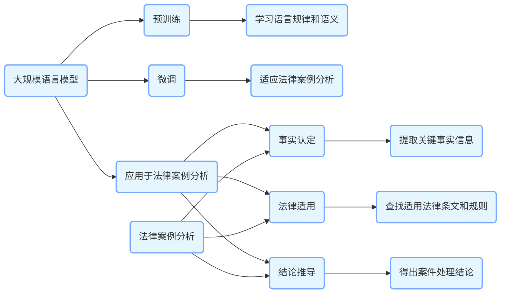

# 大规模语言模型在法律案例分析中的推理应用

> 关键词：大规模语言模型、法律案例分析、推理应用、自然语言处理、法律知识图谱

> 摘要：本文深入探讨了大规模语言模型在法律案例分析中的推理应用。首先介绍了研究的背景、目的、预期读者和文档结构等内容。接着阐述了相关核心概念及其联系，包括大规模语言模型和法律案例分析的原理与架构。详细讲解了核心算法原理和具体操作步骤，并用Python代码进行了说明。同时给出了相关的数学模型和公式，并举例解释。通过项目实战展示了代码的实际应用和解读。分析了大规模语言模型在法律案例分析中的实际应用场景，推荐了学习、开发工具框架和相关论文著作。最后总结了未来发展趋势与挑战，解答了常见问题，并提供了扩展阅读和参考资料。旨在为法律领域利用大规模语言模型进行案例分析提供全面而深入的技术指导。

## 1. 背景介绍 
### 1.1 目的和范围
随着信息技术的飞速发展，法律领域积累了海量的案例数据。传统的法律案例分析方法效率低下，难以从大量复杂的数据中快速准确地提取有用信息。大规模语言模型具有强大的自然语言处理能力，能够对法律文本进行理解、分析和推理，为法律案例分析带来了新的机遇。

本文章的目的是深入研究大规模语言模型在法律案例分析中的推理应用，探讨如何利用这些模型提高法律案例分析的效率和准确性。范围涵盖了大规模语言模型的基本原理、在法律案例分析中的具体应用场景、相关算法和数学模型，以及实际项目的开发和实现。

### 1.2 预期读者
本文预期读者包括法律从业者，如律师、法官、检察官等，他们可以了解如何借助大规模语言模型提升法律案例分析的能力；计算机科学和人工智能领域的研究人员和开发者，他们可以从法律应用的角度探索大规模语言模型的新应用场景；法律专业的学生，有助于他们学习和掌握先进的法律案例分析方法。

### 1.3 文档结构概述
本文将按照以下结构展开：首先介绍相关核心概念和它们之间的联系，包括大规模语言模型和法律案例分析的基本原理和架构；然后详细讲解核心算法原理和具体操作步骤，并用Python代码进行实现；接着给出相关的数学模型和公式，并通过举例进行说明；之后通过项目实战展示代码的实际应用和详细解读；分析大规模语言模型在法律案例分析中的实际应用场景；推荐学习、开发工具框架和相关论文著作；最后总结未来发展趋势与挑战，解答常见问题，并提供扩展阅读和参考资料。

### 1.4 术语表
#### 1.4.1 核心术语定义
- **大规模语言模型**：是指基于深度学习技术，在大规模文本数据上进行训练的语言模型，具有强大的语言理解和生成能力，如GPT - 3、BERT等。
- **法律案例分析**：是指对法律案例进行研究、解读、推理和总结的过程，旨在从案例中提取法律规则、判断事实、预测结果等。
- **推理应用**：在法律案例分析中，利用大规模语言模型根据已知的法律信息和案例事实，推导出未知的结论或判断的过程。

#### 1.4.2 相关概念解释
- **自然语言处理（NLP）**：是人工智能的一个重要领域，主要研究如何让计算机理解和处理人类语言。大规模语言模型是自然语言处理的重要成果之一，通过对大量文本数据的学习，能够实现文本分类、命名实体识别、情感分析等多种任务。
- **法律知识图谱**：是一种将法律知识以图的形式表示的结构化数据，包含法律概念、法律条文、案例事实等节点，以及它们之间的关系。法律知识图谱可以为大规模语言模型在法律案例分析中的推理提供结构化的知识支持。

#### 1.4.3 缩略词列表
- **NLP**：Natural Language Processing（自然语言处理）
- **GPT**：Generative Pretrained Transformer（生成式预训练变换器）
- **BERT**：Bidirectional Encoder Representations from Transformers（基于变换器的双向编码器表示）

## 2. 核心概念与联系 

### 大规模语言模型原理
大规模语言模型通常基于Transformer架构，它是一种基于注意力机制的深度学习模型。Transformer架构由编码器和解码器组成，其中编码器负责对输入的文本进行特征提取和编码，解码器负责根据编码后的信息生成输出文本。

以GPT系列模型为例，它是一种基于Transformer解码器的生成式语言模型。在预训练阶段，模型在大规模的无监督文本数据上进行训练，学习语言的统计规律和语义信息。在微调阶段，模型可以根据具体的任务，如文本生成、问答系统等，在有监督的数据集上进行微调，以适应特定的应用场景。

### 法律案例分析原理
法律案例分析主要包括事实认定、法律适用和结论推导三个步骤。事实认定是指从案例文本中提取关键事实信息，如当事人、事件经过、证据等；法律适用是指根据认定的事实，查找适用的法律条文和法律规则；结论推导是指根据法律适用的结果，推导出案件的处理结论。

### 两者的联系
大规模语言模型可以在法律案例分析的各个步骤中发挥重要作用。在事实认定阶段，模型可以通过命名实体识别、关系抽取等任务，从案例文本中准确提取关键事实信息；在法律适用阶段，模型可以根据事实信息，利用语义搜索等技术，查找适用的法律条文和法律规则；在结论推导阶段，模型可以根据事实和法律适用的结果，进行逻辑推理和判断，推导出案件的处理结论。

### 文本示意图
```plaintext
大规模语言模型
|-- 预训练（大规模无监督文本数据）
|   |-- 学习语言统计规律和语义信息
|-- 微调（特定任务有监督数据集）
|   |-- 适应法律案例分析任务
|-- 应用于法律案例分析
    |-- 事实认定（命名实体识别、关系抽取）
    |-- 法律适用（语义搜索）
    |-- 结论推导（逻辑推理和判断）

法律案例分析
|-- 事实认定
|   |-- 提取关键事实信息
|-- 法律适用
|   |-- 查找适用法律条文和规则
|-- 结论推导
|   |-- 得出案件处理结论
```

### Mermaid流程图


## 3. 核心算法原理 & 具体操作步骤 

### 核心算法原理
在法律案例分析中，常用的核心算法包括命名实体识别、关系抽取和语义搜索。

#### 命名实体识别（NER）
命名实体识别是指从文本中识别出具有特定意义的实体，如人名、地名、组织机构名、法律条文名等。在法律案例分析中，命名实体识别可以帮助提取案例中的关键事实信息。

NER通常基于深度学习模型，如BiLSTM - CRF（双向长短时记忆网络 - 条件随机场）或基于Transformer的模型。以基于Transformer的模型为例，其原理是将输入的文本进行编码，然后通过一个全连接层对每个词进行分类，判断其是否为某个实体类型。

#### 关系抽取
关系抽取是指从文本中识别出实体之间的关系，如当事人之间的关系、事件与法律条文之间的关系等。关系抽取可以帮助构建法律知识图谱，为法律推理提供结构化的知识支持。

关系抽取通常采用基于监督学习的方法，将输入的文本和实体信息作为输入，通过深度学习模型预测实体之间的关系类型。

#### 语义搜索
语义搜索是指根据查询的语义信息，在文本数据库中查找与之相关的文本。在法律案例分析中，语义搜索可以帮助查找适用的法律条文和类似案例。

语义搜索通常基于向量空间模型，将文本转换为向量表示，然后通过计算向量之间的相似度来查找相关文本。

### 具体操作步骤

#### 数据准备
收集和整理法律案例文本数据，并进行标注。标注内容包括命名实体的类型和位置、实体之间的关系等。

#### 模型训练
使用标注好的数据对命名实体识别、关系抽取和语义搜索模型进行训练。训练过程通常包括数据划分、模型初始化、模型训练和模型评估等步骤。

#### 模型应用
将训练好的模型应用于法律案例分析中。具体步骤如下：
1. 对输入的法律案例文本进行命名实体识别，提取关键事实信息。
2. 根据提取的实体信息进行关系抽取，构建法律知识图谱。
3. 使用语义搜索技术，根据事实信息查找适用的法律条文和类似案例。
4. 根据法律条文和类似案例进行逻辑推理和判断，推导出案件的处理结论。

### Python源代码实现

```python
import torch
from transformers import AutoTokenizer, AutoModelForTokenClassification

# 加载预训练的命名实体识别模型
tokenizer = AutoTokenizer.from_pretrained("dslim/bert-base-NER")
model = AutoModelForTokenClassification.from_pretrained("dslim/bert-base-NER")

# 输入的法律案例文本
text = "张三因盗窃罪被起诉，根据《中华人民共和国刑法》第二百六十四条的规定，应受到相应处罚。"

# 对文本进行分词
inputs = tokenizer(text, return_tensors="pt")

# 模型预测
with torch.no_grad():
    outputs = model(**inputs)

# 获取预测结果
predictions = torch.argmax(outputs.logits, dim=2)

# 解码预测结果
tokens = tokenizer.convert_ids_to_tokens(inputs["input_ids"][0])
for token, prediction in zip(tokens, predictions[0]):
    print(f"{token}: {model.config.id2label[prediction.item()]}")
```

### 代码解释
1. 导入必要的库，包括`torch`和`transformers`。
2. 加载预训练的命名实体识别模型`dslim/bert-base-NER`。
3. 定义输入的法律案例文本。
4. 使用分词器对文本进行分词。
5. 调用模型进行预测。
6. 获取预测结果并解码，输出每个词的实体类型。

## 4. 数学模型和公式 & 详细讲解 & 举例说明 

### 命名实体识别的数学模型
命名实体识别可以看作是一个序列标注问题，目标是为输入文本中的每个词标注一个实体类型。常用的数学模型是条件随机场（CRF）。

#### 条件随机场原理
条件随机场是一种概率图模型，用于对序列数据进行建模。在命名实体识别中，CRF模型可以根据输入文本的特征和上下文信息，计算每个词的标注概率。

设输入文本为 $x = (x_1, x_2, \cdots, x_n)$，标注序列为 $y = (y_1, y_2, \cdots, y_n)$，CRF模型的条件概率可以表示为：

$$P(y|x) = \frac{1}{Z(x)} \exp \left( \sum_{i=1}^{n} \sum_{k=1}^{K} \lambda_k t_k(y_{i-1}, y_i, x, i) + \sum_{i=1}^{n} \sum_{l=1}^{L} \mu_l s_l(y_i, x, i) \right)$$

其中，$Z(x)$ 是归一化因子，$t_k$ 是转移特征函数，$s_l$ 是状态特征函数，$\lambda_k$ 和 $\mu_l$ 是模型参数。

#### 举例说明
假设输入文本为 "张三 因 盗窃罪 被 起诉"，标注集合为 {PER（人名）, CRIME（罪名）, OTHER（其他）}。对于词 "张三"，CRF模型会根据其上下文信息和特征，计算其标注为 "PER" 的概率。

### 关系抽取的数学模型
关系抽取可以看作是一个分类问题，目标是根据输入的文本和实体信息，预测实体之间的关系类型。常用的数学模型是神经网络。

#### 神经网络原理
神经网络通过多层神经元的非线性变换，将输入的文本和实体信息映射到关系类型的概率分布。设输入为 $x$，输出为 $y$，神经网络的输出可以表示为：

$$y = f(W_n \cdots f(W_2 f(W_1 x + b_1) + b_2) \cdots + b_n)$$

其中，$W_i$ 是权重矩阵，$b_i$ 是偏置向量，$f$ 是激活函数。

#### 举例说明
假设输入的文本为 "张三 因 盗窃罪 被 起诉"，实体为 "张三" 和 "盗窃罪"，关系类型集合为 {INVOLVED_IN（涉及）, OTHER（其他）}。神经网络会根据输入的文本和实体信息，计算 "张三" 和 "盗窃罪" 之间的关系为 "INVOLVED_IN" 的概率。

### 语义搜索的数学模型
语义搜索通常基于向量空间模型，将文本转换为向量表示，然后通过计算向量之间的相似度来查找相关文本。常用的相似度度量方法是余弦相似度。

#### 余弦相似度原理
设向量 $\vec{a}$ 和 $\vec{b}$ 分别表示两个文本的向量表示，余弦相似度可以表示为：

$$\cos(\vec{a}, \vec{b}) = \frac{\vec{a} \cdot \vec{b}}{\|\vec{a}\| \|\vec{b}\|}$$

其中，$\vec{a} \cdot \vec{b}$ 是向量的点积，$\|\vec{a}\|$ 和 $\|\vec{b}\|$ 分别是向量的模。

#### 举例说明
假设查询文本为 "盗窃罪的处罚"，文本数据库中有两个文本："《中华人民共和国刑法》第二百六十四条规定了盗窃罪的处罚" 和 "诈骗罪的构成要件"。将查询文本和数据库中的文本转换为向量表示，然后计算查询文本向量与数据库中文本向量的余弦相似度。可以发现，查询文本与第一个文本的余弦相似度较高，因此第一个文本是相关文本。

## 5. 项目实战：代码实际案例和详细解释说明 

### 5.1  开发环境搭建
#### 操作系统
建议使用Linux或Mac OS操作系统，因为它们对Python和深度学习框架的支持较好。

#### Python环境
安装Python 3.7及以上版本。可以使用Anaconda或Miniconda来管理Python环境。

#### 深度学习框架
安装PyTorch深度学习框架。可以根据自己的CUDA版本选择合适的安装方式，例如：

```bash
pip install torch torchvision torchaudio
```

#### 其他依赖库
安装`transformers`、`numpy`、`pandas`等依赖库：

```bash
pip install transformers numpy pandas
```

### 5.2  源代码详细实现和代码解读

#### 命名实体识别和关系抽取
```python
import torch
from transformers import AutoTokenizer, AutoModelForTokenClassification, AutoModelForSequenceClassification

# 加载预训练的命名实体识别模型
ner_tokenizer = AutoTokenizer.from_pretrained("dslim/bert-base-NER")
ner_model = AutoModelForTokenClassification.from_pretrained("dslim/bert-base-NER")

# 加载预训练的关系抽取模型
re_tokenizer = AutoTokenizer.from_pretrained("ynie/roberta-large-snli_mnli_fever_anli_R1_R2_R3-nli")
re_model = AutoModelForSequenceClassification.from_pretrained("ynie/roberta-large-snli_mnli_fever_anli_R1_R2_R3-nli")

# 输入的法律案例文本
text = "张三因盗窃罪被起诉，根据《中华人民共和国刑法》第二百六十四条的规定，应受到相应处罚。"

# 命名实体识别
ner_inputs = ner_tokenizer(text, return_tensors="pt")
with torch.no_grad():
    ner_outputs = ner_model(**ner_inputs)
ner_predictions = torch.argmax(ner_outputs.logits, dim=2)
ner_tokens = ner_tokenizer.convert_ids_to_tokens(ner_inputs["input_ids"][0])
entities = []
current_entity = []
current_label = None
for token, prediction in zip(ner_tokens, ner_predictions[0]):
    label = ner_model.config.id2label[prediction.item()]
    if label.startswith("B-"):
        if current_entity:
            entities.append((" ".join(current_entity), current_label))
        current_entity = [token]
        current_label = label[2:]
    elif label.startswith("I-"):
        if current_label == label[2:]:
            current_entity.append(token)
    else:
        if current_entity:
            entities.append((" ".join(current_entity), current_label))
        current_entity = []
        current_label = None
if current_entity:
    entities.append((" ".join(current_entity), current_label))

# 关系抽取
relations = []
for i in range(len(entities)):
    for j in range(i + 1, len(entities)):
        entity1 = entities[i][0]
        entity2 = entities[j][0]
        input_text = f"{text} {entity1} 和 {entity2} 之间的关系是？"
        re_inputs = re_tokenizer(input_text, return_tensors="pt")
        with torch.no_grad():
            re_outputs = re_model(**re_inputs)
        re_prediction = torch.argmax(re_outputs.logits, dim=1).item()
        relation_label = re_model.config.id2label[re_prediction]
        relations.append((entity1, entity2, relation_label))

print("命名实体识别结果：", entities)
print("关系抽取结果：", relations)
```

#### 代码解读
1. **命名实体识别部分**：
    - 加载预训练的命名实体识别模型`dslim/bert-base-NER`。
    - 对输入的法律案例文本进行分词，并输入到模型中进行预测。
    - 解码预测结果，提取命名实体。

2. **关系抽取部分**：
    - 加载预训练的关系抽取模型`ynie/roberta-large-snli_mnli_fever_anli_R1_R2_R3-nli`。
    - 对每对命名实体，构造输入文本，输入到关系抽取模型中进行预测。
    - 解码预测结果，提取实体之间的关系。

#### 语义搜索
```python
import torch
from transformers import AutoTokenizer, AutoModel
import numpy as np

# 加载预训练的语言模型
tokenizer = AutoTokenizer.from_pretrained("bert-base-chinese")
model = AutoModel.from_pretrained("bert-base-chinese")

# 输入的查询文本
query_text = "盗窃罪的处罚"

# 文本数据库
text_database = [
    "《中华人民共和国刑法》第二百六十四条规定了盗窃罪的处罚",
    "诈骗罪的构成要件"
]

# 计算查询文本的向量表示
query_inputs = tokenizer(query_text, return_tensors="pt")
with torch.no_grad():
    query_outputs = model(**query_inputs)
query_vector = query_outputs.last_hidden_state.mean(dim=1).squeeze().numpy()

# 计算文本数据库中每个文本的向量表示
database_vectors = []
for text in text_database:
    inputs = tokenizer(text, return_tensors="pt")
    with torch.no_grad():
        outputs = model(**inputs)
    vector = outputs.last_hidden_state.mean(dim=1).squeeze().numpy()
    database_vectors.append(vector)

# 计算余弦相似度
similarities = []
for vector in database_vectors:
    similarity = np.dot(query_vector, vector) / (np.linalg.norm(query_vector) * np.linalg.norm(vector))
    similarities.append(similarity)

# 排序并输出结果
sorted_indices = np.argsort(similarities)[::-1]
for index in sorted_indices:
    print(f"文本：{text_database[index]}，相似度：{similarities[index]}")
```

#### 代码解读
1. 加载预训练的语言模型`bert-base-chinese`。
2. 计算查询文本的向量表示。
3. 计算文本数据库中每个文本的向量表示。
4. 计算查询文本向量与数据库中文本向量的余弦相似度。
5. 对相似度进行排序，并输出结果。

### 5.3  代码解读与分析
#### 命名实体识别和关系抽取
- 优点：使用预训练的模型可以快速实现命名实体识别和关系抽取任务，无需大量的训练数据和复杂的模型结构。
- 缺点：预训练模型可能对法律领域的特定术语和实体识别不准确，需要进行微调。

#### 语义搜索
- 优点：基于向量空间模型的语义搜索可以快速查找相关文本，提高搜索效率。
- 缺点：向量表示可能无法完全捕捉文本的语义信息，导致搜索结果不准确。

## 6. 实际应用场景 
### 法律案例检索
大规模语言模型可以帮助法律从业者快速检索相关的法律案例。通过语义搜索技术，模型可以根据用户输入的关键词或案例描述，在海量的案例数据库中查找与之相关的案例，并按照相关性进行排序。这可以大大节省法律从业者查找案例的时间，提高工作效率。

### 法律条文推荐
在法律案例分析中，需要查找适用的法律条文。大规模语言模型可以根据案例的事实信息，推荐可能适用的法律条文。模型可以通过对法律条文和案例文本的语义理解，判断它们之间的相关性，从而为法律从业者提供准确的法律条文推荐。

### 法律风险评估
大规模语言模型可以对企业或个人的法律风险进行评估。通过分析企业的合同、业务流程等文本信息，模型可以识别其中可能存在的法律风险点，并给出相应的风险评估报告。这可以帮助企业提前发现和解决法律问题，降低法律风险。

### 法律文书生成
大规模语言模型可以根据用户输入的案件信息，自动生成法律文书，如起诉状、答辩状等。模型可以学习大量的法律文书样本，掌握法律文书的格式和语言规范，从而生成高质量的法律文书。这可以减轻法律从业者的文书撰写负担，提高文书撰写的效率和质量。

## 7. 工具和资源推荐
### 7.1 学习资源推荐
#### 7.1.1 书籍推荐
- 《自然语言处理入门》：介绍了自然语言处理的基本概念、算法和应用，适合初学者入门。
- 《深度学习》：详细讲解了深度学习的原理和算法，是深度学习领域的经典教材。
- 《法律人工智能：技术原理与应用前景》：探讨了人工智能在法律领域的应用，包括大规模语言模型在法律案例分析中的应用。

#### 7.1.2 在线课程
- Coursera上的“Natural Language Processing Specialization”：由斯坦福大学教授授课，系统介绍了自然语言处理的各个方面。
- edX上的“Deep Learning Specialization”：由吴恩达教授授课，深入讲解了深度学习的原理和应用。
- 中国大学MOOC上的“法律人工智能”：介绍了人工智能在法律领域的应用，包括大规模语言模型在法律案例分析中的应用。

#### 7.1.3 技术博客和网站
- Hugging Face博客：提供了关于大规模语言模型的最新研究成果和应用案例。
- arXiv.org：一个预印本论文平台，包含了大量关于自然语言处理和人工智能的研究论文。
- 法律大数据研究网：专注于法律大数据和法律人工智能的研究和应用。

### 7.2 开发工具框架推荐
#### 7.2.1 IDE和编辑器
- PyCharm：一款专业的Python集成开发环境，提供了代码编辑、调试、版本控制等功能。
- Visual Studio Code：一款轻量级的代码编辑器，支持多种编程语言和插件扩展。

#### 7.2.2 调试和性能分析工具
- PyTorch Profiler：PyTorch提供的性能分析工具，可以帮助开发者分析模型的性能瓶颈。
- TensorBoard：TensorFlow提供的可视化工具，可以帮助开发者可视化模型的训练过程和性能指标。

#### 7.2.3 相关框架和库
- Transformers：Hugging Face开发的自然语言处理框架，提供了大量预训练的语言模型和工具。
- AllenNLP：一个用于自然语言处理的深度学习框架，提供了丰富的模型和工具。
- SpaCy：一个高效的自然语言处理库，提供了命名实体识别、词性标注等功能。

### 7.3 相关论文著作推荐
#### 7.3.1 经典论文
- “Attention Is All You Need”：介绍了Transformer架构，是大规模语言模型的基础。
- “BERT: Pre-training of Deep Bidirectional Transformers for Language Understanding”：提出了BERT模型，开创了基于预训练模型的自然语言处理时代。
- “Legal Case Retrieval Using Deep Learning Techniques”：探讨了深度学习技术在法律案例检索中的应用。

#### 7.3.2 最新研究成果
- 在arXiv.org上搜索“Large Language Models in Legal Case Analysis”可以找到最新的相关研究论文。

#### 7.3.3 应用案例分析
- 《法律人工智能典型案例集》：收集了人工智能在法律领域的典型应用案例，包括大规模语言模型在法律案例分析中的应用案例。

## 8. 总结：未来发展趋势与挑战
### 未来发展趋势
#### 模型性能提升
随着计算资源的不断增加和算法的不断改进，大规模语言模型的性能将不断提升。模型将能够更好地理解和处理法律文本，提高法律案例分析的准确性和效率。

#### 多模态融合
未来的大规模语言模型可能会融合多种模态的信息，如图像、音频等。例如，在法律案例分析中，可以结合监控视频、证人证言的音频等信息，进行更全面的分析和推理。

#### 个性化服务
大规模语言模型将能够根据不同用户的需求和偏好，提供个性化的法律案例分析服务。例如，为律师提供特定领域的案例分析，为企业提供定制化的法律风险评估报告。

#### 与法律知识图谱深度融合
法律知识图谱可以为大规模语言模型提供结构化的知识支持，未来两者将深度融合。模型可以利用法律知识图谱进行更准确的推理和判断，同时也可以更新和完善法律知识图谱。

### 挑战
#### 数据质量和隐私问题
法律数据通常包含敏感信息，如当事人的个人信息、案件的细节等。在使用大规模语言模型进行法律案例分析时，需要确保数据的质量和隐私安全。同时，数据标注的准确性也会影响模型的性能。

#### 法律解释和推理的复杂性
法律解释和推理具有复杂性和主观性，不同的法律从业者可能对同一法律条文有不同的理解。大规模语言模型需要具备更强的法律推理能力，才能准确地进行法律案例分析。

#### 模型可解释性
大规模语言模型通常是黑盒模型，其决策过程难以解释。在法律领域，模型的可解释性非常重要，因为法律决策需要有合理的依据。如何提高模型的可解释性是一个亟待解决的问题。

#### 法律伦理和规范
大规模语言模型在法律案例分析中的应用需要遵循法律伦理和规范。例如，模型不能替代法律从业者的专业判断，不能侵犯当事人的合法权益等。如何确保模型的应用符合法律伦理和规范是一个重要的挑战。

## 9. 附录：常见问题与解答
### 1. 大规模语言模型在法律案例分析中的准确性如何？
大规模语言模型的准确性受到多种因素的影响，如数据质量、模型结构、训练方法等。在实际应用中，需要对模型进行评估和优化，以提高其准确性。同时，大规模语言模型可以作为辅助工具，帮助法律从业者进行案例分析，但不能替代他们的专业判断。

### 2. 如何获取法律案例数据进行模型训练？
可以从以下途径获取法律案例数据：
- 法律数据库：如北大法宝、威科先行等，这些数据库包含了大量的法律案例。
- 法院官网：部分法院会公开一些典型案例，可以从法院官网获取。
- 学术研究机构：一些学术研究机构会收集和整理法律案例数据，可以通过合作或购买的方式获取。

### 3. 大规模语言模型是否会取代法律从业者？
大规模语言模型不会取代法律从业者。虽然模型可以提供一些辅助信息和建议，但法律决策需要考虑到法律条文的解释、当事人的权益、社会公共利益等多种因素，这些都需要法律从业者的专业判断和经验。大规模语言模型可以作为法律从业者的工具，帮助他们提高工作效率和质量。

### 4. 如何提高大规模语言模型在法律案例分析中的可解释性？
可以采用以下方法提高模型的可解释性：
- 使用可解释的模型结构：如决策树、规则引擎等，这些模型的决策过程比较容易解释。
- 特征重要性分析：分析模型输入特征的重要性，了解哪些特征对模型的决策影响最大。
- 案例解释：通过具体的案例，解释模型的决策过程和依据。

## 10. 扩展阅读 & 参考资料
### 扩展阅读
- 《人工智能时代的法律变革》：探讨了人工智能对法律领域的影响和挑战。
- 《法律的逻辑：法官写给法律人的逻辑指引》：介绍了法律推理的逻辑方法和技巧。
- 《自然语言处理实战：基于Transformer的智能问答系统》：介绍了基于Transformer的自然语言处理技术在智能问答系统中的应用。

### 参考资料
- Hugging Face官方文档：https://huggingface.co/docs
- PyTorch官方文档：https://pytorch.org/docs/stable/index.html
- AllenNLP官方文档：https://allenai.github.io/allennlp-docs/
- SpaCy官方文档：https://spacy.io/usage

作者：AI天才研究院/AI Genius Institute & 禅与计算机程序设计艺术 /Zen And The Art of Computer Programming