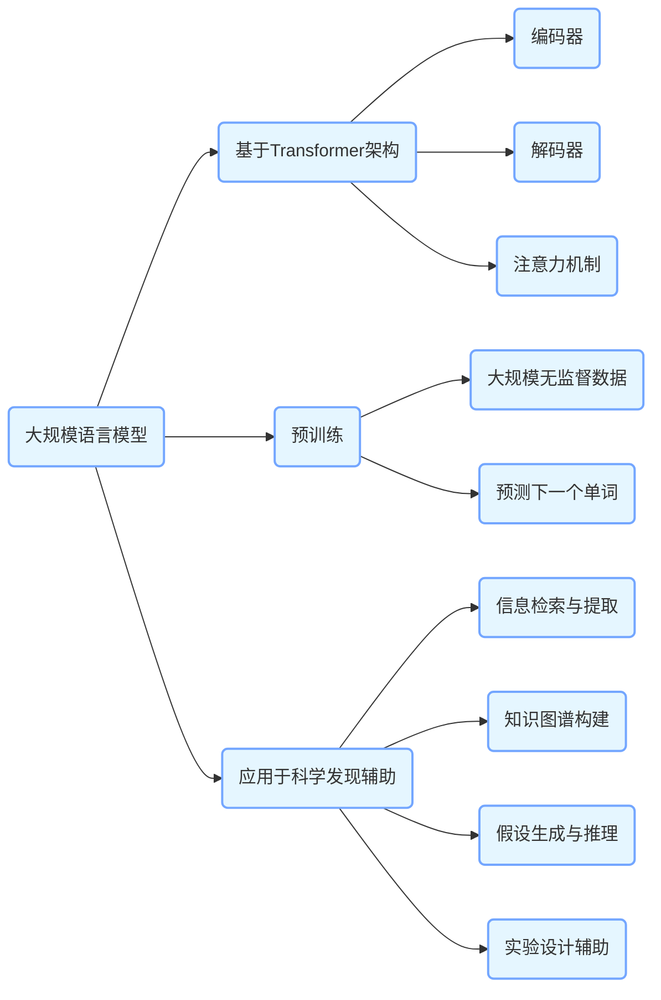

# 大规模语言模型在科学发现辅助中的应用

> 关键词：大规模语言模型、科学发现辅助、自然语言处理、知识图谱、跨学科研究

> 摘要：本文深入探讨了大规模语言模型在科学发现辅助领域的应用。首先介绍了相关背景，包括目的、预期读者等内容。接着阐述了核心概念及其联系，详细讲解了核心算法原理与操作步骤，并结合数学模型和公式进行说明。通过项目实战案例，展示了代码实现与解读。分析了大规模语言模型在不同科学领域的实际应用场景，推荐了相关的学习资源、开发工具框架和论文著作。最后总结了未来发展趋势与挑战，提供了常见问题解答和扩展阅读参考资料，旨在全面呈现大规模语言模型在科学发现辅助中的重要作用和潜力。

## 1. 背景介绍 
### 1.1 目的和范围
本文章的目的在于全面且深入地探讨大规模语言模型在科学发现辅助中的应用。随着科学研究的不断深入和拓展，研究数据呈指数级增长，知识的复杂性和跨学科性日益增强。大规模语言模型凭借其强大的语言理解和生成能力，为科学研究人员提供了新的工具和方法，有望加速科学发现的进程。本文将涵盖大规模语言模型的基本原理、在不同科学领域的应用案例、相关技术的操作步骤以及未来发展趋势等方面，旨在为科研人员、技术开发者和对该领域感兴趣的读者提供全面的参考。

### 1.2 预期读者
预期读者包括但不限于以下几类人群：
- **科研人员**：各学科领域的科研工作者，希望借助大规模语言模型提高研究效率、获取新的研究思路和发现新的科学规律。
- **技术开发者**：从事自然语言处理、人工智能等相关领域的开发者，对将大规模语言模型应用于科学研究感兴趣，期望了解具体的实现方法和技术细节。
- **学生**：相关专业的本科生、研究生，希望通过本文了解大规模语言模型在科学发现中的应用，拓宽学术视野。
- **科技爱好者**：对科学技术发展趋势和新兴技术应用感兴趣的普通读者，希望了解大规模语言模型如何改变科学研究的方式。

### 1.3 文档结构概述
本文将按照以下结构进行组织：
- **核心概念与联系**：介绍大规模语言模型和科学发现辅助的核心概念，阐述它们之间的联系，并通过文本示意图和 Mermaid 流程图进行直观展示。
- **核心算法原理 & 具体操作步骤**：详细讲解大规模语言模型的核心算法原理，使用 Python 源代码进行阐述，并给出具体的操作步骤。
- **数学模型和公式 & 详细讲解 & 举例说明**：介绍相关的数学模型和公式，进行详细讲解，并通过具体的例子进行说明。
- **项目实战：代码实际案例和详细解释说明**：通过实际项目案例，展示如何使用大规模语言模型进行科学发现辅助，包括开发环境搭建、源代码实现和代码解读。
- **实际应用场景**：分析大规模语言模型在不同科学领域的实际应用场景，如物理学、生物学、化学等。
- **工具和资源推荐**：推荐相关的学习资源、开发工具框架和论文著作，帮助读者进一步深入学习和研究。
- **总结：未来发展趋势与挑战**：总结大规模语言模型在科学发现辅助中的应用现状，分析未来发展趋势和面临的挑战。
- **附录：常见问题与解答**：解答读者在阅读过程中可能遇到的常见问题。
- **扩展阅读 & 参考资料**：提供相关的扩展阅读材料和参考资料，方便读者进一步深入研究。

### 1.4 术语表
#### 1.4.1 核心术语定义
- **大规模语言模型（Large Language Model, LLM）**：基于深度学习技术，通过在大规模文本数据上进行训练，学习语言的统计规律和语义信息，从而具备强大的语言理解和生成能力的模型。常见的大规模语言模型包括 GPT - 3、BERT 等。
- **科学发现辅助**：利用各种技术和工具，帮助科研人员在科学研究过程中获取信息、分析数据、提出假设、验证理论等，加速科学发现的进程。
- **自然语言处理（Natural Language Processing, NLP）**：研究如何让计算机理解和处理人类自然语言的技术领域，包括文本分类、信息抽取、机器翻译等任务。
- **知识图谱（Knowledge Graph）**：一种以图的形式表示知识的方法，由实体、属性和关系组成，用于存储和管理大量的结构化知识。

#### 1.4.2 相关概念解释
- **预训练模型**：大规模语言模型通常采用预训练的方式进行训练，即在大规模无监督数据上进行训练，学习语言的通用特征和规律。预训练模型可以作为基础模型，在特定任务上进行微调，以提高模型在该任务上的性能。
- **微调（Fine - tuning）**：在预训练模型的基础上，使用特定任务的标注数据对模型进行进一步训练，调整模型的参数，使其更适合该任务的需求。
- **注意力机制（Attention Mechanism）**：一种在深度学习中广泛应用的机制，用于自动关注输入序列中的重要部分，提高模型的表达能力和性能。

#### 1.4.3 缩略词列表
- **LLM**：Large Language Model，大规模语言模型
- **NLP**：Natural Language Processing，自然语言处理
- **GPT**：Generative Pretrained Transformer，生成式预训练变换器
- **BERT**：Bidirectional Encoder Representations from Transformers，基于变换器的双向编码器表示

## 2. 核心概念与联系 

### 大规模语言模型的原理
大规模语言模型是基于深度学习技术构建的，通常采用Transformer架构。Transformer架构由编码器和解码器组成，其核心是注意力机制。注意力机制允许模型在处理输入序列时，自动关注序列中的重要部分，从而更好地捕捉序列中的长距离依赖关系。

以GPT系列模型为例，它是基于Transformer解码器构建的生成式预训练模型。在预训练阶段，模型在大规模无监督文本数据上进行训练，学习语言的统计规律和语义信息。训练目标通常是预测下一个单词，通过最小化预测损失来优化模型的参数。

### 科学发现辅助的内涵
科学发现辅助是一个综合性的过程，旨在利用各种技术和工具帮助科研人员更高效地进行科学研究。它包括以下几个方面：
- **信息获取**：帮助科研人员从海量的文献、数据中快速准确地获取所需信息。
- **知识整合**：将不同来源的知识进行整合，构建知识图谱，以便更好地理解和利用知识。
- **假设生成**：根据已有的知识和数据，帮助科研人员提出合理的假设。
- **实验设计**：辅助科研人员设计实验方案，提高实验效率和准确性。
- **结果分析**：对实验结果进行分析和解释，发现新的规律和现象。

### 两者的联系
大规模语言模型为科学发现辅助提供了强大的技术支持。具体表现在以下几个方面：
- **信息检索与提取**：大规模语言模型可以理解自然语言查询，从海量的科学文献中检索和提取相关信息，帮助科研人员快速找到所需的资料。
- **知识图谱构建**：通过对文本的语义理解，大规模语言模型可以自动识别实体和关系，为知识图谱的构建提供数据支持。
- **假设生成与推理**：基于对大量科学知识的学习，大规模语言模型可以根据已有的信息提出合理的假设，并进行推理和验证。
- **实验设计辅助**：可以根据实验目的和条件，为科研人员提供实验设计的建议和方案。

### 文本示意图
```plaintext
大规模语言模型
|
|-- 基于Transformer架构
|   |-- 编码器
|   |-- 解码器
|   |-- 注意力机制
|
|-- 预训练
|   |-- 大规模无监督数据
|   |-- 预测下一个单词
|
|-- 应用于科学发现辅助
    |-- 信息检索与提取
    |-- 知识图谱构建
    |-- 假设生成与推理
    |-- 实验设计辅助
```

### Mermaid 流程图


## 3. 核心算法原理 & 具体操作步骤 

### 核心算法原理

#### Transformer架构
Transformer架构是大规模语言模型的核心，它主要由多头注意力机制（Multi - Head Attention）和前馈神经网络（Feed - Forward Network）组成。

多头注意力机制允许模型在不同的表示子空间中关注输入序列的不同部分，从而提高模型的表达能力。其数学公式如下：

多头注意力机制的输入为查询（Query）、键（Key）和值（Value），分别用 $Q$、$K$ 和 $V$ 表示。首先计算注意力分数：

$$
\text{Attention}(Q, K, V) = \text{softmax}\left(\frac{QK^T}{\sqrt{d_k}}\right)V
$$

其中，$d_k$ 是键向量的维度，$\text{softmax}$ 函数用于将注意力分数归一化到 $[0, 1]$ 之间。

多头注意力机制将多个注意力头的输出拼接起来，并通过一个线性变换得到最终的输出：

$$
\text{MultiHead}(Q, K, V) = \text{Concat}(\text{head}_1, \cdots, \text{head}_h)W^O
$$

其中，$\text{head}_i = \text{Attention}(QW_i^Q, KW_i^K, VW_i^V)$，$W_i^Q$、$W_i^K$、$W_i^V$ 和 $W^O$ 是可学习的参数，$h$ 是注意力头的数量。

前馈神经网络是一个简单的两层全连接网络，其计算公式如下：

$$
\text{FFN}(x) = \max(0, xW_1 + b_1)W_2 + b_2
$$

其中，$W_1$、$b_1$、$W_2$ 和 $b_2$ 是可学习的参数。

#### 预训练过程
大规模语言模型的预训练通常采用自监督学习的方式，以预测下一个单词为例，其目标是最大化训练数据中所有单词的预测概率。假设训练数据为一个单词序列 $w_1, w_2, \cdots, w_T$，模型的目标是最小化以下损失函数：

$$
L = -\sum_{t = 1}^{T}\log P(w_t|w_1, \cdots, w_{t - 1})
$$

其中，$P(w_t|w_1, \cdots, w_{t - 1})$ 是模型预测单词 $w_t$ 在给定前面单词 $w_1, \cdots, w_{t - 1}$ 条件下的概率。

### 具体操作步骤

#### 步骤1：数据准备
首先需要收集大规模的文本数据，这些数据可以来自互联网、书籍、期刊等。然后对数据进行预处理，包括分词、去除停用词、转换为数字表示等。

以下是一个简单的 Python 代码示例，使用 `transformers` 库进行数据预处理：

```python
from transformers import AutoTokenizer

# 加载预训练的分词器
tokenizer = AutoTokenizer.from_pretrained('gpt2')

# 示例文本
text = "This is an example sentence."

# 分词
tokens = tokenizer.tokenize(text)

# 转换为数字表示
input_ids = tokenizer.convert_tokens_to_ids(tokens)

print("Tokens:", tokens)
print("Input IDs:", input_ids)
```

#### 步骤2：模型加载
选择合适的预训练模型，并使用 `transformers` 库加载模型。

```python
from transformers import AutoModelForCausalLM

# 加载预训练的模型
model = AutoModelForCausalLM.from_pretrained('gpt2')
```

#### 步骤3：模型微调（可选）
如果需要将模型应用于特定的科学发现辅助任务，可以在预训练模型的基础上进行微调。以下是一个简单的微调示例：

```python
from transformers import TrainingArguments, Trainer
import torch

# 假设已经有了标注好的训练数据
train_dataset = torch.utils.data.TensorDataset(torch.tensor([input_ids]))

# 定义训练参数
training_args = TrainingArguments(
    output_dir='./results',          # 输出目录
    num_train_epochs=3,              # 训练轮数
    per_device_train_batch_size=1,   # 每个设备的训练批次大小
    save_steps=10_000,               # 每多少步保存一次模型
    save_total_limit=2,              # 最多保存的模型数量
    prediction_loss_only=True,
)

# 定义 Trainer
trainer = Trainer(
    model=model,
    args=training_args,
    train_dataset=train_dataset,
)

# 开始训练
trainer.train()
```

#### 步骤4：模型推理
使用微调后的模型进行推理，例如生成文本、回答问题等。

```python
# 输入文本
input_text = "What are the potential applications of large language models in scientific discovery?"

# 分词并转换为数字表示
input_ids = tokenizer.encode(input_text, return_tensors='pt')

# 生成文本
output = model.generate(input_ids, max_length=100, num_return_sequences=1)

# 解码输出
generated_text = tokenizer.decode(output[0], skip_special_tokens=True)

print("Generated text:", generated_text)
```

## 4. 数学模型和公式 & 详细讲解 & 举例说明 

### 注意力机制的数学模型
在前面已经介绍了注意力机制的基本公式：

$$
\text{Attention}(Q, K, V) = \text{softmax}\left(\frac{QK^T}{\sqrt{d_k}}\right)V
$$

#### 详细讲解
- **$QK^T$**：计算查询向量 $Q$ 与键向量 $K$ 的点积，得到注意力分数。点积的结果表示查询向量与每个键向量的相似度，相似度越高，注意力分数越大。
- **$\frac{1}{\sqrt{d_k}}$**：为了防止点积的结果过大，导致 $\text{softmax}$ 函数的梯度消失，需要对注意力分数进行缩放。$\sqrt{d_k}$ 是键向量的维度的平方根。
- **$\text{softmax}$ 函数**：将注意力分数归一化到 $[0, 1]$ 之间，使得所有注意力分数的和为 1。这样可以将注意力集中在输入序列的某些部分。
- **乘以 $V$**：将归一化后的注意力分数与值向量 $V$ 相乘，得到加权和，作为注意力机制的输出。

#### 举例说明
假设查询向量 $Q$、键向量 $K$ 和值向量 $V$ 分别为：

$$
Q = \begin{bmatrix}
1 & 2 & 3
\end{bmatrix}
$$

$$
K = \begin{bmatrix}
4 & 5 & 6 \\
7 & 8 & 9 \\
10 & 11 & 12
\end{bmatrix}
$$

$$
V = \begin{bmatrix}
13 & 14 & 15 \\
16 & 17 & 18 \\
19 & 20 & 21
\end{bmatrix}
$$

首先计算 $QK^T$：

$$
QK^T = \begin{bmatrix}
1 & 2 & 3
\end{bmatrix}
\begin{bmatrix}
4 & 7 & 10 \\
5 & 8 & 11 \\
6 & 9 & 12
\end{bmatrix}
= \begin{bmatrix}
32 & 43 & 54
\end{bmatrix}
$$

假设 $d_k = 3$，则 $\sqrt{d_k}=\sqrt{3}\approx1.732$。对注意力分数进行缩放：

$$
\frac{QK^T}{\sqrt{d_k}} = \begin{bmatrix}
\frac{32}{1.732} & \frac{43}{1.732} & \frac{54}{1.732}
\end{bmatrix}
\approx \begin{bmatrix}
18.48 & 24.83 & 31.18
\end{bmatrix}
$$

使用 $\text{softmax}$ 函数进行归一化：

$$
\text{softmax}\left(\frac{QK^T}{\sqrt{d_k}}\right) = \begin{bmatrix}
\frac{e^{18.48}}{e^{18.48}+e^{24.83}+e^{31.18}} & \frac{e^{24.83}}{e^{18.48}+e^{24.83}+e^{31.18}} & \frac{e^{31.18}}{e^{18.48}+e^{24.83}+e^{31.18}}
\end{bmatrix}
\approx \begin{bmatrix}
0.00 & 0.01 & 0.99
\end{bmatrix}
$$

最后乘以 $V$ 得到注意力机制的输出：

$$
\text{Attention}(Q, K, V) = \begin{bmatrix}
0.00 & 0.01 & 0.99
\end{bmatrix}
\begin{bmatrix}
13 & 14 & 15 \\
16 & 17 & 18 \\
19 & 20 & 21
\end{bmatrix}
\approx \begin{bmatrix}
18.85 & 19.80 & 20.75
\end{bmatrix}
$$

### 损失函数的数学模型
在预训练阶段，以预测下一个单词为例，损失函数为：

$$
L = -\sum_{t = 1}^{T}\log P(w_t|w_1, \cdots, w_{t - 1})
$$

#### 详细讲解
- **$P(w_t|w_1, \cdots, w_{t - 1})$**：表示模型预测单词 $w_t$ 在给定前面单词 $w_1, \cdots, w_{t - 1}$ 条件下的概率。这个概率是通过模型的输出经过 $\text{softmax}$ 函数得到的。
- **$\log$ 函数**：取对数是为了将概率转换为对数概率，方便计算和优化。对数函数是单调递增的，因此最大化概率等价于最大化对数概率。
- **负号**：为了将最大化问题转换为最小化问题，需要加上负号。
- **求和**：对所有单词的对数概率求和，得到整个序列的损失。

#### 举例说明
假设训练数据为一个单词序列 $w_1, w_2, w_3$，模型预测 $w_2$ 在给定 $w_1$ 条件下的概率为 $P(w_2|w_1) = 0.8$，预测 $w_3$ 在给定 $w_1, w_2$ 条件下的概率为 $P(w_3|w_1, w_2) = 0.6$。则损失函数为：

$$
L = -\log P(w_2|w_1) - \log P(w_3|w_1, w_2)
= -\log 0.8 - \log 0.6
\approx 0.223 + 0.511
= 0.734
$$

## 5. 项目实战：代码实际案例和详细解释说明 

### 5.1  开发环境搭建
#### 安装 Python
首先需要安装 Python 环境，建议使用 Python 3.7 及以上版本。可以从 Python 官方网站（https://www.python.org/downloads/）下载并安装。

#### 创建虚拟环境
为了避免不同项目之间的依赖冲突，建议使用虚拟环境。可以使用 `venv` 模块创建虚拟环境：

```bash
python -m venv myenv
```

激活虚拟环境：

- 在 Windows 上：
```bash
myenv\Scripts\activate
```

- 在 Linux 或 macOS 上：
```bash
source myenv/bin/activate
```

#### 安装依赖库
安装 `transformers`、`torch` 等必要的库：

```bash
pip install transformers torch
```

### 5.2  源代码详细实现和代码解读
#### 问题回答系统
以下是一个简单的基于大规模语言模型的问题回答系统的代码示例：

```python
from transformers import AutoTokenizer, AutoModelForQuestionAnswering
import torch

# 加载预训练的分词器和模型
tokenizer = AutoTokenizer.from_pretrained('bert-large-uncased-whole-word-masking-finetuned-squad')
model = AutoModelForQuestionAnswering.from_pretrained('bert-large-uncased-whole-word-masking-finetuned-squad')

# 示例文本和问题
context = "Large language models have shown great potential in various fields, especially in scientific discovery. They can help researchers access relevant information more quickly and generate new hypotheses."
question = "What can large language models do in scientific discovery?"

# 分词并转换为数字表示
inputs = tokenizer(question, context, return_tensors='pt')

# 模型推理
outputs = model(**inputs)

# 获取答案的起始和结束位置
answer_start_scores = outputs.start_logits
answer_end_scores = outputs.end_logits
answer_start = torch.argmax(answer_start_scores)
answer_end = torch.argmax(answer_end_scores) + 1

# 解码答案
answer = tokenizer.convert_tokens_to_string(tokenizer.convert_ids_to_tokens(inputs['input_ids'][0][answer_start:answer_end]))

print("Answer:", answer)
```

#### 代码解读
- **加载预训练的分词器和模型**：使用 `AutoTokenizer` 和 `AutoModelForQuestionAnswering` 从 `transformers` 库中加载预训练的分词器和问题回答模型。这里使用的是 `bert-large-uncased-whole-word-masking-finetuned-squad` 模型，它是在 SQuAD 数据集上微调过的 BERT 模型。
- **准备输入数据**：将问题和上下文文本作为输入，使用分词器将其转换为数字表示。
- **模型推理**：将输入数据传递给模型，得到答案的起始和结束位置的分数。
- **获取答案**：通过 `torch.argmax` 函数找到分数最大的位置，作为答案的起始和结束位置。
- **解码答案**：将答案的数字表示转换为文本形式。

### 5.3  代码解读与分析
#### 优点
- **简单易用**：使用 `transformers` 库可以方便地加载预训练模型，并进行推理。
- **效果较好**：预训练模型在大规模数据上进行了训练，具有较强的语言理解和生成能力，能够在一定程度上回答科学相关的问题。

#### 缺点
- **数据依赖**：模型的性能依赖于训练数据的质量和规模。如果训练数据中缺乏科学领域的知识，模型在科学发现辅助中的表现可能不佳。
- **缺乏推理能力**：模型主要是基于统计规律进行预测，缺乏真正的推理和理解能力，可能会给出一些不准确或不合理的答案。

## 6. 实际应用场景 

### 物理学领域
- **文献检索与知识整合**：大规模语言模型可以帮助物理学家从海量的物理学文献中快速检索和提取相关信息，整合不同文献中的知识，构建物理学知识图谱。例如，在研究量子力学时，模型可以帮助查找关于量子纠缠、量子计算等方面的最新研究成果，并将相关知识进行关联和整合。
- **理论推导与假设生成**：基于对大量物理学理论和实验数据的学习，模型可以辅助物理学家进行理论推导和假设生成。例如，在研究宇宙学模型时，模型可以根据已有的宇宙观测数据，提出新的宇宙演化模型假设。
- **实验设计辅助**：根据实验目的和条件，模型可以为物理学家提供实验设计的建议和方案。例如，在设计粒子加速器实验时，模型可以考虑加速器的参数、粒子的性质等因素，优化实验方案，提高实验效率。

### 生物学领域
- **基因序列分析**：大规模语言模型可以对基因序列进行分析，预测基因的功能和表达模式。例如，通过对大量基因序列数据的学习，模型可以识别基因中的调控元件，预测基因在不同环境条件下的表达水平。
- **药物研发**：在药物研发过程中，模型可以帮助筛选潜在的药物靶点，预测药物的疗效和副作用。例如，通过分析蛋白质的结构和功能，模型可以预测药物与蛋白质的相互作用，为药物设计提供指导。
- **生物进化研究**：模型可以分析生物进化过程中的基因变异和物种演化关系，帮助生物学家理解生物进化的机制。例如，通过对不同物种的基因序列进行比较，模型可以重建生物进化树，推断物种之间的亲缘关系。

### 化学领域
- **分子结构预测**：大规模语言模型可以根据分子的化学式和相关信息，预测分子的结构和性质。例如，在研究有机化合物时，模型可以预测分子的空间结构、化学键的性质等，为有机合成提供指导。
- **化学反应预测**：模型可以分析化学反应的条件和反应物的性质，预测化学反应的产物和反应路径。例如，在研究催化反应时，模型可以预测催化剂的活性和选择性，优化反应条件，提高反应效率。
- **材料设计**：在材料科学领域，模型可以帮助设计新型材料。例如，通过对材料的原子结构和性能进行学习，模型可以预测材料的力学、电学、光学等性能，为材料的设计和制备提供理论支持。

## 7. 工具和资源推荐
### 7.1 学习资源推荐
#### 7.1.1 书籍推荐
- 《深度学习》（Deep Learning）：由 Ian Goodfellow、Yoshua Bengio 和 Aaron Courville 编写，是深度学习领域的经典教材，涵盖了神经网络、卷积神经网络、循环神经网络等内容，对理解大规模语言模型的原理有很大帮助。
- 《自然语言处理入门》：介绍了自然语言处理的基本概念、方法和技术，包括分词、词性标注、命名实体识别、文本分类等任务，适合初学者入门。
- 《人工智能：一种现代的方法》（Artificial Intelligence: A Modern Approach）：全面介绍了人工智能的各个领域，包括搜索算法、知识表示、机器学习、自然语言处理等，是人工智能领域的权威教材。

#### 7.1.2 在线课程
- Coursera 上的 “Deep Learning Specialization”：由 Andrew Ng 教授讲授，包括五门课程，涵盖了深度学习的基础、卷积神经网络、循环神经网络等内容，是学习深度学习的优质课程。
- edX 上的 “Natural Language Processing with Deep Learning”：介绍了自然语言处理中深度学习的应用，包括词嵌入、循环神经网络、注意力机制等内容，适合有一定深度学习基础的学习者。
- 哔哩哔哩上的相关视频教程：有很多博主分享了关于大规模语言模型和自然语言处理的教程，内容丰富多样，可以根据自己的需求选择学习。

#### 7.1.3 技术博客和网站
- Hugging Face Blog：Hugging Face 是一家专注于自然语言处理的公司，其博客上经常分享关于大规模语言模型的最新研究成果、技术应用和使用教程。
- Towards Data Science：是一个数据科学和机器学习领域的博客平台，有很多关于大规模语言模型的文章，涵盖了模型原理、应用案例、代码实现等方面。
- arXiv：是一个预印本数据库，收录了大量的学术论文，包括人工智能、自然语言处理等领域的最新研究成果。

### 7.2 开发工具框架推荐
#### 7.2.1 IDE和编辑器
- PyCharm：是一款专业的 Python 集成开发环境，具有代码编辑、调试、版本控制等功能，适合开发大规模的 Python 项目。
- Jupyter Notebook：是一个交互式的开发环境，支持 Python、R 等多种编程语言，适合进行数据分析、模型训练和实验验证。
- Visual Studio Code：是一款轻量级的代码编辑器，支持多种编程语言和插件扩展，具有丰富的代码编辑和调试功能。

#### 7.2.2 调试和性能分析工具
- TensorBoard：是 TensorFlow 提供的可视化工具，可以用于监控模型的训练过程、可视化模型的结构和性能指标。
- PyTorch Profiler：是 PyTorch 提供的性能分析工具，可以帮助开发者分析模型的运行时间、内存使用情况等，优化模型的性能。
- cProfile：是 Python 内置的性能分析工具，可以分析 Python 代码的运行时间和函数调用情况，帮助开发者找出代码中的性能瓶颈。

#### 7.2.3 相关框架和库
- Transformers：是 Hugging Face 开发的一个自然语言处理库，提供了大量的预训练模型和工具，方便开发者进行模型加载、微调、推理等操作。
- PyTorch：是一个开源的深度学习框架，具有动态图和静态图两种模式，支持 GPU 加速，广泛应用于自然语言处理、计算机视觉等领域。
- TensorFlow：是 Google 开发的一个开源的深度学习框架，具有强大的分布式训练和部署能力，提供了丰富的工具和库，适合大规模的深度学习项目。

### 7.3 相关论文著作推荐
#### 7.3.1 经典论文
- “Attention Is All You Need”：提出了 Transformer 架构，是大规模语言模型的基础，对自然语言处理和深度学习领域产生了深远的影响。
- “BERT: Pre-training of Deep Bidirectional Transformers for Language Understanding”：介绍了 BERT 模型，通过双向预训练的方式学习语言的表示，在多个自然语言处理任务上取得了优异的成绩。
- “Generative Pretrained Transformer 3 (GPT - 3): Language Models are Few - Shot Learners”：介绍了 GPT - 3 模型，展示了大规模语言模型在少样本学习和自然语言生成方面的强大能力。

#### 7.3.2 最新研究成果
- 关注 arXiv 上关于大规模语言模型和科学发现辅助的最新论文，了解该领域的最新研究动态和技术进展。
- 参加相关的学术会议，如 ACL（Association for Computational Linguistics）、NeurIPS（Neural Information Processing Systems）等，听取专家的报告和研究成果分享。

#### 7.3.3 应用案例分析
- 一些学术期刊和会议论文集中会有关于大规模语言模型在科学发现辅助中的应用案例分析，例如《Nature》、《Science》等期刊上的相关文章，可以从中学习到实际应用中的经验和方法。

## 8. 总结：未来发展趋势与挑战

### 未来发展趋势
- **多模态融合**：未来的大规模语言模型将不仅仅局限于处理文本信息，还将融合图像、音频、视频等多模态信息，实现更加全面和深入的科学发现辅助。例如，在生物学研究中，结合基因序列数据、蛋白质结构图像和生物实验视频等多模态信息，提高对生物系统的理解和认识。
- **跨学科应用**：随着科学研究的不断发展，跨学科研究越来越受到重视。大规模语言模型将在跨学科研究中发挥重要作用，帮助科研人员整合不同学科的知识，发现新的研究方向和问题。例如，在环境科学和经济学的交叉领域，模型可以分析环境政策对经济发展的影响，为政策制定提供科学依据。
- **个性化服务**：根据科研人员的研究领域、兴趣和需求，为其提供个性化的科学发现辅助服务。例如，为物理学家提供关于特定物理学领域的最新研究成果和文献推荐，为化学家提供个性化的分子设计方案。
- **强化学习与主动学习**：结合强化学习和主动学习技术，让大规模语言模型能够主动地探索知识空间，提出有价值的问题和假设，并通过与环境的交互不断优化自身的性能。例如，在药物研发中，模型可以主动设计实验方案，根据实验结果调整药物设计策略。

### 面临的挑战
- **数据质量和隐私问题**：大规模语言模型的训练需要大量的数据，但数据的质量和隐私问题是一个挑战。低质量的数据可能会导致模型的性能下降，而隐私问题可能会限制数据的获取和使用。例如，在医学研究中，涉及患者隐私的数据需要严格保护，如何在保护隐私的前提下利用这些数据训练模型是一个亟待解决的问题。
- **模型可解释性**：大规模语言模型通常是基于深度学习技术构建的，其内部结构和决策过程较为复杂，缺乏可解释性。在科学发现中，科研人员需要理解模型的决策依据，以便对结果进行评估和验证。因此，提高模型的可解释性是一个重要的挑战。
- **计算资源需求**：训练和运行大规模语言模型需要大量的计算资源，包括高性能的 GPU 和大规模的计算集群。这不仅增加了成本，还对能源消耗和环境造成了压力。如何降低计算资源需求，提高模型的效率是一个需要解决的问题。
- **伦理和社会影响**：大规模语言模型的应用可能会带来一些伦理和社会问题，例如虚假信息传播、偏见和歧视等。在科学发现辅助中，需要确保模型的应用符合伦理和法律规范，避免对社会造成不良影响。

## 9. 附录：常见问题与解答
### 问题1：大规模语言模型在科学发现辅助中的准确性如何保证？
答：保证大规模语言模型在科学发现辅助中的准确性可以从以下几个方面入手：
- **数据质量**：使用高质量、准确的训练数据，对数据进行严格的清洗和预处理，去除噪声和错误信息。
- **模型选择和微调**：选择适合科学发现任务的预训练模型，并在特定的科学数据集上进行微调，以提高模型在该任务上的性能。
- **多模型融合**：结合多个不同的模型进行预测和推理，综合多个模型的结果，提高准确性。
- **人工验证和审核**：对于模型给出的结果，进行人工验证和审核，确保结果的合理性和准确性。

### 问题2：如何将大规模语言模型应用于自己的科学研究领域？
答：将大规模语言模型应用于自己的科学研究领域可以按照以下步骤进行：
- **明确需求**：确定自己在科学研究中需要解决的问题，例如信息检索、假设生成、实验设计等。
- **数据准备**：收集和整理与研究领域相关的数据，对数据进行预处理，使其适合模型的输入。
- **模型选择和微调**：选择合适的预训练模型，并在自己的数据上进行微调，使其适应研究领域的特点。
- **模型应用和评估**：将微调后的模型应用于实际的科学研究任务中，并对模型的性能进行评估和优化。

### 问题3：大规模语言模型是否会取代科研人员？
答：大规模语言模型不会取代科研人员，而是作为科研人员的辅助工具，帮助他们更高效地进行科学研究。虽然模型具有强大的语言理解和生成能力，但它缺乏真正的创新思维、实验设计能力和对科学问题的深入理解。科研人员仍然需要运用自己的专业知识和经验，对模型的结果进行分析和判断，提出新的研究思路和假设。

### 问题4：如何解决大规模语言模型的计算资源需求问题？
答：可以从以下几个方面解决大规模语言模型的计算资源需求问题：
- **模型压缩**：采用模型压缩技术，如剪枝、量化等，减少模型的参数数量和计算量，降低对计算资源的需求。
- **分布式训练**：使用分布式训练技术，将模型的训练任务分布到多个计算节点上进行并行计算，提高训练效率。
- **云服务**：利用云服务提供商的计算资源，如 Amazon Web Services、Google Cloud Platform 等，按需使用计算资源，降低成本。
- **算法优化**：研究和开发更加高效的算法，减少模型训练和推理过程中的计算量。

## 10. 扩展阅读 & 参考资料
### 扩展阅读
- 《科学发现的逻辑》（The Logic of Scientific Discovery）：由卡尔·波普尔（Karl Popper）所著，探讨了科学发现的逻辑和方法，对理解科学研究的本质有很大帮助。
- 《人工智能时代与人类未来》：介绍了人工智能的发展现状和未来趋势，以及人工智能对人类社会的影响，适合对人工智能感兴趣的读者阅读。
- 《复杂科学与管理》：探讨了复杂科学在管理领域的应用，对于理解跨学科研究和复杂系统的分析有一定的启示作用。

### 参考资料
- Hugging Face 官方文档：https://huggingface.co/docs/transformers/index
- PyTorch 官方文档：https://pytorch.org/docs/stable/index.html
- TensorFlow 官方文档：https://www.tensorflow.org/api_docs

作者：AI天才研究院/AI Genius Institute & 禅与计算机程序设计艺术 /Zen And The Art of Computer Programming