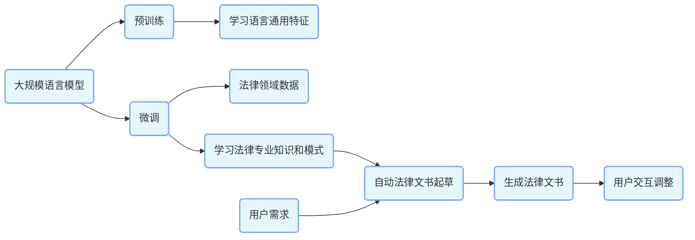

# 大规模语言模型在自动法律文书起草中的应用

> 关键词：大规模语言模型、自动法律文书起草、自然语言处理、法律科技、人工智能应用

> 摘要：本文深入探讨了大规模语言模型在自动法律文书起草中的应用。首先介绍了相关背景，包括研究目的、预期读者、文档结构和术语定义。接着阐述了核心概念及其联系，分析了核心算法原理和具体操作步骤，并给出了Python代码示例。同时，介绍了相关数学模型和公式，通过项目实战展示了代码实现和解读。之后探讨了实际应用场景，推荐了学习资源、开发工具和相关论文。最后总结了未来发展趋势与挑战，提供了常见问题解答和扩展阅读参考资料，旨在为相关领域的研究者和从业者提供全面的技术指导和深入的思考。

## 1. 背景介绍 
### 1.1 目的和范围
随着人工智能技术的飞速发展，大规模语言模型如ChatGPT、文心一言等展现出了强大的自然语言处理能力。本研究的目的在于探索如何将这些大规模语言模型应用于自动法律文书起草领域，以提高法律文书起草的效率和质量。研究范围涵盖了大规模语言模型的核心原理、在法律文书起草中的具体应用方式、相关算法实现以及实际应用场景等方面。

### 1.2 预期读者
本文预期读者包括法律行业从业者（如律师、法官、法务人员等）、人工智能领域的研究者和开发者、对法律科技感兴趣的学者以及相关领域的学生。对于法律行业从业者，希望能够帮助他们了解如何借助大规模语言模型提升工作效率；对于人工智能领域的人员，旨在提供在法律场景下应用大规模语言模型的技术思路。

### 1.3 文档结构概述
本文首先介绍背景信息，包括研究目的、预期读者和文档结构等。接着阐述大规模语言模型和自动法律文书起草的核心概念及其联系，分析核心算法原理并给出Python代码实现。然后介绍相关数学模型和公式，通过项目实战展示代码的实际应用。之后探讨实际应用场景，推荐学习资源、开发工具和相关论文。最后总结未来发展趋势与挑战，提供常见问题解答和扩展阅读参考资料。

### 1.4 术语表
#### 1.4.1 核心术语定义
- **大规模语言模型（Large Language Model, LLM）**：是一种基于深度学习的自然语言处理模型，通过在大规模文本数据上进行训练，学习语言的统计规律和语义信息，能够生成自然流畅的文本。
- **自动法律文书起草（Automated Legal Document Drafting）**：利用计算机技术和人工智能算法，自动生成符合法律规范和业务需求的法律文书。
- **自然语言处理（Natural Language Processing, NLP）**：是人工智能的一个重要分支，旨在让计算机理解、处理和生成人类语言。

#### 1.4.2 相关概念解释
- **预训练模型**：大规模语言模型通常采用预训练的方式，在大规模无监督文本数据上进行训练，学习语言的通用特征和模式。
- **微调（Fine-tuning）**：在预训练模型的基础上，使用特定领域的数据集对模型进行进一步训练，使其适应特定任务的需求。
- **法律知识图谱**：是一种将法律知识以图的形式表示的结构化数据库，包含法律概念、法条、案例等信息，可用于辅助法律文书起草。

#### 1.4.3 缩略词列表
- **LLM**：Large Language Model（大规模语言模型）
- **NLP**：Natural Language Processing（自然语言处理）
- **API**：Application Programming Interface（应用程序编程接口）

## 2. 核心概念与联系 
### 2.1 大规模语言模型的原理
大规模语言模型基于深度学习中的Transformer架构，Transformer架构由编码器和解码器组成，其核心是注意力机制（Attention Mechanism）。注意力机制能够让模型在处理序列数据时，自动关注序列中不同位置的重要性，从而更好地捕捉序列中的长距离依赖关系。

大规模语言模型通常采用无监督学习的方式，在大规模文本数据上进行预训练。预训练的目标是根据输入的文本预测下一个单词或字符，通过不断优化模型参数，使模型能够学习到语言的统计规律和语义信息。

### 2.2 自动法律文书起草的需求和挑战
自动法律文书起草的需求主要源于提高法律工作效率、减少人为错误和提高文书质量。然而，法律文书具有专业性强、规范性高、格式复杂等特点，给自动法律文书起草带来了诸多挑战。例如，法律术语的准确理解和使用、法律条文的正确引用、文书格式的规范要求等。

### 2.3 大规模语言模型与自动法律文书起草的联系
大规模语言模型可以为自动法律文书起草提供强大的自然语言处理能力。通过在大规模法律文本数据上进行微调，大规模语言模型可以学习到法律领域的专业知识和语言模式，从而能够生成符合法律规范和业务需求的法律文书。同时，大规模语言模型的交互性和灵活性也使得用户可以根据具体需求对生成的文书进行调整和修改。

### 2.4 核心概念原理和架构的文本示意图
```plaintext
大规模语言模型
|
|-- 预训练（大规模文本数据）
|   |-- 学习语言通用特征
|
|-- 微调（法律领域数据）
|   |-- 学习法律专业知识和模式
|
|-- 自动法律文书起草
    |-- 输入用户需求
    |-- 生成法律文书
    |-- 用户交互调整
```

### 2.5 Mermaid流程图


## 3. 核心算法原理 & 具体操作步骤 
### 3.1 核心算法原理
大规模语言模型在自动法律文书起草中的核心算法主要基于Transformer架构和注意力机制。Transformer架构由多个编码器和解码器层组成，每个层包含多头注意力机制（Multi-Head Attention）和前馈神经网络（Feed-Forward Network）。

多头注意力机制允许模型在不同的表示子空间中关注输入序列的不同部分，从而提高模型的表达能力。前馈神经网络则对多头注意力机制的输出进行非线性变换，进一步提取特征。

在生成法律文书时，模型采用自回归的方式，根据已生成的文本预测下一个单词或字符，直到生成完整的文书。

### 3.2 具体操作步骤
#### 3.2.1 数据准备
收集大规模的法律文本数据，包括法律条文、案例、法律文书等。对数据进行清洗、预处理，去除噪声和无关信息，并将数据转换为适合模型输入的格式。

#### 3.2.2 模型选择和预训练
选择合适的大规模语言模型，如GPT系列、BERT系列等。使用预训练好的模型作为基础，这些模型已经在大规模无监督文本数据上进行了训练，学习到了语言的通用特征。

#### 3.2.3 微调模型
使用准备好的法律领域数据对预训练模型进行微调。在微调过程中，调整模型的参数，使其适应法律文书起草的任务。可以采用监督学习的方式，为模型提供输入（用户需求）和对应的输出（法律文书），通过最小化损失函数来优化模型。

#### 3.2.4 生成法律文书
将用户的需求输入到微调后的模型中，模型根据输入生成法律文书。可以通过设置不同的生成参数，如温度、最大长度等，来控制生成文书的风格和长度。

#### 3.2.5 用户交互和调整
用户可以对生成的法律文书进行检查和修改，根据实际需求提出反馈意见。模型可以根据用户的反馈进行进一步的调整和优化，生成更符合用户需求的法律文书。

### 3.3 Python源代码示例
```python
import torch
from transformers import GPT2LMHeadModel, GPT2Tokenizer

# 加载预训练模型和分词器
model_name = "gpt2"
tokenizer = GPT2Tokenizer.from_pretrained(model_name)
model = GPT2LMHeadModel.from_pretrained(model_name)

# 准备输入文本
input_text = "起草一份简单的租赁合同"
input_ids = tokenizer.encode(input_text, return_tensors="pt")

# 生成文本
output = model.generate(input_ids, max_length=500, num_beams=5, no_repeat_ngram_size=2, early_stopping=True)

# 解码生成的文本
generated_text = tokenizer.decode(output[0], skip_special_tokens=True)

print(generated_text)
```
### 代码解释
1. **加载预训练模型和分词器**：使用`transformers`库加载GPT2模型和对应的分词器。
2. **准备输入文本**：将用户的需求转换为模型可以接受的输入格式。
3. **生成文本**：使用`generate`方法生成法律文书，设置了最大长度、束搜索的束数、避免重复的n-gram大小等参数。
4. **解码生成的文本**：将模型生成的token序列解码为自然语言文本并输出。

## 4. 数学模型和公式 & 详细讲解 & 举例说明 
### 4.1 注意力机制的数学模型
注意力机制的核心是计算查询（Query）、键（Key）和值（Value）之间的相似度，从而确定每个位置的权重。具体公式如下：

$$
\text{Attention}(Q, K, V) = \text{softmax}\left(\frac{QK^T}{\sqrt{d_k}}\right)V
$$

其中，$Q$ 是查询矩阵，$K$ 是键矩阵，$V$ 是值矩阵，$d_k$ 是键向量的维度。$\frac{QK^T}{\sqrt{d_k}}$ 计算查询和键之间的相似度得分，通过softmax函数将得分转换为概率分布，最后与值矩阵相乘得到注意力输出。

### 4.2 多头注意力机制的数学模型
多头注意力机制将注意力机制扩展到多个头，每个头独立计算注意力输出，然后将这些输出拼接起来并进行线性变换。公式如下：

$$
\text{MultiHead}(Q, K, V) = \text{Concat}(\text{head}_1, \ldots, \text{head}_h)W^O
$$

其中，$\text{head}_i = \text{Attention}(QW_i^Q, KW_i^K, VW_i^V)$，$W_i^Q$、$W_i^K$、$W_i^V$ 是每个头的投影矩阵，$W^O$ 是最终的投影矩阵。

### 4.3 举例说明
假设我们有一个输入序列 $x = [x_1, x_2, x_3]$，每个元素的维度为 $d$。我们将输入序列分别投影到查询、键和值空间，得到 $Q$、$K$ 和 $V$ 矩阵。

设 $d_k = d$，计算相似度得分矩阵 $S = \frac{QK^T}{\sqrt{d_k}}$：

$$
S = \begin{bmatrix}
s_{11} & s_{12} & s_{13} \\
s_{21} & s_{22} & s_{23} \\
s_{31} & s_{32} & s_{33}
\end{bmatrix}
$$

其中，$s_{ij}$ 表示第 $i$ 个查询和第 $j$ 个键之间的相似度得分。

然后，通过softmax函数将得分矩阵转换为概率分布：

$$
P = \text{softmax}(S) = \begin{bmatrix}
p_{11} & p_{12} & p_{13} \\
p_{21} & p_{22} & p_{23} \\
p_{31} & p_{32} & p_{33}
\end{bmatrix}
$$

最后，计算注意力输出：

$$
\text{Attention}(Q, K, V) = PV
$$

多头注意力机制则是将上述过程重复多次，每个头的计算结果拼接起来并进行线性变换。

## 5. 项目实战：代码实际案例和详细解释说明 
### 5.1 开发环境搭建
#### 5.1.1 安装Python
首先需要安装Python，建议使用Python 3.7及以上版本。可以从Python官方网站（https://www.python.org/downloads/）下载并安装。

#### 5.1.2 安装依赖库
使用`pip`安装必要的依赖库，包括`transformers`、`torch`等。可以使用以下命令进行安装：
```sh
pip install transformers torch
```

#### 5.1.3 配置开发环境
可以使用任何喜欢的集成开发环境（IDE），如PyCharm、VS Code等。创建一个新的Python项目，并将上述依赖库添加到项目的虚拟环境中。

### 5.2 源代码详细实现和代码解读
```python
import torch
from transformers import GPT2LMHeadModel, GPT2Tokenizer

# 加载预训练模型和分词器
model_name = "gpt2"
tokenizer = GPT2Tokenizer.from_pretrained(model_name)
model = GPT2LMHeadModel.from_pretrained(model_name)

# 准备输入文本
input_text = "起草一份简单的租赁合同"
input_ids = tokenizer.encode(input_text, return_tensors="pt")

# 生成文本
output = model.generate(
    input_ids,
    max_length=500,
    num_beams=5,
    no_repeat_ngram_size=2,
    early_stopping=True
)

# 解码生成的文本
generated_text = tokenizer.decode(output[0], skip_special_tokens=True)

# 保存生成的文本到文件
with open("lease_contract.txt", "w", encoding="utf-8") as f:
    f.write(generated_text)

print("租赁合同已生成并保存到 lease_contract.txt")
```
### 代码解读
1. **导入必要的库**：导入`torch`和`transformers`库中的相关模块。
2. **加载预训练模型和分词器**：使用`GPT2Tokenizer`和`GPT2LMHeadModel`加载预训练的GPT2模型和分词器。
3. **准备输入文本**：将用户的需求转换为模型可以接受的输入格式，使用`tokenizer.encode`方法将文本编码为token序列。
4. **生成文本**：使用`model.generate`方法生成法律文书，设置了最大长度、束搜索的束数、避免重复的n-gram大小等参数。
5. **解码生成的文本**：使用`tokenizer.decode`方法将模型生成的token序列解码为自然语言文本。
6. **保存生成的文本**：将生成的法律文书保存到文件中，方便后续查看和使用。

### 5.3 代码解读与分析
#### 5.3.1 模型选择
选择GPT2模型是因为它在自然语言生成任务中表现出色，并且有预训练的权重可以使用。如果需要更强大的模型，可以考虑使用GPT-3、ChatGPT等，但这些模型通常需要通过API进行调用。

#### 5.3.2 生成参数设置
- `max_length`：设置生成文本的最大长度，避免生成过长或过短的文书。
- `num_beams`：束搜索的束数，增加束数可以提高生成文本的质量，但会增加计算时间。
- `no_repeat_ngram_size`：避免生成重复的n-gram，防止生成的文本出现重复的内容。
- `early_stopping`：当生成的文本达到一定条件时提前停止生成，提高生成效率。

#### 5.3.3 局限性和改进方向
上述代码只是一个简单的示例，生成的法律文书可能存在格式不规范、内容不准确等问题。为了提高生成文书的质量，可以进行以下改进：
- **微调模型**：使用法律领域的数据集对模型进行微调，使模型学习到更多的法律专业知识和语言模式。
- **引入法律知识图谱**：将法律知识图谱与模型结合，为模型提供更准确的法律信息和推理能力。
- **用户交互和反馈机制**：建立用户交互和反馈机制，让用户可以对生成的文书进行修改和调整，提高文书的满意度。

## 6. 实际应用场景 
### 6.1 律师事务所
在律师事务所中，律师需要处理大量的法律文书起草工作，如合同、起诉状、答辩状等。大规模语言模型可以帮助律师快速生成初稿，提高工作效率。律师可以根据具体情况对生成的文书进行修改和完善，节省时间和精力。

### 6.2 企业法务部门
企业法务部门需要处理各种合同起草、审查等工作。使用大规模语言模型可以自动生成符合企业需求和法律规范的合同，减少人工错误，提高合同的质量和一致性。同时，模型可以根据企业的历史合同数据进行学习和优化，提供更个性化的服务。

### 6.3 司法机关
司法机关在处理案件时需要撰写判决书、裁定书等法律文书。大规模语言模型可以辅助法官快速生成文书的初稿，提高文书的撰写效率和质量。同时，模型可以对法律条文进行准确引用和解释，保证文书的合法性和公正性。

### 6.4 法律教育领域
在法律教育领域，大规模语言模型可以作为教学工具，帮助学生学习法律文书的起草方法和技巧。学生可以通过输入不同的需求，让模型生成相应的法律文书，然后进行分析和学习。同时，模型可以提供实时反馈和建议，帮助学生提高写作能力。

## 7. 工具和资源推荐
### 7.1 学习资源推荐
#### 7.1.1 书籍推荐
- 《自然语言处理入门》：介绍了自然语言处理的基本概念、算法和技术，适合初学者入门。
- 《深度学习》：详细讲解了深度学习的原理和方法，包括神经网络、卷积神经网络、循环神经网络等，对理解大规模语言模型的原理有很大帮助。
- 《法律人工智能》：探讨了人工智能在法律领域的应用，包括自动法律文书起草、法律推理、法律检索等方面的内容。

#### 7.1.2 在线课程
- Coursera上的“Natural Language Processing Specialization”：由斯坦福大学的教授授课，涵盖了自然语言处理的各个方面，包括词法分析、句法分析、语义分析、文本生成等。
- edX上的“Introduction to Artificial Intelligence”：介绍了人工智能的基本概念、算法和应用，对了解大规模语言模型的背景和原理有帮助。
- 中国大学MOOC上的“法律人工智能”：由国内高校的教授授课，结合法律领域的实际案例，介绍了人工智能在法律中的应用。

#### 7.1.3 技术博客和网站
- Hugging Face官方博客：提供了关于大规模语言模型和自然语言处理的最新技术和研究成果，以及使用Hugging Face库的教程和示例。
- arXiv：一个预印本论文库，包含了大量关于人工智能和自然语言处理的最新研究论文，可以及时了解该领域的前沿动态。
- 机器之心：关注人工智能领域的技术发展和应用案例，提供了丰富的技术文章和分析报告。

### 7.2 开发工具框架推荐
#### 7.2.1 IDE和编辑器
- PyCharm：一款专业的Python集成开发环境，提供了代码编辑、调试、版本控制等功能，适合开发大规模的Python项目。
- VS Code：一款轻量级的代码编辑器，支持多种编程语言和插件扩展，具有丰富的功能和良好的用户体验。
- Jupyter Notebook：一种交互式的开发环境，适合进行数据分析、模型训练和实验验证。

#### 7.2.2 调试和性能分析工具
- PyTorch Profiler：PyTorch提供的性能分析工具，可以帮助开发者分析模型的运行时间、内存使用情况等，优化模型的性能。
- TensorBoard：一个可视化工具，可以用于监控模型的训练过程、可视化模型的结构和参数等。
- VS Code Debugger：VS Code提供的调试工具，可以帮助开发者调试Python代码，定位和解决问题。

#### 7.2.3 相关框架和库
- Transformers：Hugging Face开发的一个开源库，提供了多种预训练的大规模语言模型和相关工具，方便开发者进行自然语言处理任务的开发。
- PyTorch：一个开源的深度学习框架，广泛应用于自然语言处理、计算机视觉等领域，提供了丰富的神经网络层和优化算法。
- SpaCy：一个快速、高效的自然语言处理库，提供了词法分析、句法分析、命名实体识别等功能，方便对文本进行预处理和分析。

### 7.3 相关论文著作推荐
#### 7.3.1 经典论文
- “Attention Is All You Need”：介绍了Transformer架构和注意力机制，是大规模语言模型的基础论文。
- “BERT: Pre-training of Deep Bidirectional Transformers for Language Understanding”：提出了BERT模型，开创了预训练语言模型的先河。
- “Generative Pretrained Transformer 3 (GPT-3): Its Nature, Scope, Limits, and Consequences”：介绍了GPT-3模型的特点和应用，对理解大规模语言模型的发展趋势有重要意义。

#### 7.3.2 最新研究成果
- “LegalBERT: The Muppets straight out of Law School”：提出了专门针对法律领域的预训练模型LegalBERT，提高了模型在法律文本处理任务中的性能。
- “ContractFormer: A Transformer-based Approach for Contract Clause Classification”：提出了一种基于Transformer的合同条款分类方法，用于自动识别合同中的不同条款。
- “AI for Legal Text Analysis: A Survey”：对人工智能在法律文本分析中的应用进行了全面的综述，涵盖了法律文书起草、法律推理、法律检索等方面的研究成果。

#### 7.3.3 应用案例分析
- “Automated Legal Document Generation: A Case Study”：通过实际案例分析了自动法律文书生成系统的设计和实现，包括数据采集、模型训练、系统评估等方面的内容。
- “Using Artificial Intelligence to Improve Legal Research and Writing”：介绍了如何使用人工智能技术提高法律研究和写作的效率和质量，包括法律检索、文书起草、法律分析等方面的应用案例。
- “The Impact of AI on the Legal Profession: A Case Study of a Law Firm”：分析了人工智能技术对律师事务所的影响，包括工作流程优化、业务拓展、客户服务等方面的案例。

## 8. 总结：未来发展趋势与挑战
### 8.1 未来发展趋势
#### 8.1.1 模型性能不断提升
随着计算资源的不断增加和算法的不断改进，大规模语言模型的性能将不断提升。模型将能够处理更复杂的法律任务，生成更准确、更规范的法律文书。

#### 8.1.2 与法律知识图谱深度融合
法律知识图谱可以为大规模语言模型提供更准确的法律知识和推理能力。未来，大规模语言模型将与法律知识图谱深度融合，实现更智能的法律文书起草和法律推理。

#### 8.1.3 多模态技术的应用
除了文本信息，法律领域还涉及到图像、音频、视频等多模态信息。未来，大规模语言模型将与多模态技术相结合，实现对多模态法律信息的处理和分析，为法律文书起草提供更丰富的信息支持。

#### 8.1.4 个性化服务的发展
不同的用户对法律文书的需求可能存在差异。未来，大规模语言模型将能够根据用户的个性化需求，提供更定制化的法律文书起草服务，提高用户的满意度。

### 8.2 挑战
#### 8.2.1 法律专业知识的理解和应用
法律领域具有专业性强、规范性高的特点，大规模语言模型需要准确理解和应用法律专业知识。然而，目前的模型在法律专业知识的理解和应用方面还存在一定的局限性，需要进一步提高。

#### 8.2.2 数据质量和隐私保护
大规模语言模型的训练需要大量的高质量数据。在法律领域，数据的质量和隐私保护尤为重要。如何获取高质量的法律数据，并确保数据的隐私和安全，是一个亟待解决的问题。

#### 8.2.3 模型的可解释性和可靠性
大规模语言模型通常是基于深度学习的黑盒模型，其决策过程难以解释。在法律领域，模型的可解释性和可靠性至关重要。如何提高模型的可解释性和可靠性，让用户信任模型生成的法律文书，是一个挑战。

#### 8.2.4 法律和伦理问题
大规模语言模型在自动法律文书起草中的应用可能会引发一系列法律和伦理问题，如文书的法律效力、责任归属、隐私保护等。如何制定相应的法律法规和伦理准则，规范模型的应用，是一个需要关注的问题。

## 9. 附录：常见问题与解答
### 9.1 大规模语言模型生成的法律文书是否具有法律效力？
大规模语言模型生成的法律文书本身不具有法律效力，它只是一个初稿或参考。最终的法律文书需要经过专业法律人员的审核和修改，并符合法律规定的形式和内容要求，才能具有法律效力。

### 9.2 如何提高大规模语言模型在法律文书起草中的准确性？
可以通过以下方法提高模型的准确性：
- 使用法律领域的数据集对模型进行微调，让模型学习到更多的法律专业知识和语言模式。
- 引入法律知识图谱，为模型提供更准确的法律信息和推理能力。
- 建立用户交互和反馈机制，让用户可以对生成的文书进行修改和调整，提高文书的满意度。

### 9.3 大规模语言模型在法律文书起草中的应用是否会取代律师的工作？
大规模语言模型在法律文书起草中的应用可以提高工作效率和质量，但不会取代律师的工作。律师具有专业的法律知识和实践经验，能够根据具体案件的情况进行分析和判断，提供个性化的法律服务。大规模语言模型只是律师的辅助工具，帮助律师更好地完成工作。

### 9.4 如何选择适合的大规模语言模型用于法律文书起草？
选择适合的大规模语言模型需要考虑以下因素：
- 模型的性能和效果：可以通过查看模型在相关任务上的评测指标和实验结果，选择性能较好的模型。
- 模型的可扩展性和灵活性：选择具有良好可扩展性和灵活性的模型，方便根据具体需求进行微调。
- 模型的开源性和易用性：选择开源的模型，方便获取和使用，同时选择易用的模型，降低开发成本。

## 10. 扩展阅读 & 参考资料
### 10.1 扩展阅读
- 《人工智能时代的法律变革》：探讨了人工智能技术对法律领域的全面影响，包括法律制度、法律职业、法律教育等方面的变革。
- 《智能时代的司法未来》：分析了人工智能在司法领域的应用现状和发展趋势，以及对司法公正和效率的影响。
- 《法律与大数据》：介绍了大数据技术在法律领域的应用，包括法律数据分析、法律预测、法律风险评估等方面的内容。

### 10.2 参考资料
- Hugging Face官方文档：https://huggingface.co/docs
- PyTorch官方文档：https://pytorch.org/docs/stable/index.html
- SpaCy官方文档：https://spacy.io/usage
- 相关学术论文和研究报告：可以通过学术数据库（如IEEE Xplore、ACM Digital Library、CNKI等）获取。

作者：AI天才研究院/AI Genius Institute & 禅与计算机程序设计艺术 /Zen And The Art of Computer Programming