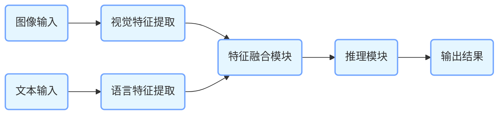

# 大规模语言模型的视觉-语言推理整合

> 关键词：大规模语言模型、视觉-语言推理、多模态整合、深度学习、人工智能、跨模态交互、推理算法

> 摘要：本文聚焦于大规模语言模型的视觉 - 语言推理整合这一前沿领域。随着人工智能的发展，多模态信息处理成为研究热点，视觉 - 语言推理整合旨在让模型能够综合处理图像和文本信息，实现更强大的智能交互与理解。文章将深入探讨其核心概念、算法原理、数学模型，通过项目实战展示具体实现，分析实际应用场景，推荐相关工具和资源，并对未来发展趋势与挑战进行总结，为该领域的研究和实践提供全面且深入的参考。

## 1. 背景介绍 
### 1.1 目的和范围
本文章的目的在于全面深入地探讨大规模语言模型的视觉 - 语言推理整合这一技术领域。随着人工智能技术的不断演进，单一模态的数据处理已经难以满足复杂的现实需求，而视觉 - 语言推理整合能够让计算机同时理解图像和文本信息，从而在智能问答、图像描述生成、视觉搜索等多个领域发挥重要作用。

本文章的范围将涵盖视觉 - 语言推理整合的核心概念、算法原理、数学模型、项目实战、实际应用场景等多个方面，旨在为读者提供一个系统、全面的技术认知体系。

### 1.2 预期读者
本文预期读者包括但不限于人工智能领域的研究人员、开发者、学生以及对多模态人工智能技术感兴趣的爱好者。对于研究人员，本文可提供前沿的研究思路和理论基础；对于开发者，可作为技术实现的参考指南；对于学生，能帮助其构建对该领域的基础知识框架；对于爱好者，则可拓宽其对人工智能技术的认知视野。

### 1.3 文档结构概述
本文将按照以下结构进行组织：首先介绍背景信息，包括目的、预期读者和文档结构概述等；接着阐述核心概念与联系，通过文本示意图和 Mermaid 流程图清晰展示相关原理和架构；然后详细讲解核心算法原理和具体操作步骤，并使用 Python 源代码进行说明；之后介绍数学模型和公式，通过具体例子进行详细讲解；再通过项目实战展示代码实际案例并进行详细解释；分析实际应用场景；推荐相关的工具和资源；最后总结未来发展趋势与挑战，提供常见问题与解答以及扩展阅读和参考资料。

### 1.4 术语表
#### 1.4.1 核心术语定义
- **大规模语言模型**：指具有大量参数和强大语言处理能力的深度学习模型，如 GPT - 3、BERT 等，能够处理自然语言文本的生成、理解等任务。
- **视觉 - 语言推理整合**：将视觉信息（如图像）和语言信息（如文本）进行融合，使模型能够基于这两种模态的信息进行推理和决策的技术。
- **多模态**：指包含多种不同类型信息的模式，在本文中主要指视觉和语言两种模态。
- **跨模态交互**：不同模态信息之间的相互作用和影响，通过跨模态交互可以实现视觉和语言信息的融合。

#### 1.4.2 相关概念解释
- **深度学习**：一种基于人工神经网络的机器学习方法，通过多层神经网络对数据进行学习和特征提取，在图像识别、自然语言处理等领域取得了显著成果。
- **注意力机制**：一种在深度学习中广泛应用的机制，能够自动关注输入信息中的重要部分，提高模型的性能和效率。
- **编码器 - 解码器架构**：一种常见的深度学习架构，编码器将输入信息进行编码，解码器将编码后的信息解码生成输出结果，常用于序列到序列的任务，如机器翻译、图像描述生成等。

#### 1.4.3 缩略词列表
- **CNN**：卷积神经网络（Convolutional Neural Network），一种专门用于处理具有网格结构数据（如图像）的深度学习模型。
- **RNN**：循环神经网络（Recurrent Neural Network），一种能够处理序列数据的深度学习模型，常用于自然语言处理中的序列建模任务。
- **Transformer**：一种基于注意力机制的深度学习架构，在自然语言处理和计算机视觉等领域取得了巨大成功。

## 2. 核心概念与联系 

### 核心概念原理
视觉 - 语言推理整合的核心在于将视觉信息和语言信息进行有效的融合，使模型能够基于这两种模态的信息进行推理和决策。其基本原理是通过对图像和文本进行特征提取，然后将这些特征进行融合，最后利用融合后的特征进行推理任务。

在视觉信息处理方面，通常使用卷积神经网络（CNN）对图像进行特征提取，将图像转换为高维的特征向量。在语言信息处理方面，常用的方法包括循环神经网络（RNN）及其变体（如 LSTM、GRU）或基于 Transformer 架构的模型（如 BERT、GPT）对文本进行编码，将文本转换为语义表示。

特征融合是视觉 - 语言推理整合的关键步骤，常见的融合方法包括早期融合、晚期融合和混合融合等。早期融合是在特征提取之前将视觉和语言信息进行融合；晚期融合是在特征提取之后将视觉和语言特征进行融合；混合融合则是结合了早期融合和晚期融合的方法。

推理阶段则是利用融合后的特征进行具体的任务，如图像描述生成、视觉问答、视觉推理等。

### 架构的文本示意图
```plaintext
+----------------+       +----------------+
|    图像输入    |       |    文本输入    |
+----------------+       +----------------+
       |                        |
       v                        v
+----------------+       +----------------+
|  视觉特征提取  |       |  语言特征提取  |
|   (如 CNN)     |       | (如 Transformer)|
+----------------+       +----------------+
       |                        |
       v                        v
+----------------+
|   特征融合模块   |
| (早期/晚期/混合) |
+----------------+
       |
       v
+----------------+
|   推理模块       |
| (图像描述生成等)|
+----------------+
       |
       v
+----------------+
|    输出结果    |
+----------------+
```

### Mermaid 流程图


## 3. 核心算法原理 & 具体操作步骤 

### 核心算法原理
在视觉 - 语言推理整合中，常用的算法包括基于注意力机制的跨模态交互算法。下面以一个简单的基于注意力的跨模态交互模型为例进行说明。

该模型的主要思想是通过注意力机制来捕捉视觉和语言特征之间的相关性，从而实现跨模态信息的交互和融合。具体来说，模型首先分别对图像和文本进行特征提取，得到视觉特征和语言特征。然后，通过注意力机制计算视觉特征和语言特征之间的注意力权重，根据这些权重对视觉特征进行加权求和，得到与语言信息相关的视觉特征表示。最后，将这个表示与语言特征进行融合，用于后续的推理任务。

### 具体操作步骤
1. **数据预处理**：对图像数据进行裁剪、缩放、归一化等操作，对文本数据进行分词、编码等处理。
2. **特征提取**：使用预训练的 CNN 模型（如 ResNet）对图像进行特征提取，使用预训练的语言模型（如 BERT）对文本进行特征提取。
3. **注意力计算**：计算视觉特征和语言特征之间的注意力权重。
4. **特征融合**：根据注意力权重对视觉特征进行加权求和，然后将其与语言特征进行融合。
5. **推理任务**：使用融合后的特征进行具体的推理任务，如图像描述生成、视觉问答等。

### Python 源代码实现
```python
import torch
import torch.nn as nn
import torchvision.models as models
from transformers import BertModel

# 定义视觉特征提取器
class VisualFeatureExtractor(nn.Module):
    def __init__(self):
        super(VisualFeatureExtractor, self).__init__()
        self.cnn = models.resnet18(pretrained=True)
        self.cnn.fc = nn.Identity()  # 去掉最后一层全连接层

    def forward(self, images):
        features = self.cnn(images)
        return features

# 定义语言特征提取器
class LanguageFeatureExtractor(nn.Module):
    def __init__(self):
        super(LanguageFeatureExtractor, self).__init__()
        self.bert = BertModel.from_pretrained('bert-base-uncased')

    def forward(self, input_ids, attention_mask):
        outputs = self.bert(input_ids=input_ids, attention_mask=attention_mask)
        features = outputs.last_hidden_state
        return features

# 定义注意力模块
class AttentionModule(nn.Module):
    def __init__(self, visual_dim, language_dim):
        super(AttentionModule, self).__init__()
        self.linear_v = nn.Linear(visual_dim, language_dim)
        self.softmax = nn.Softmax(dim=1)

    def forward(self, visual_features, language_features):
        visual_features = self.linear_v(visual_features)
        attention_scores = torch.bmm(visual_features.unsqueeze(1), language_features.transpose(1, 2))
        attention_weights = self.softmax(attention_scores)
        weighted_visual_features = torch.bmm(attention_weights, visual_features.unsqueeze(1)).squeeze(1)
        return weighted_visual_features

# 定义跨模态融合模型
class CrossModalFusionModel(nn.Module):
    def __init__(self, visual_dim, language_dim):
        super(CrossModalFusionModel, self).__init__()
        self.visual_extractor = VisualFeatureExtractor()
        self.language_extractor = LanguageFeatureExtractor()
        self.attention_module = AttentionModule(visual_dim, language_dim)
        self.fc = nn.Linear(visual_dim + language_dim, 1)  # 示例：二分类任务

    def forward(self, images, input_ids, attention_mask):
        visual_features = self.visual_extractor(images)
        language_features = self.language_extractor(input_ids, attention_mask)
        weighted_visual_features = self.attention_module(visual_features, language_features)
        fused_features = torch.cat((weighted_visual_features, language_features[:, 0, :]), dim=1)
        output = self.fc(fused_features)
        return output
```

## 4. 数学模型和公式 & 详细讲解 & 举例说明 

### 数学模型和公式
#### 视觉特征提取
假设输入的图像为 $I \in \mathbb{R}^{H \times W \times C}$，其中 $H$、$W$ 和 $C$ 分别表示图像的高度、宽度和通道数。使用卷积神经网络（CNN）进行特征提取，得到视觉特征 $V \in \mathbb{R}^{d_v}$，其中 $d_v$ 是视觉特征的维度。可以表示为：
$$V = \text{CNN}(I)$$

#### 语言特征提取
假设输入的文本为 $T = [w_1, w_2, \cdots, w_n]$，其中 $w_i$ 是文本中的第 $i$ 个词。使用语言模型（如 BERT）进行特征提取，得到语言特征 $L \in \mathbb{R}^{n \times d_l}$，其中 $d_l$ 是语言特征的维度。可以表示为：
$$L = \text{BERT}(T)$$

#### 注意力计算
注意力分数的计算可以通过以下公式表示：
$$e_{ij} = \text{score}(V_i, L_j)$$
其中 $V_i$ 是视觉特征的第 $i$ 个元素，$L_j$ 是语言特征的第 $j$ 个元素，$\text{score}$ 是注意力打分函数，常见的有点积、线性变换等。

注意力权重通过 softmax 函数计算：
$$\alpha_{ij} = \frac{\exp(e_{ij})}{\sum_{k=1}^{n} \exp(e_{ik})}$$

加权后的视觉特征为：
$$\tilde{V} = \sum_{i=1}^{m} \alpha_{i} V_i$$
其中 $m$ 是视觉特征的数量。

#### 特征融合
将加权后的视觉特征 $\tilde{V}$ 和语言特征 $L$ 进行融合，常见的融合方式是拼接：
$$F = [\tilde{V}; L]$$

#### 推理任务
对于具体的推理任务，如二分类任务，可以使用一个全连接层进行预测：
$$y = \text{sigmoid}(\text{FC}(F))$$
其中 $\text{FC}$ 是全连接层，$\text{sigmoid}$ 是激活函数。

### 详细讲解
视觉特征提取阶段，CNN 通过卷积、池化等操作对图像进行特征提取，将图像的局部特征进行组合，得到具有代表性的视觉特征。语言特征提取阶段，BERT 模型通过预训练学习到语言的语义信息，将输入的文本转换为高维的语义表示。

注意力计算阶段，通过注意力分数衡量视觉特征和语言特征之间的相关性，注意力权重表示每个视觉特征对语言特征的重要程度。加权后的视觉特征是根据注意力权重对视觉特征进行加权求和得到的，能够更好地反映视觉信息与语言信息的关联。

特征融合阶段，将加权后的视觉特征和语言特征进行拼接，得到一个包含视觉和语言信息的融合特征。推理任务阶段，使用全连接层对融合特征进行处理，得到最终的预测结果。

### 举例说明
假设我们有一张包含一只猫的图像和一段描述“这是一只可爱的猫”的文本。在视觉特征提取阶段，CNN 会提取出图像中猫的形状、颜色等特征。在语言特征提取阶段，BERT 会将文本中的每个词转换为语义向量，如“猫”这个词会被转换为一个表示猫的语义向量。

在注意力计算阶段，模型会计算视觉特征中与“猫”相关的特征和语言特征中“猫”的语义向量之间的注意力分数，得到较高的注意力权重，表明这些视觉特征与语言信息高度相关。

在特征融合阶段，将与“猫”相关的加权视觉特征和语言特征进行拼接，得到一个融合特征。在推理任务阶段，如果是一个图像分类任务，模型会根据这个融合特征判断图像中是否是猫，并输出相应的预测结果。

## 5. 项目实战：代码实际案例和详细解释说明 

### 5.1  开发环境搭建
- **操作系统**：推荐使用 Ubuntu 18.04 或更高版本，或者 Windows 10。
- **Python 版本**：Python 3.7 或更高版本。
- **深度学习框架**：PyTorch 1.7 或更高版本。
- **其他依赖库**：torchvision、transformers、numpy、matplotlib 等。

可以使用以下命令安装相关依赖库：
```bash
pip install torch torchvision transformers numpy matplotlib
```

### 5.2  源代码详细实现和代码解读
以下是一个完整的项目实战代码示例，包括数据加载、模型训练和测试：

```python
import torch
import torch.nn as nn
import torch.optim as optim
from torch.utils.data import Dataset, DataLoader
import torchvision.models as models
from transformers import BertTokenizer, BertModel
import numpy as np
import os
from PIL import Image

# 定义数据集类
class VisualLanguageDataset(Dataset):
    def __init__(self, image_dir, text_file, tokenizer):
        self.image_dir = image_dir
        self.texts = []
        self.labels = []
        with open(text_file, 'r') as f:
            for line in f:
                text, label = line.strip().split('\t')
                self.texts.append(text)
                self.labels.append(int(label))
        self.tokenizer = tokenizer

    def __len__(self):
        return len(self.texts)

    def __getitem__(self, idx):
        image_path = os.path.join(self.image_dir, f'{idx}.jpg')
        image = Image.open(image_path).convert('RGB')
        image = np.array(image) / 255.0
        image = np.transpose(image, (2, 0, 1))
        image = torch.tensor(image, dtype=torch.float32)

        text = self.texts[idx]
        encoding = self.tokenizer(text, return_tensors='pt', padding='max_length', truncation=True, max_length=128)
        input_ids = encoding['input_ids'].squeeze(0)
        attention_mask = encoding['attention_mask'].squeeze(0)

        label = self.labels[idx]
        label = torch.tensor(label, dtype=torch.float32)

        return image, input_ids, attention_mask, label

# 定义视觉特征提取器
class VisualFeatureExtractor(nn.Module):
    def __init__(self):
        super(VisualFeatureExtractor, self).__init__()
        self.cnn = models.resnet18(pretrained=True)
        self.cnn.fc = nn.Identity()  # 去掉最后一层全连接层

    def forward(self, images):
        features = self.cnn(images)
        return features

# 定义语言特征提取器
class LanguageFeatureExtractor(nn.Module):
    def __init__(self):
        super(LanguageFeatureExtractor, self).__init__()
        self.bert = BertModel.from_pretrained('bert-base-uncased')

    def forward(self, input_ids, attention_mask):
        outputs = self.bert(input_ids=input_ids, attention_mask=attention_mask)
        features = outputs.last_hidden_state
        return features

# 定义注意力模块
class AttentionModule(nn.Module):
    def __init__(self, visual_dim, language_dim):
        super(AttentionModule, self).__init__()
        self.linear_v = nn.Linear(visual_dim, language_dim)
        self.softmax = nn.Softmax(dim=1)

    def forward(self, visual_features, language_features):
        visual_features = self.linear_v(visual_features)
        attention_scores = torch.bmm(visual_features.unsqueeze(1), language_features.transpose(1, 2))
        attention_weights = self.softmax(attention_scores)
        weighted_visual_features = torch.bmm(attention_weights, visual_features.unsqueeze(1)).squeeze(1)
        return weighted_visual_features

# 定义跨模态融合模型
class CrossModalFusionModel(nn.Module):
    def __init__(self, visual_dim, language_dim):
        super(CrossModalFusionModel, self).__init__()
        self.visual_extractor = VisualFeatureExtractor()
        self.language_extractor = LanguageFeatureExtractor()
        self.attention_module = AttentionModule(visual_dim, language_dim)
        self.fc = nn.Linear(visual_dim + language_dim, 1)  # 示例：二分类任务

    def forward(self, images, input_ids, attention_mask):
        visual_features = self.visual_extractor(images)
        language_features = self.language_extractor(input_ids, attention_mask)
        weighted_visual_features = self.attention_module(visual_features, language_features)
        fused_features = torch.cat((weighted_visual_features, language_features[:, 0, :]), dim=1)
        output = self.fc(fused_features)
        output = torch.sigmoid(output)
        return output

# 训练模型
def train_model(model, dataloader, criterion, optimizer, device, num_epochs=10):
    model.train()
    for epoch in range(num_epochs):
        running_loss = 0.0
        for images, input_ids, attention_mask, labels in dataloader:
            images = images.to(device)
            input_ids = input_ids.to(device)
            attention_mask = attention_mask.to(device)
            labels = labels.to(device)

            optimizer.zero_grad()
            outputs = model(images, input_ids, attention_mask)
            loss = criterion(outputs.squeeze(), labels)
            loss.backward()
            optimizer.step()

            running_loss += loss.item()

        print(f'Epoch {epoch + 1}/{num_epochs}, Loss: {running_loss / len(dataloader)}')

# 测试模型
def test_model(model, dataloader, device):
    model.eval()
    correct = 0
    total = 0
    with torch.no_grad():
        for images, input_ids, attention_mask, labels in dataloader:
            images = images.to(device)
            input_ids = input_ids.to(device)
            attention_mask = attention_mask.to(device)
            labels = labels.to(device)

            outputs = model(images, input_ids, attention_mask)
            predicted = (outputs.squeeze() > 0.5).float()
            total += labels.size(0)
            correct += (predicted == labels).sum().item()

    print(f'Accuracy: {100 * correct / total}%')

# 主函数
if __name__ == '__main__':
    device = torch.device('cuda' if torch.cuda.is_available() else 'cpu')

    # 数据加载
    image_dir = 'path/to/images'
    text_file = 'path/to/texts.txt'
    tokenizer = BertTokenizer.from_pretrained('bert-base-uncased')
    dataset = VisualLanguageDataset(image_dir, text_file, tokenizer)
    dataloader = DataLoader(dataset, batch_size=16, shuffle=True)

    # 模型初始化
    visual_dim = 512
    language_dim = 768
    model = CrossModalFusionModel(visual_dim, language_dim).to(device)

    # 损失函数和优化器
    criterion = nn.BCELoss()
    optimizer = optim.Adam(model.parameters(), lr=0.0001)

    # 训练模型
    train_model(model, dataloader, criterion, optimizer, device, num_epochs=10)

    # 测试模型
    test_model(model, dataloader, device)
```

### 5.3  代码解读与分析
#### 数据集类 `VisualLanguageDataset`
该类用于加载图像和文本数据，并进行预处理。`__init__` 方法读取文本文件，将文本和标签存储在列表中。`__getitem__` 方法根据索引加载对应的图像和文本，对图像进行归一化和维度转换，对文本进行分词和编码，最后返回图像、输入 ID、注意力掩码和标签。

#### 特征提取器
`VisualFeatureExtractor` 类使用预训练的 ResNet18 模型对图像进行特征提取，去掉最后一层全连接层。`LanguageFeatureExtractor` 类使用预训练的 BERT 模型对文本进行特征提取。

#### 注意力模块 `AttentionModule`
该模块计算视觉特征和语言特征之间的注意力权重，并根据权重对视觉特征进行加权求和。

#### 跨模态融合模型 `CrossModalFusionModel`
该模型将视觉特征提取器、语言特征提取器、注意力模块和全连接层组合在一起，实现跨模态信息的融合和预测。

#### 训练和测试函数
`train_model` 函数用于训练模型，使用二元交叉熵损失函数（BCELoss）和 Adam 优化器进行训练。`test_model` 函数用于测试模型，计算模型的准确率。

## 6. 实际应用场景 
### 智能问答系统
在智能问答系统中，用户可能会同时提供图像和文本信息来提问。例如，用户上传一张包含某种植物的图像，并询问“这是什么植物，有什么特点”。通过视觉 - 语言推理整合技术，系统可以同时分析图像中的植物特征和文本问题，给出准确的回答，如植物的名称、生长习性等信息。

### 图像描述生成
视觉 - 语言推理整合可以用于自动生成图像的描述。例如，对于一张风景照片，模型可以根据图像中的场景和元素，结合语言知识，生成生动、准确的描述文本，如“在一片宁静的湖泊旁，绿树成荫，远处的山峦连绵起伏，阳光洒在水面上波光粼粼”。

### 视觉搜索
在视觉搜索中，用户可以通过输入文本描述来搜索相关的图像。例如，用户输入“一只白色的猫在沙发上睡觉”，系统可以利用视觉 - 语言推理整合技术，在图像数据库中搜索符合该描述的图像，提高搜索的准确性和效率。

### 辅助医疗诊断
在医疗领域，医生可以结合医学图像（如 X 光、CT 等）和患者的症状描述来进行诊断。视觉 - 语言推理整合技术可以帮助医生更全面地分析患者的病情，辅助医生做出更准确的诊断决策。

### 自动驾驶
在自动驾驶中，车辆需要同时处理视觉信息（如道路、交通标志、行人等）和语言信息（如语音导航指令）。通过视觉 - 语言推理整合，车辆可以更好地理解周围环境和用户的指令，提高自动驾驶的安全性和可靠性。

## 7. 工具和资源推荐
### 7.1 学习资源推荐
#### 7.1.1 书籍推荐
- 《深度学习》（Deep Learning）：由 Ian Goodfellow、Yoshua Bengio 和 Aaron Courville 所著，是深度学习领域的经典教材，涵盖了深度学习的基本原理、算法和应用。
- 《Python 深度学习》（Deep Learning with Python）：由 Francois Chollet 所著，结合 Keras 框架介绍了深度学习的实践方法，适合初学者入门。
- 《计算机视觉：算法与应用》（Computer Vision: Algorithms and Applications）：由 Richard Szeliski 所著，全面介绍了计算机视觉的算法和应用，包括图像特征提取、目标检测、图像分割等内容。

#### 7.1.2 在线课程
- Coursera 上的“深度学习专项课程”（Deep Learning Specialization）：由 Andrew Ng 教授授课，包括深度学习基础、卷积神经网络、循环神经网络等多个模块，是学习深度学习的优质课程。
- edX 上的“计算机视觉基础”（Foundations of Computer Vision）：由华盛顿大学的教授授课，系统介绍了计算机视觉的基本概念和算法。
- B 站上的“李宏毅机器学习”课程：内容生动有趣，适合初学者快速入门机器学习和深度学习。

#### 7.1.3 技术博客和网站
- Medium 上的 Towards Data Science：有很多关于人工智能、机器学习、深度学习的优质文章和教程。
- arXiv.org：是一个预印本服务器，提供了大量最新的学术论文，包括计算机视觉、自然语言处理等领域的研究成果。
- 机器之心：专注于人工智能领域的资讯和技术解读，提供了很多前沿的技术动态和案例分析。

### 7.2 开发工具框架推荐
#### 7.2.1 IDE和编辑器
- PyCharm：是一款专业的 Python 集成开发环境，具有代码编辑、调试、自动补全、版本控制等功能，适合开发 Python 深度学习项目。
- Visual Studio Code：是一款轻量级的代码编辑器，支持多种编程语言和插件扩展，可通过安装相关插件实现深度学习开发。

#### 7.2.2 调试和性能分析工具
- TensorBoard：是 TensorFlow 提供的可视化工具，可用于查看模型的训练过程、损失曲线、准确率等指标，帮助调试和优化模型。
- PyTorch Profiler：是 PyTorch 提供的性能分析工具，可用于分析模型的运行时间、内存使用等情况，找出性能瓶颈。

#### 7.2.3 相关框架和库
- PyTorch：是一个开源的深度学习框架，具有动态计算图、易于使用等优点，在学术界和工业界广泛应用。
- TensorFlow：是另一个流行的深度学习框架，具有丰富的工具和资源，适合大规模的深度学习项目开发。
- TorchVision：是 PyTorch 的计算机视觉库，提供了预训练的模型、数据集和图像处理工具，方便进行计算机视觉任务的开发。
- Transformers：是 Hugging Face 开发的自然语言处理库，提供了多种预训练的语言模型（如 BERT、GPT 等）和相关工具，方便进行自然语言处理任务的开发。

### 7.3 相关论文著作推荐
#### 7.3.1 经典论文
- “Attention Is All You Need”：提出了 Transformer 架构，是自然语言处理领域的经典论文，对后续的研究产生了深远影响。
- “ImageNet Classification with Deep Convolutional Neural Networks”：介绍了 AlexNet 模型，开创了深度学习在计算机视觉领域的应用先河。
- “BERT: Pre-training of Deep Bidirectional Transformers for Language Understanding”：提出了 BERT 模型，在自然语言处理领域取得了巨大成功。

#### 7.3.2 最新研究成果
- 关注 arXiv.org 上关于视觉 - 语言推理整合、多模态学习等领域的最新论文，了解该领域的前沿研究动态。
- 参加相关的学术会议（如 CVPR、ICCV、ACL 等），获取最新的研究成果和技术趋势。

#### 7.3.3 应用案例分析
- 查看相关的工业界博客和技术报告，了解视觉 - 语言推理整合技术在实际应用中的案例和经验分享，如谷歌、微软、百度等公司的技术博客。

## 8. 总结：未来发展趋势与挑战
### 未来发展趋势
- **更强的跨模态理解能力**：未来的模型将能够更深入地理解视觉和语言信息之间的语义关系，实现更准确的跨模态推理和交互。例如，能够理解图像中的情感、意图等信息，并结合语言信息进行更复杂的推理。
- **多模态融合的多样化**：除了视觉和语言模态，未来的模型可能会融合更多的模态信息，如音频、触觉等，实现更加全面的感知和理解。例如，在虚拟现实和增强现实场景中，结合视觉、音频和触觉信息，提供更加沉浸式的体验。
- **应用场景的拓展**：视觉 - 语言推理整合技术将在更多的领域得到应用，如智能教育、文化遗产保护、智能家居等。例如，在智能教育中，结合图像和文本信息，为学生提供更加生动、直观的学习资源。
- **模型的轻量化和高效化**：随着计算资源的限制和应用场景的需求，未来的模型将更加注重轻量化和高效化，以实现更快的推理速度和更低的能耗。例如，采用模型压缩、量化等技术，减少模型的参数数量和计算量。

### 挑战
- **数据获取和标注的困难**：获取高质量的多模态数据并进行准确的标注是一个挑战。例如，在视觉 - 语言数据集中，需要同时标注图像和文本信息，这需要大量的人力和时间成本。
- **跨模态语义鸿沟**：视觉和语言信息的语义表示存在差异，如何有效地弥合这种语义鸿沟，实现跨模态信息的准确融合是一个关键问题。
- **模型的可解释性**：深度学习模型通常是黑盒模型，缺乏可解释性。在视觉 - 语言推理整合中，如何解释模型的决策过程和结果，让用户理解模型的推理逻辑是一个重要的挑战。
- **计算资源的需求**：大规模语言模型和视觉模型的训练和推理需要大量的计算资源，如何在有限的计算资源下实现高效的训练和推理是一个亟待解决的问题。

## 9. 附录：常见问题与解答
### 问题 1：视觉 - 语言推理整合和传统的图像识别、自然语言处理有什么区别？
解答：传统的图像识别主要关注图像中的视觉特征和目标检测，自然语言处理主要关注文本的语义理解和生成。而视觉 - 语言推理整合则是将视觉和语言两种模态的信息进行融合，使模型能够基于这两种信息进行推理和决策，实现更复杂的智能任务，如根据图像和文本进行问答、生成图像描述等。

### 问题 2：在视觉 - 语言推理整合中，如何选择合适的特征融合方法？
解答：选择合适的特征融合方法需要考虑具体的任务和数据特点。早期融合适用于数据维度较低、模态之间相关性较强的情况；晚期融合适用于数据维度较高、模态之间独立性较强的情况；混合融合则结合了两者的优点。可以通过实验比较不同融合方法的性能，选择最优的方法。

### 问题 3：如何评估视觉 - 语言推理整合模型的性能？
解答：评估视觉 - 语言推理整合模型的性能可以使用多种指标，如准确率、召回率、F1 值、BLEU 分数等。具体的评估指标需要根据任务的类型来选择。例如，在图像描述生成任务中，可以使用 BLEU 分数来评估生成描述的质量；在视觉问答任务中，可以使用准确率来评估模型的回答准确率。

### 问题 4：视觉 - 语言推理整合模型的训练时间通常较长，有什么方法可以加速训练？
解答：可以采用以下方法加速训练：使用 GPU 进行计算，提高计算效率；采用分布式训练，利用多个 GPU 或计算节点进行并行训练；使用数据增强技术，增加训练数据的多样性，减少过拟合，提高训练效率；采用模型压缩技术，减少模型的参数数量和计算量。

## 10. 扩展阅读 & 参考资料
- [1] Goodfellow, I., Bengio, Y., & Courville, A. (2016). Deep Learning. MIT Press.
- [2] Chollet, F. (2018). Deep Learning with Python. Manning Publications.
- [3] Szeliski, R. (2010). Computer Vision: Algorithms and Applications. Springer.
- [4] Vaswani, A., Shazeer, N., Parmar, N., Uszkoreit, J., Jones, L., Gomez, A. N., ... & Polosukhin, I. (2017). Attention is all you need. Advances in neural information processing systems, 5998 - 6008.
- [5] Krizhevsky, A., Sutskever, I., & Hinton, G. E. (2012). ImageNet classification with deep convolutional neural networks. Advances in neural information processing systems, 1097 - 1105.
- [6] Devlin, J., Chang, M. W., Lee, K., & Toutanova, K. (2018). BERT: Pre - training of deep bidirectional transformers for language understanding. arXiv preprint arXiv:1810.04805.

作者：AI天才研究院/AI Genius Institute & 禅与计算机程序设计艺术 /Zen And The Art of Computer Programming