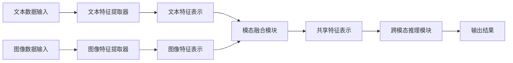

# 大规模语言模型的跨模态推理与综合分析

> 关键词：大规模语言模型、跨模态推理、综合分析、多模态数据、人工智能

> 摘要：本文围绕大规模语言模型的跨模态推理与综合分析展开深入探讨。首先介绍了研究的背景、目的、预期读者和文档结构，对相关术语进行了详细解释。接着阐述了跨模态推理的核心概念、原理及架构，并通过Mermaid流程图进行直观展示。在算法原理部分，使用Python代码进行了详细说明。同时给出了相关的数学模型和公式，并举例解释。通过实际项目案例，展示了开发环境搭建、代码实现与解读。分析了大规模语言模型跨模态推理在多个领域的实际应用场景。推荐了学习资源、开发工具框架和相关论文著作。最后总结了未来发展趋势与挑战，解答了常见问题，并提供了扩展阅读和参考资料，旨在为该领域的研究和实践提供全面而深入的指导。

## 1. 背景介绍 
### 1.1 目的和范围
在当今信息爆炸的时代，数据呈现出多样化和多模态的特点，包括文本、图像、音频、视频等。大规模语言模型虽然在处理文本数据方面取得了显著成就，但在跨模态信息的理解、推理和综合分析上仍面临诸多挑战。本文的目的在于深入研究大规模语言模型的跨模态推理与综合分析技术，探讨如何使模型能够有效地融合不同模态的数据，实现更高级的智能决策和信息处理。范围涵盖跨模态推理的核心概念、算法原理、数学模型、实际应用场景，以及相关的工具和资源推荐等方面。

### 1.2 预期读者
本文预期读者包括人工智能领域的研究人员、开发者、高校相关专业的学生，以及对大规模语言模型和跨模态技术感兴趣的技术爱好者。对于研究人员，本文可以为其提供新的研究思路和方法；对于开发者，有助于他们在实际项目中应用跨模态推理技术；对于学生，能够帮助他们系统地学习该领域的知识；对于技术爱好者，可以拓宽其对人工智能前沿技术的认知。

### 1.3 文档结构概述
本文将按照以下结构展开：首先介绍背景知识，包括目的、读者和文档结构，以及相关术语。接着阐述跨模态推理的核心概念和联系，通过文本示意图和Mermaid流程图进行直观展示。然后详细讲解核心算法原理和具体操作步骤，使用Python代码进行说明。给出相关的数学模型和公式，并举例解释。通过实际项目案例，展示开发环境搭建、代码实现与解读。分析实际应用场景，推荐学习资源、开发工具框架和相关论文著作。最后总结未来发展趋势与挑战，解答常见问题，并提供扩展阅读和参考资料。

### 1.4 术语表
#### 1.4.1 核心术语定义
- **大规模语言模型（Large Language Model, LLM）**：是一种基于深度学习的人工智能模型，通过在大规模文本数据上进行训练，学习语言的模式和规律，能够生成自然语言文本、回答问题、进行文本分类等任务。
- **跨模态推理（Cross-modal Reasoning）**：指模型能够处理和理解来自不同模态（如文本、图像、音频等）的数据，并在这些模态之间进行信息的交互和推理，以实现更高级的认知和决策。
- **多模态数据（Multi-modal Data）**：包含多种不同类型数据的集合，例如同时包含文本描述和对应图像的数据集。
- **模态融合（Modal Fusion）**：将不同模态的数据进行整合，使模型能够同时利用多种模态的信息进行分析和处理。

#### 1.4.2 相关概念解释
- **注意力机制（Attention Mechanism）**：是一种在深度学习中广泛应用的技术，用于在处理序列数据时，动态地分配不同部分的权重，使模型能够聚焦于重要的信息。在跨模态推理中，注意力机制可以帮助模型在不同模态之间建立关联。
- **特征提取（Feature Extraction）**：从原始数据中提取出能够代表数据本质特征的信息，例如从图像中提取出视觉特征，从文本中提取出语义特征。

#### 1.4.3 缩略词列表
- **LLM**：Large Language Model（大规模语言模型）
- **CNN**：Convolutional Neural Network（卷积神经网络）
- **RNN**：Recurrent Neural Network（循环神经网络）
- **Transformer**：一种基于注意力机制的深度学习模型架构

## 2. 核心概念与联系 

### 核心概念原理
跨模态推理的核心在于使大规模语言模型能够理解和处理不同模态的数据，并在这些模态之间建立有效的联系。不同模态的数据具有不同的特征和表示方式，例如文本数据是由字符和词语组成的序列，而图像数据是由像素值构成的矩阵。为了实现跨模态推理，需要对不同模态的数据进行特征提取和表示学习，将它们映射到一个共享的特征空间中，以便模型能够进行统一的处理和分析。

在这个共享特征空间中，模型可以通过注意力机制等方法，在不同模态之间建立关联，例如找出图像中与文本描述相关的部分，或者根据文本描述生成对应的图像。同时，模型还可以利用这些跨模态的信息进行推理和决策，例如回答关于图像内容的问题，或者根据图像和文本的综合信息进行分类和预测。

### 架构的文本示意图
```plaintext
+-------------------+        +-------------------+
|    文本数据输入    |        |    图像数据输入    |
+-------------------+        +-------------------+
       |                          |
       v                          v
+-------------------+        +-------------------+
|  文本特征提取器    |        |  图像特征提取器    |
+-------------------+        +-------------------+
       |                          |
       v                          v
+-------------------+        +-------------------+
|  文本特征表示      |        |  图像特征表示      |
+-------------------+        +-------------------+
       |                          |
       v                          v
+--------------------------------------+
|           模态融合模块             |
+--------------------------------------+
       |
       v
+-------------------+
|  共享特征表示      |
+-------------------+
       |
       v
+-------------------+
|  跨模态推理模块    |
+-------------------+
       |
       v
+-------------------+
|  输出结果          |
+-------------------+
```

### Mermaid 流程图


## 3. 核心算法原理 & 具体操作步骤 

### 核心算法原理
在跨模态推理中，常用的算法包括基于注意力机制的Transformer架构和卷积神经网络（CNN）用于图像特征提取，循环神经网络（RNN）或Transformer用于文本特征提取。下面以Transformer架构为例，介绍跨模态推理的核心算法原理。

Transformer架构通过多头注意力机制（Multi-head Attention）在不同模态之间建立关联。多头注意力机制允许模型在不同的表示子空间中并行地关注不同的信息，从而提高模型的表达能力。具体来说，对于输入的文本特征和图像特征，多头注意力机制会计算它们之间的注意力分数，这些分数表示不同模态之间的相关性。然后，根据注意力分数对特征进行加权求和，得到融合后的特征表示。

### 具体操作步骤
1. **数据预处理**：对输入的文本和图像数据进行预处理，包括文本的分词、图像的缩放和归一化等操作。
2. **特征提取**：使用预训练的CNN模型（如ResNet、VGG等）提取图像的视觉特征，使用预训练的Transformer模型（如BERT、GPT等）提取文本的语义特征。
3. **模态融合**：将提取的文本特征和图像特征输入到模态融合模块中，使用多头注意力机制进行特征融合，得到共享特征表示。
4. **跨模态推理**：将共享特征表示输入到跨模态推理模块中，进行具体的推理任务，如回答问题、图像分类等。
5. **输出结果**：根据推理任务的要求，输出最终的结果。

### Python源代码详细阐述
```python
import torch
import torch.nn as nn
import torch.nn.functional as F

# 定义多头注意力机制
class MultiHeadAttention(nn.Module):
    def __init__(self, d_model, num_heads):
        super(MultiHeadAttention, self).__init__()
        assert d_model % num_heads == 0, "d_model must be divisible by num_heads"

        self.d_model = d_model
        self.num_heads = num_heads
        self.d_k = d_model // num_heads

        self.W_q = nn.Linear(d_model, d_model)
        self.W_k = nn.Linear(d_model, d_model)
        self.W_v = nn.Linear(d_model, d_model)
        self.W_o = nn.Linear(d_model, d_model)

    def forward(self, Q, K, V, mask=None):
        batch_size = Q.size(0)

        # 线性变换
        Q = self.W_q(Q).view(batch_size, -1, self.num_heads, self.d_k).transpose(1, 2)
        K = self.W_k(K).view(batch_size, -1, self.num_heads, self.d_k).transpose(1, 2)
        V = self.W_v(V).view(batch_size, -1, self.num_heads, self.d_k).transpose(1, 2)

        # 计算注意力分数
        scores = torch.matmul(Q, K.transpose(-2, -1)) / torch.sqrt(torch.tensor(self.d_k, dtype=torch.float32))

        if mask is not None:
            scores = scores.masked_fill(mask == 0, -1e9)

        # 计算注意力权重
        attn_weights = F.softmax(scores, dim=-1)

        # 加权求和
        output = torch.matmul(attn_weights, V)
        output = output.transpose(1, 2).contiguous().view(batch_size, -1, self.d_model)

        # 线性变换
        output = self.W_o(output)

        return output

# 定义模态融合模块
class ModalFusionModule(nn.Module):
    def __init__(self, d_model, num_heads):
        super(ModalFusionModule, self).__init__()
        self.attention = MultiHeadAttention(d_model, num_heads)
        self.norm = nn.LayerNorm(d_model)

    def forward(self, text_features, image_features):
        # 进行多头注意力融合
        fused_features = self.attention(text_features, image_features, image_features)
        # 残差连接和归一化
        output = self.norm(text_features + fused_features)
        return output

# 示例使用
d_model = 512
num_heads = 8
text_features = torch.randn(16, 10, d_model)  # 假设文本特征的形状为 (batch_size, seq_len, d_model)
image_features = torch.randn(16, 20, d_model)  # 假设图像特征的形状为 (batch_size, num_patches, d_model)

fusion_module = ModalFusionModule(d_model, num_heads)
fused_features = fusion_module(text_features, image_features)
print(fused_features.shape)
```

## 4. 数学模型和公式 & 详细讲解 & 举例说明 

### 多头注意力机制的数学模型和公式
多头注意力机制的核心是计算注意力分数和加权求和。具体公式如下：

#### 1. 线性变换
对于输入的查询（Query）$Q$、键（Key）$K$ 和值（Value）$V$，首先进行线性变换：
$$
Q' = W_q Q \\
K' = W_k K \\
V' = W_v V
$$
其中 $W_q$、$W_k$ 和 $W_v$ 是可学习的权重矩阵。

#### 2. 注意力分数计算
将变换后的 $Q'$、$K'$ 进行点积运算，并除以 $\sqrt{d_k}$（$d_k$ 是查询和键的维度）：
$$
\text{Attention Scores} = \frac{Q' K'^T}{\sqrt{d_k}}
$$

#### 3. 注意力权重计算
对注意力分数应用 softmax 函数，得到注意力权重：
$$
\text{Attention Weights} = \text{softmax}(\text{Attention Scores})
$$

#### 4. 加权求和
将注意力权重与变换后的 $V'$ 进行加权求和：
$$
\text{Output} = \text{Attention Weights} \cdot V'
$$

#### 5. 多头注意力合并
将多个头的输出进行拼接，并通过一个线性变换得到最终的输出：
$$
\text{Multi-Head Output} = W_o \cdot \text{Concat}(\text{Head}_1, \text{Head}_2, \cdots, \text{Head}_h)
$$
其中 $W_o$ 是可学习的权重矩阵，$h$ 是头的数量。

### 详细讲解
多头注意力机制通过将输入的特征分成多个头，每个头在不同的子空间中进行注意力计算，从而能够捕捉到不同方面的信息。线性变换使得模型能够学习到不同模态之间的相关性，注意力分数表示了查询和键之间的相似度，注意力权重则决定了每个值在加权求和中的重要性。最终的多头注意力输出是多个头的信息的综合。

### 举例说明
假设我们有一个文本查询 $Q$ 表示“一只可爱的猫”，图像键 $K$ 表示一张包含猫的图片的特征，图像值 $V$ 也是该图片的特征。通过多头注意力机制，模型会计算文本查询和图像键之间的注意力分数，例如在某个头中，可能会关注到图像中猫的面部特征，因为这些特征与文本描述中的“可爱”相关。注意力权重会根据这些分数进行分配，使得在加权求和时，与文本描述相关的图像特征得到更高的权重。最终，多头注意力机制会将多个头的信息合并，得到一个融合了文本和图像信息的特征表示。

## 5. 项目实战：代码实际案例和详细解释说明 

### 5.1  开发环境搭建
#### 硬件环境
- **CPU**：建议使用多核处理器，如Intel Core i7及以上。
- **GPU**：对于大规模模型的训练和推理，建议使用NVIDIA GPU，如NVIDIA GeForce RTX 30系列或NVIDIA Tesla V100等。
- **内存**：至少16GB以上的内存，以确保能够处理大规模的数据。

#### 软件环境
- **操作系统**：推荐使用Linux系统，如Ubuntu 18.04或更高版本。
- **Python**：使用Python 3.7及以上版本。
- **深度学习框架**：使用PyTorch 1.7及以上版本，可通过以下命令安装：
```bash
pip install torch torchvision torchaudio
```
- **其他依赖库**：安装必要的库，如NumPy、Pandas、Matplotlib等：
```bash
pip install numpy pandas matplotlib
```

### 5.2  源代码详细实现和代码解读
以下是一个简单的跨模态推理项目示例，用于图像描述生成，即根据输入的图像生成对应的文本描述。

```python
import torch
import torch.nn as nn
import torch.optim as optim
from torchvision.models import resnet50
from torchvision.transforms import transforms
from torch.utils.data import DataLoader, Dataset
from PIL import Image
import os

# 定义数据集类
class ImageCaptionDataset(Dataset):
    def __init__(self, image_dir, caption_file, transform=None):
        self.image_dir = image_dir
        self.caption_file = caption_file
        self.transform = transform

        # 读取图像文件名和对应的描述
        self.image_files = []
        self.captions = []
        with open(caption_file, 'r') as f:
            for line in f:
                image_name, caption = line.strip().split('\t')
                self.image_files.append(os.path.join(image_dir, image_name))
                self.captions.append(caption)

    def __len__(self):
        return len(self.image_files)

    def __getitem__(self, idx):
        image_path = self.image_files[idx]
        caption = self.captions[idx]

        # 读取图像
        image = Image.open(image_path).convert('RGB')
        if self.transform:
            image = self.transform(image)

        return image, caption

# 定义图像特征提取器
class ImageFeatureExtractor(nn.Module):
    def __init__(self):
        super(ImageFeatureExtractor, self).__init__()
        self.resnet = resnet50(pretrained=True)
        self.resnet.fc = nn.Identity()  # 移除最后一层全连接层

    def forward(self, images):
        features = self.resnet(images)
        return features

# 定义文本生成器
class TextGenerator(nn.Module):
    def __init__(self, vocab_size, embedding_dim, hidden_dim):
        super(TextGenerator, self).__init__()
        self.embedding = nn.Embedding(vocab_size, embedding_dim)
        self.lstm = nn.LSTM(embedding_dim, hidden_dim, batch_first=True)
        self.fc = nn.Linear(hidden_dim, vocab_size)

    def forward(self, features, captions):
        embeddings = self.embedding(captions)
        inputs = torch.cat((features.unsqueeze(1), embeddings[:, :-1]), dim=1)
        outputs, _ = self.lstm(inputs)
        logits = self.fc(outputs)
        return logits

# 定义跨模态模型
class CrossModalModel(nn.Module):
    def __init__(self, vocab_size, embedding_dim, hidden_dim):
        super(CrossModalModel, self).__init__()
        self.image_extractor = ImageFeatureExtractor()
        self.text_generator = TextGenerator(vocab_size, embedding_dim, hidden_dim)

    def forward(self, images, captions):
        features = self.image_extractor(images)
        logits = self.text_generator(features, captions)
        return logits

# 数据预处理
transform = transforms.Compose([
    transforms.Resize((224, 224)),
    transforms.ToTensor(),
    transforms.Normalize(mean=[0.485, 0.456, 0.406], std=[0.229, 0.224, 0.225])
])

# 加载数据集
image_dir = 'path/to/images'
caption_file = 'path/to/captions.txt'
dataset = ImageCaptionDataset(image_dir, caption_file, transform=transform)
dataloader = DataLoader(dataset, batch_size=32, shuffle=True)

# 初始化模型
vocab_size = 10000  # 假设词汇表大小为10000
embedding_dim = 256
hidden_dim = 512
model = CrossModalModel(vocab_size, embedding_dim, hidden_dim)

# 定义损失函数和优化器
criterion = nn.CrossEntropyLoss()
optimizer = optim.Adam(model.parameters(), lr=0.001)

# 训练模型
num_epochs = 10
for epoch in range(num_epochs):
    for images, captions in dataloader:
        optimizer.zero_grad()

        # 将文本描述转换为整数序列
        caption_ids = []
        for caption in captions:
            # 这里需要实现文本到整数序列的转换
            caption_ids.append([1, 2, 3])  # 示例
        caption_ids = torch.tensor(caption_ids)

        logits = model(images, caption_ids)
        loss = criterion(logits.view(-1, vocab_size), caption_ids.view(-1))
        loss.backward()
        optimizer.step()

    print(f'Epoch {epoch+1}/{num_epochs}, Loss: {loss.item()}')
```

### 5.3  代码解读与分析
#### 数据集类 `ImageCaptionDataset`
该类用于加载图像和对应的文本描述。通过 `__getitem__` 方法，每次返回一个图像和其对应的描述。

#### 图像特征提取器 `ImageFeatureExtractor`
使用预训练的ResNet50模型提取图像的特征。移除最后一层全连接层，以获取图像的特征表示。

#### 文本生成器 `TextGenerator`
使用嵌入层将文本描述转换为向量表示，然后通过LSTM网络进行序列建模，最后通过全连接层输出每个词的概率分布。

#### 跨模态模型 `CrossModalModel`
将图像特征提取器和文本生成器组合在一起，实现跨模态的图像描述生成。

#### 训练过程
通过定义损失函数（交叉熵损失）和优化器（Adam优化器），对模型进行训练。在每个epoch中，遍历数据集，计算损失并进行反向传播和参数更新。

## 6. 实际应用场景 
### 智能客服
在智能客服系统中，跨模态推理技术可以使客服机器人不仅能够理解用户输入的文本问题，还能处理用户上传的图片、音频等信息。例如，用户在咨询商品问题时，可以同时上传商品的图片，客服机器人通过跨模态推理，结合文本描述和图像信息，更准确地回答用户的问题，提供更个性化的服务。

### 自动驾驶
在自动驾驶领域，跨模态推理可以帮助车辆更好地感知周围环境。车辆不仅可以通过摄像头获取图像信息，还可以通过雷达、激光雷达等传感器获取距离、速度等信息。通过跨模态推理，将这些不同模态的数据进行融合和分析，车辆可以更准确地识别障碍物、预测其他车辆的行驶意图，从而做出更安全、合理的决策。

### 医疗诊断
在医疗领域，跨模态推理可以综合分析患者的病历文本、医学影像（如X光、CT、MRI等）和生理信号（如心电图、脑电图等）。医生可以借助跨模态推理模型，更全面地了解患者的病情，提高诊断的准确性和效率。例如，结合病历中的症状描述和医学影像中的病变特征，模型可以辅助医生进行疾病的早期诊断和治疗方案的制定。

### 智能安防
在智能安防系统中，跨模态推理可以融合监控视频、音频和传感器数据。通过分析视频中的人员行为、音频中的异常声音和传感器检测到的环境变化，系统可以及时发现潜在的安全威胁，并发出警报。例如，当监控视频中出现可疑人员的同时，音频中检测到异常的声响，系统可以快速判断是否存在安全风险，并采取相应的措施。

### 教育领域
在教育领域，跨模态推理可以应用于智能学习系统。系统可以根据学生的学习记录（文本数据）、学习过程中的表情和动作（图像和视频数据）以及语音交互（音频数据），综合评估学生的学习状态和学习效果，为学生提供个性化的学习建议和辅导。例如，当系统检测到学生在观看教学视频时出现困惑的表情，同时语音提问表示不理解，系统可以及时调整教学内容或提供额外的解释。

## 7. 工具和资源推荐
### 7.1 学习资源推荐
#### 7.1.1 书籍推荐
- 《深度学习》（Deep Learning）：由Ian Goodfellow、Yoshua Bengio和Aaron Courville所著，是深度学习领域的经典教材，涵盖了深度学习的基本概念、算法和应用。
- 《动手学深度学习》（Dive into Deep Learning）：由 Aston Zhang、Zachary C. Lipton、Mu Li和Alexander J. Smola所著，提供了丰富的代码示例和实践指导，适合初学者快速上手深度学习。
- 《人工智能：一种现代的方法》（Artificial Intelligence: A Modern Approach）：由Stuart Russell和Peter Norvig所著，全面介绍了人工智能的各个领域，包括机器学习、自然语言处理、计算机视觉等。

#### 7.1.2 在线课程
- Coursera上的“深度学习专项课程”（Deep Learning Specialization）：由深度学习领域的先驱Andrew Ng教授授课，涵盖了神经网络、卷积神经网络、循环神经网络等深度学习的核心内容。
- edX上的“人工智能基础”（Introduction to Artificial Intelligence）：由麻省理工学院（MIT）的教授授课，介绍了人工智能的基本概念、算法和应用。
- B站（哔哩哔哩）上有许多关于深度学习和跨模态推理的教学视频，如李沐的“动手学深度学习”系列视频，讲解详细，适合初学者学习。

#### 7.1.3 技术博客和网站
- arXiv：是一个预印本平台，提供了大量的学术论文，包括人工智能、机器学习、计算机视觉等领域的最新研究成果。
- Medium：是一个技术博客平台，许多人工智能领域的专家和研究者会在上面分享他们的研究成果和经验。
- Towards Data Science：专注于数据科学和人工智能领域的技术博客，提供了丰富的技术文章和案例分析。

### 7.2 开发工具框架推荐
#### 7.2.1 IDE和编辑器
- PyCharm：是一款专门为Python开发设计的集成开发环境（IDE），提供了丰富的代码编辑、调试和项目管理功能。
- Jupyter Notebook：是一个交互式的开发环境，适合进行数据分析、模型训练和实验。可以在浏览器中编写和运行代码，同时可以添加文本说明和可视化图表。
- Visual Studio Code：是一款轻量级的代码编辑器，支持多种编程语言和插件扩展，适合快速开发和调试。

#### 7.2.2 调试和性能分析工具
- PyTorch Profiler：是PyTorch提供的性能分析工具，可以帮助开发者分析模型的性能瓶颈，如计算时间、内存使用等。
- TensorBoard：是TensorFlow提供的可视化工具，也可以与PyTorch结合使用。可以可视化模型的训练过程、损失曲线、梯度分布等信息。
- NVIDIA Nsight Systems：是NVIDIA提供的性能分析工具，专门用于分析GPU的性能。可以帮助开发者优化GPU代码，提高模型的训练和推理速度。

#### 7.2.3 相关框架和库
- PyTorch：是一个开源的深度学习框架，具有动态图和易于使用的特点，广泛应用于学术界和工业界。
- TensorFlow：是另一个开源的深度学习框架，具有强大的分布式训练和部署能力，在工业界有广泛的应用。
- Hugging Face Transformers：是一个用于自然语言处理的开源库，提供了大量预训练的语言模型，如BERT、GPT等，方便开发者进行文本处理和生成任务。
- TorchVision：是PyTorch的计算机视觉库，提供了许多预训练的模型和数据处理工具，适合进行图像分类、目标检测等任务。

### 7.3 相关论文著作推荐
#### 7.3.1 经典论文
- “Attention Is All You Need”：提出了Transformer架构，是自然语言处理领域的里程碑论文，为后续的大规模语言模型和跨模态推理奠定了基础。
- “ImageNet Classification with Deep Convolutional Neural Networks”：介绍了AlexNet模型，开启了深度学习在计算机视觉领域的热潮。
- “Show and Tell: A Neural Image Caption Generator”：提出了基于深度学习的图像描述生成模型，是跨模态推理在图像描述领域的经典论文。

#### 7.3.2 最新研究成果
- 在arXiv上可以找到许多关于大规模语言模型跨模态推理的最新研究论文，如关于多模态预训练模型、跨模态生成对抗网络等方面的研究。
- 每年的顶级学术会议，如NeurIPS（神经信息处理系统大会）、ICCV（国际计算机视觉会议）、ACL（计算语言学协会年会）等，都会发表大量关于跨模态推理的最新研究成果。

#### 7.3.3 应用案例分析
- 一些知名科技公司的技术博客会分享他们在跨模态推理领域的应用案例，如Google、Microsoft、Facebook等。这些案例可以帮助开发者了解如何将跨模态推理技术应用到实际项目中。
- 学术期刊和会议论文集中也有许多关于跨模态推理应用案例的研究，如在医疗、自动驾驶、智能安防等领域的应用。

## 8. 总结：未来发展趋势与挑战
### 未来发展趋势
#### 多模态预训练模型的发展
未来，多模态预训练模型将不断发展和完善。通过在大规模的多模态数据上进行预训练，模型可以学习到更丰富的跨模态知识，从而在各种跨模态任务中取得更好的性能。例如，可能会出现同时融合文本、图像、音频、视频等多种模态的预训练模型，为不同领域的应用提供更强大的支持。

#### 跨模态推理在边缘设备上的应用
随着边缘计算技术的发展，跨模态推理将逐渐应用到边缘设备上，如智能手机、智能摄像头、智能穿戴设备等。边缘设备可以实时处理本地的多模态数据，减少数据传输和延迟，提高系统的响应速度和隐私性。例如，智能摄像头可以在本地进行跨模态的目标检测和行为分析，及时发现异常情况并发出警报。

#### 跨模态推理与其他技术的融合
跨模态推理将与其他技术，如区块链、物联网、量子计算等进行融合，创造出更多的应用场景和创新解决方案。例如，结合区块链技术可以保证多模态数据的安全性和可信性；结合物联网技术可以实现对各种物理设备的跨模态感知和控制；结合量子计算技术可以提高跨模态推理的计算效率和处理能力。

### 挑战
#### 数据获取和标注的困难
跨模态数据的获取和标注是一个巨大的挑战。不同模态的数据来源不同，格式和质量也存在差异，需要进行大量的预处理和清洗工作。同时，为了训练跨模态推理模型，需要对数据进行标注，而标注多模态数据需要专业的知识和大量的人力物力，成本较高。

#### 跨模态语义理解的难题
不同模态的数据具有不同的语义表示方式，如何实现跨模态的语义理解是一个关键问题。例如，如何将图像中的视觉信息准确地映射到文本的语义空间中，或者如何根据文本描述生成符合语义的图像，仍然是研究的难点。

#### 模型的可解释性和可靠性
大规模语言模型的跨模态推理通常是基于深度学习的黑盒模型，模型的决策过程难以解释。在一些关键应用领域，如医疗、自动驾驶等，模型的可解释性和可靠性至关重要。如何提高模型的可解释性和可靠性，是未来需要解决的重要问题。

#### 计算资源和能耗问题
训练和推理大规模的跨模态模型需要大量的计算资源和能耗。随着模型规模的不断增大，计算资源和能耗的问题将变得更加突出。如何优化模型的结构和算法，降低计算资源的需求和能耗，是提高跨模态推理技术实用性的关键。

## 9. 附录：常见问题与解答
### 问题1：跨模态推理与单模态推理有什么区别？
答：单模态推理只处理单一类型的数据，如只处理文本数据或只处理图像数据。而跨模态推理需要处理来自不同模态的数据，并在这些模态之间进行信息的交互和推理。跨模态推理能够综合利用多种模态的信息，从而实现更高级的认知和决策，具有更强的表达能力和泛化能力。

### 问题2：如何选择合适的特征提取方法？
答：选择合适的特征提取方法需要考虑数据的类型和特点。对于图像数据，常用的特征提取方法包括卷积神经网络（CNN），如ResNet、VGG等；对于文本数据，可以使用预训练的语言模型，如BERT、GPT等。此外，还可以根据具体的任务需求和数据集的规模，选择合适的特征提取方法。如果数据集较小，可以考虑使用预训练的模型进行特征提取；如果数据集较大，可以尝试自己训练特征提取模型。

### 问题3：跨模态推理模型的训练需要注意什么？
答：跨模态推理模型的训练需要注意以下几点：
1. **数据预处理**：对不同模态的数据进行适当的预处理，如文本的分词、图像的缩放和归一化等，以确保数据的质量和一致性。
2. **模态融合**：选择合适的模态融合方法，如多头注意力机制、卷积神经网络等，将不同模态的特征进行有效的融合。
3. **损失函数设计**：根据具体的任务需求，设计合适的损失函数，如交叉熵损失、均方误差损失等，以指导模型的训练。
4. **训练参数调整**：调整训练参数，如学习率、批次大小、训练轮数等，以获得较好的训练效果。
5. **模型评估**：使用合适的评估指标，如准确率、召回率、F1值等，对模型的性能进行评估，并根据评估结果进行模型的优化。

### 问题4：跨模态推理技术在实际应用中面临哪些挑战？
答：跨模态推理技术在实际应用中面临以下挑战：
1. **数据质量和标注**：跨模态数据的质量和标注是一个关键问题。不同模态的数据来源不同，格式和质量也存在差异，需要进行大量的预处理和清洗工作。同时，为了训练跨模态推理模型，需要对数据进行标注，而标注多模态数据需要专业的知识和大量的人力物力，成本较高。
2. **计算资源和能耗**：训练和推理大规模的跨模态模型需要大量的计算资源和能耗。随着模型规模的不断增大，计算资源和能耗的问题将变得更加突出。
3. **模型的可解释性和可靠性**：大规模语言模型的跨模态推理通常是基于深度学习的黑盒模型，模型的决策过程难以解释。在一些关键应用领域，如医疗、自动驾驶等，模型的可解释性和可靠性至关重要。
4. **跨模态语义理解**：不同模态的数据具有不同的语义表示方式，如何实现跨模态的语义理解是一个关键问题。例如，如何将图像中的视觉信息准确地映射到文本的语义空间中，或者如何根据文本描述生成符合语义的图像，仍然是研究的难点。

## 10. 扩展阅读 & 参考资料
### 扩展阅读
- 关注相关的学术会议和期刊，如NeurIPS、ICCV、ACL、Journal of Artificial Intelligence Research（JAIR）等，获取最新的研究成果和技术进展。
- 阅读一些知名科技公司的技术博客，如Google AI Blog、Microsoft Research Blog、Facebook AI Research等，了解他们在跨模态推理领域的实践经验和创新应用。

### 参考资料
- Goodfellow, I., Bengio, Y., & Courville, A. (2016). Deep Learning. MIT Press.
- Zhang, A., Lipton, Z. C., Li, M., & Smola, A. J. (2020). Dive into Deep Learning.
- Vaswani, A., Shazeer, N., Parmar, N., Uszkoreit, J., Jones, L., Gomez, A. N.,... & Polosukhin, I. (2017). Attention is all you need. In Advances in neural information processing systems (pp. 5998-6008).
- Krizhevsky, A., Sutskever, I., & Hinton, G. E. (2012). ImageNet classification with deep convolutional neural networks. In Advances in neural information processing systems (pp. 1097-1105).
- Vinyals, O., Toshev, A., Bengio, S., & Erhan, D. (2015). Show and tell: A neural image caption generator. In Proceedings of the IEEE conference on computer vision and pattern recognition (pp. 3156-3164).

作者：AI天才研究院/AI Genius Institute & 禅与计算机程序设计艺术 /Zen And The Art of Computer Programming