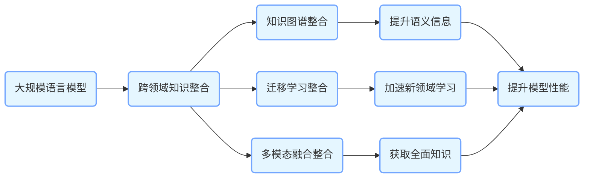

# 大规模语言模型的跨领域知识整合与应用

> 关键词：大规模语言模型、跨领域知识整合、知识图谱、迁移学习、多模态融合、应用场景、未来趋势

> 摘要：本文围绕大规模语言模型的跨领域知识整合与应用展开深入探讨。首先介绍了相关背景，包括目的范围、预期读者等内容。接着阐述了大规模语言模型、跨领域知识整合等核心概念及其联系，通过文本示意图和 Mermaid 流程图进行清晰展示。详细讲解了核心算法原理，结合 Python 源代码进行说明，同时给出了相关数学模型和公式并举例解释。通过项目实战，展示了代码实际案例并进行详细解读。分析了大规模语言模型跨领域知识整合的实际应用场景，推荐了相关的学习资源、开发工具框架以及论文著作。最后总结了未来发展趋势与挑战，还提供了常见问题解答和扩展阅读参考资料，旨在全面呈现大规模语言模型在跨领域知识整合与应用方面的理论与实践内容。

## 1. 背景介绍 
### 1.1 目的和范围
在当今信息爆炸的时代，各个领域都积累了海量的数据和知识。大规模语言模型作为自然语言处理领域的重要成果，具有强大的语言理解和生成能力。然而，单一领域的知识往往具有局限性，跨领域知识的整合能够打破知识壁垒，使大规模语言模型获取更全面、更丰富的知识，从而提升其性能和应用价值。

本文的目的在于深入研究大规模语言模型跨领域知识整合的原理、方法和应用，探讨如何将不同领域的知识有效地融合到语言模型中，以实现更智能、更通用的自然语言处理任务。范围涵盖了大规模语言模型的基本概念、跨领域知识整合的核心技术、实际应用场景以及未来发展趋势等方面。

### 1.2 预期读者
本文预期读者包括自然语言处理领域的研究人员、开发者、对人工智能和语言技术感兴趣的学生以及相关企业的技术人员。对于希望深入了解大规模语言模型和跨领域知识整合技术的读者，本文将提供全面而深入的技术讲解和实践指导。

### 1.3 文档结构概述
本文共分为十个部分。第一部分为背景介绍，阐述了研究的目的、范围、预期读者和文档结构概述。第二部分介绍核心概念与联系，包括大规模语言模型、跨领域知识整合等核心概念的原理和架构，并通过文本示意图和 Mermaid 流程图进行展示。第三部分讲解核心算法原理和具体操作步骤，结合 Python 源代码详细阐述。第四部分给出数学模型和公式，并进行详细讲解和举例说明。第五部分通过项目实战，展示代码实际案例并进行详细解释。第六部分分析实际应用场景。第七部分推荐相关的工具和资源，包括学习资源、开发工具框架和论文著作。第八部分总结未来发展趋势与挑战。第九部分为附录，提供常见问题与解答。第十部分提供扩展阅读和参考资料。

### 1.4 术语表
#### 1.4.1 核心术语定义
- **大规模语言模型（Large Language Model, LLM）**：基于深度学习技术，通过在大规模文本数据上进行训练得到的语言模型，具有强大的语言理解和生成能力，如 GPT 系列、BERT 等。
- **跨领域知识整合（Cross - domain Knowledge Integration）**：将来自不同领域的知识进行融合和统一，以提升语言模型在多个领域的性能和应用能力。
- **知识图谱（Knowledge Graph）**：一种用图结构来表示实体及其之间关系的语义网络，可用于存储和组织跨领域的知识。
- **迁移学习（Transfer Learning）**：将在一个领域中学习到的知识和技能迁移到另一个领域中，以加速模型在新领域的学习和提升性能。
- **多模态融合（Multimodal Fusion）**：将文本、图像、音频等多种模态的信息进行融合，以获取更全面的知识和更丰富的语义表示。

#### 1.4.2 相关概念解释
- **自然语言处理（Natural Language Processing, NLP）**：研究如何让计算机理解和处理人类语言的技术领域，大规模语言模型是 NLP 中的重要研究方向。
- **深度学习（Deep Learning）**：一种基于人工神经网络的机器学习方法，通过多层神经网络自动学习数据中的特征和模式，大规模语言模型通常基于深度学习技术构建。
- **预训练模型（Pre - trained Model）**：在大规模无监督数据上进行预训练得到的模型，大规模语言模型一般先进行预训练，然后再在特定任务上进行微调。

#### 1.4.3 缩略词列表
- **LLM**：Large Language Model（大规模语言模型）
- **NLP**：Natural Language Processing（自然语言处理）
- **KG**：Knowledge Graph（知识图谱）
- **TL**：Transfer Learning（迁移学习）
- **MF**：Multimodal Fusion（多模态融合）

## 2. 核心概念与联系 

### 2.1 大规模语言模型原理
大规模语言模型通常基于Transformer架构，Transformer 是一种基于注意力机制的深度学习模型，它能够捕捉文本中的长距离依赖关系。以 GPT 系列模型为例，它是一种自回归语言模型，通过预测下一个词来学习语言的模式和规律。

大规模语言模型的训练过程一般分为预训练和微调两个阶段。在预训练阶段，模型在大规模的无监督文本数据上进行训练，学习语言的通用知识和模式。在微调阶段，模型在特定任务的有监督数据上进行训练，以适应具体的应用场景。

### 2.2 跨领域知识整合原理
跨领域知识整合的目的是将不同领域的知识进行融合，以提升语言模型的性能和应用能力。常见的跨领域知识整合方法包括基于知识图谱的整合、基于迁移学习的整合和基于多模态融合的整合。

基于知识图谱的整合是将知识图谱中的结构化知识融入到语言模型中，使模型能够获取更丰富的语义信息。基于迁移学习的整合是将在一个领域中学习到的知识迁移到另一个领域中，以加速模型在新领域的学习。基于多模态融合的整合是将文本、图像、音频等多种模态的信息进行融合，以获取更全面的知识和更丰富的语义表示。

### 2.3 核心概念的联系
大规模语言模型是跨领域知识整合的基础，它提供了强大的语言处理能力。跨领域知识整合则可以为大规模语言模型提供更丰富的知识和更全面的语义信息，从而提升模型的性能和应用能力。知识图谱、迁移学习和多模态融合等技术是实现跨领域知识整合的重要手段，它们相互配合，共同促进大规模语言模型在跨领域知识整合方面的发展。

### 2.4 文本示意图
大规模语言模型、跨领域知识整合及其相关技术的关系可以用以下文本示意图表示：

大规模语言模型是核心，它通过预训练和微调学习语言的通用知识和模式。跨领域知识整合是目标，通过知识图谱、迁移学习和多模态融合等技术手段，将不同领域的知识融入到大规模语言模型中，提升模型的性能和应用能力。知识图谱提供结构化的知识，迁移学习实现知识的跨领域迁移，多模态融合整合多种模态的信息。

### 2.5 Mermaid 流程图


## 3. 核心算法原理 & 具体操作步骤 

### 3.1 基于知识图谱的整合算法原理
基于知识图谱的整合算法的核心思想是将知识图谱中的结构化知识融入到语言模型中。具体步骤如下：

1. **知识图谱的构建**：收集不同领域的知识，构建知识图谱。知识图谱中的节点表示实体，边表示实体之间的关系。
2. **实体链接**：将文本中的实体与知识图谱中的实体进行链接，确定文本中实体的具体指代。
3. **知识注入**：将知识图谱中与文本相关的知识信息注入到语言模型中，以提升模型的语义理解能力。

以下是一个简单的 Python 示例代码，演示如何进行实体链接：

```python
import spacy
from spacy.kb import KnowledgeBase

# 加载预训练的语言模型
nlp = spacy.load("en_core_web_sm")

# 创建知识图谱
kb = KnowledgeBase(vocab=nlp.vocab, entity_vector_length=300)

# 添加实体到知识图谱
entity_id = "Q123"
entity_desc = "A well - known entity"
entity_vector = nlp("This is a sample entity").vector
kb.add_entity(entity=entity_id, freq=342, entity_vector=entity_vector, desc=entity_desc)

# 添加别名到知识图谱
alias = "Sample Entity"
kb.add_alias(alias=alias, entities=[entity_id], probabilities=[1.0])

# 处理文本
text = "I am talking about Sample Entity"
doc = nlp(text)

# 进行实体链接
for ent in doc.ents:
    candidates = kb.get_candidates(ent.text)
    for candidate in candidates:
        print(f"Entity: {ent.text}, Candidate ID: {candidate.entity_}, Score: {candidate.prior_prob}")
```

### 3.2 基于迁移学习的整合算法原理
基于迁移学习的整合算法的核心思想是将在一个领域中学习到的知识迁移到另一个领域中。具体步骤如下：

1. **源领域模型训练**：在源领域的数据集上训练一个预训练模型。
2. **目标领域数据准备**：收集目标领域的数据集。
3. **模型微调**：使用目标领域的数据集对预训练模型进行微调，使其适应目标领域的任务。

以下是一个简单的 Python 示例代码，演示如何使用 Hugging Face 的 Transformers 库进行模型微调：

```python
from transformers import AutoTokenizer, AutoModelForSequenceClassification
from datasets import load_dataset
import torch
from torch.utils.data import DataLoader
from transformers import AdamW

# 加载预训练模型和分词器
model_name = "bert-base-uncased"
tokenizer = AutoTokenizer.from_pretrained(model_name)
model = AutoModelForSequenceClassification.from_pretrained(model_name, num_labels=2)

# 加载数据集
dataset = load_dataset("imdb")

# 数据预处理
def preprocess_function(examples):
    return tokenizer(examples["text"], truncation=True, padding="max_length", max_length=128)

tokenized_dataset = dataset.map(preprocess_function, batched=True)

# 创建数据加载器
train_dataset = tokenized_dataset["train"]
train_dataloader = DataLoader(train_dataset, batch_size=16, shuffle=True)

# 定义优化器
optimizer = AdamW(model.parameters(), lr=5e-5)

# 训练模型
device = torch.device("cuda" if torch.cuda.is_available() else "cpu")
model.to(device)

for epoch in range(3):
    model.train()
    for batch in train_dataloader:
        batch = {k: v.to(device) for k, v in batch.items()}
        outputs = model(**batch)
        loss = outputs.loss
        loss.backward()
        optimizer.step()
        optimizer.zero_grad()
```

### 3.3 基于多模态融合的整合算法原理
基于多模态融合的整合算法的核心思想是将文本、图像、音频等多种模态的信息进行融合。具体步骤如下：

1. **多模态数据采集**：收集文本、图像、音频等多模态数据。
2. **特征提取**：分别对不同模态的数据进行特征提取。
3. **模态融合**：将不同模态的特征进行融合，得到多模态特征表示。
4. **模型训练**：使用多模态特征表示训练语言模型。

以下是一个简单的 Python 示例代码，演示如何进行文本和图像的特征融合：

```python
import torch
import torch.nn as nn
from transformers import AutoTokenizer, AutoModel

# 文本特征提取
tokenizer = AutoTokenizer.from_pretrained("bert-base-uncased")
text_model = AutoModel.from_pretrained("bert-base-uncased")

text = "This is a sample text"
inputs = tokenizer(text, return_tensors="pt")
text_outputs = text_model(**inputs)
text_features = text_outputs.last_hidden_state.mean(dim=1)

# 图像特征提取（假设使用预训练的 ResNet 模型）
import torchvision.models as models
image_model = models.resnet18(pretrained=True)
image_model.eval()

image = torch.randn(1, 3, 224, 224)  # 示例图像
with torch.no_grad():
    image_features = image_model(image)

# 模态融合
fusion_layer = nn.Linear(text_features.size(1) + image_features.size(1), 128)
combined_features = torch.cat((text_features, image_features), dim=1)
fused_features = fusion_layer(combined_features)
```

## 4. 数学模型和公式 & 详细讲解 & 举例说明 

### 4.1 基于知识图谱的整合数学模型
设知识图谱为 $G=(V, E)$，其中 $V$ 是节点集合，$E$ 是边集合。文本中的实体集合为 $S=\{s_1, s_2, \cdots, s_n\}$，知识图谱中的实体集合为 $V=\{v_1, v_2, \cdots, v_m\}$。实体链接的目标是找到一个映射 $\phi:S\rightarrow V$，使得 $\phi(s_i)=v_j$ 表示文本中的实体 $s_i$ 链接到知识图谱中的实体 $v_j$。

实体链接的概率可以表示为：

$$P(\phi(s_i)=v_j|s_i)=\frac{\text{sim}(s_i, v_j)}{\sum_{k = 1}^{m}\text{sim}(s_i, v_k)}$$

其中 $\text{sim}(s_i, v_j)$ 表示实体 $s_i$ 和 $v_j$ 之间的相似度，可以使用词向量的余弦相似度等方法计算。

举例说明：假设文本中有实体 “苹果”，知识图谱中有实体 “苹果公司” 和 “水果苹果”。通过计算 “苹果” 与 “苹果公司” 和 “水果苹果” 的相似度，得到 $\text{sim}(苹果, 苹果公司)=0.8$，$\text{sim}(苹果, 水果苹果)=0.2$。则 “苹果” 链接到 “苹果公司” 的概率为：

$$P(\text{苹果}=\text{苹果公司}|\text{苹果})=\frac{0.8}{0.8 + 0.2}=0.8$$

### 4.2 基于迁移学习的整合数学模型
设源领域的数据集为 $D_s=\{(x_{s1}, y_{s1}), (x_{s2}, y_{s2}), \cdots, (x_{sn}, y_{sn})\}$，目标领域的数据集为 $D_t=\{(x_{t1}, y_{t1}), (x_{t2}, y_{t2}), \cdots, (x_{tm}, y_{tm})\}$。预训练模型的参数为 $\theta$，微调模型的目标是最小化目标领域的损失函数 $L_t(\theta)$：

$$\theta^*=\arg\min_{\theta}L_t(\theta)=\arg\min_{\theta}\sum_{i = 1}^{m}l(y_{ti}, f(x_{ti};\theta))$$

其中 $l$ 是损失函数，$f(x_{ti};\theta)$ 是模型在输入 $x_{ti}$ 下的输出。

举例说明：假设源领域是情感分析任务，目标领域是文本分类任务。预训练模型在源领域数据集上进行训练，得到参数 $\theta_0$。然后在目标领域数据集上进行微调，通过最小化交叉熵损失函数来更新参数 $\theta$，直到收敛。

### 4.3 基于多模态融合的整合数学模型
设文本特征为 $x_t\in\mathbb{R}^{d_t}$，图像特征为 $x_i\in\mathbb{R}^{d_i}$，融合后的特征为 $x_f\in\mathbb{R}^{d_f}$。模态融合可以通过线性变换和非线性激活函数实现：

$$x_f = \sigma(W_1[x_t; x_i]+b_1)$$

其中 $W_1\in\mathbb{R}^{d_f\times(d_t + d_i)}$ 是权重矩阵，$b_1\in\mathbb{R}^{d_f}$ 是偏置向量，$\sigma$ 是非线性激活函数，如 ReLU 函数。

举例说明：假设文本特征维度 $d_t = 768$，图像特征维度 $d_i = 512$，融合后的特征维度 $d_f = 128$。则权重矩阵 $W_1$ 的形状为 $(128, 768 + 512)=(128, 1280)$，偏置向量 $b_1$ 的形状为 $(128,)$。

## 5. 项目实战：代码实际案例和详细解释说明 

### 5.1  开发环境搭建
- **操作系统**：推荐使用 Linux 系统，如 Ubuntu 18.04 及以上版本。
- **Python 环境**：Python 3.7 及以上版本。
- **深度学习框架**：PyTorch 1.7 及以上版本，Hugging Face Transformers 库。
- **数据处理库**：NumPy、Pandas 等。
- **可视化库**：Matplotlib、Seaborn 等。

可以使用以下命令安装所需的库：

```bash
pip install torch transformers numpy pandas matplotlib seaborn
```

### 5.2  源代码详细实现和代码解读
以下是一个基于迁移学习的文本分类项目实战代码：

```python
# 导入必要的库
from transformers import AutoTokenizer, AutoModelForSequenceClassification
from datasets import load_dataset
import torch
from torch.utils.data import DataLoader
from transformers import AdamW
import numpy as np
from sklearn.metrics import accuracy_score

# 加载预训练模型和分词器
model_name = "bert-base-uncased"
tokenizer = AutoTokenizer.from_pretrained(model_name)
model = AutoModelForSequenceClassification.from_pretrained(model_name, num_labels=2)

# 加载数据集
dataset = load_dataset("imdb")

# 数据预处理
def preprocess_function(examples):
    return tokenizer(examples["text"], truncation=True, padding="max_length", max_length=128)

tokenized_dataset = dataset.map(preprocess_function, batched=True)

# 创建数据加载器
train_dataset = tokenized_dataset["train"]
train_dataloader = DataLoader(train_dataset, batch_size=16, shuffle=True)

test_dataset = tokenized_dataset["test"]
test_dataloader = DataLoader(test_dataset, batch_size=16, shuffle=False)

# 定义优化器
optimizer = AdamW(model.parameters(), lr=5e-5)

# 训练模型
device = torch.device("cuda" if torch.cuda.is_available() else "cpu")
model.to(device)

num_epochs = 3
for epoch in range(num_epochs):
    model.train()
    train_losses = []
    for batch in train_dataloader:
        batch = {k: v.to(device) for k, v in batch.items()}
        outputs = model(**batch)
        loss = outputs.loss
        train_losses.append(loss.item())
        loss.backward()
        optimizer.step()
        optimizer.zero_grad()
    print(f"Epoch {epoch + 1}, Train Loss: {np.mean(train_losses)}")

# 评估模型
model.eval()
test_preds = []
test_labels = []
with torch.no_grad():
    for batch in test_dataloader:
        batch = {k: v.to(device) for k, v in batch.items()}
        outputs = model(**batch)
        logits = outputs.logits
        preds = torch.argmax(logits, dim=1)
        test_preds.extend(preds.cpu().tolist())
        test_labels.extend(batch["labels"].cpu().tolist())

accuracy = accuracy_score(test_labels, test_preds)
print(f"Test Accuracy: {accuracy}")
```

### 5.3  代码解读与分析
1. **导入必要的库**：导入了用于加载预训练模型和分词器的 `transformers` 库，用于加载数据集的 `datasets` 库，以及用于深度学习训练的 `torch` 库等。
2. **加载预训练模型和分词器**：使用 `AutoTokenizer` 和 `AutoModelForSequenceClassification` 从 Hugging Face 的模型库中加载预训练的 BERT 模型和对应的分词器。
3. **加载数据集**：使用 `load_dataset` 函数加载 IMDB 电影评论数据集。
4. **数据预处理**：定义了 `preprocess_function` 函数，使用分词器对文本进行分词和填充，将文本转换为模型可以接受的输入格式。
5. **创建数据加载器**：使用 `DataLoader` 函数创建训练集和测试集的数据加载器，设置批量大小和是否打乱数据。
6. **定义优化器**：使用 `AdamW` 优化器对模型的参数进行更新。
7. **训练模型**：将模型移动到 GPU 或 CPU 上，进行多个 epoch 的训练。在每个 epoch 中，遍历训练集的数据加载器，计算损失并进行反向传播和参数更新。
8. **评估模型**：将模型设置为评估模式，遍历测试集的数据加载器，获取模型的预测结果和真实标签，计算准确率。

## 6. 实际应用场景 
### 6.1 智能客服
在智能客服领域，大规模语言模型的跨领域知识整合可以使客服系统具备更全面的知识和更智能的对话能力。例如，一个电商平台的智能客服系统可以整合商品知识、物流知识、售后知识等多个领域的知识。当用户咨询商品信息时，系统可以准确地回答商品的特点、规格、价格等信息；当用户咨询物流状态时，系统可以提供物流跟踪信息；当用户遇到售后问题时，系统可以指导用户进行退换货等操作。

### 6.2 医疗辅助诊断
在医疗领域，大规模语言模型的跨领域知识整合可以辅助医生进行诊断。通过整合医学知识图谱、临床病历数据、医学文献等多个领域的知识，语言模型可以对患者的症状、检查结果等信息进行分析和推理，为医生提供诊断建议和参考。例如，当医生输入患者的症状和检查结果时，系统可以根据整合的知识，给出可能的疾病诊断和相应的治疗方案。

### 6.3 智能教育
在智能教育领域，大规模语言模型的跨领域知识整合可以提供个性化的学习支持。通过整合不同学科的知识、学习资源和学生的学习数据，语言模型可以根据学生的学习情况和需求，提供针对性的学习建议和辅导。例如，对于一个学习数学的学生，系统可以根据学生的错题情况和学习进度，推荐适合的学习资料和练习题目，并提供详细的解答和讲解。

### 6.4 金融风险评估
在金融领域，大规模语言模型的跨领域知识整合可以用于风险评估。通过整合金融市场数据、企业财务数据、行业动态等多个领域的知识，语言模型可以对企业的信用风险、市场风险等进行评估和预测。例如，银行可以使用该系统对贷款申请人的信用状况进行评估，判断其是否有能力按时偿还贷款。

## 7. 工具和资源推荐
### 7.1 学习资源推荐
#### 7.1.1 书籍推荐
- 《深度学习》（Deep Learning）：由 Ian Goodfellow、Yoshua Bengio 和 Aaron Courville 所著，是深度学习领域的经典教材，涵盖了深度学习的基本原理、算法和应用。
- 《自然语言处理入门》：何晗所著，适合初学者快速入门自然语言处理领域，介绍了自然语言处理的基本概念、算法和实践方法。
- 《动手学深度学习》（Dive into Deep Learning）：由 Aston Zhang、Zachary C. Lipton、Mu Li 和 Alexander J. Smola 所著，提供了丰富的代码示例和实践指导，帮助读者更好地理解和应用深度学习技术。

#### 7.1.2 在线课程
- Coursera 上的 “Natural Language Processing Specialization”：由深度学习领域的知名学者授课，系统地介绍了自然语言处理的各个方面，包括词法分析、句法分析、语义理解、文本生成等。
- edX 上的 “Deep Learning Fundamentals”：帮助学习者掌握深度学习的基本原理和算法，为学习大规模语言模型和跨领域知识整合打下基础。
- B 站上的 “李沐的深度学习课程”：以通俗易懂的方式讲解深度学习的知识，包括代码实现和实践案例，适合初学者学习。

#### 7.1.3 技术博客和网站
- Hugging Face Blog：提供了关于大规模语言模型和自然语言处理的最新研究成果和技术应用，是了解该领域前沿动态的重要渠道。
- Medium 上的 Towards Data Science：有许多关于深度学习、自然语言处理等领域的技术文章和实践经验分享。
- arXiv.org：是一个开放的学术预印本平台，包含了大量的人工智能和自然语言处理领域的研究论文，可以及时了解最新的研究进展。

### 7.2 开发工具框架推荐
#### 7.2.1 IDE和编辑器
- PyCharm：是一款专门为 Python 开发设计的集成开发环境，提供了丰富的代码编辑、调试、版本控制等功能，方便开发者进行大规模语言模型的开发和调试。
- Visual Studio Code：是一款轻量级的代码编辑器，支持多种编程语言和插件扩展，具有良好的代码高亮、智能提示等功能，适合快速开发和实验。
- Jupyter Notebook：是一个交互式的开发环境，支持代码、文本、图表等多种形式的展示，方便进行数据分析、模型训练和结果可视化。

#### 7.2.2 调试和性能分析工具
- TensorBoard：是 TensorFlow 提供的可视化工具，可以用于监控模型的训练过程，如损失函数的变化、准确率的变化等，还可以可视化模型的结构和参数分布。
- PyTorch Profiler：是 PyTorch 提供的性能分析工具，可以帮助开发者分析模型的性能瓶颈，如计算时间、内存占用等，以便进行优化。
- NVIDIA Nsight Systems：是 NVIDIA 提供的性能分析工具，专门用于分析 GPU 加速的深度学习模型的性能，帮助开发者优化 GPU 代码。

#### 7.2.3 相关框架和库
- Hugging Face Transformers：是一个用于自然语言处理的开源库，提供了大量的预训练模型和工具，方便开发者进行大规模语言模型的开发和应用。
- PyTorch：是一个广泛使用的深度学习框架，具有动态图和丰富的工具库，适合进行大规模语言模型的研究和开发。
- AllenNLP：是一个用于自然语言处理的深度学习框架，提供了许多预定义的模型和工具，方便开发者进行自然语言处理任务的开发。

### 7.3 相关论文著作推荐
#### 7.3.1 经典论文
- “Attention Is All You Need”：提出了 Transformer 架构，为大规模语言模型的发展奠定了基础。
- “BERT: Pre - training of Deep Bidirectional Transformers for Language Understanding”：介绍了 BERT 模型，是预训练语言模型的重要突破。
- “GPT: Generative Pretrained Transformer”：介绍了 GPT 模型，开创了自回归语言模型的先河。

#### 7.3.2 最新研究成果
- 关注 arXiv.org 上关于大规模语言模型和跨领域知识整合的最新论文，如关于多模态语言模型、知识增强语言模型等方面的研究。
- 阅读顶级学术会议如 ACL（Association for Computational Linguistics）、EMNLP（Conference on Empirical Methods in Natural Language Processing）等上的相关论文。

#### 7.3.3 应用案例分析
- 一些知名企业和研究机构发布的关于大规模语言模型在实际应用中的案例分析报告，如 Google、Microsoft、OpenAI 等公司的相关技术博客和研究报告。

## 8. 总结：未来发展趋势与挑战
### 8.1 未来发展趋势
- **多模态融合的深入发展**：未来大规模语言模型将更加注重多模态融合，不仅整合文本、图像、音频等多种模态的信息，还将探索与其他传感器数据的融合，如触觉、嗅觉等，以实现更全面、更智能的交互。
- **知识增强的语言模型**：通过更深入地整合知识图谱等结构化知识，使语言模型具备更强的推理和决策能力，能够更好地处理复杂的任务和问题。
- **个性化和定制化**：根据用户的需求和偏好，为用户提供个性化和定制化的语言服务，如个性化的智能客服、学习辅导等。
- **跨领域应用的拓展**：大规模语言模型的跨领域知识整合将在更多领域得到应用，如法律、农业、环保等，为各个领域的发展提供支持。

### 8.2 挑战
- **数据隐私和安全问题**：在跨领域知识整合过程中，需要处理大量的敏感数据，如医疗数据、金融数据等，如何保障数据的隐私和安全是一个重要的挑战。
- **知识的一致性和准确性**：不同领域的知识可能存在冲突和不一致的情况，如何整合和处理这些知识，保证知识的一致性和准确性是一个难题。
- **计算资源和效率问题**：大规模语言模型的训练和推理需要大量的计算资源，如何提高计算效率，降低计算成本是一个亟待解决的问题。
- **伦理和道德问题**：大规模语言模型的应用可能会带来一些伦理和道德问题，如虚假信息传播、算法偏见等，需要建立相应的伦理和道德规范来引导其发展。

## 9. 附录：常见问题与解答
### 9.1 大规模语言模型跨领域知识整合的主要困难是什么？
主要困难包括不同领域知识的异构性、知识的一致性和准确性问题、数据隐私和安全问题以及计算资源和效率问题等。不同领域的知识具有不同的表示方式和语义，如何将它们有效地整合是一个挑战。同时，保证整合后的知识的一致性和准确性也需要复杂的处理和验证。此外，数据隐私和安全以及计算资源的限制也给跨领域知识整合带来了困难。

### 9.2 如何选择适合的跨领域知识整合方法？
选择适合的跨领域知识整合方法需要考虑多个因素，如数据的特点、任务的需求、领域的特点等。如果领域知识具有明确的结构化表示，可以考虑基于知识图谱的整合方法；如果目标领域数据较少，可以考虑基于迁移学习的整合方法；如果需要整合多种模态的信息，可以考虑基于多模态融合的整合方法。

### 9.3 大规模语言模型跨领域知识整合在实际应用中可能会遇到哪些问题？
在实际应用中可能会遇到数据质量问题、模型泛化能力问题、用户接受度问题等。数据质量问题可能导致模型的性能下降，模型泛化能力不足可能无法在新的领域和任务中取得良好的效果，用户接受度问题可能影响系统的推广和应用。

### 9.4 如何评估大规模语言模型跨领域知识整合的效果？
可以从多个方面评估大规模语言模型跨领域知识整合的效果，如模型的准确率、召回率、F1 值等指标，以及用户的反馈和满意度。同时，还可以通过对比实验，比较整合前后模型在不同领域和任务中的性能差异。

## 10. 扩展阅读 & 参考资料
- Goodfellow, I., Bengio, Y., & Courville, A. (2016). Deep Learning. MIT Press.
- 何晗. (2019). 自然语言处理入门. 人民邮电出版社.
- Zhang, A., Lipton, Z. C., Li, M., & Smola, A. J. (2020). Dive into Deep Learning.
- Vaswani, A., Shazeer, N., Parmar, N., Uszkoreit, J., Jones, L., Gomez, A. N., ... & Polosukhin, I. (2017). Attention is all you need. Advances in neural information processing systems.
- Devlin, J., Chang, M. W., Lee, K., & Toutanova, K. (2018). Bert: Pre - training of deep bidirectional transformers for language understanding. arXiv preprint arXiv:1810.04805.
- Radford, A., Narasimhan, K., Salimans, T., & Sutskever, I. (2018). Improving language understanding by generative pre - training.

作者：AI天才研究院/AI Genius Institute & 禅与计算机程序设计艺术 /Zen And The Art of Computer Programming