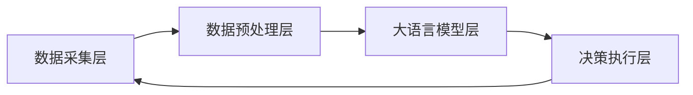

# 大语言模型在智能制造工艺优化中的推理应用

> 关键词：大语言模型、智能制造、工艺优化、推理应用、工业智能

> 摘要：本文聚焦于大语言模型在智能制造工艺优化中的推理应用。首先介绍了相关背景，包括目的范围、预期读者等内容。接着阐述核心概念，分析大语言模型与智能制造工艺优化之间的联系，并给出相应的原理架构示意图和流程图。详细讲解了核心算法原理及具体操作步骤，结合 Python 代码进行说明。深入探讨了数学模型和公式，通过举例加深理解。进行项目实战，从开发环境搭建到源代码实现与解读，全面展示应用过程。探讨了实际应用场景，推荐了学习、开发相关的工具和资源，最后总结未来发展趋势与挑战，解答常见问题并提供扩展阅读和参考资料，旨在为大语言模型在智能制造工艺优化领域的应用提供全面的技术指导和深入的思考。

## 1. 背景介绍 
### 1.1 目的和范围
随着智能制造的快速发展，工艺优化成为提高生产效率、降低成本、提升产品质量的关键环节。大语言模型作为人工智能领域的重要突破，具备强大的语言理解和推理能力。本文章的目的在于深入探讨大语言模型如何在智能制造工艺优化中发挥推理应用的作用，分析其原理、方法和实际应用效果。范围涵盖大语言模型的基本原理、在智能制造工艺优化中的具体应用场景、相关算法和数学模型，以及实际项目中的开发和应用实践。

### 1.2 预期读者
本文预期读者包括智能制造领域的工程师、技术研发人员、人工智能研究者、工业企业的管理人员等。对于希望了解大语言模型在智能制造中应用的相关人士，以及致力于提升智能制造工艺水平的专业人员都具有参考价值。

### 1.3 文档结构概述
本文将按照以下结构进行阐述：首先介绍背景信息，包括目的范围、预期读者和文档结构。接着讲解核心概念与联系，分析大语言模型与智能制造工艺优化的关联。然后详细阐述核心算法原理和具体操作步骤，结合 Python 代码说明。随后介绍数学模型和公式，并举例说明。进行项目实战，包括开发环境搭建、源代码实现和解读。探讨实际应用场景，推荐相关的工具和资源。最后总结未来发展趋势与挑战，解答常见问题并提供扩展阅读和参考资料。

### 1.4 术语表
#### 1.4.1 核心术语定义
- **大语言模型**：基于大规模语料库训练得到的深度学习模型，能够处理自然语言任务，如文本生成、问答系统、语言理解等。常见的大语言模型有 GPT 系列、BERT 等。
- **智能制造**：将人工智能技术与制造过程相结合，实现生产过程的自动化、智能化和柔性化。通过传感器、物联网、大数据等技术，实现对生产过程的实时监测和优化。
- **工艺优化**：对制造工艺进行改进和调整，以提高生产效率、降低成本、提升产品质量。包括工艺参数优化、工艺流程优化等方面。
- **推理应用**：利用大语言模型的推理能力，对智能制造中的工艺问题进行分析和决策，提供优化建议。

#### 1.4.2 相关概念解释
- **深度学习**：一种基于人工神经网络的机器学习方法，通过多层神经网络对数据进行特征提取和学习，能够处理复杂的非线性关系。
- **自然语言处理**：研究如何让计算机理解和处理人类语言的技术，包括文本分类、情感分析、机器翻译等任务。
- **工业物联网**：将物联网技术应用于工业领域，实现设备之间的互联互通和数据共享，为智能制造提供数据支持。

#### 1.4.3 缩略词列表
- **LLM**：Large Language Model，大语言模型
- **AI**：Artificial Intelligence，人工智能
- **IoT**：Internet of Things，物联网
- **PLC**：Programmable Logic Controller，可编程逻辑控制器

## 2. 核心概念与联系 
### 核心概念原理
大语言模型的核心原理基于深度学习中的Transformer架构。Transformer架构通过自注意力机制（Self - Attention Mechanism）能够捕捉输入序列中不同位置之间的依赖关系，从而在处理长文本时表现出色。其训练过程通常采用无监督学习和有监督学习相结合的方式，在大规模文本数据上进行预训练，学习语言的通用模式和语义信息。然后可以在特定任务上进行微调，以适应不同的应用场景。

在智能制造工艺优化中，核心目标是通过对工艺数据的分析和处理，找到最优的工艺参数和流程。工艺数据包括设备运行参数、生产环境数据、产品质量数据等。通过对这些数据的挖掘和分析，可以发现潜在的问题和改进空间。

### 架构的文本示意图
大语言模型在智能制造工艺优化中的应用架构可以分为以下几个层次：
- **数据采集层**：通过传感器、工业物联网设备等收集生产过程中的各种数据，包括设备状态、工艺参数、产品质量等数据。
- **数据预处理层**：对采集到的数据进行清洗、转换、归一化等处理，以提高数据质量，便于后续分析。
- **大语言模型层**：将预处理后的数据输入到大语言模型中，利用大语言模型的推理能力进行分析和决策。大语言模型可以对工艺问题进行诊断、预测和优化建议。
- **决策执行层**：根据大语言模型的输出结果，对生产过程进行调整和优化，如调整工艺参数、优化工艺流程等。

### Mermaid 流程图

该流程图展示了大语言模型在智能制造工艺优化中的循环应用过程。数据采集层收集生产数据，经过预处理后输入到大语言模型层进行分析和推理，决策执行层根据推理结果对生产过程进行调整，调整后的生产数据又会被采集层收集，形成一个闭环优化过程。

## 3. 核心算法原理 & 具体操作步骤 
### 核心算法原理
在大语言模型中，Transformer架构的核心是自注意力机制。自注意力机制可以计算输入序列中每个位置与其他位置之间的相关性，从而为每个位置分配不同的权重。具体来说，对于输入序列 $X = [x_1, x_2, \cdots, x_n]$，自注意力机制的计算步骤如下：
1. 计算查询（Query）、键（Key）和值（Value）向量：
   - $Q = XW_Q$
   - $K = XW_K$
   - $V = XW_V$
   其中，$W_Q$、$W_K$ 和 $W_V$ 是可学习的权重矩阵。
2. 计算注意力分数：
   - $scores = \frac{QK^T}{\sqrt{d_k}}$
   其中，$d_k$ 是键向量的维度。
3. 应用 softmax 函数得到注意力权重：
   - $weights = softmax(scores)$
4. 计算加权和得到输出：
   - $output = weightsV$

### 具体操作步骤
#### 步骤 1：数据准备
收集智能制造中的工艺数据，包括设备运行参数、生产环境数据、产品质量数据等。对数据进行清洗和预处理，去除噪声和异常值，将数据转换为适合大语言模型输入的格式。

#### 步骤 2：模型选择和加载
选择合适的大语言模型，如 GPT - 3、BERT 等。可以使用开源的大语言模型库，如 Hugging Face 的 Transformers 库，加载预训练的模型。

#### 步骤 3：模型微调
如果预训练的模型不能完全满足智能制造工艺优化的需求，可以在特定的工艺数据集上对模型进行微调。微调的过程通常是在预训练模型的基础上，添加一个或多个全连接层，然后在工艺数据集上进行有监督学习。

#### 步骤 4：推理应用
将预处理后的工艺数据输入到微调后的大语言模型中，进行推理分析。大语言模型可以输出工艺问题的诊断结果、预测结果和优化建议。

#### 步骤 5：决策执行
根据大语言模型的输出结果，对生产过程进行调整和优化。例如，调整工艺参数、优化工艺流程等。

### Python 代码示例
```python
import torch
from transformers import AutoTokenizer, AutoModelForSequenceClassification

# 步骤 1：数据准备
data = ["工艺参数：温度 80 度，压力 10 MPa，产品质量：合格",
        "工艺参数：温度 90 度，压力 12 MPa，产品质量：不合格"]
labels = [1, 0]

# 步骤 2：模型选择和加载
tokenizer = AutoTokenizer.from_pretrained("bert-base-uncased")
model = AutoModelForSequenceClassification.from_pretrained("bert-base-uncased", num_labels=2)

# 步骤 3：模型微调
inputs = tokenizer(data, return_tensors="pt", padding=True, truncation=True)
labels = torch.tensor(labels)

optimizer = torch.optim.Adam(model.parameters(), lr=1e-5)
for epoch in range(3):
    outputs = model(**inputs, labels=labels)
    loss = outputs.loss
    loss.backward()
    optimizer.step()
    optimizer.zero_grad()

# 步骤 4：推理应用
test_data = ["工艺参数：温度 85 度，压力 11 MPa"]
test_inputs = tokenizer(test_data, return_tensors="pt", padding=True, truncation=True)
with torch.no_grad():
    outputs = model(**test_inputs)
    logits = outputs.logits
    predictions = torch.argmax(logits, dim=1)
    print("预测结果：", predictions.item())

# 步骤 5：决策执行
if predictions.item() == 1:
    print("维持当前工艺参数")
else:
    print("调整工艺参数")
```
这段代码展示了一个简单的大语言模型在智能制造工艺优化中的应用过程。首先准备了工艺数据和标签，然后选择并加载了 BERT 模型，对模型进行了微调，最后进行推理并根据推理结果做出决策。

## 4. 数学模型和公式 & 详细讲解 & 举例说明 
### 自注意力机制的数学模型
自注意力机制的核心公式在前面已经介绍过，下面详细讲解其含义。

#### 计算查询、键和值向量
$Q = XW_Q$，$K = XW_K$，$V = XW_V$ 这三个公式将输入序列 $X$ 分别通过不同的线性变换得到查询、键和值向量。$W_Q$、$W_K$ 和 $W_V$ 是可学习的权重矩阵，它们的作用是将输入向量映射到不同的特征空间。

#### 计算注意力分数
$scores = \frac{QK^T}{\sqrt{d_k}}$ 计算了查询向量和键向量之间的相似度。除以 $\sqrt{d_k}$ 是为了防止点积结果过大，导致 softmax 函数的梯度消失。

#### 应用 softmax 函数得到注意力权重
$weights = softmax(scores)$ 将注意力分数转换为概率分布，使得每个位置的权重之和为 1。

#### 计算加权和得到输出
$output = weightsV$ 根据注意力权重对值向量进行加权求和，得到最终的输出。

### 举例说明
假设输入序列 $X$ 是一个长度为 3 的向量序列，每个向量的维度为 4，即 $X = \begin{bmatrix}1 & 2 & 3 & 4\\5 & 6 & 7 & 8\\9 & 10 & 11 & 12\end{bmatrix}$。

#### 计算查询、键和值向量
假设 $W_Q$、$W_K$ 和 $W_V$ 都是 $4\times4$ 的矩阵，例如：
$W_Q = \begin{bmatrix}0.1 & 0.2 & 0.3 & 0.4\\0.5 & 0.6 & 0.7 & 0.8\\0.9 & 1.0 & 1.1 & 1.2\\1.3 & 1.4 & 1.5 & 1.6\end{bmatrix}$
$W_K = \begin{bmatrix}0.2 & 0.3 & 0.4 & 0.5\\0.6 & 0.7 & 0.8 & 0.9\\1.0 & 1.1 & 1.2 & 1.3\\1.4 & 1.5 & 1.6 & 1.7\end{bmatrix}$
$W_V = \begin{bmatrix}0.3 & 0.4 & 0.5 & 0.6\\0.7 & 0.8 & 0.9 & 1.0\\1.1 & 1.2 & 1.3 & 1.4\\1.5 & 1.6 & 1.7 & 1.8\end{bmatrix}$

则 $Q = XW_Q$，$K = XW_K$，$V = XW_V$ 可以通过矩阵乘法计算得到。

#### 计算注意力分数
$scores = \frac{QK^T}{\sqrt{d_k}}$，其中 $d_k = 4$。通过矩阵乘法和除法运算得到注意力分数矩阵。

#### 应用 softmax 函数得到注意力权重
对注意力分数矩阵应用 softmax 函数，得到注意力权重矩阵。

#### 计算加权和得到输出
$output = weightsV$ 通过矩阵乘法得到最终的输出向量。

## 5. 项目实战：代码实际案例和详细解释说明 
### 5.1  开发环境搭建
#### 安装 Python
首先需要安装 Python 环境，建议使用 Python 3.7 及以上版本。可以从 Python 官方网站（https://www.python.org/downloads/）下载并安装。

#### 安装必要的库
使用 pip 安装必要的库，包括 Transformers、torch 等。
```bash
pip install transformers torch
```

### 5.2  源代码详细实现和代码解读
```python
import torch
from transformers import AutoTokenizer, AutoModelForSequenceClassification

# 数据准备
data = ["工艺参数：温度 80 度，压力 10 MPa，产品质量：合格",
        "工艺参数：温度 90 度，压力 12 MPa，产品质量：不合格"]
labels = [1, 0]

# 模型选择和加载
tokenizer = AutoTokenizer.from_pretrained("bert-base-uncased")
model = AutoModelForSequenceClassification.from_pretrained("bert-base-uncased", num_labels=2)

# 数据预处理
inputs = tokenizer(data, return_tensors="pt", padding=True, truncation=True)
labels = torch.tensor(labels)

# 定义优化器
optimizer = torch.optim.Adam(model.parameters(), lr=1e-5)

# 模型微调
for epoch in range(3):
    outputs = model(**inputs, labels=labels)
    loss = outputs.loss
    loss.backward()
    optimizer.step()
    optimizer.zero_grad()

# 推理应用
test_data = ["工艺参数：温度 85 度，压力 11 MPa"]
test_inputs = tokenizer(test_data, return_tensors="pt", padding=True, truncation=True)
with torch.no_grad():
    outputs = model(**test_inputs)
    logits = outputs.logits
    predictions = torch.argmax(logits, dim=1)
    print("预测结果：", predictions.item())

# 决策执行
if predictions.item() == 1:
    print("维持当前工艺参数")
else:
    print("调整工艺参数")
```
### 代码解读与分析
#### 数据准备
定义了一个包含工艺数据的列表 `data` 和对应的标签列表 `labels`。这些数据模拟了智能制造中的工艺信息和产品质量情况。

#### 模型选择和加载
使用 `AutoTokenizer` 和 `AutoModelForSequenceClassification` 从 Hugging Face 的模型库中加载预训练的 BERT 模型。`AutoTokenizer` 用于将文本数据转换为模型可以接受的输入格式，`AutoModelForSequenceClassification` 用于进行文本分类任务。

#### 数据预处理
使用 `tokenizer` 对数据进行预处理，将文本转换为张量形式，并进行填充和截断操作，以确保输入数据的长度一致。

#### 定义优化器
使用 Adam 优化器对模型的参数进行更新，学习率设置为 $1e - 5$。

#### 模型微调
在一个循环中对模型进行 3 个 epoch 的训练。在每个 epoch 中，计算模型的输出和损失，然后进行反向传播和参数更新。

#### 推理应用
准备测试数据，使用训练好的模型进行推理。通过 `torch.argmax` 函数得到预测结果。

#### 决策执行
根据预测结果，决定是维持当前工艺参数还是调整工艺参数。

## 6. 实际应用场景 
### 工艺参数优化
大语言模型可以分析历史工艺数据，找出不同工艺参数与产品质量之间的关系。通过推理分析，为生产过程提供最优的工艺参数建议。例如，在注塑工艺中，大语言模型可以根据材料特性、模具设计等因素，推荐最佳的注塑温度、压力和时间等参数，从而提高产品的成型质量和生产效率。

### 故障诊断与预测
利用大语言模型对设备运行数据进行实时监测和分析，当设备出现异常时，能够快速诊断故障原因，并预测故障的发展趋势。例如，通过分析设备的振动、温度、电流等数据，大语言模型可以判断设备是否存在故障隐患，并提前发出预警，以便及时进行维护和检修。

### 工艺流程优化
大语言模型可以对整个生产工艺流程进行分析和评估，找出流程中的瓶颈和不合理之处，提出优化建议。例如，在汽车制造过程中，大语言模型可以分析各个生产环节的时间、成本和质量等因素，优化生产线的布局和生产顺序，提高生产效率和降低成本。

### 质量控制与预测
通过对生产过程中的数据进行分析，大语言模型可以预测产品的质量情况。在产品生产过程中，实时监测关键工艺参数和质量指标，当预测到产品质量可能出现问题时，及时调整工艺参数或采取其他措施，确保产品质量符合要求。

## 7. 工具和资源推荐
### 7.1 学习资源推荐
#### 7.1.1 书籍推荐
- 《深度学习》（Deep Learning）：由 Ian Goodfellow、Yoshua Bengio 和 Aaron Courville 所著，是深度学习领域的经典教材，涵盖了深度学习的基本原理、算法和应用。
- 《自然语言处理入门》：详细介绍了自然语言处理的基础知识和常用算法，对于理解大语言模型的原理和应用有很大帮助。
- 《智能制造导论》：介绍了智能制造的基本概念、技术和应用，有助于了解智能制造工艺优化的背景和需求。

#### 7.1.2 在线课程
- Coursera 上的“深度学习专项课程”（Deep Learning Specialization）：由 Andrew Ng 教授主讲，系统地介绍了深度学习的理论和实践。
- edX 上的“自然语言处理基础”（Foundations of Natural Language Processing）：提供了自然语言处理的基础知识和技术，包括大语言模型的相关内容。
- 中国大学 MOOC 上的“智能制造技术”：介绍了智能制造的关键技术和应用案例，对大语言模型在智能制造中的应用有一定的参考价值。

#### 7.1.3 技术博客和网站
- Hugging Face 官方博客：提供了关于大语言模型的最新研究成果、技术应用和实践经验。
- Medium 上的 AI 相关博客：有很多关于大语言模型和智能制造的技术文章和案例分析。
- 工业互联网产业联盟官网：发布了智能制造领域的最新政策、技术和应用动态。

### 7.2 开发工具框架推荐
#### 7.2.1 IDE和编辑器
- PyCharm：是一款专业的 Python 集成开发环境，提供了丰富的代码编辑、调试和项目管理功能，适合开发大语言模型相关的项目。
- Visual Studio Code：是一款轻量级的代码编辑器，支持多种编程语言和插件扩展，方便进行代码编写和调试。

#### 7.2.2 调试和性能分析工具
- TensorBoard：是 TensorFlow 提供的可视化工具，可以用于查看模型的训练过程、损失曲线和性能指标等。
- PyTorch Profiler：可以帮助分析 PyTorch 模型的性能瓶颈，优化代码的运行效率。

#### 7.2.3 相关框架和库
- Transformers：是 Hugging Face 开发的一个用于自然语言处理的开源库，提供了多种预训练的大语言模型和工具，方便进行模型的加载、微调和解推理。
- PyTorch：是一个深度学习框架，具有动态图机制和丰富的工具库，适合开发大语言模型相关的应用。

### 7.3 相关论文著作推荐
#### 7.3.1 经典论文
- “Attention Is All You Need”：提出了 Transformer 架构，是大语言模型的基础。
- “BERT: Pre - training of Deep Bidirectional Transformers for Language Understanding”：介绍了 BERT 模型的预训练和微调方法，在自然语言处理领域取得了显著的成果。

#### 7.3.2 最新研究成果
可以关注 arXiv 等学术平台上关于大语言模型和智能制造的最新研究论文，了解该领域的前沿技术和发展趋势。

#### 7.3.3 应用案例分析
一些工业界的研究报告和案例分析可以帮助了解大语言模型在实际智能制造工艺优化中的应用效果和经验教训。例如，一些知名企业发布的智能制造白皮书和案例分享。

## 8. 总结：未来发展趋势与挑战
### 未来发展趋势
#### 模型的持续改进
大语言模型将不断进行优化和改进，提高其在智能制造工艺优化中的推理能力和准确性。未来的模型可能会在更大的数据集上进行训练，采用更先进的架构和算法，以更好地适应复杂的工业场景。

#### 多模态融合
将大语言模型与图像、视频、音频等多模态数据相结合，实现更全面的工艺分析和优化。例如，通过分析设备的图像和声音数据，结合文本信息，更准确地诊断设备故障和优化工艺参数。

#### 与工业物联网的深度融合
大语言模型将与工业物联网技术深度融合，实现对生产过程的实时监测和智能决策。通过工业物联网收集大量的设备数据和生产信息，大语言模型可以进行实时分析和推理，及时调整生产过程，提高生产效率和质量。

#### 行业定制化模型
针对不同的智能制造行业，开发定制化的大语言模型。不同行业的工艺特点和需求差异较大，定制化模型可以更好地满足行业的特定需求，提高应用效果。

### 挑战
#### 数据隐私和安全
智能制造中的数据包含大量的敏感信息，如工艺参数、产品设计等。在使用大语言模型进行分析和推理时，需要确保数据的隐私和安全，防止数据泄露和滥用。

#### 模型可解释性
大语言模型通常是一个黑盒模型，其决策过程和推理结果难以解释。在智能制造中，需要对模型的决策进行解释，以便操作人员理解和接受。因此，提高模型的可解释性是一个重要的挑战。

#### 计算资源需求
大语言模型的训练和推理需要大量的计算资源，包括 GPU 等硬件设备。对于一些中小企业来说，可能难以承担如此高的计算成本。因此，需要研究如何降低模型的计算资源需求，提高计算效率。

#### 工业知识融合
大语言模型在自然语言处理方面具有强大的能力，但在工业领域的应用还需要融合专业的工业知识。如何将工业知识有效地融入大语言模型中，是提高其在智能制造工艺优化中应用效果的关键。

## 9. 附录：常见问题与解答
### 问题 1：大语言模型在智能制造工艺优化中的应用效果如何评估？
解答：可以从多个方面进行评估，如产品质量的提升、生产效率的提高、成本的降低等。可以通过对比应用大语言模型前后的工艺参数和生产指标，计算质量合格率、生产周期缩短率、成本降低率等指标来评估应用效果。

### 问题 2：大语言模型的训练数据从哪里获取？
解答：训练数据可以从多个渠道获取，包括企业内部的历史生产数据、设备运行数据、产品质量数据等，以及公开的工业数据集。此外，还可以通过模拟实验生成部分数据。

### 问题 3：如何确保大语言模型的推理结果在实际生产中是可靠的？
解答：可以通过以下方法确保推理结果的可靠性：一是使用大量的高质量训练数据，提高模型的泛化能力；二是对模型进行严格的测试和验证，在不同的场景下评估模型的性能；三是结合专家经验和工业知识，对模型的推理结果进行审核和调整。

### 问题 4：大语言模型在智能制造中的应用是否会导致人员失业？
解答：大语言模型的应用主要是为了提高生产效率和质量，而不是完全替代人工。虽然一些重复性的工作可能会被自动化，但同时也会创造出一些新的岗位，如模型维护、数据分析、决策支持等。因此，大语言模型的应用更倾向于促进人员的技能升级和岗位转型。

## 10. 扩展阅读 & 参考资料
### 扩展阅读
- 《人工智能与智能制造》：深入探讨了人工智能技术在智能制造中的应用和发展趋势。
- 《工业大数据：理论与应用》：介绍了工业大数据的采集、处理和分析方法，对大语言模型在智能制造中的数据应用有一定的参考价值。

### 参考资料
- Goodfellow, I., Bengio, Y., & Courville, A. (2016). Deep Learning. MIT Press.
- Devlin, J., Chang, M. W., Lee, K., & Toutanova, K. (2018). BERT: Pre - training of Deep Bidirectional Transformers for Language Understanding. arXiv preprint arXiv:1810.04805.
- Vaswani, A., Shazeer, N., Parmar, N., Uszkoreit, J., Jones, L., Gomez, A. N.,... & Polosukhin, I. (2017). Attention Is All You Need. In Advances in neural information processing systems (pp. 5998 - 6008).

作者：AI天才研究院/AI Genius Institute & 禅与计算机程序设计艺术 /Zen And The Art of Computer Programming