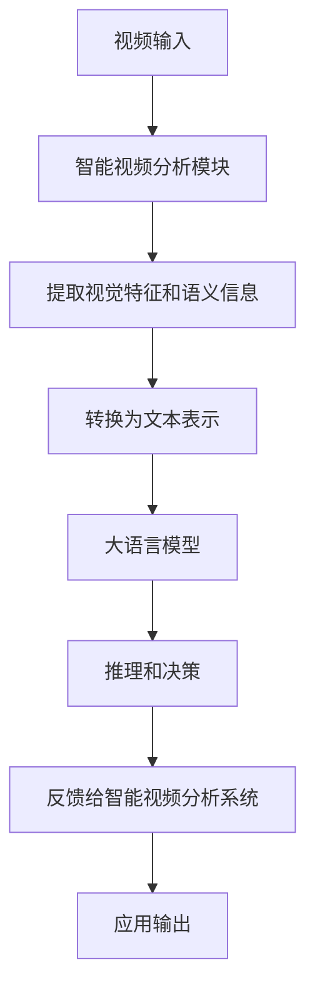

# 大语言模型在智能视频分析中的推理应用研究

> 关键词：大语言模型、智能视频分析、推理应用、视频理解、自然语言处理

> 摘要：本文围绕大语言模型在智能视频分析中的推理应用展开深入研究。首先介绍了研究的背景、目的和范围等内容，阐述了相关核心概念及其联系。接着详细讲解了核心算法原理、数学模型与公式，并通过Python代码进行说明。然后给出项目实战案例，包括开发环境搭建、源代码实现与解读。探讨了大语言模型在智能视频分析中的实际应用场景，推荐了相关的学习资源、开发工具框架以及论文著作。最后总结了未来发展趋势与挑战，提供了常见问题解答和扩展阅读参考资料，旨在全面深入地探讨大语言模型在智能视频分析推理应用方面的技术要点和发展前景。

## 1. 背景介绍 
### 1.1 目的和范围
随着信息技术的飞速发展，视频数据呈现出爆炸式增长。智能视频分析作为处理海量视频数据的关键技术，在安防监控、智能交通、娱乐等众多领域具有广泛的应用需求。大语言模型凭借其强大的语言理解和生成能力，为智能视频分析带来了新的发展机遇。本研究的目的在于深入探索大语言模型在智能视频分析推理应用中的技术原理、实现方法和应用效果，以提升视频分析的智能化水平和准确性。

研究范围涵盖大语言模型的基本原理、与智能视频分析的结合方式、相关算法和数学模型，以及在不同实际场景中的应用案例等方面。通过对这些内容的研究，旨在为大语言模型在智能视频分析领域的进一步发展和应用提供理论支持和实践指导。

### 1.2 预期读者
本文预期读者包括从事人工智能、计算机视觉、自然语言处理等相关领域的研究人员和开发者，希望深入了解大语言模型和智能视频分析技术的学生和爱好者，以及对智能视频应用有需求的行业从业者，如安防、交通、媒体等领域的专业人士。

### 1.3 文档结构概述
本文将按照以下结构进行阐述：首先介绍研究的背景信息，包括目的、预期读者和文档结构概述等。接着讲解大语言模型和智能视频分析的核心概念及其联系，通过文本示意图和Mermaid流程图进行展示。然后详细阐述核心算法原理和具体操作步骤，结合Python代码进行说明。随后介绍相关的数学模型和公式，并举例说明。通过项目实战案例，展示代码实现和详细解读。探讨大语言模型在智能视频分析中的实际应用场景。推荐相关的学习资源、开发工具框架和论文著作。最后总结未来发展趋势与挑战，提供常见问题解答和扩展阅读参考资料。

### 1.4 术语表
#### 1.4.1 核心术语定义
- **大语言模型（Large Language Model）**：是一种基于深度学习的语言模型，通常具有大量的参数和强大的语言理解与生成能力，能够处理自然语言任务，如文本生成、问答系统等。
- **智能视频分析（Intelligent Video Analysis）**：利用计算机视觉和人工智能技术对视频内容进行分析、理解和处理，以提取有价值的信息，如目标检测、行为识别等。
- **推理（Inference）**：在大语言模型和智能视频分析中，推理是指利用训练好的模型对新的输入数据（如图像、视频、文本等）进行处理，得出相应的输出结果的过程。

#### 1.4.2 相关概念解释
- **计算机视觉（Computer Vision）**：是一门研究如何使计算机“看”的科学，通过对图像或视频的处理和分析，实现目标检测、识别、跟踪等任务。
- **自然语言处理（Natural Language Processing）**：是计算机科学与语言学的交叉领域，旨在让计算机能够理解、处理和生成自然语言。

#### 1.4.3 缩略词列表
- **NLP**：Natural Language Processing（自然语言处理）
- **CV**：Computer Vision（计算机视觉）
- **LLM**：Large Language Model（大语言模型）

## 2. 核心概念与联系 

### 核心概念原理
#### 大语言模型原理
大语言模型通常基于Transformer架构，Transformer架构由编码器和解码器组成，其核心是自注意力机制（Self-Attention Mechanism）。自注意力机制允许模型在处理序列数据时，动态地关注序列中不同位置的信息，从而捕捉长距离依赖关系。

以GPT（Generative Pretrained Transformer）系列为例，GPT是一种基于Transformer解码器的大语言模型。它通过在大规模文本数据上进行无监督预训练，学习到语言的统计规律和语义信息。在预训练过程中，模型的目标是根据输入的文本预测下一个单词，通过不断调整模型参数，使得预测结果与真实结果之间的损失最小化。

#### 智能视频分析原理
智能视频分析主要基于计算机视觉技术，包括图像预处理、特征提取、目标检测、行为识别等步骤。图像预处理用于对视频帧进行去噪、增强等操作，以提高图像质量。特征提取则从预处理后的图像中提取有代表性的特征，如颜色特征、纹理特征、形状特征等。目标检测是指在图像或视频中检测出感兴趣的目标，如人、车辆、物体等。行为识别则是对目标的行为进行分析和分类，如行走、跑步、停车等。

### 架构的文本示意图
大语言模型与智能视频分析的结合架构可以描述为：首先，智能视频分析模块对输入的视频进行处理，提取视频中的视觉特征和语义信息。然后，将这些信息转换为文本表示形式，作为大语言模型的输入。大语言模型对输入的文本进行处理，利用其强大的语言理解和生成能力，进行推理和决策。最后，将大语言模型的输出结果反馈给智能视频分析系统，用于进一步的处理和应用。

### Mermaid流程图


## 3. 核心算法原理 & 具体操作步骤 

### 核心算法原理
#### 基于Transformer的大语言模型推理算法
在大语言模型中，Transformer的自注意力机制是核心算法之一。自注意力机制的计算过程如下：

对于输入的序列 $X = [x_1, x_2, \cdots, x_n]$，首先通过线性变换将其转换为查询（Query）、键（Key）和值（Value）三个矩阵 $Q$、$K$ 和 $V$：

$Q = XW_Q$

$K = XW_K$

$V = XW_V$

其中，$W_Q$、$W_K$ 和 $V$ 是可学习的权重矩阵。

然后，计算注意力分数：

$Attention(Q, K, V) = softmax(\frac{QK^T}{\sqrt{d_k}})V$

其中，$d_k$ 是查询和键向量的维度。

#### 智能视频分析中的目标检测算法
以YOLO（You Only Look Once）算法为例，YOLO是一种基于深度学习的实时目标检测算法。它将输入的图像划分为多个网格，每个网格负责预测目标的边界框和类别。YOLO的主要步骤包括：

1. 图像预处理：将输入的图像调整为固定大小。
2. 特征提取：使用卷积神经网络（CNN）提取图像的特征。
3. 目标预测：在特征图上进行目标检测，预测目标的边界框和类别。
4. 后处理：对预测结果进行非极大值抑制（NMS），去除重叠的边界框。

### 具体操作步骤
#### 大语言模型推理步骤
1. 加载预训练的大语言模型。
2. 对输入的文本进行预处理，如分词、编码等。
3. 将预处理后的文本输入到模型中进行推理。
4. 对模型的输出进行解码，得到最终的结果。

#### 智能视频分析推理步骤
1. 读取视频文件，提取视频帧。
2. 对视频帧进行预处理，如去噪、增强等。
3. 使用目标检测算法检测视频帧中的目标。
4. 提取目标的特征和语义信息。
5. 将提取的信息转换为文本表示。
6. 将文本输入到关联的大语言模型中进行推理。
7. 根据大语言模型的输出结果，对视频进行进一步的分析和处理。

### Python源代码实现
```python
# 大语言模型推理示例（使用Hugging Face的transformers库）
from transformers import AutoTokenizer, AutoModelForCausalLM

# 加载预训练模型和分词器
model_name = "gpt2"
tokenizer = AutoTokenizer.from_pretrained(model_name)
model = AutoModelForCausalLM.from_pretrained(model_name)

# 输入文本
input_text = "今天天气怎么样？"

# 对输入文本进行编码
input_ids = tokenizer.encode(input_text, return_tensors="pt")

# 进行推理
output = model.generate(input_ids)

# 对输出进行解码
output_text = tokenizer.decode(output[0], skip_special_tokens=True)

print("输入文本：", input_text)
print("输出文本：", output_text)

# 智能视频分析目标检测示例（使用YOLOv5）
import cv2
import torch

# 加载预训练的YOLOv5模型
model = torch.hub.load('ultralytics/yolov5', 'yolov5s', pretrained=True)

# 读取视频文件
cap = cv2.VideoCapture('test_video.mp4')

while cap.isOpened():
    ret, frame = cap.read()
    if not ret:
        break
    
    # 进行目标检测
    results = model(frame)
    
    # 显示检测结果
    results.render()
    cv2.imshow('YOLOv5 Object Detection', frame)
    
    if cv2.waitKey(1) & 0xFF == ord('q'):
        break

cap.release()
cv2.destroyAllWindows()
```

## 4. 数学模型和公式 & 详细讲解 & 举例说明 

### 大语言模型的数学模型和公式
#### 损失函数
在大语言模型的训练过程中，常用的损失函数是交叉熵损失（Cross-Entropy Loss）。对于一个给定的输入序列 $x$ 和对应的目标序列 $y$，交叉熵损失的计算公式为：

$$L = -\frac{1}{N}\sum_{i=1}^{N}\sum_{j=1}^{V}y_{ij}\log(p_{ij})$$

其中，$N$ 是序列的长度，$V$ 是词汇表的大小，$y_{ij}$ 是目标序列中第 $i$ 个位置的第 $j$ 个单词的真实概率（通常为one-hot编码），$p_{ij}$ 是模型预测的第 $i$ 个位置的第 $j$ 个单词的概率。

#### 梯度下降优化算法
为了最小化损失函数，通常使用梯度下降优化算法，如随机梯度下降（SGD）、Adagrad、Adam等。以Adam算法为例，其更新公式为：

$m_{t} = \beta_1m_{t-1} + (1 - \beta_1)g_{t}$

$v_{t} = \beta_2v_{t-1} + (1 - \beta_2)g_{t}^2$

$\hat{m}_{t} = \frac{m_{t}}{1 - \beta_1^t}$

$\hat{v}_{t} = \frac{v_{t}}{1 - \beta_2^t}$

$\theta_{t+1} = \theta_{t} - \frac{\alpha}{\sqrt{\hat{v}_{t}} + \epsilon}\hat{m}_{t}$

其中，$m_{t}$ 和 $v_{t}$ 分别是梯度的一阶矩估计和二阶矩估计，$\beta_1$ 和 $\beta_2$ 是衰减率，$g_{t}$ 是 $t$ 时刻的梯度，$\alpha$ 是学习率，$\epsilon$ 是一个小的常数，$\theta_{t}$ 是 $t$ 时刻的模型参数。

### 智能视频分析的数学模型和公式
#### 目标检测的损失函数
在目标检测中，常用的损失函数包括分类损失和定位损失。以Focal Loss为例，其计算公式为：

$$FL(p_t) = -(1 - p_t)^{\gamma}\log(p_t)$$

其中，$p_t$ 是模型预测的概率，$\gamma$ 是调节因子。

#### 边界框回归损失
常用的边界框回归损失是Smooth L1 Loss，其计算公式为：

$$SmoothL1(x) = \begin{cases}
0.5x^2, & \text{if } |x| < 1 \\
|x| - 0.5, & \text{otherwise}
\end{cases}$$

其中，$x$ 是预测的边界框与真实边界框之间的误差。

### 举例说明
#### 大语言模型损失计算示例
假设词汇表大小为 10，输入序列长度为 3，目标序列的one-hot编码为 $y = [[0, 0, 1, 0, 0, 0, 0, 0, 0, 0], [0, 1, 0, 0, 0, 0, 0, 0, 0, 0], [0, 0, 0, 0, 0, 0, 0, 0, 1, 0]]$，模型预测的概率分布为 $p = [[0.1, 0.1, 0.6, 0.1, 0.1, 0, 0, 0, 0, 0], [0.2, 0.7, 0.1, 0, 0, 0, 0, 0, 0, 0], [0.1, 0, 0, 0, 0, 0, 0, 0, 0.8, 0.1]]$。

则交叉熵损失为：

$L = -\frac{1}{3}[(0\times\log(0.1) + 0\times\log(0.1) + 1\times\log(0.6) + \cdots) + (0\times\log(0.2) + 1\times\log(0.7) + \cdots) + (0\times\log(0.1) + 0\times\log(0) + \cdots)]$

#### 目标检测损失计算示例
假设预测的边界框与真实边界框之间的误差为 $x = 0.5$，则Smooth L1 Loss为：

$SmoothL1(0.5) = 0.5\times0.5^2 = 0.125$

## 5. 项目实战：代码实际案例和详细解释说明 

### 5.1  开发环境搭建
#### 硬件环境
- 计算机：建议使用具有NVIDIA GPU的计算机，以加速深度学习模型的训练和推理过程。
- 显卡：NVIDIA GeForce RTX 2080 Ti或更高版本。
- 内存：至少16GB。

#### 软件环境
- 操作系统：Ubuntu 18.04或更高版本。
- 深度学习框架：PyTorch 1.9.0或更高版本。
- 开发工具：Anaconda、VS Code等。

#### 安装依赖库
```bash
# 创建虚拟环境
conda create -n video_analysis python=3.8
conda activate video_analysis

# 安装PyTorch
pip install torch torchvision torchaudio --extra-index-url https://download.pytorch.org/whl/cu113

# 安装其他依赖库
pip install transformers opencv-python-headless ultralytics
```

### 5.2  源代码详细实现和代码解读
```python
import cv2
import torch
from transformers import AutoTokenizer, AutoModelForCausalLM

# 加载大语言模型和分词器
model_name = "gpt2"
tokenizer = AutoTokenizer.from_pretrained(model_name)
model = AutoModelForCausalLM.from_pretrained(model_name)

# 加载YOLOv5目标检测模型
yolo_model = torch.hub.load('ultralytics/yolov5', 'yolov5s', pretrained=True)

# 读取视频文件
cap = cv2.VideoCapture('test_video.mp4')

while cap.isOpened():
    ret, frame = cap.read()
    if not ret:
        break
    
    # 进行目标检测
    results = yolo_model(frame)
    
    # 提取检测到的目标信息
    detected_objects = results.pandas().xyxy[0]['name'].tolist()
    
    # 将目标信息转换为文本
    object_text = "检测到的目标有：" + ", ".join(detected_objects)
    
    # 输入大语言模型进行推理
    input_ids = tokenizer.encode(object_text, return_tensors="pt")
    output = model.generate(input_ids)
    output_text = tokenizer.decode(output[0], skip_special_tokens=True)
    
    # 显示检测结果和大语言模型输出
    results.render()
    cv2.putText(frame, output_text, (10, 30), cv2.FONT_HERSHEY_SIMPLEX, 1, (0, 255, 0), 2)
    cv2.imshow('Video Analysis', frame)
    
    if cv2.waitKey(1) & 0xFF == ord('q'):
        break

cap.release()
cv2.destroyAllWindows()
```

### 5.3  代码解读与分析
1. **加载模型**：首先加载大语言模型（GPT-2）和YOLO