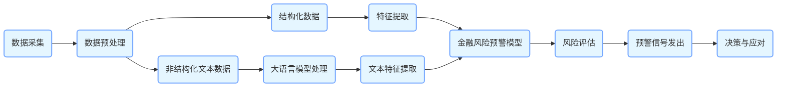

# 大语言模型在金融风险预警中的推理应用探索

> 关键词：大语言模型、金融风险预警、推理应用、自然语言处理、数据分析

> 摘要：本文旨在深入探索大语言模型在金融风险预警中的推理应用。首先介绍了研究的背景、目的、预期读者、文档结构和相关术语。接着阐述了大语言模型、金融风险预警等核心概念及其联系，并给出了相应的文本示意图和 Mermaid 流程图。详细讲解了核心算法原理，通过 Python 源代码进行了说明，同时介绍了相关的数学模型和公式。通过项目实战，展示了代码的实际案例并进行详细解释。分析了大语言模型在金融风险预警中的实际应用场景，推荐了学习资源、开发工具框架和相关论文著作。最后总结了未来发展趋势与挑战，提供了常见问题解答和扩展阅读参考资料。

## 1. 背景介绍 
### 1.1 目的和范围
金融风险预警对于金融机构和监管部门至关重要，它能够帮助提前发现潜在的风险，采取相应的措施进行防范和应对。传统的金融风险预警方法往往依赖于结构化数据和固定的模型，难以处理大量的非结构化文本信息。随着大语言模型的发展，其强大的自然语言处理能力为金融风险预警带来了新的机遇。本文的目的是探索大语言模型在金融风险预警中的推理应用，研究如何利用大语言模型处理金融领域的文本数据，进行风险分析和预警。范围涵盖了大语言模型的原理、金融风险预警的相关概念、核心算法、数学模型、实际应用案例以及未来发展趋势等方面。

### 1.2 预期读者
本文预期读者包括金融行业的从业者，如风险管理人员、分析师、监管人员等，他们可以通过本文了解大语言模型在金融风险预警中的应用，为实际工作提供参考。同时，计算机科学领域的研究人员和开发者也可以从本文中获取关于大语言模型在金融领域应用的相关知识，开展进一步的研究和开发工作。此外，对金融科技感兴趣的学生和爱好者也可以通过本文了解大语言模型在金融风险预警中的创新应用。

### 1.3 文档结构概述
本文共分为十个部分。第一部分是背景介绍，包括目的和范围、预期读者、文档结构概述和术语表。第二部分阐述核心概念与联系，介绍大语言模型、金融风险预警等核心概念，并给出它们之间的关系示意图和流程图。第三部分讲解核心算法原理和具体操作步骤，通过 Python 代码详细说明。第四部分介绍数学模型和公式，并进行详细讲解和举例说明。第五部分是项目实战，包括开发环境搭建、源代码详细实现和代码解读。第六部分分析实际应用场景。第七部分推荐学习资源、开发工具框架和相关论文著作。第八部分总结未来发展趋势与挑战。第九部分是附录，提供常见问题与解答。第十部分给出扩展阅读和参考资料。

### 1.4 术语表
#### 1.4.1 核心术语定义
- **大语言模型**：是一种基于深度学习的自然语言处理模型，通过在大规模文本数据上进行训练，学习语言的模式和规律，能够生成自然流畅的文本、回答问题、进行推理等。
- **金融风险预警**：是指运用各种方法和技术，对金融领域中潜在的风险进行监测、识别、评估和预测，及时发出预警信号，以便采取相应的措施进行防范和控制。
- **推理应用**：是指利用模型的知识和能力，对输入的信息进行分析和推断，得出结论或预测结果的过程。

#### 1.4.2 相关概念解释
- **自然语言处理**：是计算机科学与语言学的交叉领域，研究如何让计算机理解、处理和生成自然语言。大语言模型是自然语言处理领域的重要成果。
- **结构化数据**：是指具有固定格式和结构的数据，如数据库中的表格数据。传统的金融风险预警方法主要处理结构化数据。
- **非结构化文本信息**：是指没有固定格式和结构的文本数据，如新闻报道、社交媒体评论、公司公告等。大语言模型能够有效地处理非结构化文本信息。

#### 1.4.3 缩略词列表
- **NLP**：Natural Language Processing，自然语言处理
- **LLM**：Large Language Model，大语言模型

## 2. 核心概念与联系 

### 核心概念原理
#### 大语言模型原理
大语言模型通常基于Transformer架构，它由编码器和解码器组成。编码器负责对输入的文本进行特征提取和表示，解码器则根据编码器的输出生成相应的文本。大语言模型通过在大规模文本数据上进行无监督学习，学习语言的统计规律和语义信息。在训练过程中，模型的目标是预测下一个单词或字符的概率。通过不断调整模型的参数，使得预测结果与实际结果尽可能接近。训练完成后，大语言模型可以用于各种自然语言处理任务，如文本生成、问答系统、文本分类等。

#### 金融风险预警原理
金融风险预警的原理是通过对金融市场和金融机构的各种数据进行监测和分析，识别潜在的风险因素，并根据一定的预警指标和模型，判断风险的程度和可能性。常见的金融风险包括信用风险、市场风险、流动性风险等。金融风险预警系统通常由数据采集、数据处理、风险评估和预警信号发出等模块组成。数据采集模块负责收集各种金融数据，包括结构化数据和非结构化数据；数据处理模块对采集到的数据进行清洗、转换和特征提取；风险评估模块根据提取的特征和预警模型，评估风险的程度；预警信号发出模块根据评估结果，及时发出相应的预警信号。

### 架构的文本示意图
大语言模型在金融风险预警中的应用架构可以分为数据层、模型层和应用层。数据层负责收集和存储金融领域的各种数据，包括结构化数据和非结构化文本数据。结构化数据可以来自金融机构的数据库，如交易记录、财务报表等；非结构化文本数据可以来自新闻媒体、社交媒体、公司公告等。模型层包括大语言模型和金融风险预警模型。大语言模型用于处理非结构化文本数据，提取文本中的关键信息和语义特征；金融风险预警模型根据大语言模型提取的特征和结构化数据，进行风险评估和预测。应用层负责将模型的输出结果应用到实际的金融风险预警中，如生成预警报告、发出预警信号等。

### Mermaid 流程图


该流程图展示了大语言模型在金融风险预警中的应用流程。首先进行数据采集，然后对采集到的数据进行预处理，分为结构化数据和非结构化文本数据。结构化数据进行特征提取，非结构化文本数据通过大语言模型处理提取文本特征。将提取的特征输入到金融风险预警模型中进行风险评估，根据评估结果发出预警信号，最后进行决策与应对。

## 3. 核心算法原理 & 具体操作步骤 

### 核心算法原理
在大语言模型在金融风险预警中的应用中，核心算法主要包括大语言模型的文本处理算法和金融风险预警模型的构建算法。

#### 大语言模型的文本处理算法
大语言模型通常采用基于注意力机制的Transformer架构。注意力机制可以让模型在处理输入序列时，自动关注序列中的重要部分。具体来说，注意力机制通过计算输入序列中每个位置与其他位置之间的相关性，为每个位置分配一个权重，然后根据这些权重对输入序列进行加权求和，得到每个位置的表示。在Transformer架构中，多头注意力机制可以并行地计算多个不同的注意力表示，从而提高模型的表达能力。

以下是一个简化的多头注意力机制的Python代码示例：
```python
import torch
import torch.nn as nn

class MultiHeadAttention(nn.Module):
    def __init__(self, d_model, num_heads):
        super(MultiHeadAttention, self).__init__()
        self.d_model = d_model
        self.num_heads = num_heads
        self.d_k = d_model // num_heads

        self.W_q = nn.Linear(d_model, d_model)
        self.W_k = nn.Linear(d_model, d_model)
        self.W_v = nn.Linear(d_model, d_model)
        self.W_o = nn.Linear(d_model, d_model)

    def forward(self, Q, K, V, mask=None):
        batch_size = Q.size(0)

        # 线性变换
        Q = self.W_q(Q).view(batch_size, -1, self.num_heads, self.d_k).transpose(1, 2)
        K = self.W_k(K).view(batch_size, -1, self.num_heads, self.d_k).transpose(1, 2)
        V = self.W_v(V).view(batch_size, -1, self.num_heads, self.d_k).transpose(1, 2)

        # 计算注意力分数
        scores = torch.matmul(Q, K.transpose(-2, -1)) / torch.sqrt(torch.tensor(self.d_k, dtype=torch.float32))

        if mask is not None:
            scores = scores.masked_fill(mask == 0, -1e9)

        # 计算注意力权重
        attn_weights = torch.softmax(scores, dim=-1)

        # 加权求和
        output = torch.matmul(attn_weights, V)
        output = output.transpose(1, 2).contiguous().view(batch_size, -1, self.d_model)

        # 线性变换
        output = self.W_o(output)

        return output
```

#### 金融风险预警模型的构建算法
金融风险预警模型可以采用机器学习或深度学习算法进行构建。常见的机器学习算法包括逻辑回归、决策树、随机森林等；深度学习算法包括神经网络、循环神经网络等。以逻辑回归为例，逻辑回归是一种二分类算法，它通过对输入特征进行线性组合，然后通过逻辑函数将线性组合的结果映射到[0, 1]区间，得到样本属于正类的概率。

以下是一个简单的逻辑回归模型的Python代码示例：
```python
import torch
import torch.nn as nn

class LogisticRegression(nn.Module):
    def __init__(self, input_size):
        super(LogisticRegression, self).__init__()
        self.linear = nn.Linear(input_size, 1)
        self.sigmoid = nn.Sigmoid()

    def forward(self, x):
        out = self.linear(x)
        out = self.sigmoid(out)
        return out
```

### 具体操作步骤
#### 数据预处理
1. **数据清洗**：去除数据中的噪声、缺失值和重复值。对于结构化数据，可以采用均值、中位数等方法填充缺失值；对于非结构化文本数据，可以去除特殊字符、停用词等。
2. **数据转换**：将非结构化文本数据转换为数值特征。可以采用词袋模型、TF-IDF、词嵌入等方法将文本转换为向量表示。
3. **数据划分**：将预处理后的数据划分为训练集、验证集和测试集。训练集用于模型的训练，验证集用于模型的调优，测试集用于模型的评估。

#### 模型训练
1. **大语言模型训练**：可以使用预训练的大语言模型，如GPT、BERT等，也可以在金融领域的文本数据上进行微调。在微调过程中，需要定义合适的损失函数和优化器，通过不断调整模型的参数，使得模型在金融领域的文本数据上表现更好。
2. **金融风险预警模型训练**：将大语言模型提取的文本特征和结构化数据的特征进行合并，作为金融风险预警模型的输入。使用训练集对金融风险预警模型进行训练，同样需要定义合适的损失函数和优化器，通过不断调整模型的参数，使得模型能够准确地预测金融风险。

#### 模型评估
使用测试集对训练好的金融风险预警模型进行评估。常见的评估指标包括准确率、召回率、F1值、ROC曲线等。根据评估结果，对模型进行进一步的调优和改进。

#### 模型应用
将训练好的金融风险预警模型应用到实际的金融风险预警中。实时监测金融市场和金融机构的各种数据，将数据输入到模型中进行预测，根据预测结果及时发出预警信号。

## 4. 数学模型和公式 & 详细讲解 & 举例说明 

### 大语言模型的数学模型和公式
#### 注意力机制公式
在多头注意力机制中，假设输入的查询矩阵 $Q \in \mathbb{R}^{n \times d_{model}}$，键矩阵 $K \in \mathbb{R}^{m \times d_{model}}$，值矩阵 $V \in \mathbb{R}^{m \times d_{model}}$，其中 $n$ 是查询序列的长度，$m$ 是键和值序列的长度，$d_{model}$ 是模型的维度。

首先，通过线性变换得到查询、键和值的投影：
$$Q' = W_q Q, \quad K' = W_k K, \quad V' = W_v V$$
其中 $W_q \in \mathbb{R}^{d_{model} \times d_{model}}$，$W_k \in \mathbb{R}^{d_{model} \times d_{model}}$，$W_v \in \mathbb{R}^{d_{model} \times d_{model}}$ 是可学习的权重矩阵。

然后，计算注意力分数：
$$scores = \frac{Q' K'^T}{\sqrt{d_k}}$$
其中 $d_k$ 是每个头的维度。

接着，通过 softmax 函数计算注意力权重：
$$attn\_weights = softmax(scores)$$

最后，加权求和得到输出：
$$output = attn\_weights V'$$

#### 举例说明
假设输入的查询矩阵 $Q$ 是一个 $2 \times 4$ 的矩阵，键矩阵 $K$ 和值矩阵 $V$ 是 $3 \times 4$ 的矩阵，$d_{model} = 4$，$d_k = 2$，$num\_heads = 2$。

```python
import torch

Q = torch.randn(2, 4)
K = torch.randn(3, 4)
V = torch.randn(3, 4)

W_q = torch.randn(4, 4)
W_k = torch.randn(4, 4)
W_v = torch.randn(4, 4)

# 线性变换
Q_prime = torch.matmul(Q, W_q)
K_prime = torch.matmul(K, W_k)
V_prime = torch.matmul(V, W_v)

# 分割成多头
Q_prime = Q_prime.view(2, 2, 2).transpose(0, 1)
K_prime = K_prime.view(3, 2, 2).transpose(0, 1)
V_prime = V_prime.view(3, 2, 2).transpose(0, 1)

# 计算注意力分数
scores = []
for i in range(2):
    score = torch.matmul(Q_prime[i], K_prime[i].transpose(-2, -1)) / torch.sqrt(torch.tensor(2, dtype=torch.float32))
    scores.append(score)
scores = torch.stack(scores, dim=0)

# 计算注意力权重
attn_weights = torch.softmax(scores, dim=-1)

# 加权求和
output = []
for i in range(2):
    out = torch.matmul(attn_weights[i], V_prime[i])
    output.append(out)
output = torch.stack(output, dim=0).transpose(0, 1).contiguous().view(2, 4)

print(output)
```

### 金融风险预警模型的数学模型和公式
#### 逻辑回归公式
逻辑回归模型的输入是特征向量 $x \in \mathbb{R}^n$，输出是样本属于正类的概率 $p(y = 1|x)$。逻辑回归模型通过线性组合和逻辑函数来计算概率：
$$p(y = 1|x) = \sigma(w^T x + b)$$
其中 $w \in \mathbb{R}^n$ 是权重向量，$b \in \mathbb{R}$ 是偏置项，$\sigma(z) = \frac{1}{1 + e^{-z}}$ 是逻辑函数。

#### 损失函数
逻辑回归模型通常使用对数损失函数（也称为交叉熵损失函数）来衡量模型的预测结果与实际结果之间的差异：
$$L(w, b) = -\frac{1}{m} \sum_{i=1}^{m} [y^{(i)} \log(p(y^{(i)} = 1|x^{(i)})) + (1 - y^{(i)}) \log(1 - p(y^{(i)} = 1|x^{(i)}))]$$
其中 $m$ 是样本数量，$y^{(i)}$ 是第 $i$ 个样本的真实标签。

#### 举例说明
假设我们有一个简单的二分类问题，输入特征 $x$ 是一个一维向量，样本数量 $m = 3$，真实标签 $y = [1, 0, 1]$。

```python
import torch
import torch.nn as nn
import torch.optim as optim

# 输入特征
x = torch.tensor([[1.0], [2.0], [3.0]], dtype=torch.float32)
# 真实标签
y = torch.tensor([[1.0], [0.0], [1.0]], dtype=torch.float32)

# 定义逻辑回归模型
model = nn.Linear(1, 1)
sigmoid = nn.Sigmoid()

# 定义损失函数和优化器
criterion = nn.BCELoss()
optimizer = optim.SGD(model.parameters(), lr=0.01)

# 训练模型
for epoch in range(100):
    # 前向传播
    outputs = sigmoid(model(x))
    loss = criterion(outputs, y)

    # 反向传播和优化
    optimizer.zero_grad()
    loss.backward()
    optimizer.step()

    if (epoch + 1) % 10 == 0:
        print(f'Epoch [{epoch + 1}/100], Loss: {loss.item():.4f}')

# 预测
with torch.no_grad():
    predictions = sigmoid(model(x))
    print('Predictions:', predictions)
```

## 5. 项目实战：代码实际案例和详细解释说明 

### 5.1  开发环境搭建
#### 操作系统
建议使用 Linux 或 macOS 操作系统，因为它们对深度学习开发有较好的支持。如果使用 Windows 操作系统，需要安装 Windows Subsystem for Linux (WSL) 来运行 Linux 环境。

#### Python 环境
安装 Python 3.7 或以上版本。可以使用 Anaconda 来管理 Python 环境，创建一个新的虚拟环境：
```bash
conda create -n finance_risk python=3.8
conda activate finance_risk
```

#### 深度学习框架
安装 PyTorch 和 Transformers 库。PyTorch 是一个流行的深度学习框架，Transformers 库提供了预训练的大语言模型。
```bash
pip install torch torchvision torchaudio
pip install transformers
```

#### 其他依赖库
安装其他必要的依赖库，如 pandas、numpy、scikit-learn 等。
```bash
pip install pandas numpy scikit-learn
```

### 5.2  源代码详细实现和代码解读
以下是一个使用大语言模型进行金融风险预警的简单代码示例：

```python
import torch
from transformers import AutoTokenizer, AutoModel
import pandas as pd
from sklearn.model_selection import train_test_split
from sklearn.linear_model import LogisticRegression
from sklearn.metrics import accuracy_score

# 加载预训练的大语言模型和分词器
tokenizer = AutoTokenizer.from_pretrained('bert-base-uncased')
model = AutoModel.from_pretrained('bert-base-uncased')

# 加载金融文本数据和标签
data = pd.read_csv('financial_data.csv')
texts = data['text'].tolist()
labels = data['label'].tolist()

# 对文本进行分词和编码
input_ids = []
attention_masks = []

for text in texts:
    encoded_dict = tokenizer.encode_plus(
                        text,                      # 输入文本
                        add_special_tokens = True, # 添加特殊标记
                        max_length = 128,          # 最大序列长度
                        pad_to_max_length = True,  # 填充到最大长度
                        return_attention_mask = True,   # 返回注意力掩码
                        return_tensors = 'pt',     # 返回 PyTorch 张量
                   )
    
    input_ids.append(encoded_dict['input_ids'])
    attention_masks.append(encoded_dict['attention_mask'])

# 将列表转换为张量
input_ids = torch.cat(input_ids, dim=0)
attention_masks = torch.cat(attention_masks, dim=0)
labels = torch.tensor(labels)

# 划分训练集和测试集
train_inputs, test_inputs, train_labels, test_labels = train_test_split(input_ids, labels, random_state=42, test_size=0.2)
train_masks, test_masks, _, _ = train_test_split(attention_masks, labels, random_state=42, test_size=0.2)

# 使用大语言模型提取文本特征
with torch.no_grad():
    train_outputs = model(train_inputs, attention_mask=train_masks)
    test_outputs = model(test_inputs, attention_mask=test_masks)

# 取 [CLS] 标记的输出作为文本特征
train_features = train_outputs[0][:, 0, :].numpy()
test_features = test_outputs[0][:, 0, :].numpy()

# 训练逻辑回归模型
lr_model = LogisticRegression()
lr_model.fit(train_features, train_labels)

# 预测
predictions = lr_model.predict(test_features)

# 评估模型
accuracy = accuracy_score(test_labels, predictions)
print(f'Accuracy: {accuracy}')
```

### 代码解读与分析
1. **加载预训练的大语言模型和分词器**：使用 `transformers` 库加载预训练的 BERT 模型和分词器。
2. **加载金融文本数据和标签**：从 CSV 文件中加载金融文本数据和对应的标签。
3. **对文本进行分词和编码**：使用分词器对文本进行分词，并将分词结果编码为输入 ID 和注意力掩码。
4. **划分训练集和测试集**：使用 `train_test_split` 函数将数据划分为训练集和测试集。
5. **使用大语言模型提取文本特征**：将训练集和测试集的输入 ID 和注意力掩码输入到 BERT 模型中，提取文本特征。取 [CLS] 标记的输出作为文本特征。
6. **训练逻辑回归模型**：使用提取的文本特征和训练集的标签训练逻辑回归模型。
7. **预测和评估**：使用训练好的逻辑回归模型对测试集进行预测，并计算准确率。

通过这个代码示例，我们可以看到如何使用大语言模型提取金融文本的特征，并结合逻辑回归模型进行金融风险预警。

## 6. 实际应用场景 
### 信用风险预警
大语言模型可以处理大量的非结构化文本信息，如企业的新闻报道、社交媒体评论、行业研究报告等。通过分析这些文本信息，大语言模型可以识别企业的潜在风险因素，如经营不善、财务困境、法律纠纷等。将这些文本特征与企业的财务数据、信用记录等结构化数据相结合，可以构建更准确的信用风险预警模型，提前发现企业的信用风险，为金融机构的信贷决策提供参考。

### 市场风险预警
金融市场的动态变化受到多种因素的影响，如宏观经济数据、政策法规、行业趋势等。大语言模型可以实时监测新闻媒体、社交媒体等渠道的信息，提取与金融市场相关的关键词和情感倾向。通过分析这些信息，大语言模型可以预测市场的走势和风险，为投资者提供市场风险预警。例如，当大语言模型检测到市场上出现大量负面消息时，可能预示着市场即将下跌，投资者可以及时调整投资策略。

### 流动性风险预警
金融机构的流动性风险是指无法及时满足客户的资金需求或偿还债务的风险。大语言模型可以分析金融机构的财务报表、资金流动情况、市场交易数据等结构化数据，同时结合新闻报道、分析师评论等非结构化文本信息，评估金融机构的流动性状况。当大语言模型发现金融机构的流动性指标出现异常或市场上出现可能影响金融机构流动性的负面消息时，及时发出流动性风险预警，帮助金融机构采取相应的措施进行防范和应对。

### 操作风险预警
操作风险是指由于内部流程、人员和系统的不完善或失误，以及外部事件导致的损失风险。大语言模型可以处理金融机构的内部文档、员工报告、监管文件等非结构化文本信息，识别操作风险的潜在因素，如内部控制缺陷、违规操作、系统故障等。通过建立操作风险预警模型，大语言模型可以及时发现操作风险的迹象，为金融机构的风险管理部门提供预警信息，以便采取措施进行改进和防范。

## 7. 工具和资源推荐
### 7.1 学习资源推荐
#### 7.1.1 书籍推荐
- 《深度学习》（Deep Learning）：由 Ian Goodfellow、Yoshua Bengio 和 Aaron Courville 合著，是深度学习领域的经典教材，介绍了深度学习的基本概念、算法和应用。
- 《自然语言处理入门》：何晗著，本书从基础知识入手，逐步介绍自然语言处理的各种技术和方法，适合初学者阅读。
- 《金融风险管理》：由 John C. Hull 著，全面介绍了金融风险管理的理论和实践，包括信用风险、市场风险、流动性风险等方面的内容。

#### 7.1.2 在线课程
- Coursera 上的“Deep Learning Specialization”：由 Andrew Ng 教授授课，是深度学习领域的经典在线课程，涵盖了深度学习的各个方面。
- edX 上的“Natural Language Processing with Deep Learning”：介绍了使用深度学习方法进行自然语言处理的技术和应用。
- 中国大学 MOOC 上的“金融风险管理”：由国内高校教授授课，系统介绍了金融风险管理的理论和实践。

#### 7.1.3 技术博客和网站
- Medium：是一个技术博客平台，上面有很多关于大语言模型、自然语言处理和金融科技的文章。
- arXiv：是一个预印本服务器，上面可以找到最新的学术研究论文，包括大语言模型和金融风险预警领域的研究成果。
- 机器之心：是一个专注于人工智能领域的媒体平台，提供了丰富的技术文章和行业资讯。

### 7.2 开发工具框架推荐
#### 7.2.1 IDE和编辑器
- PyCharm：是一个专业的 Python 集成开发环境，提供了丰富的代码编辑、调试和项目管理功能。
- Jupyter Notebook：是一个交互式的开发环境，适合进行数据分析和模型实验。
- Visual Studio Code：是一个轻量级的代码编辑器，支持多种编程语言和插件，可用于 Python 开发。

#### 7.2.2 调试和性能分析工具
- PyTorch Profiler：是 PyTorch 自带的性能分析工具，可以帮助开发者分析模型的性能瓶颈，优化代码。
- TensorBoard：是 TensorFlow 提供的可视化工具，也可以用于 PyTorch 模型的可视化和性能分析。
- PDB：是 Python 自带的调试器，可以帮助开发者调试代码，定位问题。

#### 7.2.3 相关框架和库
- PyTorch：是一个流行的深度学习框架，提供了丰富的神经网络层和优化算法，支持 GPU 加速。
- Transformers：是 Hugging Face 开发的一个自然语言处理库，提供了预训练的大语言模型和工具，方便开发者进行自然语言处理任务。
- Scikit-learn：是一个机器学习库，提供了各种机器学习算法和工具，如分类、回归、聚类等。

### 7.3 相关论文著作推荐
#### 7.3.1 经典论文
- “Attention Is All You Need”：提出了 Transformer 架构，是大语言模型的基础。
- “BERT: Pre-training of Deep Bidirectional Transformers for Language Understanding”：介绍了 BERT 模型，开创了预训练语言模型的先河。
- “Financial Risk Prediction Using Machine Learning Techniques”：探讨了使用机器学习技术进行金融风险预测的方法和应用。

#### 7.3.2 最新研究成果
可以通过 arXiv、ACM Digital Library、IEEE Xplore 等学术数据库搜索最新的大语言模型在金融风险预警中的研究成果。

#### 7.3.3 应用案例分析
- 一些金融机构和研究机构会发布大语言模型在金融风险预警中的应用案例，可以通过他们的官方网站或相关报告进行查看。

## 8. 总结：未来发展趋势与挑战
### 未来发展趋势
#### 模型性能提升
随着计算资源的不断增加和算法的不断改进，大语言模型的性能将不断提升。未来的大语言模型将能够处理更长的文本序列，具有更强的语义理解和推理能力，从而在金融风险预警中发挥更重要的作用。

#### 多模态融合
除了文本数据，金融领域还包含大量的图像、音频、视频等多模态数据。未来的金融风险预警系统将融合多模态数据，综合利用大语言模型和其他深度学习模型，提高风险预警的准确性和全面性。

#### 可解释性增强
大语言模型通常是黑盒模型，其决策过程难以解释。在金融风险预警中，可解释性非常重要，因为决策者需要了解模型的决策依据。未来的研究将致力于提高大语言模型的可解释性，开发可解释的大语言模型和解释方法。

#### 实时预警
随着金融市场的快速变化，实时风险预警变得越来越重要。未来的金融风险预警系统将具备实时处理和分析数据的能力，及时发出预警信号，帮助金融机构和投资者做出及时的决策。

### 挑战
#### 数据质量和隐私问题
金融领域的数据通常包含敏感信息，数据质量和隐私保护是一个重要的挑战。在使用大语言模型进行金融风险预警时，需要确保数据的准确性、完整性和安全性，同时遵守相关的法律法规和隐私政策。

#### 计算资源需求
大语言模型的训练和推理需要大量的计算资源，这对于一些小型金融机构和研究团队来说是一个挑战。未来需要开发更高效的算法和技术，降低大语言模型的计算资源需求。

#### 模型适应性和泛化能力
金融市场是复杂多变的，不同的金融场景和数据分布可能会对大语言模型的性能产生影响。如何提高大语言模型的适应性和泛化能力，使其在不同的金融场景中都能取得良好的效果，是一个需要解决的问题。

#### 监管和合规问题
大语言模型在金融风险预警中的应用需要遵守相关的监管和合规要求。监管机构需要制定相应的政策和标准，确保大语言模型的应用安全、可靠、透明。

## 9. 附录：常见问题与解答
### 大语言模型在金融风险预警中的准确性如何？
大语言模型的准确性受到多种因素的影响，如数据质量、模型架构、训练方法等。在合适的数据和模型训练下，大语言模型可以在金融风险预警中取得较好的准确性。然而，由于金融市场的复杂性和不确定性，大语言模型的预测结果仍然存在一定的误差。因此，在实际应用中，通常需要结合其他方法和领域知识进行综合判断。

### 如何选择适合金融风险预警的大语言模型？
选择适合金融风险预警的大语言模型需要考虑多个因素。首先，模型的性能是一个重要的考虑因素，包括模型的准确率、召回率、F1值等。其次，模型的可解释性也很重要，因为在金融领域，决策者需要了解模型的决策依据。此外，模型的训练成本和推理速度也是需要考虑的因素。可以通过实验和比较不同的大语言模型，选择最适合金融风险预警的模型。

### 大语言模型在金融风险预警中的应用是否会取代传统的风险预警方法？
大语言模型在金融风险预警中的应用不会完全取代传统的风险预警方法。传统的风险预警方法基于结构化数据和固定的模型，具有较高的准确性和可靠性。而大语言模型可以处理大量的非结构化文本信息，提供更全面的风险信息。在实际应用中，通常需要将大语言模型和传统的风险预警方法相结合，发挥各自的优势，提高金融风险预警的效果。

### 如何解决大语言模型在金融风险预警中的可解释性问题？
解决大语言模型在金融风险预警中的可解释性问题是一个研究热点。目前，有多种方法可以提高大语言模型的可解释性，如特征重要性分析、决策树可视化、注意力机制可视化等。此外，还可以开发可解释的大语言模型架构，使模型的决策过程更加透明。在实际应用中，可以根据具体情况选择合适的方法来提高大语言模型的可解释性。

## 10. 扩展阅读 & 参考资料
### 扩展阅读
- 《人工智能时代的金融风险管理》
- 《自然语言处理实战：基于 PyTorch 和 Transformers》
- 《金融科技前沿：大语言模型在金融领域的应用》

### 参考资料
- Goodfellow, I., Bengio, Y., & Courville, A. (2016). Deep Learning. MIT Press.
- Devlin, J., Chang, M. W., Lee, K., & Toutanova, K. (2018). BERT: Pre-training of Deep Bidirectional Transformers for Language Understanding. arXiv preprint arXiv:1810.04805.
- Vaswani, A., Shazeer, N., Parmar, N., Uszkoreit, J., Jones, L., Gomez, A. N.,... & Polosukhin, I. (2017). Attention Is All You Need. Advances in Neural Information Processing Systems, 5998-6008.

作者：AI天才研究院/AI Genius Institute & 禅与计算机程序设计艺术 /Zen And The Art of Computer Programming