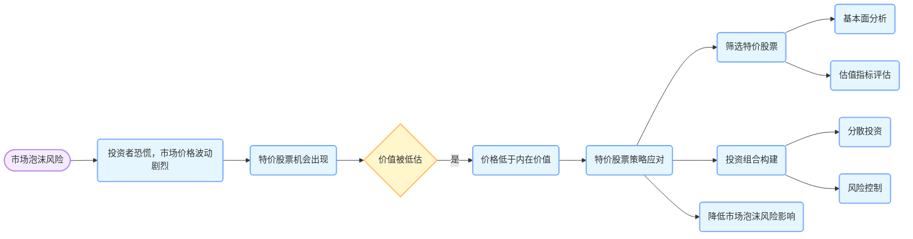

# 如何利用特价股票策略应对市场泡沫风险

> 关键词：特价股票策略、市场泡沫风险、价值投资、股票筛选、风险应对

> 摘要：本文围绕如何利用特价股票策略应对市场泡沫风险展开深入探讨。首先介绍了相关背景知识，包括目的范围、预期读者等内容。接着阐述了特价股票和市场泡沫的核心概念及联系，通过流程图直观展示其关系。详细讲解了核心算法原理及具体操作步骤，给出Python代码示例。同时，运用数学模型和公式对策略进行分析，并举例说明。通过项目实战，从开发环境搭建到源代码实现与解读，全面介绍了策略的实际应用。还探讨了该策略在不同场景下的应用，推荐了学习、开发工具及相关论文著作。最后总结了未来发展趋势与挑战，解答常见问题并提供扩展阅读与参考资料，旨在帮助投资者有效运用特价股票策略抵御市场泡沫风险。

## 1. 背景介绍 
### 1.1 目的和范围
在金融市场中，市场泡沫是一个常见且具有潜在危险的现象。当市场泡沫破裂时，往往会给投资者带来巨大的损失。本文章的目的在于介绍一种特价股票策略，帮助投资者在市场泡沫时期更好地保护自己的资产，实现资产的保值增值。我们将详细探讨特价股票策略的原理、实施步骤、数学模型以及实际应用等方面，范围涵盖了从理论到实践的各个环节，旨在为投资者提供一套完整的应对市场泡沫风险的解决方案。

### 1.2 预期读者
本文的预期读者主要包括各类投资者，无论是个人投资者还是机构投资者，只要对股票投资感兴趣，希望在市场泡沫环境下找到更有效的投资策略，都可以从本文中获得有价值的信息。同时，金融专业的学生、研究人员以及对金融市场有深入研究的人士也可以通过本文进一步了解特价股票策略的相关知识和应用。

### 1.3 文档结构概述
本文将按照以下结构进行组织：首先介绍背景知识，包括目的、预期读者和文档结构等；接着阐述特价股票和市场泡沫的核心概念及联系，并通过流程图展示；然后详细讲解核心算法原理和具体操作步骤，给出Python代码示例；运用数学模型和公式对策略进行分析，并举例说明；通过项目实战介绍策略的实际应用，包括开发环境搭建、源代码实现与解读；探讨该策略在不同场景下的应用；推荐学习、开发工具及相关论文著作；最后总结未来发展趋势与挑战，解答常见问题并提供扩展阅读与参考资料。

### 1.4 术语表
#### 1.4.1 核心术语定义
- **特价股票**：指那些市场价格低于其内在价值的股票。内在价值是指根据公司的基本面分析，如盈利能力、资产状况、行业前景等因素，估算出的股票应有的价值。
- **市场泡沫**：指资产价格在短期内迅速上涨，远远超过其内在价值的现象。市场泡沫通常是由投资者的过度乐观情绪、投机行为等因素引起的。
- **价值投资**：一种投资策略，强调通过分析公司的基本面，寻找被低估的股票进行投资，以获得长期的投资回报。

#### 1.4.2 相关概念解释
- **市盈率（PE）**：指股票价格与每股盈利的比率，是衡量股票估值的常用指标之一。较低的市盈率可能意味着股票被低估。
- **市净率（PB）**：指股票价格与每股净资产的比率，反映了股票价格相对于公司净资产的倍数。较低的市净率可能表示股票具有较高的投资价值。
- **股息率**：指股息与股票价格的比率，反映了投资者从股票中获得的股息收益。较高的股息率可能意味着股票具有较好的投资价值。

#### 1.4.3 缩略词列表
- **PE**：Price-to-Earnings Ratio，市盈率
- **PB**：Price-to-Book Ratio，市净率

## 2. 核心概念与联系 

### 核心概念原理
#### 特价股票
特价股票的核心原理基于价值投资的理念。价值投资者认为，股票的价格会围绕其内在价值波动。当市场情绪过度悲观或者投资者对公司的基本面存在误解时，股票价格可能会低于其内在价值，从而形成特价股票。投资者通过深入分析公司的财务报表、行业前景、竞争优势等因素，估算出股票的内在价值，然后寻找那些价格低于内在价值的股票进行投资。

#### 市场泡沫
市场泡沫的形成通常是由于投资者的过度乐观情绪和投机行为导致的。当市场上出现一些利好消息或者热门题材时，投资者往往会盲目跟风买入股票，导致股票价格迅速上涨。随着价格的不断攀升，越来越多的投资者被吸引进入市场，进一步推动价格上涨，形成一种自我强化的循环。然而，当市场的基本面无法支撑过高的价格时，泡沫就会破裂，股票价格会迅速下跌。

### 架构的文本示意图
```plaintext
市场泡沫风险
|
|-- 投资者恐慌，市场价格波动剧烈
|
|-- 特价股票机会出现
|       |
|       |-- 价值被低估
|       |-- 价格低于内在价值
|
|-- 特价股票策略应对
|       |
|       |-- 筛选特价股票
|       |       |
|       |       |-- 基本面分析
|       |       |-- 估值指标评估
|       |
|       |-- 投资组合构建
|       |       |
|       |       |-- 分散投资
|       |       |-- 风险控制
|
|-- 降低市场泡沫风险影响
```

### Mermaid 流程图


## 3. 核心算法原理 & 具体操作步骤 

### 核心算法原理
特价股票策略的核心算法原理是通过对股票的基本面和估值指标进行分析，筛选出那些价格低于内在价值的股票。具体来说，我们可以使用以下几个步骤来实现：
1. **数据收集**：收集股票的财务数据、市场数据等信息，包括市盈率、市净率、股息率、营业收入、净利润等。
2. **基本面分析**：对公司的基本面进行分析，评估公司的盈利能力、资产状况、行业前景等因素。
3. **估值指标计算**：根据收集到的数据，计算股票的估值指标，如市盈率、市净率等。
4. **筛选特价股票**：根据估值指标和基本面分析的结果，筛选出那些价格低于内在价值的股票。

### 具体操作步骤及Python代码示例
```python
import pandas as pd

# 步骤1：数据收集
# 假设我们已经从某个数据源获取了股票的财务数据和市场数据
# 这里使用一个简单的示例数据框来表示
data = {
    '股票代码': ['000001', '000002', '000003'],
    '市盈率': [10, 20, 15],
    '市净率': [1.5, 2.5, 2.0],
    '股息率': [0.05, 0.03, 0.04],
    '营业收入': [1000, 2000, 1500],
    '净利润': [100, 200, 150]
}
df = pd.DataFrame(data)

# 步骤2：基本面分析
# 这里我们简单地根据营业收入和净利润的增长情况来评估公司的盈利能力
# 假设我们已经有了上一年度的营业收入和净利润数据
last_year_revenue = [900, 1800, 1400]
last_year_profit = [90, 180, 130]
df['营业收入增长率'] = (df['营业收入'] - last_year_revenue) / last_year_revenue
df['净利润增长率'] = (df['净利润'] - last_year_profit) / last_year_profit

# 步骤3：估值指标计算
# 这里我们已经有了市盈率和市净率数据，无需再次计算

# 步骤4：筛选特价股票
# 我们可以设置一些筛选条件，如市盈率低于某个阈值，市净率低于某个阈值，股息率高于某个阈值等
pe_threshold = 18
pb_threshold = 2.2
dividend_threshold = 0.03
filtered_df = df[(df['市盈率'] < pe_threshold) & (df['市净率'] < pb_threshold) & (df['股息率'] > dividend_threshold)]

print("筛选出的特价股票：")
print(filtered_df)
```

## 4. 数学模型和公式 & 详细讲解 & 举例说明 

### 数学模型和公式
#### 市盈率（PE）
市盈率是股票价格与每股盈利的比率，计算公式为：
$$PE = \frac{P}{EPS}$$
其中，$P$ 表示股票价格，$EPS$ 表示每股盈利。

#### 市净率（PB）
市净率是股票价格与每股净资产的比率，计算公式为：
$$PB = \frac{P}{BVPS}$$
其中，$P$ 表示股票价格，$BVPS$ 表示每股净资产。

#### 股息率
股息率是股息与股票价格的比率，计算公式为：
$$股息率 = \frac{D}{P}$$
其中，$D$ 表示股息，$P$ 表示股票价格。

### 详细讲解
- **市盈率（PE）**：市盈率是衡量股票估值的常用指标之一。较低的市盈率可能意味着股票被低估，具有较高的投资价值。然而，市盈率也受到公司盈利增长速度、行业特点等因素的影响。例如，一些高成长的科技公司可能具有较高的市盈率，因为投资者对其未来的盈利增长有较高的预期。
- **市净率（PB）**：市净率反映了股票价格相对于公司净资产的倍数。较低的市净率可能表示股票具有较高的投资价值，因为投资者可以以较低的价格购买到公司的净资产。但是，市净率也受到公司资产质量、行业特点等因素的影响。例如，一些重资产行业的公司可能具有较低的市净率，而一些轻资产行业的公司可能具有较高的市净率。
- **股息率**：股息率反映了投资者从股票中获得的股息收益。较高的股息率可能意味着股票具有较好的投资价值，因为投资者可以获得稳定的现金流。然而，股息率也受到公司盈利状况、股息政策等因素的影响。例如，一些成长型公司可能会将大部分利润用于再投资，而较少分红，因此股息率较低。

### 举例说明
假设某股票的价格为 $P = 20$ 元，每股盈利为 $EPS = 2$ 元，每股净资产为 $BVPS = 10$ 元，股息为 $D = 0.5$ 元。
- **市盈率（PE）**：
$$PE = \frac{P}{EPS} = \frac{20}{2} = 10$$
这意味着投资者需要支付 10 倍的每股盈利来购买该股票。
- **市净率（PB）**：
$$PB = \frac{P}{BVPS} = \frac{20}{10} = 2$$
这表示股票价格是每股净资产的 2 倍。
- **股息率**：
$$股息率 = \frac{D}{P} = \frac{0.5}{20} = 0.025 = 2.5\%$$
这意味着投资者每年可以从该股票中获得 2.5% 的股息收益。

## 5. 项目实战：代码实际案例和详细解释说明 

### 5.1  开发环境搭建
- **Python 安装**：首先需要安装 Python 编程语言，建议使用 Python 3.7 及以上版本。可以从 Python 官方网站（https://www.python.org/downloads/）下载并安装适合自己操作系统的版本。
- **开发工具**：推荐使用 Anaconda 作为 Python 的开发环境，它集成了许多常用的科学计算库和工具。可以从 Anaconda 官方网站（https://www.anaconda.com/products/individual）下载并安装。
- **必要的库安装**：在 Anaconda 环境中，打开命令行工具，使用以下命令安装必要的库：
```sh
pip install pandas numpy matplotlib
```

### 5.2  源代码详细实现和代码解读
```python
import pandas as pd
import numpy as np
import matplotlib.pyplot as plt

# 步骤1：数据收集
# 假设我们从 CSV 文件中读取股票数据
data = pd.read_csv('stock_data.csv')

# 步骤2：数据预处理
# 处理缺失值
data = data.dropna()

# 步骤3：基本面分析
# 计算营业收入增长率和净利润增长率
data['营业收入增长率'] = (data['营业收入'] - data['上一年度营业收入']) / data['上一年度营业收入']
data['净利润增长率'] = (data['净利润'] - data['上一年度净利润']) / data['上一年度净利润']

# 步骤4：估值指标计算
# 计算市盈率和市净率
data['市盈率'] = data['股票价格'] / data['每股盈利']
data['市净率'] = data['股票价格'] / data['每股净资产']

# 步骤5：筛选特价股票
# 设置筛选条件
pe_threshold = 20
pb_threshold = 2.5
revenue_growth_threshold = 0.1
profit_growth_threshold = 0.1

filtered_data = data[
    (data['市盈率'] < pe_threshold) &
    (data['市净率'] < pb_threshold) &
    (data['营业收入增长率'] > revenue_growth_threshold) &
    (data['净利润增长率'] > profit_growth_threshold)
]

# 步骤6：可视化分析
plt.figure(figsize=(10, 6))
plt.scatter(filtered_data['市盈率'], filtered_data['市净率'], c='blue', label='特价股票')
plt.xlabel('市盈率')
plt.ylabel('市净率')
plt.title('特价股票的市盈率和市净率分布')
plt.legend()
plt.grid(True)
plt.show()

# 步骤7：输出筛选结果
print("筛选出的特价股票：")
print(filtered_data[['股票代码', '股票名称', '市盈率', '市净率', '营业收入增长率', '净利润增长率']])
```

### 代码解读与分析
- **数据收集**：使用 `pandas` 库的 `read_csv` 函数从 CSV 文件中读取股票数据。
- **数据预处理**：使用 `dropna` 函数处理数据中的缺失值，确保数据的完整性。
- **基本面分析**：计算营业收入增长率和净利润增长率，评估公司的盈利能力。
- **估值指标计算**：根据股票价格、每股盈利和每股净资产计算市盈率和市净率。
- **筛选特价股票**：设置筛选条件，筛选出市盈率低于 20、市净率低于 2.5、营业收入增长率大于 10% 且净利润增长率大于 10% 的股票。
- **可视化分析**：使用 `matplotlib` 库绘制散点图，展示特价股票的市盈率和市净率分布。
- **输出筛选结果**：打印筛选出的特价股票的相关信息，包括股票代码、股票名称、市盈率、市净率、营业收入增长率和净利润增长率。

## 6. 实际应用场景 
### 市场泡沫初期
在市场泡沫初期，投资者往往对市场充满乐观情绪，股票价格普遍上涨。此时，使用特价股票策略可以帮助投资者发现那些被市场忽视的、价格低于内在价值的股票。通过提前布局这些特价股票，投资者可以在市场泡沫破裂时减少损失，并在市场恢复正常时获得较高的回报。

### 市场泡沫高峰期
在市场泡沫高峰期，股票价格已经远远超过其内在价值，市场风险巨大。此时，投资者可以利用特价股票策略，将投资组合中的部分高价股票转换为特价股票，降低投资组合的整体风险。同时，持有特价股票可以在市场泡沫破裂时提供一定的安全边际。

### 市场泡沫破裂后
在市场泡沫破裂后，股票价格大幅下跌，市场情绪极度悲观。此时，特价股票策略可以帮助投资者发现那些被过度抛售的股票，以较低的价格买入，等待市场反弹。通过在市场底部布局特价股票，投资者可以获得较高的投资回报。

## 7. 工具和资源推荐
### 7.1 学习资源推荐
#### 7.1.1 书籍推荐
- 《聪明的投资者》（The Intelligent Investor）：本杰明·格雷厄姆（Benjamin Graham）的经典著作，被誉为价值投资的圣经，详细介绍了价值投资的理念和方法。
- 《证券分析》（Security Analysis）：同样是本杰明·格雷厄姆的著作，对证券分析的基本原理和方法进行了系统的阐述，是学习价值投资的重要参考书籍。
- 《巴菲特致股东的信：股份公司教程》（The Essays of Warren Buffett: Lessons for Corporate America）：沃伦·巴菲特（Warren Buffett）写给股东的信的汇编，包含了巴菲特的投资理念、方法和经验，对投资者具有很高的借鉴价值。

#### 7.1.2 在线课程
- Coursera 上的“投资学原理”（Principles of Investing）课程：由知名教授授课，系统介绍了投资学的基本原理和方法，包括股票投资、债券投资、投资组合管理等内容。
- edX 上的“金融市场”（Financial Markets）课程：耶鲁大学教授罗伯特·席勒（Robert Shiller）主讲，深入探讨了金融市场的运行机制和投资策略，对理解市场泡沫和投资风险具有重要意义。

#### 7.1.3 技术博客和网站
- 雪球网（https://xueqiu.com/）：国内知名的财经社区，提供股票行情、财经新闻、投资分析等服务，投资者可以在上面交流投资经验和分享投资观点。
- 价值大师网（https://www.gurufocus.com/）：专注于价值投资的网站，提供股票估值、财务分析、投资策略等工具和信息，帮助投资者发现被低估的股票。

### 7.2 开发工具框架推荐
#### 7.2.1 IDE和编辑器
- PyCharm：一款专业的 Python 集成开发环境，提供代码编辑、调试、版本控制等功能，适合专业开发者使用。
- Jupyter Notebook：一种交互式的开发环境，支持 Python 代码的编写、运行和可视化展示，适合数据分析师和研究者使用。

#### 7.2.2 调试和性能分析工具
- pdb：Python 自带的调试工具，可以帮助开发者定位代码中的错误和问题。
- cProfile：Python 标准库中的性能分析工具，可以分析代码的运行时间和资源消耗情况，帮助开发者优化代码性能。

#### 7.2.3 相关框架和库
- pandas：用于数据处理和分析的 Python 库，提供了丰富的数据结构和数据操作方法，适合处理股票数据。
- numpy：用于科学计算的 Python 库，提供了高效的数组操作和数学函数，是许多数据科学库的基础。
- matplotlib：用于数据可视化的 Python 库，提供了丰富的绘图功能，适合展示股票数据和分析结果。

### 7.3 相关论文著作推荐
#### 7.3.1 经典论文
- “The Capital Asset Pricing Model: Theory and Evidence”（资本资产定价模型：理论与证据）：由威廉·夏普（William Sharpe）等人撰写，对资本资产定价模型进行了系统的阐述和实证研究，是现代金融理论的重要基础。
- “Efficient Capital Markets: A Review of Theory and Empirical Work”（有效资本市场：理论与实证研究综述）：由尤金·法玛（Eugene Fama）撰写，对有效市场假说进行了全面的总结和评价，对理解金融市场的运行机制具有重要意义。

#### 7.3.2 最新研究成果
- 关注顶级金融学术期刊，如《Journal of Finance》（金融杂志）、《Review of Financial Studies》（金融研究评论）等，这些期刊上发表了许多关于金融市场和投资策略的最新研究成果。

#### 7.3.3 应用案例分析
- 可以参考一些专业的金融研究报告和案例分析书籍，了解特价股票策略在实际应用中的具体案例和效果，从中学习经验和教训。

## 8. 总结：未来发展趋势与挑战
### 未来发展趋势
- **智能化和自动化**：随着人工智能和机器学习技术的不断发展，特价股票策略的筛选和分析过程将越来越智能化和自动化。投资者可以利用算法模型快速筛选出符合条件的特价股票，提高投资效率。
- **多元化和全球化**：投资者将更加注重投资组合的多元化和全球化，不仅关注国内市场的特价股票，还会将目光投向国际市场。通过在不同地区和行业分散投资，降低投资风险。
- **数据驱动的决策**：数据在投资决策中的作用将越来越重要。投资者将利用更多的数据来源，如社交媒体数据、宏观经济数据等，进行更全面的分析和决策。

### 挑战
- **数据质量和可靠性**：特价股票策略依赖于大量的财务数据和市场数据，数据的质量和可靠性直接影响策略的效果。然而，数据可能存在错误、缺失或滞后等问题，需要投资者进行仔细的甄别和处理。
- **市场不确定性**：金融市场充满了不确定性，市场泡沫的形成和破裂具有很大的随机性。即使使用特价股票策略，也无法完全避免市场风险。投资者需要具备较强的风险意识和应对能力。
- **竞争加剧**：随着特价股票策略的普及，越来越多的投资者将采用该策略，市场竞争将加剧。这可能导致特价股票的数量减少，筛选难度增加，投资回报降低。

## 9. 附录：常见问题与解答
### 1. 特价股票策略一定能在市场泡沫中盈利吗？
特价股票策略并不能保证在市场泡沫中一定盈利。市场泡沫的形成和破裂具有很大的不确定性，即使是被低估的股票，在市场泡沫破裂时也可能会受到影响而下跌。然而，特价股票策略可以帮助投资者降低投资风险，提高在市场泡沫中的生存能力，并在市场恢复正常时获得较高的回报。

### 2. 如何确定股票的内在价值？
确定股票的内在价值是一个复杂的过程，需要综合考虑公司的基本面、行业前景、宏观经济环境等因素。常用的方法包括现金流折现法、相对估值法等。现金流折现法是通过预测公司未来的现金流，并将其折现到当前价值来估算股票的内在价值；相对估值法是通过与同行业其他公司的估值指标进行比较，来估算股票的内在价值。

### 3. 特价股票策略需要多长时间才能看到效果？
特价股票策略通常是一种长期投资策略，需要一定的时间才能看到效果。市场的波动和公司的发展都需要时间来体现，投资者需要有耐心和长期投资的理念。一般来说，持有特价股票的时间可能需要几年甚至更长时间，才能获得较好的投资回报。

### 4. 如何选择适合自己的特价股票筛选指标？
选择适合自己的特价股票筛选指标需要考虑自己的投资目标、风险承受能力和投资经验等因素。一般来说，可以选择一些常见的估值指标，如市盈率、市净率、股息率等，同时结合公司的基本面指标，如营业收入增长率、净利润增长率等，进行综合筛选。投资者也可以根据自己的研究和经验，选择其他适合自己的筛选指标。

## 10. 扩展阅读 & 参考资料
### 扩展阅读
- 《金融炼金术》（The Alchemy of Finance）：乔治·索罗斯（George Soros）的著作，深入探讨了金融市场的反身性原理和投资策略，对理解市场泡沫和投资风险具有重要启示。
- 《非理性繁荣》（Irrational Exuberance）：罗伯特·席勒（Robert Shiller）的著作，分析了金融市场中的非理性行为和市场泡沫的形成机制，提供了应对市场泡沫的建议。

### 参考资料
- 相关的财经新闻网站，如新浪财经、腾讯财经等，提供了及时的股票市场信息和财经新闻。
- 金融数据提供商，如万得资讯、东方财富等，提供了丰富的股票数据和金融分析工具。

作者：AI天才研究院/AI Genius Institute & 禅与计算机程序设计艺术 /Zen And The Art of Computer Programming