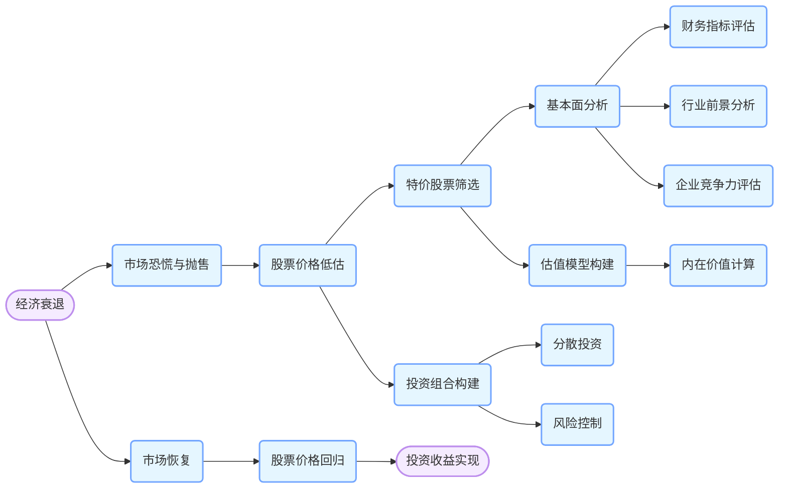

# 如何利用特价股票策略应对经济衰退

> 关键词：特价股票策略、经济衰退、股票投资、价值分析、风险管理

> 摘要：本文聚焦于在经济衰退背景下，如何运用特价股票策略进行投资。首先介绍了相关背景知识，包括目的、预期读者、文档结构和术语定义。接着阐述了特价股票策略的核心概念与联系，通过文本示意图和 Mermaid 流程图进行清晰展示。详细讲解了核心算法原理和具体操作步骤，并结合 Python 代码进行说明。还给出了数学模型和公式，辅以举例加深理解。通过项目实战，从开发环境搭建到源代码实现及解读，全方位呈现了策略的应用。探讨了实际应用场景，推荐了学习、开发工具和相关论文著作。最后总结了未来发展趋势与挑战，解答了常见问题并提供了扩展阅读和参考资料，旨在为投资者在经济衰退时期运用特价股票策略提供全面且深入的指导。

## 1. 背景介绍 
### 1.1 目的和范围
在经济衰退时期，金融市场往往面临诸多不确定性和挑战。股票市场的波动加剧，投资者的资产面临缩水风险。本文章的目的在于探讨如何利用特价股票策略来应对经济衰退，为投资者提供一种在不利经济环境下获取收益、降低风险的投资思路。

我们的研究范围主要集中在股票市场，聚焦于特价股票的筛选、分析和投资组合构建。将详细介绍特价股票策略的原理、算法、操作步骤以及实际应用案例，同时会涉及到相关的风险管理和投资决策方法。

### 1.2 预期读者
本文预期读者主要包括以下几类人群：
- **个人投资者**：希望在经济衰退时期优化投资组合，提高投资收益，降低风险的普通股民。
- **金融从业者**：如股票分析师、投资顾问等，他们需要深入了解特价股票策略，为客户提供更专业的投资建议。
- **金融专业学生**：对股票投资和经济衰退应对策略感兴趣，希望通过学习本文加深对相关知识的理解。

### 1.3 文档结构概述
本文将按照以下结构进行组织：
- **核心概念与联系**：介绍特价股票策略的基本概念、原理和架构，通过文本示意图和 Mermaid 流程图进行直观展示。
- **核心算法原理 & 具体操作步骤**：详细讲解特价股票筛选和分析的核心算法，并用 Python 代码实现。
- **数学模型和公式 & 详细讲解 & 举例说明**：给出相关的数学模型和公式，进行详细解释，并通过实际例子加深理解。
- **项目实战：代码实际案例和详细解释说明**：从开发环境搭建开始，逐步实现特价股票策略的代码，并对代码进行解读和分析。
- **实际应用场景**：探讨特价股票策略在不同经济衰退情况下的实际应用场景。
- **工具和资源推荐**：推荐学习、开发工具和相关论文著作，帮助读者进一步深入学习。
- **总结：未来发展趋势与挑战**：总结特价股票策略的未来发展趋势，分析可能面临的挑战。
- **附录：常见问题与解答**：解答读者在学习和应用特价股票策略过程中可能遇到的常见问题。
- **扩展阅读 & 参考资料**：提供相关的扩展阅读材料和参考资料，方便读者进一步研究。

### 1.4 术语表
#### 1.4.1 核心术语定义
- **特价股票**：指那些市场价格低于其内在价值的股票。这些股票可能由于市场情绪、行业周期等原因被低估。
- **经济衰退**：指经济活动普遍放缓、商业萎缩的时期，通常表现为 GDP 负增长、失业率上升、企业盈利下降等。
- **内在价值**：是指股票所代表的企业的真实价值，通常通过对企业的财务状况、盈利能力、行业前景等因素进行分析评估得出。
- **投资组合**：是指投资者将资金分散投资于多种不同的股票或其他资产，以降低单一资产的风险。

#### 1.4.2 相关概念解释
- **价值投资**：是一种投资策略，强调寻找被低估的股票，即价格低于内在价值的股票，并长期持有，等待价格回归价值。
- **基本面分析**：是一种通过研究企业的财务报表、行业竞争地位、管理团队等基本面因素来评估股票内在价值的方法。
- **技术分析**：是一种通过研究股票价格和成交量的历史数据，运用各种技术指标和图表来预测股票未来走势的方法。

#### 1.4.3 缩略词列表
- **PE**：市盈率（Price-to-Earnings Ratio），是指股票价格与每股收益的比率，用于衡量股票的估值水平。
- **PB**：市净率（Price-to-Book Ratio），是指股票价格与每股净资产的比率，用于衡量股票的账面价值与市场价格的关系。
- **ROE**：净资产收益率（Return on Equity），是指企业净利润与净资产的比率，用于衡量企业的盈利能力。

## 2. 核心概念与联系 

### 特价股票策略的基本原理
特价股票策略的核心思想是在经济衰退时期，市场往往会出现过度恐慌和抛售，导致一些优质股票的价格被大幅低估。投资者可以通过深入的基本面分析，寻找那些价格低于内在价值的特价股票，并在合适的时机买入，等待市场恢复理性，股票价格回归其内在价值，从而获得投资收益。

### 核心概念架构

下面是特价股票策略的核心概念架构的文本示意图：

```plaintext
经济衰退
|
|-- 市场恐慌与抛售
|       |
|       |-- 股票价格低估
|               |
|               |-- 特价股票筛选
|               |       |
|               |       |-- 基本面分析
|               |       |       |
|               |       |       |-- 财务指标评估（PE、PB、ROE等）
|               |       |       |-- 行业前景分析
|               |       |       |-- 企业竞争力评估
|               |       |
|               |       |-- 估值模型构建
|               |               |
|               |               |-- 内在价值计算
|               |
|               |-- 投资组合构建
|                       |
|                       |-- 分散投资
|                       |-- 风险控制
|
|-- 市场恢复
|       |
|       |-- 股票价格回归
|               |
|               |-- 投资收益实现
```

### Mermaid 流程图



从流程图可以看出，在经济衰退阶段，市场的恐慌和抛售导致股票价格低估，投资者通过特价股票筛选和基本面分析找到潜在的特价股票，构建投资组合并进行风险控制。当市场恢复时，股票价格回归其内在价值，投资者实现投资收益。

## 3. 核心算法原理 & 具体操作步骤 

### 核心算法原理

特价股票策略的核心算法主要包括两个部分：特价股票筛选和投资组合构建。

#### 特价股票筛选
特价股票筛选的关键在于找到价格低于内在价值的股票。我们可以通过以下步骤实现：
1. **数据收集**：收集股票的历史价格、财务报表、行业数据等信息。
2. **财务指标计算**：计算股票的市盈率（PE）、市净率（PB）、净资产收益率（ROE）等财务指标。
3. **估值模型构建**：选择合适的估值模型，如现金流折现模型（DCF）、相对估值模型等，计算股票的内在价值。
4. **筛选条件设定**：根据财务指标和内在价值，设定筛选条件，如 PE 低于行业平均水平、PB 低于一定阈值、内在价值高于当前价格等。
5. **股票筛选**：根据筛选条件，从所有股票中筛选出符合条件的特价股票。

#### 投资组合构建
投资组合构建的目标是在降低风险的前提下，实现投资收益的最大化。我们可以通过以下步骤实现：
1. **资产配置**：确定投资组合中不同股票的权重，可以根据股票的风险收益特征、行业分布等因素进行配置。
2. **风险评估**：计算投资组合的风险指标，如标准差、夏普比率等，评估投资组合的风险水平。
3. **优化调整**：根据风险评估结果，对投资组合进行优化调整，如增加低风险股票的权重、减少高风险股票的权重等。

### 具体操作步骤及 Python 代码实现

#### 数据收集
我们可以使用 Python 的第三方库 `pandas-datareader` 来收集股票的历史价格数据，使用 `yfinance` 库来收集股票的财务报表数据。

```python
import pandas as pd
import pandas_datareader.data as web
import yfinance as yf

# 定义股票代码和时间范围
ticker = 'AAPL'
start_date = '2020-01-01'
end_date = '2023-01-01'

# 收集股票历史价格数据
price_data = web.DataReader(ticker, 'yahoo', start_date, end_date)

# 收集股票财务报表数据
stock = yf.Ticker(ticker)
financials = stock.financials
balance_sheet = stock.balance_sheet
cashflow = stock.cashflow
```

#### 财务指标计算
根据收集到的财务报表数据，我们可以计算股票的市盈率（PE）、市净率（PB）、净资产收益率（ROE）等财务指标。

```python
# 计算市盈率（PE）
earnings_per_share = financials.loc['Net Income'] / balance_sheet.loc['Common Stock']
pe_ratio = price_data['Close'] / earnings_per_share

# 计算市净率（PB）
book_value_per_share = balance_sheet.loc['Total Stockholder Equity'] / balance_sheet.loc['Common Stock']
pb_ratio = price_data['Close'] / book_value_per_share

# 计算净资产收益率（ROE）
roe = financials.loc['Net Income'] / balance_sheet.loc['Total Stockholder Equity']
```

#### 估值模型构建
这里我们使用相对估值模型，以行业平均市盈率为参考，计算股票的内在价值。

```python
# 假设行业平均市盈率为 20
industry_pe = 20

# 计算股票的内在价值
intrinsic_value = industry_pe * earnings_per_share
```

#### 股票筛选
根据计算得到的财务指标和内在价值，设定筛选条件，筛选出符合条件的特价股票。

```python
# 设定筛选条件
pe_threshold = 15
pb_threshold = 1.5
value_threshold = 1.2  # 内在价值高于当前价格 20%

# 筛选特价股票
is_special_stock = (pe_ratio < pe_threshold) & (pb_ratio < pb_threshold) & (intrinsic_value > price_data['Close'] * value_threshold)
special_stocks = price_data[is_special_stock]
```

#### 投资组合构建
假设我们已经筛选出了多只特价股票，现在需要构建投资组合。我们可以使用等权重法来确定每只股票的权重。

```python
# 假设我们有 3 只特价股票
tickers = ['AAPL', 'MSFT', 'GOOG']
weights = [1/3, 1/3, 1/3]

# 构建投资组合
portfolio = pd.DataFrame()
for ticker in tickers:
    price_data = web.DataReader(ticker, 'yahoo', start_date, end_date)
    portfolio[ticker] = price_data['Close']

# 计算投资组合的收益率
portfolio_returns = portfolio.pct_change()
portfolio_value = (1 + portfolio_returns).cumprod()
portfolio_value['Portfolio'] = (portfolio_value * weights).sum(axis=1)
```

## 4. 数学模型和公式 & 详细讲解 & 举例说明 

### 财务指标计算公式

#### 市盈率（PE）
市盈率是指股票价格与每股收益的比率，用于衡量股票的估值水平。计算公式为：
$$PE = \frac{P}{EPS}$$
其中，$P$ 为股票价格，$EPS$ 为每股收益。

例如，某股票的价格为 50 元，每股收益为 2 元，则该股票的市盈率为：
$$PE = \frac{50}{2} = 25$$

#### 市净率（PB）
市净率是指股票价格与每股净资产的比率，用于衡量股票的账面价值与市场价格的关系。计算公式为：
$$PB = \frac{P}{BVPS}$$
其中，$P$ 为股票价格，$BVPS$ 为每股净资产。

例如，某股票的价格为 50 元，每股净资产为 10 元，则该股票的市净率为：
$$PB = \frac{50}{10} = 5$$

#### 净资产收益率（ROE）
净资产收益率是指企业净利润与净资产的比率，用于衡量企业的盈利能力。计算公式为：
$$ROE = \frac{Net Income}{Total Stockholder Equity}$$
其中，$Net Income$ 为企业净利润，$Total Stockholder Equity$ 为企业净资产。

例如，某企业的净利润为 1000 万元，净资产为 5000 万元，则该企业的净资产收益率为：
$$ROE = \frac{1000}{5000} = 0.2 = 20\%$$

### 现金流折现模型（DCF）
现金流折现模型是一种常用的估值模型，通过预测企业未来的现金流，并将其折现到当前时刻，来计算企业的内在价值。计算公式为：
$$V = \sum_{t=1}^{n} \frac{FCF_t}{(1 + r)^t} + \frac{TV}{(1 + r)^n}$$
其中，$V$ 为企业的内在价值，$FCF_t$ 为第 $t$ 期的自由现金流，$r$ 为折现率，$n$ 为预测期数，$TV$ 为终值。

例如，假设某企业未来 3 年的自由现金流分别为 100 万元、120 万元、150 万元，折现率为 10%，预测期结束后的终值为 1000 万元，则该企业的内在价值为：
$$V = \frac{100}{(1 + 0.1)^1} + \frac{120}{(1 + 0.1)^2} + \frac{150}{(1 + 0.1)^3} + \frac{1000}{(1 + 0.1)^3}$$
$$V = \frac{100}{1.1} + \frac{120}{1.21} + \frac{150}{1.331} + \frac{1000}{1.331}$$
$$V \approx 90.91 + 99.17 + 112.69 + 751.31$$
$$V \approx 1054.08 \text{（万元）}$$

### 投资组合风险计算公式

#### 标准差
标准差是衡量投资组合风险的常用指标，计算公式为：
$$\sigma_p = \sqrt{\sum_{i=1}^{n} \sum_{j=1}^{n} w_i w_j \sigma_i \sigma_j \rho_{ij}}$$
其中，$\sigma_p$ 为投资组合的标准差，$w_i$ 和 $w_j$ 分别为第 $i$ 只和第 $j$ 只股票的权重，$\sigma_i$ 和 $\sigma_j$ 分别为第 $i$ 只和第 $j$ 只股票的标准差，$\rho_{ij}$ 为第 $i$ 只和第 $j$ 只股票的相关系数。

例如，假设投资组合中有两只股票，权重分别为 0.5 和 0.5，标准差分别为 0.2 和 0.3，相关系数为 0.5，则投资组合的标准差为：
$$\sigma_p = \sqrt{0.5^2 \times 0.2^2 + 0.5^2 \times 0.3^2 + 2 \times 0.5 \times 0.5 \times 0.2 \times 0.3 \times 0.5}$$
$$\sigma_p = \sqrt{0.01 + 0.0225 + 0.015}$$
$$\sigma_p = \sqrt{0.0475} \approx 0.218$$

#### 夏普比率
夏普比率是衡量投资组合风险调整后收益的指标，计算公式为：
$$Sharpe Ratio = \frac{R_p - R_f}{\sigma_p}$$
其中，$R_p$ 为投资组合的预期收益率，$R_f$ 为无风险收益率，$\sigma_p$ 为投资组合的标准差。

例如，假设投资组合的预期收益率为 15%，无风险收益率为 3%，标准差为 0.2，则该投资组合的夏普比率为：
$$Sharpe Ratio = \frac{0.15 - 0.03}{0.2} = 0.6$$

## 5. 项目实战：代码实际案例和详细解释说明 

### 5.1  开发环境搭建

#### 安装 Python
首先，需要安装 Python 编程语言。可以从 Python 官方网站（https://www.python.org/downloads/） 下载适合你操作系统的 Python 安装包，并按照安装向导进行安装。

#### 安装必要的库
在安装好 Python 后，需要安装一些必要的库，如 `pandas`、`pandas-datareader`、`yfinance` 等。可以使用以下命令进行安装：
```sh
pip install pandas pandas-datareader yfinance
```

### 5.2  源代码详细实现和代码解读

以下是一个完整的特价股票策略项目实战代码：

```python
import pandas as pd
import pandas_datareader.data as web
import yfinance as yf

# 定义股票代码列表和时间范围
tickers = ['AAPL', 'MSFT', 'GOOG', 'AMZN', 'FB']
start_date = '2020-01-01'
end_date = '2023-01-01'

# 收集股票历史价格数据和财务报表数据
price_data = {}
financials = {}
balance_sheet = {}
cashflow = {}
for ticker in tickers:
    price_data[ticker] = web.DataReader(ticker, 'yahoo', start_date, end_date)
    stock = yf.Ticker(ticker)
    financials[ticker] = stock.financials
    balance_sheet[ticker] = stock.balance_sheet
    cashflow[ticker] = stock.cashflow

# 计算财务指标
pe_ratio = {}
pb_ratio = {}
roe = {}
for ticker in tickers:
    earnings_per_share = financials[ticker].loc['Net Income'] / balance_sheet[ticker].loc['Common Stock']
    pe_ratio[ticker] = price_data[ticker]['Close'] / earnings_per_share
    book_value_per_share = balance_sheet[ticker].loc['Total Stockholder Equity'] / balance_sheet[ticker].loc['Common Stock']
    pb_ratio[ticker] = price_data[ticker]['Close'] / book_value_per_share
    roe[ticker] = financials[ticker].loc['Net Income'] / balance_sheet[ticker].loc['Total Stockholder Equity']

# 假设行业平均市盈率为 20，计算股票的内在价值
industry_pe = 20
intrinsic_value = {}
for ticker in tickers:
    earnings_per_share = financials[ticker].loc['Net Income'] / balance_sheet[ticker].loc['Common Stock']
    intrinsic_value[ticker] = industry_pe * earnings_per_share

# 设定筛选条件
pe_threshold = 15
pb_threshold = 1.5
value_threshold = 1.2  # 内在价值高于当前价格 20%

# 筛选特价股票
special_stocks = []
for ticker in tickers:
    is_special_stock = (pe_ratio[ticker].iloc[-1] < pe_threshold) & (pb_ratio[ticker].iloc[-1] < pb_threshold) & (intrinsic_value[ticker].iloc[-1] > price_data[ticker]['Close'].iloc[-1] * value_threshold)
    if is_special_stock:
        special_stocks.append(ticker)

# 构建投资组合
if len(special_stocks) > 0:
    weights = [1/len(special_stocks)] * len(special_stocks)
    portfolio = pd.DataFrame()
    for ticker in special_stocks:
        portfolio[ticker] = price_data[ticker]['Close']
    portfolio_returns = portfolio.pct_change()
    portfolio_value = (1 + portfolio_returns).cumprod()
    portfolio_value['Portfolio'] = (portfolio_value * weights).sum(axis=1)

    # 计算投资组合的收益率和风险指标
    portfolio_return = portfolio_value['Portfolio'].iloc[-1] - 1
    portfolio_std = portfolio_returns['Portfolio'].std()
    print(f"投资组合收益率: {portfolio_return:.2%}")
    print(f"投资组合标准差: {portfolio_std:.2%}")
else:
    print("未筛选出符合条件的特价股票。")
```

### 5.3  代码解读与分析

#### 数据收集部分
```python
price_data = {}
financials = {}
balance_sheet = {}
cashflow = {}
for ticker in tickers:
    price_data[ticker] = web.DataReader(ticker, 'yahoo', start_date, end_date)
    stock = yf.Ticker(ticker)
    financials[ticker] = stock.financials
    balance_sheet[ticker] = stock.balance_sheet
    cashflow[ticker] = stock.cashflow
```
这部分代码通过 `pandas-datareader` 库从雅虎财经收集股票的历史价格数据，通过 `yfinance` 库收集股票的财务报表数据，并将数据存储在字典中，方便后续处理。

#### 财务指标计算部分
```python
pe_ratio = {}
pb_ratio = {}
roe = {}
for ticker in tickers:
    earnings_per_share = financials[ticker].loc['Net Income'] / balance_sheet[ticker].loc['Common Stock']
    pe_ratio[ticker] = price_data[ticker]['Close'] / earnings_per_share
    book_value_per_share = balance_sheet[ticker].loc['Total Stockholder Equity'] / balance_sheet[ticker].loc['Common Stock']
    pb_ratio[ticker] = price_data[ticker]['Close'] / book_value_per_share
    roe[ticker] = financials[ticker].loc['Net Income'] / balance_sheet[ticker].loc['Total Stockholder Equity']
```
这部分代码根据收集到的财务报表数据，计算每只股票的市盈率（PE）、市净率（PB）和净资产收益率（ROE），并将结果存储在字典中。

#### 内在价值计算部分
```python
industry_pe = 20
intrinsic_value = {}
for ticker in tickers:
    earnings_per_share = financials[ticker].loc['Net Income'] / balance_sheet[ticker].loc['Common Stock']
    intrinsic_value[ticker] = industry_pe * earnings_per_share
```
这部分代码使用相对估值模型，以行业平均市盈率为参考，计算每只股票的内在价值，并将结果存储在字典中。

#### 股票筛选部分
```python
pe_threshold = 15
pb_threshold = 1.5
value_threshold = 1.2  # 内在价值高于当前价格 20%

special_stocks = []
for ticker in tickers:
    is_special_stock = (pe_ratio[ticker].iloc[-1] < pe_threshold) & (pb_ratio[ticker].iloc[-1] < pb_threshold) & (intrinsic_value[ticker].iloc[-1] > price_data[ticker]['Close'].iloc[-1] * value_threshold)
    if is_special_stock:
        special_stocks.append(ticker)
```
这部分代码根据设定的筛选条件，筛选出符合条件的特价股票，并将股票代码存储在列表中。

#### 投资组合构建部分
```python
if len(special_stocks) > 0:
    weights = [1/len(special_stocks)] * len(special_stocks)
    portfolio = pd.DataFrame()
    for ticker in special_stocks:
        portfolio[ticker] = price_data[ticker]['Close']
    portfolio_returns = portfolio.pct_change()
    portfolio_value = (1 + portfolio_returns).cumprod()
    portfolio_value['Portfolio'] = (portfolio_value * weights).sum(axis=1)

    # 计算投资组合的收益率和风险指标
    portfolio_return = portfolio_value['Portfolio'].iloc[-1] - 1
    portfolio_std = portfolio_returns['Portfolio'].std()
    print(f"投资组合收益率: {portfolio_return:.2%}")
    print(f"投资组合标准差: {portfolio_std:.2%}")
else:
    print("未筛选出符合条件的特价股票。")
```
这部分代码根据筛选出的特价股票构建投资组合，使用等权重法确定每只股票的权重。计算投资组合的收益率和标准差，并输出结果。如果未筛选出符合条件的特价股票，则输出相应的提示信息。

## 6. 实际应用场景 

### 经济衰退初期
在经济衰退初期，市场开始出现恐慌情绪，股票价格普遍下跌。此时，投资者可以利用特价股票策略，通过深入的基本面分析，寻找那些被市场过度抛售的优质股票。这些股票可能由于行业周期性波动、短期业绩下滑等原因被低估，但企业的基本面仍然良好，具有较强的竞争力和发展潜力。投资者可以在价格低估时买入这些股票，等待市场恢复理性，股票价格回归其内在价值。

例如，在 2008 年全球金融危机初期，许多金融股和房地产股的价格大幅下跌。一些投资者通过分析企业的财务状况和行业前景，发现了一些被低估的优质股票，如摩根大通、富国银行等。他们在股价低迷时买入这些股票，并在市场逐渐恢复后获得了丰厚的回报。

### 经济衰退中期
在经济衰退中期，市场的恐慌情绪进一步加剧，股票价格持续下跌。此时，特价股票的数量可能会增加，但市场的不确定性也会增大。投资者在使用特价股票策略时，需要更加谨慎地进行基本面分析，同时要加强风险管理。可以适当增加投资组合中低风险股票的权重，如消费类、公用事业类股票，以降低投资组合的整体风险。

例如，在 2020 年新冠疫情引发的经济衰退中期，许多旅游、航空、酒店等行业的股票价格暴跌。一些投资者在分析了企业的现金流状况和行业复苏前景后，选择了一些具有较强抗风险能力的消费类股票，如可口可乐、宝洁等，作为投资组合的一部分。这些股票在经济衰退期间表现相对稳定，为投资者提供了一定的收益保障。

### 经济衰退后期
在经济衰退后期，市场开始逐渐企稳，股票价格可能会出现反弹。此时，投资者可以利用特价股票策略，对前期买入的股票进行评估和调整。如果股票的价格已经回归其内在价值，或者企业的基本面发生了不利变化，可以考虑卖出股票，实现投资收益。同时，也可以继续寻找新的特价股票，为下一轮投资做好准备。

例如，在 2009 年全球金融危机后期，随着经济逐渐复苏，股票市场开始反弹。一些投资者对前期买入的金融股和房地产股进行了评估，发现部分股票的价格已经大幅上涨，达到了预期的收益目标。他们及时卖出这些股票，锁定了投资收益。同时，他们也开始关注一些新兴行业的股票，如科技股、新能源股等，寻找新的投资机会。

## 7. 工具和资源推荐
### 7.1 学习资源推荐
#### 7.1.1 书籍推荐
- 《聪明的投资者》（The Intelligent Investor）：作者本杰明·格雷厄姆（Benjamin Graham），被誉为价值投资的圣经。本书详细介绍了价值投资的理念和方法，对特价股票策略的学习具有重要的指导意义。
- 《证券分析》（Security Analysis）：同样是本杰明·格雷厄姆的经典著作，深入阐述了股票和债券的分析方法，是学习基本面分析的必备书籍。
- 《巴菲特致股东的信》（Letters to Shareholders of Berkshire Hathaway）：作者沃伦·巴菲特（Warren Buffett），收录了巴菲特历年致股东的信。通过阅读这些信件，可以了解巴菲特的投资理念和决策过程，对特价股票策略的应用有很大的启发。

#### 7.1.2 在线课程
- Coursera 上的“投资学原理”（Principles of Investing）：该课程由知名教授授课，系统介绍了投资学的基本原理和方法，包括股票投资、债券投资、投资组合理论等内容。
- edX 上的“金融市场”（Financial Markets）：由耶鲁大学教授罗伯特·席勒（Robert Shiller）主讲，课程涵盖了金融市场的各个方面，对理解经济衰退和股票市场的关系有很大帮助。
- 中国大学 MOOC 上的“证券投资学”：国内多所高校联合开设的课程，结合中国股票市场的实际情况，介绍了证券投资的基本理论和实践方法。

#### 7.1.3 技术博客和网站
- Seeking Alpha（https://seekingalpha.com/）：一个专业的金融投资博客网站，提供大量的股票分析文章和投资策略建议。
- Motley Fool（https://www.fool.com/）：专注于个人投资和财务规划的网站，有许多关于股票投资的实用文章和分析报告。
- 雪球（https://xueqiu.com/）：国内知名的投资社区，汇聚了众多投资者和专业人士，提供股票行情、分析讨论、投资策略分享等服务。

### 7.2 开发工具框架推荐
#### 7.2.1 IDE和编辑器
- PyCharm：一款专业的 Python 集成开发环境（IDE），具有强大的代码编辑、调试、版本控制等功能，适合开发大型的 Python 项目。
- Jupyter Notebook：一个交互式的开发环境，支持 Python、R 等多种编程语言。可以方便地进行数据分析、可视化和代码演示，非常适合进行特价股票策略的研究和实验。
- Visual Studio Code：一款轻量级的代码编辑器，支持多种编程语言和插件扩展。具有丰富的代码提示、调试功能，并且可以与 Git 等版本控制系统集成，是开发 Python 项目的不错选择。

#### 7.2.2 调试和性能分析工具
- pdb：Python 内置的调试器，可以帮助开发者逐行调试代码，查找程序中的错误。
- cProfile：Python 标准库中的性能分析工具，可以统计程序中各个函数的执行时间和调用次数，帮助开发者找出性能瓶颈。
- Py-Spy：一个轻量级的 Python 性能分析工具，可以在不修改代码的情况下对 Python 程序进行性能分析，实时显示函数的调用栈和执行时间。

#### 7.2.3 相关框架和库
- pandas：一个强大的数据处理和分析库，提供了丰富的数据结构和数据操作方法，非常适合处理股票历史价格数据和财务报表数据。
- numpy：一个用于科学计算的 Python 库，提供了高效的多维数组对象和各种数学函数，在投资组合构建和风险计算中经常使用。
- scikit-learn：一个机器学习库，提供了各种机器学习算法和工具，可用于股票价格预测、投资组合优化等方面的研究。

### 7.3 相关论文著作推荐
#### 7.3.1 经典论文
- Fama, E. F., & French, K. R. (1992). The cross-section of expected stock returns. Journal of Finance, 47(2), 427-465. 该论文提出了著名的 Fama-French 三因子模型，用于解释股票收益率的差异，对股票投资和资产定价理论有重要影响。
- Sharpe, W. F. (1964). Capital asset prices: A theory of market equilibrium under conditions of risk. The Journal of Finance, 19(3), 425-442. 该论文提出了资本资产定价模型（CAPM），为投资组合理论和风险管理提供了重要的理论基础。

#### 7.3.2 最新研究成果
- Barro, R. J., & Ursúa, J. F. (2020). Macroeconomic crises since 1870. Journal of Economic Perspectives, 34(4), 107-132. 该论文研究了自 1870 年以来的宏观经济危机，分析了经济衰退的特征和影响，对理解经济衰退时期的投资环境有一定的参考价值。
- Giglio, S., Maggiori, M., & Stroebel, J. (2021). Discount rates. Annual Review of Financial Economics, 13, 1-36. 该论文对贴现率进行了深入研究，贴现率是现金流折现模型中的重要参数，对股票估值有重要影响。

#### 7.3.3 应用案例分析
- Asness, C. S., Frazzini, A., & Pedersen, L. H. (2019). Quality minus junk. The Journal of Financial Economics, 131(2), 349-378. 该论文通过实证研究，分析了优质股票和垃圾股票的表现差异，为投资者选择优质特价股票提供了参考。
- Ang, A., Goetzmann, W. N., & Schaefer, S. M. (2018). The history of factor investing. Journal of Portfolio Management, 44(4), 32-45. 该论文回顾了因子投资的历史，介绍了各种因子投资策略在不同市场环境下的表现，对特价股票策略的应用有一定的启示。

## 8. 总结：未来发展趋势与挑战

### 未来发展趋势
#### 智能化与自动化
随着人工智能和机器学习技术的不断发展，特价股票策略将越来越智能化和自动化。投资者可以利用机器学习算法对大量的股票数据进行分析和挖掘，快速筛选出符合条件的特价股票。同时，自动化交易系统可以根据预设的策略自动进行买卖操作，提高投资效率和决策的准确性。

#### 多因子融合
未来的特价股票策略将不仅仅依赖于传统的财务指标，还会融合更多的因子，如市场情绪因子、技术分析因子、宏观经济因子等。通过综合考虑多个因子，可以更全面地评估股票的价值和风险，提高投资组合的收益和稳定性。

#### 全球化投资
随着全球经济一体化的发展，投资者将有更多的机会进行全球化投资。特价股票策略也将不再局限于本国市场，而是可以在全球范围内寻找被低估的股票。这将为投资者带来更广阔的投资视野和更多的投资机会。

### 挑战
#### 数据质量和可靠性
特价股票策略的有效性依赖于准确和可靠的数据。然而，在实际应用中，数据质量可能会受到各种因素的影响，如数据采集误差、数据造假等。因此，如何确保数据的质量和可靠性是投资者面临的一个重要挑战。

#### 市场不确定性
经济衰退时期，市场的不确定性增大，股票价格的波动更加剧烈。即使投资者通过特价股票策略找到了被低估的股票，也无法保证股票价格一定会回归其内在价值。市场情绪、宏观经济政策等因素都可能导致股票价格的异常波动，给投资带来风险。

#### 竞争加剧
随着特价股票策略的普及，越来越多的投资者开始关注和应用该策略。这将导致市场上的竞争加剧，特价股票的数量可能会减少，获取超额收益的难度也会增加。投资者需要不断提高自己的分析能力和决策水平，才能在竞争中脱颖而出。

## 9. 附录：常见问题与解答

### 问题 1：如何确定股票的内在价值？
确定股票的内在价值是特价股票策略的关键。常见的方法有现金流折现模型（DCF）、相对估值模型（如市盈率法、市净率法）等。现金流折现模型通过预测企业未来的现金流，并将其折现到当前时刻来计算内在价值；相对估值模型则是通过与同行业其他股票或市场平均水平进行比较，来评估股票的价值。在实际应用中，需要综合考虑多种因素，如企业的财务状况、行业前景、竞争地位等，选择合适的估值方法。

### 问题 2：特价股票一定能带来投资收益吗？
不一定。虽然特价股票是指价格低于内在价值的股票，但市场是复杂多变的，股票价格受到多种因素的影响，如市场情绪、宏观经济政策、企业基本面变化等。即使股票被低估，也可能由于市场的不确定性而导致价格继续下跌，或者价格长期无法回归其内在价值。因此，在投资特价股票时，需要进行充分的基本面分析和风险管理，同时要有耐心和长期投资的理念。

### 问题 3：如何进行投资组合的风险管理？
投资组合的风险管理可以从以下几个方面入手：
- **分散投资**：将资金分散投资于不同行业、不同类型的股票，降低单一股票的风险。
- **控制仓位**：合理控制每只股票的投资仓位，避免过度集中投资。
- **设定止损点**：在投资前设定止损点，当股票价格下跌到一定程度时，及时卖出股票，控制损失。
- **定期评估和调整**：定期对投资组合进行评估和调整，根据市场情况和股票的基本面变化，及时调整投资组合的结构。

### 问题 4：特价股票策略在不同市场环境下的效果如何？
特价股票策略在不同市场环境下的效果可能会有所不同。在经济衰退时期，市场往往会出现过度恐慌和抛售，导致一些优质股票的价格被大幅低估，此时特价股票策略可能会取得较好的效果。在市场繁荣时期，股票价格普遍较高，特价股票的数量可能会减少，策略的效果可能会受到一定的影响。然而，无论市场环境如何，通过深入的基本面分析，寻找被低估的股票始终是一种有效的投资策略。

## 10. 扩展阅读 & 参考资料

### 扩展阅读
- 《金融炼金术》（The Alchemy of Finance）：作者乔治·索罗斯（George Soros），介绍了索罗斯的投资哲学和操作方法，对理解金融市场的运行机制和投资策略有很大帮助。
- 《非理性繁荣》（Irrational Exuberance）：作者罗伯特·席勒（Robert Shiller），分析了金融市场中的非理性行为和泡沫现象，对投资者在经济衰退时期保持理性投资具有重要的启示作用。
- 《漫步华尔街》（A Random Walk Down Wall Street）：作者伯顿·马尔基尔（Burton Malkiel），探讨了股票市场的随机性和有效性，介绍了各种投资策略的优缺点，是一本适合投资者入门的书籍。

### 参考资料
- Yahoo Finance（https://finance.yahoo.com/）：提供全球股票市场的行情数据、财务报表、新闻资讯等信息，是获取股票数据的重要来源之一。
- Bloomberg（https://www.bloomberg.com/）：全球知名的金融信息服务提供商，提供实时金融市场数据、分析报告、财经新闻等内容。
- SEC（https://www.sec.gov/）：美国证券交易委员会的官方网站，提供上市公司的财务报告、监管文件等信息，对进行基本面分析有很大帮助。

作者：AI天才研究院/AI Genius Institute & 禅与计算机程序设计艺术 /Zen And The Art of Computer Programming