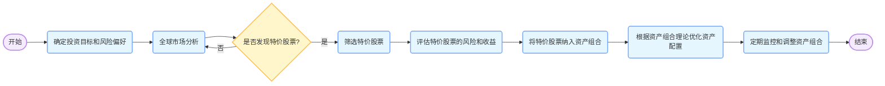

# 如何利用特价股票策略进行全球资产配置

> 关键词：特价股票策略、全球资产配置、价值投资、风险管理、股票筛选、资产组合优化、投资回报

> 摘要：本文旨在深入探讨如何利用特价股票策略进行全球资产配置。首先介绍了相关的背景知识，包括目的、预期读者、文档结构和术语表。接着阐述了核心概念，如特价股票和全球资产配置的原理及联系，并通过流程图展示其逻辑关系。详细讲解了核心算法原理，结合 Python 代码给出具体操作步骤。同时，引入数学模型和公式对策略进行量化分析并举例说明。通过项目实战，从开发环境搭建到源代码实现与解读，展示了如何运用该策略。还探讨了实际应用场景，推荐了相关的工具和资源。最后总结了未来发展趋势与挑战，提供了常见问题解答和扩展阅读参考资料，帮助投资者更好地理解和运用特价股票策略进行全球资产配置，实现资产的保值增值。

## 1. 背景介绍 
### 1.1 目的和范围
随着全球经济一体化的发展，投资者面临着越来越多的投资机会和选择。全球资产配置作为一种重要的投资策略，能够帮助投资者分散风险、提高投资回报。而特价股票策略则是在全球范围内寻找被低估的股票，以获取超额收益。本文的目的在于为投资者提供一个全面、系统的指导，介绍如何利用特价股票策略进行全球资产配置。范围涵盖了特价股票的筛选、全球资产配置的原则和方法、相关算法和数学模型，以及实际应用案例和工具资源推荐等方面。

### 1.2 预期读者
本文预期读者包括有一定投资基础的个人投资者、专业的投资机构从业者、金融分析师以及对全球资产配置和特价股票策略感兴趣的研究人员。希望通过本文的讲解，能够帮助读者深入理解相关概念和方法，提升投资决策能力。

### 1.3 文档结构概述
本文共分为十个部分。第一部分为背景介绍，阐述了目的、预期读者、文档结构和术语表。第二部分讲解核心概念与联系，包括特价股票和全球资产配置的原理、架构及流程图。第三部分介绍核心算法原理和具体操作步骤，并用 Python 代码详细阐述。第四部分给出数学模型和公式，进行详细讲解和举例说明。第五部分是项目实战，包括开发环境搭建、源代码实现和代码解读。第六部分探讨实际应用场景。第七部分推荐相关的工具和资源，包括学习资源、开发工具框架和论文著作。第八部分总结未来发展趋势与挑战。第九部分是附录，提供常见问题与解答。第十部分为扩展阅读和参考资料。

### 1.4 术语表
#### 1.4.1 核心术语定义
- **特价股票**：指市场价格低于其内在价值的股票。内在价值是基于公司的基本面分析，如财务状况、盈利能力、行业前景等因素评估得出的股票真实价值。
- **全球资产配置**：将投资资金分散到全球不同国家和地区的各类资产中，包括股票、债券、基金、房地产等，以降低单一市场或资产的风险，实现投资组合的优化。
- **价值投资**：一种投资策略，强调通过分析公司的内在价值，寻找被低估的股票进行投资，长期持有以获取价值回归带来的收益。
- **风险溢价**：投资者因承担额外风险而要求的额外回报。在股票投资中，风险溢价是指股票预期收益率与无风险收益率之间的差额。

#### 1.4.2 相关概念解释
- **资产组合理论**：由哈里·马科维茨（Harry Markowitz）提出，该理论认为投资者可以通过分散投资来降低风险，在给定风险水平下实现预期收益最大化，或在给定预期收益水平下实现风险最小化。
- **有效前沿**：在资产组合理论中，有效前沿是指在风险 - 收益平面上，所有有效资产组合构成的曲线。有效资产组合是指在给定风险水平下预期收益最高，或在给定预期收益水平下风险最小的资产组合。
- **贝塔系数（β）**：衡量股票相对于市场波动的敏感性指标。β 值大于 1 表示股票的波动幅度大于市场平均水平，β 值小于 1 表示股票的波动幅度小于市场平均水平。

#### 1.4.3 缩略词列表
- **CAPM**：资本资产定价模型（Capital Asset Pricing Model）
- **ETF**：交易型开放式指数基金（Exchange - Traded Fund）
- **PE**：市盈率（Price - Earnings Ratio）
- **PB**：市净率（Price - Book Ratio）

## 2. 核心概念与联系 

### 2.1 特价股票的原理
特价股票的核心原理基于价值投资理念。价值投资者认为，市场有时会出现定价错误，导致某些股票的市场价格低于其内在价值。内在价值是由公司的基本面因素决定的，如公司的盈利能力、资产质量、现金流状况、行业竞争地位等。通过对这些基本面因素的深入分析，投资者可以估算出股票的内在价值，并与市场价格进行比较。如果市场价格低于内在价值，那么该股票就被认为是特价股票，具有投资价值。

### 2.2 全球资产配置的原理
全球资产配置的原理基于资产组合理论。不同国家和地区的经济发展周期、政治环境、货币政策等因素存在差异，导致各类资产的表现也不尽相同。通过将投资资金分散到全球不同的资产中，可以降低单一市场或资产的风险。例如，当某个国家的经济衰退导致该国股票市场下跌时，其他国家的股票市场可能因为经济增长而表现良好，从而平衡投资组合的收益。同时，全球资产配置还可以利用不同资产之间的相关性，进一步优化投资组合的风险 - 收益特征。

### 2.3 特价股票策略与全球资产配置的联系
特价股票策略是全球资产配置中的一种重要方法。在全球范围内寻找特价股票，可以扩大投资机会集，增加投资组合的潜在收益。同时，将特价股票纳入全球资产配置的投资组合中，可以进一步分散风险。因为不同国家和地区的特价股票可能受到不同因素的影响，它们之间的相关性相对较低。通过合理配置不同国家和地区的特价股票，可以降低投资组合的整体风险，提高投资组合的稳定性。

### 2.4 核心概念架构的文本示意图
```plaintext
全球资产配置
├── 资产类别
│   ├── 股票
│   │   ├── 特价股票
│   │   ├── 非特价股票
│   ├── 债券
│   ├── 基金
│   ├── 房地产
│   └── 其他资产
├── 地区分布
│   ├── 发达国家
│   │   ├── 美国
│   │   ├── 欧洲
│   │   ├── 日本
│   ├── 新兴市场
│   │   ├── 中国
│   │   ├── 印度
│   │   ├── 巴西
└── 配置原则
    ├── 分散风险
    ├── 优化收益
    ├── 长期投资
```

### 2.5 Mermaid 流程图


## 3. 核心算法原理 & 具体操作步骤 

### 3.1 核心算法原理
#### 3.1.1 特价股票筛选算法
特价股票筛选算法的核心是通过比较股票的市场价格和内在价值来判断股票是否被低估。常见的方法是使用估值指标，如市盈率（PE）、市净率（PB）、股息率等。一般来说，较低的市盈率和市净率，较高的股息率表明股票可能被低估。同时，还可以结合公司的财务指标，如净资产收益率（ROE）、净利润增长率等，来评估公司的盈利能力和成长潜力。

#### 3.1.2 资产组合优化算法
资产组合优化算法的目标是在给定风险水平下实现预期收益最大化，或在给定预期收益水平下实现风险最小化。常用的算法是基于马科维茨的资产组合理论，通过计算资产之间的协方差矩阵和预期收益率，求解有效前沿。在有效前沿上选择合适的资产组合，以满足投资者的风险偏好和投资目标。

### 3.2 具体操作步骤
#### 3.2.1 数据收集
首先，需要收集全球股票市场的相关数据，包括股票的价格、财务报表、行业信息等。可以通过金融数据提供商，如 Bloomberg、Wind、Yahoo Finance 等获取数据。

#### 3.2.2 特价股票筛选
使用 Python 代码实现特价股票筛选算法。以下是一个简单的示例：
```python
import pandas as pd

# 假设我们已经从数据源获取了股票数据，存储在 DataFrame 中
# 数据包含列：'symbol'（股票代码）, 'price'（股票价格）, 'pe_ratio'（市盈率）, 'pb_ratio'（市净率）, 'dividend_yield'（股息率）
stock_data = pd.read_csv('stock_data.csv')

# 定义筛选条件
pe_threshold = 15
pb_threshold = 1.5
dividend_yield_threshold = 0.03

# 筛选特价股票
bargain_stocks = stock_data[(stock_data['pe_ratio'] < pe_threshold) & 
                            (stock_data['pb_ratio'] < pb_threshold) & 
                            (stock_data['dividend_yield'] > dividend_yield_threshold)]

print(bargain_stocks)
```
#### 3.2.3 资产组合优化
使用 Python 的 `cvxpy` 库实现资产组合优化算法。以下是一个简单的示例：
```python
import cvxpy as cp
import numpy as np

# 假设我们已经计算了股票的预期收益率和协方差矩阵
expected_returns = np.array([0.1, 0.12, 0.15])
cov_matrix = np.array([[0.04, 0.02, 0.01],
                       [0.02, 0.06, 0.03],
                       [0.01, 0.03, 0.08]])

# 定义变量
weights = cp.Variable(len(expected_returns))

# 定义目标函数：最大化预期收益
objective = cp.Maximize(weights @ expected_returns)

# 定义约束条件
constraints = [cp.sum(weights) == 1,  # 权重之和为 1
               weights >= 0,  # 权重非负
               cp.quad_form(weights, cov_matrix) <= 0.05]  # 风险不超过 0.05

# 构建问题并求解
prob = cp.Problem(objective, constraints)
prob.solve()

# 输出最优权重
print("最优权重:", weights.value)
```

## 4. 数学模型和公式 & 详细讲解 & 举例说明 

### 4.1 股票内在价值评估模型
#### 4.1.1 股息贴现模型（DDM）
股息贴现模型是一种基于股票未来股息现金流的估值模型。其基本公式为：
$$V = \sum_{t = 1}^{\infty} \frac{D_t}{(1 + r)^t}$$
其中，$V$ 表示股票的内在价值，$D_t$ 表示第 $t$ 期的股息，$r$ 表示贴现率。

#### 4.1.2 详细讲解
股息贴现模型的基本思想是，股票的价值等于其未来所有股息的现值之和。贴现率 $r$ 反映了投资者对股票投资的预期收益率，通常可以使用资本资产定价模型（CAPM）来计算：
$$r = R_f+\beta\times(R_m - R_f)$$
其中，$R_f$ 表示无风险收益率，$\beta$ 表示股票的贝塔系数，$R_m$ 表示市场组合的预期收益率。

#### 4.1.3 举例说明
假设某股票每年的股息为 $2$ 元，贴现率为 $10\%$，则该股票的内在价值为：
$$V=\frac{2}{0.1}=20\text{ 元}$$
如果该股票的市场价格为 $15$ 元，则说明该股票被低估，具有投资价值。

### 4.2 资产组合理论模型
#### 4.2.1 预期收益率公式
资产组合的预期收益率是组合中各资产预期收益率的加权平均值，公式为：
$$E(R_p)=\sum_{i = 1}^{n}w_i\times E(R_i)$$
其中，$E(R_p)$ 表示资产组合的预期收益率，$w_i$ 表示第 $i$ 种资产的权重，$E(R_i)$ 表示第 $i$ 种资产的预期收益率。

#### 4.2.2 风险（方差）公式
资产组合的风险（方差）不仅取决于各资产的风险，还取决于资产之间的相关性，公式为：
$$\sigma_p^2=\sum_{i = 1}^{n}\sum_{j = 1}^{n}w_i\times w_j\times\sigma_{ij}$$
其中，$\sigma_p^2$ 表示资产组合的方差，$\sigma_{ij}$ 表示第 $i$ 种资产和第 $j$ 种资产的协方差。当 $i = j$ 时，$\sigma_{ij}=\sigma_i^2$，即第 $i$ 种资产的方差。

#### 4.2.3 详细讲解
资产组合理论认为，通过分散投资可以降低非系统性风险，但无法消除系统性风险。在构建资产组合时，需要考虑资产之间的相关性，选择相关性较低的资产进行组合，以降低组合的风险。同时，需要在风险和收益之间进行权衡，选择最优的资产组合。

#### 4.2.4 举例说明
假设有两种资产 A 和 B，预期收益率分别为 $10\%$ 和 $15\%$，权重分别为 $0.6$ 和 $0.4$，资产 A 的方差为 $0.04$，资产 B 的方差为 $0.09$，资产 A 和 B 的协方差为 $0.02$。则资产组合的预期收益率和方差分别为：
$$E(R_p)=0.6\times0.1 + 0.4\times0.15=0.12$$
$$\sigma_p^2=0.6^2\times0.04+0.4^2\times0.09 + 2\times0.6\times0.4\times0.02=0.0336$$

## 5. 项目实战：代码实际案例和详细解释说明 

### 5.1  开发环境搭建
#### 5.1.1 安装 Python
首先，需要安装 Python 开发环境。可以从 Python 官方网站（https://www.python.org/downloads/）下载适合自己操作系统的 Python 版本，并按照安装向导进行安装。

#### 5.1.2 安装必要的库
在命令行中使用 `pip` 命令安装必要的库，如 `pandas`、`numpy`、`cvxpy` 等。示例命令如下：
```sh
pip install pandas numpy cvxpy
```

#### 5.1.3 数据准备
从金融数据提供商获取全球股票市场的相关数据，并将其保存为 CSV 文件。数据应包含股票的基本信息、财务指标、价格等。

### 5.2  源代码详细实现和代码解读
#### 5.2.1 数据加载和预处理
```python
import pandas as pd

# 加载股票数据
stock_data = pd.read_csv('stock_data.csv')

# 数据预处理：去除缺失值
stock_data = stock_data.dropna()

# 选择需要的列
selected_columns = ['symbol', 'price', 'pe_ratio', 'pb_ratio', 'dividend_yield', 'roe', 'net_income_growth']
stock_data = stock_data[selected_columns]

print(stock_data.head())
```
**代码解读**：
- `pd.read_csv('stock_data.csv')`：从 CSV 文件中加载股票数据。
- `stock_data.dropna()`：去除数据中的缺失值，以确保数据的完整性。
- `stock_data[selected_columns]`：选择需要的列，方便后续的分析和处理。

#### 5.2.2 特价股票筛选
```python
# 定义筛选条件
pe_threshold = 15
pb_threshold = 1.5
dividend_yield_threshold = 0.03
roe_threshold = 0.1
net_income_growth_threshold = 0.05

# 筛选特价股票
bargain_stocks = stock_data[(stock_data['pe_ratio'] < pe_threshold) & 
                            (stock_data['pb_ratio'] < pb_threshold) & 
                            (stock_data['dividend_yield'] > dividend_yield_threshold) & 
                            (stock_data['roe'] > roe_threshold) & 
                            (stock_data['net_income_growth'] > net_income_growth_threshold)]

print(bargain_stocks)
```
**代码解读**：
- 定义了多个筛选条件，包括市盈率、市净率、股息率、净资产收益率和净利润增长率。
- 使用布尔索引筛选出满足所有条件的特价股票。

#### 5.2.3 资产组合优化
```python
import cvxpy as cp
import numpy as np

# 假设我们已经计算了特价股票的预期收益率和协方差矩阵
expected_returns = np.array([0.1, 0.12, 0.15, 0.18, 0.2])
cov_matrix = np.array([[0.04, 0.02, 0.01, 0.005, 0.003],
                       [0.02, 0.06, 0.03, 0.015, 0.008],
                       [0.01, 0.03, 0.08, 0.02, 0.01],
                       [0.005, 0.015, 0.02, 0.1, 0.03],
                       [0.003, 0.008, 0.01, 0.03, 0.12]])

# 定义变量
weights = cp.Variable(len(expected_returns))

# 定义目标函数：最大化预期收益
objective = cp.Maximize(weights @ expected_returns)

# 定义约束条件
constraints = [cp.sum(weights) == 1,  # 权重之和为 1
               weights >= 0,  # 权重非负
               cp.quad_form(weights, cov_matrix) <= 0.05]  # 风险不超过 0.05

# 构建问题并求解
prob = cp.Problem(objective, constraints)
prob.solve()

# 输出最优权重
print("最优权重:", weights.value)
```
**代码解读**：
- 假设已经计算了特价股票的预期收益率和协方差矩阵。
- 使用 `cvxpy` 库定义变量、目标函数和约束条件。
- 构建优化问题并求解，得到最优的资产组合权重。

### 5.3  代码解读与分析
#### 5.3.1 数据处理部分
数据处理部分主要负责数据的加载、清洗和选择。去除缺失值可以避免因数据不完整而导致的分析误差。选择需要的列可以减少数据的冗余，提高分析效率。

#### 5.3.2 特价股票筛选部分
特价股票筛选部分通过设置多个筛选条件，综合考虑了股票的估值、盈利能力和成长潜力。只有同时满足所有条件的股票才被认为是特价股票，这样可以提高筛选的准确性。

#### 5.3.3 资产组合优化部分
资产组合优化部分使用了 `cvxpy` 库来求解最优的资产组合权重。通过最大化预期收益并控制风险，得到了一个在给定风险水平下预期收益最大的资产组合。

## 6. 实际应用场景 
### 6.1 个人投资者
对于个人投资者来说，利用特价股票策略进行全球资产配置可以帮助他们实现资产的保值增值。个人投资者可以根据自己的风险偏好和投资目标，选择合适的特价股票进行投资，并将其纳入全球资产配置的投资组合中。例如，一个风险偏好较低的个人投资者可以选择一些股息率较高、估值较低的特价股票，并适当配置一些债券和基金，以降低投资组合的风险。

### 6.2 投资机构
投资机构可以利用特价股票策略进行全球资产配置，以获取超额收益。投资机构通常具有更专业的研究团队和更丰富的资源，可以对全球股票市场进行更深入的分析和研究，筛选出更优质的特价股票。同时，投资机构可以通过大规模的资产配置，实现风险的分散和收益的优化。例如，一些对冲基金可以利用特价股票策略进行套利交易，获取市场定价错误带来的收益。

### 6.3 养老金和保险资金
养老金和保险资金通常具有长期投资的特点，对资产的安全性和稳定性要求较高。利用特价股票策略进行全球资产配置可以帮助养老金和保险资金实现资产的长期增值。这些资金可以选择一些业绩稳定、股息率较高的特价股票，并结合债券等固定收益类资产进行配置，以降低投资组合的风险，确保资金的安全性和收益的稳定性。

## 7. 工具和资源推荐
### 7.1 学习资源推荐
#### 7.1.1 书籍推荐
- 《聪明的投资者》（The Intelligent Investor）：本杰明·格雷厄姆（Benjamin Graham）著，被誉为价值投资的圣经，详细介绍了价值投资的理念和方法。
- 《金融炼金术》（The Alchemy of Finance）：乔治·索罗斯（George Soros）著，讲述了索罗斯的投资哲学和实践经验，对理解市场的复杂性和不确定性有很大帮助。
- 《漫步华尔街》（A Random Walk Down Wall Street）：伯顿·马尔基尔（Burton Malkiel）著，介绍了各种投资策略和市场理论，是一本适合初学者的投资入门书籍。

#### 7.1.2 在线课程
- Coursera 上的“投资学原理”（Principles of Investing）课程：由耶鲁大学教授陈志武主讲，系统介绍了投资学的基本原理和方法。
- edX 上的“金融市场”（Financial Markets）课程：由耶鲁大学教授罗伯特·席勒（Robert Shiller）主讲，深入探讨了金融市场的运行机制和投资策略。

#### 7.1.3 技术博客和网站
- Seeking Alpha（https://seekingalpha.com/）：提供全球股票市场的分析和研究报告，包括特价股票的推荐和分析。
- Bloomberg（https://www.bloomberg.com/）：全球知名的金融资讯平台，提供实时的金融市场数据、新闻和分析。

### 7.2 开发工具框架推荐
#### 7.2.1 IDE和编辑器
- PyCharm：一款功能强大的 Python 集成开发环境，提供代码编辑、调试、版本控制等功能，适合专业的 Python 开发者。
- Jupyter Notebook：一个交互式的开发环境，支持 Python、R 等多种编程语言，方便进行数据分析和可视化。

#### 7.2.2 调试和性能分析工具
- `pdb`：Python 自带的调试工具，可以帮助开发者定位代码中的错误。
- `cProfile`：Python 自带的性能分析工具，可以分析代码的运行时间和资源占用情况。

#### 7.2.3 相关框架和库
- `pandas`：一个强大的数据分析库，提供了数据结构和数据处理功能，方便进行数据的加载、清洗和分析。
- `numpy`：一个用于科学计算的库，提供了高效的数组操作和数学函数，是许多数据分析和机器学习库的基础。
- `cvxpy`：一个用于凸优化的库，方便实现资产组合优化等优化问题。

### 7.3 相关论文著作推荐
#### 7.3.1 经典论文
- Markowitz, H. M. (1952). Portfolio Selection. The Journal of Finance, 7(1), 77 - 91. 该论文提出了资产组合理论，奠定了现代投资理论的基础。
- Sharpe, W. F. (1964). Capital Asset Prices: A Theory of Market Equilibrium Under Conditions of Risk. The Journal of Finance, 19(3), 425 - 442. 该论文提出了资本资产定价模型（CAPM），用于计算资产的预期收益率。

#### 7.3.2 最新研究成果
可以通过学术数据库，如 IEEE Xplore、ACM Digital Library、ScienceDirect 等，搜索关于全球资产配置和特价股票策略的最新研究成果。

#### 7.3.3 应用案例分析
一些金融研究机构和投资公司会发布关于全球资产配置和特价股票策略的应用案例分析报告，可以通过他们的官方网站或相关金融媒体获取这些报告。

## 8. 总结：未来发展趋势与挑战
### 8.1 未来发展趋势
#### 8.1.1 数字化和智能化
随着人工智能、大数据、区块链等技术的发展，全球资产配置和特价股票策略将越来越数字化和智能化。投资者可以利用这些技术更高效地收集和分析数据，筛选出更优质的特价股票，并实现资产组合的自动化优化。

#### 8.1.2 可持续投资
可持续投资将成为未来全球资产配置的重要趋势。投资者越来越关注企业的环境、社会和治理（ESG）表现，将 ESG 因素纳入投资决策中。特价股票策略也将结合 ESG 因素，筛选出既具有投资价值又符合可持续发展原则的股票。

#### 8.1.3 跨境投资便利化
随着全球经济一体化的深入发展，跨境投资的便利性将不断提高。各国政府和金融机构将采取更多措施，降低跨境投资的门槛和成本，促进全球资产配置的发展。

### 8.2 挑战
#### 8.2.1 市场不确定性
全球金融市场充满了不确定性，如经济衰退、政治动荡、贸易摩擦等。这些不确定性会影响股票市场的表现，增加特价股票策略的实施难度。投资者需要具备更强的风险管理能力，以应对市场的变化。

#### 8.2.2 数据质量和隐私问题
在数字化和智能化的背景下，数据的质量和隐私问题变得尤为重要。不准确或不完整的数据可能导致错误的投资决策，而数据隐私泄露则可能给投资者带来损失。投资者需要选择可靠的数据来源，并加强数据安全和隐私保护。

#### 8.2.3 监管政策变化
不同国家和地区的监管政策存在差异，且监管政策可能会随时发生变化。这些变化可能会影响全球资产配置和特价股票策略的实施。投资者需要及时了解和适应监管政策的变化，确保投资活动的合规性。

## 9. 附录：常见问题与解答
### 9.1 如何确定股票的内在价值？
股票的内在价值可以通过多种方法来确定，如股息贴现模型（DDM）、现金流贴现模型（DCF）、相对估值法等。不同的方法适用于不同类型的公司，投资者可以根据公司的特点和数据的可获取性选择合适的方法。

### 9.2 如何选择合适的贴现率？
贴现率可以使用资本资产定价模型（CAPM）来计算，公式为 $r = R_f+\beta\times(R_m - R_f)$。其中，$R_f$ 可以选择国债收益率作为无风险收益率，$\beta$ 可以通过回归分析等方法计算，$R_m$ 可以选择市场指数的预期收益率。

### 9.3 资产组合优化中如何确定预期收益率和协方差矩阵？
预期收益率可以通过历史数据的统计分析、分析师的预测等方法来确定。协方差矩阵可以根据历史数据计算资产之间的协方差得到。需要注意的是，历史数据不一定能完全反映未来的情况，投资者需要结合市场的变化和自己的判断进行调整。

### 9.4 如何平衡风险和收益？
投资者可以根据自己的风险偏好和投资目标来平衡风险和收益。风险偏好较高的投资者可以适当增加股票等风险资产的配置比例，以获取更高的收益；风险偏好较低的投资者可以增加债券等固定收益类资产的配置比例，以降低投资组合的风险。同时，投资者可以通过分散投资、定期调整资产组合等方法来优化风险 - 收益特征。

## 10. 扩展阅读 & 参考资料
### 10.1 扩展阅读
- 《投资最重要的事》（The Most Important Thing Illuminated）：霍华德·马克斯（Howard Marks）著，讲述了投资中的重要原则和方法，对理解投资的本质有很大帮助。
- 《黑天鹅》（The Black Swan）：纳西姆·尼古拉斯·塔勒布（Nassim Nicholas Taleb）著，探讨了不可预测的重大事件对金融市场的影响，提醒投资者要注意风险管理。

### 10.2 参考资料
- 金融数据提供商的官方网站，如 Bloomberg、Wind、Yahoo Finance 等。
- 学术数据库，如 IEEE Xplore、ACM Digital Library、ScienceDirect 等。
- 金融研究机构和投资公司的报告和研究成果。

作者：AI天才研究院/AI Genius Institute & 禅与计算机程序设计艺术 /Zen And The Art of Computer Programming